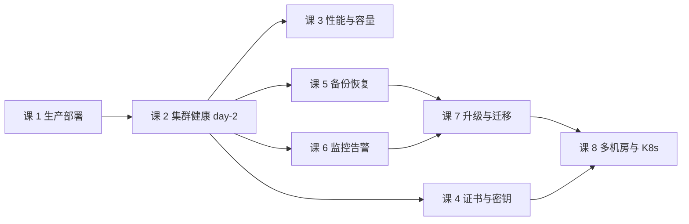

# 运维专项（Consul · 子教程）

> **定位**：面向 **运维 / SRE**——把"Consul 集群怎么搭起来、怎么养住、怎么救回来、怎么升上去"这一整摊事说清。
> **前置**：主线[阶段 2「核心能力拆解」](../../stages/2-核心能力拆解/overview.md)的知识（Raft / Gossip / agent 与 server 角色 / 健康检查语义 / ACL 模型）。子教程**不重复主线内容**，只讲**运维视角**：同一个知识点，主线讲"开发怎么用"，本教程讲"运维怎么养"。
> **怎么进入**：① 已学主线 → 直接按下方课清单学；② 只为运维而来 → 先补主线阶段 2（尤其[课 5 Raft 与 Gossip](../../stages/2-核心能力拆解/lessons/lesson-05-Raft与Gossip一致性成色.md)），或按各课课首的「前置提示」按需回看。

## 与主线的关系

主线[课 11《许可证成本与风险》](../../stages/4-决策落地/lessons/lesson-11-许可证成本与风险.md)把运维当作**成本项**列了「运维五问」：

| 课 11 的运维五问（主线：提及级，只问"谁负责"） | 本教程兑现（讲"怎么做"） |
|---|---|
| 谁负责 quorum 与 leader 健康监控？ | 课 2 集群健康与 day-2 运维 |
| 谁负责三类证书/密钥的轮换？ | 课 4 证书与密钥生命周期 |
| 谁验证过一次真实的快照恢复？ | 课 5 备份、恢复与灾备演练 |
| 谁核验过告警指标的语义？ | 课 6 监控指标与告警（✅ [讲义](lessons/lesson-06-监控指标与告警.md)） |
| 谁负责跟随升级路径？ | 课 7 版本升级与迁移 |

> 课文件尚未生成（进入本教程学习时按 Phase 2 同口径分批生成），故此处为纯文本；生成后改为可点击链接。

> 主线未展开的次角色话题，在本教程逐条兑现；**主线不因本教程而改写**（主线是架构师选型视角，运维深度超出其目标）。

**与 Phase 5 三产物的分工**（互补，不重复）：

| 产物 | 视角 | 回答什么 |
|------|------|---------|
| [08-实战经验.md](../../08-实战经验.md) | 学习态 · 经验 | 不该用在哪、高频故障模式长什么样、落地 Checklist |
| [09-排障速查手册.md](../../09-排障速查手册.md) | 使用态 · 急用 | 已经崩了 → 按症状倒查，条件-动作表（机长 QRH 式） |
| [场景解法库/](../../场景解法库/INDEX.md) | 设计态 · 设计 | 新要求来了 → 解法谱系 + 权衡 |
| **本教程** | **系统学 · 体系** | **还没崩、也没新需求时，平时怎么把它养住**（机制 / 操作 / 体系） |

> 三者按需互引：本教程讲操作时会写"出故障了去查 [09 症状 N]"，讲取舍时会写"设计权衡见 [场景解法库 场景 N]"，但**不重讲它们已有的内容**。

## 课清单

| 课 | 知识点（关键点） | 对应主线提及 |
|----|-----------------|-------------|
| **课 1：生产部署与集群搭建**（✅ [讲义](lessons/lesson-01-生产部署与集群搭建.md)） | 规模与拓扑（server 节点数奇数与 quorum / 单 DC 最小生产形态 / client agent 部署密度）→ 配置落地（关键配置项 / 数据目录与端口 / 以服务方式运行）→ 上线自检（启动后必查的 N 项 / 常见安装坑） | 主线课 3（dev 模式）、课 11「别用 dev 上生产」 |
| **课 2：集群健康与 day-2 运维**（✅ [讲义](lessons/lesson-02-集群健康与day-2运维.md)） | quorum 与 leader 健康怎么看（不是看进程在不在）→ 节点上下线（server 增删 / agent 反注册 / 优雅下线）→ 典型集群异常的处置（leader 震荡 / 节点失联 / 脑裂边界） | 主线课 5（Raft 与 Gossip）、08 故障模式 6、09 症状 3 |
| **课 3：性能、容量与调优**（✅ [讲义](lessons/lesson-03-性能、容量与调优.md)） | 规模边界（服务实例数 / KV 条数 / 写放大）→ 读模式与缓存（stale / 强一致的运维含义）→ 性能相关配置与瓶颈定位（磁盘 I/O / 网络 / 内存） | 主线课 5（三种读模式）、课 4（阻塞查询）、场景 7 |
| **课 4：证书与密钥生命周期**（✅ [讲义](lessons/lesson-04-证书与密钥生命周期.md)） | 三类证书/密钥是什么（gossip key / TLS / Connect CA）→ 签发与分发 → **轮换操作**（各自周期与步骤 / 轮换中的可用性）→ 过期事故预防（监控到期 / 常见漏项） | 主线课 8（ACL 与安全模型）、课 7（Connect）、课 11「三类独立、容易漏」 |
| **课 5：备份、恢复与灾备演练**（✅ [讲义](lessons/lesson-05-备份、恢复与灾备演练.md)） | 快照包含什么（**实测含 CA 全套**，全毁重建后 CA 复活）→ **不包含**什么（agent 配置 / gossip key / TLS 文件 / 未持久化 token）→ 备份策略（定时 / 异地 / 保留）→ **恢复是"全量覆盖"**（快照后数据会丢）→ 演练：怎么验证一次真恢复 | 主线课 11 缺口 #3、09 症状 11（恢复后数据倒退）；**纠正**："不含 CA 私钥"经实测不成立 |
| **课 6：监控指标与告警**（✅ [讲义](lessons/lesson-06-监控指标与告警.md)） | 指标暴露方式（Prometheus 格式 / agent 与集群两层）→ 关键指标清单（quorum / leader 变动 / Raft 提交延迟 / gossip 健康）→ **写告警前的三步核验铁律**（值域 / HELP 行 attribute / 连续采样）→ 告警项建议与静默失效陷阱 | 主线课 11 缺口 #4；沿用 Kafka 课 17 固化的三步核验铁律 |
| **课 7：版本升级与迁移**（✅ [讲义](lessons/lesson-07-版本升级与迁移.md)） | 版本线与支持策略（2.0.x / 1.22.x / 1.21.x）→ **不支持跨多版本跳跃**（须逐级走）→ 升级流程与**可执行的回滚**（含回滚边界：快照恢复是"全量覆盖"，故**回滚不是无代价**——见课 5）→ Consul 与 Envoy 版本兼容矩阵 | 主线课 11 缺口 #5、课 2（版本与许可证现状）；回滚边界回指课 5 |
| **课 8：多机房与 K8s 运维视角**（✅ [讲义](lessons/lesson-08-多机房与K8s运维视角.md)） | 多 DC 联邦的运维现实（查询通道 ≠ 数据副本 / 跨 DC 故障域）→ K8s 上的运维（consul-k8s 组件 / Helm 运维动作 / 与 VM 混布）→ 退出与迁移（下线 Consul 的路径） | 主线课 7（多 DC）、课 12（退出成本）、场景 5 / 6 / 8 |

## 学习路径

- **课 1 是地基**：不先有"能用的生产集群"，后面所有运维动作都无从施展
- **课 2 → 课 3~6 是并列**：集群跑起来后，健康、性能、证书、备份、监控是五条**可按需挑学**的支线（时间紧可先学 2、5、6 三条"保命线"）
- **课 7、课 8 是进阶**：升级与多机房/K8s 建立在前面之上，也最贴近真实事故高发区
- 只解决眼前问题？→ 保命线优先级：**课 2（健康） > 课 6（监控） > 课 5（备份）**

## 内容边界（本教程不做什么）

- **不做 Phase 3 / Phase 5**：不收口综合实战项目、不产领域三产物（那是全课程的收尾，主线已完成）
- **不配应用实战 / 源码解析篇**：子教程按需学习、不进主线进度，其课文件不配 4.2 实战篇与源码解析篇
- **不重复 08 / 09**：故障模式与症状倒查引用它们，不重讲
- **不重讲许可证法律意见**：BUSL 合规判断见[主线课 11](../../stages/4-决策落地/lessons/lesson-11-许可证成本与风险.md) 与[场景 8](../../场景解法库/场景-08-K8s落地与许可证选型.md)；本教程只在课 7 讲"版本线选择"的运维含义

## 学习进度

> 子教程进度独立记录于此（不混主线进度表）；课文件生成并学完后勾选。

- [x] 课 1：生产部署与集群搭建（✅ 2026-09-20 交付，WSL Ubuntu 24.04 + Consul 2.0.2 实测）
- [x] 课 2：集群健康与 day-2 运维（✅ 2026-09-20 交付，实测四处读数 / left-failed / 扩容 voter 提升 / 多数派-少数派）
- [x] 课 3：性能、容量与调优（✅ 2026-09-20 交付，实测两条 413 硬边界 / 写放大 / stale 陈旧窗口 / 42 倍吞吐差）
- [x] 课 4：证书与密钥生命周期（✅ 2026-09-20 交付，实测三类凭证独立 / CA 三级 TTL / keyring empty / 改配置≠轮换）
- [x] 课 5：备份、恢复与灾备演练（✅ 2026-09-20 交付，实测全毁重建 CA 复活 / 快照含 CA 私钥 / 全量覆盖）
- [x] 课 6：监控指标与告警（✅ 2026-09-20 交付，实测双重命名空壳恒 0 / 静默失效 vs 永久误报 / 三步核验 / 9 组断言）
- [x] 课 7：版本升级与迁移（✅ 2026-09-20 交付，实测 quorum 停机上限 / 停2台写失败 / 回滚代价：老数据回、新数据全丢）
- [x] 课 8：多机房与 K8s 运维视角（✅ 2026-09-20 交付，实测：联邦=查询通道非数据副本 / 故障域隔离 / WAN检测40s / leave vs kill-9 / left状态须重新join）
