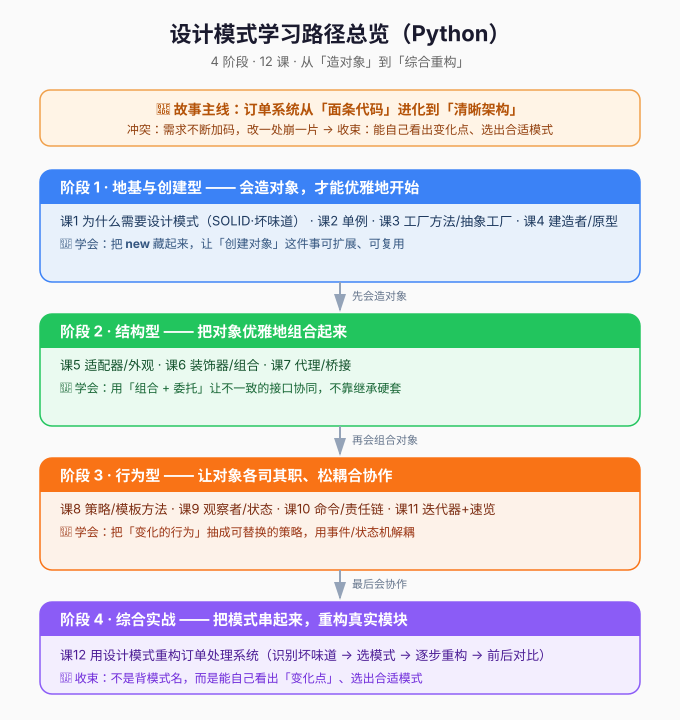

# 01 · 学习路径总览

> 完整学习旅程的鸟瞰图。学不动时回来看看自己走到哪、为什么走这条路。

## 故事主线

> **一个订单处理系统，从「跑得动的面条代码」进化到「扛得住变化的清晰架构」。**

- **主角**：订单处理系统 `Order`（一个不断被需求加码的真实项目）
- **冲突**：支付方式、通知渠道、报表格式越来越多，`if-else` 面条代码改一处崩一片
- **转折**：阶段 1 学会「优雅造对象」→ 阶段 2 学会「优雅组合对象」→ 阶段 3 学会「松耦合协作」→ 阶段 4 把全部串起来重构
- **收束**：从"记住 23 个模式的名字"到"能自己看出变化点、选出合适模式"



## 各阶段目标与重点一览

| 阶段 | 章节定位（故事） | 目标 | 重点 |
|------|------------------|------|------|
| **1 地基与创建型** | "会造对象，才能优雅地开始" | 掌握 SOLID 原则 + 5 种创建型模式 | 把 `new` 藏起来，创建可扩展可复用 |
| **2 结构型** | "把对象优雅地组合起来" | 掌握适配器/装饰器/代理等结构型模式 | 用组合+委托统一接口，不靠继承硬套 |
| **3 行为型** | "让对象各司其职、松耦合协作" | 掌握策略/观察者/状态等行为型模式 | 把变化的行为抽成可替换策略，事件驱动解耦 |
| **4 综合实战** | "把模式串起来，重构真实模块" | 综合运用，完成一次真实重构 | 识别变化点 → 选模式 → 重构 → 前后对比 |

## 阶段依赖关系

```
阶段 1（地基+创建型）
   │  前置：面向对象基础（你已具备）
   ▼
阶段 2（结构型）        ← 依赖「面向接口/抽象」思维（阶段1课1建立）
   ▼
阶段 3（行为型）        ← 依赖「组合+委托」基础（阶段2建立）
   ▼
阶段 4（综合实战）      ← 依赖前三阶段全部模式
```

> **前置依赖说明**：课 1（SOLID）是全局地基；结构型模式需要先理解「面向接口编程」；行为型模式大量依赖「组合+委托」。因此必须按顺序推进，不建议跳课。

## 覆盖范围（GoF 23 种）

| 分类 | 重点精讲（17） | 速览（5） |
|------|----------------|-----------|
| 创建型 | 单例、工厂方法、抽象工厂、建造者、原型 | — |
| 结构型 | 适配器、外观、装饰器、组合、代理、桥接 | 享元 |
| 行为型 | 策略、模板方法、观察者、状态、命令、责任链、迭代器 | 备忘录、中介者、访问者、解释器 |

> 范围策略：**Python 惯用优先**。低频或在 Python 中有语言级替代的模式（享元、解释器等）放速览，不深挖。
