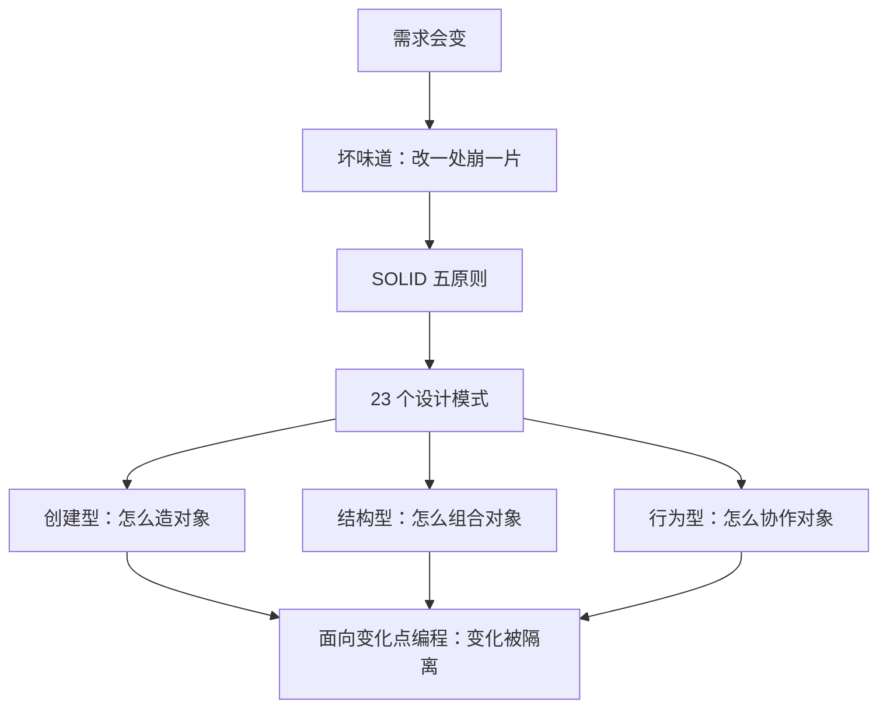
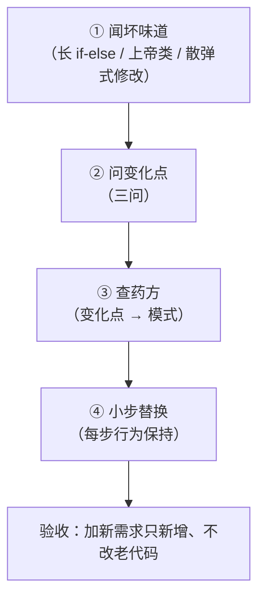

# 设计模式（GoF，Python 版）· 课程手册

> 这是 12 课讲完后的**一页纸总账**。讲义负责"学"，这份手册负责"用"和"查"。
> 想系统补某一课 → 各课有讲义链接；想快速查某个决策 → 看「全局速查」与「决策清单」；
> 想直接上手改自己的代码 → 看 `08-实战经验.md` / `09-排障速查手册.md` / `10-场景解法库.md`。

## 怎么读这份手册

| 你现在的状态 | 从这里开始 |
|---|---|
| 刚学完，想回头串一遍 | 「故事主线」→「知识点总索引」→ 各阶段小结 |
| 写代码时卡住，想不起来该用哪个模式 | 「决策清单：变化点 → 模式」 |
| 想复习某个模式的关键区别 | 「全局速查：最容易混的六组辨析」 |
| 要拿去改真实项目 | `08-实战经验.md`（原理）→ `10-场景解法库.md`（设计） |
| 代码已经出问题了 | `09-排障速查手册.md`（按症状倒查） |

**本课程的定位**：不是让你记住 23 个名字，而是让你在闻到坏味道时，能自己问出变化点、选出模式。
一句话心法（课 1 原话，课 12 兑现）：**找出变化点，把它隔离起来；让稳定的部分不因变化而被迫修改。**

## 故事主线：一个订单处理系统的进化

> **一个订单处理系统，从「跑得动的面条代码」进化到「扛得住变化的清晰架构」。**

- **主角**：订单处理系统 `Order`（一个不断被需求加码的真实项目）
- **冲突**：支付方式、通知渠道、报表格式越来越多，`if-else` 面条代码改一处崩一片
- **转折**：阶段 1 学会「优雅造对象」→ 阶段 2 学会「优雅组合对象」→ 阶段 3 学会「松耦合协作」→ 阶段 4 把全部串起来重构
- **收束**：从"记住 23 个模式的名字"到"能自己看出变化点、选出合适模式"

**三个贯穿全课程的伏笔**（在课 12 一次性回收）：

| 伏笔 | 埋下 | 回收 |
|---|---|---|
| 课 1 那个为加一个 `elif` 发愁的 `pay()` | 课 1 第四幕（注册表替换 if-else） | 课 12 第一步：终章重构不过是把同一个动作在另外四个变化点重放 |
| 课 9 转移表里的 `to_paid` / `refund_and_close` | 课 9（"被封装的操作"） | 课 10 做成完整的命令对象；课 12 用作撤销守卫 |
| "23 种都是怎么隔离某一类变化点" | 课 1 | 课 11 拼完整地图；课 12 五个变化点各领一味药 |

## 全局速查：最容易混的六组辨析

这六组是 12 课里反复出现、也最容易记串的边界。**记不住模式定义没关系，记清这六组就够了。**

| # | 容易混 | 分界口诀 | 出处 |
|---|---|---|---|
| 1 | 适配器 vs 装饰器 | **换形状 vs 加功能**——适配器是事后补救让接口能用，装饰器是主动叠加新职责 | 课 5 / 课 6 |
| 2 | 代理 vs 装饰器 | **守门 vs 加料**——代理常负责真身的生命周期、对调用方透明；装饰器由调用方主动组装 | 课 7 |
| 3 | 桥接 vs 适配器 | **事前设计 vs 事后补救**——桥接分离两个独立变化的维度（乘法变加法），适配器转换既有接口 | 课 7 |
| 4 | 策略 vs 模板方法 | **换引擎 vs 填空格**——整段算法可替换用策略，骨架固定个别步骤变用模板方法 | 课 8 |
| 5 | 状态 vs 策略 | **自己会换班 vs 外部换引擎**——看谁驱动变化：状态自己转移，策略由外部注入 | 课 9 |
| 6 | 命令 vs 策略 | **记账本 vs 换引擎**——要撤销/排队/留痕才用命令，只是替换算法用策略 | 课 10 |

**补充两组**（课 11 速览里顺带厘清）：

- **观察者 vs 责任链**：群发（全部消费）vs 接力（一环消费、拦截即停）
- **备忘录 vs 原型**：存档回滚 vs 以旧造新——工具箱都是 `deepcopy` / `replace`，意图不同

### Python 惯用：哪些模式语言已经替你做了

| 模式 | Python 的语言级替代 | 还要不要手写 |
|---|---|---|
| 迭代器 | `__iter__` / `__next__` 协议 + 生成器 `yield` | **基本不用**——GoF 23 种里唯一被语言内化的模式 |
| 单例 | 模块本身就是单例（`import` 只执行一次） | **优先用模块**，显式单例只用于惰性初始化/继承/统一控制 |
| 策略 | 一等函数 + 字典分发 | **优先用函数**，算法有状态或"一套多方法"才用类 |
| 命令 | `functools.partial` / 闭包 | 轻量场景够用；要撤销/重做栈才上命令对象 |
| 代理（缓存/懒加载） | `@lru_cache` / `@cached_property` | **优先用装饰器**；多方法/权限/延迟创建真身才手写代理类 |
| 装饰器（横切关注点） | `@decorator` 语法糖 | 注意：**语法糖 ≠ GoF 装饰器模式**（作用对象/时机/机制全不同） |
| 享元 | `sys.intern` / 小整数缓存 | 基本不用主动实现 |

> ⚠️ **这门课最重要的一条边界**：Python 的 `@decorator` 是**语法糖**，给函数贴标签，在**函数定义时**永久生效、不可运行时拆卸；GoF 装饰器模式是**对象运行时**的动态叠加，不想要了这行不写就行。**横切关注点用 `@`，业务叠加用 GoF。**

## GoF 23 种完整地图

| 分类 | 数量 | 模式 | 讲法 |
|---|---|---|---|
| 创建型 | 5 | 单例 · 工厂方法 · 抽象工厂 · 建造者 · 原型 | 全部精讲（课 2-4） |
| 结构型 | 7 | 适配器 · 外观 · 装饰器 · 组合 · 代理 · 桥接 · 享元 | 前 6 种精讲（课 5-7），享元速览（课 11） |
| 行为型 | 11 | 策略 · 模板方法 · 观察者 · 状态 · 命令 · 责任链 · 迭代器 · 备忘录 · 中介者 · 访问者 · 解释器 | 前 7 种精讲（课 8-11），后 4 种速览（课 11） |

**一句话分工**：创建型 5 种教你「优雅地造」，结构型 7 种教你「优雅地装」，行为型 11 种教你「松耦合地协作」。

> 📌 **计数提醒**：享元属**结构型**，虽然安排在课 11 一并速览，但不占行为型 11 种的名额。
> 这是本课程评审时真实踩过的坑（初稿误把享元计入行为型，导致 11 种算成 12 种）。

## 知识点总索引（12 课 · 35 点）

> 📌 **计数口径**：本表按 [00-学习档案.md](00-学习档案.md) 的知识点级进度表统计，全课程合计 **35 点**。
> 注意与讲义内「知识点清单」小节的条数**不必一致**——后者是课内自评清单（部分课按"模式"合并计数），
> 前者是档案的统一口径。两个数都对，用途不同，**不要互相校正**。

| 阶段 | 课 | 知识点 | 讲义 |
|---|---|---|---|
| 1 地基与创建型 | 课 1 | 设计模式是什么 · SOLID 五原则 · 常见坏味道 · 面向变化点编程（4 点） | [课 1](stages/1-地基与创建型/lessons/lesson-01-为什么需要设计模式.md) |
| | 课 2 | 单例概念与适用 · 模块即单例 · `__new__` 与元类 · 线程安全（4 点） | [课 2](stages/1-地基与创建型/lessons/lesson-02-单例模式.md) |
| | 课 3 | 简单工厂 · 工厂方法 · 抽象工厂 · 何时选哪种（4 点） | [课 3](stages/1-地基与创建型/lessons/lesson-03-工厂方法与抽象工厂.md) |
| | 课 4 | 建造者 · 原型（`copy.deepcopy`） · Python 惯用（3 点） | [课 4](stages/1-地基与创建型/lessons/lesson-04-建造者与原型.md) |
| 2 结构型 | 课 5 | 适配器 · 外观 · 场景识别（3 点） | [课 5](stages/2-结构型/lessons/lesson-05-适配器与外观.md) |
| | 课 6 | 装饰器模式 · 组合模式 · Python `@` 语法辨析（3 点） | [课 6](stages/2-结构型/lessons/lesson-06-装饰器与组合.md) |
| | 课 7 | 代理（懒加载/缓存） · 桥接（2 点） | [课 7](stages/2-结构型/lessons/lesson-07-代理与桥接.md) |
| 3 行为型 | 课 8 | 策略（一等函数/字典分发） · 模板方法（继承+钩子）（2 点） | [课 8](stages/3-行为型/lessons/lesson-08-策略与模板方法.md) |
| | 课 9 | 观察者 · 状态（字典+函数）（2 点） | [课 9](stages/3-行为型/lessons/lesson-09-观察者与状态.md) |
| | 课 10 | 命令（可调用对象） · 责任链（中间件）（2 点） | [课 10](stages/3-行为型/lessons/lesson-10-命令与责任链.md) |
| | 课 11 | 迭代器（生成器/协议） · 其余 5 种速览（2 点） | [课 11](stages/3-行为型/lessons/lesson-11-迭代器与其余模式速览.md) |
| 4 综合实战 | 课 12 | 识别坏味道 · 选模式 · 逐步重构 · 前后对比总结（4 点） | [课 12](stages/4-综合实战/lessons/lesson-12-用设计模式重构订单处理系统.md) |

## 阶段 1 · 地基与创建型 —— 会造对象，才能优雅地开始

**章节定位**：订单系统刚出生，需求就开始加码：要支持多种支付方式、多种订单类型，`new` 和 `if-else` 堆得满屏都是。

### 课 1 · 为什么需要设计模式（SOLID 与代码坏味道）

> 心法与地图：**坏味道 → 原则 → 模式**（症状 → 病因 → 药方）。

🎯 **落地视角**：设计模式治的是"变化"，不是"代码洁癖"。**没病别吃药**——三个月的一次性脚本，面条就是正解。
其中 **O（开闭）** 和 **D（依赖倒置）** 是消除 `if-else` 面条的两把钥匙，贯穿全课程。

⚠️ **最容易踩的三条**
1. 把模式当保健品，为想象中的需求上模式（YAGNI）——过度设计出来的代码比面条更难维护
2. 只记住 23 个名词，没建立「症状 → 病因 → 药方」的对应
3. 忽略坏味道的四种形态：长 `if-else`、上帝类、散弹式修改、`XxxAndYyy` 类名

[讲义原文](stages/1-地基与创建型/lessons/lesson-01-为什么需要设计模式.md)

### 课 2 · 单例模式（Python 的地道单例）

> 创建型第一问：**造几个？**

| 方式 | 关键点 | 适用 |
|---|---|---|
| 模块级变量 | `import` 只执行一次 | 全局唯一数据 + 访问函数（**首选**） |
| `__new__` | 拦截实例创建 | 需要类形式 + 惰性初始化 |
| 元类 | `__call__` 统一拦截 | 多个类都要单例 |
| 线程安全 | 双重检查锁定 | 多线程 + 高并发创建 |

🎯 **落地视角**：**先问"模块级变量够不够"**。单例是被滥用最多的模式，本质是全局可变状态，带来隐式耦合和测试困难。

⚠️ **最容易踩的三条**
1. 一上来就用 `__new__` / 元类写单例，而其实一个模块变量就够了
2. 忽略单例的全局可变状态本质——测试之间互相污染
3. 多线程环境下忘了加锁，双重检查锁定漏了 `volatile` 等价物

[讲义原文](stages/1-地基与创建型/lessons/lesson-02-单例模式.md)

### 课 3 · 工厂方法 与 抽象工厂（把 new 藏起来）

> 创建型第二问：**造哪类？**

| 工厂 | 解决的问题 | 加新产品的代价 |
|---|---|---|
| 简单工厂 | 创建逻辑集中一处 | 改工厂函数（违反 O） |
| 工厂方法 | 创建延迟到子类 | 加一个子类 |
| 抽象工厂 | 一族对象成套创建 | 加一整套子类 |

🎯 **落地视角**：最 Pythonic 的写法是**工厂函数 + 字典 + `__init_subclass__` 注册表**——加新产品 = 定义一个新子类 + 给个参数，注册表自动更新，创建逻辑零改动。

⚠️ **最容易踩的三条**
1. 为一个产品就套抽象工厂（抽象工厂是给"一族对象"准备的）
2. 把简单工厂当开闭原则的实现——它加产品要改工厂函数
3. 忘掉 `__init_subclass__` 自动注册，手工维护注册表导致漏注册

[讲义原文](stages/1-地基与创建型/lessons/lesson-03-工厂方法与抽象工厂.md)

### 课 4 · 建造者 与 原型（复杂对象的组装）

> 创建型第三、四问：**怎么一步步造？怎么复制？**

| 模式 | 回答的问题 | 一句话 |
|---|---|---|
| 建造者 | 怎么造？ | 分步构建，告别 12 参构造器 |
| 原型 | 怎么复制？ | 以模板复制再微调 |

🎯 **落地视角**：字段只是"多"但不复杂 → `@dataclass` + 关键字传参，**别上 Builder**；构造步骤有依赖/要分步校验/顺序固定 → 才用 Builder。

⚠️ **最容易踩的三条**
1. 嵌套结构用 `copy.copy` 浅复制，改一个订单的商品结果另一个也变了
2. **`dataclasses.replace` 也是浅复制**——没点名的可变字段（如 `items`）仍是共享引用，只适合改字符串/数字这类不可变顶层字段
3. 用上帝构造器硬扛 12 个参数，调用方填错位置

[讲义原文](stages/1-地基与创建型/lessons/lesson-04-建造者与原型.md)

## 阶段 2 · 结构型 —— 把对象优雅地组合起来

**章节定位**：订单系统要接物流、发票、风控三家外部系统，接口五花八门；还要给订单加日志、缓存、权限校验，责任越叠越多。

### 课 5 · 适配器 与 外观（统一不一致的接口）

> 结构型第一问：**接口不对怎么办？**

| 模式 | 回答的问题 | 一句话 |
|---|---|---|
| 适配器 | 接口不对？ | 包一层转换器，圆变方 |
| 外观 | 子系统太碎？ | 开个前台，一句话搞定 |

🎯 **落地视角**：SDK 接口只差格式转换 → **函数适配器**（闭包返回鸭子类型对象，最轻）；转换逻辑复杂、有状态 → 类适配器；子系统只有一两个组件 → **不需要外观，直接调**。

⚠️ **最容易踩的三条**
1. 适配器 vs 装饰器分不清（换形状 vs 加功能）
2. 为了用外观而用外观，把简单调用包成三层
3. 目标接口用 `ABC` 而不是 `Protocol`，导致外部 SDK 必须继承才能适配（结构化子类型更灵活）

[讲义原文](stages/2-结构型/lessons/lesson-05-适配器与外观.md)

### 课 6 · 装饰器 与 组合（Python 装饰器 vs 装饰器模式）

> 结构型第二问：**加功能但不改原代码？树形结构统一处理？**

| 模式 | 回答的问题 | 和装饰器的区别 |
|---|---|---|
| **装饰器** | 加功能不改原代码？ | — （套娃叠加） |
| **组合** | 树形统一处理？ | 组织结构，不叠加功能 |

🎯 **落地视角**：三种"包装"的选择——接口不兼容要转换 → **适配器**；子系统复杂要简化入口 → **外观**；动态叠加功能且接口不变 → **装饰器**。

⚠️ **最容易踩的三条**
1. **把 `@decorator` 语法糖当成 GoF 装饰器模式**（本课最大坑）——前者函数定义时永久生效不可拆卸，后者运行时动态叠加
2. 装饰顺序搞反导致结果错误（**外层最后执行**，套娃顺序 = 计算优先级；讲义实测 81.81）
3. 只有 2-3 个可选功能且不常变，还硬上装饰器（`if-else` 就行）

[讲义原文](stages/2-结构型/lessons/lesson-06-装饰器与组合.md)

### 课 7 · 代理 与 桥接（控制访问 + 分离变化的维度）

> 结构型第三问：**访问要控制？两个维度都要变？**

| 模式 | 回答的问题 | 一眼识别 |
|---|---|---|
| 代理 | 访问要控制？ | **守门**，调用方无感知 |
| 桥接 | 两个维度都要变？ | **乘法变加法**，事前设计 |

🎯 **落地视角**：单个属性懒加载 → `@cached_property`；纯函数结果按参数缓存 → `@lru_cache`（**都是首选，别手写代理**）；控制多个方法/权限/计数/真身延迟创建 → 手写代理类。

⚠️ **最容易踩的三条**
1. 代理 vs 装饰器分不清（守门 vs 加料；代理常创建真身、对调用方透明）
2. 只有一个维度会变还上桥接（单条继承/参数化就够）
3. 两个**已有**系统接口不兼容 → 那是**适配器**（事后补救），不是桥接（事前设计）

[讲义原文](stages/2-结构型/lessons/lesson-07-代理与桥接.md)

## 阶段 3 · 行为型 —— 让对象各司其职、松耦合协作

**章节定位**：订单系统跑起来了，但业务规则越来越多：不同会员等级不同折扣、订单状态流转、支付成功要同时通知物流+库存+积分。主流程里的 `if-else` 已经千层饼。

> **行为型的母题（课 10 显形，课 11 收束）**：**把"协作关系"从代码里提出来，变成可管理的显式结构。**
> 课 8 把"哪个算法"变成注入项，课 9 把"谁关心"变成名单、"怎么流转"变成转移表，课 10 把"做什么"变成命令对象、"谁来把关"变成链序，课 11 把"怎么走"变成协议能力。

### 课 8 · 策略 与 模板方法（算法可替换）

> 行为型第一问：**算法会换怎么办？骨架固定、个别步骤变怎么办？**

| 模式 | 回答的问题 | 一句话 |
|---|---|---|
| 策略 | 算法会换怎么办？ | 抽成可替换函数，查表分发 |
| 模板方法 | 骨架固定、步骤变？ | 基类定流程，子类填空 |

🎯 **落地视角**：算法整体可替换、无状态 → **一等函数 + 字典分发**（首选）；算法有状态或是"一套多方法"（计价+退款+积分）→ 类策略；变化的是"整个流程"→ 回到策略，别硬用模板。

⚠️ **最容易踩的三条**
1. 策略 vs 模板方法选错（**换引擎 vs 填空格**）
2. 子类重写整个骨架方法，导致骨架漂移（模板方法只填空，别重写骨架）
3. 空太多、步骤全要定制 → 说明骨架没抽对，该换策略了

> 💡 回扣：课 3 的工厂方法就是模板方法在"创建"上的特例；`sorted(key=...)` 就是策略在标准库里的日常。

[讲义原文](stages/3-行为型/lessons/lesson-08-策略与模板方法.md)

### 课 9 · 观察者 与 状态（事件驱动与状态机）

> 行为型第二问：**一个变化多方要知道？行为随状态整套切换？**

| 模式 | 回答的问题 | 一句话 |
|---|---|---|
| 观察者 | 一个变化多方要知道？ | 维护名单，变化自动广播 |
| 状态 | 行为随状态整套切换？ | 转移表一张，漏配即拒绝 |

🎯 **落地视角**：订阅方之间有顺序/依赖 → **别用观察者，写显式流程**；跨系统/跨进程广播 → 消息队列（发布订阅的分布式版）；状态行为很重（每个状态一堆方法）→ 类版状态模式，别硬塞进表。

⚠️ **最容易踩的三条**
1. **循环通知**——回调里反触同一事件链（回调只响应，不反手）
2. 状态名用裸字符串手滑拼错（用 `enum.StrEnum` 把取值约束在定义处，拼错立刻报错）
3. 长生命周期事件源 + 大对象观察者 → **内存泄漏**（用 `weakref.WeakSet` 当名单，代价是失去顺序）

[讲义原文](stages/3-行为型/lessons/lesson-09-观察者与状态.md)

### 课 10 · 命令 与 责任链（请求的封装与流转）

> 行为型第三问：**请求要排队/撤销？请求要层层把关？**

| 模式 | 回答的问题 | 一句话 |
|---|---|---|
| 命令 | 请求要排队/记录/撤销？ | 动作打包成对象，历史留痕 |
| 责任链 | 请求要层层把关、顺序可变？ | 中间件串链，拦截即停 |

🎯 **落地视角**：只是想替换算法 → 用**策略**，别上命令（命令是"记账本"，要全生命周期管理才值）；链序第一次成为数据——`build_chain(参数顺序)` 就能重排，**校验函数零改动**。

⚠️ **最容易踩的三条**
1. 反动作写不出来还硬做 `undo`（改用**补偿动作**，如补发更正短信）
2. 责任链忘了"拦截即停"（不调 `next_`，后面环节才不执行）
3. 命令 vs 策略分不清（记账本 vs 换引擎）

[讲义原文](stages/3-行为型/lessons/lesson-10-命令与责任链.md)

### 课 11 · 迭代器 与 其余模式速览

> 行为型收官 + 23 种地图拼完整。

| 模式 | 回答的问题 | 一句话 |
|---|---|---|
| 迭代器 | 怎么走要可替换、数据不想全装内存？ | 遍历封装成对象，Python 已内建 |
| 备忘录 | 反动作写不出来的撤销？ | 拍快照，读档式回滚 |
| 中介者 | 网状交互太乱？ | 收进星型中心（聊天室/事件总线） |
| 访问者 | 给稳定类族加新操作？ | `ast.NodeVisitor` |
| 享元 | 大量细粒度对象太占内存？ | 共享内在状态（`sys.intern` / 小整数缓存） |
| 解释器 | 为小语言定义文法并解释？ | `re` 正则引擎 |

🎯 **落地视角**：**迭代器是 GoF 23 种里唯一被 Python 语言内化的模式**——`__iter__` 协议 + 生成器 `yield`，你天天在用，只是没叫它名字。分页遍历百万数据用 `itertools.islice`，内存占用常数。

⚠️ **最容易踩的三条**
1. **生成器是一次性的**（用尽即止）——复用要先 `list()` 或重新构造
2. 可迭代 vs 迭代器分不清（前者可反复 `for`，后者是消耗品：`list` vs `iter(list)`）
3. 命令撤销 vs 备忘录撤销选错（**反着做 = delta 省内存** vs **读档 = 怎么改都能回**；也可混用：命令揣快照）

[讲义原文](stages/3-行为型/lessons/lesson-11-迭代器与其余模式速览.md)

## 阶段 4 · 综合实战 —— 把模式串起来，重构真实模块

### 课 12 · 用设计模式重构订单处理系统（终章）

> 回到故事开始的地方。**本课的主角不是任何一个模式，而是流程——模式是药方，这一课学的是问诊和疗程管理。**

**四步重构法**

| 步 | 动作 | 关键产出 |
|---|---|---|
| 0 | **先织测试网** | 挑固定订单（成功路径 + 拒绝路径都要有），把重构前输出原样锁死 = 行为基准 |
| 1 | 闻坏味道 | 课 1 的直觉：长 `if-else`、上帝类、散弹式修改、`XxxAndYyy` 类名 |
| 2 | 问变化点（三问） | ① 变化真的会来吗（YAGNI）② 变化点在哪 ③ 团队看得懂吗 |
| 3 | 查药方 | 变化点 → 模式决策表（下节） |
| 4 | 小步替换 | 一步只换一个零件，每步回对行为基准，逐字一致才继续 |

**本课的五个变化点 → 五味药**

| # | 变化点 | 模式 | 出处 |
|---|---|---|---|
| 1 | 支付渠道 | 工厂 + 注册表 | 课 3 |
| 2 | 计价规则（满减/会员折扣） | 策略 | 课 8 |
| 3 | 通知渠道（短信/钉钉/积分） | 观察者 | 课 9 |
| 4 | 校验规则（风控/限购/库存） | 责任链 | 课 10 |
| 5 | 状态流转 | 状态（转移表） | 课 9 |
| + | 取消订单要可撤销 | 命令 + 备忘录（先拍快照，读档恢复） | 课 10 / 课 11 |

🎯 **落地视角**：**重构和重写的分界是"有没有对账单"**。重写没有行为基准，新 bug 和旧行为混在一起无从分辨——所以第 0 步先织测试网，且**拒绝路径也要纳入**（拒绝输出同样是可观察行为，改丢了就是线上事故）。

⚠️ **最容易踩的三条**
1. **坑一：拿着锤子找钉子**——每个需求都"正好"适合上周学的那个模式，套完一层再套一层（过度设计比面条更难维护）
2. **坑二：推倒重写**——没有行为保持验证的重构就是赌博
3. 忽视"两处刻意的行为差异"要和需求方打招呼（未知计价规则 fail fast、`transition` 守卫重复支付）

**验收结果（讲义实测输出）**

| 验收项 | 结果 |
|---|---|
| 行为保持 | 4 笔订单（2 成功 + 2 拒绝）重构前后**逐字一致** |
| 开闭验收 | 三个新需求 = 三个新函数 + 三行注册，`process_order` **一行未改** |
| 撤销守卫 | 取消命令先拍快照、读档恢复（反动作一行没写）；`created` 状态想直接 `cancel` 被状态机当场拦下 |
| 代价账 | 代码量从约 45 行涨到约 100 行（**翻倍**，这是诚实的成本） |

[讲义原文](stages/4-综合实战/lessons/lesson-12-用设计模式重构订单处理系统.md)

## 决策清单

### 变化点 → 模式（一表查完）

| 你闻到的味道 | 变化点 | 上什么模式 | 出处 |
|---|---|---|---|
| `if-else` 判断创建哪种对象 | 对象类型会变 | 工厂（函数 + 字典注册表） | 课 3 |
| 构造器 10+ 参数、调用方填错位置 | 构造步骤复杂 | 建造者 / `@dataclass` | 课 4 |
| 到处 `copy` 再改几个字段 | 以模板复制 | 原型 `deepcopy` / `replace` | 课 4 |
| 外部 SDK 接口跟我们要的不一样 | 接口形状 | 适配器（优先函数适配器） | 课 5 |
| 调一个功能要连调 5 个子系统 | 子系统复杂度 | 外观 | 课 5 |
| 给对象加功能但不想改原类 | 职责叠加 | GoF 装饰器（横切关注点用 `@`） | 课 6 |
| 单品/礼盒、文件/文件夹 | 树形结构 | 组合 | 课 6 |
| 重数据想用到才加载 | 访问时机 | 代理（优先 `@cached_property`） | 课 7 |
| 结果想缓存 | 重复计算 | 代理（优先 `@lru_cache`） | 课 7 |
| 渠道 × 紧急度，类爆炸 | 两个维度独立变化 | 桥接 | 课 7 |
| 一档会员一套算法，还在加档 | 算法整体可替换 | 策略（函数 + 字典分发） | 课 8 |
| 流程骨架固定、个别步骤变 | 步骤定制 | 模板方法 / 函数注入 | 课 8 |
| 一个事件要通知多方，订阅方会增减 | 谁关心 | 观察者 | 课 9 |
| 行为随状态整套切换 | 状态驱动行为 | 状态（转移表） | 课 9 |
| 要撤销/重做/排队/留痕 | 请求的全生命周期 | 命令 | 课 10 |
| 请求要层层把关、顺序可变 | 谁来处理 | 责任链（拦截即停） | 课 10 |
| 遍历方式要可替换 / 数据太大 | 怎么走 | 迭代器（生成器） | 课 11 |
| 反动作写不出来的撤销 | 回滚方式 | 备忘录（拍快照） | 课 11 |

### 该不该上模式：三问（课 12）

1. **变化真的会来吗？** —— YAGNI：为想象中的需求上模式，是过度设计的起点（课 1：没病别吃药）。
2. **变化点在哪？** —— 找出"会变的那一处"，隔离它；稳定部分不许被迫修改。
3. **团队看得懂吗？** —— 模式是团队词汇：一句"这里加个策略"胜过十行注释；没人认识的模式等于没写文档的炫技。

### 三句毕业赠言（课 12）

1. **没病别吃药**：模式治的是"变化"，不是"代码洁癖"。三个月一次性脚本，面条就是正解。
2. **小步走，别赌命**：先织测试网，每步行为保持，逐字一致才继续。大爆炸重写不叫重构，叫赌博。
3. **词汇不是法律**：GoF 23 是前人踩坑总结的词汇表，不是必须遵守的法典。选错可逆——小步重构随时换药；但永远别停下问诊：变化点在哪？

## 🚀 接下来可以做什么

| 方向 | 建议 | 对应产物 |
|---|---|---|
| 复习巩固 | 做一遍 `07-知识点对齐.md` 选择题自测（可选） | 尚未生成 |
| 拿去改真实项目 | 从自己的代码里找第一个坏味道，走一遍四步重构法 | `10-场景解法库.md` |
| 排查"这代码为什么越改越乱" | 按症状倒查 | `09-排障速查手册.md` |
| 深入理解某个模式的原理与反模式 | 学习态精读 | `08-实战经验.md` |
| 继续扩展 | 并发模式、函数式模式、架构模式（分层/六边形/CQRS） | — |

> 从"跑得动的面条"到"扛得住变化的架构"，这条故事主线到这儿讲完了。
> 接下来真正的练级场不在讲义里，在你的真实项目里——**从闻到第一个坏味道开始。**

---

## 📚 三件套怎么用

| 你要干什么 | 去哪 |
|---|---|
| 搞懂原理与反模式（学习态） | [08-实战经验.md](08-实战经验.md) |
| 按症状倒查、代码已出问题（使用态） | [09-排障速查手册.md](09-排障速查手册.md) |
| 主动设计一个还没写的功能（设计态） | [10-场景解法库.md](10-场景解法库.md) |

---

> 本手册由 Phase 4 汇总生成（2026-09-02），与上述三件套同源压缩，**无新增知识点**。
> 完整进度与评审记录见 [00-学习档案.md](00-学习档案.md)；课时索引见 [02-课程目录.md](02-课程目录.md)。
