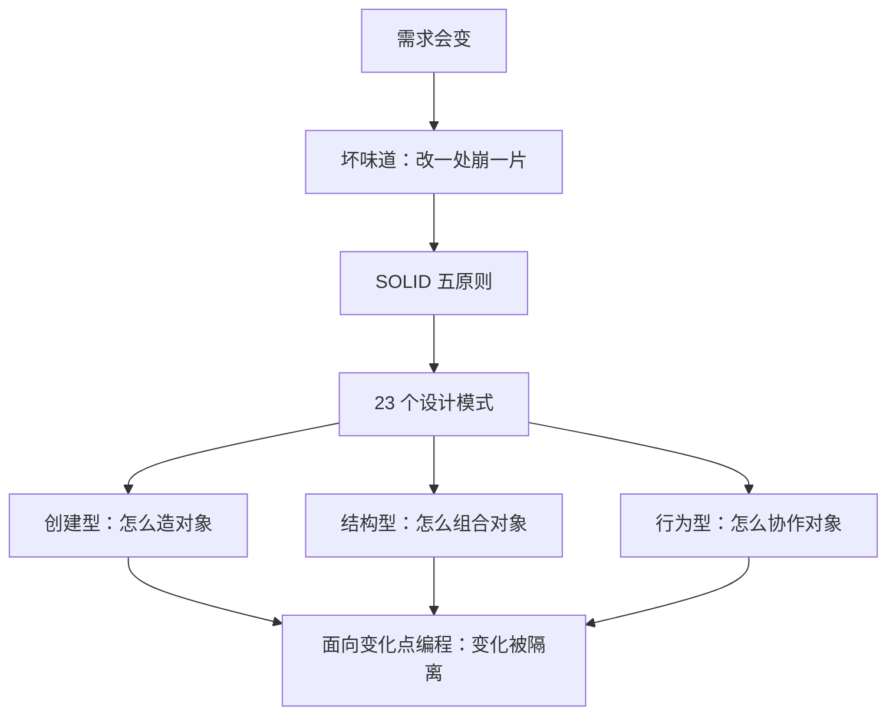

# 课 1 · 为什么需要设计模式

> 本课在故事主线中的情节定位：**开篇**——订单系统刚上线，需求就来了第二波。这一课不急着学任何具体模式，而是先搞懂「设计模式到底解决什么问题」，为后面 22 个模式打地基。

---

## 第一幕 · 起源与场景引入

**起源（核查于 2026-08）**：1994 年，四位工程师 Erich Gamma、Richard Helm、Ralph Johnson、John Vlissides 合著了《Design Patterns: Elements of Reusable Object-Oriented Software》（Addison-Wesley 出版），整理了 23 个经典模式。四人被合称为 **Gang of Four（GoF，四人帮）**。这本书的缘起是 1990 年 OOPSLA 会议的一次聚会——他们发现，资深工程师在解决同类问题时，会反复用到一些"说不出名字、但确实有效"的套路。于是把这些套路命名、描述、归档，成了设计模式的源头。

**场景**：你的订单系统有个支付函数，一开始只支持微信：

```python
def pay(channel: str, amount: float) -> str:
    if channel == "wechat":
        return f"微信支付 {amount} 元"
    else:
        raise ValueError(f"不支持的支付方式: {channel}")
```

后来产品说"要支持支付宝"，你加了个 `elif`；再后来"要支持银行卡"，又加一个 `elif`。现在这个函数长这样：

```python
def pay(channel: str, amount: float) -> str:
    if channel == "wechat":
        # 微信：要算手续费、要加签名……
        return f"微信支付 {amount} 元"
    elif channel == "alipay":
        return f"支付宝支付 {amount} 元"
    elif channel == "card":
        return f"银行卡支付 {amount} 元"
    else:
        raise ValueError(f"不支持的支付方式: {channel}")
```

每次加一种支付方式，你都要回来改这个**已经上线、已经测过、正在跑着**的函数。

## 第二幕 · 认知冲突

这个函数有问题吗？它**能跑**，测试也过，需求也满足了。

那它到底"烂"在哪？——**烂在"改"。**

> 代码好坏的分水岭，从来不是"现在能不能跑"，而是"**将来好不好改**"。

需求一定会变（加支付方式、改手续费规则、换回调逻辑）。而"改一处崩一片"的代码，会让你**不敢改**：每次改动都要重测整个函数，生怕动到别的分支。这就是 GoF 当年观察到的核心问题——**如何在需求变化时，用最小的改动、最小的风险来应对。**

## 第三幕 · 层层揭示

### 感知层：设计模式是什么

**设计模式（Design Pattern）不是代码，而是"在某种反复出现的场景下，经过验证的解决方案思路"。** 它像建筑业的"户型图"：不是直接搬进去的房子，而是一套被验证过好用、可以照着改的图纸。

> 人话版：设计模式 = 前人踩坑后总结出的"**这个场景这么写最不容易出事**"的套路。

### 概念层：它为什么有用

它解决的核心问题是**「变化」**——把代码里"会变的部分"和"不变的部分"分离开，让变化被**隔离在一个小角落**，改的时候只动那个角落。

### 机制层：SOLID 五原则（模式背后的"为什么"）

设计模式不是凭空来的，它背后站着五条原则。**SOLID 是地基，23 个模式是盖在上面的具体招式。** 先懂原则，再看模式会豁然开朗。

> SOLID 由 Robert C. Martin 在 2000 年的论文《Design Principles and Design Patterns》中系统提出，2004 年前后 Michael Feathers 把这五条首字母排成了好记的 "SOLID"（核查于 2026-08）。

| 字母 | 原则 | 一句话人话 |
|------|------|-----------|
| **S** | 单一职责 **S**ingle Responsibility | 一个类只干一件事，只有一个"改它的理由" |
| **O** | 开闭 **O**pen/Closed | 对扩展开放，对修改关闭——加功能靠"新增"，不靠"改老代码" |
| **L** | 里氏替换 **L**iskov Substitution | 子类必须能无痛替换父类，不能偷偷改变父类的约定 |
| **I** | 接口隔离 **I**nterface Segregation | 别逼别人依赖他用不上的方法，接口要小而专 |
| **D** | 依赖倒置 **D**ependency Inversion | 高层不该依赖低层细节，两者都该依赖"抽象" |

> 💡 其中 **O（开闭）** 和 **D（依赖倒置）** 是消除 `if-else` 面条代码的两把钥匙，也是本课程贯穿始终的主线。其余三条（S/L/I）会分别在具体模式中自然体现。

**回扣场景**：你的 `pay` 函数违反了 **O**——每加一种支付方式都要"修改"老函数，而不是"扩展"它；也违反了 **D**——它直接依赖"微信/支付宝/银行卡"这些具体细节，而不是依赖一个抽象的"支付方式"。

### 实操层：代码坏味道（怎么嗅出来）

不用背原理，先学会"闻到味"。以下是四个高频坏味道，看到就警惕：

1. **长 `if-else` / `switch`**：每加一个分支就要改一次老代码（违反 O）。
2. **上帝类**：一个类 2000 行，什么都干（违反 S）。
3. **散弹式修改**：改一个需求，要动十几个文件（变化没被隔离）。
4. **类名带 "And"/"Manager"**：`OrderAndPaymentManager`——职责不清（违反 S）。

把这四个坏味道和前面讲的原则、后面要学的模式串成一张「地图」——**坏味道是症状，原则是病因，模式是药方**：

| 坏味道 | 违反原则 | 后面哪个模式能救 |
|--------|---------|-----------------|
| 长 `if-else` / `switch` | O 开闭 | 策略（课 8）、工厂（课 3） |
| 上帝类 | S 单一职责 | 按职责拆分 + 组合（课 6） |
| 散弹式修改 | S（职责分散到多处） | 收拢变化点：工厂（课 3）、策略（课 8） |
| `XxxAndYyy` 类名 | S 单一职责 | 职责拆分 |

> 💡 带着这张地图往下学：每学一个模式都回来对号入座，看它在治哪类坏味道、落实哪条原则。这样 23 个模式就不再是 23 个孤立名词，而是一套「症状 → 病因 → 药方」的对应关系。

### 定位层：面向变化点编程

设计模式的最高心法是这句话：

> **找出变化点，把它隔离起来；让稳定的部分不因变化而被迫修改。**

你的 `pay` 函数里，变化点是"支付方式"。后面 22 个模式，本质都是在教你怎么隔离某一类变化点——**创建对象**（创建型）、**组合对象**（结构型）、**对象协作**（行为型）。

## 第四幕 · 实操验证

现在用 **O + D** 两把钥匙，改造开头那个 `pay` 函数。目标：**加新支付方式时，只"新增"代码，不"修改" `pay` 函数。**

```python
from abc import ABC, abstractmethod


# 1. 定义抽象：所有支付方式都遵循这个"接口"（依赖倒置 D）
class Payment(ABC):
    @abstractmethod
    def pay(self, amount: float) -> str:
        """支付并返回结果描述"""


# 2. 每种支付方式一个类，各自独立（单一职责 S）
class WechatPayment(Payment):
    def pay(self, amount: float) -> str:
        return f"微信支付 {amount} 元"


class AlipayPayment(Payment):
    def pay(self, amount: float) -> str:
        return f"支付宝支付 {amount} 元"


class CardPayment(Payment):
    def pay(self, amount: float) -> str:
        return f"银行卡支付 {amount} 元"


# 3. 注册表：渠道名 -> 类（字典分发）
PAYMENTS: dict[str, type[Payment]] = {
    "wechat": WechatPayment,
    "alipay": AlipayPayment,
    "card": CardPayment,
}


# 4. 稳定的主流程：不再有 if-else，新渠道只加一行注册表
def pay(channel: str, amount: float) -> str:
    cls = PAYMENTS.get(channel)
    if cls is None:
        raise ValueError(f"不支持的支付方式: {channel}")
    return cls().pay(amount)


if __name__ == "__main__":
    print(pay("wechat", 100.0))   # 微信支付 100.0 元
    print(pay("alipay", 50.5))    # 支付宝支付 50.5 元
    print(pay("card", 200.0))     # 银行卡支付 200.0 元
```

**验证结果回扣场景**：现在要加"Apple Pay"，你只需要**新增一个类 + 往注册表加一行**，`pay` 函数一个字都不用改——这就是"对扩展开放，对修改关闭"（O）。

> 🐞 说明：这段代码其实已经悄悄用到了后面要讲的**策略模式**（课 8）和**工厂**的雏形（课 3）。这是有意埋的钩子——本课先用它直观感受 O/D 两原则，正式模式后面专门讲。

## 第五幕 · 体系收束



**你现在会了什么**：你懂了设计模式的"为什么"——它解决的是"变化"，心法是"面向变化点编程"，地基是 SOLID 五原则（重点记住 **O 开闭** 和 **D 依赖倒置**）。

**接下来学什么**：从下一课起进入创建型模式，第一站是**单例**——解决"全局只需要一个对象"这类变化点。

---

## 命令速查卡（课 1）

| 概念 | 一句话 |
|------|--------|
| 设计模式 | 反复场景下验证过的解决方案思路，不是代码 |
| SOLID | 五条设计原则，模式背后的"为什么" |
| 开闭原则 O | 加功能靠"新增"，不靠"改老代码" |
| 依赖倒置 D | 依赖抽象，不依赖具体 |
| 坏味道 | 长 if-else、上帝类、散弹式修改、`XxxAndYyy` 类名 |

---

## 📚 参考资料

- [Refactoring Guru — Design Patterns](https://refactoring.guru/design-patterns)：23 个模式的结构化图解与多语言示例（含 Python）。
- [GoF《Design Patterns: Elements of Reusable Object-Oriented Software》](https://en.wikipedia.org/wiki/Design_Patterns)：设计模式的源头（1994）。
- [Wikipedia — SOLID](https://en.wikipedia.org/wiki/SOLID)：五原则的权威解释。

---

## 🚀 下一批接力提示词

> 学完本课后，**复制下面这段发给 AI**，即可无缝进入课 2：

```
继续学设计模式。我的学习档案在 design-patterns/00-学习档案.md，
刚学完阶段 1《地基与创建型》的课 1《为什么需要设计模式》（设计模式是什么 / SOLID 五原则 / 坏味道 / 面向变化点编程），
请按大纲继续讲解课 2《单例模式》。
```

---

## 🧭 课程导航

- 下一课：[课 2 · 单例模式（Python 的地道单例）](lesson-02-单例模式.md)
- [⬅️ 返回课程目录](../../../02-课程目录.md)
