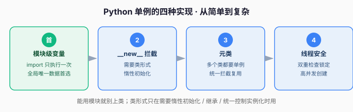

# 课 2 · 单例模式（Python 的地道单例）

> 本课在故事主线中的情节定位：订单系统需要一个全局唯一的「配置中心」——数据库地址、API 密钥这些配置全系统只有一份，加载一次就够，不该每个请求都重新读一遍文件。

---

## 第一幕 · 场景引入

订单系统里有这样一段读取配置的代码：

```python
def get_db_url() -> str:
    # 每次调用都重新读文件、解析、拼接
    with open("config.ini") as f:
        config = parse(f.read())
    return config["database"]["url"]
```

问题来了：`get_db_url` 每次调用都要**重新读文件、重新解析**。而配置这东西，全系统只该有一份，读一次缓存起来就够。更糟的是，团队里每个人都在各自的代码里 `open("config.ini")`，改配置格式时，到处都要跟着改。

> 这就是单例要解决的场景：**有些对象，全系统只需要一个实例。**

## 第二幕 · 认知冲突

"全局只需要一个对象"，乍一听很简单——那我写个全局变量不就行了？

```python
db_url = "mysql://..."   # 全局变量，不就行了吗？
```

确实能跑。但全局变量有两个隐患：

1. **没法控制"唯一性"**：别人完全可以再 `db_url = "改了"`，谁都能覆盖。
2. **没法惰性初始化**：配置很重，你希望"第一次用到才加载"，而不是程序一启动就全部加载。

于是诞生了**单例模式（Singleton）**：**保证一个类在整个进程中只有一个实例，并提供一个全局访问点。**

## 第三幕 · 层层揭示

### 感知层：Python 里最地道的单例——模块

先讲一个可能颠覆认知的结论：

> 💡 **在 Python 里，一个模块（`.py` 文件）本身就是单例。** 一个模块被 `import` 时，它的代码只执行一次；之后无论多少次 `import`，拿到的都是**同一个模块对象**。

```python
# config.py —— 模块级变量天然是"单例"
_db_url = "mysql://localhost/orders"   # 模块第一次被 import 时初始化一次

def get_db_url() -> str:
    return _db_url
```

```python
# main.py
import config
a = config.get_db_url()
b = config.get_db_url()
print(a is b)   # True —— 全系统共用同一份配置
```

> 人话版：**如果只是想要"全局唯一的数据 + 一个访问函数"，用模块就够了，别急着上类。**

那什么时候才需要"类"形式的单例？——当你需要**惰性初始化**（用到才建）、需要**继承/多态**、或需要**控制实例化时机**时。下面讲两种类形式。

### 概念层：用 `__new__` 拦截实例创建

Python 创建对象的真正入口不是 `__init__`，而是 `__new__`。我们可以在 `__new__` 里做手脚：**如果实例已存在，就返回已有的那个，不再新建。**

```python
class Config:
    _instance = None          # 类属性，存放唯一实例

    def __new__(cls, *args, **kwargs):
        if cls._instance is None:              # 还没有实例
            cls._instance = super().__new__(cls)  # 真正创建
        return cls._instance                   # 返回唯一实例

    def __init__(self):
        # 注意：即使复用实例，__init__ 也可能被重复调用
        self.url = "mysql://localhost/orders"
```

> 🐞 陷阱：`__init__` 在每次 `Config()` 时**都会被调用**，即使返回的是旧实例。所以"只初始化一次"的字段要放到 `__new__` 里判断，别全塞 `__init__`。

### 机制层：用元类统一"单例"这个行为

如果系统里有好几个类都要做成单例（配置、连接池、日志器），每个都重写 `__new__` 太啰嗦。这时用**元类（metaclass）**把"单例"抽成一个可复用的行为。

> 元类 Metaclass：类的"类"——控制类**如何被创建**。普通类控制"对象如何创建"，元类控制"类如何创建"，所以能在类创建/实例化时做统一拦截。

```python
class SingletonMeta(type):
    _instances: dict = {}

    def __call__(cls, *args, **kwargs):
        # 每次 Config() 都会走到这里，而不是走 __new__
        if cls not in cls._instances:
            cls._instances[cls] = super().__call__(*args, **kwargs)
        return cls._instances[cls]


class Config(metaclass=SingletonMeta):
    def __init__(self):
        self.url = "mysql://localhost/orders"   # 这次 __init__ 只会执行一次
```

元类版的好处：`__init__` 也**只执行一次**（因为 `super().__call__` 只在第一次被调用），且"单例"逻辑对所有类复用。

### 实操层：线程安全

单例在多线程下有竞态问题：两个线程同时判断 `_instance is None` 都成立，可能各建一个。修复方法是加锁：

```python
import threading

class ThreadSafeConfig:
    _instance = None
    _lock = threading.Lock()

    def __new__(cls):
        if cls._instance is None:          # 先快速判断，避免每次都抢锁
            with cls._lock:                # 加锁后二次判断
                if cls._instance is None:
                    cls._instance = super().__new__(cls)
        return cls._instance
```

> 这种"先判断→加锁→再判断"叫**双重检查锁定（Double-Checked Locking）**。单线程程序里用不着，知道有这个坑即可。

四种方式横向对比（复杂度从左到右递增，能用简单的就别上复杂的）：



## 第四幕 · 实操验证

把四种方式放在一起，验证"确实是同一个对象"：

```python
import threading

# —— 方式1：模块即单例（最推荐，够用就别用类）——
# （见上，模块变量天然唯一）

# —— 方式2：__new__ 拦截 ——
class ConfigA:
    _instance = None
    def __new__(cls):
        if cls._instance is None:
            cls._instance = super().__new__(cls)
        return cls._instance

# —— 方式3：元类 ——
class SingletonMeta(type):
    _instances = {}
    def __call__(cls, *a, **k):
        if cls not in cls._instances:
            cls._instances[cls] = super().__call__(*a, **k)
        return cls._instances[cls]

class ConfigB(metaclass=SingletonMeta):
    pass

# —— 方式4：线程安全 ——
class ConfigC:
    _instance = None
    _lock = threading.Lock()
    def __new__(cls):
        if cls._instance is None:
            with cls._lock:
                if cls._instance is None:
                    cls._instance = super().__new__(cls)
        return cls._instance

# 验证
a1, a2 = ConfigA(), ConfigA()
b1, b2 = ConfigB(), ConfigB()
c1, c2 = ConfigC(), ConfigC()

print(a1 is a2)   # True
print(b1 is b2)   # True
print(c1 is c2)   # True
```

**验证结果回扣场景**：不管你在系统哪个角落 `Config()`，拿到的都是同一个对象——配置只加载一次、全系统共享一份，且无法被随意覆盖（比裸全局变量更可控）。

## 第五幕 · 体系收束

单例在创建型模式里的位置：**它管的是"实例数量"——一个类到底允许几个实例。** 普通类随便 new，单例类只准一个。

> ⚠️ **重要边界（Python 惯用视角）**：单例是被**滥用最多**的模式之一。很多"我以为需要单例"的场景，其实一个**模块级变量**就够了。显式单例（`__new__`/元类）只在确有需要时用——比如需要惰性初始化、需要被继承、需要统一控制实例化。**如果一个类可以被正常 new 且不影响正确性，就不要强套单例**——单例本质上是"全局可变状态"，会带来隐式耦合和测试困难。

**接下来学什么**：单例解决了"只造一个对象"，但更多时候我们要"造**哪一类**对象"——下一课讲**工厂**，解决"把创建哪种对象的判断，从业务代码里抽出来"。

---

## 命令速查卡（课 2）

| 方式 | 关键点 | 适用 |
|------|--------|------|
| 模块级变量 | `import` 只执行一次 | 全局唯一数据 + 访问函数（首选） |
| `__new__` | 拦截实例创建 | 需要类形式 + 惰性初始化 |
| 元类 | `__call__` 统一拦截 | 多个类都要单例，复用行为 |
| 线程安全 | 双重检查锁定 | 多线程 + 高并发创建 |

---

## 📚 参考资料

- [Python 官方文档 — 模块与 import](https://docs.python.org/3/reference/import.html)：模块首次 import 只执行一次，是「模块即单例」的机制基础。
- [Python 官方文档 — `object.__new__`](https://docs.python.org/3/reference/datamodel.html#object.__new__)：实例创建入口，拦截 `__new__` 实现单例的依据。
- [Python 官方文档 — 元类 metaclass](https://docs.python.org/3/reference/datamodel.html#metaclasses)：类的「类」，统一拦截实例化的机制。
- [Python 官方文档 — threading](https://docs.python.org/3/library/threading.html)：线程安全单例用到的 `Lock`。

---

## 🚀 下一批接力提示词

> 学完本课后，**复制下面这段发给 AI**，即可无缝进入课 3：

```
继续学设计模式。我的学习档案在 design-patterns/00-学习档案.md，
刚学完阶段 1《地基与创建型》的课 2《单例模式》（单例概念 / 模块即单例 / __new__ 与元类 / 线程安全），
请按大纲继续讲解课 3《工厂方法 与 抽象工厂》。
```

---

## 🧭 课程导航

- 上一课：[课 1 · 为什么需要设计模式](lesson-01-为什么需要设计模式.md)
- 下一课：[课 3 · 工厂方法 与 抽象工厂](lesson-03-工厂方法与抽象工厂.md)
- [⬅️ 返回课程目录](../../../02-课程目录.md)
