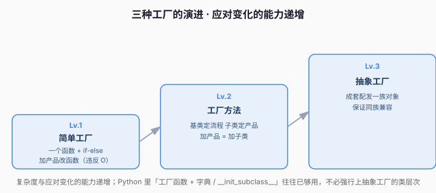

# 课 3 · 工厂方法 与 抽象工厂（把 new 藏起来）

> 本课在故事主线中的情节定位：承接课 1 的支付场景。课 1 用字典分发把 `pay` 函数救活了，但"创建支付对象"这件事依然散落在业务代码里。本课把它正式抽象成**工厂**，并讲清三种工厂的演进关系。

---

## 第一幕 · 场景引入

课 1 改造后，`pay` 函数干净了，但问题转移了：现在创建"哪种支付对象"的判断，出现在了**每一个用到支付的地方**——

```python
# 订单服务里
cls = PAYMENTS.get(channel)
payment = cls()

# 退款服务里，又写一遍
cls = PAYMENTS.get(channel)
refund = cls()
```

"根据 channel 创建对象"这个逻辑，被复制到了好多处。更糟的是，支付对象不是孤立的——它还配套**退款对象、对账对象、通知对象**。微信的支付对象必须配微信的退款对象，配错了就会拿微信的钱走支付宝的退款流程，**灾难**。

> 这就是工厂要解决的两件事：① 把"创建逻辑"集中到一处，别散落；② 保证"一族相关对象"的配套正确。

## 第二幕 · 认知冲突

"不就是 `new` 一下吗？为什么还要包一层工厂？"

因为 `new` 是一个**具体类名**，一旦你写了 `WechatPayment()`，就把代码**焊死**在了"微信"这个具体实现上。而工厂的核心思想是：

> **调用方只依赖"抽象"（Payment），不依赖"具体"（WechatPayment）——这就是依赖倒置（D）。**

把 `new` 藏进工厂后，调用方从头到尾只认识 `Payment` 这个抽象，加新渠道时调用方一行都不用改。

## 第三幕 · 层层揭示

### 感知层：简单工厂（一个函数，按参数造对象）

最朴素的工厂就是一个函数，里面一个 `if-else` 按参数返回对象：

```python
def create_payment(channel: str) -> Payment:
    if channel == "wechat":
        return WechatPayment()
    elif channel == "alipay":
        return AlipayPayment()
    elif channel == "card":
        return CardPayment()
    raise ValueError(f"不支持的支付方式: {channel}")
```

> 人话版：简单工厂 = **"对象版的开关"**。好处是创建逻辑集中了；坏处是它自己还是个 `if-else`，**加新类型仍要改这个函数**（违反 O）。所以它适合"类型很少、几乎不变"的场景。

### 概念层：工厂方法（把创建延迟到子类）

当产品会不断增多时，我们不想每次改工厂的 `if-else`。**工厂方法（Factory Method）**的思路：定义一个**抽象的创建方法**，让每个子类各自负责创建自己的对象——**加新产品 = 加一个子类，不动老代码**。

```python
class PaymentGateway(ABC):
    """抽象网关：定义"支付"这个稳定的流程骨架"""

    @abstractmethod
    def create_payment(self) -> Payment:
        """工厂方法——由子类决定创建哪种支付对象"""

    def pay(self, amount: float) -> str:
        # 稳定的业务流程：先创建，再支付
        payment = self.create_payment()
        return payment.pay(amount)


class WechatGateway(PaymentGateway):
    def create_payment(self) -> Payment:
        return WechatPayment()


class AlipayGateway(PaymentGateway):
    def create_payment(self) -> Payment:
        return AlipayPayment()
```

> 人话版：工厂方法 = **"基类定流程，子类定产品"**。基类 `pay` 方法完全不知道（也不关心）具体是哪种支付，只知道"调用 `create_payment()` 拿到一个 Payment 再 pay"。

### 机制层：抽象工厂（创建"一族"相关对象）

现在回到第一幕的痛点：支付对象不是孤立的，它有一整**族**配套对象——支付、退款、对账。抽象工厂（Abstract Factory）就是造**一族**相关对象的接口，保证同族对象彼此兼容：

```python
class Refund(ABC):
    @abstractmethod
    def refund(self, amount: float) -> str: ...

class WechatRefund(Refund):
    def refund(self, amount: float) -> str:
        return f"微信退款 {amount} 元"

class AlipayRefund(Refund):
    def refund(self, amount: float) -> str:
        return f"支付宝退款 {amount} 元"


class PaymentFactory(ABC):
    """抽象工厂：声明一族产品的创建接口"""

    @abstractmethod
    def create_payment(self) -> Payment: ...
    @abstractmethod
    def create_refund(self) -> Refund: ...


class WechatFactory(PaymentFactory):
    def create_payment(self) -> Payment: return WechatPayment()
    def create_refund(self) -> Refund: return WechatRefund()


class AlipayFactory(PaymentFactory):
    def create_payment(self) -> Payment: return AlipayPayment()
    def create_refund(self) -> Refund: return AlipayRefund()
```

> 人话版：抽象工厂 = **"成套配发"**。拿到 `WechatFactory`，你就能拿到整套微信的支付 + 退款，绝不可能混入支付宝的对象。

### 实操层：Python 惯用——`__init_subclass__` 自动注册

上面的工厂方法，每加一个产品还是要手写一个子类再手动挂到某处。Python 的 `__init_subclass__` 钩子可以在**子类定义时自动把它注册进注册表**，彻底消灭手动 `if-else`：

```python
class Payment(ABC):
    _registry: dict[str, type["Payment"]] = {}

    def __init_subclass__(cls, channel: str | None = None, **kwargs):
        # 子类被定义时自动触发，把自己注册进父类注册表
        super().__init_subclass__(**kwargs)
        if channel is not None:
            cls._registry[channel] = cls

    @abstractmethod
    def pay(self, amount: float) -> str: ...

    @classmethod
    def create(cls, channel: str) -> "Payment":
        if channel not in cls._registry:
            raise ValueError(f"不支持的支付方式: {channel}")
        return cls._registry[channel]()   # 从注册表取类并实例化


class WechatPayment(Payment, channel="wechat"):
    def pay(self, amount: float) -> str:
        return f"微信支付 {amount} 元"

class AlipayPayment(Payment, channel="alipay"):
    def pay(self, amount: float) -> str:
        return f"支付宝支付 {amount} 元"
```

> 💡 这是最 Pythonic 的工厂写法：**加新产品 = 定义一个新子类 + 给个 `channel=` 参数**，注册表自动更新，创建逻辑零改动。

## 第四幕 · 实操验证

把三种工厂串起来跑一遍：

```python
from abc import ABC, abstractmethod


# ========== 产品层 ==========
class Payment(ABC):
    _registry: dict[str, type["Payment"]] = {}

    def __init_subclass__(cls, channel: str | None = None, **kwargs):
        super().__init_subclass__(**kwargs)
        if channel is not None:
            cls._registry[channel] = cls

    @abstractmethod
    def pay(self, amount: float) -> str: ...

    @classmethod
    def create(cls, channel: str) -> "Payment":
        if channel not in cls._registry:
            raise ValueError(f"不支持的支付方式: {channel}")
        return cls._registry[channel]()


class WechatPayment(Payment, channel="wechat"):
    def pay(self, amount): return f"微信支付 {amount} 元"

class AlipayPayment(Payment, channel="alipay"):
    def pay(self, amount): return f"支付宝支付 {amount} 元"

class CardPayment(Payment, channel="card"):
    def pay(self, amount): return f"银行卡支付 {amount} 元"


# ========== 工厂方法（基类定流程，子类定产品） ==========
class PaymentGateway(ABC):
    @abstractmethod
    def create_payment(self) -> Payment: ...

    def pay(self, amount: float) -> str:
        return self.create_payment().pay(amount)

class WechatGateway(PaymentGateway):
    def create_payment(self) -> Payment:
        return WechatPayment()

class AlipayGateway(PaymentGateway):
    def create_payment(self) -> Payment:
        return AlipayPayment()


# ========== 抽象工厂（成套配发一族对象） ==========
class Refund(ABC):
    @abstractmethod
    def refund(self, amount: float) -> str: ...

class WechatRefund(Refund):
    def refund(self, amount): return f"微信退款 {amount} 元"

class AlipayRefund(Refund):
    def refund(self, amount): return f"支付宝退款 {amount} 元"

class PaymentFactory(ABC):
    @abstractmethod
    def create_payment(self) -> Payment: ...
    @abstractmethod
    def create_refund(self) -> Refund: ...

class WechatFactory(PaymentFactory):
    def create_payment(self): return WechatPayment()
    def create_refund(self): return WechatRefund()

class AlipayFactory(PaymentFactory):
    def create_payment(self): return AlipayPayment()
    def create_refund(self): return AlipayRefund()


if __name__ == "__main__":
    # 1. 自动注册工厂
    print(Payment.create("wechat").pay(100))    # 微信支付 100 元
    print(Payment.create("alipay").pay(50))     # 支付宝支付 50 元

    # 2. 工厂方法
    gw = WechatGateway()
    print(gw.pay(200))                          # 微信支付 200 元

    # 3. 抽象工厂：成套的支付+退款，类型保证兼容
    f = AlipayFactory()
    print(f.create_payment().pay(300))          # 支付宝支付 300 元
    print(f.create_refund().refund(300))        # 支付宝退款 300 元

    # 4. 新增渠道：只加子类，一行注册表都不用改
    class ApplePayPayment(Payment, channel="applepay"):
        def pay(self, amount): return f"Apple Pay 支付 {amount} 元"
    print(Payment.create("applepay").pay(400))  # Apple Pay 支付 400 元
```

**验证结果回扣场景**：从"每个角落都写 `if channel == ...`"，到"新增渠道只加一个子类"，创建逻辑被彻底收拢、产品家族成套配发，不会再出现"微信支付配支付宝退款"的灾难。

## 第五幕 · 体系收束

工厂家族的定位：**创建型模式的"多面手"**——它专治"对象类型会变、创建逻辑散落、一族对象要配套"这三类变化点。

三者演进关系（**何时选哪种**）：



| 工厂 | 解决的问题 | 加新产品的代价 |
|------|-----------|---------------|
| 简单工厂 | 创建逻辑集中一处 | 改工厂函数（违反 O） |
| 工厂方法 | 创建延迟到子类 | 加一个子类 |
| 抽象工厂 | 一族对象成套创建 | 加一整套子类 |

> 💡 Python 惯用提醒：很多时候**一个工厂函数 + 字典/`__init_subclass__` 注册表**就足够优雅，不必强行上抽象工厂的类层次。抽象工厂是给"一族对象"场景准备的，别为了一个产品就套它。

**接下来学什么**：创建型还剩最后一块——**建造者**（组装参数爆炸的复杂对象）和**原型**（快速复制对象）。下一课讲它们。

---

## 命令速查卡（课 3）

| 概念 | 一句话 | Python 惯用 |
|------|--------|-------------|
| 简单工厂 | 对象版开关，按参数造对象 | 工厂函数 + 字典 |
| 工厂方法 | 基类定流程，子类定产品 | `@abstractmethod` |
| 抽象工厂 | 成套配发一族对象 | `ABC` + 家族接口 |
| 自动注册 | 子类定义即注册 | `__init_subclass__(channel=...)` |

---

## 📚 参考资料

- [Python 官方文档 — abc 抽象基类](https://docs.python.org/3/library/abc.html)：工厂方法 / 抽象工厂用到的 `ABC`、`@abstractmethod`。
- [Python 官方文档 — `__init_subclass__`](https://docs.python.org/3/reference/datamodel.html#object.__init_subclass__)：子类定义时自动注册的钩子，Python 惯用工厂的核心。
- [Refactoring Guru — 工厂方法](https://refactoring.guru/design-patterns/factory-method)、[抽象工厂](https://refactoring.guru/design-patterns/abstract-factory)：两种工厂的结构化图解与 Python 示例。

---

## 🚀 下一批接力提示词

> 学完本课后，**复制下面这段发给 AI**，即可无缝进入课 4：

```
继续学设计模式。我的学习档案在 design-patterns/00-学习档案.md，
刚学完阶段 1《地基与创建型》的课 3《工厂方法 与 抽象工厂》（简单工厂 / 工厂方法 / 抽象工厂 / 何时选哪种），
请按大纲继续讲解课 4《建造者 与 原型》。
```
