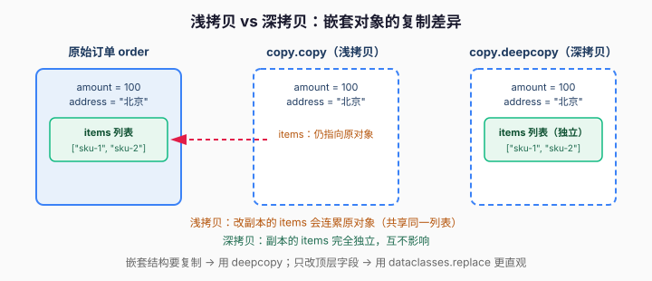
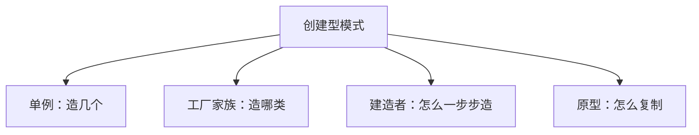

# 课 4 · 建造者 与 原型（复杂对象的组装）

> 本课在故事主线中的情节定位：订单对象字段爆炸了——下单要填收货地址、优惠券、发票、备注、风控标签……构造函数塞了 12 个参数，调用方天天填错位置。还有个需求：批量下单时，90% 字段相同的订单要快速复制再微调。**这一课解决：怎么优雅地组装复杂对象、怎么快速复制对象。**

## 本课目标

- 掌握建造者模式：把「构造」从「表示」中分离。
- 掌握原型模式：用 `copy.deepcopy` 快速复制对象。
- 会用 Python 惯用写法（链式调用、`dataclasses.replace`）。

## 知识点清单

1. 建造者模式（分步构建复杂对象，链式调用）
2. 原型模式（`copy.deepcopy`、`dataclasses.replace`）
3. Python 惯用（构造参数太多时，比"上帝构造器"更好的选择）

---

## 第一幕 · 场景引入

订单系统跑了大半年，`Order` 对象越长越胖。最开始它只有 3 个字段，后来每加一个需求就多一个字段，现在构造函数长这样：

```python
class Order:
    def __init__(
        self,
        order_id: str,
        user_id: str,
        product_id: str,
        amount: float,
        address: str,
        coupon_id: str | None,
        invoice_title: str | None,
        remark: str,
        risk_tag: str,
        channel: str,
        payment_method: str,
        notify_url: str,
    ):
        self.order_id = order_id
        self.user_id = user_id
        # ……后面还有 10 个 self.xxx = xxx
```

调用方一看就头皮发麻：12 个位置参数，谁能记得第 7 个是 `remark` 还是 `risk_tag`？于是线上事故来了——有人把 `coupon_id` 传到了 `invoice_title` 的位置，发票抬头变成了优惠券 ID。

另一个需求也来了：**批量下单**。运营搞活动，要给 1000 个老用户各下一单，90% 的字段（渠道、支付方式、回调地址）完全一样，只有 `user_id`、`address` 不同。

## 第二幕 · 认知冲突

两个问题摆上台面：

1. **参数太多怎么优雅构造？** "那我把参数都设成默认值，关键字传参不就行了？"——能缓解，但默认值越堆越多，构造逻辑（比如"有优惠券就必须有 `coupon_id`，否则要校验"）还是散在调用方。
2. **怎么快速复制对象？** "那我把模板订单的属性一个个抄到新对象上不就行了？"——90% 字段重复赋值，又臭又长，还容易漏。

> 这俩问题，一个要「优雅地**造**」，一个要「优雅地**复制**」——正是本课两个模式的主场。

## 第三幕 · 层层揭示

### 感知层：这个「12 参构造器」有个学名

你刚才看到的那个 12 参数构造器，业界叫它**伸缩构造器（Telescoping Constructor）**——参数越堆越多，像一个越拉越长的望远镜。它的坏味道很明显：**调用方记不住参数顺序，也看不懂哪个参数是干嘛的**（回顾课 1 的「上帝类」坏味道，这里是它的"构造函数版"）。

### 概念层：建造者模式（把构造拆成一步步）

**建造者模式（Builder）：把「构造一个复杂对象」拆成一个个独立的小步骤，让调用方按需、按顺序、可读地拼装，最后再一次性"下单"产出成品。**

> 人话版：**点菜式**。你不必一口气报出 12 个参数，而是"先要个主食，加个配菜，备注不要香菜"，最后说"下单"。每一步都看得懂，想省哪步就省哪步。

```python
from dataclasses import dataclass, field

@dataclass
class Order:
    order_id: str = ""
    user_id: str = ""
    product_id: str = ""
    amount: float = 0.0
    address: str = ""
    items: list = field(default_factory=list)   # 嵌套结构，稍后讲
    remark: str = ""


class OrderBuilder:
    def __init__(self):
        self._data: dict = {}

    def user(self, user_id: str) -> "OrderBuilder":
        self._data["user_id"] = user_id
        return self                 # 关键：返回 self，实现链式

    def product(self, product_id: str, amount: float) -> "OrderBuilder":
        self._data["product_id"] = product_id
        self._data["amount"] = amount
        return self

    def ship_to(self, address: str) -> "OrderBuilder":
        self._data["address"] = address
        return self

    def build(self) -> Order:
        if not self._data.get("address"):      # 统一校验：没地址不许下单
            raise ValueError("缺少收货地址")
        return Order(**self._data)             # 一次性构造成品
```

调用方从"背 12 个参数"变成"读得懂的一句话"：

```python
order = (
    OrderBuilder()
    .user("u-1001")
    .product("sku-42", 99.0)
    .ship_to("北京市朝阳区")
    .build()
)
print(order.user_id, order.address)   # u-1001 北京市朝阳区
```

> 🐞 常见误区：**别把 Builder 当工厂用**。工厂回答"造**哪一类**对象"（微信还是支付宝），Builder 回答"**怎么一步步**造好一个复杂对象"。对象简单时硬套 Builder，反而比直接 `new` 更啰嗦。

### 机制层：原型模式（复制而非重建）

批量下单那个需求，用 Builder 还得一步步重拼 1000 次，太浪费。这时用**原型模式（Prototype）**：**以现有对象为模板，复制出一个新对象，再微调差异部分。**

> 人话版：**复印机**。你不用重新打一遍字，先复印一份模板，再在上面改几个字。

但复制有**深浅之分，这是原型模式最大的坑**：

- **浅拷贝 `copy.copy`**：只复制对象"最外层"，内部嵌套的列表/字典仍与原对象**共享同一块内存**。
- **深拷贝 `copy.deepcopy`**：递归复制所有层，里里外外完全独立。



```python
import copy

template = Order(address="", items=["sku-1"])

shallow = copy.copy(template)     # 浅拷贝：items 仍共享
shallow.items.append("sku-2")     # 改副本的 items
print(template.items)             # ['sku-1', 'sku-2']  ← 原模板被"连累"了！

deep = copy.deepcopy(template)    # 深拷贝：items 独立
deep.items.append("sku-3")
print(template.items)             # ['sku-1', 'sku-2']  ← 不受影响
print(deep.items)                 # ['sku-1', 'sku-2', 'sku-3']
```

> 🐞 陷阱：只要对象里含 `items` 这种**嵌套可变结构**，复制就必须用 `deepcopy`，否则"改副本连累原对象"的 Bug 极难排查。

### 实操层：Python 惯用——`dataclasses.replace` 更香

对"复制 + 改几个**顶层字段**"这种需求，Python 有个更地道、更不易错的方式：**`dataclasses.replace`**。

```python
from dataclasses import replace

new_order = replace(template, user_id="u-1002", amount=199.0)
print(new_order.user_id, new_order.amount)   # u-1002 199.0
```

`replace` 会返回一个**新对象**，只改你指定的字段，其余照旧——语义清晰，一眼看出"复制了什么、改了什么"。

> ⚠️ 边界：`replace` 也是**浅复制**——它只替换你点名的字段，**没点名的可变字段（如 `items`）仍是共享引用**。所以 `replace` 适合改字符串、数字这类不可变顶层字段；一旦涉及嵌套列表，要么用 `deepcopy`，要么显式写 `replace(template, items=copy.deepcopy(template.items))`。

> 💡 Python 惯用结论（何时选哪种）：
>
> | 场景 | 用什么 |
> |------|--------|
> | 字段只是"多"但不复杂 | `@dataclass` + 关键字传参，别上 Builder |
> | 构造步骤有依赖 / 要分步校验 / 顺序固定 | **Builder** |
> | 以模板快速复制，改嵌套结构 | **`copy.deepcopy`** |
> | 复制 + 改几个顶层字段 | **`dataclasses.replace`** |

## 第四幕 · 实操验证

把三个工具串进第一幕的"批量下单"场景，验证它们各司其职：

```python
from dataclasses import dataclass, field, replace
import copy

@dataclass
class Order:
    order_id: str = ""
    user_id: str = ""
    amount: float = 0.0
    address: str = ""
    items: list = field(default_factory=list)
    remark: str = ""

# 模板订单：渠道/支付/备注等 90% 字段都一样
template = Order(remark="活动订单", items=["sku-1"])

# 批量下单：每个用户只有 user_id / address 不同
orders = []
for i, (uid, addr) in enumerate([
    ("u-1001", "北京市朝阳区"),
    ("u-1002", "上海市浦东新区"),
    ("u-1003", "深圳市南山区"),
]):
    o = copy.deepcopy(template)      # 深拷贝：items 独立
    o.user_id = uid
    o.address = addr
    o.order_id = f"2026{i:04d}"
    orders.append(o)

# 给第一个订单加个商品，验证互不影响
orders[0].items.append("sku-2")
print(orders[0].items)   # ['sku-1', 'sku-2']  ← 只改了自己
print(orders[1].items)   # ['sku-1']           ← 其他订单不受影响
print(template.items)    # ['sku-1']           ← 模板也不受影响

# 单字段微调：replace 更直观
o4 = replace(template, user_id="u-1004")
print(o4.user_id, o4.remark)   # u-1004 活动订单
```

**验证结果回扣场景**：批量下单用 `deepcopy` 复制模板再微调，1000 个订单不再重复拼 12 个参数；嵌套的 `items` 靠深拷贝保证各订单独立；单字段微调用 `replace` 一目了然。

## 第五幕 · 体系收束

创建型模式的最后一块拼图。五种模式各自的定位：



| 模式 | 回答的问题 | 一句话 |
|------|-----------|--------|
| 单例 | 造几个？ | 全局唯一 |
| 工厂 | 造哪类？ | 把 new 藏起来，换家族不改调用方 |
| 建造者 | 怎么造？ | 分步构建，告别 12 参构造器 |
| 原型 | 怎么复制？ | 以模板复制再微调 |

**你现在会了什么**：创建型 5 种模式（单例、工厂方法、抽象工厂、建造者、原型）已全部掌握，且都是 Python 地道写法。

**接下来学什么**：创建型解决"怎么造对象"，但对象造出来之后要**组合、协作**。下一阶段进入**结构型模式**，第一站是**适配器与外观**——订单系统要接物流、发票、风控三家外部系统，接口五花八门，怎么统一。

---

## 命令速查卡（课 4）

| 概念 | 一句话 | Python 惯用 |
|------|--------|-------------|
| 伸缩构造器 | 12 参构造，调用方填错位置 | 换成 dataclass / Builder |
| 建造者 Builder | 分步构建，链式调用 | 每个 setter 返回 `self`，`build()` 收尾 |
| 原型 Prototype | 以模板复制再微调 | `copy.deepcopy` |
| 深浅拷贝 | 浅=只复制外层，深=递归复制 | 嵌套结构必须 `deepcopy` |
| 复制+微调 | 复制对象改几个字段 | `dataclasses.replace` |

---

## 📚 参考资料

- [Python 官方文档 — copy 模块](https://docs.python.org/3/library/copy.html)：`copy.copy` 与 `copy.deepcopy` 的语义与深浅区别。
- [Python 官方文档 — dataclasses](https://docs.python.org/3/library/dataclasses.html)：`@dataclass`、`dataclasses.replace`。
- [Refactoring Guru — 建造者模式](https://refactoring.guru/design-patterns/builder)、[原型模式](https://refactoring.guru/design-patterns/prototype)：结构化图解与 Python 示例。

---

## 🚀 下一批接力提示词

> 学完本课后，**复制下面这段发给 AI**，即可无缝进入阶段 2 课 5：

```
继续学设计模式。我的学习档案在 design-patterns/00-学习档案.md，
刚学完阶段 1《地基与创建型》的课 4《建造者 与 原型》（建造者模式 / 原型模式 deepcopy / Python 惯用），
请按大纲继续讲解阶段 2《结构型》的课 5《适配器 与 外观》。
```

---

## 🧭 课程导航

- 上一课：[课 3 · 工厂方法 与 抽象工厂](lesson-03-工厂方法与抽象工厂.md)
- 下一课：[课 5 · 适配器 与 外观](../../2-结构型/lessons/lesson-05-适配器与外观.md)
- [⬅️ 返回课程目录](../../../02-课程目录.md)
