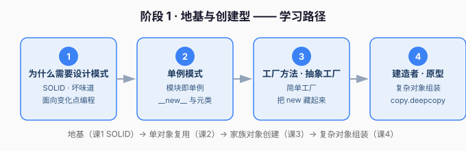

# 阶段 1 · 地基与创建型

> 章节定位：**「会造对象，才能优雅地开始」** —— 订单系统刚出生，需求就开始加码：要支持多种支付方式、多种订单类型，`new` 和 `if-else` 堆得满屏都是。

## 阶段目标

学完本阶段，你能：

1. 讲清**为什么要用设计模式**（SOLID 五原则 + 代码坏味道 + 面向变化点编程）。
2. 用 Python 的**地道方式**实现单例、工厂方法、抽象工厂、建造者、原型五种创建型模式。
3. 判断「什么时候该用哪个创建型模式」，而不是死记。

## 学习重点

| 课 | 核心 | 一句话 |
|----|------|--------|
| 课1 | SOLID 原则 | 设计模式背后的底层「为什么」 |
| 课2 | 单例 | Python 里模块本身就是单例 |
| 课3 | 工厂方法/抽象工厂 | 把对象的创建藏起来，换产品家族不用改调用方 |
| 课4 | 建造者/原型 | 组装复杂对象、快速复制对象 |

## 必须掌握的知识点

- [x] 设计模式是什么、SOLID 五原则、代码坏味道、面向变化点编程
- [x] 单例概念、模块即单例、`__new__` 与元类、线程安全
- [x] 简单工厂、工厂方法、抽象工厂、何时选哪种
- [ ] 建造者、原型（`copy.deepcopy`）、Python 惯用写法

## 本阶段路径图

