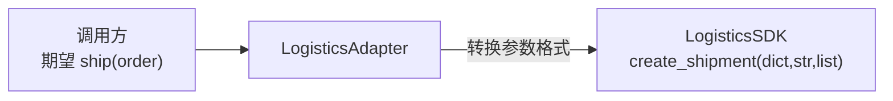
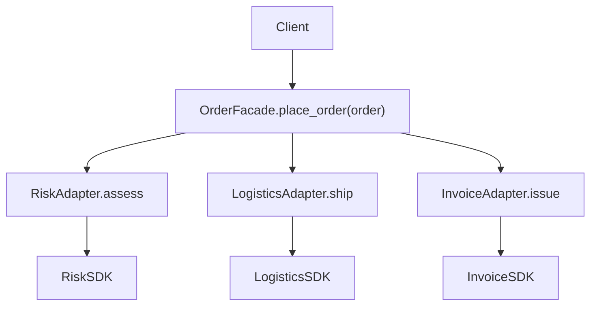
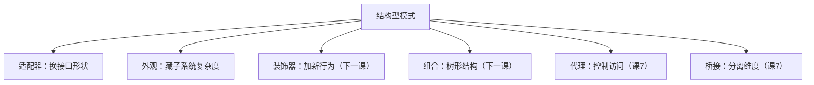

# 课 5 · 适配器 与 外观（统一不一致的接口）

> 本课在故事主线中的情节定位：订单用 Builder 造得漂漂亮亮，下一步就是真正"下单"——但下单不只是存条记录，还得调物流、开发票、过风控。三家外部系统各有各的 SDK，参数格式五花八门，返回值风格也不统一。订单处理代码里到处散落着"给物流传 dict、给发票传嵌套 dict、给风控传 dict 再解析返回的 dict"。**这一课解决：怎么把不兼容的接口统一成你想要的样子，怎么把一堆复杂子系统藏到一个干净入口背后。**

## 本课目标

- 掌握适配器模式：把一个不兼容的接口转换成目标接口。
- 掌握外观模式：为复杂子系统提供一个简化的统一入口。
- 会用 Python 惯用写法（函数适配器、`Protocol` 描述目标接口）。

## 知识点清单

1. 适配器模式（包装不兼容接口，转换成目标形状）
2. 外观模式（复杂子系统的简化入口）
3. 场景识别（适配器 vs 外观 vs 装饰器的边界）

---

## 第一幕 · 场景引入

订单系统用 Builder 把 `Order` 造得漂漂亮亮，下一步就是真正"下单"。一个完整的下单流程要调三家外部系统：

| 系统 | SDK 方法 | 参数格式 | 返回值 |
|------|----------|----------|--------|
| 物流 | `create_shipment(shipper_info: dict, addr: str, goods: list)` | dict + str + list 三段式 | 运单号 `str` |
| 发票 | `apply(title: str, tax_no: str, items: dict)` | str + str + dict | 发票号 `str` |
| 风控 | `check(user_info: dict, order_detail: dict)` | 两个 dict | `{"pass": bool, "score": int}` |

三个 SDK 是三批人写的，谁也没考虑谁的风格。订单处理代码被迫"见人说人话、见鬼说鬼话"：

```python
# 下单流程：散落在各处的格式转换
def place_order(order: Order):
    # 风控：得拼两个 dict，还得解析返回的 dict
    risk_result = risk_sdk.check(
        user_info={"user_id": order.user_id, "phone": "13800000000"},
        order_detail={"amount": order.amount, "items": order.items},
    )
    if not risk_result["pass"]:
        return None

    # 物流：又一个完全不同的参数形状
    tracking = logistics_sdk.create_shipment(
        shipper_info={"name": "default_warehouse"},
        receiver_addr=order.address,
        goods_list=order.items,
    )

    # 发票：items 要从 list 转成 dict 格式
    invoice = invoice_sdk.apply(
        title=order.invoice_title,
        tax_no="91110000XXXXXXXX",
        items={item: 1 for item in order.items},
    )

    return {"tracking": tracking, "invoice": invoice}
```

这段代码能跑，但有两个隐患：第一，订单逻辑里塞满了"怎么调物流""怎么调发票"的格式细节，换一家物流商就得改订单代码；第二，这套"风控→物流→发票"的编排顺序在退款、补单里又要重写一遍。

## 第二幕 · 认知冲突

两个问题摆上台面：

1. **接口不兼容怎么办？** "那我在每个调用处手动转换一下格式不就行了？"——转换逻辑散落各处，换一家 SDK 全项目改。
2. **子系统太复杂怎么办？** "那我把编排顺序写在 `place_order` 里不就行了？"——退款也要这套流程，补单也要，到处复制。

> 第一个问题是"接口形状不对"，第二个问题是"调用过程太碎"——适配器和外观分别治这两个病。

## 第三幕 · 层层揭示

### 感知层：这个"格式地狱"有个通用解法

你手动拼 dict、转返回值的那些代码，本质上就是在做**接口转换**——只是散落在各处、不可复用。把它集中到一个"转换器"类里，让调用方只面对统一的接口，这就是适配器模式的雏形。

### 概念层：适配器模式（把方的插头变圆）

**适配器模式（Adapter）：把一个类的接口转换成调用方期望的另一种接口，让原本不兼容的类能一起工作。**

> 人话版：**电源转换器**。你有个国标插头（旧接口），墙上只有欧标插座（目标接口），中间插个转换器就行——不用改插头，也不用改插座。



先定义"目标接口"——你希望调用方看到的统一形状：

```python
from typing import Protocol

class ILogistics(Protocol):
    def ship(self, order: Order) -> str: ...

class IInvoice(Protocol):
    def issue(self, order: Order) -> str: ...

class IRisk(Protocol):
    def assess(self, order: Order) -> bool: ...
```

然后为每个 SDK 写适配器，把"丑接口"翻译成"目标接口"：

```python
class LogisticsAdapter:
    """适配器：把 create_shipment(dict, str, list) 适配成 ship(order)"""
    def __init__(self, sdk: LogisticsSDK):
        self._sdk = sdk

    def ship(self, order: Order) -> str:
        return self._sdk.create_shipment(
            shipper_info={"name": "default_warehouse"},
            receiver_addr=order.address,
            goods_list=order.items,
        )

class InvoiceAdapter:
    """适配器：items 要从 list 转成 dict"""
    def __init__(self, sdk: InvoiceSDK):
        self._sdk = sdk

    def issue(self, order: Order) -> str:
        return self._sdk.apply(
            title=order.invoice_title,
            tax_no="91110000XXXXXXXX",
            items={item: 1 for item in order.items},
        )

class RiskAdapter:
    """适配器：返回值从 dict 提取成 bool"""
    def __init__(self, sdk: RiskSDK):
        self._sdk = sdk

    def assess(self, order: Order) -> bool:
        result = self._sdk.check(
            user_info={"user_id": order.user_id, "phone": "13800000000"},
            order_detail={"amount": order.amount, "items": order.items},
        )
        return result["pass"]
```

调用方再也不碰 SDK 的原始接口了：

```python
logistics = LogisticsAdapter(logistics_sdk)
tracking = logistics.ship(order)   # 干净！只传 order，不用拼 dict
```

> 🐞 常见误区：**别把适配器当装饰器**。适配器是"换接口形状"（圆插头变方插座），装饰器是"加新行为"（充电器再加个 USB 口）。装饰器模式是下一课的内容，先记住这个区分。

### 机制层：外观模式（复杂子系统藏到门面后）

适配器解决了"单个接口不兼容"，但下单要调三个适配器、还有固定的顺序（风控→物流→发票）。这套编排逻辑在退款、补单场景还要重复。**外观模式（Facade）** 把这套复杂流程藏到一个干净的入口背后：

**外观模式：为复杂子系统提供一个统一的简化接口，调用方不需要知道子系统内部由哪些组件组成、怎么编排。**

> 人话版：**餐厅前台**。你跟前台说"来份套餐 A"，前台自己安排后厨出菜、打包、开发票。你不用知道后厨几个窗口、先炒菜还是先煮汤。



```python
class OrderFacade:
    """外观：一个方法搞定风控→物流→发票"""
    def __init__(self, risk: IRisk, logistics: ILogistics, invoice: IInvoice):
        self._risk = risk
        self._logistics = logistics
        self._invoice = invoice

    def place_order(self, order: Order) -> dict:
        # 1. 风控
        if not self._risk.assess(order):
            return {"ok": False, "msg": "风控不通过"}
        # 2. 物流
        tracking_no = self._logistics.ship(order)
        # 3. 发票
        invoice_no = self._invoice.issue(order)
        return {"ok": True, "tracking_no": tracking_no, "invoice_no": invoice_no}
```

调用方从"自己编排三步"变成"一句话下单"：

```python
facade = OrderFacade(risk_adapter, logistics_adapter, invoice_adapter)
result = facade.place_order(order)   # 风控、物流、发票全搞定
```

> 🐞 常见误区：**外观不是"只允许走门面"**。子系统仍然可以直接访问——外观只是提供了一个"更方便的路"。如果某个调用方需要更细粒度的控制（比如只调物流不调发票），可以直接用适配器，绕过外观。

### 实操层：Python 惯用——简单场景用函数适配器

当 SDK 接口只差一层格式转换，写个完整的类有点重。Python 里可以直接用**函数适配器**——一个闭包就能搞定：

```python
def adapt_logistics(sdk: LogisticsSDK) -> ILogistics:
    """函数式适配器：返回一个符合 ILogistics 协议的对象"""
    class _Adapter:
        def ship(self, order: Order) -> str:
            return sdk.create_shipment(
                shipper_info={"name": "default_warehouse"},
                receiver_addr=order.address,
                goods_list=order.items,
            )
    return _Adapter()

# 用起来和类适配器一模一样
logistics = adapt_logistics(logistics_sdk)
```

> 💡 Python 惯用结论（何时选哪种）：
>
> | 场景 | 用什么 |
> |------|--------|
> | SDK 接口只差格式转换 | 函数适配器（轻量） |
> | 转换逻辑复杂、有状态 | 类适配器 |
> | 要统一多个子系统的编排 | 外观模式 |
> | 子系统只有一两个组件、不复杂 | 不需要外观，直接调 |

## 第四幕 · 实操验证

把适配器和外观串进第一幕的下单场景，验证从"格式地狱"到"一句话下单"的转变：

```python
from dataclasses import dataclass, field
from typing import Protocol

@dataclass
class Order:
    order_id: str = ""
    user_id: str = ""
    amount: float = 0.0
    address: str = ""
    invoice_title: str = ""
    items: list = field(default_factory=list)

# ===== 外部系统 SDK（三方各自为政）=====

class LogisticsSDK:
    def create_shipment(self, shipper_info: dict, receiver_addr: str, goods_list: list) -> str:
        return f"SF-{shipper_info['name']}-{abs(hash(receiver_addr)) % 10000:04d}"

class InvoiceSDK:
    def apply(self, title: str, tax_no: str, items: dict) -> str:
        return f"INV-{title[:4]}-{abs(hash(tax_no)) % 10000:04d}"

class RiskSDK:
    def check(self, user_info: dict, order_detail: dict) -> dict:
        amount = order_detail.get("amount", 0)
        passed = amount < 10000
        return {"pass": passed, "score": int(amount), "reason": "low_risk" if passed else "review"}

# ===== 目标接口 =====

class ILogistics(Protocol):
    def ship(self, order: Order) -> str: ...

class IInvoice(Protocol):
    def issue(self, order: Order) -> str: ...

class IRisk(Protocol):
    def assess(self, order: Order) -> bool: ...

# ===== 适配器 =====

class LogisticsAdapter:
    def __init__(self, sdk: LogisticsSDK):
        self._sdk = sdk
    def ship(self, order: Order) -> str:
        return self._sdk.create_shipment(
            {"name": "default_warehouse"}, order.address, order.items)

class InvoiceAdapter:
    def __init__(self, sdk: InvoiceSDK):
        self._sdk = sdk
    def issue(self, order: Order) -> str:
        return self._sdk.apply(order.invoice_title, "91110000XXXXXXXX", {i: 1 for i in order.items})

class RiskAdapter:
    def __init__(self, sdk: RiskSDK):
        self._sdk = sdk
    def assess(self, order: Order) -> bool:
        return self._sdk.check(
            {"user_id": order.user_id, "phone": "13800000000"},
            {"amount": order.amount, "items": order.items},
        )["pass"]

# ===== 外观 =====

class OrderFacade:
    def __init__(self, risk: IRisk, logistics: ILogistics, invoice: IInvoice):
        self._risk = risk
        self._logistics = logistics
        self._invoice = invoice

    def place_order(self, order: Order) -> dict:
        if not self._risk.assess(order):
            return {"ok": False, "msg": "风控不通过"}
        tracking_no = self._logistics.ship(order)
        invoice_no = self._invoice.issue(order)
        return {"ok": True, "tracking_no": tracking_no, "invoice_no": invoice_no}

# ===== 运行验证 =====

# 组装：SDK → 适配器 → 外观
facade = OrderFacade(
    risk=RiskAdapter(RiskSDK()),
    logistics=LogisticsAdapter(LogisticsSDK()),
    invoice=InvoiceAdapter(InvoiceSDK()),
)

# 正常下单：一句话，不用拼任何 dict
order = Order(
    order_id="20260001", user_id="u-1001", amount=99.0,
    address="北京市朝阳区", invoice_title="腾讯科技", items=["sku-1", "sku-2"],
)
result = facade.place_order(order)
print(result)
# {'ok': True, 'tracking_no': 'SF-default_warehouse-xxxx', 'invoice_no': 'INV-腾讯科技-xxxx'}

# 风控不通过的场景：金额超限
order2 = Order(
    order_id="20260002", user_id="u-risk", amount=99999.0,
    address="上海市", invoice_title="测试", items=["sku-3"],
)
result2 = facade.place_order(order2)
print(result2)
# {'ok': False, 'msg': '风控不通过'}
```

**验证结果回扣场景**：第一幕那段"拼三个 dict、解析返回值、三步编排"的 30 行代码，现在变成 `facade.place_order(order)` 一行。换一家物流商？只改 `LogisticsAdapter`，订单代码一行不动。退款场景要复用流程？给 Facade 加个 `refund` 方法，编排逻辑不重复。

## 第五幕 · 体系收束

结构型模式的第一站。结构型的核心问题是"对象造出来之后怎么**组合**"，而适配器和外观是两个最常被混淆的"包装型"模式：



| 模式 | 回答的问题 | 一句话 |
|------|-----------|--------|
| 适配器 | 接口不对怎么办？ | 包一层转换器，圆变方 |
| 外观 | 子系统太碎怎么办？ | 开个前台，一句话搞定 |

**你现在会了什么**：适配器让不兼容的接口"变得能用"，外观让复杂流程"变得好调"。但还有两种"包装"你没学到——想给对象**加新功能**（不是换接口）怎么办？想把对象组织成**树形结构**统一处理怎么办？这正是下一课的内容。

**接下来学什么**：下一课学**装饰器与组合**。注意：Python 的 `@decorator` 语法糖和 GoF 装饰器模式**不是一回事**，我们会专门辨析这个最容易踩的坑。

---

## 命令速查卡（课 5）

| 概念 | 一句话 | Python 惯用 |
|------|--------|-------------|
| 适配器 Adapter | 把不兼容接口转换成目标接口 | 包一层类，`__init__` 持有 SDK，方法做转换 |
| 外观 Facade | 复杂子系统的简化入口 | 一个类聚合多个适配器，方法做编排 |
| 函数适配器 | 轻量版适配器 | 闭包返回鸭子类型对象 |
| 目标接口 | 调用方期望的统一形状 | `typing.Protocol` 描述 |
| 适配器 vs 装饰器 | 换接口 vs 加行为 | 先记住，课 6 辨析 |

---

## 📚 参考资料

- [Refactoring Guru — 适配器模式](https://refactoring.guru/design-patterns/adapter)：电源插座类比 + 结构图解。
- [Refactoring Guru — 外观模式](https://refactoring.guru/design-patterns/facade)：子系统简化入口的结构化讲解。
- [Python 官方文档 — typing.Protocol](https://docs.python.org/3/library/typing.html#typing.Protocol)：结构化类型（鸭子类型的类型标注版）。

---

## 🚀 下一批接力提示词

> 学完本课后，**复制下面这段发给 AI**，即可无缝进入阶段 2 课 6：

```
继续学设计模式。我的学习档案在 design-patterns/00-学习档案.md，
刚学完阶段 2《结构型》的课 5《适配器 与 外观》（适配器模式 / 外观模式 / 场景识别），
请按大纲继续讲解阶段 2 的课 6《装饰器 与 组合》。
```

---

## 🧭 课程导航

- 上一课：[课 4 · 建造者 与 原型](../../1-地基与创建型/lessons/lesson-04-建造者与原型.md)
- 下一课：[课 6 · 装饰器 与 组合](lesson-06-装饰器与组合.md)
- [⬅️ 返回课程目录](../../../02-课程目录.md)
