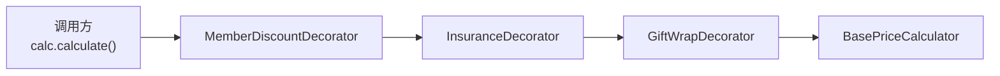
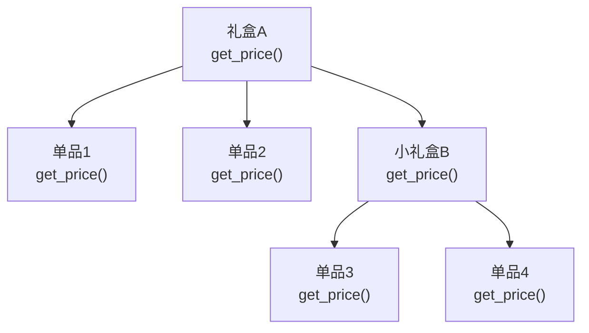
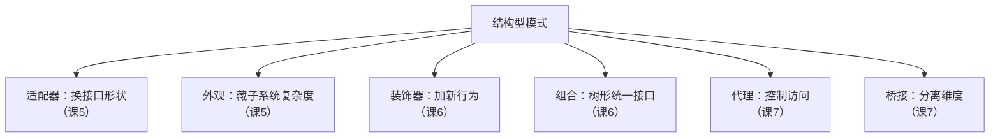

# 课 6 · 装饰器 与 组合（Python 装饰器 vs 装饰器模式）

> 本课在故事主线中的情节定位：订单用 Facade 顺利下单了，但"下单"只是开始——还得**算钱**。基础价格是商品单价之和，可运营不断往上加花样：礼品包装 +¥5、运费险 +1%、优先发货 +¥15、会员折扣 -10%……每加一个"花头"，`calculate_price` 函数里就多一层 `if-else`，`Order` 对象上就多一个布尔标记。与此同时，商品也不再只是单品——运营搞出了"节日礼盒"（礼盒里套单品、甚至套小礼盒），算价代码里 `if isinstance(item, Bundle)` 和 `else` 分叉越来越深。**这一课解决：怎么给对象动态叠加功能而不改原代码，怎么让"单品"和"套装"用同一套接口算价。**

## 本课目标

- 掌握装饰器模式：用包装层动态给对象叠加职责，不改原类。
- 掌握组合模式：让"个体"和"组合体"共享同一接口，递归处理树形结构。
- 辨析 Python `@decorator` 语法糖与 GoF 装饰器模式的区别（本课最大易混点）。

## 知识点清单

1. 装饰器模式（包装 + 委托，动态叠加职责）
2. 组合模式（树形结构，叶子和容器统一接口）
3. Python `@decorator` 语法 vs GoF 装饰器模式辨析

---

## 第一幕 · 场景引入

订单系统的定价模块，最初很简单——把商品价格加起来：

```python
def calculate_price(order: Order) -> float:
    return sum(item.price for item in order.items)
```

但运营部门每隔几周就加一个"花头"：

```python
def calculate_price(order: Order) -> float:
    total = sum(item.price for item in order.items)

    if order.needs_gift_wrap:      # 第1次加：礼品包装
        total += 5
    if order.needs_insurance:      # 第2次加：运费险
        total += total * 0.01
    if order.needs_priority:       # 第3次加：优先发货
        total += 15
    if order.member_discount:      # 第4次加：会员折扣
        total *= 0.9

    return total
```

四个 `if` 看着还好？但运营的计划表上还有"满减""跨店券""红包抵扣""节日加价"……每来一个需求就改这个函数、加一个 `if`、给 `Order` 加一个布尔字段。**改一处崩一片**的坏味道又回来了（回顾课 1 的"开闭原则"——对扩展开放、对修改封闭，这里每次都在**修改**）。

与此同时，`items` 也不安分了。以前每个 item 都是单品（有 `price`），现在运营搞出了**礼盒**——一个礼盒里装 3 个单品，礼盒还能套小礼盒。算价代码被迫分叉：

```python
def calculate_price(order: Order) -> float:
    total = 0
    for item in order.items:
        if isinstance(item, Bundle):         # 礼盒：递归展开
            for sub in item.children:
                if isinstance(sub, Bundle):  # 礼盒套礼盒？再展开…
                    total += sum(s.price for s in sub.children)
                else:
                    total += sub.price
        else:
            total += item.price
    # …后面还有那堆 if-else 花头
    return total
```

两层 `isinstance` 已经够丑了，如果礼盒能套三层呢？

## 第二幕 · 认知冲突

两个问题摆上台面：

1. **怎么给对象加功能而不改原代码？** "那我把每种花头写成一个函数，按需调用不就行了？"——调用顺序谁来保证？运费险按"加完礼品包装后的价格"算 1%，顺序错了金额就错。而且每加一个花头还是得改编排代码。
2. **怎么让单品和礼盒统一算价？** "那我把礼盒的价格预先算好存起来不就行了？"——礼盒里某个单品临时改价，存储的价格就过期了。

> 第一个问题要"**动态叠加功能**"，第二个要"**统一树形接口**"——装饰器和组合分别治这两个病。

## 第三幕 · 层层揭示

### 感知层：这两个"坏味道"有学名

定价函数里那串 `if order.needs_xxx` 不断膨胀，本质是**特征爆炸（Feature Explosion）**——每加一个可选功能就改核心逻辑，违反开闭原则（课 1 学过）。

`isinstance(item, Bundle)` 的层层分叉，本质是**类型分发（Type Dispatch）**——调用方根据对象类型走不同代码路径，而不是让对象自己负责自己的行为。这是面向对象的反模式：**你该问对象，而不是问对象是什么类型**。

### 概念层：装饰器模式（套娃式叠加功能）

**装饰器模式（Decorator）：动态地给一个对象叠加额外的职责，而不改变其接口。装饰器"是一个"被装饰对象（同接口），同时"有一个"被装饰对象（持有引用），通过委托 + 追加实现功能叠加。**

> 人话版：**套娃**。最里面是一个素面订单价，外面套一层"礼品包装"壳，再套一层"运费险"壳，再套一层"会员折扣"壳。每套一层加一个功能，从外面看还是同一个"价计算器"，但里面已经层层叠加了。



先定义统一接口（和课 5 的 Protocol 思路一致）：

```python
from typing import Protocol

class PriceCalculator(Protocol):
    def calculate(self, order: Order) -> float: ...
```

基础计算器——只算商品原价：

```python
class BasePriceCalculator:
    """基础定价：商品单价之和"""
    def calculate(self, order: Order) -> float:
        return sum(item.get_price() for item in order.items)
```

装饰器——每个都是 `PriceCalculator`，持有另一个 `PriceCalculator`，委托 + 追加：

```python
class GiftWrapDecorator:
    """+¥5 礼品包装"""
    def __init__(self, inner: PriceCalculator):
        self._inner = inner

    def calculate(self, order: Order) -> float:
        base = self._inner.calculate(order)   # 委托：先算内层
        return base + 5                        # 追加：加上自己的部分

class InsuranceDecorator:
    """+1% 运费险（基于已叠加的价格）"""
    def __init__(self, inner: PriceCalculator):
        self._inner = inner

    def calculate(self, order: Order) -> float:
        base = self._inner.calculate(order)
        return base + base * 0.01

class PriorityShippingDecorator:
    """+¥15 优先发货"""
    def __init__(self, inner: PriceCalculator):
        self._inner = inner

    def calculate(self, order: Order) -> float:
        base = self._inner.calculate(order)
        return base + 15

class MemberDiscountDecorator:
    """-10% 会员折扣"""
    def __init__(self, inner: PriceCalculator):
        self._inner = inner

    def calculate(self, order: Order) -> float:
        base = self._inner.calculate(order)
        return base * 0.9
```

调用方按需"套娃"——**运行时动态组合，加一个花头就套一层，不加就不套**：

```python
# 不加任何花头
plain = BasePriceCalculator()
print(plain.calculate(order))                    # 纯商品价

# 礼品包装 + 运费险 + 会员折扣（注意顺序：折扣最后套，套在最外层）
fancy = MemberDiscountDecorator(
            InsuranceDecorator(
                GiftWrapDecorator(
                    BasePriceCalculator())))
print(fancy.calculate(order))                    # ((原价+5)*1.01)*0.9
```

> 🐞 关键细节：**装饰顺序决定最终价格**。`GiftWrapDecorator(InsuranceDecorator(base))` 和 `InsuranceDecorator(GiftWrapDecorator(base))` 结果不同——前者先加保险再加包装费（保险不覆盖包装费），后者先加包装再加保险（保险覆盖包装费）。这和数学运算的优先级同理，套在最外面的最后执行。

### 机制层：组合模式（树形结构统一接口）

装饰器解决了"加功能"，但 `items` 里单品和礼盒的分叉还没治。**组合模式（Composite）** 让叶子和容器共享同一接口，容器递归委托给子节点——调用方不用区分"是单品还是礼盒"，统一调 `get_price()` 就行。

**组合模式：把对象组织成树形结构，让调用方统一地对待"个体"（叶子）和"组合体"（容器）。容器自己不做事，而是把操作委托给所有子节点。**

> 人话版：**公司组织架构**。你问"这个部门预算多少？"，部门经理不自己算，而是把问题转给下面的每个小组，小组再转给每个人。你不管问的是"人"还是"部门"，接口都是 `get_budget()`。



```python
from abc import ABC, abstractmethod

class OrderItem(ABC):
    """统一接口：单品和礼盒都能 get_price()"""
    @abstractmethod
    def get_price(self) -> float: ...
    @abstractmethod
    def get_name(self) -> str: ...

class Product(OrderItem):
    """叶子节点：单品"""
    def __init__(self, name: str, price: float):
        self._name = name
        self._price = price

    def get_price(self) -> float:
        return self._price

    def get_name(self) -> str:
        return self._name

class Bundle(OrderItem):
    """容器节点：礼盒，递归委托给子节点"""
    def __init__(self, name: str):
        self._name = name
        self._children: list[OrderItem] = []

    def add(self, item: OrderItem) -> "Bundle":
        self._children.append(item)
        return self

    def get_price(self) -> float:
        return sum(child.get_price() for child in self._children)

    def get_name(self) -> str:
        return self._name
```

调用方再也不用 `isinstance` 了——**不管传进来的是单品还是礼盒，都是 `item.get_price()`**：

```python
# 礼盒A：2个单品 + 一个小礼盒B（B里又有2个单品）
gift_set = Bundle("节日礼盒A").add(
    Product("巧克力", 30)
).add(
    Product("贺卡", 10)
).add(
    Bundle("小礼盒B").add(Product("糖果", 15)).add(Product("贴纸", 5))
)

print(gift_set.get_price())   # 30+10+15+5 = 60
print(gift_set.get_name())    # 节日礼盒A
```

> 🐞 常见误区：**组合模式不是"万能树"**。它最适合"容器和叶子**对调用方而言行为一致**"的场景（算价、统计数量、打印名称）。如果叶子和容器的语义差异很大（比如叶子不能有子节点、容器不能直接定价），强行统一接口反而会让类型系统变模糊。Python 没有"编译期类型安全"的压力，所以组合模式用起来比 Java 更轻，但也更容易滥用——务必确认"统一接口"真的有业务意义。

### 实操层：Python `@decorator` 语法 ≠ GoF 装饰器模式

这是 Python 学习者**最容易混淆的概念**，没有之一。它们名字一样、思想近似（都是"包装"），但本质不同：

| 维度 | Python `@decorator` 语法糖 | GoF 装饰器模式 |
|------|---------------------------|----------------|
| **是什么** | 语言的**语法特性** | **设计模式** |
| **作用对象** | 函数 / 类（在**定义时**包装） | 对象实例（在**运行时**包装） |
| **核心机制** | 高阶函数：接收 callable，返回 callable | 包装类：同接口 + 持有被装饰者引用 |
| **可组合性** | 静态（写在定义上方，固定不变） | 动态（运行时按需叠加，可增可减） |
| **典型用途** | 日志、计时、缓存、路由、权限检查 | 给对象动态加职责（定价花头、咖啡配料） |
| **接口要求** | 不要求（直接替换原 callable） | 必须同接口（装饰者和被装饰者"是一个"） |

看一个 Python `@decorator` 的典型用法——给函数加日志：

```python
# 这是 Python 语法糖，不是 GoF 装饰器模式
def log_call(func):
    def wrapper(*args, **kwargs):
        print(f"调用 {func.__name__}({args}, {kwargs})")
        result = func(*args, **kwargs)
        print(f"返回 {result}")
        return result
    return wrapper

@log_call
def calculate_base(order: Order) -> float:
    return sum(item.get_price() for item in order.items)

# @log_call 在函数定义时就生效了，永久包装，不可运行时拆卸
```

对比 GoF 装饰器模式——运行时动态组合，想套几层套几层：

```python
# 这是 GoF 装饰器模式
calc = BasePriceCalculator()                        # 基础
calc = GiftWrapDecorator(calc)                      # 运行时套一层
calc = InsuranceDecorator(calc)                     # 运行时再套一层
# 不想要保险了？这行不写就行——完全动态
```

**一句话区分**：Python `@decorator` 是"给**函数**贴标签"（定义时生效、永久、用于横切关注点）；GoF 装饰器是"给**对象**穿衣服"（运行时生效、可拆卸、用于叠加业务职责）。

> 💡 它们能混用吗？能——你可以用 Python `@decorator` 语法来**实现**一个 GoF 装饰器的工厂函数，但那是高级用法，初学阶段先把"语法糖 ≠ 设计模式"这个概念分开就行。

> 💡 Python 惯用结论（何时选哪种）：
>
> | 场景 | 用什么 |
> |------|--------|
> | 给函数加横切关注点（日志/计时/缓存） | Python `@decorator` 语法糖 |
> | 给对象动态叠加业务职责（定价花头） | GoF 装饰器模式 |
> | 树形结构统一处理（单品/礼盒、文件/文件夹） | 组合模式 |
> | 只有 2-3 个可选功能且不常变 | `if-else` 就行，别过度设计 |

## 第四幕 · 实操验证

把装饰器和组合串进定价场景，验证从"if-else 地狱"到"动态套娃 + 统一树形"的转变：

```python
from abc import ABC, abstractmethod
from dataclasses import dataclass, field
from typing import Protocol

# ===== 组合模式：单品与礼盒统一接口 =====

class OrderItem(ABC):
    @abstractmethod
    def get_price(self) -> float: ...
    @abstractmethod
    def get_name(self) -> str: ...

class Product(OrderItem):
    def __init__(self, name: str, price: float):
        self._name = name
        self._price = price
    def get_price(self) -> float:
        return self._price
    def get_name(self) -> str:
        return self._name

class Bundle(OrderItem):
    def __init__(self, name: str):
        self._name = name
        self._children: list[OrderItem] = []
    def add(self, item: OrderItem) -> "Bundle":
        self._children.append(item)
        return self
    def get_price(self) -> float:
        return sum(child.get_price() for child in self._children)
    def get_name(self) -> str:
        return self._name

# ===== Order（复用之前课程的 dataclass）=====

@dataclass
class Order:
    order_id: str = ""
    items: list = field(default_factory=list)

# ===== 装饰器模式：动态叠加定价花头 =====

class PriceCalculator(Protocol):
    def calculate(self, order: Order) -> float: ...

class BasePriceCalculator:
    """基础：商品原价之和（自动支持组合模式——item.get_price() 统一调用）"""
    def calculate(self, order: Order) -> float:
        return sum(item.get_price() for item in order.items)

class GiftWrapDecorator:
    def __init__(self, inner: PriceCalculator):
        self._inner = inner
    def calculate(self, order: Order) -> float:
        return self._inner.calculate(order) + 5

class InsuranceDecorator:
    def __init__(self, inner: PriceCalculator):
        self._inner = inner
    def calculate(self, order: Order) -> float:
        base = self._inner.calculate(order)
        return base + base * 0.01

class PriorityShippingDecorator:
    def __init__(self, inner: PriceCalculator):
        self._inner = inner
    def calculate(self, order: Order) -> float:
        return self._inner.calculate(order) + 15

class MemberDiscountDecorator:
    def __init__(self, inner: PriceCalculator):
        self._inner = inner
    def calculate(self, order: Order) -> float:
        return self._inner.calculate(order) * 0.9

# ===== 运行验证 =====

# 构造订单：1个单品 + 1个礼盒（礼盒里套2个单品 + 1个小礼盒）
order = Order(order_id="20260001", items=[
    Product("手机壳", 25),
    Bundle("节日礼盒").add(Product("巧克力", 30))
                        .add(Product("贺卡", 10))
                        .add(Bundle("小礼盒").add(Product("糖果", 15))
                                           .add(Product("贴纸", 5))),
])

# 1) 纯原价（组合模式自动递归）
plain = BasePriceCalculator()
base_price = plain.calculate(order)
print(f"商品原价: {base_price:.2f}")           # 25+30+10+15+5 = 85.00

# 2) 礼品包装 + 运费险 + 会员折扣（装饰器动态叠加）
fancy = MemberDiscountDecorator(
            InsuranceDecorator(
                GiftWrapDecorator(
                    BasePriceCalculator())))
fancy_price = fancy.calculate(order)
# 计算过程: (85+5)*1.01*0.9 = 90*1.01*0.9 = 90.9*0.9 = 81.81
print(f"含花头价: {fancy_price:.2f}")          # 81.81

# 3) 只加优先发货，不加其他
priority_only = PriorityShippingDecorator(BasePriceCalculator())
print(f"仅优先发货: {priority_only.calculate(order):.2f}")  # 85+15 = 100.00

# 4) 验证组合模式：直接调礼盒的 get_price，不用关心它是单品还是套装
for item in order.items:
    print(f"  {item.get_name()}: ¥{item.get_price():.2f}")
# 手机壳: ¥25.00
# 节日礼盒: ¥60.00
```

**验证结果回扣场景**：第一幕那段"4 个 if-else + 2 层 isinstance"的代码，现在变成——定价花头用装饰器运行时动态套娃（想加几层加几层，不加就不套），单品和礼盒用组合模式统一 `get_price()`（不再 `isinstance` 分叉）。运营再加"满减""红包"？写一个新装饰器类，**核心定价代码一行不改**，开闭原则保住了。

## 第五幕 · 体系收束

结构型的第二站。课 5 和课 6 一起构成了"包装型"模式家族——适配器、外观、装饰器都是"包一层"，但目的不同：



| 模式 | 回答的问题 | 一句话 | 和装饰器的区别 |
|------|-----------|--------|----------------|
| 适配器 | 接口不对？ | 圆变方 | 换形状，不加功能 |
| 外观 | 子系统太碎？ | 开前台 | 简化入口，不叠加 |
| **装饰器** | **加功能不改原代码？** | **套娃叠加** | — |
| **组合** | **树形统一处理？** | **叶子容器同接口** | 组织结构，不叠加功能 |

**三种"包装"怎么选**：
- 接口不兼容、要转换形状 → **适配器**
- 子系统复杂、要简化入口 → **外观**
- 要动态叠加功能、保持接口不变 → **装饰器**

**你现在会了什么**：结构型已学 4 种（适配器、外观、装饰器、组合），能区分三种"包装"的不同目的，且辨清了 Python `@decorator` 语法糖和 GoF 装饰器模式的本质区别。

**接下来学什么**：下一课学**代理与桥接**。代理也是"包一层"，但目的不是加功能——而是**控制访问**（懒加载、缓存、权限）。桥接则解决另一个问题：当"抽象"和"实现"各自独立变化时（比如通知系统 = 渠道 × 紧急度），怎么避免子类爆炸。

---

## 命令速查卡（课 6）

| 概念 | 一句话 | Python 惯用 |
|------|--------|-------------|
| 装饰器模式 | 动态叠加职责，同接口 + 持有引用 | 类包装类，`__init__` 持有 inner，方法委托 + 追加 |
| 组合模式 | 树形结构，叶子和容器统一接口 | `ABC` + 叶子类 + 容器类（递归委托） |
| 装饰顺序 | 外层最后执行，影响最终结果 | 套娃顺序 = 计算优先级 |
| Python @decorator | 语法糖，给函数贴标签 | ≠ GoF 装饰器模式，作用对象/时机/机制全不同 |
| @decorator vs GoF | 函数定义时 vs 对象运行时 | 横切关注点用 @，业务叠加用 GoF |

---

## 📚 参考资料

- [Refactoring Guru — 装饰器模式](https://refactoring.guru/design-patterns/decorator)：套娃类比 + Python 示例。
- [Refactoring Guru — 组合模式](https://refactoring.guru/design-patterns/composite)：树形结构图解。
- [Python 官方文档 — decorator](https://docs.python.org/3/glossary.html#term-decorator)：Python `@decorator` 语法糖的官方定义。
- [PEP 318 — Decorators for Functions and Methods](https://peps.python.org/pep-0318/)：Python 装饰器语法的设计提案，理解"语法糖"的由来。

---

## 🚀 下一批接力提示词

> 学完本课后，**复制下面这段发给 AI**，即可无缝进入阶段 2 课 7：

```
继续学设计模式。我的学习档案在 design-patterns/00-学习档案.md，
刚学完阶段 2《结构型》的课 6《装饰器 与 组合》（装饰器模式 / 组合模式 / Python @语法辨析），
请按大纲继续讲解阶段 2 的课 7《代理 与 桥接》。
```

---

## 🧭 课程导航

- 上一课：[课 5 · 适配器 与 外观](lesson-05-适配器与外观.md)
- 下一课：[课 7 · 代理 与 桥接](lesson-07-代理与桥接.md)
- [⬅️ 返回课程目录](../../../02-课程目录.md)
