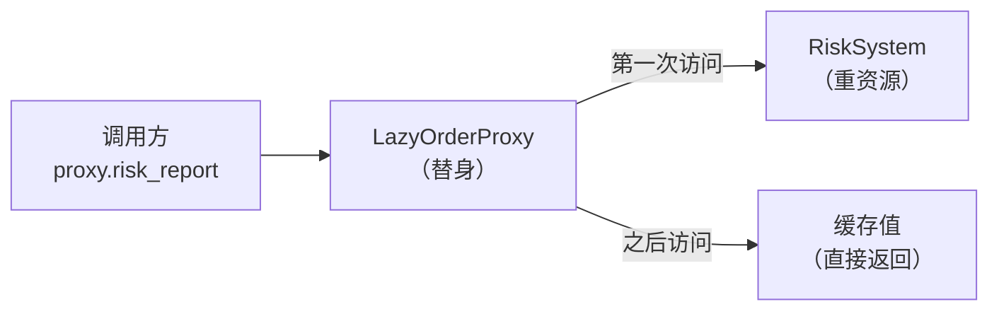
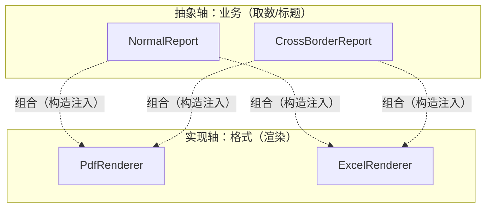
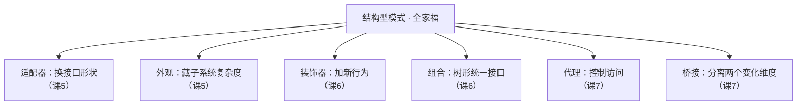

# 课 7 · 代理 与 桥接（控制访问 + 分离变化的维度）

> 本课在故事主线中的情节定位：订单系统跑顺了，新麻烦从"写代码"变成"跑系统"——客服每次查订单详情都要打一次数据库、拉一份 1MB 的风控报告，而 95% 的查询根本不看报告；同时报表需求来了：「普通单/跨境单」两种业务 ×「PDF/Excel」两种格式，下个月还要加"企业单"和 CSV。**这一课解决：用代理控制对重资源的访问（懒加载/缓存/权限），用桥接把两个独立变化的维度拆成两条扩展轴。**

## 本课目标

- 掌握代理模式：虚拟代理（懒加载）、缓存代理、保护代理，认识远程代理。
- 掌握桥接模式：把「业务维度」与「实现维度」分开，用组合连接，消灭笛卡尔积式类爆炸。
- 能一眼分清结构型四种"包一层"：适配器 / 外观 / 装饰器 / 代理——阶段 2 收官检验。

## 知识点清单

1. 代理模式（懒加载 / 缓存 / 访问控制 / 远程代理）
2. 桥接模式（分离两个正交变化维度）
3. 代理 vs 装饰器、桥接 vs 适配器辨析

---

## 第一幕 · 场景引入

订单系统上线三个月，客服团队开始抱怨"订单详情页要转 2 秒"。排查发现 `get_order` 是这么写的：

```python
class OrderRepository:
    def get_order(self, order_id: str) -> Order:
        order = db_query_order(order_id)                        # 打数据库
        order.risk_report = RiskSystem.fetch_report(order_id)   # 拉 1MB 风控报告，800ms
        return order
```

客服一天查 1000 次订单，950 次根本不点开风控报告——**95 万 KB 的白拉**。想优化，脑子里冒出两个土办法：

```python
# 土办法 1：把缓存逻辑塞进 Order 类
class Order:
    def risk_report(self):
        if self._report_cache is None:          # 缓存键、失效、刷新……
            self._report_cache = RiskSystem.fetch_report(self.order_id)
        return self._report_cache
# 后果：领域类背上了"连风控系统、管缓存"的基础设施职责，
#       单元测试要 mock 风控系统，Order 再也不纯粹了

# 土办法 2：在每个用报告的地方判断"拉没拉过"
if order.risk_report is None:
    order.risk_report = RiskSystem.fetch_report(order.order_id)
# 后果：判断散落在 10 个调用点，漏一处就重复拉——面条代码回来了
```

与此同时，数据组要报表。「业务类型 × 输出格式」两个维度一交叉：

```python
class NormalPdfReport:
    def build(self, order):
        rows = [f"金额: {order.amount}", f"买家: {order.user_id}"]        # 普通单的取数逻辑
        return f"[PDF] 普通订单报表 {order.order_id}\n" + "\n".join(rows) # PDF 的渲染逻辑

class CrossBorderPdfReport:
    def build(self, order):
        rows = [f"金额: {order.amount}", "关税: 已代扣"]                   # 跨境单的取数逻辑
        return f"[PDF] 跨境订单报表 {order.order_id}\n" + "\n".join(rows) # PDF 的渲染逻辑（抄的）

class NormalExcelReport: ...        # 普通单取数（再抄一遍）+ Excel 渲染
class CrossBorderExcelReport: ...   # 跨境单取数（再抄一遍）+ Excel 渲染（再抄一遍）

# 2 × 2 = 4 个类：PDF 渲染逻辑抄了 2 遍，普通单取数逻辑抄了 2 遍
# 下个月加"企业单" → 6 个类；再支持 CSV → 9 个类，改一句渲染要同步改 3 处
```

## 第二幕 · 认知冲突

两个问题摆上台面：

1. **懒加载和缓存的逻辑放哪？** 放 `Order` 里，领域类被基础设施污染（违反单一职责，课 1 的 S）；放调用方，判断散落各处。**要的是：调用方照样写 `order.risk_report`，什么都没察觉，但重活只干一次。**
2. **报表两个维度都要变怎么办？** 继承只能沿一条轴展开——继承"普通单"就没法同时继承"PDF 渲染"。用继承表达两个维度，类数量是**笛卡尔积**（3 业务 × 3 格式 = 9）；用复制粘贴则两边逻辑都在重复。**要的是：加一个业务或一个格式，只加一个类。**

> 第一个问题要"**控制访问**"，第二个要"**维度解耦**"——代理和桥接分别治这两个病。

## 第三幕 · 层层揭示

### 感知层：这两个"坏味道"有学名

风控报告"不管用不用先拉再说"，叫**急切加载（Eager Loading）**——和课 4 建造者的"伸缩构造器"同源：把"贵的东西"和"便宜的东西"绑在一起，贵的拖累了全部。

把缓存/限流/权限这类基础设施代码写进领域类，叫**基础设施入侵**——领域类应该只管业务规则，"怎么拿数据、拿完存哪"是另一回事。

报表用继承展开两个维度导致类爆炸，叫**继承爆炸（笛卡尔积展开）**——继承这把锤子只能敲一根钉子，两根钉子得锤两把，还要全排列组合。

### 概念层：代理模式（给重对象配替身）

**代理模式（Proxy）：给一个对象提供替身，由替身控制对原对象的访问。代理与真身同接口，调用方通常察觉不到自己拿的是替身。**

> 人话版：**明星与经纪人**。粉丝（调用方）想找明星（重对象）签名，先过经纪人（代理）：档期没排好？先挡着（懒加载）。这周已经签过一次？把上次签好的给你（缓存）。你狗仔队？拒绝（权限）。粉丝全程以为自己在"找明星"——接口没变，变的是**谁在挡在你和明星中间**。



虚拟代理（懒加载）——最常用的一种：

```python
from typing import Protocol

class RiskReport:
    def __init__(self, order_id: str, score: int):
        self.order_id = order_id
        self.score = score

class RiskSystem:
    """风控系统（重资源）——用调用计数模拟每次拉取都很贵"""
    fetch_count = 0

    @classmethod
    def fetch_report(cls, order_id: str) -> RiskReport:
        cls.fetch_count += 1                      # 每拉一次记一笔
        return RiskReport(order_id, score=85)

class LazyOrderProxy:
    """虚拟代理：风控报告第一次用到才拉，之后复用"""
    def __init__(self, order: Order):
        self._order = order
        self._risk_report: RiskReport | None = None

    @property
    def risk_report(self) -> RiskReport:
        if self._risk_report is None:             # 第一次：真加载
            self._risk_report = RiskSystem.fetch_report(self._order.order_id)
        return self._risk_report                  # 之后：直接返回缓存值

    def __getattr__(self, name):                  # 其余属性原样转发，调用方无感知
        return getattr(self._order, name)
```

关键结构：**同接口 + 持有真身 + 委托**。仓库改成返回代理，调用方一行不改：

```python
def get_order(order_id: str) -> Order:
    order = db_query_order(order_id)
    return LazyOrderProxy(order)      # 返回替身；调用方照样写 proxy.risk_report
```

### 机制层：代理的四种形态 + 缓存代理

| 形态 | 控制什么 | 订单系统里的例子 |
|------|----------|------------------|
| **虚拟代理** | 什么时候创建重对象 | 风控报告懒加载 |
| **缓存代理** | 什么时候重算/重查 | 订单详情查询缓存 |
| **保护代理** | 谁有权限访问 | 风控报告仅管理员可见 |
| **远程代理** | 隐藏"对象在另一台机器" | `warehouse.stock()` 背后是 RPC 网络调用 |

缓存代理——给"每次都打数据库"的仓库套一层：

```python
class OrderRepository:
    """真身：每次都打数据库（用计数模拟）"""
    query_count = 0

    def get_order(self, order_id: str) -> Order:
        OrderRepository.query_count += 1
        return Order(order_id, "u-001", 199.0)

class CachedOrderRepoProxy:
    """缓存代理：同一订单只查一次库"""
    def __init__(self, repo: OrderRepository):
        self._repo = repo
        self._cache: dict[str, Order] = {}

    def get_order(self, order_id: str) -> Order:
        if order_id not in self._cache:
            self._cache[order_id] = self._repo.get_order(order_id)   # 没有才查
        return self._cache[order_id]
```

保护代理——权限不够就不放行：

```python
class ProtectedOrderProxy:
    """保护代理：风控报告仅管理员可见"""
    def __init__(self, order: Order, viewer_role: str):
        self._order = order
        self._role = viewer_role

    @property
    def risk_report(self) -> RiskReport:
        if self._role != "admin":
            raise PermissionError("风控报告仅管理员可见")
        return self._order.risk_report
```

远程代理只需认识一下：真身在另一台机器上，代理把"跨网络调用"藏起来——你调 `warehouse_client.stock()`，背后其实是一次 HTTP/RPC 请求。Redis 客户端对象、各类 ORM 的懒加载关联，本质都是远程/虚拟代理。

**代理 vs 装饰器**——结构几乎一样（同接口 + 持有引用 + 委托），差别全在**意图**：

| 维度 | 装饰器（课 6） | 代理（本课） |
|------|---------------|--------------|
| 意图 | **叠加新职责**（加钱、加折扣） | **控制访问**（懒加载/缓存/权限） |
| 谁组装 | 调用方主动层层套娃，通常知道有装饰 | 对调用方透明，以为拿的就是真身 |
| 生命周期 | 从不创建被装饰者，只包装传进来的 | **常负责真身的创建**（懒加载=代理造真身） |
| 加的东西 | 给行为**加料**，每次结果可以不同 | 不改变行为本身，只管**何时/能否/几 次**执行 |

> 🐞 常见误区：看到"包一层 + 委托"就喊装饰器。判别口诀：**这层皮是在"加功能"还是"守门"？加功能是装饰器，守门是代理。** 另一个信号：装饰器是调用方组装的洋葱圈，代理是"发对象的人"（工厂/仓库）偷偷塞给你的替身。

### 概念层 2：桥接模式（两个维度各自成轴）

**桥接模式（Bridge）：把「抽象」（做什么）与「实现」（怎么做）分离成两条独立的继承轴，用组合连接它们，使两个维度可以独立变化。**

> 人话版：**遥控器与电视机**。遥控器（抽象）和电视（实现）是两条轴：新出一种遥控器（加语音控制），电视不用改；新出一种电视（OLED），遥控器不用改。它们之间靠"红外协议"（组合接口）桥接——而不是为每种"遥控器 × 电视"组合造一个产品。

报表场景里，两条轴就是：**业务类型（取数、标题）× 输出格式（渲染）**。



```python
class Renderer(Protocol):
    """实现轴：怎么渲染"""
    def render(self, title: str, rows: list) -> str: ...

class PdfRenderer:
    def render(self, title: str, rows: list) -> str:
        body = "\n".join(f"  {r}" for r in rows)
        return f"[PDF] {title}\n{body}"

class ExcelRenderer:
    def render(self, title: str, rows: list) -> str:
        return f"[Excel] {title} | " + " ; ".join(rows)

class Report:
    """抽象轴：管取数与标题，渲染委托给注入的 Renderer"""
    def __init__(self, renderer: Renderer):
        self.renderer = renderer                  # 桥：组合连接两个维度

    def build(self, order: Order) -> str:
        return self.renderer.render(self.title(order), self.rows(order))

    def title(self, order: Order) -> str:
        raise NotImplementedError

    def rows(self, order: Order) -> list:
        raise NotImplementedError

class NormalReport(Report):
    """普通单：只有取数/标题逻辑，渲染完全不关心"""
    def title(self, order: Order) -> str:
        return f"普通订单报表 {order.order_id}"
    def rows(self, order: Order) -> list:
        return [f"金额: {order.amount}", f"买家: {order.user_id}"]

class CrossBorderReport(Report):
    """跨境单：加一行关税，渲染照样完全不关心"""
    def title(self, order: Order) -> str:
        return f"跨境订单报表 {order.order_id}（含关税）"
    def rows(self, order: Order) -> list:
        return [f"金额: {order.amount}", f"买家: {order.user_id}", "关税: 已代扣"]
```

调用方按需**组合**两条轴：

```python
print(NormalReport(PdfRenderer()).build(order))       # 普通单 + PDF
print(CrossBorderReport(ExcelRenderer()).build(order)) # 跨境单 + Excel
```

算一笔账（结构型收官前最重要的一笔）：

| 变化 | 继承（笛卡尔积） | 桥接（两条轴） |
|------|------------------|----------------|
| 2 业务 × 2 格式 | 4 个类 | 2 + 2 = 4 个类（但**零复制**） |
| 加"企业单" | 6 个类 | 5 个类（+1） |
| 再加 CSV 格式 | 9 个类，渲染逻辑抄 3 遍 | 6 个类（+1） |
| 改一句 PDF 渲染 | 改 3 个类 | 改 1 个类 |

桥接的本质：**把"乘法"变"加法"**。类数量小的时候差距不明显，真正的收益是**两个维度的代码各自只写一遍**——改渲染只动渲染，改业务只动业务。

### 实操层：Python 惯用

**代理的惯用替代**：标准库 `functools` 里有两个"一行顶一个代理类"的工具：

```python
from functools import cached_property, lru_cache

class OrderV2:
    def __init__(self, order_id: str):
        self.order_id = order_id

    @cached_property                     # 实例级懒加载 + 缓存
    def risk_report(self) -> RiskReport:
        return RiskSystem.fetch_report(self.order_id)

@lru_cache(maxsize=128)                  # 函数级缓存（按参数记结果）
def query_order(order_id: str) -> Order:
    return OrderRepository().get_order(order_id)
```

**桥接的惯用写法**：不必上"抽象类 + 实现类"的双层继承，`Protocol` + 构造注入就是 Python 的桥接；再轻一点，**一等函数**也能当"实现轴"（`render=lambda title, rows: ...`），适合格式逻辑很短的场景。

> 💡 Python 惯用结论（何时选哪种）：
>
> | 场景 | 用什么 |
> |------|--------|
> | 单个属性懒加载 | `@cached_property`（首选） |
> | 纯函数结果按参数缓存 | `@lru_cache`（首选） |
> | 控制多个方法 / 权限 / 计数 / 真身延迟创建 | 手写代理类 |
> | 两个维度都会独立加新成员 | 桥接（Protocol + 构造注入） |
> | 只有一个维度会变（比如只有格式变） | 不用桥接，单条继承/参数化就够 |
> | 两个已有系统接口不兼容（事后） | 适配器（课 5），不是桥接 |

**桥接 vs 适配器**——都涉及"接口分离"，方向相反：

| 维度 | 适配器（课 5） | 桥接（本课） |
|------|---------------|--------------|
| 时机 | **事后补救**：系统已经存在，接口不兼容 | **事前设计**：预见到两个维度都要变 |
| 做什么 | 转换**已有**接口的形状 | 把一个系统**拆成**两条扩展轴 |
| 类比 | 电源转接头 | 遥控器与电视提前分轨 |

## 第四幕 · 实操验证

把代理和桥接串进查询与报表场景，验证"重活只干一次"和"加维度只加一个类"：

```python
from typing import Protocol

# ===== 数据与重资源 =====

class Order:
    def __init__(self, order_id: str, user_id: str, amount: float):
        self.order_id = order_id
        self.user_id = user_id
        self.amount = amount

class RiskReport:
    def __init__(self, order_id: str, score: int):
        self.order_id = order_id
        self.score = score

class RiskSystem:
    fetch_count = 0                       # 用计数模拟"拉一次很贵"
    @classmethod
    def fetch_report(cls, order_id: str) -> RiskReport:
        cls.fetch_count += 1
        return RiskReport(order_id, score=85)

class OrderRepository:
    query_count = 0                       # 用计数模拟"查一次库"
    @classmethod
    def get_order(cls, order_id: str) -> Order:
        cls.query_count += 1
        return Order(order_id, "u-001", 199.0)

# ===== 虚拟代理：懒加载 =====

class LazyOrderProxy:
    def __init__(self, order: Order):
        self._order = order
        self._risk_report: RiskReport | None = None

    @property
    def risk_report(self) -> RiskReport:
        if self._risk_report is None:
            self._risk_report = RiskSystem.fetch_report(self._order.order_id)
        return self._risk_report

    def __getattr__(self, name):
        return getattr(self._order, name)

# ===== 缓存代理：详情查询缓存 =====

class CachedOrderRepoProxy:
    def __init__(self):
        self._cache: dict[str, Order] = {}

    def get_order(self, order_id: str) -> Order:
        if order_id not in self._cache:
            self._cache[order_id] = OrderRepository.get_order(order_id)
        return self._cache[order_id]

# ===== 桥接：业务 × 格式 =====

class Renderer(Protocol):
    def render(self, title: str, rows: list) -> str: ...

class PdfRenderer:
    def render(self, title: str, rows: list) -> str:
        body = "\n".join(f"  {r}" for r in rows)
        return f"[PDF] {title}\n{body}"

class ExcelRenderer:
    def render(self, title: str, rows: list) -> str:
        return f"[Excel] {title} | " + " ; ".join(rows)

class Report:
    def __init__(self, renderer: Renderer):
        self.renderer = renderer
    def build(self, order: Order) -> str:
        return self.renderer.render(self.title(order), self.rows(order))
    def title(self, order: Order) -> str:
        raise NotImplementedError
    def rows(self, order: Order) -> list:
        raise NotImplementedError

class NormalReport(Report):
    def title(self, order): return f"普通订单报表 {order.order_id}"
    def rows(self, order): return [f"金额: {order.amount}", f"买家: {order.user_id}"]

class CrossBorderReport(Report):
    def title(self, order): return f"跨境订单报表 {order.order_id}（含关税）"
    def rows(self, order): return [f"金额: {order.amount}", f"买家: {order.user_id}", "关税: 已代扣"]

# ===== 运行验证 =====

# 1) 虚拟代理：访问两次报告，风控系统只被拉一次
proxy = LazyOrderProxy(Order("20260007", "u-001", 199.0))
print(proxy.risk_report.score, RiskSystem.fetch_count)    # 85 1
print(proxy.risk_report.score, RiskSystem.fetch_count)    # 85 1 —— 没有再拉
print(proxy.amount)                                       # 199.0 —— 属性转发

# 2) 缓存代理：查两次详情，数据库只被打一次
repo = CachedOrderRepoProxy()
print(repo.get_order("20260007").order_id, OrderRepository.query_count)  # 20260007 1
print(repo.get_order("20260007").order_id, OrderRepository.query_count)  # 20260007 1

# 3) 桥接：两条轴自由组合，加业务或格式都只 +1 个类
order = Order("20260007", "u-001", 199.0)
print(NormalReport(PdfRenderer()).build(order))
print(CrossBorderReport(ExcelRenderer()).build(order))
```

运行输出：

```text
85 1
85 1
199.0
20260007 1
20260007 1
[PDF] 普通订单报表 20260007
  金额: 199.0
  买家: u-001
[Excel] 跨境订单报表 20260007（含关税） | 金额: 199.0 ; 买家: u-001 ; 关税: 已代扣
```

**验证结果回扣场景**：第一幕"每次查询白拉 1MB 报告"——现在访问两次报告、查询两次详情，风控系统和数据库各只被碰了 **1 次**（输出里的计数就是证据），且调用方代码全程无感知；"2×2=4 个复制粘贴的报表类"——现在普通单/跨境单与 PDF/Excel **两条轴各自只写一遍**，加"企业单"或 CSV 各只加一个类，改渲染只动一个类。

## 第五幕 · 体系收束

结构型六种模式全部解锁：



阶段 2 收官总表——其中"四种包一层"的辨析是本阶段最重要的 mental model：

| 模式 | 回答的问题 | 一句话 | 一眼识别 |
|------|-----------|--------|----------|
| 适配器 | 接口不对？ | 圆变方 | 转换形状，**事后补救** |
| 外观 | 子系统太碎？ | 开前台 | 简化入口，**一套流程** |
| 装饰器 | 加功能不改原码？ | 套娃叠加 | **加料**，调用方组装 |
| 组合 | 树形统一处理？ | 叶子容器同接口 | **递归**，个体整体一致 |
| 代理 | 访问要控制？ | 配替身 | **守门**，调用方无感知 |
| 桥接 | 两个维度都要变？ | 各自成轴组合 | **乘法变加法**，事前设计 |

**你现在会了什么**：对象怎么"造"（阶段 1 创建型）、怎么"组合与包装"（阶段 2 结构型）都已拿下。你能对任何一个需求先问一句：**变化点在哪个维度？** 接口会变→适配器/桥接；职责会叠加→装饰器；结构成树→组合；访问要管控→代理；流程要收口→外观。

**接下来学什么**：对象造好了、也组合好了，下一个问题是它们**怎么协作**——阶段 3 行为型开场。第一站**策略与模板方法**（课 8）：订单打折规则按会员等级不同——普通 95 折、黄金 9 折、铂金 85 折，还在加新等级，`if-elif` 越来越长。这类"**算法本身会换**"的变化点，正是策略模式的主场；而"流程骨架固定、个别步骤会变"则是模板方法的主场。

---

## 命令速查卡（课 7）

| 概念 | 一句话 | Python 惯用 |
|------|--------|-------------|
| 虚拟代理 | 重数据第一次用到才加载 | 手写代理类 / `@cached_property` |
| 缓存代理 | 结果存起来，重复调用不再算 | 手写代理类 / `@lru_cache` |
| 保护代理 | 权限不够不放行 | 代理类里做检查 |
| 远程代理 | 藏住"对象在另一台机器" | RPC/ORM 客户端对象 |
| 代理 vs 装饰器 | 守门 vs 加料 | 意图不同；代理常创建真身、对调用方透明 |
| 桥接 | 两个维度各自成轴，组合连接 | `Protocol` + 构造注入；乘法变加法 |
| 桥接 vs 适配器 | 事前设计 vs 事后补救 | 分离维度 vs 转换接口 |

---

## 📚 参考资料

- [Refactoring Guru — 代理模式](https://refactoring.guru/design-patterns/proxy)：替身控制访问的图解与多种代理形态。
- [Refactoring Guru — 桥接模式](https://refactoring.guru/design-patterns/bridge)：遥控器与设备类比、两轴独立演化的结构图。
- [Python 官方文档 — functools.cached_property](https://docs.python.org/3/library/functools.html#functools.cached_property)：实例级懒加载缓存属性。
- [Python 官方文档 — functools.lru_cache](https://docs.python.org/3/library/functools.html#functools.lru_cache)：函数级结果缓存。

---

## 🚀 下一批接力提示词

> 学完本课后，**复制下面这段发给 AI**，即可无缝进入阶段 3 课 8：

```
继续学设计模式。我的学习档案在 design-patterns/00-学习档案.md，
刚学完阶段 2《结构型》的课 7《代理 与 桥接》（代理模式 / 桥接模式 / 代理 vs 装饰器辨析），
请按大纲继续讲解阶段 3《行为型》的课 8《策略 与 模板方法》。
```

---

## 🧭 课程导航

- 上一课：[课 6 · 装饰器 与 组合](lesson-06-装饰器与组合.md)
- 下一课：[课 8 · 策略 与 模板方法](../../3-行为型/lessons/lesson-08-策略与模板方法.md)
- [⬅️ 返回课程目录](../../../02-课程目录.md)
