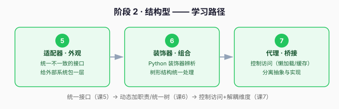

# 阶段 2 · 结构型

> 章节定位：**「把对象优雅地组合起来」** —— 订单系统要接物流、发票、风控三家外部系统，接口五花八门；还要给订单加日志、加缓存、加权限校验，责任越叠越多。**这一阶段解决：怎么让不一致的东西协同、怎么给对象"加功能"而不改原类。**

## 阶段目标

学完本阶段，你能：

1. 用适配器/外观统一不一致的接口。
2. 用装饰器/组合给对象动态加职责、统一处理树形结构。
3. 用代理控制访问、用桥接分离「抽象」与「实现」两个变化维度。

## 学习重点

| 课 | 核心 | 一句话 |
|----|------|--------|
| 课5 | 适配器/外观 | 外部接口再乱，内部只认我定的协议 |
| 课6 | 装饰器/组合 | 组合优于继承；Python 装饰器语法 ≠ 装饰器模式 |
| 课7 | 代理/桥接 | 加个中间层，访问控制与维度解耦都靠它 |

## 必须掌握的知识点

- [ ] 适配器、外观、场景识别
- [ ] 装饰器模式、组合模式、Python @语法辨析
- [ ] 代理（懒加载/缓存）、桥接

## 本阶段路径图

