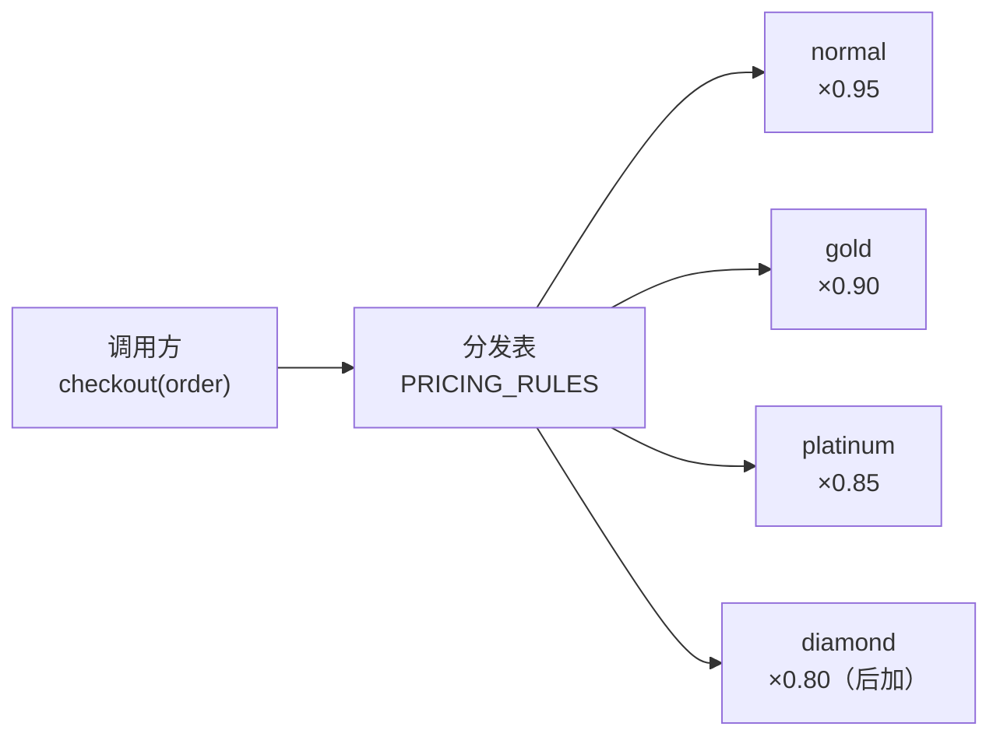
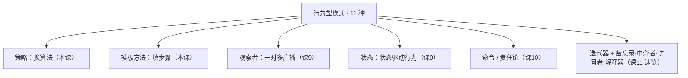

# 课 8 · 策略 与 模板方法（算法可替换）

> 本课在故事主线中的情节定位：结构型收官后，对象"怎么造"（阶段 1）、"怎么包装组合"（阶段 2）你都会了，但订单系统真正的深水区是**运营规则天天变**——会员体系上线，打折按等级走：普通 95 折、黄金 9 折、铂金 85 折，运营还说"下个月上钻石 8 折"。同时下单流程本身（校验库存 → 计价 → 支付 → 通知）在 App、小程序、秒杀三个渠道"骨架一样、个别步骤不同"。**这一课解决：把"会换的算法"抽成可替换的策略（加等级不改老代码）；把"骨架固定、步骤会变"的流程交给模板方法（骨架只有一份真相）。** 这是阶段 3《行为型》的第一课——行为型管的是对象之间**怎么协作**。

## 本课目标

- 掌握策略模式：算法家族各自封装、可互相替换；Python 惯用（一等函数 + 字典分发）。
- 掌握模板方法：基类定骨架、子类填空、钩子方法、好莱坞原则。
- 能依据"变化粒度"选型：整段换是策略，填空是模板。

## 知识点清单

1. 策略模式（一等函数 / 字典分发，消除 if-else）
2. 模板方法（继承 + 抽象方法 / 钩子方法）
3. 策略 vs 模板方法 选择依据

---

## 第一幕 · 场景引入

运营上线了会员体系。计价函数当晚就被改成了这样：

```python
def checkout(order: Order) -> float:
    if order.user_level == "normal":
        price = order.amount * 0.95
    elif order.user_level == "gold":
        price = order.amount * 0.90
    elif order.user_level == "platinum":
        price = order.amount * 0.85
    else:
        price = order.amount
    # ……下面还有 40 行支付、通知逻辑
    return price
```

能跑，但麻烦在后面：**这串分支不止一处**。退款要按等级退服务费、积分要按等级加倍——同样的 `if user_level == ...` 在三个函数里各抄了一遍。运营宣布下个月上线"钻石会员 8 折"，你就得改三个函数，漏改一处就是资损事故。

第二个麻烦跟着来：下单流程要支持三个渠道。App、小程序、秒杀的流程**骨架完全一样**——校验库存 → 计价 → 生成支付单 → 通知——但各有小差别：秒杀要多一步"限购校验"，App 要发推送，小程序什么都不用发。你把流程复制三份各改一点：

```python
def app_place_order(order): ...    # 复制骨架 + 加推送
def wxapp_place_order(order): ...  # 复制骨架
def seckill_place_order(order): ...  # 复制骨架 + 加限购
# 三个月后：App 版加了"计价前查风控"，另外两版没人记得加——骨架漂移了
```

## 第二幕 · 认知冲突

两个问题摆上台面：

1. **打折规则放哪？** 继续 `if-elif`？加一个等级改三处。写一个巨大的 `DiscountRules` 类把所有等级塞进去？改"黄金"的规则时手一抖就会碰坏"铂金"——所有等级挤在一起，没有隔离。
2. **流程复用怎么破？** 复制三份会漂移；抽成公共函数，"个别步骤不同"又得靠传参数、加 `if channel == ...` 区分——面条代码换了个地方复活。

两个问题同根同源：**变化发生在"行为"上，而不是"数据"上**——这正是阶段 3 行为型的主场。区别在变化的**粒度**：

> 打折：整段"计价算法"会被**整体替换** → 策略。
> 流程：骨架**不变**，个别步骤变 → 模板方法。

## 第三幕 · 层层揭示

### 感知层：给坏味道命名

同一串 `if user_level == ...` 散落在多个函数里，加一个等级要追着改多处——这叫**散弹式修改（Shotgun Surgery）**：一个需求变化触发一串代码修改，弹片四溅。三个渠道的流程复制粘贴后各自漂移，是**重复代码（Duplicated Code）**的变种：系统里没有唯一的"流程真相源"，每份拷贝都在独立进化。

回顾课 1 的开闭原则（O）：**对扩展开放、对修改关闭**——加钻石会员时，理想状态是"只加新代码，不改老代码"。if-elif 恰恰相反：每次加等级都要**修改**老函数。这一课就是把 O 原则在"行为"上兑现。

### 概念层：策略模式（导航选路线）

**策略模式（Strategy）：定义一组可互相替换的算法，各自封装成独立的对象/函数，让算法的变化独立于使用它的调用方。**

> 人话版：**地图导航的路线策略**——"最快""最短""避开高速""不走收费"就是四个策略。你说"换避开高速"，导航引擎（调用方）一个字没改，只是换了颗策略零件。引擎和算法解耦：引擎管"怎么走完流程"，策略管"这一步怎么算"。



类形式的策略（GoF 原版的样子）：

```python
from typing import Protocol

class PricingStrategy(Protocol):
    def price(self, order: "Order") -> float: ...

class NormalPricing:
    def price(self, order: "Order") -> float:
        return round(order.amount * 0.95, 2)

class GoldPricing:
    def price(self, order: "Order") -> float:
        return round(order.amount * 0.90, 2)

class PlatinumPricing:
    def price(self, order: "Order") -> float:
        return round(order.amount * 0.85, 2)
```

调用方只依赖"策略接口"，不再认识任何具体等级：

```python
class Checkout:
    def __init__(self, pricing: PricingStrategy):
        self._pricing = pricing          # 组合：策略从外面注入
    def total(self, order: "Order") -> float:
        return self._pricing.price(order)
```

加"钻石会员 8 折" = 新增一个 `DiamondPricing` 类，`Checkout` 一行不改——这就是开闭原则的样子。

### 机制层：字典分发——Python 的惯用策略表

Python 里**函数是一等公民**，策略常常根本不用写成类。一张字典就是策略注册表：

```python
from typing import Callable

PRICING_RULES: dict[str, Callable[[Order], float]] = {
    "normal":   lambda o: round(o.amount * 0.95, 2),
    "gold":     lambda o: round(o.amount * 0.90, 2),
    "platinum": lambda o: round(o.amount * 0.85, 2),
}

def checkout(order: Order) -> float:
    rule = PRICING_RULES.get(order.user_level, lambda o: o.amount)  # 兜底：原价
    return rule(order)
```

原来三处重复的 `if-elif` 全部变成**查表**。加钻石会员：

```python
PRICING_RULES["diamond"] = lambda o: round(o.amount * 0.80, 2)   # 一行，checkout 零修改
```

两个延伸：

**`match` 语句（3.10+）为什么不算解药**——它把分支写得更好看，但所有算法仍集中在一个函数体里，加等级还是要改这个函数。治的是"语法丑"，不是"变化没隔离"。

**装饰器注册——把"加策略"做成声明式**（和课 6 的 `@` 语法呼应）：

```python
PRICING_RULES: dict[str, Callable[[Order], float]] = {}

def pricing(level: str):
    def deco(fn):
        PRICING_RULES[level] = fn     # 注册进表
        return fn
    return deco

@pricing("diamond")
def diamond_pricing(order: Order) -> float:
    return round(order.amount * 0.80, 2)
```

其实你早就在用策略了：标准库 `sorted(data, key=len)`——`key` 就是一个被注入的"比较策略"，换一个函数，排序行为整体改变，`sorted` 本身一行没动。

### 概念层 2：模板方法（骨架只有一份）

**模板方法（Template Method）：基类用一个固定方法定义算法骨架，把可变的步骤延迟到子类实现。骨架只写一份，变化只发生在"空格"里。**

> 人话版：**印好的考卷**。栏目、题号、顺序都印死了（骨架），答题人只在空格里填内容（子类实现），没人能改题目顺序。三个渠道答题，用的是同一张卷子。

```python
from abc import ABC, abstractmethod

class OrderFlow(ABC):
    def place(self, order: Order) -> dict:       # 模板方法：唯一骨架，子类不重写
        self.check_stock(order)                    # ① 固定步骤（公共实现）
        price = self.pricing(order)                # ② 必填空（抽象步骤）
        receipt = self.pay(order, price)           # ③ 固定步骤（公共实现）
        self.notify(order, receipt)                # ④ 选填空（钩子：默认什么都不做）
        return {"order_id": order.order_id, "price": price}

    def check_stock(self, order: Order) -> None:
        print(f"  [骨架] 校验库存: {order.items or ['无']}")

    @abstractmethod
    def pricing(self, order: Order) -> float:      # 必填空：子类必须实现
        ...

    def pay(self, order: Order, price: float) -> str:
        return f"PAY-{order.order_id}-{price}"

    def notify(self, order: Order, receipt: str) -> None:   # 钩子：默认空实现
        pass
```

子类只负责"填空"，谁也不复制骨架：

```python
class AppOrderFlow(OrderFlow):
    def pricing(self, order: Order) -> float:      # 填必填空：复用策略表
        return checkout(order)
    def notify(self, order: Order, receipt: str):  # 填选填空：App 要推送
        print(f"  [App钩子] 推送: {receipt}")

class SeckillOrderFlow(OrderFlow):
    def check_stock(self, order: Order):           # 覆盖"固定步骤"做增强
        super().check_stock(order)                 # 先跑公共逻辑
        print("  [秒杀增强] 限购校验: 每人限 1 件")
    def pricing(self, order: Order) -> float:      # 秒杀五折
        return round(order.amount * 0.50, 2)
```

三个关键机制：

- **模板方法只有一份**：`place()` 定义在基类且不被重写——流程真相唯一，改骨架全渠道同时生效，漂移不可能发生。
- **抽象方法 = 必填空，钩子方法 = 选填空**：抽象方法强制子类给出实现（少填直接报错）；钩子给默认空实现，子类按需覆盖（不填也不报错）。
- **好莱坞原则：别调用我们，我们会调用你**。子类不驱动流程，是骨架在正确的时机**回调**子类的填空——控制反转。这也是"继承的正确用法之一"：继承在这里买到的不是"复用父类代码"，而是"接入一份固定骨架的资格"。

> 🐞 常见误区一：给每个渠道重写 `place()`——那是又回到复制骨架。子类只该填空。
> 🐞 常见误区二：模板方法里塞了七八个抽象方法，子类被迫填一堆用不上的空——空太多说明"变的其实是整个流程"，此时该换策略（整段替换），而不是继续填空。

**回头看得更清**：课 3 的工厂方法其实就是模板方法思想在"创建对象"上的应用——Creator 固定了"使用产品"的流程骨架，把"造哪个产品"这个空留给了子类填。模式之间从不孤立。

### 实操层：Python 惯用与选型

不想用继承、只想参数化个别步骤？**函数注入**是更轻的模板方法——把"空"直接作为参数传进来：

```python
def place(order: Order, *, pricing=None, notify=lambda o, r: None) -> str:
    print(f"  [骨架] 校验库存: {order.items or ['无']}")
    price = (pricing or (lambda o: o.amount))(order)   # 计价策略可注入
    receipt = f"PAY-{order.order_id}-{price}"
    notify(order, receipt)                             # 通知钩子可注入
    return receipt
```

> 💡 Python 惯用结论（何时选哪种）：
>
> | 场景 | 用什么 |
> |------|--------|
> | 算法整体可替换、无状态 | 一等函数 + 字典分发（首选） |
> | 算法有状态 / 是"一套多方法"（计价+退款+积分） | 类策略 |
> | 骨架固定、个别步骤变、子类体系自然存在 | 模板方法（ABC + 钩子） |
> | 不想引入继承，只是个别步骤要定制 | 函数注入 / 回调参数 |
> | 变化的是"整个流程"而非"个别步骤" | 回到策略，别硬用模板 |

**策略 vs 模板方法**——行为型第一组辨析，也是本课的选型核心：

| 维度 | 策略 | 模板方法 |
|------|------|----------|
| 变化粒度 | **整个算法**整体替换 | **个别步骤**变，骨架不动 |
| 实现手段 | 组合 / 委托（注入策略对象） | 继承（子类填空） |
| 子类关系 | 平级兄弟，互相不知道 | 父子共享同一份骨架 |
| 运行期 | 可热替换（换表/换注入） | 编译期定（子类即身份） |
| 口诀 | **换引擎** | **填空格** |

## 第四幕 · 实操验证

把策略表和模板方法串进第一幕的两个场景，验证"加等级只加一行"和"骨架只有一份"：

```python
from abc import ABC, abstractmethod
from dataclasses import dataclass, field
from typing import Callable

@dataclass
class Order:
    order_id: str
    user_id: str
    amount: float
    user_level: str = "normal"
    items: list = field(default_factory=list)

# ===== 策略：字典分发 =====

PRICING_RULES: dict[str, Callable[[Order], float]] = {
    "normal":   lambda o: round(o.amount * 0.95, 2),
    "gold":     lambda o: round(o.amount * 0.90, 2),
    "platinum": lambda o: round(o.amount * 0.85, 2),
}

def checkout(order: Order) -> float:
    rule = PRICING_RULES.get(order.user_level, lambda o: o.amount)
    return rule(order)

# 运营上线钻石会员：注册一行，checkout 与既有规则零修改
PRICING_RULES["diamond"] = lambda o: round(o.amount * 0.80, 2)

# ===== 模板方法：骨架只有一份 =====

class OrderFlow(ABC):
    def place(self, order: Order) -> dict:
        self.check_stock(order)
        price = self.pricing(order)
        receipt = self.pay(order, price)
        self.notify(order, receipt)
        return {"order_id": order.order_id, "price": price}

    def check_stock(self, order: Order) -> None:
        print(f"  [骨架] 校验库存: {order.items or ['无']}")

    @abstractmethod
    def pricing(self, order: Order) -> float: ...

    def pay(self, order: Order, price: float) -> str:
        return f"PAY-{order.order_id}-{price}"

    def notify(self, order: Order, receipt: str) -> None:
        pass

class AppOrderFlow(OrderFlow):
    def pricing(self, order: Order) -> float:
        return checkout(order)                     # 必填空：复用策略表
    def notify(self, order: Order, receipt: str):  # 选填空：App 推送
        print(f"  [App钩子] 推送: {receipt}")

class SeckillOrderFlow(OrderFlow):
    def check_stock(self, order: Order):           # 增强固定步骤
        super().check_stock(order)
        print("  [秒杀增强] 限购校验: 每人限 1 件")
    def pricing(self, order: Order) -> float:      # 秒杀五折
        return round(order.amount * 0.50, 2)

# ===== 运行验证 =====

# 1) 策略表：三等级计价 + 新增钻石只加一行
o1 = Order("20260008", "u-001", 100.0, "normal", ["sku-1"])
o2 = Order("20260009", "u-002", 100.0, "diamond", ["sku-2"])
o3 = Order("20260010", "u-003", 100.0, "vip-unknown")     # 未登记等级 → 原价兜底
print(checkout(o1), checkout(o2), checkout(o3))

# 2) 模板方法：同一份骨架，两种填法
print("— App 下单 —")
print(AppOrderFlow().place(o1))
print("— 秒杀下单 —")
print(SeckillOrderFlow().place(o2))
```

运行输出：

```text
95.0 80.0 100.0
— App 下单 —
  [骨架] 校验库存: ['sku-1']
  [App钩子] 推送: PAY-20260008-95.0
{'order_id': '20260008', 'price': 95.0}
— 秒杀下单 —
  [骨架] 校验库存: ['sku-2']
  [秒杀增强] 限购校验: 每人限 1 件
{'order_id': '20260009', 'price': 50.0}
```

**验证结果回扣场景**：第一幕"三处 if-elif 加等级改三处"——现在钻石会员只是**表里多一行**（`80.0` 即证据），未登记等级自动原价兜底（`100.0`），既有代码零修改；"三个渠道流程复制漂移"——现在 App 与秒杀走的是**同一份 `place()` 骨架**（两边都打印了 `[骨架] 校验库存`），差异全部收在填空里：App 填了通知钩子（推送），秒杀增强了库存校验并改写计价。

## 第五幕 · 体系收束

行为型第一站。三大阶段的分工至此完整：**创建型管"怎么造"，结构型管"怎么包装组合"，行为型管"怎么协作"**。行为型共 11 种，本课程的路线图：



（享元属结构型模式，课程把它也安排在课 11 一并速览，不占行为型 11 种的名额。）

| 模式 | 回答的问题 | 一句话 |
|------|-----------|--------|
| 策略 | 算法会换怎么办？ | 抽成可替换函数，查表分发 |
| 模板方法 | 骨架固定、步骤变？ | 基类定流程，子类填空 |

**你现在会了什么**：这是你第一次把"变化"从调用方代码里**挪出去**——策略把"会换的算法"挪进注册表，模板方法把"会变的步骤"挪进子类的空格。回头看，课 3 的工厂方法就是模板方法在"创建"上的特例，`sorted(key=...)` 就是策略在标准库里的日常。

**接下来学什么**：计价和流程稳住了，新麻烦来了——订单状态一变（待支付 → 已支付 → 已发货），要通知的东西越来越多：用户短信、库存系统、数据报表，每加一个订阅方你就得改一次状态流转代码；而且流转规则本身开始复杂（已发货不能回到待支付，各状态允许的操作不同）。"**状态一变、多方广播**"是观察者模式的主场，"**对象的行为随状态整体切换**"是状态模式的主场——课 9 一起拿下。

---

## 命令速查卡（课 8）

| 概念 | 一句话 | Python 惯用 |
|------|--------|-------------|
| 策略模式 | 算法家族各自封装、可替换 | 一等函数 + 字典分发（首选） |
| 类策略 | 算法有状态 / 一套多方法 | `Protocol` + 注入 |
| 装饰器注册 | 声明式地加策略 | `@pricing("diamond")` 写入注册表 |
| 模板方法 | 基类定骨架，子类填空 | `ABC` + `@abstractmethod` |
| 钩子方法 | 选填空，默认空实现 | 基类给 `pass` 默认实现 |
| 函数注入 | 不继承的轻量模板 | 变化步骤作为关键字参数传入 |
| 策略 vs 模板 | 换引擎 vs 填空格 | 整段替换用策略，骨架固定用模板 |

---

## 📚 参考资料

- [Refactoring Guru — 策略模式](https://refactoring.guru/design-patterns/strategy)：算法家族封装与替换的结构图解。
- [Refactoring Guru — 模板方法](https://refactoring.guru/design-patterns/template-method)：骨架与步骤分离、钩子方法讲解。
- [Python 官方文档 — abc 模块](https://docs.python.org/3/library/abc.html)：`ABC` 与 `@abstractmethod` 的标准用法。
- [Python 官方 HOWTO — 排序指南](https://docs.python.org/3/howto/sorting.html#key-functions)：`key` 函数——标准库中最日常的策略注入。

---

## 🚀 下一批接力提示词

> 学完本课后，**复制下面这段发给 AI**，即可无缝进入阶段 3 课 9：

```
继续学设计模式。我的学习档案在 design-patterns/00-学习档案.md，
刚学完阶段 3《行为型》的课 8《策略 与 模板方法》（策略模式 / 模板方法 / 策略 vs 模板方法选择），
请按大纲继续讲解阶段 3 的课 9《观察者 与 状态》。
```

---

## 🧭 课程导航

- 上一课：[课 7 · 代理 与 桥接](../../2-结构型/lessons/lesson-07-代理与桥接.md)
- 下一课：[课 9 · 观察者 与 状态](lesson-09-观察者与状态.md)
- [⬅️ 返回课程目录](../../../02-课程目录.md)
