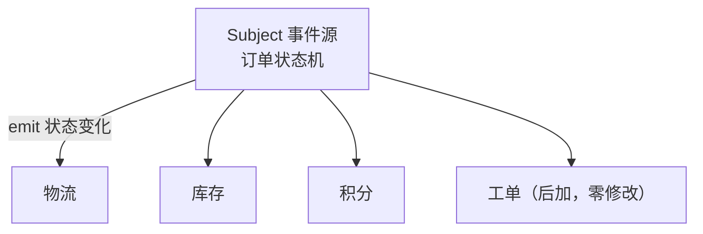
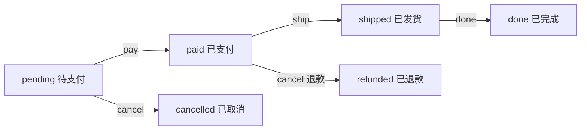
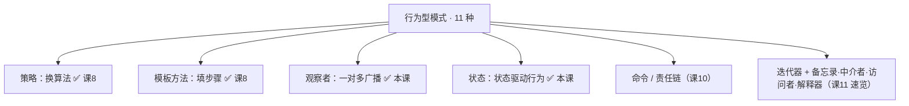

# 课 9 · 观察者 与 状态（事件驱动与状态机）

> 本课在故事主线中的情节定位：课 8 之后，计价走策略表、下单走模板方法，订单系统真正"流转"了起来：待支付 → 已支付 → 已发货 → 已完成。两个新麻烦同时找上门。其一，支付成功那一刻要惊动三方——通知物流发货、扣减库存、加会员积分（课 8 结尾预告的"订阅方越来越多"如期而至）——这些通知调用被焊死在支付主流程里，客服团队说"我们也要加工单"，你就得再改一次 `pay()`。其二，订单状态靠一堆布尔变量（`is_paid`、`is_shipped`……）互相牵制地拼出来，动不动就进入非法状态（没支付却已发货）。**这一课解决：把"谁关心这件事"从主流程里解耦出去（观察者模式）；把"随状态切换的整套行为"收进一张转移表（状态模式）。**

## 本课目标

- 掌握观察者模式（发布-订阅）：事件源与处理方解耦，Python 惯用写法。
- 掌握状态模式：把布尔拼状态 / if-else 判断换成"字典 + 函数"的转移表。
- 能辨析状态模式 vs 策略模式（结构双胞胎，动机不同）。

## 知识点清单

1. 观察者模式（发布-订阅，解耦事件源与处理方）
2. 状态模式（字典 + 函数实现状态机）
3. 状态 vs 策略 辨析

---

## 第一幕 · 场景引入

支付功能上线第一版，代码长这样：

```python
class Order:
    def __init__(self, order_id, user_id, amount):
        self.order_id = order_id
        self.user_id = user_id
        self.amount = amount
        self.is_paid = False
        self.is_shipped = False
        self.is_done = False
        self.is_cancelled = False          # 四个布尔变量"拼"出状态

    def pay(self):
        if not self.is_paid and not self.is_cancelled:
            self.is_paid = True
            notify_logistics(self.order_id)   # 通知 1：物流发货
            deduct_stock(self.order_id)       # 通知 2：扣减库存
            add_points(self.user_id)          # 通知 3：加会员积分
            # 客服团队要加工单 → 再加一行
            # 报表团队要数据   → 再加一行……

    def ship(self):
        if self.is_paid and not self.is_shipped and not self.is_cancelled:
            self.is_shipped = True
            notify_logistics(self.order_id)   # 通知调用又抄一遍
            deduct_stock(self.order_id)
        else:
            raise RuntimeError("状态不对，不能发货")
```

两处隐患同时埋下：

**通知焊死**。三个通知调用直接写在流转方法里。每来一个新订阅方（工单、报表、短信），就得改 `pay()`、改 `ship()`——每个流转方法都要跟着动一遍。

**布尔拼状态**。四个布尔变量理论上能拼出 16 种组合，合法的只有 5 条链路。哪天某处忘了加判断，就会出现 `is_shipped=True` 但 `is_paid=False` 的怪物订单——编译器不拦，上线后风控报警才发现。而且每加一个状态就多一个布尔，每个方法开头的判断条件就再长一截。

## 第二幕 · 认知冲突

两个问题摆上台面：

1. **通知放哪？** 写死在流转方法里，加订阅方改所有方法——这不就是课 8 刚诊断过的"散弹式修改"吗？抽个 `notify_all()` 公共函数？调用还是散在每个流转方法里，而且"谁被通知"依然写死在函数体内。
2. **状态怎么管？** 布尔变量越加越多，判断条件越写越长。换成 `status` 字符串字段？`if self.status == "paid"` 又会在每个方法开头重复一遍——换汤不换药。

两个问题同根：**变化都发生在"行为"上**（课 8 的结论再次应验）。但方向相反：

> 通知是"**一个变化，多方响应**"——1 → N 的广播。
> 状态是"**N 套行为，按当前状态选一套**"——N → 1 的切换。

方向相反，所以是两个模式。

## 第三幕 · 层层揭示

### 感知层：给坏味道命名

通知焊死，病根和课 5 调用处手拼 dict 一模一样：**该集中的信息散落各处**——"谁关心这件事"本该是一份名单，却被摊平在每个流转方法里。布尔拼状态，则是课 1"面向变化点编程"的反面教材：**"状态"这个变化点没有被隔离成独立的东西，而是被摊平成四个互相牵制的布尔**。两味药：把名单抽出去（观察者），把状态抽出去（状态机）。

### 概念层：观察者模式（一份可增减的名单）

**观察者模式：在事件源与它的关注者之间建立一对多的依赖——事件源状态一变，所有关注者自动收到通知。**

> 人话版：**公众号订阅**。你关注（subscribe）一个号，号主发文时平台把文章推给所有关注者；号主发文时根本不知道、也不关心读者具体是谁——涨粉、掉粉，发文代码一字不改。GoF 给它起的别名就是 Publish-Subscribe（发布-订阅）。



类形式的观察者（GoF 原版的样子）：

```python
from typing import Protocol

class Observer(Protocol):
    def update(self, event: str, data: str) -> None: ...

class EventEmitter:
    """Subject：维护订阅者名单，事件发生时逐一通知"""
    def __init__(self):
        self._observers: list[Observer] = []

    def attach(self, obs: Observer) -> None:      # 订阅
        self._observers.append(obs)

    def detach(self, obs: Observer) -> None:      # 退订
        self._observers.remove(obs)

    def emit(self, event: str, data: str) -> None:
        for obs in self._observers:               # 广播：谁在名单上谁收到
            obs.update(event, data)
```

关键在**依赖方向**：事件源只知道"名单上有一批实现了 `update` 的家伙"，不知道它们是物流还是库存。加工单 = 往名单里添一个，`pay()` 零修改——开闭原则又一次兑现。

### 机制层：观察者的 Python 惯用——函数即观察者

课 8 你已经领教过一等函数的威力：**策略是注入一个函数，观察者是注入一串函数**——同一件武器，单发变连发。观察者根本不用写成类：

```python
from typing import Callable

class EventEmitter:
    def __init__(self):
        self._subs: list[Callable[[str, str], None]] = []
    def subscribe(self, fn: Callable[[str, str], None]) -> None:
        self._subs.append(fn)
    def emit(self, event: str, data: str) -> None:
        for fn in self._subs:
            fn(event, data)
```

任何一个 `def sms_handler(event, data)` 的普通函数，放进名单就是一个合法观察者。事件复杂了，把 `event, data` 换成一个 `@dataclass Event`，免得回调签名越加越长。

> 🐞 常见误区一：**循环通知**。观察者回调里反过来改事件源、又触发同一事件——A 通知 B、B 再通知 A，死循环。规矩：回调里别反手触发同一事件链，要改等下一轮。
> 🐞 常见误区二：**依赖通知顺序**。列表确实按订阅顺序遍历，但这是实现细节——观察者之间应当互不认识，谁先谁后不该影响结果。订阅方之间有先后依赖？那不该用观察者，直接写显式流程（外观/模板方法更合适）。

> 💡 进阶提示：长生命周期的事件源 + 大对象观察者，事件源会一直攥着观察者的引用不放（内存泄漏隐患）。可用 `weakref.WeakSet` 当名单——观察者被垃圾回收时自动除名，代价是失去顺序。

其实你天天在用观察者，只是没叫它名字：

- `logging`：`logger.addHandler(handler)`——logger 收到日志事件，广播给所有 handler；
- tkinter：`button.bind("<Button-1>", on_click)`——按钮被点，通知所有绑定的回调；
- asyncio：`fut.add_done_callback(fn)`——协程完成，通知所有等待方。

**观察者 vs 今天常说的"发布订阅"**：GoF 里观察者的别名就是 Publish-Subscribe；但如今说"发布订阅"多指带消息中间件（Kafka、Redis 等）的分布式版本——发布者和订阅者连进程都不同，靠 broker 转发。进程内解耦用观察者就够了，跨系统才上消息队列。

### 概念层 2：状态模式（行为随状态整体切换）

**状态模式：让对象的行为随内部状态整体切换——状态本身升级为对象，每个状态自带"能做什么、做完去哪"。GoF 的原话：对象"仿佛换了一个类"。**

> 人话版：**电梯**。同一颗"开门"按钮，待命时一按就开，运行中按了没反应，检修状态下所有按键全部失灵——行为整套整套地换，取决于电梯当前状态。你不需要在按钮代码里写 `if 检修中 and 运行中 and ...`，问当前状态对象就行。



类形式的状态（GoF 原版的样子）：

```python
class PaidState(OrderState):
    def pay(self, order): raise RuntimeError("已支付，不能重复支付")
    def ship(self, order): order.state = ShippedState()     # 转移规则写在状态里：
    def cancel(self, order):                                # 我最清楚自己能去哪
        refund(order)                                       # 行为也随状态不同
        order.state = RefundedState()
```

订单（Context）只持有一个"当前状态"，把动作**委托**出去；"能不能做、做完去哪"由状态对象自己说了算。新增"售后中"状态 = 新增一个类，其他状态零修改——又是开闭原则。你看——"同一个状态判断在每个方法里重复"这个坏味道，用多态消解到极致，就是状态模式。

### 机制层：状态的 Python 惯用——字典 + 函数的转移表

状态的行为很轻（多数转移就是"改个状态 + 一点副作用"）时，类都嫌重。Python 惯用是**一张转移表**：`状态 → {动作: 处理函数}`：

```python
TRANSITIONS: dict[str, dict[str, Callable[[Order], None]]] = {
    "pending":   {"pay": to_paid, "cancel": to_cancelled},
    "paid":      {"ship": to_shipped, "cancel": refund_and_close},
    "shipped":   {"done": to_done},
    "done":      {},
    "cancelled": {},
    "refunded":  {},
}

def act(self, action: str) -> None:
    handler = TRANSITIONS[self.state].get(action)
    if handler is None:                      # 表里没配 = 自动拒绝
        print(f"  [拒绝] {self.order_id} 状态={self.state} 不支持 {action}")
        return
    handler(self)
```

这张表有三个妙处：

- **单一真相源**：全部转移规则集中在一张表里，评审状态机就是评审这张表（呼应课 7 桥接——每个变化的维度一份真相）。布尔拼状态时代"散在每个方法里的判断"不复存在。
- **漏配即拒绝**："已发货不能取消"不用写一行 `if`——`shipped` 行里没有 `cancel`，就是不行。非法状态从"运行时才发现的怪物订单"变成"表结构上就进不去"。
- **加状态是改表**：新增"售后中"状态，加一行 `"aftersale": {...}`，`act()` 与既有状态零改动。

> 💡 防拼错提示：字符串当状态名怕手滑（`"shippde"` 悄悄混进去）。Python 3.11+ 可用 `enum.StrEnum` 把取值约束在定义处，拼错立刻报错：
> ```python
> from enum import StrEnum
> class OrderStatus(StrEnum):
>     PENDING = "pending"
>     PAID = "paid"
>     # ...
> ```

**状态 vs 策略**——结构上几乎双胞胎（Context 都是把活委托给一个可替换的小对象），差别全在**谁驱动变化**：

| 维度 | 策略（课 8） | 状态（本课） |
|------|--------------|--------------|
| 谁来换 | 客户端注入，外部说了算 | 对象自己随流程换班 |
| 互相认识？ | 平级兄弟，互不相识 | 状态知道彼此（转移规则内嵌） |
| 换的频率 | 通常一次定终身 | 运行中反复切换 |
| 口诀 | **外部换引擎** | **自己会换班** |

### 实操层：两个模式天生一对

状态机管"流转"（改状态），事件器管"广播"（通知名单），组合起来正好还原第一幕的完整需求：

```python
def _set_state(self, new: str) -> None:
    old, self.state = self.state, new
    self.events.emit("state_changed", f"{self.order_id} {old} → {new}")
```

流转代码里只剩"换状态"一个动作，通知全由名单自动扩散。

> 💡 Python 惯用结论（何时选哪种）：
>
> | 场景 | 用什么 |
> |------|--------|
> | 一个变化要通知多方，订阅方会增减 | 观察者（回调列表） |
> | 行为随状态整体切换，转移规则要集中审 | 状态（转移表） |
> | 外部选一套算法注入，运行中不换 | 策略（课 8） |
> | 订阅方之间有顺序/依赖 | 别用观察者，写显式流程 |
> | 跨系统/跨进程广播 | 消息队列（发布订阅的分布式版） |
> | 状态行为很重（每个状态一堆方法） | 类版状态模式，别硬塞进表 |

## 第四幕 · 实操验证

把转移表和回调列表串进第一幕的场景，验证"工单后加零修改"和"非法转移进不来"：

```python
from dataclasses import dataclass, field
from typing import Callable

# ===== 观察者：回调列表 =====

class EventEmitter:
    def __init__(self):
        self._subs: list[Callable[[str, str], None]] = []
    def subscribe(self, fn: Callable[[str, str], None]) -> None:
        self._subs.append(fn)
    def emit(self, event: str, data: str) -> None:
        for fn in self._subs:
            fn(event, data)

# 三个团队的观察者：普通函数即可
def logistics_handler(event, data): print(f"  [物流] {event}: {data}")
def stock_handler(event, data):     print(f"  [库存] {event}: {data}")
def points_handler(event, data):   print(f"  [积分] {event}: {data}")

# ===== 状态：转移表 =====

@dataclass
class Order:
    order_id: str
    amount: float
    state: str = "pending"
    events: EventEmitter = field(default_factory=EventEmitter)

    def _set_state(self, new: str) -> None:
        old, self.state = self.state, new
        self.events.emit("state_changed", f"{self.order_id} {old} → {new}")

    def act(self, action: str) -> None:
        handler = TRANSITIONS[self.state].get(action)
        if handler is None:
            print(f"  [拒绝] {self.order_id} 状态={self.state} 不支持 {action}")
            return
        handler(self)

def to_paid(order):     order._set_state("paid")
def to_shipped(order):  order._set_state("shipped")
def to_done(order):     order._set_state("done")
def to_cancelled(order): order._set_state("cancelled")
def refund_and_close(order):
    print(f"  [退款] {order.order_id} 原路退回 {order.amount} 元")
    order._set_state("refunded")

TRANSITIONS: dict[str, dict[str, Callable[[Order], None]]] = {
    "pending":   {"pay": to_paid, "cancel": to_cancelled},
    "paid":      {"ship": to_shipped, "cancel": refund_and_close},
    "shipped":   {"done": to_done},
    "done":      {},
    "cancelled": {},
    "refunded":  {},
}

# ===== 运行验证 =====

# 1) 观察者：三个团队订阅 + 客服工单"后加"，流转代码零修改
o1 = Order("20260011", 199.0)
for h in (logistics_handler, stock_handler, points_handler):
    o1.events.subscribe(h)

def ticket_handler(event, data): print(f"  [工单] {event}: {data}")
o1.events.subscribe(ticket_handler)   # 新订阅方：一行接入

print("— o1: 正常流转 —")
o1.act("pay")      # pending → paid，四方同时收到
o1.act("ship")     # paid → shipped
o1.act("cancel")   # 已发货：表里没配 → 自动拒绝
o1.act("done")     # shipped → done

# 2) 状态：支付后取消走退款分支；每个订单订阅集独立
o2 = Order("20260012", 49.0)
o2.events.subscribe(stock_handler)    # 只让库存跟着 o2

print("— o2: 支付后取消 → 已退款 —")
o2.act("pay")      # pending → paid，只有库存收到
o2.act("cancel")   # paid + cancel → 退款后落 refunded
```

运行输出：

```text
— o1: 正常流转 —
  [物流] state_changed: 20260011 pending → paid
  [库存] state_changed: 20260011 pending → paid
  [积分] state_changed: 20260011 pending → paid
  [工单] state_changed: 20260011 pending → paid
  [物流] state_changed: 20260011 paid → shipped
  [库存] state_changed: 20260011 paid → shipped
  [积分] state_changed: 20260011 paid → shipped
  [工单] state_changed: 20260011 paid → shipped
  [拒绝] 20260011 状态=shipped 不支持 cancel
  [物流] state_changed: 20260011 shipped → done
  [库存] state_changed: 20260011 shipped → done
  [积分] state_changed: 20260011 shipped → done
  [工单] state_changed: 20260011 shipped → done
— o2: 支付后取消 → 已退款 —
  [库存] state_changed: 20260012 pending → paid
  [退款] 20260012 原路退回 49.0 元
  [库存] state_changed: 20260012 paid → refunded
```

**验证结果回扣场景**：第一幕"客服要加工单就得改 `pay()`"——现在工单是**订阅时多一行**，四条通知全带 `[工单]`，`pay`/`ship` 流转代码零修改；"没支付却已发货的怪物订单"——现在 `shipped` 行里根本没有 `cancel`/`pay`，非法转移被表结构直接挡在门外（`[拒绝]` 一行即证据）；"支付后取消要退款"——同一个 `cancel` 动作，`pending` 行走去 `cancelled`、`paid` 行走 `refund_and_close` 落 `refunded`，行为随状态整体切换。o2 只订了库存，说明订阅集按订单独立，互不干扰。

## 第五幕 · 体系收束

行为型过半。回看已拿下的四员大将，它们其实一直在回答同一个问题的不同侧面——**"变化来了，谁来吸收它"**：



| 模式 | 回答的问题 | 一句话 |
|------|-----------|--------|
| 观察者 | 一个变化多方要知道？ | 维护名单，变化自动广播 |
| 状态 | 行为随状态整套切换？ | 转移表一张，漏配即拒绝 |

**你现在会了什么**：这是你第一次让对象之间**不认识也能协作**——事件源不知道观察者是谁，订单不知道下一个状态是谁，系统却在精确地运转。策略、模板方法、观察者、状态，行为型的"四大常用件"已集齐，剩下的都是这两个思路的变奏。

**接下来学什么**：运营又来了两个需求。其一，用户手滑点了"发货"想撤回——得把"操作"记录下来支持撤销；大促下单请求要排队削峰——得把"请求"攒起来慢慢执行。其二，下单请求要过"风控 → 限购 → 库存"层层把关，每层放行或拦截。命令模式把请求封装成对象（可记录、可撤销、可排队），责任链让请求沿处理者链条流转。种子其实已经埋下：转移表里的 `to_paid`、`refund_and_close` 就是"被封装的操作"——课 10 把这个思路做满。

---

## 命令速查卡（课 9）

| 概念 | 一句话 | Python 惯用 |
|------|--------|-------------|
| 观察者模式 | 一变多方知，名单可增减 | 回调列表 subscribe / emit |
| 观察者本体 | 收到通知怎么办 | 普通函数即可（一等函数） |
| 循环通知 | 回调里反触同一事件链 | 禁止：回调只响应，不反手 |
| 状态模式 | 行为随状态整体切换 | 转移表 dict[str, dict[str, 函数]] |
| 漏配即拒绝 | 表里没有的动作自动拒绝 | 合法性由表结构保证，不写 if |
| 状态名防拼错 | 取值约束在定义处 | `enum.StrEnum`（3.11+） |
| 状态 vs 策略 | 自己会换班 vs 外部换引擎 | 看谁驱动变化 |
| 观察者 vs 发布订阅 | 进程内直接引用 vs 经中间人 | 跨系统才上消息队列 |

---

## 📚 参考资料

- [Refactoring Guru — 观察者模式](https://refactoring.guru/design-patterns/observer)：订阅名单结构与优缺点图解。
- [Refactoring Guru — 状态模式](https://refactoring.guru/design-patterns/state)：状态对象与有限状态机讲解。
- [Python 官方文档 — logging](https://docs.python.org/3/library/logging.html)：`addHandler`——标准库中最日常的观察者。
- [Python 官方文档 — enum.StrEnum](https://docs.python.org/3/library/enum.html#enum.StrEnum)：状态名取值约束（3.11+）。

---

## 🚀 下一批接力提示词

> 学完本课后，**复制下面这段发给 AI**，即可无缝进入阶段 3 课 10：

```
继续学设计模式。我的学习档案在 design-patterns/00-学习档案.md，
刚学完阶段 3《行为型》的课 9《观察者 与 状态》（观察者模式 / 状态模式（字典+函数）），
请按大纲继续讲解阶段 3 的课 10《命令 与 责任链》。
```

---

## 🧭 课程导航

- 上一课：[课 8 · 策略 与 模板方法](lesson-08-策略与模板方法.md)
- 下一课：[课 10 · 命令 与 责任链](lesson-10-命令与责任链.md)
- [⬅️ 返回课程目录](../../../02-课程目录.md)
