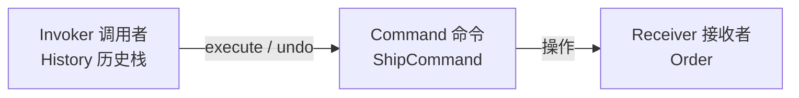
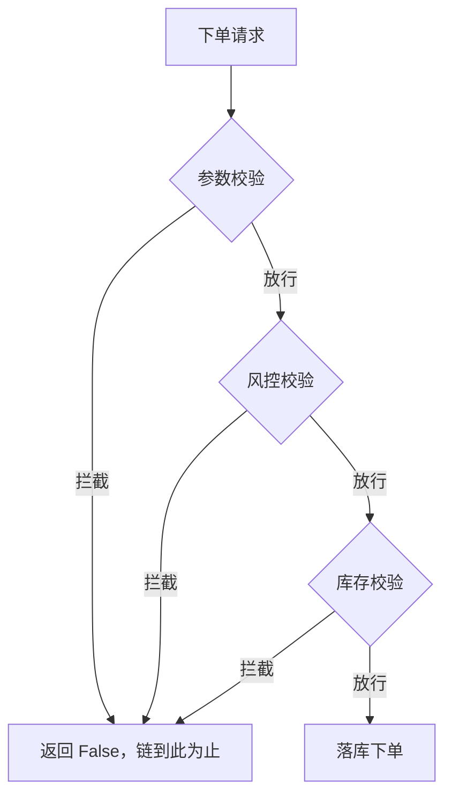
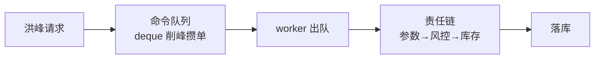
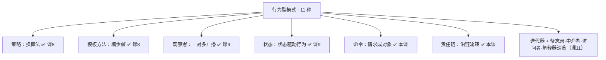

# 课 10 · 命令 与 责任链（请求的封装与流转）

> 本课在故事主线中的情节定位：课 9 之后，状态流转走转移表、状态变化自动广播，订单系统又稳又活。课 9 结尾预告的需求如约而至：用户手滑点了"发货"，其实还没付款——要能**撤销**，最好还能重做；大促零点洪峰，下单请求要把"想做的事"先**攒进队列**，worker 慢慢消化；下单前还要过一串校验——参数校验 → 风控校验 → 库存校验——每一环都可能拦截或放行，且大促期间要求**风控前置**（换顺序不动代码）。这些需求撞在同一个老问题上：函数"调用即执行，执行完就消失"。**这一课解决：把请求封装成可留痕、可撤销、可排队的对象（命令模式）；让请求沿一条可组装、可重排的处理链流转（责任链模式）。**

## 本课目标

- 掌握命令模式：请求封装成对象，支持撤销/重做、任务队列（Python 惯用：可调用对象 + `functools.partial`）。
- 掌握责任链模式：中间件式链式流转，拦截或放行，顺序可配置。
- 理解两者如何让「发起者」与「执行者」解耦。

## 知识点清单

1. 命令模式（可调用对象，撤销/重做/队列）
2. 责任链模式（中间件，链式流转）
3. 两者解耦思想小结

---

## 第一幕 · 场景引入

校验和发货，现在的代码长这样：

```python
def submit(order):
    # 校验串成一坨：顺序写死在表达式里
    if not check_params(order) or not check_risk(order) or not check_stock(order):
        return False
    place_order(order)            # 全过，落库

def ship(order):
    order.state = "shipped"       # 调用即执行，执行完就消失
```

两处隐患同时埋下：

**动作蒸发**。`ship(order)` 一执行完，世上再没有任何东西代表"刚才那一次发货"。运营要求撤销时你才发现无从下手：撤销的前提是**记录**，记录的前提是"这个动作得是个能存下来的东西"——而函数调用是动词，不是名词，落地即蒸发。至于"重做""洪峰期攒请求慢慢处理"，同样需要"请求"能被拿在手里排队，全是同一个前提。

**顺序焊死**。校验顺序被摊平在 `if ... or ... or ...` 这一行表达式里。大促要风控前置？改这行。新增"限购校验"？再改这行、再拉长一截。每个校验"放行之后交给谁"也被表达式焊死——想在参数和风控之间插一层，就得重写整条链的调用关系。

## 第二幕 · 认知冲突

三个需求摆上台面：

1. **撤销**要"历史留下来"；
2. **削峰**要"请求攒起来"；
3. **换序**要"流程拆开来"。

但函数调用的天性是"调用即执行、执行完即消失"——三个需求撞在同一堵墙上。

课 9 其实已经露过一手：转移表 `TRANSITIONS` 里的 `to_paid`、`refund_and_close` 被放进 dict 当值存着——"动作"第一次变成了可以拿在手里的数据。**这就是命令模式的种子**。但裸函数只解决了"能传递"：它没有地方存"做之前的样子"（撤销的依据），没有身份（哪一次调用），更没法进队列排队。

冲突的本质浮出水面：**要把"动作"从动词（调用）变成名词（对象）**——它得有地方装参数、装旧值、装身份。而"校验链"那边，病根和课 5 拼dict、课 9 通知焊死是同一家族：**顺序本该是一份集中的配置，却被摊平在调用表达式里**。

## 第三幕 · 层层揭示

### 感知层：给坏味道命名

**动作蒸发**：一次操作发生后，系统里不存在任何实体能代表它。要记录历史、撤销、排队，第一步都得先有"一个东西"可以存——课 1"面向变化点编程"说过变化点要成为独立的实体，这次轮到"操作本身"这个被忽视的实体了。**顺序焊死**：变化点"校验顺序"没有独立存在，散弹式修改的老朋友——顺序一变，调用表达式跟着重写。

### 概念层：命令模式（把请求变成一张单据）

**命令模式：将请求封装成一个对象，从而可以用不同的请求对客户进行参数化，支持请求的排队、记录日志和撤销。**

> 人话版：**点菜单**。你在单子上勾"一份宫保鸡丁"（创建命令），单子撕下来传给后厨（执行者）——你不认识厨师，厨师也不认识你。单子能排队（大促削峰）、能存档（审计日志）、能作废（撤销）。你点的"内容"和"谁来做、什么时候做"彻底分开。



GoF 原版的骨架（一个约定了正反两个动作的接口）：

```python
from typing import Protocol

class Command(Protocol):
    def execute(self) -> None: ...    # 正着做
    def undo(self) -> None: ...       # 反着做
```

关键在封装的**内容**：命令对象 = 动作（调谁）+ 参数（哪一单）+ 反动作（怎么改回去）。调用者（Invoker）只认识 `execute`/`undo` 两个口，根本不知道单子里包的是什么——新命令类型随便加，调用者零修改，开闭原则第 N 次兑现。

### 机制层：命令的 Python 惯用——可调用对象、partial、队列

课 8 你已经用过"函数是数据"（策略注入）；命令模式是把这件事推到**完整生命周期**：不仅"能传递"，还要"能留痕、能撤销、能排队"。三段递进：

- **轻量命令**：任何可调用对象。`functools.partial(ship, order)` 把"动作 + 参数"打包成一个待执行的东西，`queue.Queue` / `collections.deque` 里排一排，就是最朴素的命令队列——大促削峰的本质。
- **可撤销命令**：裸函数没有地方存"做之前的样子"，于是升级为带 `execute`/`undo` 的对象——这正是本课验证代码的形态。
- **调用者与历史**：`History` 双栈（已完成栈 + 已撤销栈）管撤销/重做，它是典型的 Invoker——只管调 `execute`/`undo`，不认识任何具体命令。

> 🐞 常见误区：**命令不是"多此一举的函数包装"**。判断标准只有一条：这个请求需要排队、记录或撤销吗？需要 → 命令；只是回调一下 → 普通函数即可，别过度设计。
>
> 🐞 常见误区二：**不是所有操作都能"反着做"**。短信发出去收不回，`undo` 就该做**补偿动作**（补发一条更正短信）——真实系统里的撤销常常是补偿，不是时光倒流。另外还有一种撤销哲学是"存快照"（把做之前的样子整个存下来），那叫备忘录模式，课 11 速览见，到时候两种撤销哲学对对碰。

### 概念层 2：责任链模式（让请求沿链流转）

**责任链模式：让多个处理者都有机会处理请求——把处理者串成链，请求沿链传递，每个处理者要么处理它（拦截），要么传给下一个（放行），从而解耦请求的发送者与接收者。**

> 人话版：**报销审批**。你提交报销单，不知道也不需要知道最终谁批。组长（500 以内）→ 经理（5000 以内）→ 总监（50000 以内）：每一级要么批掉，要么往上交。单子沿链走，走到能处理它的那一环为止。



GoF 原版的样子（每个处理者认识下一个）：

```python
class Handler:
    def __init__(self):
        self._next: "Handler | None" = None

    def set_next(self, h: "Handler") -> "Handler":
        self._next = h
        return h                      # 返回下一环，方便链式拼接

    def handle(self, req) -> bool:
        if self._can_handle(req):
            return self._process(req)  # 拦截：自己处理，不再往下传
        return self._next.handle(req)  # 放行：交给下一位
```

### 机制层：责任链的 Python 惯用——中间件

GoF 版有个别扭之处：处理者要互相认识（`set_next` 拼链）。现代框架把拼链这件事抽出来，得到**中间件**形态——每个中间件是一个函数，拿到"下一段"，返回"包装后的自己"：

```python
def check_params(next_):
    def handler(req):
        if req.amount <= 0:
            return False               # 拦截：不调 next_
        return next_(req)              # 放行：交给下一段
    return handler
```

链的组装收进一个函数（本课验证代码有完整版）：

```python
def build_chain(*middlewares):
    handler = terminal                 # 链尾：真的下单
    for mw in reversed(middlewares):
        handler = mw(handler)          # 像套娃一样一层层包上去
    return handler
```

三个妙处：

- **顺序变成数据**：`build_chain(check_params, check_risk, check_stock)` 的执行顺序就是参数顺序——大促风控前置，换参数即可，校验函数零改动。第一幕"顺序焊死在 if 表达式里"的问题，答案竟是"让顺序本身成为一份清单"。
- **处理者互不相识**：每个中间件只看见"下一段"这个抽象的 callable，链条重组不影响任何一环的代码。
- **拦截即停**：不调 `next_`，链自然断掉——后面的校验（如库存）根本不会执行。

你天天在用的责任链：Django 的 `MIDDLEWARE` 列表、Express 的 `app.use(...)`、Web 框架的请求生命周期——每个请求都沿中间件链走一圈，任何一环都可能直接返回 403/429，后面的环节不再执行。

> 🐞 常见误区：**责任链 ≠ if-else 换皮**。如果"谁在什么条件下处理"永远固定，直接函数调用更清晰。责任链的价值在"运行时可组装、可重排、可增删"——链存在的意义就是它的组装方式会变。另外注意与课 9 观察者的分工：**观察者是群发**（一个事件，所有订阅者都消费），**责任链是接力**（一个请求沿链走，通常只被一环消费）。要"人人知道"用观察者，要"层层把关"用责任链。

### 实操层：两者天生一对

命令封装"**做什么**"（What），责任链把关"**做不做**"（Whether）。大促链路把两者串起来：



命令是"货物"，链是"安检门"——货物排队进门，任何一环都能把货物扣下。

**命令 vs 策略**——结构上又一对双胞胎（都是把行为装进对象注入别人），差别在**生命周期**：

| 维度 | 策略（课 8） | 命令（本课） |
|------|--------------|--------------|
| 生命周期 | 注入即执行，只有"执行"一段 | 创建 → 排队 → 执行 → 留痕 → 撤销 |
| 对象代表 | 一类做法（"怎么计价"） | 一次具体请求（"给 20260021 发货"） |
| 关心什么 | 算法本身可替换 | 执行之外的记账能力 |
| 口诀 | **换引擎** | **记账本** |

判据一句话：**只需要"换算法"用策略；需要"排队/记录/撤销"才是命令**——命令模式的全部价值都在 `execute` 之外。

## 第四幕 · 实操验证

三件事逐一对号：手滑发货可撤销（命令）、大额单被拦截（责任链）、风控前置零改码（换序重组装）：

```python
from dataclasses import dataclass
from typing import Callable, Protocol, TypeAlias

# ===== 命令模式：可调用对象 + 撤销/重做 =====

@dataclass
class Order:
    order_id: str
    amount: float
    state: str = "paid"
    note: str = ""

class Command(Protocol):
    def execute(self) -> None: ...
    def undo(self) -> None: ...

class ShipCommand:
    """发货命令：动作与反动作打包成一个对象"""
    def __init__(self, order: Order):
        self._order = order

    def execute(self) -> None:
        self._order.state = "shipped"
        print(f"  [发货] {self._order.order_id} state → shipped")

    def undo(self) -> None:
        self._order.state = "paid"
        print(f"  [撤发货] {self._order.order_id} state → paid")

class NoteCommand:
    """备注命令：execute 先存旧值，undo 才有依据"""
    def __init__(self, order: Order, text: str):
        self._order, self._text = order, text
        self._old = ""

    def execute(self) -> None:
        self._old = self._order.note          # 留痕：做之前的样子
        self._order.note = self._text
        print(f"  [加备注] {self._order.order_id} note = {self._text!r}")

    def undo(self) -> None:
        self._order.note = self._old
        print(f"  [撤备注] {self._order.order_id} note = {self._order.note!r}")

class History:
    """Invoker：双栈管撤销/重做。只认识 execute/undo，不认识任何具体命令"""
    def __init__(self):
        self._done: list[Command] = []
        self._undone: list[Command] = []

    def run(self, cmd: Command) -> None:
        cmd.execute()
        self._done.append(cmd)        # 命令留痕：动作第一次"留了下来"
        self._undone.clear()          # 新操作一到，重做栈作废

    def undo(self) -> None:
        if not self._done:
            print("  [撤销] 没有可撤销的操作")
            return
        cmd = self._done.pop()
        cmd.undo()
        self._undone.append(cmd)

    def redo(self) -> None:
        if not self._undone:
            print("  [重做] 没有可重做的操作")
            return
        cmd = self._undone.pop()
        cmd.execute()                 # 重做 = 重新执行同一个命令对象
        self._done.append(cmd)

# ===== 责任链：中间件式校验链 =====

@dataclass
class Request:
    order_id: str
    amount: float
    user_id: str

Handler: TypeAlias = Callable[[Request], bool]

def check_params(next_: Handler) -> Handler:
    def handler(req: Request) -> bool:
        if req.amount <= 0:
            print(f"  [拦截] {req.order_id} 参数校验：金额非法")
            return False              # 拦截：不调 next_，链到此为止
        print(f"  [通过] {req.order_id} 参数校验")
        return next_(req)             # 放行：交给下一段
    return handler

def check_risk(next_: Handler) -> Handler:
    def handler(req: Request) -> bool:
        if req.amount > 50000:
            print(f"  [拦截] {req.order_id} 风控校验：单笔超限")
            return False
        print(f"  [通过] {req.order_id} 风控校验")
        return next_(req)
    return handler

def check_stock(next_: Handler) -> Handler:
    def handler(req: Request) -> bool:
        if req.amount > 30000:
            print(f"  [拦截] {req.order_id} 库存校验：库存不足")
            return False
        print(f"  [通过] {req.order_id} 库存校验")
        return next_(req)
    return handler

def build_chain(*middlewares: Callable[[Handler], Handler]) -> Handler:
    """把中间件组装成链：执行顺序 = 参数顺序（顺序第一次成为数据）"""
    def terminal(req: Request) -> bool:
        print(f"  [下单] {req.order_id} 全部校验通过，落库！")
        return True
    handler: Handler = terminal
    for mw in reversed(middlewares):
        handler = mw(handler)         # 像套娃一样一层层包上去
    return handler

# ===== 运行验证 =====

# 1) 命令：手滑发货可撤销；新增命令类型（NoteCommand），History 零修改
o = Order("20260021", 299.0)
history = History()

print("— 命令：发货 → 加备注 → 撤销两步 → 重做一步 —")
history.run(ShipCommand(o))                     # 发货
history.run(NoteCommand(o, "客户催发货"))        # 新命令类型直接入栈
history.undo()                                  # 撤销备注
history.undo()                                  # 撤销发货 ← 手滑发货被回退
history.redo()                                  # 重做发货

# 2) 责任链：正常单放行，大额单被风控拦截
print("— 责任链：正常单放行，大额单拦截 —")
chain = build_chain(check_params, check_risk, check_stock)
chain(Request("20260021", 299.0, "u1"))         # 全过 → 落库
chain(Request("20260022", 99999.0, "u2"))       # 风控拦截，库存压根不跑

# 3) 顺序可配置：大促风控前置——校验函数零改动，一行重组装
print("— 责任链：换序重组装（风控前置） —")
chain2 = build_chain(check_risk, check_params, check_stock)
chain2(Request("20260023", -1.0, "u3"))         # 风控先跑（通过），参数拦截
```

运行输出：

```text
— 命令：发货 → 加备注 → 撤销两步 → 重做一步 —
  [发货] 20260021 state → shipped
  [加备注] 20260021 note = '客户催发货'
  [撤备注] 20260021 note = ''
  [撤发货] 20260021 state → paid
  [发货] 20260021 state → shipped
— 责任链：正常单放行，大额单拦截 —
  [通过] 20260021 参数校验
  [通过] 20260021 风控校验
  [通过] 20260021 库存校验
  [下单] 20260021 全部校验通过，落库！
  [通过] 20260022 参数校验
  [拦截] 20260022 风控校验：单笔超限
— 责任链：换序重组装（风控前置） —
  [通过] 20260023 风控校验
  [拦截] 20260023 参数校验：金额非法
```

**验证结果回扣场景**：第一幕"手滑发货无从撤销"——现在 `[撤发货] 20260021 state → paid` 就是证据，命令留在栈里，反着做回去即可；`[发货]` 在重做后再次出现，证明重做复用同一个命令对象。"新增命令类型要改调用方"——`NoteCommand` 是新写的类，`History` 一行未改，它只认识 `execute`/`undo`。"风控前置要改 if 表达式"——`chain2` 换了个参数顺序，输出第一行变成 `[通过] 20260023 风控校验`（风控先跑了），三个校验函数零改动；`[拦截] 20260022` 之后没有库存行，证明拦截即停。

## 第五幕 · 体系收束

行为型还剩最后一课。已拿下的六员大将：



| 模式 | 回答的问题 | 一句话 |
|------|-----------|--------|
| 命令 | 请求要排队/记录/撤销？ | 动作打包成对象，历史留痕 |
| 责任链 | 请求要层层把关、顺序可变？ | 中间件串链，拦截即停 |

**你现在会了什么**：行为型的共同母题到这里已经完整显形——**把"协作关系"从代码里提出来，变成可管理的显式结构**。课 8 把"哪个算法"变成注入项，课 9 把"谁关心"变成名单、"怎么流转"变成转移表，本课把"做什么"变成命令对象、"谁来把关"变成链的组装顺序。发起者、执行者、关注者、把关者，两两互不相识，系统却精确协作——这就是"松耦合"的完全体。

**接下来学什么**：最后一课收两笔账。其一，运营要"只遍历已支付订单""分页遍历百万历史订单"——遍历方式不该焊死在 for 循环里；迭代器模式是 GoF 23 种里唯一被 Python **语言内化**的模式（`__iter__` 协议 + 生成器 `yield`；课 6 辨析过 `@` 语法糖不等于 GoF 装饰器，所以它不算），你天天在用，只是没叫它名字。其二，本课留的尾巴：命令的撤销靠"反着做"，但有些操作反不回去——备忘录模式存"做之前的样子"，两种撤销哲学对对碰。外加中介者、访问者、解释器和享元（结构型）四种低频模式速览，凑齐 23 种全景图，然后进阶段 4 综合实战。

---

## 命令速查卡（课 10）

| 概念 | 一句话 | Python 惯用 |
|------|--------|-------------|
| 命令模式 | 请求封装成对象，可排队/记录/撤销 | 带 execute/undo 的对象 |
| 命令的封装物 | 动作 + 参数 + 反动作 | NoteCommand 存 `_old` |
| Invoker | 只认识 execute/undo，不认识具体命令 | History 双栈 |
| 轻量命令 | 动作+参数打包成待执行物 | functools.partial / 闭包 |
| 命令队列 | 命令是数据，进队慢慢执行 | deque / queue.Queue |
| 补偿动作 | 反不回去的操作用补偿撤销 | 补发更正短信 |
| 责任链模式 | 请求沿链流转，任一环可拦截 | 中间件 mw(next) |
| 拦截即停 | 不调 next_，后面环节不执行 | return False |
| 链序可配置 | 顺序第一次成为数据 | build_chain(参数顺序) |
| 责任链 vs 观察者 | 接力（一环消费）vs 群发（全部消费） | 层层把关 vs 广播 |
| 命令 vs 策略 | 记账本（全生命周期）vs 换引擎（即执行） | 要撤销/排队才用命令 |

---

## 📚 参考资料

- [Refactoring Guru — 命令模式](https://refactoring.guru/design-patterns/command)：命令对象结构与撤销/队列场景图解。
- [Refactoring Guru — 责任链模式](https://refactoring.guru/design-patterns/chain-of-responsibility)：处理者链结构与拦截/放行流程。
- [Python 官方文档 — functools.partial](https://docs.python.org/3/library/functools.html#functools.partial)：轻量命令形态。
- [Django 官方文档 — Middleware](https://docs.djangoproject.com/en/stable/topics/http/middleware/)：工业级责任链：中间件列表。

---

## 🚀 下一批接力提示词

> 学完本课后，**复制下面这段发给 AI**，即可无缝进入阶段 3 最后一课：

```
继续学设计模式。我的学习档案在 design-patterns/00-学习档案.md，
刚学完阶段 3《行为型》的课 10《命令 与 责任链》（命令模式（可调用对象）/ 责任链模式（中间件）），
请按大纲继续讲解阶段 3 的课 11《迭代器 与 其余模式速览》。
```

---

## 🧭 课程导航

- 上一课：[课 9 · 观察者 与 状态](lesson-09-观察者与状态.md)
- 下一课：[课 11 · 迭代器 与 其余模式速览](lesson-11-迭代器与其余模式速览.md)
- [⬅️ 返回课程目录](../../../02-课程目录.md)
