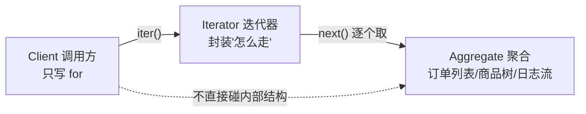
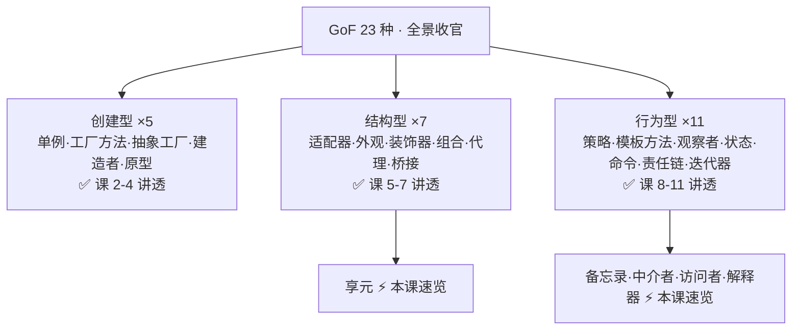

# 课 11 · 迭代器 与 其余模式速览

> 本课在故事主线中的情节定位：课 10 结尾埋了两笔账，本课如约兑现。其一，运营、财务、客服各要一种"走法"——只遍历已支付 / 只遍历待退款 / 分页遍历百万历史订单——而现在"怎么走"焊死在每个 for 循环里，百万订单还得先整个装进内存才能切一页。其二，命令的撤销靠"反着做"，改备注存一个旧值就够；可订单一旦被改得面目全非，反动作根本写不动——需要另一种撤销哲学：拍照存档（备忘录）。外加中介者、访问者、享元、解释器四种低频模式速览，凑齐 GoF 23 种全景图。**这一课解决：把"怎么遍历"从 for 循环里解放出来（迭代器，Python 已内建进语言）；给"反不回去的操作"一颗后悔药（备忘录）；其余模式认得出即可。这是行为型的收官课。**

## 本课目标

- 掌握迭代器模式：`__iter__`/`__next__` 协议 + 生成器 `yield`，看懂 for 循环脱糖，会用惰性分页。
- 速览五种低频模式：备忘录（重点：两种撤销哲学对对碰）、中介者、访问者、享元、解释器——各一句话 + 何时用 + 你在哪见过。
- 收束：形成 GoF 23 种的完整地图，行为型 11 种收官。

## 知识点清单

1. 迭代器模式（生成器/协议，Python 内建支持）
2. 备忘录 / 中介者 / 访问者 / 享元 / 解释器 速览
3. GoF 23 种完整地图收束

---

## 第一幕 · 场景引入

订单系统里到处是集合：订单列表、商品清单、日志流。现在要遍历它们，代码长这样：

```python
def daily_revenue(orders):
    total = 0.0
    for o in orders:                      # 怎么走：焊死
        if o.state == "paid":             # 走谁：也焊死
            total += o.amount
    return total

def history_page(all_orders, page, size): # 分页遍历百万历史订单
    return all_orders[page*size : (page+1)*size]   # 先全量进内存，才能切片
```

三个新诉求同时砸来：

1. **三种走法**：运营要"只看已支付"、财务要"只看待退款"、客服要"只看已发货"——同一个列表三种遍历，现在是每个调用点各写一遍 `for + if`。
2. **百万历史订单**：报表要分页慢慢跑，`all_orders` 是 list——切片前先把一百万个对象整个装进内存，第一页还没看完，内存先爆了。
3. **课 10 的尾巴**：`NoteCommand` 的撤销能"反着做"，是因为它只存了一个字段的旧值；运营把订单的金额、状态、备注一起改了，反动作要把每个字段的写回逻辑都写一遍——写不动，还容易写错。

## 第二幕 · 认知冲突

把三个诉求摆在一起，发现前两个同源：

- "怎么走、走谁、一次走多少"明明是个**变化点**，却被焊死在每个调用点的 for 循环里——想换走法，就得到处改。这和课 5 的"调用顺序焊死"、课 10 的"校验顺序焊死"是同一家族：**本该是一份可替换的显式结构，却被摊平进了代码**。
- 百万订单的分页更荒唐：数据明明躺在数据库/磁盘里，凭什么消费一页就得先全量搬进内存？

第三个诉求暴露的是命令模式的边界：**"反着做"要求你能写出反动作，而反动作不是总写得出来**。

GoF 时代对前两个的答案是迭代器模式：把"怎么走"封装成对象。而 Python 的答案更彻底——**直接把迭代器协议做进语言**，for 循环天生只会说这一种方言。这也是 23 种模式里唯一被 Python 语言内化的一个（课 6 辨析过：`@` 语法糖不等于 GoF 装饰器，所以装饰器不算）。

## 第三幕 · 层层揭示

### 感知层：给坏味道命名

**遍历焊死**：遍历策略（走谁 / 怎么走 / 一次走多少）散落在每个调用点的 for 循环里，换一种走法 = 散弹式修改（课 1 的老朋友）。**全量装载**：只为消费一页，先把整个集合物化进内存——把"数据在哪"和"怎么消费"焊死成了"必须全在内存"。

### 概念层：迭代器模式（把"怎么走"封装成对象）

**迭代器模式：提供一种方法顺序访问一个聚合对象中的各个元素，而又不暴露该对象的内部表示。**

> 人话版：**导游**。游客（调用方）只管跟着走（for 循环），不需要知道公园的内部路线图（数据是列表、树还是流）。同一个公园可以配不同导游：只带你逛"已支付"展馆的导游、一次只带 2 人的分页导游。



GoF 原版是 C++ 的一组问询式操作（`first` / `next` / `is_done` / `current_item` 四件套），翻译成 Python 大概长这样：

```python
class Iterator(Protocol):
    def has_next(self) -> bool: ...
    def next(self) -> Order: ...
```

### 机制层：Python 的答案——语言内化

Python 没有照抄 `has_next`，选了**异常式协议**：`__iter__`（造迭代器）+ `__next__`（走一步，走完抛 `StopIteration`）。然后让 for 循环天生只会说这个协议——**for 脱糖**：

```python
for o in orders:            # 你写的
    ...

# Python 实际干的：
it = iter(orders)           # 1. 调 __iter__ 拿迭代器
while True:
    try:
        o = next(it)        # 2. 反复调 __next__
    except StopIteration:   # 3. 走到头，协议喊停
        break
```

结论：任何对象实现 `__iter__`/`__next__` 协议，就能被 for 遍历——遍历方式从"代码的一部分"变成了"对象的一种能力"。

但手写协议类太啰嗦，Python 又给了终极省力工具——**生成器**：函数里出现一个 `yield`，调用它就自动得到一个迭代器。`yield` 是暂停点：吐一个值，歇一次，下次从暂停处继续。手写协议版的全部逻辑，生成器三行干完。

更大的红利是**惰性求值**：生成器里的代码"走到才执行"——`order_stream(1_000_000)` 调用瞬间返回，一条订单都还没造；for 走一步才造一条。数据在流里，不在内存里。配 `itertools.islice` 从流里切页，百万订单的分页遍历内存占用是常数。

你其实天天在用：`range`（千万次循环不爆内存）、文件对象逐行读、`enumerate`/`zip`/`map`/生成器表达式、下载大文件时 `for chunk in response.iter_content()`——全是迭代器协议。

> 🐞 常见误区一：**生成器用尽即止**。它是一次性的，走完一遍就空了——第二遍再 for 会得到 0 个元素。要复用：先 `list(gen)` 物化成列表，或重新调一次生成器函数。
>
> 🐞 常见误区二：**可迭代对象 ≠ 迭代器**。可迭代对象（有 `__iter__`，如 list）可以被反复 for，每次 for 都领一个新的迭代器；迭代器（额外有 `__next__`）是消耗品。`list` 是前者，`iter(some_list)` 的结果是后者。

### 概念层 2：备忘录模式（两种撤销哲学对对碰）

**备忘录模式：在不破坏封装性的前提下，捕获一个对象的内部状态，并在该对象之外保存这个状态，以便日后将对象恢复到原先保存的状态。**

> 人话版：**游戏存档**。打 Boss 前先存档（拍照），打输了读档（照照片抄回去）。不管刚才那一仗打成什么样，读档一键回到拍照时刻。

课 10 命令的撤销和它构成两种哲学，正面碰撞：

| 维度 | 命令的撤销（课 10） | 备忘录的撤销（本课） |
|------|---------------------|----------------------|
| 哲学 | **反着做**：记变化量（delta） | **读档**：存全量快照（snapshot） |
| 存什么 | 旧值（`NoteCommand` 的 `_old`） | 整个对象在某一刻的样子 |
| 内存开销 | 省（只存变的字段） | 费（整个对象抄一份） |
| 恢复难度 | 反动作难写易错——多字段乱改就写不动 | 无脑抄回，改多狠都能回 |
| 适用 | 可逆的简单操作（状态转移） | 复杂修改 / 不可逆操作前的后悔药 |

真实系统的 undo/redo 常常**混用**：撤销栈里放的还是命令对象（课 10 的骨架不变），但命令的 `execute` 动手前先拍一张快照揣兜里——反动作好写就反着做，不好写就直接读档。

Python 惯用工具：`dataclasses.replace` / `copy.deepcopy`——正是课 4 原型模式的工具箱，此处换个用途。注意 `replace` 是**浅拷贝**：字段全是不可变类型（本课的 Order）时够用；字段里有列表/字典等可变对象时必须 `deepcopy`，否则快照和本体共享内层，改一处、两处变——课 4 深浅拷贝的老知识正好用上。和原型的分界一句话：**原型是"以旧造新"（为新订单服务），备忘录是"存档回滚"（为撤销服务）**。

### 机制层 2：其余四种速览

| 模式 | 一句话 | 何时用 | 你在哪见过 |
|------|--------|--------|-----------|
| 中介者 | 网状交互收进星型中心 | 一群对象互相对话，两两认识乱成一团 | 聊天室（成员只认识"群"）、GUI 事件协调 |
| 访问者 | 不动类，给一组类加新操作 | 类族稳定、操作频繁新增 | `ast.NodeVisitor`、编译器遍历 AST |
| 享元（结构型） | 共享细粒度对象省内存 | 海量小对象、内在状态高度重复 | `sys.intern` 字符串驻留、小整数缓存 |
| 解释器 | 为一种语言定义文法 + 解释器 | 真要造小语言 / 规则引擎时 | `re` 正则引擎、SQL 解析、表达式求值 |

各补一句展开：

- **中介者**是课 9 观察者的亲戚，分界：观察者是**单向广播**（一个事件，通知一群订阅者）；中介者是**双向协调**（一群对象互相对话，都只认识中心）。口诀：**公众号单向推，群聊靠群转**。
- **访问者**的代价：开闭原则在"操作维度"开、在"类维度"关——类族一变，所有 visitor 都得跟着改。AST 类族极其稳定，所以适用。
- **享元**回扣课 6 组合模式的棋盘：1000 个棋子对象，内在状态（红卒/黑卒的画法）只有两种——共享两份，外在状态（位置）各自持有。
- **解释器**是 23 种里公认的最低频模式，见到认得出即可，别急着用。

### 实操层：GoF 23 种全景地图



| 家族 | 讲透 | 速览 |
|------|------|------|
| 创建型 ×5 | 单例（课2）工厂方法·抽象工厂（课3）建造者·原型（课4） | — |
| 结构型 ×7 | 适配器·外观（课5）装饰器·组合（课6）代理·桥接（课7） | 享元（本课） |
| 行为型 ×11 | 策略·模板方法（课8）观察者·状态（课9）命令·责任链（课10）迭代器（本课） | 备忘录·中介者·访问者·解释器（本课） |

对个账：立项时按"约 17 种重点 + 5 种速览"规划，收官清点实际是 **18 种讲透 + 5 种速览 = 23 种**，一个不多一个不少——多出的那一个正是迭代器，它被 Python 内化进语言，几乎白拿。

## 第四幕 · 实操验证

六段代码逐一对号：协议版与生成器版同输出（yield 只是省了样板）、for 脱糖（for 真的只是协议的语法糖）、惰性分页（百万订单内存占用常数）、快照式撤销（对照课 10 的反着做）、用尽即止：

```python
import sys
from dataclasses import dataclass, replace
from itertools import islice
from typing import Iterator

@dataclass
class Order:
    order_id: str
    amount: float
    state: str = "paid"

orders = [
    Order("20260001", 299.0, "paid"),
    Order("20260002", 159.0, "pending"),
    Order("20260003", 49.0, "paid"),
    Order("20260004", 899.0, "cancelled"),
    Order("20260005", 199.0, "paid"),
]

# ===== 1. 迭代器模式：手写协议版 =====
class PaidOrderIterator:
    """手写迭代器：逐个吐出已支付订单"""
    def __init__(self, orders: list[Order]):
        self._orders, self._pos = orders, 0

    def __iter__(self) -> "PaidOrderIterator":
        return self                        # 迭代器的 __iter__ 返回自己

    def __next__(self) -> Order:
        while self._pos < len(self._orders):
            o = self._orders[self._pos]
            self._pos += 1
            if o.state == "paid":
                return o                   # 只吐已支付的
        raise StopIteration                # 走完：向 for 发停机信号

class PaidOrders:
    """聚合对象：只暴露 __iter__，内部列表不外泄"""
    def __init__(self, orders: list[Order]):
        self._orders = orders

    def __iter__(self) -> Iterator[Order]:
        return PaidOrderIterator(self._orders)

print("— 迭代器（手写协议版）：只遍历已支付订单 —")
for o in PaidOrders(orders):
    print(f"  {o.order_id} amount={o.amount}")

# ===== 2. 生成器版 =====
def paid_orders(orders: list[Order]):
    for o in orders:
        if o.state == "paid":
            yield o                        # 暂停点：吐一个，歇一次

print("— 生成器版：三行干完同样的事 —")
for o in paid_orders(orders):
    print(f"  {o.order_id} amount={o.amount}")

# ===== 3. for 循环脱糖 =====
print("— for 循环脱糖：for 只是 __iter__/__next__ 的语法糖 —")
it = iter(paid_orders(orders))
while True:
    try:
        o = next(it)
    except StopIteration:
        break
    print(f"  {o.order_id}")

# ===== 4. 惰性分页 =====
def order_stream(total: int):
    """模拟百万历史订单：一条一条'拉'出来，而不是整个装进内存"""
    for i in range(1, total + 1):
        yield Order(f"2026{i:08d}", float(i % 500))

print("— 惰性分页：流式遍历百万历史订单 —")
stream = order_stream(1_000_000)
print(f"  生成器对象本身只占 {sys.getsizeof(stream)} 字节")
page_no = 1
while page_no <= 3:
    page = list(islice(stream, 2))         # 从流里切一页
    print(f"  第{page_no}页: {[o.order_id for o in page]}")
    page_no += 1
print("  ...（其余 499997 页照此办理：订单在流里，不在内存里）")

# ===== 5. 备忘录：快照式撤销 =====
print("— 备忘录：快照式撤销（对照课10 命令的'反着做'） —")
o = Order("20260021", 299.0)
memento = replace(o)                       # 拍照：全量快照（课4 工具箱）
o.amount, o.state = 399.0, "shipped"       # 一顿乱改
print(f"  改错后: amount={o.amount} state={o.state}")
o.amount, o.state = memento.amount, memento.state   # 照照片抄回去
print(f"  恢复后: amount={o.amount} state={o.state}")

# ===== 6. 生成器用尽即止 =====
print("— 生成器用尽即止（一次性） —")
g = paid_orders(orders)
print(f"  第一遍求和: {sum(o.amount for o in g)}")
print(f"  第二遍求和: {sum(o.amount for o in g)}   ← 0！")
```

运行输出：

```text
— 迭代器（手写协议版）：只遍历已支付订单 —
  20260001 amount=299.0
  20260003 amount=49.0
  20260005 amount=199.0
— 生成器版：三行干完同样的事 —
  20260001 amount=299.0
  20260003 amount=49.0
  20260005 amount=199.0
— for 循环脱糖：for 只是 __iter__/__next__ 的语法糖 —
  20260001
  20260003
  20260005
— 惰性分页：流式遍历百万历史订单 —
  生成器对象本身只占 248 字节
  第1页: ['202600000001', '202600000002']
  第2页: ['202600000003', '202600000004']
  第3页: ['202600000005', '202600000006']
  ...（其余 499997 页照此办理：订单在流里，不在内存里）
— 备忘录：快照式撤销（对照课10 命令的'反着做'） —
  改错后: amount=399.0 state=shipped
  恢复后: amount=299.0 state=paid
— 生成器用尽即止（一次性） —
  第一遍求和: 547.0
  第二遍求和: 0   ← 0！
```

**验证结果回扣场景**：第一幕"三种走法焊死"——`PaidOrders`（协议版）与 `paid_orders`（生成器版）输出逐行相同，证明生成器只是协议的省写；想加"只看待退款"，写一个新的生成器函数即可，调用点的 for 一行不改。"百万订单全量装载"——`生成器对象本身只占 248 字节`，第 1 页瞬间到手，其余 499997 页照此办理，这就是惰性红利。"反动作写不动"——金额、状态一起乱改后，照照片抄回，`恢复后: amount=299.0 state=paid`，读档一键回到拍照时刻。`第二遍求和: 0` 则是误区一的实证：不是 bug，是用尽即止。

## 第五幕 · 体系收束

行为型 11 种全部到齐，第三阶段收官：

| 模式 | 回答的问题 | 一句话 |
|------|-----------|--------|
| 迭代器 | 怎么走要可替换、数据不想全装内存？ | 遍历封装成对象，Python 已内建 |
| 备忘录 | 反动作写不出来的撤销？ | 拍快照，读档式回滚 |

至此，GoF 23 种地图拼完整：**创建型 5 种教你"优雅地造"，结构型 7 种教你"优雅地装"，行为型 11 种教你"松耦合地协作"**。回头看这条主线：课 8 把"哪个算法"变成注入项，课 9 把"谁关心"变成名单、"怎么流转"变成转移表，课 10 把"做什么"变成命令对象、"谁来把关"变成链序，本课把"怎么走"变成协议能力——行为型的母题从头到尾只有一个：**把协作关系从代码里提出来，变成可管理的显式结构**。

**接下来学什么**：最后一课，回到故事开始的地方。阶段 1 第一幕那团"跑得动的面条代码"——`if-else` 判断支付方式、通知渠道、报表格式——将被你亲手重构：先识别坏味道（课 1 的直觉），再选模式（工厂造支付方式、策略算折扣、观察者发通知、责任链做校验、命令留撤销……），一步步替换、每步验证，最后前后对比。12 课埋的所有伏笔在这一课全部回收。

---

## 命令速查卡（课 11）

| 概念 | 一句话 | Python 惯用 |
|------|--------|-------------|
| 迭代器模式 | 顺序访问聚合元素，不暴露内部表示 | `__iter__`/`__next__` 协议 |
| for 的本质 | iter() + 反复 next() + StopIteration | 语法糖，脱糖见第三幕 |
| 生成器 | 制造迭代器最省力的方式 | 一个 yield，自动成迭代器 |
| 惰性求值 | 数据在流里，不在内存里 | 生成器 + islice |
| 惰性分页 | 从流里切一页，内存占用常数 | `itertools.islice` |
| 用尽即止 | 生成器是一次性的，走完即空 | 复用先 list() 或重造 |
| 可迭代 vs 迭代器 | 前者可反复 for，后者是消耗品 | list vs iter(list) |
| 备忘录 | 拍快照，之后读档式恢复 | dataclasses.replace / deepcopy |
| 命令 vs 备忘录撤销 | 反着做（delta，省内存）vs 读档（snapshot，怎么改都能回） | 混用：命令揣快照 |
| 备忘录 vs 原型 | 存档回滚 vs 以旧造新 | 同一工具箱（课4） |
| 中介者 | 网状交互收进星型中心 | 聊天室 / 事件总线 |
| 访问者 | 给稳定类族加新操作 | ast.NodeVisitor |
| 享元 | 共享内在状态省内存 | sys.intern / 小整数缓存 |
| 解释器 | 为小语言定义文法并解释 | re 正则引擎 |

---

## 📚 参考资料

- [Refactoring Guru — 迭代器模式](https://refactoring.guru/design-patterns/iterator)：迭代器结构与聚合解耦图解。
- [Refactoring Guru — 备忘录模式](https://refactoring.guru/design-patterns/memento)：快照/恢复结构与撤销场景。
- [Python 官方文档 — itertools](https://docs.python.org/3/library/itertools.html)：islice 惰性切片等迭代器工具箱。
- [Python 官方文档 — ast.NodeVisitor](https://docs.python.org/3/library/ast.html#ast.NodeVisitor)：标准库里的访问者模式。
- [Python 官方文档 — sys.intern](https://docs.python.org/3/library/sys.html#sys.intern)：享元思想在字符串驻留中的体现。

---

## 🚀 下一批接力提示词

> 学完本课后，**复制下面这段发给 AI**，即可无缝进入最后一课综合实战：

```
继续学设计模式。我的学习档案在 design-patterns/00-学习档案.md，
刚学完阶段 3《行为型》的课 11《迭代器 与 其余模式速览》（迭代器模式（生成器/协议）/ 备忘录·中介者·访问者·享元·解释器速览），
请按大纲继续讲解阶段 4 的课 12《用设计模式重构订单处理系统》。
```

---

## 🧭 课程导航

- 上一课：[课 10 · 命令 与 责任链](lesson-10-命令与责任链.md)
- 下一课：[课 12 · 用设计模式重构订单处理系统](../../4-综合实战/lessons/lesson-12-用设计模式重构订单处理系统.md)
- [⬅️ 返回课程目录](../../../02-课程目录.md)
