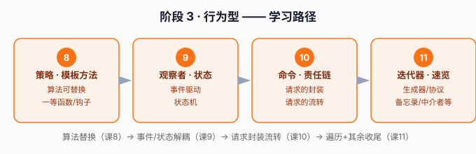

# 阶段 3 · 行为型

> 章节定位：**「让对象各司其职、松耦合协作」** —— 订单系统跑起来了，但业务规则越来越多：不同会员等级不同折扣、订单状态流转、支付成功要同时通知物流+库存+积分……主流程里的 `if-else` 已经千层饼。**这一阶段解决：怎么把「变化的行为」抽出来，让对象之间松耦合地协作。**

## 阶段目标

学完本阶段，你能：

1. 用策略/模板方法替换「一堆 if-else」。
2. 用观察者/状态实现事件驱动与状态机。
3. 用命令/责任链封装、流转请求；用迭代器统一遍历。

## 学习重点

| 课 | 核心 | 一句话 |
|----|------|--------|
| 课8 | 策略/模板方法 | Python 里函数是一等公民，字典分发替代 if-else |
| 课9 | 观察者/状态 | 事件驱动解耦 + 状态机 |
| 课10 | 命令/责任链 | 请求封装成对象，中间件式流转 |
| 课11 | 迭代器/速览 | 生成器即迭代器；其余 5 种速览 |

## 必须掌握的知识点

- [x] 策略、模板方法
- [x] 观察者、状态
- [x] 命令、责任链
- [x] 迭代器、备忘录/中介者/访问者/享元/解释器速览

## 本阶段路径图

---

> ⬅️ 返回 [课程目录](../../02-课程目录.md)｜[学习档案](../../00-学习档案.md)
