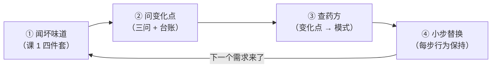
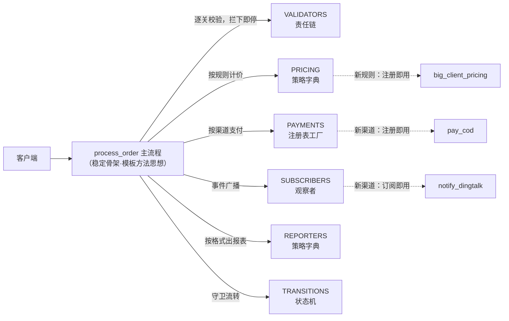

# 课 12 · 用设计模式重构订单处理系统（综合实战）

> 本课在故事主线中的情节定位：**终章**。回到故事开始的地方——课 1 那个为加一个 `elif` 而发愁的 `pay()` 函数，如今长成了四十几行的 `process_order` 面条：校验写死、计价 if-else、支付 if-else、通知写死、报表 if-else、状态随手改。老板一次甩来三个新需求：货到付款、钉钉通知、大客户满减。**这一课解决：把 12 课学到的钥匙串成一套可复用的重构方法——闻坏味道、问变化点、查药方、小步替换、行为保持验收。学完这一课，课程毕业。**

## 本课目标

- 独立走完「识别坏味道 → 识别变化点 → 选模式 → 逐步重构」完整流程。
- 综合运用工厂、策略、观察者、责任链、状态等模式。
- 用「开闭原则」验收重构成果。

## 知识点清单

1. 识别坏味道（从一段面条代码开始）
2. 识别变化点（支付渠道、通知、报表、状态流转）
3. 选模式 + 逐步重构（工厂+策略+观察者+责任链+状态）
4. 前后对比与总结（加新需求的验收）

---

## 第一幕 · 场景引入：面条的完全体

课 1 那天，`pay()` 只有一个 `elif` 的烦恼。11 课过去了，订单系统一路迭代，那个函数长大了——长成了 `process_order`，从校验一路包办到报表：

```python
def process_order(o):
    # ---- 1. 校验：写死两条 ----
    if not o.items: ...
    if o.subtotal > 100_000: ...
    # ---- 2. 计价：规则 if-else ----
    if o.pricing == "vip":           total = o.subtotal * 0.8
    elif o.pricing == "full_reduce": total = o.subtotal - 50 if o.subtotal >= 300 else o.subtotal
    else:                            total = o.subtotal
    # ---- 3. 支付：渠道 if-else（课 1 的老朋友长大了）----
    if o.payment == "wechat":   pay_msg = f"微信支付 {total:.2f} 元"
    elif o.payment == "alipay": pay_msg = f"支付宝支付 {total:.2f} 元"
    elif o.payment == "card":   pay_msg = f"银行卡支付 {total:.2f} 元"
    else: return f"[{o.order_id}] 拒绝：不支持的支付方式 {o.payment}"
    # ---- 4. 通知：写死短信 + 邮件 ----
    notes = [f"短信：订单 {o.order_id} 已支付 {total:.2f} 元",
             f"邮件：订单 {o.order_id} 已支付 {total:.2f} 元"]
    # ---- 5. 报表：格式 if-else ----
    if o.report == "json":  report = ...
    elif o.report == "csv": report = ...
    o.state = "paid"    # 状态随手改，无人看守
```

（完整可运行版见第四幕。）

周一早会，老板一次甩来三个需求：**支持货到付款、通知加钉钉渠道、大客户满 1000 减 200**。数一数面条版要动几处：支付 `+1` 个 `elif`、计价 `+1` 个 `elif`、通知列表 `+1` 行——三处全在"修改已上线、已测过、正在跑"的代码上（课 1 的原话），而且每动一次，整个函数都要全量回归。课 1 给这个病起过名字：**散弹式修改**。

## 第二幕 · 认知冲突：会 23 招，不等于会打架

23 把钥匙都挂上了腰，真站在面条面前，反而犹豫了——好像哪个模式都能上。两个坑就在脚边：

- **坑一：拿着锤子找钉子**。每个需求都"正好"适合上周学的那个模式；套完一层再套一层，过度设计出来的代码比面条更难维护。课 1 说过"模式不是越多越好"，课 11 也提醒过"解释器别急着用"——23 招是药方，不是保健品。
- **坑二：推倒重写**。"反正要大改，我重写一个吧"——重写（rewrite）和重构（refactor）差在有没有对账单：重写没有行为基准，新 bug 和旧行为混在一起，无从分辨。

Martin Fowler 在《重构》（1999 首版，2018 第 2 版）里的定义一锤定音：

> 重构：在**不改变软件可观察行为**的前提下，调整代码内部结构。

推论很硬：**没有"行为保持"验证的重构，就是赌博。** 所以本课的主角不是任何一个模式，而是流程——模式是药方，这一课学的是**问诊和疗程管理**。

## 第三幕 · 层层揭示：四步重构法



### 感知层 · 第一步：闻坏味道

拿课 1 的四件套对号入座：

| 坏味道 | 在订单系统哪里 |
|--------|---------------|
| 长 if-else / switch | ×3：计价、支付、报表 |
| 上帝类（这里是上帝函数） | `process_order` 一个函数干五件事 |
| 散弹式修改 | 加一个渠道要动多处已上线代码 |
| 类名带 And / Manager | 本例未命中——职责烂在函数体里，还没烂到类名上 |
| 课 1 四件套之外的一个 | `o.state = "paid"` 随手赋值——现在你知道它缺一张转移表（课 9） |

### 概念层 · 第二步：问出变化点（三问）

坏味道只是症状，病灶要靠"变化点三问"找：

1. **问未来**：未来一年，哪里最可能加东西？——老板的原话是"以后**渠道**还会加"。凡是需求里出现"渠道、规则、格式"这类**复数名词**的，都高度可疑。
2. **问词频**：需求文档和老板嘴里反复出现的词是什么？——"支付**渠道**""通知**渠道**""计价**规则**""报表**格式**"，清一色复数名词。
3. **问历史**：哪段代码过去改过两次以上？——`pay()` 从只有微信到三种渠道，改过 3 次（课 1 的故事）；计价规则上季度刚加过满减。

三问之后，本系统的**变化点台账**成型：

| 变化点 | 会怎么变 |
|--------|---------|
| 校验规则 | 会增、会删、会调序 |
| 计价规则 | 会增（大客户满减已在路上） |
| 支付渠道 | 会增（货到付款已在路上） |
| 通知渠道 | 会增（钉钉已在路上） |
| 报表格式 | 会增 |
| 流程骨架（校验→计价→支付→通知→报表） | **稳定**，五个环节一个不增不减 |
| 订单生命周期（created→paid→…） | **状态集稳定**，但流转要守卫 |

同时列一份反向清单——**看似能变、其实别动**：商品小计的计算、拒绝消息的格式。为它们做抽象就是过度设计。找变化点的同时也要确认不变点，两边都钉死了才动手。

### 机制层 · 第三步：查药方（变化点 → 模式总决策表）

这张表是 12 课的总药方，也是整个课程的毕业礼物——**以后遇到新系统，从左列找到你的变化点，右列就是首选药方**。

**创建型家族（怎么造对象）**

| 变化点 | 药方 | 出处 |
|--------|------|------|
| 全局只要一个实例 | 单例 | 课 2 |
| "造哪种对象"会变 | 工厂方法 | 课 3 |
| "造一族配套对象"会变 | 抽象工厂 | 课 3 |
| 复杂对象的组装步骤多变 | 建造者 | 课 4 |
| 想以旧对象为模板造新对象 | 原型 | 课 4 |

**结构型家族（怎么组装对象）**

| 变化点 | 药方 | 出处 |
|--------|------|------|
| 第三方/遗留接口和我要的不一致 | 适配器 | 课 5 |
| 子系统太杂，要一扇统一的门 | 外观 | 课 5 |
| 功能要能自由叠加、顺序可变 | 装饰器 | 课 6 |
| 树形结构，枝和叶要统一处理 | 组合 | 课 6 |
| 要控制对对象的访问（懒加载/缓存/鉴权） | 代理 | 课 7 |
| 两个维度都要独立变化 | 桥接 | 课 7 |
| 海量小对象，重复状态可共享 | 享元 | 课 11 速览 |

**行为型家族（怎么协作）**

| 变化点 | 药方 | 出处 |
|--------|------|------|
| 同一件事有多种做法，要能切换 | 策略 | 课 8 |
| 流程骨架固定，个别步骤可变 | 模板方法 | 课 8 |
| 一个事件要通知一群关心者 | 观察者 | 课 9 |
| 对象行为随状态改变 | 状态 | 课 9 |
| 操作要排队、撤销、留痕 | 命令 | 课 10 |
| 处理步骤要可配置、可拦截 | 责任链 | 课 10 |
| 遍历方式要变 / 数据大到不能全装内存 | 迭代器 | 课 11 |
| 需要"后悔药"式快照回滚 | 备忘录 | 课 11 |
| 一群对象互相对话乱成一团 | 中介者 | 课 11 速览 |
| 要给稳定的类族频繁加新操作 | 访问者 | 课 11 速览 |
| 真要造一门小语言 | 解释器 | 课 11 速览 |

查表之前，先过一遍**选型三掂量**：

1. **变化真的会来吗？**——YAGNI（You Aren't Gonna Need It，极限编程原则）：为想象中的需求上模式，是过度设计的起点（课 1：没病别吃药）。
2. **语言/框架是不是已经内建？**——迭代器 Python 已内建；Django 的信号、logging 的 Handler 都是现成的观察者。先找现成的，再造自己的。
3. **团队看得懂吗？**——模式是团队词汇：一句"这里加个策略"胜过十行注释；没人认识的模式等于没写文档的炫技。

### 实操层 · 第四步：小步替换，每步行为保持

药方开了，疗程比药更重要。**第 0 步先织测试网**：挑几笔固定订单（成功路径 + 拒绝路径都要有），把重构前的输出原样锁死——这就是"行为基准"，之后每动一步都回来对账，逐字一致才许继续。然后一步只换一个零件：

| 步 | 动作 | 用的药 | 每步之后 |
|----|------|--------|---------|
| 1 | 抽支付渠道 if-else → 注册表 | 工厂（注册表） | 跑测试网，逐字一致 |
| 2 | 抽计价规则 if-else → 字典分发 | 策略 | 同上 |
| 3 | 抽通知列表 → 订阅者列表 | 观察者 | 同上 |
| 4 | 抽校验 → 校验链 | 责任链 | 同上 |
| 5 | 抽报表 if-else → 字典分发 | 策略（二用） | 同上 |
| 6 | 状态随手赋值 → 转移表守卫 | 状态 | 同上，外加非法流转测试 |

注意第 1 步：**这个动作你在课 1 第四幕已经亲手做过一遍**——把 `pay()` 的 if-else 换成注册表。终章的重构，不过是把同一个动作在另外四个变化点上重放五遍。全部换完后，主流程只剩骨架——这正是模板方法思想（课 8）的函数式落实：骨架固定、零件可换，流程只有几行时不必动用继承。取消订单要可撤销，再补一个命令对象，动手前先拍快照（备忘录）。

重构后的架构一图流——稳定的骨架在中间，可替换的零件挂在四周，虚线是新需求的进入方式：



## 第四幕 · 实操验证

完整脚本一次跑完三步验收（python3.11 实测）：

```python
"""课 12 · 综合实战：用设计模式重构订单处理系统 —— 验证脚本"""
import json
from dataclasses import dataclass, replace
from typing import Callable

# ============================================================
# 共用：订单实体 + 状态机（状态模式：字典转移表，课 9）
# ============================================================
TRANSITIONS: dict[tuple[str, str], str] = {
    ("created", "pay"): "paid",
    ("paid", "ship"): "shipped",
    ("shipped", "complete"): "completed",
    ("paid", "cancel"): "cancelled",
}

@dataclass
class Order:
    order_id: str
    items: dict            # 商品名 -> 单价（数量简化为 1）
    payment: str           # 支付渠道
    pricing: str           # 计价规则
    report: str            # 报表格式
    state: str = "created"

    @property
    def subtotal(self) -> float:
        return sum(self.items.values())

    def transition(self, event: str) -> None:
        key = (self.state, event)
        if key not in TRANSITIONS:
            raise ValueError(f"状态 {self.state} 不允许事件 {event}")
        self.state = TRANSITIONS[key]

# ============================================================
# 重构前：面条版（校验/计价/支付/通知/报表全内联）
# ============================================================
def process_order_noodle(o: Order) -> str:
    """能跑，但每加一个需求都要回来改这个已上线函数"""
    # ---- 1. 校验：写死两条 ----
    if not o.items:
        return f"[{o.order_id}] 拒绝：订单无商品"
    if o.subtotal > 100_000:
        return f"[{o.order_id}] 拒绝：超过单笔限额"
    # ---- 2. 计价：规则 if-else ----
    if o.pricing == "vip":
        total = o.subtotal * 0.8
    elif o.pricing == "full_reduce":
        total = o.subtotal - 50 if o.subtotal >= 300 else o.subtotal
    else:
        total = o.subtotal
    # ---- 3. 支付：渠道 if-else（课 1 的老朋友长大了）----
    if o.payment == "wechat":
        pay_msg = f"微信支付 {total:.2f} 元"
    elif o.payment == "alipay":
        pay_msg = f"支付宝支付 {total:.2f} 元"
    elif o.payment == "card":
        pay_msg = f"银行卡支付 {total:.2f} 元"
    else:
        return f"[{o.order_id}] 拒绝：不支持的支付方式 {o.payment}"
    # ---- 4. 通知：写死短信+邮件，加渠道要回来改 ----
    notes = [f"短信：订单 {o.order_id} 已支付 {total:.2f} 元",
             f"邮件：订单 {o.order_id} 已支付 {total:.2f} 元"]
    # ---- 5. 报表：格式 if-else ----
    if o.report == "json":
        report = json.dumps({"order_id": o.order_id, "total": round(total, 2),
                             "state": "paid"}, ensure_ascii=False)
    elif o.report == "csv":
        report = f"{o.order_id},{total:.2f},paid"
    else:
        return f"[{o.order_id}] 拒绝：不支持的报表格式 {o.report}"
    o.state = "paid"       # 状态随手改，无人看守
    return f"[{o.order_id}] " + " | ".join([report, pay_msg, *notes])

# ============================================================
# 重构后：每个变化点一个可替换组件，主流程只剩骨架
# ============================================================
# 变化点 1：校验规则 → 责任链（课 10）：返回 None=放行，返回理由=拦截
def check_items(o: Order) -> str | None:
    return None if o.items else "订单无商品"

def check_limit(o: Order) -> str | None:
    return None if o.subtotal <= 100_000 else "超过单笔限额"

VALIDATORS: list[Callable[[Order], str | None]] = [check_items, check_limit]

# 变化点 2：计价规则 → 策略（课 8，字典分发）
def vip_pricing(o: Order) -> float:
    return o.subtotal * 0.8

def full_reduce_pricing(o: Order) -> float:
    return o.subtotal - 50 if o.subtotal >= 300 else o.subtotal

def none_pricing(o: Order) -> float:
    return o.subtotal

PRICING: dict[str, Callable[[Order], float]] = {
    "vip": vip_pricing, "full_reduce": full_reduce_pricing, "none": none_pricing,
}

# 变化点 3：支付渠道 → 注册表工厂（课 1 埋的种子 / 课 3 的工厂思想）
def pay_wechat(o: Order, total: float) -> str:
    return f"微信支付 {total:.2f} 元"

def pay_alipay(o: Order, total: float) -> str:
    return f"支付宝支付 {total:.2f} 元"

def pay_card(o: Order, total: float) -> str:
    return f"银行卡支付 {total:.2f} 元"

PAYMENTS: dict[str, Callable[[Order, float], str]] = {
    "wechat": pay_wechat, "alipay": pay_alipay, "card": pay_card,
}

# 变化点 4：通知渠道 → 观察者（课 9）：谁关心谁订阅
def notify_sms(event: str, o: Order, total: float) -> str:
    return f"短信：订单 {o.order_id} 已支付 {total:.2f} 元"

def notify_email(event: str, o: Order, total: float) -> str:
    return f"邮件：订单 {o.order_id} 已支付 {total:.2f} 元"

SUBSCRIBERS: list[Callable[[str, Order, float], str]] = [notify_sms, notify_email]

# 变化点 5：报表格式 → 策略（同一招治第二个变化点）
def report_json(o: Order, total: float) -> str:
    return json.dumps({"order_id": o.order_id, "total": round(total, 2),
                       "state": "paid"}, ensure_ascii=False)

def report_csv(o: Order, total: float) -> str:
    return f"{o.order_id},{total:.2f},paid"

REPORTERS: dict[str, Callable[[Order, float], str]] = {
    "json": report_json, "csv": report_csv,
}

# 稳定骨架：模板方法思想（课 8）的函数式落实——骨架固定，零件可换
def process_order(o: Order) -> str:
    for check in VALIDATORS:                          # 1. 责任链逐关校验
        reason = check(o)
        if reason:
            return f"[{o.order_id}] 拒绝：{reason}"
    if o.payment not in PAYMENTS:
        return f"[{o.order_id}] 拒绝：不支持的支付方式 {o.payment}"
    if o.report not in REPORTERS:
        return f"[{o.order_id}] 拒绝：不支持的报表格式 {o.report}"

    total = PRICING[o.pricing](o)                     # 2. 策略计价
    pay_msg = PAYMENTS[o.payment](o, total)           # 3. 工厂支付
    notes = [sub("order_paid", o, total) for sub in SUBSCRIBERS]   # 4. 观察者广播
    report = REPORTERS[o.report](o, total)            # 5. 策略报表

    o.transition("pay")                               # 6. 状态机守卫流转
    return f"[{o.order_id}] " + " | ".join([report, pay_msg, *notes])

# 撤销：命令（课 10）+ 备忘录（课 11）
class CancelCommand:
    """取消订单：execute 前拍快照，undo 读档恢复——反动作不用写"""
    def __init__(self, order: Order):
        self._order = order
        self._snapshot: Order | None = None

    def execute(self) -> str:
        self._snapshot = replace(self._order)         # 拍快照
        self._order.transition("cancel")              # paid → cancelled
        return f"[{self._order.order_id}] 已取消（状态: {self._order.state}）"

    def undo(self) -> str:
        self._order.state = self._snapshot.state      # 读档：照照片抄回
        return f"[{self._order.order_id}] 撤销取消（状态: {self._order.state}）"

# ============================================================
# 第 1 步 · 行为保持：同样订单，重构前后输出必须逐字一致
# ============================================================
print("— 第 1 步 · 行为保持：重构前后输出必须逐字一致 —")
same = True
for tpl in [Order("20260001", {"机械键盘": 299.0, "无线鼠标": 99.0}, "wechat", "full_reduce", "json"),
            Order("20260002", {"27寸显示器": 1299.0}, "alipay", "vip", "csv"),
            Order("20260003", {"黄金手办": 120_000.0}, "card", "none", "json"),
            Order("20260004", {"蓝牙耳机": 199.0}, "bitcoin", "none", "json")]:
    r1 = process_order_noodle(replace(tpl))           # 两版各跑一份副本，互不污染
    r2 = process_order(replace(tpl))
    ok = r1 == r2
    same = same and ok
    print(f"  面条版: {r1}")
    print(f"  重构版: {r2}")
    print(f"  一致: {ok}")
print(f"  结论: {'4 单全部逐字一致——行为保持通过' if same else '出现差异——禁止继续!'}")

# ============================================================
# 第 2 步 · 开闭验收：三个新需求，只新增、不改老代码
# ============================================================
print()
print("— 第 2 步 · 开闭验收：三个新需求零修改核心流程 —")

def pay_cod(o: Order, total: float) -> str:          # 新需求1：货到付款
    return f"货到付款 {total:.2f} 元（签收时收取）"
PAYMENTS["cod"] = pay_cod

def big_client_pricing(o: Order) -> float:           # 新需求2：大客户满1000减200
    return o.subtotal - 200 if o.subtotal >= 1000 else o.subtotal
PRICING["big_client"] = big_client_pricing

def notify_dingtalk(event: str, o: Order, total: float) -> str:   # 新需求3：钉钉
    return f"钉钉：订单 {o.order_id} 已支付 {total:.2f} 元"
SUBSCRIBERS.append(notify_dingtalk)

print(f"  {process_order(Order('20260005', {'绘图显卡': 1299.0}, 'cod', 'big_client', 'json'))}")
print("  ↑ 三处全是'新增'：process_order 一行未改——开闭原则验收通过")

# ============================================================
# 第 3 步 · 命令+备忘录撤销 与 状态机守卫
# ============================================================
print()
print("— 第 3 步 · 撤销（命令+备忘录）与非法流转拦截（状态机） —")
paid = Order("20260006", {"显示器支架": 399.0}, "wechat", "none", "csv")
process_order(paid)
cmd = CancelCommand(paid)
print(f"  {cmd.execute()}")
print(f"  {cmd.undo()}")

fresh = Order("20260007", {"显示器支架": 399.0}, "wechat", "none", "csv")
try:
    fresh.transition("cancel")                        # created 状态想直接取消
except ValueError as e:
    print(f"  非法流转被拦下: {e}")
```

运行输出：

```text
— 第 1 步 · 行为保持：重构前后输出必须逐字一致 —
  面条版: [20260001] {"order_id": "20260001", "total": 348.0, "state": "paid"} | 微信支付 348.00 元 | 短信：订单 20260001 已支付 348.00 元 | 邮件：订单 20260001 已支付 348.00 元
  重构版: [20260001] {"order_id": "20260001", "total": 348.0, "state": "paid"} | 微信支付 348.00 元 | 短信：订单 20260001 已支付 348.00 元 | 邮件：订单 20260001 已支付 348.00 元
  一致: True
  面条版: [20260002] 20260002,1039.20,paid | 支付宝支付 1039.20 元 | 短信：订单 20260002 已支付 1039.20 元 | 邮件：订单 20260002 已支付 1039.20 元
  重构版: [20260002] 20260002,1039.20,paid | 支付宝支付 1039.20 元 | 短信：订单 20260002 已支付 1039.20 元 | 邮件：订单 20260002 已支付 1039.20 元
  一致: True
  面条版: [20260003] 拒绝：超过单笔限额
  重构版: [20260003] 拒绝：超过单笔限额
  一致: True
  面条版: [20260004] 拒绝：不支持的支付方式 bitcoin
  重构版: [20260004] 拒绝：不支持的支付方式 bitcoin
  一致: True
  结论: 4 单全部逐字一致——行为保持通过

— 第 2 步 · 开闭验收：三个新需求零修改核心流程 —
  [20260005] {"order_id": "20260005", "total": 1099.0, "state": "paid"} | 货到付款 1099.00 元（签收时收取） | 短信：订单 20260005 已支付 1099.00 元 | 邮件：订单 20260005 已支付 1099.00 元 | 钉钉：订单 20260005 已支付 1099.00 元
  ↑ 三处全是'新增'：process_order 一行未改——开闭原则验收通过

— 第 3 步 · 撤销（命令+备忘录）与非法流转拦截（状态机） —
  [20260006] 已取消（状态: cancelled）
  [20260006] 撤销取消（状态: paid）
  非法流转被拦下: 状态 created 不允许事件 cancel
```

**解读一 · 行为保持（第 1 步）**：四笔订单——两笔成功、两笔拒绝——在两个版本下逐字一致。测试网就是重构的安全绳；特别留意拒绝路径也纳入了测试网：拒绝输出同样是"可观察行为"，改丢了就是线上事故。

**解读二 · 开闭验收（第 2 步）**：三个新需求的全部实现 = 三个新函数 + 三行注册（`PAYMENTS["cod"] = ...`、`PRICING["big_client"] = ...`、`SUBSCRIBERS.append(...)`）。`process_order` 一行未改，回归范围从"整个函数全量"缩到"新函数单测 + 一次冒烟"。这就是课 1 那把 O 钥匙的验收标准：**对扩展开放，对修改关闭**。

**解读三 · 撤销与守卫（第 3 步）**：取消命令动手前先拍快照，撤销时读档恢复——反动作一行没写（课 11 两种撤销哲学，这里选了"读档"）。`created` 状态想直接 `cancel`，状态机当场拦下：面条版 `o.state = "cancelled"` 谁都拦不住，脏数据要半夜才炸。

**两处刻意的行为差异**（重构中的主动决策，需要和需求方打招呼）：

1. 未知计价规则：面条版默默走 `else` 按原价算（错单无声上线）；重构版 `KeyError` 当场炸——刻意选择 fail fast，课 9 转移表"漏配即拒绝"的同款哲学。
2. 状态流转：面条版 `o.state = "paid"` 无条件覆盖（重复支付也照改不误）；重构版走 `transition("pay")`，`created` 之外的订单想再支付会被拦下。

**前后对比与验收**：

| 维度 | 面条版 | 重构版 |
|------|--------|--------|
| 加一个支付渠道 | 改已上线 if-else（+1 分支） | 新增函数 + 注册 1 行，核心零修改 |
| 加一个通知渠道 | 改函数体内写死的列表 | 新增函数 + 订阅 1 行 |
| 加一条计价规则 | 改已上线 if-else（+1 分支） | 新增函数 + 注册 1 行 |
| 加一条校验规则 | 在函数体内插 if | 新增函数 + 链上挂 1 行 |
| 新需求回归范围 | 整个函数全量回归 | 新函数单测 + 主流程冒烟 |
| 非法状态流转 | 无人拦截，脏数据入库 | 状态机当场拦截 |
| 坏味道 | 长 if-else ×3、上帝函数、散弹式修改 | 每个组件单一职责，骨架稳定 |

**8 种模式在一条流程里各就各位**：

| 变化点 | 模式 | 落位 |
|--------|------|------|
| 校验规则增删调序 | 责任链（课 10） | `VALIDATORS` |
| 计价规则会增 | 策略（课 8） | `PRICING` |
| 支付渠道会增 | 注册表工厂（课 1/3） | `PAYMENTS` |
| 通知渠道会增 | 观察者（课 9） | `SUBSCRIBERS` |
| 报表格式会增 | 策略（课 8，二用） | `REPORTERS` |
| 流程骨架稳定 | 模板方法思想（课 8） | `process_order` |
| 状态要守卫 | 状态（课 9） | `TRANSITIONS` |
| 取消要可撤销 | 命令 + 备忘录（课 10/11） | `CancelCommand` |

**诚实的代价账**：面条版一个函数约 45 行；重构版五组组件加骨架约 100 行，代码量翻倍；排查问题要多跳一层（字典 → 函数）。模式不是免费的——它是拿"今天多写"换"明天少改"。如果这个系统只是三个月后下线的一次性 Demo，面条版可能就是正确答案：**没病别吃药**。

## 第五幕 · 体系收束：毕业

课 1 的心法原话：

> **找出变化点，把它隔离起来；让稳定的部分不因变化而被迫修改。**

12 课之前，这句话是一句口号；现在它是你的肌肉记忆——本课你就是这么干的：三个 if-else 群加一处裸赋值，五个变化点各领一味药，主流程骨架纹丝不动。课 1 还说过"后面 22 个模式，本质都是在教你怎么隔离某一类变化点"——你在这一课把它兑现了。

**12 课地图（一页版）**：

| 阶段 | 课 | 你拿到了什么 |
|------|-----|-------------|
| 1 地基 | 课 1 | 心法与地图：坏味道→原则→模式（症状→病因→药方） |
| 1 创建型 | 课 2-4 | 优雅地造：单例 · 工厂方法 · 抽象工厂 · 建造者 · 原型 |
| 2 结构型 | 课 5-7 | 优雅地装：适配器 · 外观 · 装饰器 · 组合 · 代理 · 桥接 |
| 3 行为型 | 课 8-11 | 松耦合协作：策略 · 模板方法 · 观察者 · 状态 · 命令 · 责任链 · 迭代器 + 5 种速览 |
| 4 实战 | 课 12 | 四步重构法：闻味 → 问变 → 查方 → 小步替换 |

**三句毕业赠言**：

1. **没病别吃药**：模式治的是"变化"，不是"代码洁癖"。三个月一次性脚本，面条就是正解（课 1）。
2. **小步走，别赌命**：先织测试网，每步行为保持，逐字一致才继续。大爆炸重写不叫重构，叫赌博（本课）。
3. **词汇不是法律**：GoF 23 是前人踩坑总结的词汇表，不是必须遵守的法典。选错可逆——小步重构随时换药；但永远别停下问诊：变化点在哪？

从"跑得动的面条"到"扛得住变化的架构"，这条故事主线到这儿讲完了。接下来真正的练级场不在讲义里，在你的真实项目里——从闻到第一个坏味道开始。

---

## 命令速查卡（课 12）

| 概念 | 一句话 |
|------|--------|
| 四步重构法 | 闻坏味道 → 问变化点 → 查药方 → 小步替换 |
| 变化点三问 | 未来一年哪会加东西？需求词频最高的是什么？哪段代码改过两次以上？ |
| 行为保持 | 重构前后，同样输入逐字同样输出；不一致 = 禁止继续 |
| 开闭验收 | 新需求只有"新增"没有"修改"：注册一行，核心零改 |
| 注册表 | 渠道名 → 函数的字典，if-else 的终结者 |
| 状态机守卫 | 非法流转当场炸，好过脏数据半夜炸 |
| 快照撤销 | 反动作难写就读档：命令 + 备忘录 |
| fail fast | 漏配即拒绝：错单无声上线比当场报错更贵 |
| 模式的代价 | 拿今天多写换明天少改；一次性代码不划算 |

---

## 📚 参考资料

- [Refactoring Guru — Code Refactoring](https://refactoring.guru/refactoring)：重构的动机与小步手法图解。
- [Martin Fowler《重构》](https://martinfowler.com/books/refactoring.html)："行为保持"定义的出处（1999 首版 / 2018 第 2 版）。
- [Refactoring Guru — Design Patterns](https://refactoring.guru/design-patterns)：23 个模式的速查与对比。
- [Wikipedia — You aren't gonna need it](https://en.wikipedia.org/wiki/You_aren%27t_gonna_need_it)：YAGNI 原则的出处与讨论。

---

## 🚀 毕业去向与接力提示词

> 12 课已全部完成。**复制下面任一段发给 AI**，继续毕业后的收尾：

**去向一 · 生成课程手册（汇总速查）**

```
设计模式 12 课已全部学完。我的学习档案在 design-patterns/00-学习档案.md，
请按 02-课程目录.md 的汇总计划，生成 final-课程手册.md：
以「变化点 → 模式」决策表为骨架，汇总 23 种模式一句话速查、12 课知识地图、
易混模式辨析清单（代理vs装饰器、策略vs模板方法、命令vs策略、观察者vs责任链等），
并同步更新学习档案与课程目录为"课程完成"。
```

**去向二 · 知识点对齐自测（选择题）**

```
设计模式 12 课已全部学完。请基于 12 课讲义生成 07-知识点对齐.md：
出一套选择题自测（覆盖 23 种模式 + SOLID + 四步重构法，每题带解析与出处课次），
我先作答，再由你评分并指出薄弱课次。
```

**去向三 · 真实项目练手**：挑你手头一个真实模块，先只做第一步"闻坏味道"和第二步"问变化点"，列出变化点台账后再决定要不要动刀——问诊免费，药方才收费。

---

## 🧭 课程导航

- 上一课：[课 11 · 迭代器 与 其余模式速览](../../3-行为型/lessons/lesson-11-迭代器与其余模式速览.md)
- 下一课：已是最后一课，课程毕业。毕业去向见上方「毕业去向与接力提示词」。
- [⬅️ 返回课程目录](../../../02-课程目录.md)
