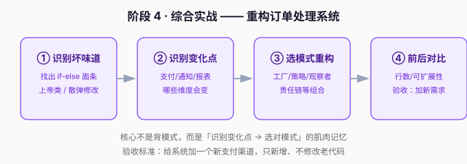

# 阶段 4 · 综合实战

> 章节定位：**「把模式串起来，重构真实模块」** —— 前三阶段各模式都单独练过了，这一阶段把它们串进一个真实重构里。这是整个课程的收束：不是背模式名，而是形成「识别变化点 → 选对模式」的肌肉记忆。

## 阶段目标

学完本阶段，你能：

1. 独立走完一次「识别坏味道 → 识别变化点 → 选模式 → 重构」的完整流程。
2. 用多种模式组合重构一个订单处理系统。
3. 用「加新需求只新增、不改老代码」这个标准验收重构成果。

## 学习重点

| 课 | 核心 | 一句话 |
|----|------|--------|
| 课12 | 综合重构 | 工厂+策略+观察者+责任链+状态，串成一个可运行模块 |

## 必须掌握的知识点

- [ ] 识别坏味道、识别变化点、选模式、逐步重构、前后对比总结

## 本阶段路径图

