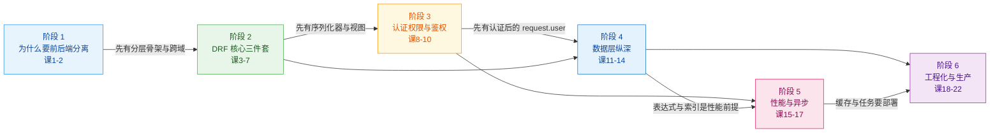

# Django 进阶（前后端分离）· 学习路径总览

> 🗓️ 建档：2026-09-01　｜　课程制：**6 阶段 / 22 课 / 66 知识点**
> 📈 **当前进度：22/22 课，66/66 知识点** ✅ **全部完成**；**Phase 3 结课实战项目已于 2026-09-04 完成**（`projects/orderflow/`，验收 18/18、测试 27 项零失败）。**Phase 5 收尾三件套 3/3 全部完成**（`08-实战经验.md`、`09-排障速查手册.md`、`10-场景解法库.md`，均于 2026-09-04 交付）。**Phase 4 汇总手册 `final-课程手册.md` 已于 2026-09-04 完成** —— 🎉 **全课程资产交付完毕**。
>
> 🆕 **新读者从这里开始**：[final-课程手册.md](./final-课程手册.md)（总纲与入口，按四种使用姿态索引全部资产）。本文件仍是**阶段依赖与 66 知识点全景**的权威出处。
>
> 🎓 **结课项目**：[OrderFlow](./projects/orderflow/README.md) —— 一条从提交到上线的完整链路（下单）。四道 CI 门禁 + 五阶段部署 + 四个回滚点，全部实测跑通。[22课能力索引](./projects/orderflow/22课能力索引.md) 可查每课知识点落在哪个文件。
>
> 📊 **统计口径（2026-09-04 实测核对）**：课数 = `stages/*/lessons/lesson-*.md` 中**有正文**的文件数，实测 **22 课**（阶段 1/2/3/4/5/6 = 2/5/3/4/3/5）；知识点数 = 下表各阶段表内行数，实测 **66 个**。
> ⚠️ 本行原写"18 课 / 48 个知识点"，与顶部进度及实测不符，已按实测更正。另注意：`stages/4` 下有 **2 个 lesson-14 文件**，其中 `lesson-14-迁移工程不依赖model的迁移.md`（517 字节）是**无正文的占位残留**，不计入课数。
> 🔄 扩容：2026-09-02　｜　按用户确认的范围边界重排
> 🎯 适合：已经能用 Django 做出完整功能、想把它改造成**规范的前后端分离项目**的人

---

## 范围说明（先读这个）

本主题是 **Django 进阶**，「前后端分离」是**范围裁剪条件，不是学习目标**。

它用来剔除那些**只在服务端渲染时才有意义**的内容：模板系统与 DTL、Forms 的渲染职责、`render()`/TemplateResponse、Messages 框架、模板语境下的 ``。

Admin、Forms 校验思想、staticfiles、CSRF、Session vs Token 五项**保留但限定边界**，详见 [00-学习档案.md](./00-学习档案.md) 的范围定义。

---

## 学习目标

学完这门课，你应该能回答这六个问题：

1. **边界在哪** —— 分离之后，Django 的哪些能力退场了，替代方案是什么
2. **API 怎么设计** —— 契约先行，让前端不用猜、后端不怕改，且能平滑演进
3. **DRF 怎么用到位** —— 序列化器 / 视图 / 路由各司其职，业务逻辑不再堆在 view 里
4. **谁来守门** —— 认证、权限、限流三层如何配合，分离架构下 CSRF 与 token 存放怎么取舍
5. **数据层怎么纵深** —— 表达式、索引、多库路由、迁移变更怎么做到不掉数据
6. **怎么上生产** —— 性能、链路追溯、测试提速、自动化检查、部署运维

### 学完你能做出什么

一个**可直接投产参考的前后端分离后端项目**：分层清晰、有 JWT 鉴权与对象级权限、API 有版本控制、N+1 被根治、索引与连接池配置正确、多库与迁移变更有章法、慢活走任务框架、带自动化测试和 OpenAPI 文档、有 trace_id 链路与上线清单。

---

## 故事主线

> 📖 **主角**：一个「什么都能干」的 Django 视图函数
> ⚔️ **冲突**：它又要查库、又要校验、又要渲染、又要鉴权——改一个字段要动五个地方
> 🔄 **转折**：学会把职责交出去（交给序列化器、权限类、服务层、任务框架、数据库本身）
> 🎬 **收束**：视图瘦成「一份契约」，后端成为可被任何前端消费的稳定 API

| 阶段 | 故事章节 | 主角的变化 |
|------|----------|-----------|
| 阶段 1 | **决定分家** —— 渲染权交出去 | 视图不再返回 HTML，开始返回 JSON；模板与 Forms 退场 |
| 阶段 2 | **立规矩** —— 契约与分工 | 校验交给序列化器，路由交给 router，业务逻辑搬出 view，API 可演进 |
| 阶段 3 | **守门** —— 你是谁、能干什么 | 认证/权限/限流接管安全，视图彻底变瘦 |
| 阶段 4 | **纵深** —— 真正的复杂度在数据层 | 计算推给数据库，多库有章法，线上变更不掉数据 |
| 阶段 5 | **扛住真实世界** —— 性能与异步 | 快起来、稳起来，但别加错东西 |
| 阶段 6 | **收尾** —— 能验证、能追溯、能上线 | 链路可追溯，约定自动化，上线有清单 |

---

## 全阶段总览

| 阶段 | 主题 | 课 | 核心问题 | 学完标志 |
|------|------|-----|----------|----------|
| **1** | 为什么要前后端分离 | 课 1–2 | 渲染权该归谁？分离后什么退场？跨域怎么办？ | 能说清三种渲染模式的取舍与退场清单，并搭出分层骨架跑通第一个跨域请求 |
| **2** | DRF 核心三件套 | 课 3–7 | 请求进来后，谁校验、谁处理、谁路由？改版怎么办？ | 能用 Serializer + ViewSet + router 写出规范 CRUD，业务逻辑不在 view 里，API 有版本控制 |
| **3** | 认证、权限与鉴权 | 课 8–10 | 你是谁？你能干什么？ | 能配好 JWT + 对象级权限 + 限流，说清 CSRF 与 token 存放的取舍 |
| **4** | 数据层纵深 | 课 11–14 | 怎么让数据库多干活？多库怎么办？变更不掉数据？ | 能用表达式替代循环，索引与连接池配置正确，多库路由与迁移变更有章法 |
| **5** | 性能与异步 | 课 15–17 | 慢在哪？缓存放哪层？异步有用吗？信号该不该用？ | 能根治 N+1、加缓存、判断内置 Tasks vs Celery、知道信号的真实代价 |
| **6** | 工程化与生产 | 课 18–22 | 怎么追溯、测得快、上线稳？ | 有 trace_id 链路，测试套件跑得动，约定进 CI，有可执行的上线清单 |

### 阶段依赖

> **依赖说明**：阶段 3 的对象级权限依赖 `request.user`，而它来自阶段 2 的认证配置；阶段 4 的索引与表达式是阶段 5 性能优化的前提；阶段 6 的部署直接消费阶段 4 的连接池与阶段 5 的缓存配置。**顺序不可颠倒**。

---

## 知识点全景（66 个）

<b>阶段 1 · 为什么要前后端分离（6 个）</b>

| 课 | 知识点 | 关键点 |
|----|--------|--------|
| 课 1 从模板渲染到 API 契约 | 渲染权从后端移交前端（含退场清单） | 演变 / 耦合点 / 退场能力 / 解耦后职责 |
| 课 1 | 三种渲染模式的取舍 | 服务端渲染 / 分离 / 混合 / 决策依据 |
| 课 1 | 契约先行的 API 设计 | 资源建模 / HTTP 动词语义 / URL 规范 |
| 课 2 工程骨架与跨域 | 项目分层：settings 拆分与 app 划分 | 拆分动机 / 目录结构 / 划分粒度 |
| 课 2 | CORS 与 django-cors-headers 落地 | 同源策略 / 预检请求 / 中间件顺序 |
| 课 2 | 自定义用户模型 | 为什么必须前置 / 迁移代价 / 正确姿势 |

<b>阶段 2 · DRF 核心三件套（15 个）</b>

| 课 | 知识点 | 关键点 |
|----|--------|--------|
| 课 3 序列化器 | Serializer 与 ModelSerializer 的分工 | 本质区别 / 何时用哪个 / 自动生成边界 |
| 课 3 | 校验的三层防线 | 字段级 / 对象级 / 跨字段 / 与 Form 对照 |
| 课 3 | 嵌套、来源与只读字段 | 嵌套 / source / read_only 与 write_only |
| 课 4 序列化器进阶 | 可写嵌套 serializer | create/update 手写 / 原子性 / 何时该拆接口 |
| 课 4 | SerializerMethodField 的性能陷阱 | 隐式 N+1 / 与 annotate 对比 / 替代方案 |
| 课 4 | 动态裁剪字段 | `__init__` 改 fields / 按 action 分派 |
| 课 5 视图层 | 请求响应对象与内容协商 | Request/Response 差异 / 渲染器解析器 |
| 课 5 | APIView/GenericAPIView/ViewSet 取舍 | 抽象层级 / 决策树 / 何时不用 ViewSet |
| 课 5 | 路由与 router | 生成规则 / 额外 action / 自定义路由 |
| 课 6 API 版本控制 | 三种版本策略的取舍 | URL / Query / Accept 头 / 各自代价 |
| 课 6 | 版本分派 | 分派 serializer / 复用与隔离 / 命名空间 |
| 课 6 | 弃用策略与前端协作 | 公告机制 / 双版本窗口 / 下线清单 |
| 课 7 业务逻辑该放哪 | 业务逻辑放置的四种方案 | view/serializer/model/service 对比 |
| 课 7 | 状态码、统一响应与错误码 | 状态码语义 / 统一封装 / 错误码与 handler |
| 课 7 | 分页、过滤与排序 | 分页器选型 / 过滤后端 / 排序配置 |

<b>阶段 3 · 认证、权限与鉴权（9 个）</b>

| 课 | 知识点 | 关键点 |
|----|--------|--------|
| 课 8 认证：你是谁 | Session 与 Token 的适用边界 | 机制差异 / 取舍 / 混用的坑 / 同域 cookie 场景 |
| 课 8 | JWT 原理与 simplejwt 落地 | JWT 结构 / 无状态含义 / 登录接口 |
| 课 8 | 刷新、轮换与黑名单 | access/refresh 分工 / 轮换 / 登出困境 |
| 课 9 权限：你能干什么 | 权限四层与执行顺序 | 认证→权限→限流→校验 / 职责边界 |
| 课 9 | 自定义对象级权限 | 行级实现 / has_object_permission / queryset 配合 |
| 课 9 | 限流 Throttling | 限流维度 / 配置 / 与缓存后端的关系 |
| 课 10 安全实践 | CSRF 的重新理解（压缩为一节） | CSRF 本质 / Token 免疫 / cookie+session 仍需 |
| 课 10 | Cookie 存放 token 的取舍 | localStorage vs Cookie / 折中方案 |
| 课 10 | 越权与批量分配的防线 | 越权类型 / 批量分配 / 字段白名单 |

<b>阶段 4 · 数据层纵深（12 个）</b>

| 课 | 知识点 | 关键点 |
|----|--------|--------|
| 课 11 查询表达式进阶 | F() 表达式与原子更新 | 竞态成因 / 数据库侧自增 / 与 select_for_update 取舍 |
| 课 11 | Q() 对象与复杂条件组合 | AND/OR/NOT / 动态构建 / 与过滤后端配合 |
| 课 11 | 子查询、条件表达式与聚合 | Subquery/OuterRef / Case-When / 6.1 新增函数 |
| 课 12 索引、约束与连接池 | 索引的三种用法与代价 ✅ | Meta.indexes / 部分索引 / 函数索引 / explain 验证 |
| 课 12 | 约束下沉到数据库 ✅ | CheckConstraint / UniqueConstraint(condition=) / 异常翻译 |
| 课 12 | 连接池（5.1+） ✅ | OPTIONS.pool / psycopg3 / CONN_MAX_AGE=0 / 按进程计算 / **`pool={}` 静默失效** |
| 课 13 多数据库与 DB 路由 | DATABASE_ROUTERS 四个钩子 ✅ | db_for_read/write / allow_relation / allow_migrate / using() |
| 课 13 | 主从复制与写后读不一致 ✅ | 复制延迟 / 手动路由 / 延迟感知方案 / **只写 db_for_read 会写进只读库** |
| 课 13 | 多库的硬约束与迁移 ✅ | 跨库外键被禁 / **跨库 FK 静默指向另一份数据** / migrate --database / atomic 不跨库 |
| 课 14 迁移工程 | 数据迁移与历史模型 ✅ | RunPython / apps.get_model / **直接 import 只在碰到后来被改的字段时才炸** / 历史模型无自定义方法 |
| 课 14 | SQL 迁移与状态解耦 ✅ | RunSQL / SeparateDatabaseAndState / 自定义 Operation / **hints 只是透传给路由器的参数** |
| 课 14 | 零停机变更与迁移治理 ✅ | 加唯一字段三步走 / atomic=False 留半成品 / **squash 生成的文件是 SyntaxError** |

<b>阶段 5 · 性能与异步（9 个）</b>

| 课 | 知识点 | 关键点 |
|----|--------|--------|
| 课 15 ORM 进阶与 N+1 治理 | select_related 与 prefetch_related ✅ | 两者区别 / 适用场景 / 误用反模式 / **select_related 不去重实例** |
| 课 15 | N+1 的发现与根治 ✅ | 发现手段 / 根治策略 / 6.1 fetch modes / **FETCH_PEERS 在 `.iterator()` 下失效** |
| 课 15 | 事务、并发与行锁 ✅ | 事务边界 / select_for_update / 与 F() 对比 / **atomic 管不了"读到的值已过期"** |
| 课 16 [性能：缓存与异步](./stages/5-性能与异步/lessons/lesson-16-性能缓存与异步.md) | 缓存分层与 DRF 集成 ✅ | 缓存层级 / 粒度 / 失效策略 / **缓存键 = URL + Vary，仅 Authorization 有兜底** |
| 课 16 | 异步视图与 ASGI 边界 ✅ | 能力边界 / 何时有用 / ORM 仍同步 / **一处同步阻塞卡死整个事件循环** |
| 课 16 | 任务该交给谁：内置 Tasks 与 Celery ✅ | django.tasks 契约层 / 内置无 Beat·无重试·无工作流 / **enqueue 默认同步执行** |
| 课 17 [信号：隐式耦合的代价](./stages/5-性能与异步/lessons/lesson-17-信号隐式耦合的代价.md) | 信号的机制与典型误用 ✅ | 信号类型 / receiver 注册 / **ready() 不注册信号全程静默** / 隐式调用链 |
| 课 17 | 信号的真实代价 ✅ | 不跨事务 / on_commit / 循环触发 / bulk_create 不兼容 / **外部副作用退不回来** |
| 课 17 | 改用显式调用的决策 ✅ | 保留审计与第三方扩展 / 其余改 service 层 / 三步迁移路径 |

<b>阶段 6 · 工程化与生产（15 个）</b>

| 课 | 知识点 | 关键点 |
|----|--------|--------|
| 课 18 [中间件与请求链路](./stages/6-工程化与生产/lessons/lesson-18-中间件与请求链路.md) | 中间件执行顺序与自定义 ✅ | 双向链条 / process_view / **追踪中间件在认证前 → 日志全是 anonymous** |
| 课 18 | trace_id 与链路串联 ✅ | 入口生成 / 贯穿日志与响应 / contextvars vs threading.local |
| 课 18 | 结构化日志与慢查询记录 ✅ | JSON 日志 / **execute_wrapper 抓慢 SQL** / 脱敏与截断 |
| 课 19 [文件、存储与 Admin](./stages/6-工程化与生产/lessons/lesson-19-文件存储与Admin.md) | 文件上传与 STORAGES ✅ | FileField/ImageField / 4.2+ STORAGES / 对象存储 / **DEBUG 一变 /media/ 就 404** |
| 课 19 | Admin 定制与安全收敛 ✅ | 运营后台定位 / list_select_related 治 N+1 / 权限与登录限流 |
| 课 19 | staticfiles 的真实归属 ✅ | 业务资源归前端 / collectstatic 只服务 Admin（实测 157 个文件 83% 是 Admin 的） |
| 课 20 [测试提速与文档](./stages/6-工程化与生产/lessons/lesson-20-测试提速与文档.md) | API 测试策略与 DRF 测试工具 ✅ | 测试金字塔 / **force_authenticate 替换整个 authenticators** / factory_boy / **patch 使用处** |
| 课 20 | 测试提速 ✅ | **先量后改（建库 78% / 造数 18% / 执行 4%）** / **keepdb 照样跑 migrate** / 禁迁移只禁业务 app 无效 / **parallel 盈亏平衡点 ≈ 1.1s** |
| 课 20 | OpenAPI 自动生成 ✅ | drf-spectacular / **组件名随类名变** / **版本化需独立 settings** / CI 比对 |
| 课 21 [自定义管理命令与 System checks](./stages/6-工程化与生产/lessons/lesson-21-自定义管理命令与System checks.md) | 自定义管理命令 ✅ | **命令名=文件名** / **退出码 0/1/2** / **启动 632.8ms（checks 占 272.9ms）** / `.iterator()` 内存 1/11.6 |
| 课 21 | System checks 框架 ✅ | **Error=40 Warning=30 Info=20** / 级别看"会不会让测试失败" / **不注册就全程静默** |
| 课 21 | 命令与检查的测试与 CI ✅ | **patch 打错位置测试仍绿但真调外部服务** / 自建库命令要独立进程 / `--deploy` 六条 W* |
| 课 22 [部署与运维](./stages/6-工程化与生产/lessons/lesson-22-部署与运维.md) | 配置管理与密钥 ✅ | **`bool(os.getenv("DEBUG"))` 恒为 True** / **缺 SECRET_KEY 时 check 退出码 0** / `SECRET_KEY_FALLBACKS` 无痛轮换 / **白名单外返回 400 不是 403** |
| 课 22 | 静态资源与前后端联调部署 ✅ | **staticfiles 不是 URLconf 路由，是 `StaticFilesHandler` 包装层** / **`static()` 生产静默返回 `[]`** / 三类文件三个去处 / 关掉任一项换新 W* 编号 |
| 课 22 | 生产部署与上线清单 ✅ | **冷启动 896.1ms vs 常驻中位 22.93ms（100 请求 27.9x）** / 盈亏平衡两维度（5% 分界线）/ **`--skip-checks` 只省 10%** / **`--fail-level` 是全局的** / 四个命令进三段流水线含回滚点 |

---

## 版本基线

| 组件 | 版本 | 说明 |
|------|------|------|
| Django | **6.1**（2026-08-05 发布） | 支持 Python 3.12–3.14 |
| djangorestframework | **3.18.0**（2026-08-07 发布） | ⚠️ Django 6.1 **必须**配 ≥ 3.18.0 |
| django-cors-headers | **4.9.0** | 官方声明支持至 Django 6.0，6.1 待课 2 实跑确认 |
| Python | **3.13.14（Windows / win32）** | 满足 Django 6.1 要求（支持 3.12–3.14） |

> ⚠️ **基线已于 2026-09-04 实测更正**：原写 `3.12.3（WSL Ubuntu 24.04）`，实际运行环境是 **Windows + Python 3.13.14**。
> 本课所有量化数字（尤其阶段 4–6 的性能数据）都来自 **Windows + SQLite**，换环境必须重新测量——课 20 的"先量后改"说的就是这件事。

> ⚠️ **已知陷阱**：DRF ≤ 3.17 在 Django 6.1 上 `import` 直接失败（`cc_delim_re` 从 `django.utils.cache` 移出）。详见 [00-学习档案.md](./00-学习档案.md)。

---

## 与既有课程的关系

| 课程 | 关系 | 边界 |
|------|------|------|
| `celery-django/`（已完结） | 下游依赖 | 本课只讲「如何把任务交给 Celery」，Celery 自身可靠性/编排/运维**不重复讲** |
| `redis/`（课时完结） | 下游依赖 | 本课只讲「Django 侧如何接缓存/限流」，Redis 自身**不重复讲** |

---

## 怎么学

1. **按顺序推进** —— 阶段间有硬依赖，跳着学会卡住
2. **每课都要动手** —— 阶段 4–6 的每知识点都配可运行代码
3. **学完做结课项目** —— Phase 3 会跨阶段整合，把散装知识点焊成整体
4. **上线前看排障手册** —— Phase 5 的 `09-排障速查手册.md` 是「崩了翻」用的

🚀 现在从 [阶段 1 概览](./stages/1-为什么要前后端分离/overview.md) 开始。
