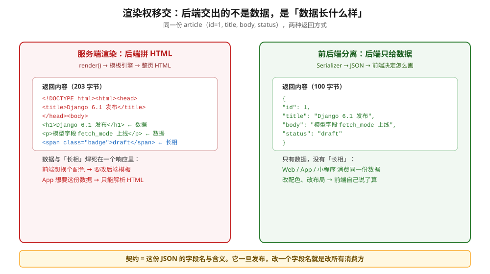
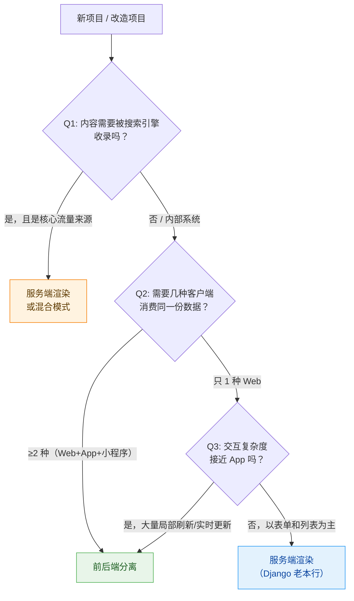
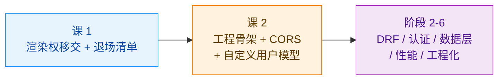
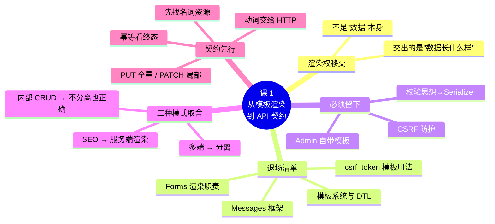

# 课 1　从模板渲染到 API 契约

> 📖 情节定位：**决定分家（上）** —— 主角视图函数交出渲染权的第一步
> 🎯 本课目标：说清渲染权该归谁，知道分离后哪些 Django 能力退场，并能按契约先行的思路设计 API

---

## 第一幕 · 起源与场景引入

### 一个报社的"赶稿"故事

2003 年秋天，美国堪萨斯州劳伦斯市一家叫 *Lawrence Journal-World* 的报社里，两个 web 开发者做了一个决定：放弃 PHP，改用 Python。

他们叫 Adrian Holovaty 和 Simon Willison。报社的节奏是"新闻deadline 驱动"——编辑一个电话打过来，几个小时内一个交互式站点就要从想法变成线上产品。他们受不了每次都从零搭一遍，于是把重复用到的东西抽出来，做成一个通用框架。边用边改，改了两年，到 2005 年 7 月开源，取名 **Django**——致敬他们喜欢的爵士吉他手 Django Reinhardt。

（核查于 2026-09，来源：[Django 官方 FAQ](https://docs.djangoproject.com/en/6.1/faq/general/)、[Django Book 第 1 章](http://django-book-new.readthedocs.org/en/latest/chapter01.html)）

**这个出身决定了 Django 的性格**：它天生就是为"从数据库里取东西、渲染成页面给人看"这件事设计的。模型、模板、Admin 后台三件套，服务的正是"内容站点"——新闻、博客、电商列表页。

> 💡 记住出身，你才能理解本课要讲的事：Django 的很多"看家本领"，是**绑定在服务端渲染这个前提上的**。一旦你把渲染权交出去，它们就一起退场了。

### 你的场景

你接手了一个跑了几年的 Django 项目，典型的 MVC 写法，视图长这样：

```python
def article_detail(request, pk):
    article = get_object_or_404(Article, pk=pk)
    return render(request, "article/detail.html", {"article": article})
```

现在公司要上小程序，还要给合作方开放数据接口。前端同事说："我们上 React，页面我们自己画，你只给我数据就行。"

你很自然地想：那我把 `render()` 换成 `JsonResponse` 不就完了？

```python
def article_detail(request, pk):
    article = get_object_or_404(Article, pk=pk)
    return JsonResponse({"id": article.id, "title": article.title})  # 这样？
```

**能跑，但这不是前后端分离，这只是把 HTML 换成了 JSON。** 真正的分离是**渲染权的所有制变更**——一旦交出去，Django 里一整套为服务端渲染而生的能力，都会同步退场。不知道这个清单，你会继续写分离架构下的服务端渲染代码，一边享受不到分离的收益，一边还多背一份成本。

---

## 第二幕 · 认知冲突

### 困惑一：JSON 都返回了，凭什么说我没分离？

看一眼你那个 `JsonResponse` 版本的返回值：字段名是 `id`、`title`，值是 `article.id`、`article.title`。

问题来了——**字段名叫什么、有没有、是什么类型，现在由谁决定？**

后端。而且是**随手写死在视图函数里**的。前端同事拿去用，第二天你顺手把 `title` 改成 `headline`，小程序当场白屏，合作方的接口静默返回 `null`。没有人报错，没有人收到通知。

你可能会想："服务端渲染时代这不是问题——模板里 `{{ article.title }}` 写错了会报错。"

**这个印象是错的，而且错得很关键。** Django 模板对不存在的变量**默认静默渲染为空字符串**：

```python
>>> from django.template import Template, Context
>>> Template("{{ book.title }}").render(Context({"book": {}}))
''          # 空字符串，不报错
```

行为由 `string_if_invalid` 选项控制，默认为 `''`。证据正是本课后面会引用的 ticket #35738——它要废弃双点变量语法，理由原文就是这种写法"gets a **silent failure**, as for a missing variable, rather than a syntax error"。

> 📚 来源：[The Django template language](https://docs.djangoproject.com/en/6.1/ref/templates/language/)（"If you use a variable that doesn't exist, the template system will insert the value of the `string_if_invalid` option, which is set to `''` by default"）、[Ticket #35738](https://code.djangoproject.com/ticket/35738)

**所以真相是**：服务端渲染也没有给你这道"编译期检查"。唯一的区别是——

| | 服务端渲染 | 前后端分离 |
|---|---|---|
| 字段改名的后果 | 页面某个位置**空白**，刷新一下就能看见 | 前端白屏 / 静默 `null`，**你看不见** |
| 谁先发现 | 你自己，本地一刷新 | **用户** |
| 修复成本 | 改一个模板文件 | 跨团队协调 + 各端分别发版 |

**分离真正的代价不是"失去了保护"，而是"失败的现场从你的屏幕搬到了用户的屏幕"。** 既然模板也没法兜住这件事，就必须用**契约**来兜——一份显式约定、双方签字、改动要走流程的东西。

### 困惑二：模板系统还在不在？Forms 还能用吗？

这是最容易混淆的地方，我必须先给你一颗定心丸：

> ⚠️ **模板系统、Forms、Messages 框架在 Django 6.1 里都活得好好的，一个都没被官方废弃。**
> 6.1 废弃了模板的双点变量语法（`{{ book..title }}`）、改了 Admin 的表单布局；**6.1.1 的发布说明标注于 2026-09-02，其中一条修复正是双点变量废弃引发的回归 bug**（#37257）。一个被废弃的能力不会被这样维护。

所以本课讲的"退场"，**不是版本淘汰，是架构选择**。这两件事完全不同：

| | 版本淘汰 | 架构退场（本课） |
|---|---|---|
| 谁决定的 | Django 官方 | **你和你的项目** |
| 表现 | 升级后代码报错、API 消失 | 代码照样能跑，但**维护成本大于收益** |
| 例子 | `EMAIL_*` 设置（6.1 废弃，7.0 移除） | 模板系统（官方继续维护，但你的分离项目不该用） |

**混淆这两者的后果**：你以为升级到 6.1 模板就不能用了，或者反过来——以为"官方没废弃"就等于"我该继续用"，在分离项目里继续堆模板，最后前后端两套页面逻辑互相打架。

---

## 第三幕 · 层层揭示

### 知识点 1：渲染权从后端移交前端 —— 以及谁退场了

#### 一句话定义

**渲染权** = 决定"数据长什么样"的权力。服务端渲染时归后端，前后端分离时归前端。

#### 直觉建立：餐厅的比喻

把一次请求想成去餐厅吃饭：

- **服务端渲染** = 后厨炒好菜，**装盘、摆盘、配好餐具**再端上来。客人拿到手就能吃，但想换个盘子的颜色，得让后厨重做。
- **前后端分离** = 后厨只管把菜做好端出来，**怎么摆盘由前厅决定**。同一份菜，前厅可以装在中式瓷盘里，也可以装在日式木盒里，甚至可以打包带走。

后厨交出去的是"摆盘权"，不是"做菜权"。菜（数据）还是后厨做的，而且**菜的质量标准是后厨定的**——这就是契约。

> ⚠️ **类比失效的边界**：餐厅里前厅可以随便摆盘，摆得难看不影响菜能不能吃。但真实的 API 里，前端对数据格式的依赖是**刚性的**——字段名错了就是白屏，不是"难看一点"。所以契约一旦定下，改动的代价远高于换个盘子。

#### 核心原理：耦合点到底在哪

看这张图，同一份数据，两种返回方式：



左侧是 `render()` 的产物：**数据和"长相"焊死在一个响应里**。`<h1>`、`<span class="badge">` 这些 HTML 标签，就是后端在替前端决定"标题要大号字、状态要显示成徽章"。

右侧是 API 的产物：**只有数据，没有长相**。

耦合点就一句话：**谁写 HTML 标签，谁就拥有渲染权，谁就得为"页面长什么样"负责。**

#### 退场清单（本课重点）

一旦渲染权归前端，下面这些为服务端渲染而生的能力就该退场了：

| 退场能力 | 它原本干什么 | 为什么退场 | 替代方案 |
|----------|-------------|-----------|----------|
| **模板系统与 DTL** | 把数据拼成 HTML | 渲染权归前端，模板没有消费方 | 前端框架（React / Vue 等） |
| **`render()` / `TemplateResponse`** | 渲染模板并返回响应 | 同上，没有模板可渲染 | DRF 的 `Response` |
| **Forms / ModelForms 的渲染职责** | 生成表单 HTML、回显校验错误 | 表单由前端渲染 | **Serializer**（校验思想保留，课 3 细讲） |
| **Messages 框架** | 往 session 存一次性提示，模板里显示 | 依赖 session + **必须有模板才能显示** | API 响应体里带消息字段 |
| **`` 模板用法** | 往表单插 CSRF 令牌 | 表单不在后端渲染了 | 课 10 讲清适用边界 |

**逐条说清，尤其是容易误伤的两条：**

**① Forms 退场的是"渲染职责"，不是"校验思想"。**

这是最容易一刀切错的地方。`ModelForm` 有两副面孔：

```python
class ArticleForm(forms.ModelForm):
    class Meta:
        model = Article
        fields = ["title", "body"]
    # 面孔 A：渲染 —— as_p() / as_table() 输出 HTML，退场
    # 面孔 B：校验 —— is_valid() / cleaned_data，这套思想完整保留
```

分离架构下，**校验必须留在后端**（前端校验是用户体验，后端校验是安全边界，永远不能只信前端）。`ModelForm` 的校验思想会在 DRF 的 Serializer 里重生——同样分字段级、对象级、跨字段三层，同样有 `is_valid()` 和 `validated_data`。

> 💡 所以课 3 会拿 Forms 做对照，让你读老项目时不懵，也让你理解 Serializer 那套设计从哪来。但**不要再在分离项目里用 Forms 渲染表单**。

**② Messages 框架退场得最彻底，因为它有一半腿在模板上。**

```python
messages.success(request, "保存成功")   # 存进 session
# 然后必须在模板里： ...  才能显示
```

它依赖两样东西：**session**（存）和**模板**（显示）。分离之后模板没了，消息存进去没人读，白占 session 空间。

替代方案很直接——**把消息放进响应体**：

```json
{ "message": "保存成功", "data": { "id": 1, "title": "..." } }
```

**③ CSRF 是最需要小心的一条，它有一半会回来。**

`` 这个模板标签确实退场了（没表单可插）。但 CSRF 防护本身**没有退场**——它只是换了个位置：

- 用 **JWT 放 Authorization 头**（不自动携带）→ 天然免疫 CSRF；
- 用 **cookie 存 session 或 token**（浏览器自动携带）→ **CSRF 防护依然必需**，得靠响应头把令牌给前端。

课 10 会用一节的篇幅讲清这个边界。现在你只要记住：**"分离了就不用管 CSRF"是错的，正确说法是"用 JWT 就不用管，用 cookie 就必须配"。**

#### 常见误区

- ❌ **"分离了就不能用 session 了"** —— 错。session 无状态与否和渲染权无关，cookie+session 认证在分离架构里完全可用（课 8 讲选型）。退场的是 Messages 这种"依赖模板显示"的用法。
- ❌ **"退场 = 官方废弃了"** —— 错，这是本课第二幕强调的重点。官方还维护着，是**你主动选择不用**。
- ❌ **"Admin 也退场了"** —— 错。Admin 是内部运营后台，不是对外页面，它自带模板体系**照用不误**（课 19 讲定制与安全收敛）。

#### 一句话记住

> **后端交出的不是数据，是"数据长什么样"。模板、Forms 渲染、Messages 随之退场；校验、Admin、CSRF 防护必须留下。**

---

### 知识点 2：谁该拥有渲染权 —— 三种模式的取舍

#### 一句话定义

服务端渲染、前后端分离、混合模式三种方案，选择依据是**你的页面更看重首屏与 SEO，还是交互与多端复用**。

#### 直觉建立：三种餐厅

| 模式 | 餐厅类比 | 谁摆盘 |
|------|---------|--------|
| 服务端渲染 | 传统堂食，后厨摆好盘端上来 | 后端 |
| 前后端分离 | 自助餐，后厨出菜，客人自己装盘 | 前端 |
| 混合模式 | 主菜后厨摆盘，甜品自取 | 分区域决定 |

#### 核心原理：三种模式的真实取舍

| 维度 | 服务端渲染 | 前后端分离 | 混合模式 |
|------|-----------|-----------|----------|
| **首屏速度** | ✅ 快，一次请求拿到完整 HTML | ❌ 慢，先拿空壳 JS 再请求数据 | 关键页快，其余慢 |
| **SEO** | ✅ 爬虫直接读到内容 | ❌ 需 SSR / 预渲染额外补救 | 关键页友好 |
| **交互体验** | ❌ 每次操作可能整页刷新 | ✅ 局部更新，接近原生 App | 取决于分区 |
| **多端复用** | ❌ HTML 只能给浏览器 | ✅ 一份 API 喂 Web / App / 小程序 | 部分复用 |
| **前后端并行开发** | ❌ 强耦合，前端等后端模板 | ✅ 契约定完即可并行 | 部分并行 |
| **团队成本** | ✅ 小团队一人搞定 | ❌ 需要两支队伍 + 契约维护 | ❌ 两套心智负担 |
| **部署复杂度** | ✅ 一个 Django 应用 | ❌ 两套服务 + CORS + 认证方案 | ❌ 最复杂 |

#### 决策依据：怎么选

按这三个问题依次判断，命中即停：



**三个问题的具体含义：**

- **Q1（SEO）**：企业官网、新闻站、博客、电商商品详情页 → 服务端渲染。爬虫读到的是完整 HTML，这件事到现在仍然重要。
- **Q2（多端）**：一旦要喂 App 或小程序，服务端渲染基本出局——你总不能给 iOS 返回一堆 `<div>`。
- **Q3（交互）**：后台管理系统、数据看板、IM → 分离。以表单提交和列表展示为主的 CRUD → 服务端渲染足够。

#### "不该分离"同样是正确答案

这是本课最想让你记住的一条：

> 💡 **"大家都分离所以我也分离"是架构决策里最贵的错误。**

分离不是免费的，你至少要多付这些成本：

1. **CORS 配置与排错**（课 2，分离后第一个必踩的坑）
2. **认证方案重新选型**（session 还是 token？课 8）
3. **CSRF 边界重新理解**（课 10）
4. **契约维护**（字段改名的跨团队协调成本）
5. **两套服务、两套部署、两套监控**

**一个 5 人小团队做内部工单系统**，只有 Web 端，全是表单和列表——用 Django 模板一把梭，两周上线，是正确的工程决策。硬上分离，你会多花一个月在 CORS 和 JWT 上，收益是零。

反过来，**一个要同时服务 Web、iOS、Android、小程序的电商中台**，不做分离就是灾难——四端各写一套页面逻辑，改个字段四头救火。

#### 常见误区

- ❌ **"现在都前后端分离，服务端渲染过时了"** —— 错。内容站、SEO 敏感、首屏极致要求的场景，服务端渲染仍是更优解。**Django 6.1 仍在持续投入模板系统**——6.1 废弃了双点变量语法，6.1.1（2026-09-02 发布）随即修复了这次废弃引发的回归 bug #37257。官方都没放弃，你别替它放弃。真正该问的是"**我的项目还需不需要它**"，而不是"官方还支持不支持它"。
- ❌ **"混合模式是最佳实践"** —— 不一定。它是**最复杂**的模式：两套心智、两套部署、两套排错路径。只有当你确实有一部分页面重 SEO、另一部分重交互时才划算。
- ❌ **"老项目改造必须一步到位全分离"** —— 错。混合模式正是为渐进式改造准备的：新增模块用 API，老模块保持模板，逐个迁移。

#### 一句话记住

> **看 SEO 与多端需求定模式。内部 CRUD 用模板不丢人，硬上分离才是交学费。**

---

### 知识点 3：契约先行的 API 设计

#### 一句话定义

**契约先行** = 先约定接口的形状（资源、字段、动词、状态码），再写实现代码。

#### 直觉建立：先签合同再盖房

盖房子有两种做法：

- **先盖后卖**：房子盖到一半，买家说"我想要朝南的阳台"，你砸墙重来。
- **先签合同**：图纸确认、材料确认、验收标准确认，双方签字，再动工。中途改需求？走变更流程，评估代价。

API 就是那份合同。**一旦有前端在消费，改一个字段名就是一次"砸墙"**——而且你不知道有多少面墙连着它。

#### 核心原理一：资源建模

**REST 的核心动作只有一个：把你的业务名词找出来。**

这是最容易被跳过的一步。多数人直接开始写 URL，写着写着就变成了动词堆砌：`/getArticles`、`/deleteArticleById`、`/updateArticleStatus`。

正确的做法是先问：**这个系统里有哪些"东西"（名词）？** 以博客为例：

| 名词（资源） | 说明 |
|-------------|------|
| `articles` | 文章 |
| `users` | 用户 |
| `comments` | 评论 |
| `tags` | 标签 |

然后问第二个问题：**它们之间是什么关系？**

- 一个用户可以有多篇文章 → `users` → `articles` 一对多
- 一篇文章可以有多个评论 → `articles` → `comments` 一对多
- 文章和标签多对多

**这个"名词 + 关系"的图，就是你的 API 骨架。** URL 只是它的表达形式。

> 💡 **动词去哪了？** 动词由 HTTP 方法表达（下面马上讲），**不写进 URL**。这是 REST 最常见的走偏点。

#### 核心原理二：HTTP 动词语义

资源定好了，怎么操作？用 HTTP 方法。五个常用动词，语义完全不同：

| 动词 | 语义 | 幂等 | 安全 | 成功状态码 |
|------|------|------|------|-----------|
| `GET` | 查询资源 | ✅ | ✅ | 200 |
| `POST` | 创建资源 / 触发动作 | ❌ | ❌ | 201（创建） |
| `PUT` | **全量替换**资源 | ✅ | ❌ | 200 |
| `PATCH` | **局部更新**资源 | ❌* | ❌ | 200 |
| `DELETE` | 删除资源 | ✅ | ❌ | 204（无响应体） |

两个术语必须先说清（后面全靠它们）：

- **安全（Safe）**：不修改服务器上的数据。`GET` 是唯一的安全方法。
- **幂等（Idempotent）**：**做 1 次和做 N 次，服务器终态相同**。不是"返回结果相同"，是"服务器状态相同"。

> 📚 **权威定义**（[MDN - Idempotent](https://developer.mozilla.org/en-US/docs/Glossary/Idempotent)）：
> "An HTTP method is idempotent if the intended effect on the server of making a single request is the same as the effect of making several identical requests."
> MDN 明确指出：**"The response returned by each request may differ: for example, the first call of a DELETE will likely return a 200, while successive ones will likely return a 404."**
> —— 这正是第四幕实测里"第一次 204、第二次 404，但依然幂等"的依据。

> ⚠️ `PATCH` 的幂等性在规范里是有争议的。用 `{"status": "published"}` 这种**赋值**语义是幂等的；但如果 PATCH 的 body 里写 `{"views": "+1"}` 这种**增量**语义，就变成了非幂等。**实践建议：PATCH 只传确定的新值，不传增量。**

**PUT 和 PATCH 的区别是本节最容易踩的坑**，第四幕会用实测把它钉死。

#### 核心原理三：URL 设计规范

约定俗成的几条：

```text
GET    /api/articles/          列表
POST   /api/articles/          新建
GET    /api/articles/1/        详情
PUT    /api/articles/1/        全量替换
PATCH  /api/articles/1/        局部更新
DELETE /api/articles/1/        删除
GET    /api/articles/1/comments/      某文章的评论（嵌套资源）
POST   /api/articles/1/comments/      给某文章建评论
```

四条规范：

1. **资源用复数**：`/articles` 不是 `/article`。
2. **层级表达关系，但不超过两层**：`/articles/1/comments/` 可以，`/articles/1/comments/5/replies/3/likes/` 就该拆成 `/likes/?comment=3`。
3. **不用动词**：❌ `/articles/1/publish/` → ✅ `PATCH /api/articles/1/` body `{"status": "published"}`。
   > 💡 **例外**：当动作确实无法映射成资源的状态变更时（如"发送验证码"），用动词是合理的：`POST /api/sms/send-code/`。别为了纯粹而把业务拧成畸形。
4. **筛选、排序、分页用查询参数**：`GET /api/articles/?status=published&ordering=-created_at&page=2`。

> 📚 官方文档：[Django REST framework - Quickstart](https://www.django-rest-framework.org/tutorial/quickstart/)、[MDN - HTTP 请求方法](https://developer.mozilla.org/zh-CN/docs/Web/HTTP/Methods)

#### 常见误区

- ❌ **"PUT 就是更新，PATCH 也是更新，随便用"** —— 这是会丢数据的理解。见第四幕实测。
- ❌ **"删除成功应该返回 200 和被删的对象"** —— 惯例是 **204 No Content**，不返回响应体。
- ❌ **"URL 里加动词更清晰"** —— 短期清晰，长期失控。十个动词 URL 之后，你会发现同一资源有五种叫法。

#### 一句话记住

> **先画资源图，再定 URL。PUT 是全量替换（缺字段会被清空），PATCH 是局部更新。**

---

## 第四幕 · 实操验证

### 验证环境

| 项 | 值 |
|---|---|
| 环境 | WSL Ubuntu 24.04，**Python 3.12.3**（系统 Python） |
| 依赖 | **仅标准库**（`http.server` + `urllib`），无需安装任何包 |
| 说明 | 本幕聚焦 HTTP 语义本身，用最小实现演示；真实 Django 项目从课 2 开始搭建 |

> ⚠️ 按学习档案的运行环境约定：本机 WSL **未安装 uv**，故使用系统 Python 3.12.3 直接运行；本脚本零第三方依赖，**不创建虚拟环境、不产生依赖目录**，因此无需 `pip install`。

### 实操 1：同一份数据，两种返回方式

保存为 `demo.py` 并运行（完整脚本见下方"附：完整可运行脚本"）：

```bash
python3 demo.py
```

**实测输出（2026-09-02 于 WSL Python 3.12.3 运行）：**

```text
演示服务已启动：http://127.0.0.1:41651

======================================================================
A. 渲染权归属：同一份数据，两种返回方式
======================================================================
[服务端渲染] GET /articles/1     -> 200
             Content-Type: text/html; charset=utf-8
             响应 203 字节（含 HTML 标签与样式）
[API]        GET /api/articles/1 -> 200
             Content-Type: application/json; charset=utf-8
             响应 100 字节（纯数据）
```

**回扣第一幕**：这就是你的 `render()` 换成 `JsonResponse` 之后发生的事。注意两个数字——**203 字节 vs 100 字节**。多出来的 103 字节全是 HTML 标签和样式类，也就是"后端替前端决定的长相"。分离之后这 103 字节归前端管，你不用再操心，但也**不再拥有对页面的控制权**。

### 实操 2：HTTP 动词的真实语义

**实测输出：**

```text
1) GET   /api/articles/1 -> 200  {"id": 1, "title": "Django 6.1 发布", "body": "模型字段 fetch_mode 上线", "status": "draft"}
   数据未变：安全（不修改）且幂等（多次结果一致）

2) PUT   /api/articles/1  body={"title": "只改标题"}
   -> 200  {"id": 1, "title": "只改标题", "body": "", "status": ""}
   !! body 与 status 被清空 —— PUT 是全量替换，缺的字段按空值写入

3) PATCH /api/articles/1  body={"title": "只改标题"}
   -> 200  {"id": 1, "title": "只改标题", "body": "模型字段 fetch_mode 上线", "status": "draft"}
   OK body 与 status 保留 —— PATCH 是局部更新

4) POST  /api/articles  相同内容提交两次
   第一次 -> 201  {"id": 2, "title": "新文章", "body": "正文", "status": "draft"}
   第二次 -> 201  {"id": 3, "title": "新文章", "body": "正文", "status": "draft"}
   !! id 不同 —— POST 非幂等，重复提交会真的多出一条

5) DELETE /api/articles/2 删除两次
   第一次 -> 204（无响应体）
   第二次 -> 404  {"detail": "未找到"}
   OK 终态一致 —— DELETE 语义幂等
```

**逐条回扣第三幕：**

| 观察 | 印证了什么 |
|------|-----------|
| **第 2 条：PUT 把 `body` 和 `status` 清空了** | 这就是"全量替换"的字面意思——你只传了 `title`，其余字段按**默认值**写入。**生产事故来源：前端用 PUT 做局部更新，用户数据静默丢失。** |
| **第 3 条：PATCH 保住了其他字段** | 局部更新只动传过来的字段。**前端"改一个字段"的需求，默认应该用 PATCH。** |
| **第 4 条：POST 两次产生 id=2 和 id=3** | POST 非幂等。用户手抖点两次"提交"，就真的多出一条数据——**这就是需要前端做防抖、后端考虑幂等键的原因**。 |
| **第 5 条：DELETE 第二次返回 404** | 注意这里的关键：**第一次 204，第二次 404，返回码不同，但服务器终态相同（资源都是不存在的）**。这就是幂等的准确定义——**看终态，不看返回码**。 |

> 💡 **本幕最重要的一句话**：幂等看的是**服务器终态**而不是返回码。DELETE 第二次返回 404，它依然是幂等的。

### 附：完整可运行脚本

<details>
<summary>点击展开 demo.py（仅用标准库，可直接运行）</summary>

```python
#!/usr/bin/env python3
# -*- coding: utf-8 -*-
"""课 1 实操验证：只用标准库，验证「渲染权归属」与「HTTP 动词语义」。"""

import json
import threading
import urllib.error
import urllib.request
from http.server import BaseHTTPRequestHandler, ThreadingHTTPServer
from urllib.parse import urlparse

# ---------- 内存里的“数据库” ----------
ARTICLES = {}
NEXT_ID = [2]


def reset():
    """重置数据，保证每次演示结果一致（可重复）"""
    ARTICLES.clear()
    ARTICLES[1] = {
        "id": 1,
        "title": "Django 6.1 发布",
        "body": "模型字段 fetch_mode 上线",
        "status": "draft",
    }
    NEXT_ID[0] = 2


# ---------- 服务端渲染：后端把数据拼进 HTML ----------
def render_html(a):
    return (
        '<!DOCTYPE html><html><head><meta charset="utf-8">'
        + "<title>" + a["title"] + "</title></head><body>"
        + "<h1>" + a["title"] + "</h1>"
        + "<p>" + a["body"] + "</p>"
        + '<span class="badge">' + a["status"] + "</span>"
        + "</body></html>"
    )


class DemoHandler(BaseHTTPRequestHandler):
    def log_message(self, fmt, *args):
        pass  # 静音默认访问日志，避免干扰演示输出

    # --- 响应工具 ---
    def _send(self, code, body, ctype):
        self.send_response(code)
        self.send_header("Content-Type", ctype)
        self.send_header("Content-Length", str(len(body)))
        self.end_headers()
        self.wfile.write(body)

    def _json(self, code, data):
        raw = json.dumps(data, ensure_ascii=False).encode("utf-8")
        self._send(code, raw, "application/json; charset=utf-8")

    def _html(self, code, text):
        self._send(code, text.encode("utf-8"), "text/html; charset=utf-8")

    def _read_json(self):
        n = int(self.headers.get("Content-Length") or 0)
        if not n:
            return {}
        return json.loads(self.rfile.read(n).decode("utf-8") or "{}")

    def _path(self):
        return urlparse(self.path).path.rstrip("/") or "/"

    # --- 路由 ---
    def do_GET(self):
        p = self._path()
        if p == "/articles/1":  # 服务端渲染版
            a = ARTICLES.get(1)
            if not a:
                return self._html(404, "<h1>404 文章不存在</h1>")
            return self._html(200, render_html(a))
        if p == "/api/articles":  # API 集合
            return self._json(200, list(ARTICLES.values()))
        if p.startswith("/api/articles/"):  # API 单资源
            a = ARTICLES.get(int(p.rsplit("/", 1)[1]))
            return self._json(200, a) if a else self._json(404, {"detail": "未找到"})
        return self._json(404, {"detail": "未找到"})

    def do_POST(self):  # 创建，非幂等
        if self._path() != "/api/articles":
            return self._json(404, {"detail": "未找到"})
        d = self._read_json()
        aid = NEXT_ID[0]
        NEXT_ID[0] += 1
        item = {
            "id": aid,
            "title": d.get("title", ""),
            "body": d.get("body", ""),
            "status": d.get("status", "draft"),
        }
        ARTICLES[aid] = item
        return self._json(201, item)

    def do_PUT(self):  # 全量替换：缺失字段会被清空
        p = self._path()
        if not p.startswith("/api/articles/"):
            return self._json(404, {"detail": "未找到"})
        aid = int(p.rsplit("/", 1)[1])
        if aid not in ARTICLES:
            return self._json(404, {"detail": "未找到"})
        d = self._read_json()
        ARTICLES[aid] = {
            "id": aid,
            "title": d.get("title", ""),
            "body": d.get("body", ""),
            "status": d.get("status", ""),
        }
        return self._json(200, ARTICLES[aid])

    def do_PATCH(self):  # 局部更新：只动传过来的字段
        p = self._path()
        if not p.startswith("/api/articles/"):
            return self._json(404, {"detail": "未找到"})
        aid = int(p.rsplit("/", 1)[1])
        if aid not in ARTICLES:
            return self._json(404, {"detail": "未找到"})
        d = self._read_json()
        ARTICLES[aid].update({k: v for k, v in d.items() if k != "id"})
        return self._json(200, ARTICLES[aid])

    def do_DELETE(self):
        p = self._path()
        if not p.startswith("/api/articles/"):
            return self._json(404, {"detail": "未找到"})
        aid = int(p.rsplit("/", 1)[1])
        if aid not in ARTICLES:
            return self._json(404, {"detail": "未找到"})
        del ARTICLES[aid]
        self.send_response(204)
        self.send_header("Content-Length", "0")
        self.end_headers()


# ---------- 演示客户端 ----------
PORT = [0]


def req(method, path, payload=None):
    data = json.dumps(payload, ensure_ascii=False).encode("utf-8") if payload is not None else None
    r = urllib.request.Request("http://127.0.0.1:%d%s" % (PORT[0], path), data=data, method=method)
    if data:
        r.add_header("Content-Type", "application/json")
    try:
        with urllib.request.urlopen(r) as resp:
            return resp.status, resp.headers.get("Content-Type"), resp.read()
    except urllib.error.HTTPError as e:
        return e.code, e.headers.get("Content-Type"), e.read()


def line(title):
    print("\n" + "=" * 70)
    print(title)
    print("=" * 70)


def demo_render():
    line("A. 渲染权归属：同一份数据，两种返回方式")
    st, ct, raw = req("GET", "/articles/1")
    print("[服务端渲染] GET /articles/1     -> %s" % st)
    print("             Content-Type: %s" % ct)
    print("             响应 %d 字节（含 HTML 标签与样式）" % len(raw))
    st, ct, raw = req("GET", "/api/articles/1")
    print("[API]        GET /api/articles/1 -> %s" % st)
    print("             Content-Type: %s" % ct)
    print("             响应 %d 字节（纯数据）" % len(raw))


def demo_verbs():
    line("B. HTTP 动词语义：GET / POST / PUT / PATCH / DELETE")
    reset()
    st, ct, raw = req("GET", "/api/articles/1")
    print("\n1) GET   /api/articles/1 -> %s  %s" % (st, raw.decode()))
    print("   数据未变：安全（不修改）且幂等（多次结果一致）")

    print("\n2) PUT   /api/articles/1  body={\"title\": \"只改标题\"}")
    st, ct, raw = req("PUT", "/api/articles/1", {"title": "只改标题"})
    print("   -> %s  %s" % (st, raw.decode()))
    print("   !! body 与 status 被清空 —— PUT 是全量替换，缺的字段按空值写入")

    reset()
    print("\n3) PATCH /api/articles/1  body={\"title\": \"只改标题\"}")
    st, ct, raw = req("PATCH", "/api/articles/1", {"title": "只改标题"})
    print("   -> %s  %s" % (st, raw.decode()))
    print("   OK body 与 status 保留 —— PATCH 是局部更新")

    reset()
    print("\n4) POST  /api/articles  相同内容提交两次")
    st, ct, raw = req("POST", "/api/articles", {"title": "新文章", "body": "正文"})
    print("   第一次 -> %s  %s" % (st, raw.decode()))
    st, ct, raw = req("POST", "/api/articles", {"title": "新文章", "body": "正文"})
    print("   第二次 -> %s  %s" % (st, raw.decode()))
    print("   !! id 不同 —— POST 非幂等，重复提交会真的多出一条")

    print("\n5) DELETE /api/articles/2 删除两次")
    st, ct, raw = req("DELETE", "/api/articles/2")
    print("   第一次 -> %s（无响应体）" % st)
    st, ct, raw = req("DELETE", "/api/articles/2")
    print("   第二次 -> %s  %s" % (st, raw.decode()))
    print("   OK 终态一致 —— DELETE 语义幂等")


def main():
    srv = ThreadingHTTPServer(("127.0.0.1", 0), DemoHandler)
    PORT[0] = srv.server_address[1]
    threading.Thread(target=srv.serve_forever, daemon=True).start()
    print("演示服务已启动：http://127.0.0.1:%d" % PORT[0])
    try:
        reset()
        demo_render()
        demo_verbs()
    finally:
        srv.shutdown()
    print("\n" + "=" * 70)
    print("演示结束（服务已关闭）")
    print("=" * 70)


if __name__ == "__main__":
    main()
```

</details>

---

## 第五幕 · 体系收束

### 本课在全局中的位置



课 1 回答的是**前提问题**：渲染权归谁？不把这事先定死，后面每一课都可能建在错误的前提上——你会一边写 DRF 一边留着模板，一边做 JWT 一边还在用 Messages 框架。

### 你现在会了什么

| 收获 | 可验证的能力 |
|------|-------------|
| 说清渲染权移交了什么 | 能解释为什么"换成 JsonResponse"不等于分离 |
| 列出退场清单 | 面对老项目，能指出哪些代码该删、哪些必须留（校验、Admin、CSRF 防护） |
| 区分"版本淘汰"与"架构退场" | 不会误以为 6.1 废弃了模板系统 |
| 说清契约为什么必须存在 | 知道模板**也不报错**（静默空字符串），失败的现场只是从你的屏幕搬到了用户屏幕 |
| 判断该不该分离 | 能用三个问题（SEO / 多端 / 交互）给出结论，且接受"不该分离"这个答案 |
| 按契约设计 API | 能先画资源图，用对 PUT 与 PATCH，写出经得起前端消费的 URL |

### 一图总结



### 埋下的伏笔

本课留了三颗种子，后面会长成大树：

1. **Forms 退场了，但校验思想留下了** → 课 3 的 Serializer 会完整继承三层校验体系，届时与 Forms 做对照。
2. **CSRF 只退了一半** → 课 10 讲清：JWT 免疫，cookie+session 仍需防护。
3. **契约是看不见的** → 课 2 开始搭真实工程，课 20 会讲怎么用 OpenAPI 把契约**自动文档化**，让它重新变得可见、可校验。

> ⚠️ **下一课的关键提醒**：课 2 要搭真实工程骨架，其中**自定义用户模型必须开局做对**——首次 `migrate` 之后再改，代价是重建数据库或手写复杂迁移。这是本课"契约一旦发布就难改"的同一个道理，只不过作用在**数据库 schema** 上。

---

## 🐞 本课误区速查

| 误区 | 真相 |
|------|------|
| "换成 JsonResponse 就是前后端分离了" | 分离是**渲染权的所有制变更**。不交出渲染权，退场清单里的东西就还在，成本照付收益为零 |
| "分离了模板系统就废弃了" | 官方**从未废弃**模板系统，Django 6.1 仍在维护它。退场是**你的架构选择**，不是版本淘汰 |
| "Forms 整个不能用了" | 退场的是**渲染职责**（`as_p()`）；**校验思想**完整保留在 Serializer 里（课 3） |
| "分离了就不用管 CSRF" | 用 JWT 放 header 才免疫；**用 cookie 存 session/token 仍需防护**（课 10） |
| "Admin 也一起退场" | Admin 是内部后台，自带模板体系照用不误（课 19） |
| "现在都分离，服务端渲染过时了" | 内容站、SEO 敏感、首屏极致要求的场景，服务端渲染仍是更优解 |
| "PUT 和 PATCH 随便用" | **PUT 全量替换，缺字段会被清空**——这是会丢数据的坑（第四幕已实测） |
| "模板里变量名写错会报错，能兜住字段改名" | **不报错**。Django 模板对不存在的变量默认静默渲染为**空字符串**（`string_if_invalid` 默认 `''`）。模板也兜不住，所以才需要契约 |
| "幂等就是返回结果相同" | 幂等看**服务器终态**。DELETE 第二次返回 404，依然幂等 |

---

## 📚 官方文档

| 主题 | 链接 |
|------|------|
| Django 起源与 FAQ | [Django FAQ: General](https://docs.djangoproject.com/en/6.1/faq/general/) |
| Django 6.1 发布说明 | [Django 6.1 release notes](https://docs.djangoproject.com/en/6.1/releases/6.1/) |
| Django 6.1.1 发布说明（模板回归修复 #37257） | [Django 6.1.1 release notes](https://docs.djangoproject.com/en/6.1/releases/6.1.1/) |
| 双点变量废弃的原始提案 | [Ticket #35738 - Deprecate double-dot variable lookups](https://code.djangoproject.com/ticket/35738) |
| 废弃时间表（区分"官方废弃"与"架构退场"） | [Django Deprecation Timeline](https://docs.djangoproject.com/en/6.0/internals/deprecation/) |
| HTTP 请求方法 | [MDN - HTTP 请求方法](https://developer.mozilla.org/zh-CN/docs/Web/HTTP/Methods) |
| HTTP 状态码 | [MDN - HTTP 响应状态码](https://developer.mozilla.org/zh-CN/docs/Web/HTTP/Status) |
| Django 模板系统（了解为何退场） | [Django Templates](https://docs.djangoproject.com/en/6.1/topics/templates/) |
| DRF 快速开始（后续课程） | [DRF Quickstart](https://www.django-rest-framework.org/tutorial/quickstart/) |

---

## 🚀 下一批接力提示词

> 学完本课后，**复制下面这段文字发给 AI**，即可无缝进入下一课（无需重新描述上下文）：

```text
继续学 Django 进阶（前后端分离）。我的学习档案在 django/00-学习档案.md，
刚学完阶段 1《为什么要前后端分离》的课 1《从模板渲染到 API 契约》
（知识点：渲染权移交与退场清单、三种渲染模式取舍、契约先行的 API 设计），
请按大纲继续讲解课 2《工程骨架与跨域》。
```

---

## 🧭 课程导航

**上一课**：无（本课为阶段 1 第一课）

**下一课**：[课 2《工程骨架与跨域》](./lesson-02-工程骨架与跨域.md)

**返回**：[阶段 1 概览](../overview.md) ｜ [课程目录](../../../02-课程目录.md)
