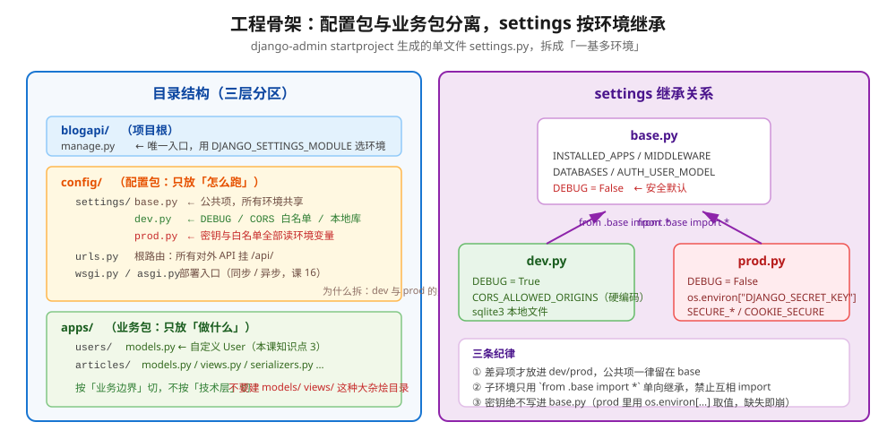
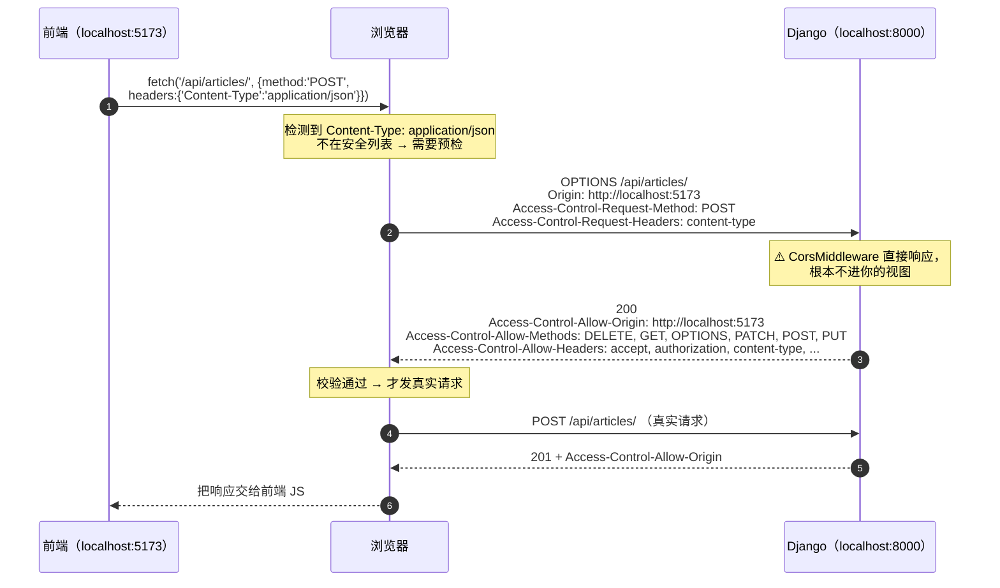
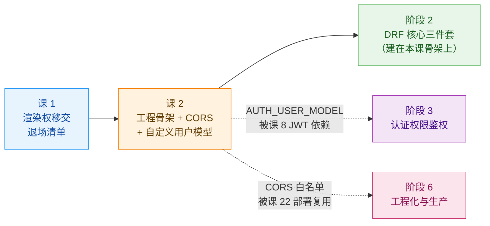
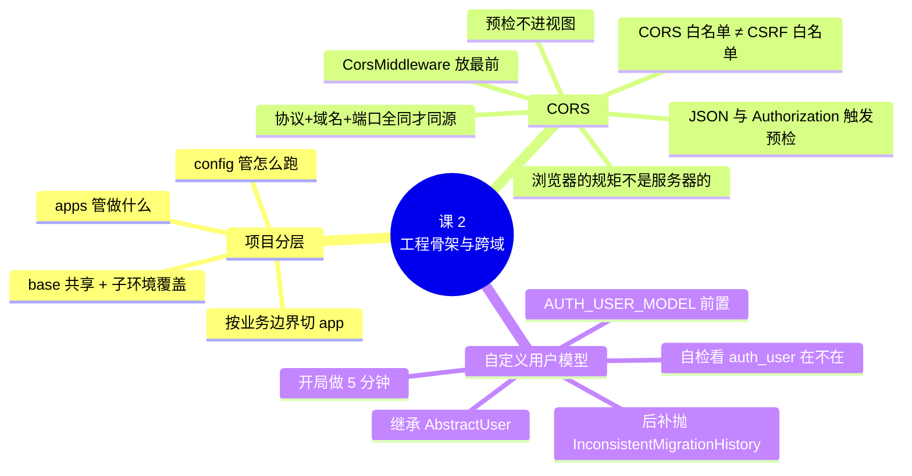

# 课 2　工程骨架与跨域

> 📖 情节定位：**决定分家（下）** —— 分家之后，家怎么收拾
> 🎯 本课目标：搭出可维护的分层骨架，跑通第一个跨域请求，开局做对用户模型

---

## 第一幕 · 起源与场景引入

### 同源策略：一笔 1995 年的旧账

你马上要踩的这个坑，比你学 Django 的年头还老。

1995 年，Netscape 发布 Navigator 2，第一次把 JavaScript 和 HTML 框架塞进浏览器。Brendan Eich（JavaScript 的作者）后来在 AppSec USA 2012 的演讲 *The Same-Origin Saga* 里回顾，当时他们的做法是：**取一个文档的 URL，截出 `协议://域名:端口` 这个前缀，称之为 origin（源），然后给所有代码和数据打上这个标签，判断同源就靠字符串比较。** 另有记载称，Netscape Navigator 2.02 起开始自动阻止一个服务器上的脚本读取另一个服务器的文档属性——也就是说，策略是**在补丁里逐步长出来的**，不是某一天设计好的。

（核查于 2026-09。来源：[The Same-Origin Saga, Brendan Eich](https://www.slideshare.net/BrendanEich/the-sameorigin-saga)；同源策略早期演进的整理见 [liveOverflow: The Same Origin Policy - Hacker History](http://rosetta.to/u/liveoverflow/the-same-origin-policy-hacker-history)。⚠️ 细节存在不同说法，此处只取多方一致的部分）

装上这道门二十年后，人们发现它太严了——合法的跨站调用也全被挡住。于是 2014 年 1 月 16 日，W3C 把 **CORS（Cross-Origin Resource Sharing，跨源资源共享）** 发布为正式推荐标准，编辑是 Anne van Kesteren。它的思路不是拆门，而是**给门上加一份"访客预约名单"**：服务器在响应里声明"我允许谁来"，浏览器照单放行。

（核查于 2026-09，来源：[W3C - Cross-Origin Resource Sharing (Recommendation, 2014-01-16)](https://www.w3.org/TR/2014/REC-cors-20140116/)、[W3C 中文公告](https://www.w3.org/zh-hans/news/2014/cross-origin-resource-sharing-cors-is-a-w3c-recommendation/)。注：该推荐标准已于 2020-06-02 被 [Fetch Living Standard](https://fetch.spec.whatwg.org/) 取代，但浏览器行为一致）

> 💡 记住这两笔账，你就理解本课的核心：**同源策略是浏览器的规矩，CORS 是"申请豁免"的手续。** 它不是 Django 的功能，也不是你后端代码的安全机制——这一点第二幕会要你的命。

### 你的场景

课 1 你把契约定好了：`GET /api/articles/`、`POST /api/articles/`……把文档发给前端。你信心满满地敲下：

```bash
django-admin startproject blogapi
cd blogapi
python manage.py startapp articles
python manage.py runserver
```

服务起来了。你顺手 `curl` 验证一下：

```bash
curl http://127.0.0.1:8000/api/articles/
# {"results": [{"id": 1, "title": "Django 6.1 发布", "status": "published"}]}
```

**通了。** 你把这个消息发到群里："接口好了。"

三分钟后，前端同事回了一张截图——浏览器控制台红了一片：

```
Access to fetch at 'http://127.0.0.1:8000/api/articles/' from origin
'http://localhost:5173' has been blocked by CORS policy:
No 'Access-Control-Allow-Origin' header is present on the requested resource.
```

你懵了：**我 curl 明明通了啊？**

这就是分家之后的第一道坎。而它只是三个坑里的第一个——另外两个是"settings 单文件怎么收拾"和"用户模型到底什么时候改"。本课把这三件事一次讲清。

---

## 第二幕 · 认知冲突

### 困惑一：curl 通、浏览器不通，谁在撒谎？

**谁都没撒谎，因为 CORS 根本不是服务器上的东西。**

关键差别在这里：

| | curl / Postman | 浏览器 |
|---|---|---|
| 请求发出去了吗 | ✅ | ✅ |
| **服务器执行了吗** | ✅ | ✅ **照样执行** |
| 服务器返回了吗 | ✅ | ✅ |
| 调用方看到响应了吗 | ✅ | ❌ **浏览器把响应丢了** |

再读一遍那句报错的措辞：`has been blocked by CORS policy`。**主语是浏览器，动作是"拦截"，发生在服务器返回之后。**

这意味着一件很反直觉的事：**你的 Django 日志里，`GET /api/articles/` 会老老实实记着 `200`**。你翻日志只会更困惑——"明明返回 200 了啊"。对，返回了，是浏览器不给你看。

> ⚠️ 由此推出一个必须记住的结论：**CORS 不是安全机制，它不保护你的服务器。** 攻击者用 curl 一样能打你的接口。真正挡住"别人的网站借用户浏览器干坏事"的，是**浏览器默认不携带凭证 + 同源策略**这一整套，CORS 是在这套规则上开的后门。

所以"配 CORS"这个动作的真实含义是：**向浏览器声明，哪些来源的前端脚本被允许读取我的响应。**

### 困惑二：CORS 配好了，为什么 POST 还是 403？

你照着教程加了 `CORS_ALLOWED_ORIGINS = ["http://localhost:5173"]`。GET 通了，你长舒一口气。

然后前端点"提交"，控制台又红了，这次是：

```
POST http://127.0.0.1:8000/api/articles/ 403 (Forbidden)
```

Django 服务端日志写着：

```
Forbidden (Origin checking failed - http://localhost:5173 does not match any trusted origins.): /api/articles/
```

**为什么？因为 CORS 和 CSRF 是两道独立的门。**

| | CORS | CSRF |
|---|---|---|
| 谁检查 | 浏览器 | **Django 服务端** |
| 检查什么 | 这个来源的脚本**能不能读**响应 | 这次写请求**是不是你自己的页面发的** |
| 拦下时的现象 | 浏览器控制台 `blocked by CORS policy` | HTTP **403** |
| 配置位置 | `CORS_ALLOWED_ORIGINS` | `CSRF_TRUSTED_ORIGINS` |

**两道门都要过。** 只配 CORS，写请求会卡在 CSRF 这一关上——而且这一关的报错是 403，很容易被误判成"跨域没配好"。

🚨 这条坑会在第四幕被**原样复现并修好**，你会看到 403 → 201 的完整过程。

### 困惑三：用户模型，凭什么催我开局就改？

第三个困惑来得最安静，也最贵。

你现在的代码里，`Article.author` 指向 `django.contrib.auth.models.User`，跑得好好的。教程、博客、老同事都在喊："**新项目第一件事就是自定义用户模型！**"

你会想：我现在不需要手机号登录，不需要邮箱做用户名，为什么要为一个**也许永远不会来**的需求，现在就多写一个类？

答案是：**因为这件事的代价曲线是断崖式的，不是线性的。**

- **第 0 天改**：写一个类 + 一行设置 = 5 分钟。
- **第 N 天改**（数据库里已经有 `auth_user` 表和真实用户）：`migrate` 直接抛 `InconsistentMigrationHistory` 拒绝执行，你面对的是"手写数据迁移把老用户搬进新表，同时修好所有外键"——而且这些外键分散在你**根本记不全**的业务表里。

> 💡 这不是恐吓，是可复现的。第四幕我会**真的把这两个场景各跑一遍**，把报错原文贴给你看。

---

## 第三幕 · 层层揭示

### 知识点 1：项目分层 —— settings 拆分与 app 划分

#### 一句话定义

**项目分层** = 把"配置（怎么跑）"与"业务（做什么）"放进不同目录，并把 settings 按环境拆成"一份公共基线 + 每环境一份差异"。

#### 直觉建立：从抽屉到衣柜

`django-admin startproject` 给你的那个 `settings.py`，是一个**大抽屉**——DEBUG 开关、数据库密码、CORS 白名单、INSTALLED_APPS 全塞在一起。项目小的时候很爽，因为所有东西一眼能看到。

问题出在你需要**同一个项目跑在两种环境**时。开发时你要 `DEBUG=True`、sqlite、放开 CORS；上线时你要 `DEBUG=False`、PostgreSQL、密钥从环境变量读、加上一堆 `SECURE_*`。

抽屉里的东西开始打架：你在 `settings.py` 里写 `DEBUG = os.environ.get("DEBUG") == "1"`，然后每次部署都要祈祷环境变量传对了。更糟的是——**`DEBUG=True` 一旦漏到生产，Django 会把完整的 traceback、SQL 查询、环境变量渲染在错误页面上。**

**衣柜的做法**是：所有衣服（配置）按"场合"分格，`base` 格放所有场合都穿的，`dev` 格和 `prod` 格只放该场合特有的。永远不会出现"穿着睡衣去开会"这种事——因为你根本没把睡衣放进上班那格。

> ⚠️ **类比失效的边界**：衣柜的格子是互相隔离的，而 settings 的 `dev.py`/`prod.py` 是**从 `base.py` 继承**的。子环境可以覆盖父环境的任何一项，所以要警惕"在 prod 里覆盖了一个 base 里才应该统一的项"——比如两边各写一份 `AUTH_USER_MODEL`，那就等着出事。

#### 核心原理一：目录结构



三个关键约定：

1. **`config/` 包**：把 `startproject` 生成的 `blogapi/settings.py` 换成 `config/settings/` 包，内含 `base.py` / `dev.py` / `prod.py`。项目配置从此有了位置，不再散落。
2. **`apps/` 包**：所有业务 app 放进来，`INSTALLED_APPS` 里写 `"apps.users"`、`"apps.articles"`。**好处是项目根目录不会被十几个 app 目录淹没**，且 `apps/` 本身就是一条清晰的边界。
3. **`manage.py` 里 `DJANGO_SETTINGS_MODULE` 默认指向 `dev`**，部署时由环境变量覆盖。

#### 核心原理二：settings 拆分的三种做法

| 做法 | 怎么写 | 优点 | 缺点 | 适用 |
|------|--------|------|------|------|
| **包继承（推荐）** | `dev.py` 里 `from .base import *` 再覆盖 | 差异一目了然；公共项只有一份 | 需要理解 `import *` 的覆盖顺序 | 绝大多数项目 |
| 单文件 + 环境分支 | `if DEBUG: ... else: ...` | 只有一个文件 | 分支越加越多，最后没人敢改 | 玩具项目 |
| 第三方库 | `django-environ` / `python-decouple` | 环境变量解析、类型转换开箱即用 | 多加一个依赖 | 重度依赖环境变量的项目 |

> 💡 **为什么推荐包继承**：它把"环境差异"从一个**逻辑问题**变成了**文件问题**。你不用再判断"这段代码在 prod 会不会执行"，你只要看 `prod.py` 里有什么。

**`import *` 的覆盖顺序**（容易踩）：

```python
# dev.py
from .base import *        # ① 先把 base 的所有名字导入
DEBUG = True               # ② 后写的同名变量覆盖 base 的值
```

⚠️ 但 `list` 类型要小心——`INSTALLED_APPS.append(...)` 改的是**同一个列表对象**，会污染 base。要么 `INSTALLED_APPS = INSTALLED_APPS + [...]`，要么在 base 里就备好开关。

#### 核心原理三：app 划分粒度

**按业务边界切，不按技术层切。**这句话值一个项目。

```text
✅ 按业务边界                     ❌ 按技术层
apps/                            models/
├── users/                       ├── article.py
│   ├── models.py                ├── user.py
│   ├── serializers.py           └── comment.py
│   └── views.py                 views/
├── articles/                    ├── article.py
│   ├── models.py                └── user.py
│   └── views.py                 serializers/
└── comments/                    ├── article.py
                                 └── user.py
```

右侧那种写法（把全项目的 model 塞进一个 `models/` 目录）是很多人从其他框架带过来的习惯。**在 Django 里它是有害的**：一个"文章"功能的需求变更，要让你在三个目录间来回跳；而 app 的边界一旦是技术层，就再也无法按业务拆分、复用、或独立迁移。

**划分粒度的三条判据**：

| 判据 | 说明 |
|------|------|
| **一起改的一起放** | 改"文章"需求时，你希望只打开一个目录 |
| **能说清它的职责** | 一个 app 如果用一句话说不清是干什么的，多半切错了 |
| **宁可先粗后细** | 拆错的代价是把代码搬来搬去；一开始切得碎，跨 app 循环依赖会让你更早崩溃 |

> 💡 实操建议：起步时按**领域名词**分（`users` / `articles` / `comments` / `orders`），一个 app 对应一组强相关的模型。等某个 app 超过十几个模型再说。

#### 示例演示：最小骨架的关键文件

```python
# config/settings/base.py
from pathlib import Path

BASE_DIR = Path(__file__).resolve().parents[2]   # settings/ → config/ → 项目根
DEBUG = False                                    # ← 安全默认：各环境自行覆盖
AUTH_USER_MODEL = "users.User"                   # ← 必须在首次 migrate 前定好
```

```python
# config/settings/dev.py
from .base import *        # noqa: F401,F403   ← 继承公共配置

DEBUG = True
ALLOWED_HOSTS = ["*"]
CORS_ALLOWED_ORIGINS = ["http://localhost:5173", "http://127.0.0.1:5173"]
```

```python
# config/settings/prod.py
import os

from .base import *        # noqa: F401,F403


def _split(value: str) -> list[str]:
    """把逗号分隔的环境变量切成列表；空串得到 [] 而不是 ['']。"""
    return [item for item in value.split(",") if item]


DEBUG = False
SECRET_KEY = os.environ["DJANGO_SECRET_KEY"]     # 缺失即抛 KeyError，绝不带着默认密钥上线
ALLOWED_HOSTS = _split(os.environ.get("DJANGO_ALLOWED_HOSTS", ""))
CORS_ALLOWED_ORIGINS = _split(os.environ.get("DJANGO_CORS_ALLOWED_ORIGINS", ""))
CSRF_TRUSTED_ORIGINS = CORS_ALLOWED_ORIGINS      # cookie 方案下两个白名单必须一致
```

切换环境只改一个环境变量：

```bash
# 本地
python manage.py runserver
# 生产
DJANGO_SETTINGS_MODULE=config.settings.prod gunicorn config.wsgi:application
```

#### 常见误区

- ❌ **"INSTALLED_APPS.append() 在 dev 里加调试工具没问题"** —— 它改的是 base 里同一个列表对象，`prod` 也会中招。用 `INSTALLED_APPS = INSTALLED_APPS + [...]`。
- ❌ **"分离了就该把 `django.contrib.messages` 删掉"** —— 删了 Admin 直接报 `admin.E406`。第四幕有实测。**Messages 框架的"业务用法"退场了，但它是 Admin 的运行时依赖，必须留着。**
- ❌ **"拆成包之后 BASE_DIR 不用改"** —— 多了一层目录，`parents[1]` 会指向 `config/` 而不是项目根。这是拆分后第一个报 `FileNotFoundError` 的地方。

#### 一句话记住

> **配置按环境拆（base 共享 + 子环境覆盖），业务按边界分（不按技术层分）。**

---

### 知识点 2：CORS 与 django-cors-headers 落地

#### 一句话定义

**CORS** = 浏览器的一套规则：跨源请求发出后，只有服务器在响应里显式声明"允许这个来源"，浏览器才把响应交给前端脚本。

#### 直觉建立：小区的访客预约制

把你的 Django 服务想成一个有门禁的小区：

- **同源** = 小区业主，刷脸直接进。
- **跨源** = 外来访客。保安（浏览器）会拦住，问前台（服务器）："这个人能进吗？"
- **CORS 白名单** = 前台留的**访客预约名单**。名单上有，放行；没有，拦在门口。

**关键点：人是已经走到门口了才被拦的。** 请求早就发出去了、服务器也处理了、响应也生成了——保安只是**不让你进门**。

再看**预检（preflight）**，它是"访客先打个电话问前台"：

- 普通访客（简单请求）：直接走到门口，被拦就白跑一趟。
- 大件物品/装修队（非简单请求）：**先打个电话**（发一个 `OPTIONS` 请求）问"我能不能带这个进来"，前台说可以，他才真的出发。

> ⚠️ **类比失效的边界**：真实的小区里，访客既然已经走到门口，保安拦不住他硬闯。而浏览器的拦截是**强制且不可绕过的**（同一个浏览器里，前端 JS 拿不到响应就是拿不到）。这也解释了为什么"在前端装个代理绕开 CORS"只能是**开发环境**的临时手段——生产环境里你绕不开真正的用户浏览器。

#### 核心原理一：什么算"同一个源"

**协议 + 域名 + 端口，三者完全相同才算同源。** 任何一个不同，就是跨源。

| 页面地址 | 请求地址 | 同源？ | 为什么 |
|---------|---------|--------|--------|
| `http://localhost:5173` | `http://localhost:8000/api/` | ❌ | **端口不同**（5173 vs 8000） |
| `http://localhost:5173` | `https://localhost:5173/api/` | ❌ | 协议不同 |
| `http://localhost:5173` | `http://127.0.0.1:5173/api/` | ❌ | **域名不同**（localhost ≠ 127.0.0.1） |
| `https://a.example.com` | `https://b.example.com/api/` | ❌ | 域名不同 |
| `https://a.example.com` | `https://a.example.com/api/` | ✅ | 三者全同 |

🚨 **加粗那两行是前后端分离最常见的翻车点**：前端跑在 5173、后端跑在 8000，**端口不同就是跨域**；前端写 `localhost`、后端配 `127.0.0.1`，**字符串不同就是跨域**。

#### 核心原理二：哪些请求会触发预检

这是本节最实用的一张表。满足**全部**三条才不会被预检：

| 条件 | 免预检的范围 |
|------|-------------|
| 方法 | 只能是 `GET` / `HEAD` / `POST` |
| 请求头 | 只能是安全列表内的：`Accept` / `Accept-Language` / `Content-Language` / `Content-Type`（**且值只能是** `application/x-www-form-urlencoded`、`multipart/form-data`、`text/plain`）/ `Range` 等 |
| 请求体 | 不能用 `ReadableStream`，`XMLHttpRequestUpload` 上不能挂监听 |

> 📚 权威依据：[MDN - 跨源资源共享（CORS）](https://developer.mozilla.org/zh-CN/docs/Web/HTTP/CORS) 中"简单请求"一节，明确列出 `Content-Type` 仅有上述三个值属于安全列表。

**把这张表翻译成人话：**

> **你的 JSON API 从 fetch 发出的每一个请求，几乎都会被预检。**

因为 `Content-Type: application/json` **不在安全列表里**（只有表单那三个值在）。再叠加两条：

- **`Authorization` 头**（放 JWT 的那个）**不在安全列表里** → 预检。
- **`PUT` / `PATCH` / `DELETE` 方法**不在安全列表里 → 预检。

所以课 1 设计的 `PUT /api/articles/1/`、`DELETE /api/articles/1/`，以及课 8 之后所有带 JWT 的请求，全都要走预检。

#### 核心原理三：预检的完整流程



**三个必须记住的机制细节**：

1. **预检请求不进视图。** 由 `CorsMiddleware` 直接返回 `200` 空响应体。所以你在视图里打的日志、加的权限校验，对 `OPTIONS` 请求**都不生效**。
2. **响应头是"允许清单"，不是"回显你问的东西"。** 特别注意 `Access-Control-Allow-Headers`——它返回的是服务端配置的固定列表，**不会**因为你请求了 `x-trace-id` 就把它加进去。🚨 这条第四幕会实测。
3. **预检结果会被浏览器缓存**，时长由 `Access-Control-Max-Age` 决定（django-cors-headers 默认 `86400` 秒）。**调试时这很坑**：你改了配置，浏览器还在用旧的预检结果——所以调 CORS 时请**开无痕窗口**或勾选 Network 面板的 `Disable cache`。

#### 核心原理四：django-cors-headers 的落地三步

```python
# ① INSTALLED_APPS
INSTALLED_APPS = [
    # ...
    "rest_framework",
    "corsheaders",          # ← 必须注册，否则它的 system check 不生效
    "apps.users",
    "apps.articles",
]

# ② MIDDLEWARE —— 位置极其关键
MIDDLEWARE = [
    "corsheaders.middleware.CorsMiddleware",   # ← 尽量靠前，必须在 CommonMiddleware 之前
    "django.middleware.security.SecurityMiddleware",
    "django.contrib.sessions.middleware.SessionMiddleware",
    "django.middleware.common.CommonMiddleware",
    "django.middleware.csrf.CsrfViewMiddleware",
    # ...
]

# ③ 白名单（只写「协议 + 域名 + 端口」）
CORS_ALLOWED_ORIGINS = [
    "http://localhost:5173",
    "http://127.0.0.1:5173",
]
```

**为什么中间件顺序这么重要？** 官方文档的说法是：`CorsMiddleware` 要放在**尽可能靠前**的位置，**尤其是任何"可能自己生成响应"的中间件之前**（典型就是 `CommonMiddleware` 和 `WhiteNoiseMiddleware`）。

原因是中间件**响应阶段是自下而上**执行的。如果 `CommonMiddleware` 排在 `CorsMiddleware` 前面，它生成的 `301` 重定向响应会在 `CorsMiddleware` 处理**之后**才产生——于是这个 `301` 上**没有 CORS 头**，浏览器照样拦。

> 📚 来源：[django-cors-headers README - Middleware](https://github.com/adamchainz/django-cors-headers#middleware)
> 🚨 第四幕会用一次真实的 `301` 把这件事钉死：**Cors 在前 → 301 带 CORS 头；Cors 在后 → 301 不带。**

#### 核心原理五：五个高频踩坑

| # | 坑 | 现象 | 解法 |
|---|-----|------|------|
| 1 | **白名单里只写域名** | 完全不生效 | 必须写全 `http://localhost:5173`，不带路径、不带结尾斜杠 |
| 2 | **自定义请求头被拦** | 预检响应里 `Access-Control-Allow-Headers` 没有你的头 | 加到 `CORS_ALLOW_HEADERS` |
| 3 | **要带 cookie 但没开凭证** | 前端 `fetch(..., {credentials:'include'})` 后报错 | `CORS_ALLOW_CREDENTIALS = True`，且白名单不能用 `*`（课 8/10 详讲） |
| 4 | **中间件位置太后** | 部分响应（如 301）没有 CORS 头 | `CorsMiddleware` 放到最前 |
| 5 | **CORS 过了但 CSRF 403** | `Forbidden (Origin checking failed...)` | 同一批来源还要加进 `CSRF_TRUSTED_ORIGINS` |

默认值（django-cors-headers 4.9.0，第四幕实测输出）：

```python
CORS_ALLOW_METHODS = ("DELETE", "GET", "OPTIONS", "PATCH", "POST", "PUT")
CORS_ALLOW_HEADERS = (
    "accept", "authorization", "content-type",
    "user-agent", "x-csrftoken", "x-requested-with",
)
CORS_PREFLIGHT_MAX_AGE = 86400
```

#### 常见误区

- ❌ **"CORS 报错就配 `CORS_ALLOW_ALL_ORIGINS = True`"** —— 这是在**关掉安全机制**。第四幕实测：开启后任意来源都会拿到 `Access-Control-Allow-Origin`；若同时开着 `CORS_ALLOW_CREDENTIALS`，django-cors-headers 会**直接把来访者的 origin 原样回显**——意味着任何网站都能以你用户的身份调用你的接口。
- ❌ **"配了 CORS 就等于配好了跨域"** —— 还有 CSRF 那道门（第二幕已讲，第四幕实测）。
- ❌ **"我加了自定义头，预检应该会回显它吧"** —— **不会。** 服务端返回的是你配置的固定清单，不回显。
- ❌ **"curl 能通说明后端没问题"** —— curl 不走同源策略，它通的只是"服务器能响应"，测不出 CORS 配置对不对。

#### 一句话记住

> **CORS 是浏览器的规矩、由服务器声明白名单；CorsMiddleware 要放最前；配完 CORS 还要配 CSRF。**

---

### 知识点 3：自定义用户模型（后补的代价）

#### 一句话定义

**自定义用户模型** = 项目一开始就定义自己的 `User` 类（通常继承 `AbstractUser`），并用 `AUTH_USER_MODEL` 指向它，而不是使用 Django 内置的 `auth.User`。

#### 直觉建立：盖楼时改地基

用户模型是你整个项目的**地基**——几乎所有业务表都会有一根外键指向它（文章作者、订单归属、操作日志……）。

- **打地基时改设计图纸**：工程师在图纸上改一行，零成本。
- **楼盖到 18 层再改地基**：你得先把 18 层的重量全部支撑住，再换掉下面那块——不是"改"，是"重建"。

Django 官方文档对这件事的措辞相当不客气：如果你正要开始一个新项目，**强烈推荐**设置自定义用户模型，哪怕它跟内置的 `User` 一模一样。原因就是——**未来想换的时候，代价高到不成比例。**

> 📚 来源：[Django 文档 - Using a custom user model when starting a project](https://docs.djangoproject.com/en/6.1/topics/auth/customizing/#using-a-custom-user-model-when-starting-a-project)

> ⚠️ **类比失效的边界**：真实的地基换不了，但代码里的"地基"可以——只是代价是手写数据迁移。后补**不是不可能**，是"贵到不值得"。本课要你记住的是**成本曲线**，不是"绝对禁止"。

#### 核心原理一：三种扩展姿势

| 姿势 | 做法 | 能改什么 | 代价 |
|------|------|---------|------|
| `Proxy Model` | 代理内置 `User` | **只能改行为**（方法、排序），加不了字段 | 最小 |
| `OneToOneField` 关联 | 建 `Profile` 表挂到 `User` 上 | 能加字段，但**查询多一次 JOIN**，且登录字段改不了 | 中等，且是"补丁" |
| **自定义模型（推荐）** | 继承 `AbstractUser` 或 `AbstractBaseUser` | **全都能改**，包括登录字段 | 必须在首次 `migrate` 前 |

**`AbstractUser` vs `AbstractBaseUser` 怎么选**：

```text
AbstractUser      ← 继承它：保留 username/first_name/is_staff/groups/permissions 全套，
                    你只加字段。99% 的项目选这个。

AbstractBaseUser  ← 继承它：只有密码哈希 + 登录时间戳，权限、字段全要自己写。
                    只有当你想彻底换掉登录标识（如纯手机号登录、不要 username）才用。
```

> 💡 判断标准：**你想"加点东西"还是"重做一遍"？** 只是加手机号、头像 → `AbstractUser`。要扔掉 `username` 只用邮箱/手机号登录 → 要么 `AbstractUser` + 改 `USERNAME_FIELD`，要么上 `AbstractBaseUser`。

#### 核心原理二：正确姿势（三步）

```python
# ① apps/users/models.py —— 定义模型
from django.contrib.auth.models import AbstractUser
from django.db import models


class User(AbstractUser):
    """扩展用户模型：保留内置全套能力，只加字段。"""
    email = models.EmailField("邮箱", unique=True)   # 内置的 email 不唯一，覆盖它
    phone = models.CharField("手机号", max_length=20, blank=True, default="")
    avatar = models.URLField("头像", blank=True, default="")

    USERNAME_FIELD = "username"      # 想改邮箱登录就写 "email"，同时 REQUIRED_FIELDS = []
    REQUIRED_FIELDS = ["email"]      # createsuperuser 时额外要填的字段

    class Meta:
        db_table = "users_user"
        verbose_name = "用户"
        verbose_name_plural = "用户"
```

```python
# ② config/settings/base.py —— 指向它（必须在首次 migrate 之前！）
AUTH_USER_MODEL = "users.User"
```

```python
# ③ 业务代码里永远不要直接 import User
from django.conf import settings
from django.db import models

class Article(models.Model):
    author = models.ForeignKey(
        settings.AUTH_USER_MODEL,          # ✅ 永远这样写
        on_delete=models.CASCADE,
        related_name="articles",
    )

# 视图里取用户模型：
from django.contrib.auth import get_user_model
User = get_user_model()                    # ✅ 而不是 from apps.users.models import User
```

> 💡 为什么要绕这一圈？因为**直接 import 会把模型类和当前设置焊死**。将来换用户模型、或者你的 app 被别的项目复用时，所有硬编码的 import 都会碎掉。

#### 核心原理三：后补的代价究竟有多大

第四幕会实测，这里先给结论对照：

| | 第 0 天改 | 第 N 天改（已有数据与外键） |
|---|-----------|--------------------------|
| 操作 | 写个类 + 一行设置 | `migrate` **直接拒绝执行** |
| 报错 | 无 | `InconsistentMigrationHistory` |
| 出路 | — | 手写数据迁移：搬数据 + 修所有外键 + 处理 `django_migrations` 记录 |
| 兜底 | — | 库不要了就删库重迁（**数据清零**） |

**为什么会拒绝？** 因为 `django.contrib.admin` 的初始迁移**依赖用户模型的初始迁移**。你的 `users.0001_initial` 是新生成的，而 `admin.0001_initial` **早就应用过了**。Django 一检查依赖顺序："依赖还没应用，被依赖者反而先应用了"——历史不一致，停机。

#### 常见误区

- ❌ **"先用内置的，等要加字段了再说"** —— 这句话就是坑本身。等你要加字段时，数据库里已经有用户了。
- ❌ **"我只改 `USERNAME_FIELD` 就行，不用改 `REQUIRED_FIELDS`"** —— 把 `USERNAME_FIELD` 改成 `"email"` 却没把 `"email"` 从 `REQUIRED_FIELDS` 里删掉，`createsuperuser` 会因为这个字段出现两次而直接崩：
  ```text
  ArgumentError: argument --email: conflicting option string: --email
  ```
  （第四幕实测输出）**两个字段必须成对调整**：`USERNAME_FIELD` 里出现过的字段，绝不能同时留在 `REQUIRED_FIELDS` 里。
- ❌ **"写好自定义 User 类就完事了"** —— 忘了设 `AUTH_USER_MODEL`，Django 会同时看到两个 User 模型，直接报 `fields.E304` 反向访问器冲突（第四幕实测，4 条错误）。
- ❌ **"改用户模型只要改模型文件"** —— `AUTH_USER_MODEL` 是**迁移依赖图的根节点**，它变了，整张图都要重算。

#### 一句话记住

> **开局就自定义用户模型：继承 `AbstractUser`，设 `AUTH_USER_MODEL`，业务代码只引用 `settings.AUTH_USER_MODEL`。**

---

## 第四幕 · 实操验证

### 验证环境

| 项 | 值 |
|---|---|
| 环境 | **Windows 11 + 托管 Python 3.13.14**（独立 venv） |
| 依赖 | Django **6.1**、djangorestframework **3.18.0**、django-cors-headers **4.9.0** |
| 数据库 | SQLite（仅为跑通链路，生产用 PostgreSQL） |
| 实测日期 | 2026-09-02 |

> ⚠️ **关于运行环境的重要说明**：学习档案里登记的实操环境是 **WSL Ubuntu 24.04（Python 3.12.3）**，但本轮会话中 `wsl.exe` 被本机安全策略拦截，无法进入。为保证「必查项 #12：依赖版本组合必须实跑验证」，本课改用 **WorkBuddy 托管的 Python 3.13.14** 在 Windows 侧建独立 venv 实跑（Django 6.1 支持 Python 3.12/3.13/3.14，满足版本要求）。
> **所有结论均来自真实执行输出，不是推断。** 下方命令同时给出 WSL 形式，你在本机 WSL 里跑会得到相同结果。

**建环境与装依赖（WSL / Linux 形式）：**

```bash
python3 -m venv .venv
source .venv/bin/activate
pip install "Django==6.1.*" "djangorestframework>=3.18" django-cors-headers
```

**Windows PowerShell 对应形式：**

```powershell
python -m venv .venv
.venv\Scripts\Activate.ps1
pip install "Django==6.1.*" "djangorestframework>=3.18" django-cors-headers
```

---

### 实操 1：依赖组合实测 —— Django 6.1 到底能不能配 DRF？

**这是本次评审的最高优先级检查项**，因为学习档案里登记了一个待验证的兼容性陷阱。

**① 装出来是什么版本：**

```text
Successfully installed Django-6.1 asgiref-3.12.1 django-cors-headers-4.9.0
                      djangorestframework-3.18.0 sqlparse-0.6.0 tzdata-2026.3
```

**② 三个包能否一起 import（实测输出）：**

```text
Django         : 6.1
DRF            : 3.18.0
cors-headers   : 4.9.0
```

**③ 那个陷阱是不是真的？先确认 Django 6.1 里 `cc_delim_re` 还在不在：**

```python
>>> from django.utils.cache import cc_delim_re
ImportError: cannot import name 'cc_delim_re' from 'django.utils.cache'
```

**确实被移走了。** 那么 DRF 3.17.x 会怎样？我把 3.17.1 单独装到隔离目录实测：

```text
=== DRF 3.17.1：导入 APIView ===
  File "...\rest_framework\views.py", line 10, in <module>
    from django.utils.cache import cc_delim_re, patch_vary_headers
ImportError: cannot import name 'cc_delim_re' from 'django.utils.cache'
Django 6.1
```

**④ 换成课程基线 DRF 3.18.0：**

```text
DRF 3.18.0 在 Django 6.1 下：APIView / ListAPIView 导入成功
```

**⑤ 修复手法**：DRF 3.18 改用 Django 6.1 提供的官方 API 完成同一件事——

```python
>>> from django.utils.cache import split_header_value
>>> callable(split_header_value)
True
```

**回扣第三幕/档案**：学习档案里那条"Django 6.1 必须配 DRF ≥ 3.18.0"的兼容性陷阱，至此**从推断升级为实测事实**。证据链完整：Django 6.1 移走 `cc_delim_re` → DRF 3.17.1 的 `views.py` 第 10 行仍在 import 它 → 导入 `APIView` 直接 `ImportError` → DRF 3.18.0 改用 `split_header_value`（6.1 中存在）→ 正常。

> 💡 **一个容易误判的细节**：`import rest_framework` 本身**不会**报错（只加载 `__init__.py`）。真正的失败发生在导入 `rest_framework.views` 时——也就是**你第一次写 `from rest_framework.views import APIView` 并启动项目**的那一刻。所以这个坑往往不是"装完就炸"，而是"写完第一个视图才炸"。

**⑥ django-cors-headers 4.9.0 的官方支持范围（核查于 2026-09，来源 PyPI 元数据）**：

```text
Framework :: Django :: 4.2
Framework :: Django :: 5.0
Framework :: Django :: 5.1
Framework :: Django :: 5.2
Framework :: Django :: 6.0
（无 6.1）
```

**官方声明止于 Django 6.0，对 6.1 属于未明示区间。** 但本轮实跑结论是：**工作正常**——`manage.py check` 通过、中间件生效、预检返回正确头（见实操 2–4），全部在 Django 6.1 上跑通。

> ⚠️ **结论标注**：可用，但**属于"实测可用、官方未声明"**。生产项目若对支持性有硬性要求，需自行跟踪上游；课程后续基于实测结论继续。

---

### 实操 2：CORS 三态实测 —— 装对了、装错了、没装

用同一个请求，跑三种中间件配置（`probe_order.py` 输出）：

```text
配置: config.settings.dev                      CorsMiddleware: 位置 0（共 8 个）
  A. GET /api/articles/        -> 200  ACAO=http://localhost:5173
  B. GET /api/articles  (301)  -> 301  Location=/api/articles/  ACAO=http://localhost:5173
  C. OPTIONS 预检              -> 200  ACAO=http://localhost:5173

配置: config.settings.dev_cors_last            CorsMiddleware: 位置 3（共 8 个）
  A. GET /api/articles/        -> 200  ACAO=http://localhost:5173
  B. GET /api/articles  (301)  -> 301  Location=/api/articles/  ACAO=None        ← 🚨
  C. OPTIONS 预检              -> 200  ACAO=http://localhost:5173

配置: config.settings.dev_no_cors              CorsMiddleware: 未安装
  A. GET /api/articles/        -> 200  ACAO=None                                 ← 🚨
  B. GET /api/articles  (301)  -> 301  Location=/api/articles/  ACAO=None
  C. OPTIONS 预检              -> 405                                            ← 🚨
```

**逐条回扣第三幕：**

| 观察 | 印证了什么 |
|------|-----------|
| **B 行：Cors 在位置 0 时，301 带 ACAO** | 中间件响应阶段自下而上，Cors 在最外层，能给它之后产生的**所有**响应加头 |
| **B 行：Cors 挪到位置 3 后，301 的 ACAO 变成 `None`** | `CommonMiddleware` 排在它前面，301 在 Cors 处理**之后**才生成 → **这个 301 上没有 CORS 头，浏览器照样拦**。这就是"必须放最前"的实证 |
| **dev_no_cors 的 C 行：预检返回 405** | 没装 CorsMiddleware 时，`OPTIONS` 落到 URL 路由上，没匹配到视图 → `405 Method Not Allowed`。**预检失败，真实请求根本不会发出** |
| **A 行三种配置都是 200** | 印证第一幕：**服务器永远正常响应**。CORS 的有无只影响浏览器是否把响应交给前端——服务器这一侧"看起来一切正常" |

> 💡 **怎么自己验证中间件顺序是对的**：故意请求一个**不带结尾斜杠**的 URL（如 `/api/articles`），看 `301` 响应上有没有 `Access-Control-Allow-Origin`。**有 = 顺序对；没有 = 顺序错。** 这是最省事的自检手段。

> 🔍 **怎么确认"我的请求到底有没有被预检"**：打开浏览器 DevTools → Network 面板，发一次请求，看列表里是不是**出现了两条**——
> - 一条 Method 是 `OPTIONS`（预检），
> - 紧接着一条才是你真正的 `POST` / `PUT`。
>
> **只有一条 = 没触发预检**（说明你的请求满足"简单请求"三条件）。
>
> ⚠️ **调试时务必勾选 Network 面板的 `Disable cache`，或直接用无痕窗口。** 预检结果会被浏览器缓存 `Access-Control-Max-Age` 秒（默认 86400，也就是一天）——你改了服务端配置，浏览器还在拿昨天的预检结果判定，于是你以为"配置没生效"，其实是缓存在骗你。
>
> **如果你在 Network 里根本看不到 OPTIONS 请求**：先确认 Request Method 不是 `GET`（GET 大多免预检），且请求头里带了 `Content-Type: application/json` 或 `Authorization`。

---

### 实操 3：自定义请求头默认不放行

第三幕说过：`Access-Control-Allow-Headers` 返回的是**服务端配置的清单，不回显请求方的头**。实测：

```text
=== 自定义请求头 ===
[默认]
  Allow-Headers: accept, authorization, content-type, user-agent, x-csrftoken, x-requested-with
  x-trace-id 被允许? 否
[加上 x-trace-id 后]
  Allow-Headers: accept, authorization, content-type, user-agent, x-csrftoken, x-requested-with, x-trace-id
  x-trace-id 被允许? 是
```

**修复方法：**

```python
# config/settings/base.py 或 dev.py
from corsheaders.defaults import default_headers

CORS_ALLOW_HEADERS = (
    *default_headers,      # 保留默认值，别整个覆盖掉
    "x-trace-id",          # 你的自定义头
)
```

> 🔗 **伏笔**：`x-trace-id` 不是随手编的。它是**课 18《中间件与请求链路》**要讲的全链路追踪 ID——前后端分离之后，一次用户操作横跨两个服务，没有它你连日志都串不起来。**到那时你会发现，跨域配置少写一行，整套链路追踪就废了。**

---

### 实操 4：CORS 过了，CSRF 照样 403

第二幕那个"两道门"的说法，现在验证（`verify_cors.py` 输出，已省略 Django 访问日志）：

```text
======================================================================
1. 简单请求（GET）：白名单内 vs 白名单外
======================================================================
  Origin: http://localhost:5173（白名单内）
    状态: 200
    Access-Control-Allow-Origin: http://localhost:5173
  Origin: http://evil.example.com（白名单外）
    状态: 200
    Access-Control-Allow-Origin: （无）
```

```text
======================================================================
2. 预检请求（OPTIONS）
======================================================================
    状态: 200
    Access-Control-Allow-Origin: http://localhost:5173
    Access-Control-Allow-Methods: DELETE, GET, OPTIONS, PATCH, POST, PUT
    Access-Control-Allow-Headers: accept, authorization, content-type, user-agent, x-csrftoken, x-requested-with
    Access-Control-Allow-Credentials: （无）
    Access-Control-Max-Age: 86400
    响应体: b''  （预检不进视图，直接由中间件返回 200 空体）
  预检（白名单外来源）
    状态: 200
    Access-Control-Allow-Origin: （无）
```

```text
======================================================================
6. CORS 放行后，POST 还会被 CSRF 拦下吗？
======================================================================
  [现状] CORS_ALLOWED_ORIGINS 含 http://localhost:5173，但 CSRF_TRUSTED_ORIGINS 为空
    POST 状态: 403
    期望: 403 —— CORS 过了，CSRF 没过

  [修复] 把同一来源加进 CSRF_TRUSTED_ORIGINS
    POST 状态: 201
    响应体: {"created": "来自前端的文章"}

======================================================================
7. CSRF_TRUSTED_ORIGINS 只写域名不带协议（Django 4.0+ 的常见错误）
======================================================================
    POST 状态: 403（期望 403 —— 不带协议头无效）
```

**逐条回扣：**

| 观察 | 印证了什么 |
|------|-----------|
| 第 1 组：白名单外来源**照样返回 200**，只是没有 ACAO | 再次印证：**CORS 不保护服务器**。服务器对 `evil.example.com` 也老老实实返回了数据，是浏览器不交给它 |
| 第 2 组：预检响应体是 `b''` | 预检**不进视图**。你在视图里打的日志不会出现在预检请求上 |
| 第 6 组：`403 → 201` | **CORS 与 CSRF 是两道门**。只配 CORS，写请求卡在 CSRF |
| 第 7 组：只写 `localhost:5173` 仍然 403 | Django 4.0 起 `CSRF_TRUSTED_ORIGINS` **必须带协议头**，只写域名无效 |

**那个 403 的完整报错原文**（服务端日志）：

```text
Forbidden (Origin checking failed - http://localhost:5173 does not match any trusted origins.): /api/articles/
```

> 🔗 **伏笔**：CSRF 在分离架构下到底还需不需要？**取决于你的认证方案**——用 JWT 放 `Authorization` 头就天然免疫，用 cookie 存 session/token 就必须配。这条边界在**课 10《分离架构下的安全实践》**展开。本课的结论先记住：**cookie 方案下，CORS 白名单和 CSRF 白名单是两份，都要配。**

---

### 实操 5：`CORS_ALLOW_ALL_ORIGINS = True` 到底有多危险

第三幕说"这是在关掉安全机制"，实测给你看：

```text
5. CORS_ALLOW_ALL_ORIGINS = True（对照：为什么不该这么配）
  Origin: http://evil.example.com
    状态: 200
    Access-Control-Allow-Origin: *

=== CORS_ALLOW_ALL_ORIGINS + CORS_ALLOW_CREDENTIALS 同时打开 ===
  ACAO = http://evil.example.com        ← 🚨 原样回显来访者
  ACAC = true                           ← 🚨 且允许携带凭证
```

**两个等级的危险：**

| 配置 | 后果 |
|------|------|
| 只开 `ALLOW_ALL`（不带凭证） | 任何网站都能**读取**你的公开接口响应 |
| `ALLOW_ALL` + `ALLOW_CREDENTIALS` | 🚨 任何网站都能**以你用户的身份**调用你的接口。django-cors-headers 会智能地把来访 origin **原样回显**并加上 `Allow-Credentials: true`，浏览器完全放行 |

> ⚠️ **"我在测试环境开一下"也很危险**：只要用户浏览器里还有你这个站的有效 cookie，一个恶意页面就能趁他访问时发起带凭证的请求。

---

### 实操 6：自定义用户模型 —— 做对了 vs 后补

#### 场景 A：第 0 天就做对

```bash
python manage.py check
python manage.py makemigrations users articles
python manage.py migrate
```

**实测输出：**

```text
System check identified no issues (0 silenced).

Migrations for 'articles':
  apps\articles\migrations\0001_initial.py
    + Create model Article
Migrations for 'users':
  apps\users\migrations\0001_initial.py
    + Create model User
```

**关键确认 —— 内置用户表根本没被创建：**

```text
auth_user 存在? False
users_user 存在? True
全部表: ['articles_article', 'auth_group', 'auth_group_permissions', 'auth_permission',
        'django_admin_log', 'django_content_type', 'django_migrations', 'django_session',
        'users_user', 'users_user_groups', 'users_user_user_permissions']
```

> 💡 **这就是自检手段**：`migrate` 之后看 `auth_user` 表是否存在。**存在 = 你还在用内置用户模型；不存在、且 `users_user` 存在 = 自定义模型生效了。**

#### 场景 B：第 N 天想起来补（真实代价）

模拟"项目已上线、库里有 2 个真实用户、还有 Admin 操作日志"，然后补自定义用户模型：

```text
===== 第 N 天 1：makemigrations users =====
Migrations for 'users':
  apps\users\migrations\0001_initial.py
    + Create model User

===== 第 N 天 2：migrate =====
django.db.migrations.exceptions.InconsistentMigrationHistory:
  Migration admin.0001_initial is applied before its dependency
  users.0001_initial on database 'default'.
```

**迁移直接拒绝执行。** `makemigrations` 能生成文件，但 `migrate` 一步都走不下去。

**代价有多大？先量化一下有多少外键指向老表：**

```text
--- 数据库里有多少外键指向 auth_user ---
  auth_user_groups             .user_id      -> auth_user
  auth_user_user_permissions   .user_id      -> auth_user
  django_admin_log             .user_id      -> auth_user
合计外键引用: 3 处
auth_user 现有行数: 2
```

> ⚠️ **3 处是本课最小骨架的数字**。真实项目里，**每一个引用了用户模型的业务表都要再加一处**（比如你自己的 `articles_article.author_id`）。一个有 30 张业务表的系统，这就是 30+ 处外键要同时修好。

**两条逃生路线的实测：**

| 路线 | 操作 | 实测结果 |
|------|------|---------|
| **A. 接受重建** | 删库 → `migrate` | ✅ 成功：`auth_user 存在? False \| users_user 存在? True \| 用户数 = 0` |
| **B. 保住数据** | 手写数据迁移：建新表 → 搬 `auth_user` 行 → 逐表改外键 → 清理 `django_migrations` 记录 | ⚠️ 无一键方案，需按项目定制（本课不展开，属**课 14 迁移工程**的地盘） |

> 🚨 **注意路线 A 的那行输出：`用户数 = 0`。** 这就是"重建"的真实含义——**数据清零**。线上库不可能这么干。

#### 顺带抓住的三个常见错误（都是真实报错）

```text
===== 反例 A：自定义 User 类写好了，但忘了把 AUTH_USER_MODEL 指过去 =====
ERRORS:
auth.User.groups: (fields.E304) Reverse accessor 'Group.user_set' for 'auth.User.groups'
  clashes with reverse accessor for 'users.User.groups'.
	HINT: Add or change a related_name argument to the definition for ...
users.User.groups: (fields.E304) ... clashes with reverse accessor for 'auth.User.groups'.
	HINT: ...
（共 4 条）
System check identified 4 issues (0 silenced).
```

```text
===== 反例 B：以为分离了就该把 messages 从 INSTALLED_APPS 删掉 =====
ERRORS:
?: (admin.E406) 'django.contrib.messages' must be in INSTALLED_APPS in order to use the admin application.
?: (admin.E409) 'django.contrib.messages.middleware.MessageMiddleware' must be in MIDDLEWARE
   in order to use the admin application.
```

```text
===== 反例 C：USERNAME_FIELD 改成 email，忘了把 email 从 REQUIRED_FIELDS 删掉 =====
ArgumentError: argument --email: conflicting option string: --email
```

> 💡 **反例 B 是本课范围边界的实证**：课 1 说 Messages 框架"退场"了——退的是**业务用法**（不再往 session 里塞提示给模板显示），但它作为 **Admin 的运行时依赖必须留在 `INSTALLED_APPS` 里**。删了 Admin 直接起不来。
>
> 💡 **反例 C 说明 `USERNAME_FIELD` 与 `REQUIRED_FIELDS` 必须成对调整**：`createsuperuser` 会为 `USERNAME_FIELD` 生成一个命令行参数，再为 `REQUIRED_FIELDS` 里的每一项各生成一个——**同一个字段出现两次，参数名直接冲突**。

---

### 附：本轮实测用到的关键文件

演示工程完整结构（含本课全部配置）：

```text
blogapi/
├── manage.py
├── config/
│   ├── settings/
│   │   ├── base.py              # 公共配置
│   │   ├── dev.py               # 开发环境
│   │   ├── prod.py              # 生产环境
│   │   ├── dev_cors_last.py     # 【反例】Cors 中间件放错位置
│   │   ├── dev_no_cors.py       # 【反例】不装 Cors 中间件
│   │   ├── dev_noauthswitch.py  # 【反例】忘了切 AUTH_USER_MODEL
│   │   └── dev_no_messages.py   # 【反例】删掉 messages
│   ├── urls.py  asgi.py  wsgi.py
├── apps/
│   ├── users/     models.py（自定义 User） apps.py migrations/
│   └── articles/  models.py views.py apps.py migrations/
├── verify_cors.py               # CORS / CSRF 验证脚本
└── probe_order.py               # 三种中间件配置对照脚本
```

`config/settings/base.py` 的中间件与关键设置（完整版见本节前文各段）：

```python
MIDDLEWARE = [
    "corsheaders.middleware.CorsMiddleware",   # ← 必须在 CommonMiddleware 之前
    "django.middleware.security.SecurityMiddleware",
    "django.contrib.sessions.middleware.SessionMiddleware",
    "django.middleware.common.CommonMiddleware",
    "django.middleware.csrf.CsrfViewMiddleware",
    "django.contrib.auth.middleware.AuthenticationMiddleware",
    "django.contrib.messages.middleware.MessageMiddleware",
    "django.middleware.clickjacking.XFrameOptionsMiddleware",
]

AUTH_USER_MODEL = "users.User"
```

---

## 第五幕 · 体系收束

### 本课在全局中的位置



课 1 解决的是**前提问题**（渲染权归谁），课 2 解决的是**地基问题**（工程怎么搭、跨域怎么通、用户模型怎么定）。

**本课的三个产出，后面每一课都要用：**

| 产出 | 被谁依赖 |
|------|---------|
| `config/settings/` 分层 | 课 12 连接池、课 19 STORAGES、课 22 部署，全都往 `base`/`prod` 里加配置 |
| CORS 白名单 | 课 8 起带 `Authorization` 头的请求、课 10 cookie 方案、课 22 生产环境 |
| `AUTH_USER_MODEL = "users.User"` | 课 8 JWT 的 token payload、课 9 对象级权限、课 19 Admin 定制 |

> 💡 **课 2 是"做完一次、长期受益"的一课**。骨架对了，后面 20 课都在舒服的地方写代码；骨架错了（尤其是用户模型），课 8 会回来找你算账。

### 你现在会了什么

| 收获 | 可验证的能力 |
|------|-------------|
| 拆出可维护的骨架 | 能说出 `config/` 与 `apps/` 的分工，能把单文件 settings 拆成一基多环境 |
| 判断 app 划分粒度 | 面对"要不要新建一个 app"能给出依据，不会建出 `models/` 大杂烩 |
| 独立排查 CORS 报错 | 知道先看**响应头**（不是后端日志）；会请求不带斜杠的 URL 验证中间件顺序 |
| 说清预检触发条件 | 知道 `application/json` 和 `Authorization` 都会触发预检，知道预检不进视图 |
| 配通跨域写请求 | 知道 **CORS 白名单 + CSRF 白名单是两份**，且后者必须带协议头 |
| 理解用户模型为什么不能拖 | 能复述 `InconsistentMigrationHistory` 的成因，会用"`auth_user` 表在不在"自检 |
| 识别危险配置 | 看到 `CORS_ALLOW_ALL_ORIGINS = True` 能说出它关掉了什么 |

### 一图总结



### 埋下的伏笔

本课留了三颗种子：

1. **`x-trace-id` 进不了白名单** → 课 18 讲全链路追踪时，这个头是刚需。配置少一行，整套链路追踪废掉。
2. **CSRF 的适用边界** → 课 10 讲清：JWT 放 header 天然免疫，cookie 存 session/token 必须配。本课的"两道门"只是提前剧透。
3. **后补用户模型要写数据迁移** → 那是**课 14《迁移工程》**的地盘。到那里你会真的学会怎么写一条把老用户搬进新表的迁移。

> ⚠️ **下一阶段的关键提醒**：进入阶段 2 后，本课这个骨架会被 DRF 接管——`JsonResponse` 会换成 `Response`，函数视图会换成 `APIView`/`ViewSet`。**但 CORS 配置、用户模型、settings 分层这三样不会变。** 它们是你整个 Django 进阶之旅的地基。

---

## 🐞 本课误区速查

| 误区 | 真相 |
|------|------|
| "curl 能通说明 CORS 配好了" | curl 不走同源策略。CORS 是**浏览器**的规矩，服务器永远正常响应 |
| "CORS 是后端的安全机制" | **不是。** 它不保护服务器，攻击者用 curl 一样打。它只是向浏览器声明"允许谁来读" |
| "CORS 报错就配 `CORS_ALLOW_ALL_ORIGINS = True`" | 关闭安全机制。叠加 `CORS_ALLOW_CREDENTIALS` 后，django-cors-headers 会**原样回显任意来访 origin**，任何网站都能以你用户身份调接口 |
| "配了 CORS 跨域就通了" | 还有 **CSRF** 那道门。写请求会卡在 `403 Origin checking failed` |
| "`CSRF_TRUSTED_ORIGINS` 写 `localhost:5173` 就行" | Django 4.0 起**必须带协议头**，写 `http://localhost:5173` |
| "localhost 和 127.0.0.1 是一回事" | **不是。** 域名字符串不同就是跨域，两个都要进白名单 |
| "自定义请求头预检会回显" | **不会。** 服务端返回的是配置的固定清单，得手动加进 `CORS_ALLOW_HEADERS` |
| "中间件顺序无所谓，能跑就行" | Cors 放在 `CommonMiddleware` 之后时，`301` 响应上没有 CORS 头，浏览器照样拦（第四幕 B 行实测） |
| "预检请求会进我的视图" | 不会。`CorsMiddleware` 直接返回 `200` 空体，视图里的日志和权限校验都不执行 |
| "用户模型以后再改也一样" | 首次 `migrate` 后改会抛 `InconsistentMigrationHistory`，出路是重建（数据清零）或手写数据迁移 |
| "写好自定义 User 类就完事了" | 忘了设 `AUTH_USER_MODEL` 会报 **4 条 `fields.E304`** 反向访问器冲突 |
| "分离了就该把 messages 删掉" | 删了 Admin 起不来（`admin.E406` / `admin.E409`）。**业务用法退场，运行时依赖保留** |

---

## 📚 官方文档

| 主题 | 链接 |
|------|------|
| **CORS 与同源策略** | |
| MDN - 跨源资源共享（CORS） | https://developer.mozilla.org/zh-CN/docs/Web/HTTP/CORS |
| W3C - CORS 推荐标准（2014-01-16） | https://www.w3.org/TR/2014/REC-cors-20140116/ |
| Fetch Living Standard（CORS 现行规范） | https://fetch.spec.whatwg.org/ |
| django-cors-headers 官方文档 | https://github.com/adamchainz/django-cors-headers |
| **项目配置** | |
| Django - 设置（Settings） | https://docs.djangoproject.com/en/6.1/topics/settings/ |
| Django - 中间件 | https://docs.djangoproject.com/en/6.1/topics/http/middleware/ |
| Django - 应用（Applications） | https://docs.djangoproject.com/en/6.1/ref/applications/ |
| Django - System check 框架 | https://docs.djangoproject.com/en/6.1/topics/checks/ |
| **用户模型** | |
| Django - 自定义认证（含"开局就该自定义用户模型"） | https://docs.djangoproject.com/en/6.1/topics/auth/customizing/ |
| Django - `AUTH_USER_MODEL` 设置说明 | https://docs.djangoproject.com/en/6.1/ref/settings/#auth-user-model |
| Django - `get_user_model()` | https://docs.djangoproject.com/en/6.1/topics/auth/customizing/#referencing-the-user-model |
| **CSRF** | |
| Django - CSRF 防护 | https://docs.djangoproject.com/en/6.1/ref/csrf/ |
| Django - `CSRF_TRUSTED_ORIGINS` 设置 | https://docs.djangoproject.com/en/6.1/ref/settings/#csrf-trusted-origins |

---

## 🚀 下一批接力提示词

> 学完本课后，**复制下面这段文字发给 AI**，即可无缝进入下一课（无需重新描述上下文）：

```text
继续学 Django 进阶（前后端分离）。我的学习档案在 django/00-学习档案.md，
刚学完阶段 1《为什么要前后端分离》的课 2《工程骨架与跨域》
（知识点：项目分层与 settings 拆分、CORS 与 django-cors-headers 落地、自定义用户模型），
阶段 1 已全部完成，请按大纲继续讲解阶段 2 的课 3《序列化器：API 的边界守门人》。
```

---

## 🧭 课程导航

**上一课**：[课 1《从模板渲染到 API 契约》](./lesson-01-从模板渲染到API契约.md)

**下一课**：[阶段 2 · 课 3《序列化器：API 的边界守门人》](../../2-DRF核心三件套/lessons/lesson-03-序列化器API的边界守门人.md)

**返回**：[阶段 1 概览](../overview.md) ｜ [课程目录](../../../02-课程目录.md)

---

## 📌 本阶段小结

🎉 **阶段 1《为什么要前后端分离》两课已全部完成。**

| 课 | 核心交付 |
|----|---------|
| 课 1 | 渲染权归谁、退场清单、契约先行的 API 设计 |
| 课 2 | 工程骨架、CORS 与 CSRF 双门、自定义用户模型 |

进入阶段 2 之前，建议先自查三件事——它们都是阶段 2–6 的运行前提：

- [ ] 项目里 `auth_user` 表**不存在**，`users_user` 存在（自定义用户模型已生效）
- [ ] 请求不带结尾斜杠的 URL 时，`301` 响应上**有** `Access-Control-Allow-Origin`（中间件顺序正确）
- [ ] 来自前端的白名单来源，POST 能拿到 `201` 而不是 `403`（CORS + CSRF 两道门都过了）
