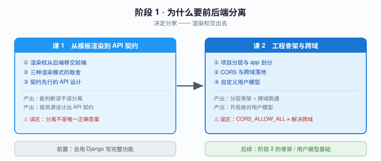
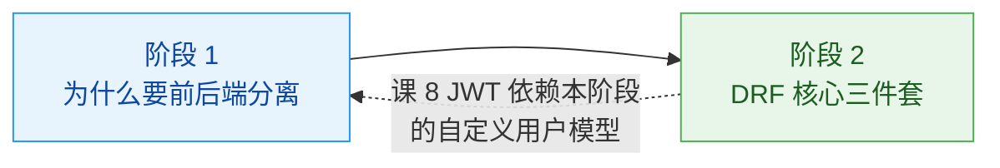

# 阶段 1：为什么要前后端分离

> 📖 故事章节：**决定分家** —— 渲染权交出去
> 🎯 本阶段回答：渲染权该归谁？分家后哪些 Django 能力退场？工程怎么搭？跨域怎么办？

---

## 阶段目标

| 目标 | 达成标志 |
|------|----------|
| 说清三种渲染模式的取舍 | 面对一个新项目，能判断该不该分离，而不是"大家都分离所以我也分离" |
| 知道哪些能力退场了 | 能列出模板系统、Forms 渲染、Messages 框架的替代方案，不再写分离架构下的服务端渲染代码 |
| 设计契约先行的 API | 能按资源建模，用对 HTTP 动词，URL 设计经得起前端消费 |
| 搭出可维护的工程骨架 | settings 按环境拆分，app 划分有依据，不是想到一个建一个 |
| 跑通第一个跨域请求 | 理解同源策略与预检请求，能独立排查 CORS 报错 |
| 开局做对自定义用户模型 | 知道为什么不能等，以及错了要付多大代价 |

---

## 范围边界（重要）

本主题是 **Django 进阶**，「前后端分离」是**范围裁剪条件**，不是学习目标。以下能力因依附服务端渲染而**不在本范围**：

| 退场能力 | 为什么退场 | 替代方案 |
|----------|-----------|----------|
| 模板系统与 DTL | 渲染权归前端 | 前端框架 |
| Forms / ModelForms 的渲染职责 | 表单由前端渲染 | Serializer（**校验思想保留**，见课 3） |
| Messages 框架 | 依赖 session + 模板显示 | API 响应体中的消息字段 |
| `` 模板用法 | 纯 Token 认证下不适用 | **仅在 cookie+session 方案下保留**，见课 10 |

**保留但限定边界**：Admin（课 19，只讲定制与安全，不讲模板体系）、staticfiles（课 19，只讲对 Admin 的意义）、CSRF（课 10，压缩为一节讲清适用边界）、Session vs Token（课 8，作为认证选型对比项）。

---

## 学习重点

### 🔑 必须掌握的知识点

| 课 | 知识点 | 为什么必须掌握 | 关键点 |
|----|--------|---------------|--------|
| 课 1 | 渲染权从后端移交前端（含退场清单） | 不理解耦合点在哪，分离只是形式；不知道退场清单会写出过时代码 | 演变 / 耦合点 / 退场能力 / 解耦后职责 |
| 课 1 | 三种渲染模式的取舍 | **"不该用"比"怎么用"更值钱** | 服务端渲染 / 分离 / 混合 / 决策依据 |
| 课 1 | 契约先行的 API 设计 | API 一旦发布就难改，设计要前置 | 资源建模 / 动词语义 / URL 规范 |
| 课 2 | 项目分层与 app 划分 | 骨架错了后面每课都在别扭的地方写 | 拆分动机 / 目录结构 / 划分粒度 |
| 课 2 | CORS 与跨域落地 | 分离后**第一个必踩的坑**，不配通一切免谈 | 同源策略 / 预检请求 / 中间件顺序 |
| 课 2 | 自定义用户模型 | 首次 migrate 后再改代价极高，**必须开局做对** | 为什么必须前置 / 迁移代价 / 正确姿势 |

### 🐞 本阶段高频误区（先打个预防针）

| 误区 | 真相 |
|------|------|
| "现在都前后端分离，服务端渲染过时了" | 内容站、SEO 敏感、首屏极致要求的场景，服务端渲染仍是更优解 |
| "CORS 报错就配 `CORS_ALLOW_ALL_ORIGINS = True`" | 这是在**关闭安全机制**，等于给所有网站开放你的用户数据 |
| "用户模型以后再改" | 首次 migrate 后改用户模型，往往意味着重建数据库或手写复杂迁移 |
| "分离了还要在 Django 里写模板" | 一旦分离，模板系统的维护成本大于收益，应彻底交给前端 |

---

## 本阶段路径图

---

## 阶段前置与后续

**前置知识**：会用 Django 写完整功能（模型、视图、模板、表单）。
**后续依赖**：本阶段搭的骨架、用户模型、CORS 配置，是阶段 2–6 全部内容的运行基础。

---

🚀 进入 [课 1《从模板渲染到 API 契约》](./lessons/lesson-01-从模板渲染到API契约.md)
