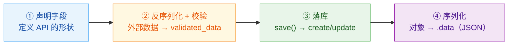
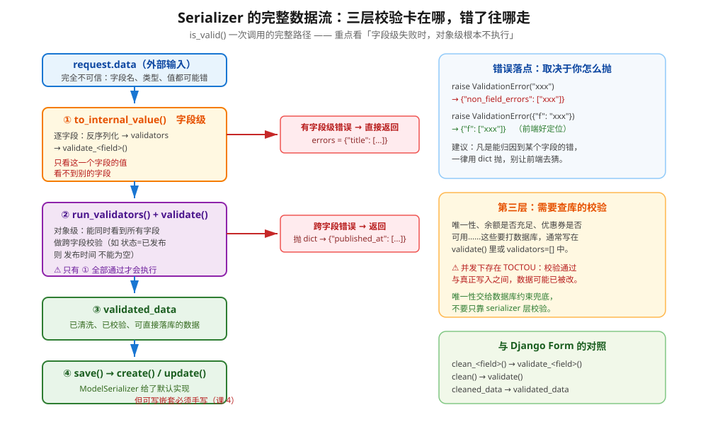
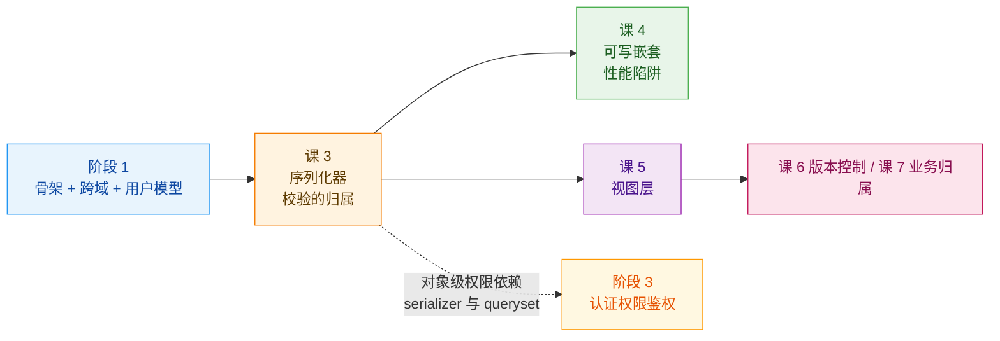
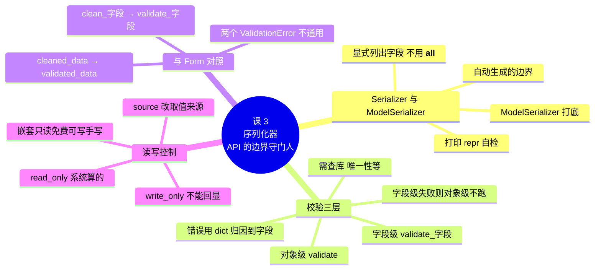

# 课 3　序列化器：API 的边界守门人

> 📖 情节定位：**立规矩（一）** —— 校验这件事，交给专业的人
> 🎯 本课目标：用对 Serializer 与 ModelSerializer，把校验写在对的层，并看懂老项目里的 Form

---

## 第一幕 · 起源与场景引入

### DRF：一个英国程序员的业余项目

你要开始用的这个框架，一开始并不叫"框架"。

2011 年 1 月，一个叫 **Tom Christie** 的英国开发者发布了 Django REST framework 的第一个版本。此后多年，它**几乎完全是在他的业余时间里开发出来的**。2012 年 10 月发布 2.0，几乎推倒重写了一遍；2014 年 7 月，Christie 在 Kickstarter 上发起众筹，为 3.3 版本募集资金——原定目标 £4,000，最终 440 名支持者凑出 £32,650；2015 年 10 月 28 日，3.3 如期发布。如今它由 Encode OSS Ltd 维护，被 Sentry、Robinhood、Mozilla、Red Hat 等公司用在生产环境。

（核查于 2026-09。作者与首发时间多源一致：[UOC 学位论文 · DRF Secure Code Guidelines](https://openaccess.uoc.edu/bitstream/10609/147246/3/mnaderFMDP0123report.pdf) 引 2014 年 Kickstarter 原文、[DRF 项目百科条目](https://goldevelopment.com/wiki/Django_REST_framework-6AJ3VZG)；2.0 与 Kickstarter 金额细节来自前者，**单一来源，⏳ 置信度：中**）

> 💡 **这个出身解释了一个设计倾向**：DRF 处处在模仿 Django 自己的约定——`is_valid()`、`ValidationError`、class-based views、settings 字典。读它的代码你会一直有"这个我见过"的感觉。**这不是巧合，是有意为之**：Tom Christie 要的就是让 Django 开发者零门槛上手。

### 你的场景

课 2 收尾时，你的骨架跑通了：前端从 `localhost:5173` 拿到 `localhost:8000` 的文章列表，CORS 和 CSRF 两道门都过了。

现在要实现"创建文章"。你很自然地写下：

```python
def article_create(request):
    data = json.loads(request.body)

    # 校验……写在视图里
    if not data.get("title"):
        return JsonResponse({"error": "标题不能为空"}, status=400)
    if len(data["title"]) > 200:
        return JsonResponse({"error": "标题不能超过 200 字"}, status=400)
    if data.get("status") not in ("draft", "published"):
        return JsonResponse({"error": "状态不合法"}, status=400)
    if data.get("status") == "published" and not data.get("published_at"):
        return JsonResponse({"error": "已发布必须有发布时间"}, status=400)
    if Article.objects.filter(slug=data["slug"]).exists():
        return JsonResponse({"error": "slug 已存在"}, status=400)

    article = Article.objects.create(**data)
    return JsonResponse({"id": article.id}, status=201)
```

**能跑。** 但你先别急着往下写——把这段代码的账算一算：

| 问题 | 后果 |
|------|------|
| 5 条校验写了 10 行，字段名硬编码 | 再加 5 个字段，这段代码会有 40 行 |
| 错误结构五花八门（`{"error": ...}`） | 前端要写 if-else 猜你的键名 |
| "编辑文章"接口要**再写一遍**同样的校验 | 改一条规则要改两个地方，必然漏 |
| 校验逻辑跟 HTTP 层焊死 | **没法单独测试**，必须发 HTTP 请求才能测 |
| 字段定义来自 `Article` 模型，却手写了一遍 | 模型改了，这里不会报错，只会**静默失效** |

而这一切的根源是课 1 就定下的那件事：**渲染权交出去了，校验权没有。**

> 💡 **分离之后，校验的责任全压在后端一个人身上。** 前端做校验是为了用户体验（少一次往返）；后端做校验是**安全边界**——攻击者不会打开你的网页，他直接 curl 你的接口。前端校验一个都拦不住他。

于是问题变成：**校验该放在哪一层，用什么工具承载？** 这就是本课的主角——序列化器。

---

## 第二幕 · 认知冲突

### 困惑一：ModelSerializer 明明帮我自动生成了，凭什么说它不安全？

你照着教程写：

```python
class UserSerializer(serializers.ModelSerializer):
    class Meta:
        model = User
        fields = "__all__"     # 一行搞定，多爽
```

请求 `GET /api/users/1/`，返回：

```json
{
  "id": 1,
  "password": "pbkdf2_sha256$1500000$x2GcIRP5SN3rZLDti3XK4l$grSUL9op8pcx/JeQwb5IjmsX/l8lUT3HSxVQ1jKyNsk=",
  "is_superuser": true,
  "is_staff": true,
  "user_permissions": [12, 34, 56],
  ...
}
```

**你的密码哈希、超管标记、完整权限列表，全出去了。**

DRF 官方文档对 `__all__` 的原话是：

> "It is **strongly recommended** that you explicitly set all fields that should be serialized using the `fields` attribute. This will make it less likely to result in **unintentionally exposing data when your models change**."
> —— [DRF - Serializers](https://www.django-rest-framework.org/api-guide/serializers/)

注意关键词：**when your models change**。`__all__` 的危险不是"它现在暴露了什么"，而是**将来有人在模型上加了个 `is_internal` 字段，你的接口当场就把新字段吐出去了，而你的代码一行没改**。

> 🔬 这条会在第四幕实验 3 里**原样复现**。

### 困惑二：校验我写在视图里，有什么不行？

"能跑就行"是最贵的四个字。把校验放在视图里，你会连续踩四个坑：

1. **不可复用** —— 创建和编辑要两遍；将来加个"批量导入"要第三遍。
2. **不可测试** —— 想测一条校验规则，得构造 HTTP 请求、走中间件、处理认证。
3. **错误结构不统一** —— 你写 `{"error": ...}`，隔壁同事写 `{"msg": ...}`，前端想统一提示只能骂人。
4. **与模型脱节** —— 模型把 `title` 从 200 字改成 100 字，视图里那个 `len() > 200` 依然检查通过，**静默失效**，直到有用户提交了 150 字标题把数据库打爆。

**序列化器的价值就在这里**：它是一个**声明式的、可测试的、与模型绑定的校验容器**，而且输入输出的形状都由它定义。视图只负责"把请求交给序列化器，把结果变成响应"。

### 困惑三：我在 `validate()` 里怎么拿不到东西？

你写了个跨字段校验：

```python
def validate(self, attrs):
    if attrs["status"] == "published" and attrs["published_at"] is None:
        raise serializers.ValidationError("已发布必须有发布时间")
    return attrs
```

测试时你传了一个**标题为空**的请求，期待看到那条"已发布必须有发布时间"的错误——结果什么都没有。更诡异的是，你在 `validate()` 里打的 `print` **完全没有输出**。

你开始怀疑人生：我写的校验为什么没跑？

答案会让本课的知识点 2 变得非常关键：

> **字段级校验只要有一条失败，对象级的 `validate()` 根本不会被执行。**

DRF 不是"把所有错误收集完再返回"，而是**分阶段短路**的。第四幕实验 4 会用探针把这个行为钉死。

---

## 第三幕 · 层层揭示

### 知识点 1：Serializer 与 ModelSerializer 的分工

#### 一句话定义

**Serializer** 是手工声明字段的校验与转换容器；**ModelSerializer** 是根据 Django 模型**自动生成**字段、校验器和 `create()`/`update()` 的 Serializer 子类。

#### 直觉建立：手填表和自动填表

去银行开户，有两种表：

- **Serializer = 白纸**：你要自己写下"姓名、身份证号、手机号……"，还要在每栏后面注明"必填""11 位数字"。麻烦，但**你完全控制纸上有什么**。
- **ModelSerializer = 银行预印好的表**：柜员照着你的档案把字段都印好了，你签个字就行。快，但**印了什么你得检查**——万一他把你的账户余额也印上去了呢？

所以正确姿势从来不是"二选一"，而是：

> **用 ModelSerializer 打底（省掉 80% 的重复声明），然后逐个字段检查它替你生成了什么。**

> ⚠️ **类比失效的边界**：银行的预印表印错了一眼能看见；ModelSerializer 生成的东西**默认是隐形的**——你不主动打印 `repr(serializer())` 就不知道它给了你什么。第四幕实验 1 会教你这条自检命令。

#### 核心原理一：Serializer 到底做了四件事



**第 ① 条最容易被忽略，但它最重要**：`Serializer` 的字段列表**就是你的 API 契约**。课 1 说契约要显式——在 DRF 里，承载这份契约的就是序列化器。

> 🔗 **伏笔**：课 20 讲 OpenAPI 文档自动生成时，你会发现**文档是从 serializer 的字段定义里推出来的**。字段定义写得含糊，文档就跟着含糊。

#### 核心原理二：ModelSerializer 自动替你做了三件事

DRF 官方文档的原文：

> "The `ModelSerializer` class is the same as a regular `Serializer` class, except that:
> - It will **automatically generate a set of fields** for you, based on the model.
> - It will **automatically generate validators** for the serializer, such as unique_together validators.
> - It includes **simple default implementations of `.create()` and `.update()`**."

第三件尤其重要：手写 `Serializer` 时，`save()` 会抛 `NotImplementedError`——`create()`/`update()` 必须你自己写。`ModelSerializer` 给你补齐了。

#### 核心原理三：自动生成规则的边界（本课最实用的一张表）

这是本课的核心。下面 8 条**全部经过第四幕实验 2 实测**，但我把"官方文档是否明示"单独标出来——因为其中 3 条文档没写，是实测结论：

| 模型定义 | 自动生成 | 文档明示？ | 实测 |
|---------|---------|-----------|------|
| `ForeignKey` | → `PrimaryKeyRelatedField` | ✅ 明示 | ✅ |
| 反向关系 | **默认不包含**；显式写进 `fields` 则生成多值关联字段（值为主键列表） | ✅ 明示「默认不包含」 | ✅ |
| `choices=...` | → `ChoiceField` | ✅ 明示 | ✅ |
| `editable=False`（含 `auto_now` / `auto_now_add`）、`AutoField` | → `read_only=True`，无需写进 `read_only_fields` | ✅ 明示 | ✅ |
| `ManyToManyField` | → 多值关联字段 | ⚠️ 未单独列 | ✅ |
| `unique=True` | → 自动挂 `UniqueValidator` | ❌ 文档未提 | ✅ 实测确认 |
| `null=True` | → `required=False` + `allow_null=True` | ❌ 文档未提 | ✅ 实测确认 |
| 字段有 `default` | → `required=False` | ❌ 文档未提 | ✅ 实测确认 |
| `blank=True` | → `required=False`（文本类还带 `allow_blank`） | ❌ 文档未提 | ✅ 实测确认 |

> 📚 官方文档明示的三条，来源：[DRF - Serializers](https://www.django-rest-framework.org/api-guide/serializers/)
> 🔬 **后 5 条是我实测确认的，DRF 文档没有写下这些规则。** 这意味着它们属于**实现行为**而非**契约保证**——升级 DRF 大版本时值得重新验证一遍。这正是"不靠推断、要实跑"的价值所在。

**反向关系**这条要单独说清楚，因为它有**两层行为**，很多人只知道第一层：

**第一层：不显式写出来，它就不会出现。** 官方文档原文：

> "Reverse relationships are **not included by default** unless explicitly included as specified in the serializer relations documentation."

**第二层：一旦你显式写进 `fields`，它就会出现——但只给主键列表。** 第四幕实验 9 实测：

```python
class ArticleWithReverseSerializer(serializers.ModelSerializer):
    class Meta:
        model = Article
        fields = ["id", "title", "comments"]     # comments 是反向关系
```

```text
  id         BigIntegerField        read_only=True
  title      CharField              read_only=False
  comments   ManyRelatedField       read_only=False
  序列化输出: {'id': 1, 'title': '反向关系测试', 'comments': [1]}
```

看清楚：它**没有报错**，而是生成了一个 `ManyRelatedField`，值是 `[1]`——**评论的主键列表**，不是评论内容。

所以正确的心智模型是：

| 你想要什么 | 怎么做 |
|-----------|--------|
| 只要关联对象的主键列表 | 直接把反向关系名写进 `fields` 即可 |
| 要完整的嵌套对象（`[{id, content, ...}]`） | 先建 `CommentSerializer`，再显式声明 `comments = CommentSerializer(many=True, read_only=True)` |

> ⚠️ **两种写法都不会报错**，所以"我写上了但拿到的是 `[1]` 而不是评论内容"不会有任何提示——**只有打印 `repr(serializer())` 才能看出它给你生成了 `ManyRelatedField`**。

#### 核心原理四：什么时候用哪个

| 场景 | 用 | 理由 |
|------|-----|------|
| 字段与某个模型高度重合 | **ModelSerializer** | 省掉大量重复声明，自动带校验器 |
| 请求/响应形状与模型不一致（如聚合、统计） | **Serializer** | 没有模型可映射 |
| 输入是"命令"而非"资源"（如"发送验证码"） | **Serializer** | 它根本不是模型 |
| 需要组合多个模型的数据 | **Serializer**（内部嵌 ModelSerializer） | 见下 |
| 只是想快速跑通 CRUD | **ModelSerializer** + 显式 `fields` | ⚠️ 永远不要配 `__all__` |

**判断口诀**：

> **有模型 → ModelSerializer；没模型 → Serializer。**
> 但无论用哪个，**字段都要显式列出**。

#### 示例演示

```python
# ✅ 推荐：ModelSerializer + 显式 fields + 标出只读字段
class ArticleSerializer(serializers.ModelSerializer):
    class Meta:
        model = Article
        fields = ["id", "title", "slug", "body", "status", "author", "published_at", "created_at"]
        read_only_fields = ["id", "created_at"]      # created_at 其实已自动只读，写上更清晰
```

```python
# ✅ 无模型场景：手写 Serializer
class SendSmsCodeSerializer(serializers.Serializer):
    phone = serializers.RegexField(regex=r"^1[3-9]\d{9}$")

    def validate_phone(self, value):
        if User.objects.filter(phone=value).exists():
            raise serializers.ValidationError("该手机号已注册")
        return value
```

**自检手段**（每个 ModelSerializer 写完后都应该跑一次）：

```bash
python manage.py shell -c "
from apps.articles.serializers import ArticleSerializer
print(repr(ArticleSerializer()))
"
```

它会把生成出来的**每一个字段**打印出来，包括类型、`required`、`read_only`、`allow_null` 和挂了哪些 validator。**不看这一眼，你永远不知道它替你生成了什么。**

#### 常见误区

- ❌ **`fields = "__all__"` 省事** —— 它是"模型改了接口跟着裸奔"的开关。官方明确建议显式列出。
- ❌ **`exclude = ["password"]` 就等于安全了** —— 黑名单思维。模型将来加字段，照样自动暴露。用白名单（`fields`）。
- ❌ **"ModelSerializer 会自动处理一切"** —— 它处理不了：跨模型校验、依赖当前用户的校验、非模型字段（确认密码、验证码）。
- ❌ **手写 Serializer 里 `null=True` 会自动生效** —— 不会。**手写 Serializer 一个自动生成规则都不享受**，全靠 `validators=[]` 手加。

#### 一句话记住

> **ModelSerializer 打底 + 显式列出字段；生成了什么必须打印出来看一眼。**

---

### 知识点 2：校验的三层防线

#### 一句话定义

DRF 的校验分三层：**字段级**（只看单个字段）、**对象级**（同时看到所有字段，做跨字段校验）、**需查库级**（唯一性、余额等要打数据库的校验）。

#### 直觉建立：机场的三道安检

| 层 | 机场类比 | DRF 实现 | 能看到什么 |
|----|---------|---------|-----------|
| ① 字段级 | 查身份证——**只看你这一张证件** | `validators=[]` + `validate_<field>()` | 单个字段的值 |
| ② 对象级 | 开箱检查——**所有东西摊开一起看** | `validate()` | 所有字段 |
| ③ 需查库 | 联网核查——**要问外部系统** | `validate()` 里查库 / 自定义 validator | 数据库状态 |

**机场的逻辑是"任何一道不过，后面就不查了"**——你身份证都过期了，人家不会还帮你开箱。DRF 也是这样：**字段级失败，对象级不执行。**

> ⚠️ **类比失效的边界**：机场三道安检都由不同的人做，你可能过两关卡一关。而 DRF 三层是**同一个 `is_valid()` 调用里的连续阶段**——而且一旦前面失败，后面的**连跑都不跑**，所以你不会一次拿到所有错误。

#### 核心原理一：完整数据流与三层的卡点



**这三层的分工，用代码说就是：**

```python
class ArticleCreateSerializer(serializers.ModelSerializer):
    class Meta:
        model = Article
        fields = ["id", "title", "slug", "status", "author", "published_at"]
        read_only_fields = ["id"]

    # ① 字段级：只看这一个字段，不依赖其他字段
    def validate_title(self, value):
        if len(value.strip()) < 5:
            raise serializers.ValidationError("标题至少 5 个字（去空格后）")
        return value.strip()          # ⚠️ 必须 return，否则 validated_data 里是 None

    # ② 对象级：能同时看到所有字段
    def validate(self, attrs):
        if attrs.get("status") == "published" and attrs.get("published_at") is None:
            raise serializers.ValidationError(
                {"published_at": "状态为「已发布」时，发布时间不能为空"}   # ← 用 dict 归因到字段
            )
        return attrs                  # ⚠️ 同样必须 return
```

**怎么判断该放哪一层？** 一条判据就够：

> **这条规则需要看到别的字段吗？**
> 不需要 → 字段级 `validate_<field>()`。
> 需要 → 对象级 `validate()`。

#### 核心原理二：执行顺序 —— 字段级失败时 `validate()` 不执行

**这是本课最反直觉、也最容易让你白调试两小时的一条。**

DRF 的 `run_validation()` 是分阶段的：

```text
to_internal_value(data)     ← ① 逐字段：反序列化 + validators + validate_<field>()
    ↓ 有错？收集成 dict 直接抛出，函数结束
run_validators(value)       ← ② 类级 validators（如 UniqueTogetherValidator）
validate(value)             ← ② 对象级
```

**只要 ① 产出了任何一条错误，`validate()` 就永远不会被执行。**

第四幕实验 4 的实测（用探针记录钩子调用）：

```text
【情形 1】数据全部合法：
  is_valid() = True
  钩子执行顺序: ['validate_title（字段级）', 'validate（对象级）']

【情形 2】title 超过 max_length=10：
  is_valid() = False
  errors     = {'title': [ErrorDetail(string='请确保这个字段不能超过 10 个字符。', code='max_length')]}
  钩子执行顺序: []
  -> validate() 是否执行: 否  ← 关键

【情形 3】title 通过长度检查、但被 validate_title 拒绝：
  is_valid() = False
  errors     = {'title': [ErrorDetail(string='标题至少 3 个字', code='invalid')]}
  钩子执行顺序: ['validate_title（字段级）']
  -> validate() 是否执行: 否  ← 关键
```

**注意情形 2 的钩子顺序是空的**——连 `validate_title` 都没跑。因为 `max_length` 是在**反序列化阶段**（`to_internal_value` 内部、调用 `validate_<field>` **之前**）就失败的。

**这条知识的实际价值**：当你在 `validate()` 里打的日志不输出、断点不生效时，**别去查 validate 的逻辑，先去看 `serializer.errors` 里有没有字段级错误**。

#### 核心原理三：错误的落点由你怎么抛决定

| 你怎么抛 | 错误落到哪 | 前端体验 |
|---------|-----------|---------|
| `raise ValidationError("xxx")` | `{"non_field_errors": ["xxx"]}` | ❌ 不知道是哪个字段出错 |
| `raise ValidationError({"f": "xxx"})` | `{"f": ["xxx"]}` | ✅ 能直接高亮到表单项 |

实测对照：

```text
errors = {'non_field_errors': [ErrorDetail(string='a 不能大于 b', code='invalid')]}
errors = {'published_at': [ErrorDetail(string='状态为「已发布」时，发布时间不能为空', code='invalid')]}
```

> 💡 **团队约定建议**：凡是能归因到某个字段的错误，一律用 dict 抛。`non_field_errors` 只留给真正的整体性错误（如"余额不足"这种涉及多个字段的）。前端可以统一按 `{字段名: 错误信息}` 渲染到表单项上。

#### 核心原理四：与 Django Form 的对照

课 1 说过：**Forms 退场的是渲染职责，校验思想完整保留。** 现在兑现这句话。

| | Django Form | DRF Serializer |
|---|---|---|
| 字段级校验 | `clean_<field>()` | `validate_<field>()` |
| 对象级校验 | `clean()` | `validate()` |
| 校验后的数据 | `cleaned_data` | `validated_data` |
| 报错的类 | `ValidationError` | `ValidationError` |
| 入口 | `is_valid()` | `is_valid()` |
| 取错误 | `form.errors` | `serializer.errors` |
| 落库 | 你自己写 | `save()` → `create()`/`update()` |

**几乎是逐项对应。** 这就是为什么学会一个另一个就会——它们是同一套心智模型。

> 🚨 **但有一个致命的坑**：**两个 `ValidationError` 不是同一个类。**
>
> ```text
> Django: django.core.exceptions.ValidationError
> DRF   : rest_framework.exceptions.ValidationError
> ```
>
> 实测（第四幕实验 6）：
> - 在 **Form** 里抛 **DRF 版** → `is_valid()` **直接抛出异常逃逸**，不会被转成表单错误。
> - 在 **Serializer** 里抛 **Django 版** → ✅ 能被正常捕获，变成 `{'title': [...]}`
>
> **结论**：DRF 侧两种都能用（它做了兼容），但 **Form 侧只能用 Django 版**。维护老项目时，别忘了看 import 语句从哪来。

#### 示例演示：三层合一的完整例子

```python
class ArticleCreateSerializer(serializers.ModelSerializer):
    class Meta:
        model = Article
        fields = ["id", "title", "slug", "body", "status", "author", "published_at"]
        read_only_fields = ["id"]

    # ① 字段级：单字段规则
    def validate_title(self, value):
        if len(value.strip()) < 5:
            raise serializers.ValidationError("标题至少 5 个字（去空格后）")
        return value.strip()

    def validate_slug(self, value):
        if value.lower() in {"admin", "api", "new"}:
            raise serializers.ValidationError(f"slug 不能用保留字：{value}")
        return value

    # ② 对象级：跨字段规则
    def validate(self, attrs):
        if attrs.get("status") == Article.Status.PUBLISHED and attrs.get("published_at") is None:
            raise serializers.ValidationError({"published_at": "状态为「已发布」时，发布时间不能为空"})
        return attrs
    # ③ 需查库：slug 唯一性由 ModelSerializer 自动挂的 UniqueValidator 完成
```

实测的错误结构（第四幕实验 5）：

```text
【L1 字段级】标题太短：
  errors = {'title': [ErrorDetail(string='标题至少 5 个字（去空格后）', code='invalid')]}

【L1 字段级】slug 命中保留字：
  errors = {'slug': [ErrorDetail(string='slug 不能用保留字：admin', code='invalid')]}

【L2 对象级·跨字段】status=published 但没给 published_at：
  errors = {'published_at': [ErrorDetail(string='状态为「已发布」时，发布时间不能为空', code='invalid')]}

【L3 需查库】slug 重复：
  errors = {'slug': [ErrorDetail(string='具有 slug 的 文章 已存在。', code='unique')]}
```

**关于 L3 的一个好消息**（实验 5 实测）：

```text
⚠️ update 时的坑：拿自己现有的 slug 更新自己，会不会误报重复？
  is_valid() = True  errors = {}
  -> ModelSerializer 的 UniqueValidator 会自动用 instance 排除自身
```

ModelSerializer 生成的 `UniqueValidator` 知道当前 `instance` 是谁，更新自己时不会把自己的 slug 判成重复。**但这个便利只有 `ModelSerializer` 有**——手写 `Serializer` 里自己加 `UniqueValidator` 时，你得自己处理 `exclude` 逻辑。

> ⚠️ **并发下的 TOCTOU 提醒**：唯一性在 serializer 层是"先查再写"，两个请求同时通过校验就会都写入。**真正的唯一性必须由数据库唯一约束兜底**——serializer 层的校验只是为了给出友好错误，不是为了替代约束。

#### 常见误区

- ❌ **`validate_title` 里忘了 `return value`** —— `validated_data` 里该字段会是 `None`，且不报错。这是最阴的一类 bug。
- ❌ **"我在 `validate()` 里做所有校验就行了"** —— 字段级错误会**短路**掉 `validate()`，你的校验根本不执行。
- ❌ **在 Form 里抛 DRF 的 `ValidationError`** —— 异常逃逸，不会被 `is_valid()` 捕获。
- ❌ **"校验通过就一定能写入"** —— 忘了并发。唯一性、库存、余额这类必须靠数据库约束/事务兜底。
- ❌ **`validate()` 里直接 `attrs["x"]` 取值** —— 该字段可能没传（非必填字段），会 `KeyError`。用 `attrs.get("x")`。

#### 一句话记住

> **单字段规则用 `validate_<field>()`，跨字段规则用 `validate()`；字段级一失败，对象级就不跑。**

---

### 知识点 3：嵌套、来源与只读字段

#### 一句话定义

**`read_only` / `write_only` / `source` / 嵌套** 这四个机制，共同回答一个问题：**这个字段在"读出来"和"写进去"两个方向上分别该怎么表现？**

#### 直觉建立：一张快递单

| 机制 | 快递单类比 |
|------|-----------|
| **默认（双向）** | 收件人姓名——寄件时你填，收件后对方也看得见 |
| `read_only` | 快递单号、下单时间——**系统生成，你填了也没用** |
| `write_only` | 身份证号——**你填一次用于核验，之后单子上不会印出来** |
| `source` | 单子上写"收件人"，但系统里字段名是 `recipient_name` |
| **嵌套** | 包裹里还有子包裹（一篇文章带多条评论） |

> ⚠️ **类比失效的边界**：快递单上"填了也没用"的字段，通常会被划掉或提示；而 DRF 对传入的 `read_only` 字段是**静默丢弃**——不报错、不警告（第四幕实验 7 实测）。这既是方便（前端把整个对象原样 PUT 回来也不会出事），也是隐患（你以为写进去了，其实没有）。

#### 核心原理一：读写控制决策表

| 需求 | 写法 | 出现在响应里？ | 能被写入吗？ |
|------|------|--------------|-------------|
| 系统生成（id、创建时间） | `read_only=True` 或 `read_only_fields` | ✅ | ❌（静默丢弃） |
| 敏感输入（密码、验证码） | `write_only=True` | ❌ | ✅ |
| 普通字段 | 默认 | ✅ | ✅ |
| 可空 | `required=False, allow_null=True` | ✅ | ✅（可传 null） |
| 有默认值的可选项 | `required=False` 或 `default=...` | ✅ | ✅（可不传） |
| 计算字段 | `SerializerMethodField()` | ✅ | ❌（自动只读） |

> 💡 **判断口诀**：*这个字段的值，是**用户给的**还是**系统算的**？* 系统算的 → `read_only`；用户给的但不想回显 → `write_only`。

#### 核心原理二：`source` 的三种用法

```python
class ArticleSourceSerializer(serializers.ModelSerializer):
    headline = serializers.CharField(source="title", read_only=True)              # ① 重命名
    author_name = serializers.CharField(source="author.username", read_only=True) # ② 跨关系取值
    comment_count = serializers.SerializerMethodField()                           # ③ 指向方法

    class Meta:
        model = Article
        fields = ["id", "headline", "author_name", "comment_count", "status"]

    def get_comment_count(self, obj) -> int:
        return obj.comments.count()    # ⚠️ 每个实例一次查询 —— 课 4 会专门讲这个 N+1 陷阱
```

实测输出（第四幕实验 7）：

```text
{'id': 2, 'headline': 'source 用法演示', 'author_name': 'alice', 'comment_count': 2, 'status': 'published'}
```

**三种用法分别解决什么问题：**

| 用法 | 场景 | 注意 |
|------|------|------|
| **重命名** | 对外 API 叫 `headline`，但模型字段叫 `title` | 加 `read_only=True` 时只能读；要可写就去掉 |
| **跨关系取值** | 不想让前端拿 `author: 1` 再发一次请求查用户名 | `source="author.username"` 会产生**关联查询**，列表接口要配 `select_related`（课 15） |
| **指向方法** | 值是算出来的（计数、聚合、格式化） | `SerializerMethodField` 自动只读 |

> ⚠️ **一个易错点**：写了 `source` 之后，`validated_data` 的键名是 **source 指向的名字**，不是你声明的字段名。上面例子里因为都是 `read_only` 所以无所谓，但**可写字段带 `source` 时要在 `create()`/`update()` 里按源名取值**。

#### 核心原理三：嵌套序列化器

**只读嵌套：天然可用，直接声明就行。**

```python
class CommentSerializer(serializers.ModelSerializer):
    class Meta:
        model = Comment
        fields = ["id", "author", "content", "created_at"]


class ArticleWithCommentsSerializer(serializers.ModelSerializer):
    comments = CommentSerializer(many=True, read_only=True)    # ← 关键：read_only

    class Meta:
        model = Article
        fields = ["id", "title", "comments"]
```

**可写嵌套：必须手写 `create()` / `update()`，否则直接炸。**

第四幕实验 8 的实测：

```text
【可写嵌套】不手写 create() 直接 save()：
  is_valid() = True  errors = {}
  save() 抛出: AssertionError
  原文: The `.create()` method does not support writable nested fields by default.
        Write an explicit `.create()` method for serializer
        `apps.articles.serializers.ArticleWritableNestedSerializer`,
        or set `read_only=True` on nested serializer fields.
```

🚨 **注意这个报错的时机**：`is_valid()` 返回 `True`，**错误发生在 `save()` 阶段**。如果你的代码是 `if serializer.is_valid(): serializer.save()`，这个异常会直接冒泡成 500。

**为什么 DRF 不肯帮你做？** 官方原文解释得很清楚：

> "Because the behavior of nested creates and updates can be **ambiguous**, and may require complex dependencies between related models, REST framework 3 **requires you to always write these methods explicitly**. The default `ModelSerializer` `.create()` and `.update()` methods do not include support for writable nested representations."

翻译成人话：**"先建文章再建评论"还是"先建评论再建文章"？中间失败要不要回滚？评论的作者用请求里的还是嵌套数据里的？** 这些问题没有标准答案，所以 DRF 把决定权交给你。

> 🔗 **这是课 4 的主题**：可写嵌套的 `create()`/`update()` 怎么写、怎么保证原子性、以及**什么时候干脆应该拆成两个接口**。本课你只要记住结论：**不写 `create()` 就会在 `save()` 阶段抛 `AssertionError`。**

#### 常见误区

- ❌ **"`read_only` 字段传进来会报错"** —— **不会**，静默丢弃。实测：传 `id=999`，`is_valid()` 返回 `True`，`validated_data` 里没有它。
- ❌ **"嵌套序列化器加上就能写"** —— 只读可以，写入必须手写 `create()`/`update()`。
- ❌ **"反向关系写进 `fields` 会报错"** —— **不会报错**。它会生成一个 `ManyRelatedField`，值是**主键列表**（如 `{"comments": [1]}`），而且 `read_only=False`。想要完整嵌套对象，得显式声明 `comments = CommentSerializer(many=True, read_only=True)`。
- ❌ **"`SerializerMethodField` 很方便，多用"** —— 它对**每个实例**都调用一次方法，里面查一次库就是 N+1。课 4 会专门讲。
- ❌ **"`source="author.username"` 免费"** —— 它会产生关联查询，列表接口不配 `select_related` 就是 N+1（课 15）。

#### 一句话记住

> **`read_only` 是"系统算的"，`write_only` 是"不能回显的"，`source` 改取值来源；嵌套只读免费、可写要手写。**

---

## 第四幕 · 实操验证

### 验证环境

| 项 | 值 |
|---|---|
| 环境 | **Windows 11 + WorkBuddy 托管 Python 3.13.14** |
| 依赖 | Django **6.1**、djangorestframework **3.18.0** |
| 数据库 | SQLite **内存库**（每次运行都是干净状态） |
| 复用环境 | `C:\Users\v_wypgwu\.workbuddy\binaries\python\envs\dj-course`（课 2 建的 venv） |
| 实测日期 | 2026-09-02 |

> ⚠️ 与课 2 相同：`wsl.exe` 在本轮会话中仍被本机安全策略拦截，故继续使用课 2 建好的托管 Python 环境。**所有输出均为真实执行结果。**

**一键复现：**

```bash
git clone 后进入本课实验目录，执行：
python run_lab.py
```

（需先 `pip install "Django==6.1.*" "djangorestframework>=3.18"`，或复用 `dj-course` 虚拟环境）

---

### 实验 1：ModelSerializer 自动生成了什么

```text
【A】ModelSerializer 的字段（只写了 fields 列表，其余全自动）：
  id              BigIntegerField         read_only|required=False       []
  title           CharField               -                              ['ProhibitNullCharactersValidator', …]
  slug            SlugField               -                              ['UniqueValidator', …, 'RegexValidator']
  body            CharField               required=False                 ['ProhibitNullCharactersValidator', …]
  status          ChoiceField             required=False                 []
  author          PrimaryKeyRelatedField  -                              []
  tags            ManyRelatedField        required=False                 []
  created_at      DateTimeField           read_only|required=False       []
  updated_at      DateTimeField           read_only|required=False       []
  published_at    DateTimeField           required=False|allow_null      []
  views           IntegerField            required=False                 ['MaxValueValidator', 'MinValueValidator']

【B】手写 Serializer 的字段（同样的语义，要自己声明每一个）：
  title           CharField               required=True
  slug            SlugField               required=True
  body            CharField               required=False
  status          ChoiceField             required=False
  author          PrimaryKeyRelatedField  required=True
  tags            ManyRelatedField        required=False
  published_at    DateTimeField           required=False
  views           IntegerField            required=False

  行数对比：ModelSerializer 声明 11 个字段 ≈ 3 行；手写 Serializer 声明 8 个字段 ≈ 9 行
```

**回扣知识点 1**：注意 `slug` 那行——`UniqueValidator` 是**自动挂上去的**，你一行代码没写。`views` 那行的 `MaxValueValidator`/`MinValueValidator` 来自 `PositiveIntegerField`。

> 🔬 **自检手段记住这条命令**：`print(repr(YourSerializer()))`。它把生成的每个字段、类型、标志、validator 全打印出来。

---

### 实验 2：自动生成规则的边界（逐项验证）

```text
  模型定义                         字段             预期                             实测
  ----------------------------------------------------------------------------------------
  slug  (unique=True)          slug           自动生成 UniqueValidator           ✅ 命中
  status (choices=…)           status         生成 ChoiceField                 ✅ 命中
  author (ForeignKey)          author         生成关联字段                         ✅ 命中
  tags   (ManyToMany)          tags           生成多值关联字段                       ✅ 命中
  created_at (auto_now_add)    created_at     read_only=True                 ✅ 命中
  updated_at (auto_now)        updated_at     read_only=True                 ✅ 命中
  published_at (null=True)     published_at   required=False + allow_null    ✅ 命中
  views  (default=0)           views          required=False                 ✅ 命中

  ⚠️ 手写 Serializer 里，上面这些一个都不会自动生成，全要靠 validators=[...] 手动加
```

**回扣知识点 1**：8 条全部命中。其中**只有 3 条（FK / choices / editable=False）是文档明示的**，另外 5 条（`unique` / `null` / `default` / `blank` / M2M）是实测确认的实现行为——文档没写，所以升级大版本时值得重新验证。

---

### 实验 3：`fields = "__all__"` 到底暴露了什么

```text
【危险】UserAllSerializer(fields='__all__') 暴露的字段：
    id  password  last_login  is_superuser  username  first_name  last_name
    email  is_staff  is_active  date_joined  groups  user_permissions
  🚨 暴露: password
  🚨 暴露: is_staff
  🚨 暴露: is_superuser
  🚨 暴露: user_permissions
  🚨 暴露: groups

【安全】UserSafeSerializer（显式列出 + password 标 write_only）：
    id           BigIntegerField      read_only
    username     CharField            读写
    email        EmailField           读写
    date_joined  DateTimeField        read_only
    password     CharField            write_only

  序列化 bob 的输出对比：
    __all__ 版 : {'id': 2, 'password': 'pbkdf2_sha256$1500000$x2GcIRP5…', 'last_login': None,
                  'is_superuser': False, 'username': 'bob', …, 'groups': [], 'user_permissions': []}
    显式列出版 : {'id': 2, 'username': 'bob', 'email': 'bob@example.com', 'date_joined': '2026-09-02T11:48:48.052331+08:00'}
```

**逐条回扣：**

| 观察 | 印证了什么 |
|------|-----------|
| `password` 的完整哈希被返回 | 攻击者拿到它可以离线暴力破解。**`__all__` 不是"方便"，是漏洞** |
| `is_staff` / `is_superuser` 被返回 | 攻击者一眼看出哪些账号是高价值的 |
| `user_permissions` / `groups` 被返回 | 完整权限清单泄露，等于给了攻击者一张"能干什么"的地图 |
| 显式列出版干净的输出 | 白名单思维：只声明要什么，模型加字段也不会自动暴露 |

> 💡 **顺带一个观察**：输出里的 `pbkdf2_sha256$**1500000**$...` 印证了学习档案里记录的那条——**Django 6.1 把 PBKDF2 迭代次数提高到了 150 万次**。这条会在**课 8《认证：你是谁》**展开：迭代次数越高越抗暴力破解，但每次登录的 CPU 开销也越大。

---

### 实验 4：校验执行顺序 —— 字段级失败时，对象级还跑吗？

```text
【情形 1】数据全部合法：
  is_valid() = True
  钩子执行顺序: ['validate_title（字段级）', 'validate（对象级）']

【情形 2】title 触发字段级错误（长度超过 max_length=10）：
  is_valid() = False
  errors     = {'title': [ErrorDetail(string='请确保这个字段不能超过 10 个字符。', code='max_length')]}
  钩子执行顺序: []
  -> validate() 是否执行: 否  ← 关键

【情形 3】title 通过字段长度、但被 validate_title 拒绝（少于 3 字）：
  is_valid() = False
  errors     = {'title': [ErrorDetail(string='标题至少 3 个字', code='invalid')]}
  钩子执行顺序: ['validate_title（字段级）']
  -> validate() 是否执行: 否  ← 关键
```

**回扣第二幕的困惑三与知识点 2：**

| 观察 | 结论 |
|------|------|
| 情形 2 的钩子顺序是**空数组** | `max_length` 在**反序列化阶段**就失败了，连 `validate_<field>` 都没跑到 |
| 情形 3 只跑了 `validate_title` | 字段级钩子抛错后，`validate()` 不执行 |
| 三种情形里 `validate()` 只在情形 1 执行 | **对象级校验被字段级错误短路** |

> 🔍 **排障自检**：`validate()` 里的 `print` / 断点不生效 → 先 `print(serializer.errors)`，多半有字段级错误卡在前面。

---

### 实验 5：三层校验与错误结构

```text
【L1 字段级】标题太短：
  errors = {'title': [ErrorDetail(string='标题至少 5 个字（去空格后）', code='invalid')]}

【L1 字段级】slug 命中保留字：
  errors = {'slug': [ErrorDetail(string='slug 不能用保留字：admin', code='invalid')]}

【L2 对象级·跨字段】status=published 但没给 published_at：
  errors = {'published_at': [ErrorDetail(string='状态为「已发布」时，发布时间不能为空', code='invalid')]}
  -> 注意：错误挂在 published_at 字段下，因为 validate() 里抛的是 dict

【L2 对象级】不用 dict 而直接抛字符串时：
  errors = {'non_field_errors': [ErrorDetail(string='a 不能大于 b', code='invalid')]}
  -> 挂在 'non_field_errors' 键下

【L3 需查库】slug 重复（UniqueValidator 自动生成，会打数据库）：
  errors = {'slug': [ErrorDetail(string='具有 slug 的 文章 已存在。', code='unique')]}

⚠️ update 时的坑：拿自己现有的 slug 更新自己，会不会误报重复？
  is_valid() = True  errors = {}
  -> ModelSerializer 的 UniqueValidator 会自动用 instance 排除自身
```

**回扣知识点 2**：三层错误结构一致（都是 `{字段: [错误]}`），因为 L2 用了 dict 抛错。最后那条是本课最好的消息之一——**更新自己不会误报唯一性冲突**，但这是 `ModelSerializer` 的特殊照顾，手写 `Serializer` 没有。

---

### 实验 6：与 Django Form 的对照

```text
         Django Form              DRF Serializer
  --------------------------------------------------------------
  字段级    clean_<field>()          validate_<field>()
  对象级    clean()                  validate()
  结果     cleaned_data             validated_data
  报错     ValidationError          ValidationError
  入口     is_valid()               is_valid()
  取错     form.errors              serializer.errors

  同样的非法输入：
    Form      is_valid()=False  errors={'title': ['标题至少 5 个字（去空格后）']}
    Serializer is_valid()=False  errors={'title': [ErrorDetail(string='标题至少 5 个字（去空格后）', code='invalid')]}

  同样的合法输入：
    Form      is_valid()=True  cleaned_data={'title': '一个足够长的标题'}
    Serializer is_valid()=True  validated_data={'title': '一个足够长的标题'}

  ⚠️ 【混用陷阱】在 Form 里抛 DRF 的 ValidationError 会怎样：
    is_valid() 直接抛出 rest_framework.exceptions.ValidationError —— 异常逃逸
    -> 两个 ValidationError 不是同一个类：
       Django: django.core.exceptions.ValidationError
       DRF   : rest_framework.exceptions.ValidationError
    -> 但反过来可以：DRF 的 Serializer 里抛 Django 的 ValidationError 能被正常捕获
       实测：Serializer 里抛 Django 版 → is_valid()=False  errors={'title': [ErrorDetail(string='用 Django 的 ValidationError', code='invalid')]}
```

**回扣知识点 2 核心原理四**：

| 观察 | 结论 |
|------|------|
| 两张表几乎逐项对应 | 课 1 说的"校验思想保留"是真的——**同一套心智模型，换个方法名** |
| Form 的错误是纯字符串，Serializer 的是 `ErrorDetail`（带 `code`） | DRF 多带了机器可读的错误码，前端可以按 `code` 分支处理 |
| Form 里抛 DRF 版 `ValidationError` → 异常逃逸 | **两个类不通用**。维护老项目时务必看 import 来源 |
| Serializer 里抛 Django 版 → 正常捕获 | DRF 做了向下兼容，所以**在 DRF 侧两种写法都能用** |

> 💡 **给维护老项目的你**：看到 `clean_xxx()` 不要慌，它就是 `validate_xxx()`。但要**第一时间检查 import**——`from rest_framework import serializers` 和 `from django.core.exceptions import ValidationError` 混用会出事。

---

### 实验 7：`source` / `read_only` / `write_only`

```text
【source】重命名 + 跨关系取值 + 指向方法：
  {'id': 2, 'headline': 'source 用法演示', 'author_name': 'alice', 'comment_count': 2, 'status': 'published'}
  模型上的真实字段名仍是 title / author / comments：
    ArticleSourceSerializer().fields 的键 = ['id', 'headline', 'author_name', 'comment_count', 'status']

【write_only】注册序列化器：
  输入（含明文密码）: username=carol, password=Passw0rd!2026
  is_valid() = True  errors = {}
  序列化输出（不含密码）: {'id': 3, 'username': 'carol', 'email': 'carol@example.com'}
  数据库里存的是哈希: pbkdf2_sha256$1500000$nbaxj7p5…

  【密码不一致时】：
  is_valid() = False  errors = {'password_confirm': [ErrorDetail(string='两次输入的密码不一致', code='invalid')]}

  【read_only 字段被传入时会怎样】：
  传入 id=999，is_valid() = True
  validated_data = {'username': 'eve', 'email': 'eve@example.com'}
  -> 999 被静默丢弃，不会报错，也不会写进去
```

**回扣知识点 3：**

| 观察 | 结论 |
|------|------|
| 输出的键是 `headline` / `author_name`，模型里是 `title` / `author` | `source` 改的是**取值来源**，API 形状与模型解耦 |
| `author_name` 拿到了 `'alice'` | `source="author.username"` 跨关系取值成功（注意：会产生关联查询） |
| 明文密码进、哈希出、序列化结果里没有密码 | `write_only` 的完整价值：**能写、不回显、落库前哈希** |
| 传 `id=999` 没报错也没写入 | `read_only` 字段被**静默丢弃** |

> ⚠️ **静默丢弃是双刃剑**：好处是前端把整个对象原样 PUT 回来不会炸；**隐患是你以为写进去了其实没有**。调试"某个字段改了没生效"时，第一件事是检查它是不是被标成了 `read_only`。

---

### 实验 8：嵌套序列化器 —— 只读可以，写入要手写

```text
【只读嵌套】many=True, read_only=True：
  {'id': 2, 'title': 'source 用法演示', 'comments': [{'id': 1, 'author': 1, 'content': '第一条评论', 'created_at': '…'}, {'id': 2, 'author': 1, 'content': '第二条评论', 'created_at': '…'}]}

【可写嵌套】不手写 create() 直接 save()：
  is_valid() = True  errors = {}
  save() 抛出: AssertionError
  原文: The `.create()` method does not support writable nested fields by default.
        Write an explicit `.create()` method for serializer
        `apps.articles.serializers.ArticleWritableNestedSerializer`,
        or set `read_only=True` on nested serializer fields.

  结论：可写嵌套必须手写 create()/update() —— 这是课 4 的主题
```

**回扣知识点 3 核心原理三：**

| 观察 | 结论 |
|------|------|
| 只读嵌套直接声明就能用 | 无额外成本 |
| `is_valid()` 返回 `True` | 🚨 **报错发生在 `save()` 阶段**，不是校验阶段——`if is_valid(): save()` 的写法会直接 500 |
| 报错是 `AssertionError` 不是 `ValidationError` | 它不会被 DRF 的错误处理转成 400，会冒泡成 500。生产环境要留意 |

> 🔗 **课 4 预告**：这个 `AssertionError` 就是课 4 的入场券。到那里你会学到 `create()`/`update()` 怎么写、怎么用 `transaction.atomic()` 保证原子性，以及**什么时候"拆成两个接口"才是更好的答案**。

---

### 实验 9：反向关系写进 `fields`，到底会怎样

```text
=== 反向关系写进 fields，生成了什么字段？ ===
  id         BigIntegerField        read_only=True
  title      CharField              read_only=False
  comments   ManyRelatedField       read_only=False
  序列化输出: {'id': 1, 'title': '反向关系测试', 'comments': [1]}
```

**回扣知识点 1**：这是我写讲义时**自己猜错、被实测纠正**的一条。我原本以为会报错，实际是**安静地生成了一个返回主键列表的字段**。

| 观察 | 结论 |
|------|------|
| 没有报错 | 反向关系显式写出即可用，只是形态不是你想要的 |
| 值是 `[1]` 而不是 `[{...}]` | 拿到的是**主键列表**，要嵌套对象必须显式声明 `CommentSerializer(many=True, read_only=True)` |
| `read_only=False` | 它甚至是可写的（可以传 `[1, 2]` 直接改关联） |

> 💡 **启示**：`ModelSerializer` 的"自动生成"是**静默**的——生成得不是你想要的，它也不会吭声。**写完序列化器就打印 `repr()` 看一眼，是唯一可靠的防线。**

---

### 实验 10：`.data` 与 `.validated_data` 到底差在哪

初学者最容易混淆的一对属性，用 `write_only` 字段把差异放大：

```text
  输入          : {'username': 'zoe', 'password': 'Passw0rd!2026'}
  validated_data: {'username': 'zoe', 'password': 'Passw0rd!2026'}   ← 输入方向，含 write_only
  .data         : {'username': 'zoe'}                                ← 输出方向，password 被剔除
```

| | `.validated_data` | `.data` |
|---|---|---|
| 方向 | **进**——外部数据校验清洗后的结果 | **出**——序列化后要返回给前端的结果 |
| 何时可用 | 只在 `is_valid()` 返回 `True` 之后 | 任何时候（有 `instance` 时序列化 instance） |
| `write_only` 字段 | ✅ 包含 | ❌ 剔除 |
| `read_only` 字段 | ❌ 不包含（被静默丢弃） | ✅ 包含 |
| 典型用途 | 传给 `create()` / `update()` 落库 | 作为 `Response(...)` 的响应体 |

**一句话记住**：

> **`validated_data` 是"洗干净准备落库的"，`.data` 是"打扮好准备出门的"。**

配套事实（同批实测）：

```text
手写 Serializer 不实现 create() 就 save()：
  save() 抛出 NotImplementedError: `create()` must be implemented.

SerializerMethodField 是否自动 read_only：
  read_only = True
```

---

### 附：实验工程结构

```text
serializer_lab/
├── manage.py
├── config/
│   ├── settings.py        # 单文件设置，SQLite 内存库
│   └── urls.py
├── apps/
│   ├── users/
│   │   ├── models.py      # 自定义 User（延续课 2 骨架）
│   │   └── apps.py
│   └── articles/
│       ├── models.py      # Article / Tag / Comment（刻意覆盖各种字段类型）
│       ├── serializers.py # 本课全部序列化器变体
│       └── apps.py
└── run_lab.py             # 实验 1–8 的执行脚本（一键复现；实验 9–10 见上文内联代码）
```

`Article` 模型刻意覆盖了各种字段类型，就是为了观察自动生成规则：

```python
class Article(models.Model):
    title = models.CharField(max_length=200)
    slug = models.SlugField(unique=True)                    # → UniqueValidator
    body = models.TextField(blank=True, default="")         # → required=False
    status = models.CharField(choices=Status.choices)       # → ChoiceField
    author = models.ForeignKey(settings.AUTH_USER_MODEL, …) # → PrimaryKeyRelatedField
    tags = models.ManyToManyField(Tag, blank=True)          # → 多值关联字段
    created_at = models.DateTimeField(auto_now_add=True)    # → read_only
    updated_at = models.DateTimeField(auto_now=True)        # → read_only
    published_at = models.DateTimeField(null=True, blank=True)  # → required=False + allow_null
    views = models.PositiveIntegerField(default=0)          # → required=False
```

---

## 第五幕 · 体系收束

### 本课在全局中的位置



**本课是阶段 2 的地基**：课 4 讲的可写嵌套、课 5 讲的视图、课 7 讲的业务归属，全都要操作序列化器。阶段 3 的对象级权限也要依赖 `serializer` 与 `queryset`。

> 💡 **本课真正的价值不在"会写序列化器"，而在建立一条分界线**：
> **请求进来 → 序列化器负责校验与形状 → 视图只做编排。**
> 这条线守住了，课 7"视图变胖"的问题就不会发生。

### 你现在会了什么

| 收获 | 可验证的能力 |
|------|-------------|
| 选对序列化器类型 | 面对有/无模型的场景能给出选择，且永远显式列出字段 |
| 知道自动生成了什么 | 会跑 `print(repr(Serializer()))` 检查生成结果，不靠猜 |
| 把校验放对层 | 能用"需不需要看别的字段"这条判据决定字段级还是对象级 |
| 排查"校验没执行" | 知道字段级失败会短路 `validate()`，会先看 `serializer.errors` |
| 控制读写方向 | 会用 `read_only` / `write_only` / `source` 表达字段语义 |
| 读懂老项目的 Form | 能逐项对应到 Serializer，且知道两个 `ValidationError` 不能混用 |
| 识别嵌套的坑 | 知道可写嵌套会在 `save()` 阶段抛 `AssertionError`，要手写 `create()` |

### 一图总结



### 埋下的伏笔

本课留了三颗种子，都通向课 4：

1. **可写嵌套的 `AssertionError`** → 课 4 第一件事就是解决它：手把手写 `create()`/`update()`，并用 `transaction.atomic()` 保证原子性。
2. **`SerializerMethodField` 和 `source="author.username"`** → 两者都是**隐式 N+1** 的来源。课 4 会讲 `SerializerMethodField` 的性能陷阱与 `annotate` 替代方案；`source` 跨关系取值则要等课 15 的 `select_related` 来治。
3. **`validate()` 里查库做校验** → 并发下的 TOCTOU 问题，会在课 15 的"事务、并发与行锁"里正式解决。

> ⚠️ **下一课的关键提醒**：课 4 会讲到一个反直觉的结论——**有些嵌套写入，最好的方案是"不要做嵌套写入"，拆成两个接口**。到时候你会需要本课的知识来判断哪些场景该拆。

---

## 🐞 本课误区速查

| 误区 | 真相 |
|------|------|
| "`fields = '__all__'` 省事又全面" | 密码哈希、超管标记、权限列表全部暴露。**模型加字段时接口跟着裸奔**——官方明确建议显式列出 |
| "`exclude` 掉敏感字段就安全了" | 黑名单思维。模型将来加字段照样暴露。用白名单（`fields`） |
| "ModelSerializer 会自动处理一切" | 跨模型校验、依赖当前用户的校验、非模型字段（确认密码/验证码）它一个都不会 |
| "手写 Serializer 里 `unique=True` 会自动生效" | 不会。**所有自动生成规则只有 ModelSerializer 享受**，手写要自己加 `validators=[]` |
| "反向关系写进 `fields` 会报错" | **不会报错**。它安静地生成一个 `ManyRelatedField`，值是**主键列表**（`{"comments": [1]}`）且 `read_only=False`。要完整嵌套对象，得显式声明 `comments = CommentSerializer(many=True, read_only=True)` |
| "`.data` 和 `validated_data` 是一回事" | 不是。`validated_data` 是**输入**方向（含 `write_only`），`.data` 是**输出**方向（剔除 `write_only`）。前者喂 `create()`，后者做响应体 |
| "手写 Serializer 的 `save()` 也能用" | 抛 `NotImplementedError: \`create()\` must be implemented.`。`create()`/`update()` 默认实现**只有 ModelSerializer 有** |
| "校验我写在 `validate()` 里就行" | 字段级一失败，`validate()` **根本不执行**，你的校验跑不到 |
| "`validate_title` 不用 return 也能过" | 不 return 则该字段在 `validated_data` 里是 `None`，且不报错 |
| "两个 ValidationError 是同一个" | 不是。Form 里抛 DRF 版会**异常逃逸**；Serializer 里两种都能用 |
| "校验通过就一定能写入" | 忘了并发。唯一性/库存/余额必须靠**数据库约束或事务**兜底 |
| "`read_only` 字段传进来会报错" | **静默丢弃**，不报错也不写入。调试"改了没生效"时先查这个 |
| "嵌套序列化器加上就能写" | 可写嵌套不手写 `create()` 会在 **`save()` 阶段**抛 `AssertionError`（`is_valid()` 是 `True`） |
| "`SerializerMethodField` 很方便，多用" | 每个实例调用一次方法，里面查一次库就是 N+1（课 4） |
| "`source='author.username'` 是免费的" | 会产生关联查询，列表接口不配 `select_related` 就是 N+1（课 15） |

---

## 📚 官方文档

| 主题 | 链接 |
|------|------|
| **DRF** | |
| Serializers（ModelSerializer 自动生成规则、`__all__` 建议、可写嵌套要求） | https://www.django-rest-framework.org/api-guide/serializers/ |
| Fields（`read_only` / `write_only` / `source` / `required` / `allow_null`） | https://www.django-rest-framework.org/api-guide/fields/ |
| Validators（UniqueValidator、UniqueTogetherValidator、自定义 validator） | https://www.django-rest-framework.org/api-guide/validators/ |
| Relations（嵌套、PrimaryKeyRelatedField、反向关系） | https://www.django-rest-framework.org/api-guide/relations/ |
| Exceptions（ValidationError 与错误结构） | https://www.django-rest-framework.org/api-guide/exceptions/ |
| **Django** | |
| Form 与字段校验（与 Serializer 对照） | https://docs.djangoproject.com/en/6.1/ref/forms/validation/ |
| `ValidationError` | https://docs.djangoproject.com/en/6.1/ref/exceptions/#validationerror |
| 模型字段参考（`unique` / `choices` / `editable` / `auto_now`） | https://docs.djangoproject.com/en/6.1/ref/models/fields/ |

---

## 🚀 下一批接力提示词

> 学完本课后，**复制下面这段文字发给 AI**，即可无缝进入下一课（无需重新描述上下文）：

```text
继续学 Django 进阶（前后端分离）。我的学习档案在 django/00-学习档案.md，
刚学完阶段 2《DRF 核心三件套》的课 3《序列化器：API 的边界守门人》
（知识点：Serializer 与 ModelSerializer 的分工、校验的三层防线、嵌套与 source/只读字段），
请按大纲继续讲解课 4《序列化器进阶：可写嵌套与动态字段》。
```

---

## 🧭 课程导航

**上一课**：[课 2《工程骨架与跨域》](../../1-为什么要前后端分离/lessons/lesson-02-工程骨架与跨域.md)

**下一课**：[课 4《序列化器进阶：可写嵌套与动态字段》](./lesson-04-序列化器进阶可写嵌套与动态字段.md)

**返回**：[阶段 2 概览](../overview.md) ｜ [课程目录](../../../02-课程目录.md)
