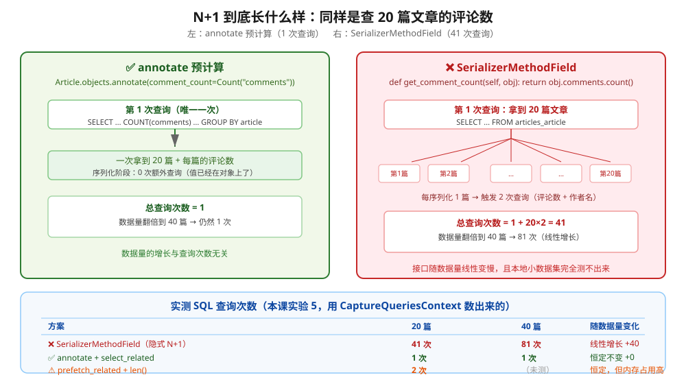
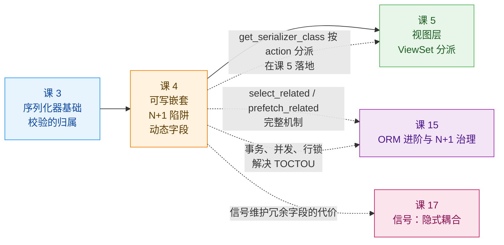
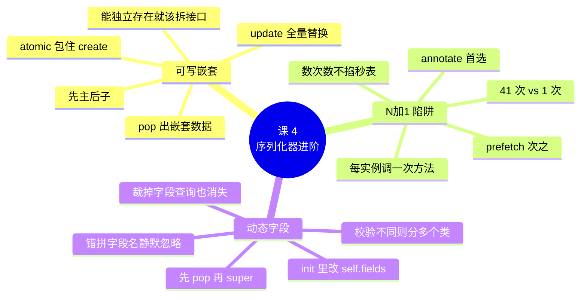

# 课 4　序列化器进阶：可写嵌套与动态字段

> 📖 情节定位：**立规矩（二）** —— 教材只教只读嵌套，真实项目要的是能写回去
> 🎯 本课目标：能正确实现可写嵌套 serializer，避开 SerializerMethodField 的性能陷阱，按场景裁剪字段

---

## 第一幕 · 场景引入

公司要把老博客系统的历史文章迁到新平台。老系统里，**一篇文章连同它下面的评论是一份完整数据**。运营给的需求很直接：

> "一个请求，把一篇文章和它的历史评论一起导进来。"

你按课 3 的知识写了嵌套序列化器，信心满满地跑：

```python
class ArticleImportSerializer(serializers.ModelSerializer):
    comments = CommentSerializer(many=True)     # 嵌套，能写

    class Meta:
        model = Article
        fields = ["id", "title", "slug", "body", "author", "tags", "comments"]
```

```python
serializer = ArticleImportSerializer(data=payload)
serializer.is_valid()          # True  ✅
serializer.save()              # 💥 AssertionError
```

课 3 结尾那个 `AssertionError`，现在轮到你了。

**本课要收拾三件事**，它们都是"能跑通"和"能上线"之间的距离：

| 问题 | 卡在哪 |
|------|--------|
| 嵌套怎么才能写进去 | `create()` / `update()` 要自己写，还要保证原子性 |
| 接口为什么莫名其妙变慢 | `SerializerMethodField` 是隐式 N+1 的头号来源 |
| 为什么要为每个场景写一个 serializer | 字段裁剪有两种做法，各有边界 |

> 💡 这三个问题的共同点是：**它们在本地小数据集上全都测不出来。** 嵌套写入在小数据量下不会暴露原子性问题，N+1 在 3 条数据时毫无感觉，字段冗余在小团队里没人抱怨——**等上线才发现，代价已经付过了。**

---

## 第二幕 · 认知冲突

### 困惑一：不就是"先建父再建子"吗，DRF 为什么不肯帮我写？

第一反应通常是抱怨："这么明显的套路，框架为什么不内置？"

DRF 官方给出了理由（课 3 引用过，这里再看一遍完整版）：

> "Because the behavior of nested creates and updates can be **ambiguous**, and may require complex dependencies between related models, REST framework 3 **requires you to always write these methods explicitly**. The default `ModelSerializer` `.create()` and `.update()` methods do not include support for writable nested representations."
> —— [DRF - Writable nested representations](https://www.django-rest-framework.org/api-guide/serializers/#writable-nested-representations)

关键词是 **ambiguous（有歧义）**。把"歧义"拆开，至少有四个问题没有标准答案：

| 问题 | 可能的答案 |
|------|-----------|
| **顺序**：先建父还是先建子？ | 通常先父（子要拿父的主键），但某些业务要求先子 |
| **失败**：子对象建到一半失败了怎么办？ | 全部回滚？保留已成功的？返回部分成功？ |
| **归属**：子对象的作者用请求里的 `author`，还是用当前登录用户？ | 两种情况都合理 |
| **更新**：PUT 上来的子对象列表，是"全量替换"还是"增量合并"？ | 删掉没提到的？还是只更新提到的？ |

**框架替你选任何一个，都会有一半人不满意。** 所以 DRF 把选择权交还给你——代价是这个 `AssertionError` 得你自己填。

### 困惑二：我就多加了个"评论数"，接口怎么就慢了？

这个坑的阴险之处在于**它的隐蔽性**。

产品要列表页显示评论数，你加了一行：

```python
comment_count = serializers.SerializerMethodField()

def get_comment_count(self, obj):
    return obj.comments.count()
```

本地测试：3 篇文章，秒开。✅
提测：50 条测试数据，没问题。✅
上线：2000 篇文章，列表接口 **3 秒**。❌

你开始怀疑数据库、怀疑索引、怀疑网络——**但没有一条慢查询日志**，因为每一次查询都很快。慢的是**查询次数**：2000 篇文章 = 2001 次查询。

> 🚨 **N+1 在本地小数据集上完全测不出来**，这是它成为"上线才爆发"类问题的根本原因。第四幕实验 5 会把它数给你看。

### 困惑三：列表要 4 个字段、详情要 15 个，我要写两个 serializer 吗？

列表页只需要 `id / title / status / created_at`；详情页要全部字段，外加评论数。

朴素做法是写两个类——**但它会失控**：

- 移动端还要第三个变种（更少的字段）
- 内部运营后台要第四个（多出审核字段）
- 每个变种都要同步维护，改一个字段要改四处

于是你开始想：能不能**一个类，按场景裁剪字段**？

答案是能，但**它不是唯一的正确答案**——什么时候该裁剪、什么时候该分多个类，本课知识点 3 会给判据。

---

## 第三幕 · 层层揭示

### 知识点 1：可写嵌套 serializer

#### 一句话定义

**可写嵌套** = 在 serializer 里嵌一个子序列化器，并**手写 `create()` / `update()`**，让一次请求能同时创建/更新主对象与它的关联对象。

#### 直觉建立：整箱托运 vs 分件邮寄

你要搬家，有两种寄法：

- **分件邮寄（拆接口）**：每件家具单独打包、单独下单、单独追踪。丢了一件，只补那一件。但你要下 20 个单。
- **整箱托运（可写嵌套）**：所有东西装一个集装箱，一次下单、一次送达。**但箱子中途出问题，整箱退回来。**

**关键区别在于"失败时的语义"**：

- 分件邮寄 → **部分成功是可接受的**（19 件到了，1 件在路上）
- 整箱托运 → **要么全到，要么全不到**（这是它存在的意义）

> ⚠️ **类比失效的边界**：真实的集装箱不会"一半到一半没到"；但数据库里，如果你不加事务，**"整箱托运"会退化成"分批送达，中途停"**——最糟的组合：你以为要么全成功要么全失败，实际留下半截数据。这正是实验 3 要演示的。

#### 核心原理一：`create()` 的四步套路

```python
class ArticleNestedSerializer(serializers.ModelSerializer):
    comments = CommentSerializer(many=True, required=False)
    tags = serializers.PrimaryKeyRelatedField(queryset=Tag.objects.all(), many=True, required=False)

    class Meta:
        model = Article
        fields = ["id", "title", "slug", "body", "status", "author", "tags", "comments"]
        read_only_fields = ["id"]

    @transaction.atomic                      # ④ 包事务
    def create(self, validated_data):
        # ① 先把嵌套数据 pop 出来 —— 剩下的才是主模型能直接吃的字段
        comments_data = validated_data.pop("comments", [])
        tags_data = validated_data.pop("tags", [])

        # ② 建主对象
        article = Article.objects.create(**validated_data)

        # ③ 处理多对多（必须在主对象拿到主键之后）
        if tags_data:
            article.tags.set(tags_data)

        # ④ 建子对象
        for comment_data in comments_data:
            Comment.objects.create(article=article, **comment_data)

        return article
```

**四步拆解：**

| 步骤 | 为什么要这样 |
|------|-------------|
| **① `pop` 出嵌套数据** | `validated_data` 里的 `comments` 是一个 `dict` 列表，`Article.objects.create(**validated_data)` 消化不了它。忘了 pop 会抛：<br>`TypeError: Direct assignment to the reverse side of a related set is prohibited. Use comments.set() instead.`（实验 7A 实测） |
| **② 先建主对象** | 子对象需要主对象的主键做外键 |
| **③ M2M 单独处理** | `tags` 是多对多，必须在主对象有主键后才能 `.set()` |
| **④ 包 `@transaction.atomic`** | 保证第 ②③④ 步要么全成功、要么全回滚 |

#### 核心原理二：原子性 —— 不包事务会留下什么

**这是本知识点最容易被跳过、后果最严重的一步。**

第四幕实验 3 的实测（提交一篇文章 + 两条同一作者的评论，第二条撞上数据库唯一约束）：

```text
【A】不带 @transaction.atomic：
    save() 抛出 IntegrityError: UNIQUE constraint failed: articles_comment.article_id, artic…
    文章数 1 → 2（新增 1）
    评论数 2 → 3（新增 1）
    -> 🚨 脏数据：文章留下了，第一条评论也留下了

【B】带 @transaction.atomic：
    save() 抛出 IntegrityError: UNIQUE constraint failed: articles_comment.article_id, artic…
    文章数 2 → 2（新增 0）
    评论数 3 → 3（新增 0）
    -> ✅ 全部回滚，没留下任何脏数据
```

**同样的代码，只差一个装饰器，结果一个是脏数据一个是干净的。**

> ⚠️ **`@transaction.atomic` 只保证数据库层面的原子性。** 如果 `create()` 里调了外部服务（发短信、扣款、推消息），**事务回滚不会撤销那些副作用**。涉及外部副作用的可写嵌套，要额外设计补偿机制——这是分布式事务的话题，超出了本课范围，但你**必须知道这个边界存在**。

**怎么选择原子性边界？**

| 场景 | 建议 |
|------|------|
| 主子对象是强整体（订单 + 订单项） | `@transaction.atomic` 包住整个 `create()` |
| 子对象创建很慢（要调外部 API） | 考虑拆接口 + 最终一致，别把外部调用拖进事务 |
| 允许部分成功（批量导入，失败的记录下来重试） | 不包事务，**逐条 try/except 并收集错误** |

#### 核心原理三：`update()` 的三种子对象策略

`update()` 比 `create()` 难，因为要处理"子对象的增删改"。

```python
@transaction.atomic
def update(self, instance, validated_data):
    comments_data = validated_data.pop("comments", None)   # ← 注意是 None 不是 []

    # ① 更新主对象
    for attr, value in validated_data.items():
        setattr(instance, attr, value)
    instance.save()

    # ② None 表示"这次请求没带这个字段"，不要动子对象
    if comments_data is not None:
        # ③ 全量替换
        instance.comments.all().delete()
        for comment_data in comments_data:
            Comment.objects.create(article=instance, **comment_data)

    return instance
```

**三种策略的取舍：**

| 策略 | 做法 | 优点 | 缺点 | 适用 |
|------|------|------|------|------|
| **全量替换** | 先删光再重建 | 实现简单、语义清晰 | 子对象主键会变；重建成本高 | 子对象少且无外部引用 |
| **增量合并** | 按 `id` 有则改、无则建、缺则删 | 保留主键、变更最小 | 实现复杂（要处理三种情况） | 子对象有外部引用（如文件、外键） |
| **只增不删** | 只创建新的，不管老 | 最简单 | 老数据删不掉 | 只追加的场景（如操作日志） |

> 💡 **默认推荐全量替换**。增量合并虽然"更正确"，但代码量是前者的三倍，而且要小心处理"部分失败"。**先做对，再做优。**

⚠️ **一个必踩的坑**（实验 4 实测）：

```text
  对照：请求里「不带 comments」字段时会怎样？
  is_valid() = False  errors = {'comments': [ErrorDetail(string='该字段是必填项。', code='required')]}
  -> comments 是必填的（many=True 默认 required=True），不带就校验失败
     想让它可选，要写 comments = CommentSerializer(many=True, required=False)
```

`many=True` 的嵌套字段**默认是必填的**。这意味着客户端每次 `PATCH` 都必须把完整子对象列表带回来，否则校验失败。想要"不带就不动"，必须显式写 `required=False`，并在 `update()` 里用 `is None` 判断。

#### 核心原理四：什么时候**不该**做嵌套（本课最重要的判断）

阶段概览里那句"**教材只讲只读嵌套，真实项目卡在这里**"，卡的不只是"怎么写"，更是"**该不该写**"。

**一条主判据**：

> **子对象能脱离父对象独立存在吗？**
> 能独立存在 → **拆接口**。
> 不能独立存在 → **嵌套**。

展开成决策表：

| 判断项 | 适合嵌套 | 适合拆接口 |
|--------|---------|-----------|
| **能否独立存在** | ❌ 不能（订单项离开订单没意义） | ✅ 能（评论、标签、附件都能独立存在） |
| **子对象数量** | 少且固定（1–5 个） | 可能很多（几十上百） |
| **是否需要单独增删改** | ❌ 不需要 | ✅ 需要（删掉某一条评论） |
| **事务要求** | 强一致（要么全成功） | 可最终一致 |
| **失败时期望** | 整体失败可接受 | 希望部分成功 |
| **前端交互** | 一个表单一次提交 | 分步操作、可增量保存 |

**典型结论：**

| 案例 | 结论 | 理由 |
|------|------|------|
| 订单 + 订单项 | ✅ **嵌套** | 订单项不能脱离订单存在，且必须同生共死 |
| 问卷 + 题目 | ✅ **嵌套** | 题目是问卷的组成部分 |
| 文章 + **评论** | ❌ **拆接口** | 评论能独立存在，且用户要单独发/删一条评论 |
| 文章 + **标签** | ❌ **拆接口**（或用 M2M 主键数组） | 标签是共享资源，不该随文章创建而创建 |
| 用户 + 个人资料 | ✅ **嵌套**（或用平铺字段） | 一对一且同生共死 |

> 🚨 **诚实的坦白**：本课实验里用的 **文章 + 评论** 模型，按上面这条判据**其实应该拆接口**。我坚持用它演示，是因为它能完整展示 `create()` 的四步套路——但你要清楚：**演示归演示，真实项目里这里应该拆成 `POST /api/articles/` 和 `POST /api/articles/{id}/comments/` 两个接口。**
>
> 把这条记住，比记住怎么写 `create()` 更值钱。

#### 常见误区

- ❌ **忘了 `pop` 出嵌套数据** —— 抛 `TypeError: Direct assignment to the reverse side of a related set is prohibited. Use comments.set() instead.`（实验 7A 实测）
- ❌ **声明了嵌套字段却没写进 `Meta.fields`** —— 抛 `AssertionError: The field 'comments' was declared on serializer X, but has not been included in the 'fields' option.`（实验 7A-2 实测）
- ❌ **"加了 `@transaction.atomic` 就绝对安全了"** —— 它只管数据库。外部副作用（短信、扣款）不会被撤销。
- ❌ **"嵌套字段默认可选"** —— `many=True` 默认 `required=True`，`PATCH` 不带就校验失败。
- ❌ **"能嵌套就嵌套"** —— 子对象能独立存在时，拆接口更好维护。
- ❌ **`update()` 里全量替换却没包事务** —— 删完老的、建新的失败 → **老的没了，新的也没有**，数据直接丢失。

#### 一句话记住

> **先 pop 出嵌套数据，再建主对象；用 `@transaction.atomic` 包住整个 `create()`；子对象能独立存在就该拆接口。**

---

### 知识点 2：SerializerMethodField 的性能陷阱

#### 一句话定义

**SerializerMethodField 的 N+1** = 它对**每一个**被序列化的实例都调用一次 `get_xxx()` 方法，方法里若访问数据库，就会从"1 次查询"膨胀成"1 + N 次查询"。

#### 直觉建立：超市结账

你在超市买了 20 件商品。收银台有两种工作方式：

- **正常方式**：收银员扫完 20 件，**一次性**从系统调出全部价格。
- **荒谬方式**：每扫一件，**跑一趟仓库**问一次价格。

`SerializerMethodField` 里写 `obj.comments.count()`，就是第二种——**每序列化一篇文章，跑一趟数据库**。

**为什么"荒谬方式"还能混过去？** 因为 **1 件商品时，两种方式用的时间一样**。你本地测 3 条数据，完全看不出区别。等数据量涨到 2000，第二种方式就要跑 2000 趟仓库。

> ⚠️ **类比失效的边界**：真实超市的收银员不会这么蠢，会立刻被发现。而代码里的 N+1 **没有任何报错、没有慢查询日志**——每一次单独看都很快，**只有把次数加起来才是灾难**。这就是为什么它能一路混到生产。

#### 核心原理：N+1 长什么样



**数字是实测出来的**（实验 5，用 Django 的 `CaptureQueriesContext` 数 SQL）：

| 方案 | 20 篇 | 40 篇 | 随数据量 |
|------|-------|-------|---------|
| ❌ `SerializerMethodField` | **41 次** | **81 次** | 线性增长 |
| ✅ `annotate` + `select_related` | **1 次** | **1 次** | 恒定 |
| ⚠️ `prefetch_related` + `len()` | 2 次 | — | 恒定，但内存占用高 |

> 📌 **事实核查说明（核查于 2026-09）**：DRF 官方文档在 **`SerializerMethodField` 章节里没有任何性能警告**——它只说 "This is a read-only field"。**N+1 的警告写在 `source` 参数的章节**：
> > "**Beware of possible n+1 problems when using source attribute if you are accessing a relational orm model.**"
>
> 也就是说：**`source="author.username"` 的 N+1 是文档明示的（课 3 提过），而 `SerializerMethodField` 的 N+1 文档没提**，属于社区经验 + 本课实测。别指望框架提醒你。

#### 三种替代方案与取舍

**方案 A：`annotate` 预计算（首选）**

```python
# serializer：值由 queryset 提供，方法不再查库
class ArticleAnnotatedSerializer(serializers.ModelSerializer):
    comment_count = serializers.IntegerField(read_only=True)
    author_name = serializers.CharField(source="author.username", read_only=True)

    class Meta:
        model = Article
        fields = ["id", "title", "comment_count", "author_name"]


# 视图：queryset 里一次性算好
queryset = Article.objects.annotate(
    comment_count=Count("comments")
).select_related("author")
```

**方案 B：`prefetch_related` + Python 计数**

```python
class ArticleCachedCountSerializer(serializers.ModelSerializer):
    comment_count = serializers.SerializerMethodField()

    def get_comment_count(self, obj) -> int:
        return len(obj.comments.all())    # 已预取，不再触发查询
```

```python
queryset = Article.objects.prefetch_related("comments")
```

**方案 C：冗余字段（反范式化）**

在 `Article` 上加一个 `comment_count = PositiveIntegerField(default=0)`，用信号或显式调用维护它。查询零成本，但要承担**数据不一致**的风险（课 17 会讲为什么信号不是好主意）。

**三者对比：**

| | `annotate` | `prefetch_related` | 冗余字段 |
|---|---|---|---|
| 查询次数 | **1** | 2 | 1（无 JOIN） |
| 实时性 | ✅ 实时 | ✅ 实时 | ❌ 可能过期 |
| 内存占用 | 低 | **高**（要把子对象全载入内存） | 低 |
| 维护成本 | 低 | 低 | **高**（要保证同步） |
| 适用 | **计数、聚合、简单跨表取值** | 需要子对象完整内容时 | 读远多于写、且能容忍短暂不一致 |

#### 什么时候`SerializerMethodField` 可以用

它不是禁药，是**需要看场合的药**：

| 场景 | 能用吗 | 说明 |
|------|--------|------|
| 详情接口（只序列化 1 个对象） | ✅ **可以** | N+1 里的 N = 1，无所谓 |
| 方法里只做纯计算（不查库） | ✅ **可以** | 如格式化时间、拼接字符串、读已在内存的属性 |
| 方法读的是 `select_related` 预取过的字段 | ✅ **可以** | 查询已经发生过了 |
| **列表接口** + 方法里查库 | ❌ **绝对不行** | 这就是 N+1 |
| 方法里调用外部 API / RPC | ❌ **绝对不行** | 比查库还慢 |

> 💡 **一条自查规则**：写完 `SerializerMethodField` 后问自己一句——**"这个 serializer 会被 `many=True` 用吗？方法里碰数据库了吗？"** 两个都答"是"，就改 `annotate`。

#### 怎么自检（必查项 #11：关键结论要有可验证手段）

```python
from django.db import connection
from django.test.utils import CaptureQueriesContext

with CaptureQueriesContext(connection) as ctx:
    data = ArticleWithCountSerializer(queryset, many=True).data
print(f"SQL 查询次数：{len(ctx.captured_queries)}")
```

⚠️ **`CaptureQueriesContext` 依赖 `settings.DEBUG = True`**，否则 `connection.queries` 是空的，你会测出"0 次查询"的假象——然后得出"根本没有 N+1"的错误结论。

> 🔗 **伏笔**：`select_related` / `prefetch_related` 的完整机制与选型，在**课 15《ORM 进阶与 N+1 治理》**展开。本课先把"症状"和"替代方向"立住。

#### 常见误区

- ❌ **"本地测过没问题"** —— N+1 在小数据集上**必然测不出来**。要用 `CaptureQueriesContext` 数次数，不是掐秒表。
- ❌ **"我方法里就一行 `obj.comments.count()`，能有多慢"** —— 一次很快，2000 次就是 2000 次网络往返。
- ❌ **"用 `prefetch_related` 就万事大吉"** —— 它把所有子对象载入内存。子对象很大时（如正文、图片），内存可能爆。
- ❌ **"`select_related` 能优化 `count()`"** —— 不能。`select_related` 只解决**前向外键**的 N+1；反向关系（一对多）要用 `prefetch_related` 或 `annotate` + `Count`。
- ❌ **用 `DEBUG=False` 测查询次数** —— 测出来是 0，假象。

#### 一句话记住

> **`SerializerMethodField` 里碰数据库 + `many=True` = N+1。能 `annotate` 就 `annotate`，数查询次数而不是掐秒表。**

---

### 知识点 3：按场景动态裁剪字段

#### 一句话定义

**动态裁剪字段** = 在 serializer 实例化时（`__init__`）根据参数修改 `self.fields`，让同一个类服务不同场景；与之相对的做法是**按场景分多个 serializer 类**。

#### 直觉建立：同一份简历投不同岗位

你有一份完整简历：教育、工作、项目、技能、获奖、兴趣。

- 投后端岗 → 突出项目与技能，砍掉兴趣
- 投管理岗 → 突出工作经历，砍掉技术细节
- 投校招 → 突出教育，砍掉工作

**简历内容是一份（一个模型），呈现形态有三种。**

两种做法：
- **多份简历**：写 3 份，各自维护 → 改一次经历要改 3 处
- **一份母版 + 裁剪**：一份模板，投的时候裁掉不需要的段落 → 一处改，处处生效

> ⚠️ **类比失效的边界**：简历裁掉一段，那段内容你就忘了。而 serializer 裁掉的字段**连查询都不会发生**——实测：裁掉 `comment_count` 后，2 次查询变成 0 次。这是裁剪方案的一个**额外收益**。

#### 核心原理一：`__init__` 里改 `self.fields`

这个模式是**官方文档给出的**，不是民间偏方。DRF 文档原文：

> "Once a serializer has been initialized, the dictionary of fields that are set on the serializer may be accessed using the `.fields` attribute. Accessing and modifying this attribute allows you to dynamically modify the serializer."
> —— [DRF - Dynamically modifying fields](https://www.django-rest-framework.org/api-guide/serializers/#dynamically-modifying-fields)

```python
class ArticleDynamicSerializer(serializers.ModelSerializer):
    comment_count = serializers.SerializerMethodField()

    class Meta:
        model = Article
        fields = ["id", "title", "slug", "body", "status", "author", "created_at", "comment_count"]

    def __init__(self, *args, **kwargs):
        # ① 先把自定义参数取出来，**不能**传给父类
        fields = kwargs.pop("fields", None)
        # ② 再正常初始化
        super().__init__(*args, **kwargs)
        # ③ 最后裁剪
        if fields is not None:
            allowed = set(fields)
            existing = set(self.fields)
            for field_name in existing - allowed:
                self.fields.pop(field_name)

    def get_comment_count(self, obj):
        return obj.comments.count()
```

用法：

```python
ArticleDynamicSerializer(qs, many=True, fields=("id", "title"))
```

**三步里，第 ① 步是硬的，第 ②③ 步的顺序有弹性——但别用弹性。**

| 步骤 | 错了会怎样 |
|------|-----------|
| ① 先 `kwargs.pop("fields")` | **必做**。不 pop → 父类收到未知关键字参数，抛 `TypeError: Field.__init__() got an unexpected keyword argument 'fields'`（实验 7B 实测） |
| ② 再 `super().__init__()` | 官方写法。**实测：颠倒顺序在简单场景下也不报错、结果相同**（实验 7C），因为 `self.fields` 是个 `cached_property`，首次访问就触发生成 |
| ③ 最后裁剪 | — |

> ⚠️ **既然颠倒也不报错，为什么还要求写在 `super()` 之后？**
> 因为 `super().__init__()` 之前，`self.instance` 和 `self.context` **还没有被设置**。你的裁剪逻辑一旦依赖它们（比如"根据 `self.context['request'].user` 决定裁掉哪些字段"），就会拿到不完整的状态——**这类 bug 是间歇性的，极难排查**。
> 实验 7C 里两种顺序结果相同，只是因为那个例子没用到 `instance`/`context`。**照官方写法写，不要去试探边界。**

实测输出（实验 6）：

```text
    fields=('id', 'title')
      → ['id', 'title']
    fields=('id', 'title', 'status')
      → ['id', 'title', 'status']
    fields=None（不过滤，全部字段）
      → ['id', 'title', 'slug', 'body', 'status', 'author', 'created_at', 'comment_count']
```

**额外收益**（实验 6B 实测）：

```text
    含 comment_count : 2 次查询（每篇一次 count）
    裁掉 comment_count: 0 次查询
    -> 少了 2 次
```

裁掉的字段**连方法都不会被调用**，N+1 自然消失。

> ⚠️ **一个实测发现的坑**（实验 6C）：**传了不存在的字段名不会报错**。
> ```text
>   【C】传了不存在的字段名会怎样？
>     未报错 → ['id']
> ```
> 传 `fields=("id", "no_such_field")` 得到的输出只有 `['id']`——错拼的字段名被**静默忽略**。官方文档对此**没有任何说明**。前端如果用这个机制做"字段选择"，拼错了只会拿到空字段，不会有任何提示。

#### 核心原理二：按 action 分派 serializer

视图层更常见的做法，是在 ViewSet 里按动作返回不同的 serializer 类：

```python
class ArticleViewSet(viewsets.ModelViewSet):
    queryset = Article.objects.all()

    def get_serializer_class(self):
        # 按 action 分派
        if self.action == "list":
            return ArticleListSerializer
        if self.action == "retrieve":
            return ArticleDetailSerializer
        return ArticleDetailSerializer
```

（ViewSet 与 action 的完整机制在**课 5《视图层》**，这里先看分派思想。）

#### 核心原理三：两种做法怎么选

| | 动态裁剪（一个母版类） | 多个 serializer 类 |
|---|---|---|
| **字段差异** | 只是"多少"的差异 | **结构**不同（详情页要嵌套、列表页不要） |
| **校验差异** | 无 | **有**（创建时要校验 A，更新时校验 B） |
| **可读性** | ❌ 一个方法要满足所有场景，`__init__` 里的裁剪逻辑不直观 | ✅ 每个类职责单一，一眼看明白 |
| **OpenAPI 文档** | ❌ **文档生成困难**（字段随运行时变化，静态分析不出来） | ✅ 每个类有确定的字段集，文档准确 |
| **维护** | ✅ 一处改处处生效 | ❌ 改一个字段要同步多个类 |
| **适用** | 纯展示差异、字段是子集关系 | 校验/结构有实质差异 |

**判断口诀**：

> **只是字段多少不一样 → 裁剪。**
> **校验逻辑或字段结构不一样 → 分多个类。**

> 🔗 **伏笔**：课 20 讲 OpenAPI 自动生成文档时会再碰到这个问题——**动态裁剪的 serializer 很难生成准确的接口文档**，因为工具是静态分析代码的。这是选择裁剪方案时最容易被忽略的代价。

#### 字段级权限该放哪

裁剪字段常被用来做"不同角色看到不同字段"。**要注意位置**：

```python
# ⚠️ 不推荐：在 __init__ 里根据 request.user 裁剪
def __init__(self, *args, **kwargs):
    user = kwargs.pop("user", None)
    super().__init__(*args, **kwargs)
    if user and not user.is_staff:
        self.fields.pop("internal_note", None)
```

**问题**：序列化器的职责是"定义数据形状"，掺进权限判断后它会同时耦合两件事，而且**裁剪逻辑散落在 `__init__` 里很难测试**。

**更好的位置**：

| 方案 | 做法 | 适用 |
|------|------|------|
| **视图层选 serializer** | `get_serializer_class()` 里按 `request.user` 返回不同类 | ✅ 首选，逻辑集中且可测 |
| **queryset 层隔离数据** | 不同角色查不同 queryset | 行级权限（课 9） |
| serializer 内裁剪 | `__init__` 里判断 | 仅当字段差异极多、拆类会爆炸时 |

#### 常见误区

- ❌ **忘了 `kwargs.pop()` 就把自定义参数传给父类** → `TypeError`。
- ❌ **在 `super().__init__()` 之前裁剪** → `self.fields` 还不存在。
- ❌ **以为裁剪字段只影响输出** → 它也影响**输入**：裁掉的字段在反序列化时不存在，传进来会被忽略，且**校验也不会执行**。
- ❌ **以为传错字段名会报错** → 静默忽略（实测）。
- ❌ **用动态裁剪做权限控制** → 逻辑散落、难测试、文档生成困难。优先放视图层。

#### 一句话记住

> **只是字段多少不同 → `__init__` 里裁剪 `self.fields`；校验或结构不同 → 分多个 serializer 类。**

---

## 第四幕 · 实操验证

### 验证环境

| 项 | 值 |
|---|---|
| 环境 | **Windows 11 + WorkBuddy 托管 Python 3.13.14** |
| 依赖 | Django **6.1**、djangorestframework **3.18.0** |
| 数据库 | SQLite 内存库（每次运行都是干净状态） |
| 复用环境 | `C:\Users\v_wypgwu\.workbuddy\binaries\python\envs\dj-course` |
| 关键设置 | **`DEBUG = True`（N+1 实验必需）** |
| 实测日期 | 2026-09-02 |

> ⚠️ 与课 2/3 相同：`wsl.exe` 被本机安全策略拦截，继续使用托管 Python 环境。**所有输出均为真实执行结果。**

**一键复现：**

```bash
python run_lab.py
```

> 💡 **注意 `DEBUG = True`**：`CaptureQueriesContext` 依赖它记录 SQL。设成 `False` 会测出"0 次查询"的假象，让你误以为没有 N+1。

---

### 实验 1：可写嵌套 —— 不手写 `create()` 会怎样（回顾课 3）

```text
  is_valid() = True
  save() 抛出 AssertionError
  原文: The `.create()` method does not support writable nested fields by default.
```

**回扣课 3**：`is_valid()` 是 `True`，**报错在 `save()` 阶段**。所以 `if serializer.is_valid(): serializer.save()` 这个写法会让异常直接冒泡成 500。

---

### 实验 2：手写 `create()` —— 建文章同时建标签与评论

```text
  is_valid() = True  errors = {}
  创建成功：Article id=1, 标签数=2, 评论数=2
  评论作者：['bob', 'alice']
```

**回扣知识点 1 核心原理一**：四步套路（pop → 建主 → 关联 M2M → 建子）一次跑通。

---

### 实验 3：原子性 —— 建到一半失败，前面建的会不会留下？

```text
  场景：一篇文章 + 两条「同一作者」的评论（违反 uniq_comment_per_author_per_article 约束）
        第二条评论会在 create() 阶段撞上 IntegrityError

  【A】不带 @transaction.atomic：
    save() 抛出 IntegrityError: UNIQUE constraint failed: articles_comment.article_id, artic…
    文章数 1 → 2（新增 1）
    评论数 2 → 3（新增 1）
    -> 🚨 脏数据：文章留下了，第一条评论也留下了

  【B】带 @transaction.atomic：
    save() 抛出 IntegrityError: UNIQUE constraint failed: articles_comment.article_id, artic…
    文章数 2 → 2（新增 0）
    评论数 3 → 3（新增 0）
    -> ✅ 全部回滚，没留下任何脏数据

  ⚠️ 重要：@transaction.atomic 只保证「数据库层面」的原子性。
     如果 create() 里调了外部服务（发短信、扣款），事务回滚不会撤销那些副作用。
```

**这是本课最重要的一组对照。** 同样的业务逻辑，只差一个装饰器：

| | 无 atomic | 有 atomic |
|---|---|---|
| 文章 | **留下了**（+1） | 回滚（+0） |
| 第一条评论 | **留下了**（+1） | 回滚（+0） |
| 最终结果 | 一篇没有完整评论的"半成品"文章 | 干净，像什么都没发生过 |

**回扣第二幕的困惑一**：这就是 DRF 说的"ambiguous"——**失败了该保留还是该回滚，框架不敢替你选**。

> 🔍 **自检手段**：写任何可写嵌套时，故意让**第二个**子对象失败一次，然后查数据库看第一个有没有留下。留下来了 → 你漏了事务。

---

### 实验 4：可写嵌套的 `update()`

```text
  更新前：title='可写嵌套演示', 评论数=2
  is_valid() = True  errors = {}
  更新后：title='改过的标题', 评论数=1
  评论内容：['全新替换后的唯一评论']
  -> 全量替换策略：老的两条评论被删除，新建了一条

  对照：请求里「不带 comments」字段时会怎样？
  is_valid() = False  errors = {'comments': [ErrorDetail(string='该字段是必填项。', code='required')]}
  -> comments 是必填的（many=True 默认 required=True），不带就校验失败
     想让它可选，要写 comments = CommentSerializer(many=True, required=False)
```

**回扣知识点 1 核心原理三**：

| 观察 | 结论 |
|------|------|
| 老的 2 条评论被删、新的 1 条被建 | 全量替换策略生效。**注意：新评论的主键与老的无关**，如果有别的表外键引用了老评论，会出问题 |
| 不带 `comments` → 校验失败 | `many=True` 默认 `required=True`。这是 `PATCH` 场景的高频坑 |

---

### 实验 5：SerializerMethodField 的 N+1 —— 数一数到底查了几次库

```text
  数据集：20 篇文章，每篇 2 条评论

  【A】SerializerMethodField（comments.count() + author.username）
      SQL 查询次数 = 41
      输出示例 = {'id': 3, 'title': '文章0', 'comment_count': 2, 'author_name': 'alice'}

  【B】annotate + select_related
      SQL 查询次数 = 1
      输出示例 = {'id': 3, 'title': '文章0', 'comment_count': 2, 'author_name': 'alice'}

  【C】prefetch_related + len()
      SQL 查询次数 = 2
      输出示例 = {'id': 3, 'title': '文章0', 'comment_count': 2}

  方案                                           查询次数
  ----------------------------------------------------
  A. SerializerMethodField（N+1）                  41
  B. annotate + select_related                    1
  C. prefetch_related + len()                     2

  A 比 B 多了 40 次查询（约 41.0 倍）

  再看看数据量翻倍会怎样（N=40）：
    N=20 → A=41 次, B=1 次
    N=40 → A=81 次, B=1 次
    -> A 随数据量线性增长（+40），B 几乎不变（+0）
```

**逐条回扣：**

| 观察 | 印证了什么 |
|------|-----------|
| A = 41 次 | 1 次拿文章 + 20 篇 × 2 次（评论数 + 作者名）= 41。**这就是 N+1 里的 "N×关联数"** |
| B = 1 次 | `annotate` 把计数下推到 SQL，`select_related` 把作者 JOIN 进来，一次搞定 |
| C = 2 次 | `prefetch_related` 需要一次额外查询拿所有评论，但**避免了 20 次往返** |
| **N 翻倍时 A 从 41 → 81，B 恒为 1** | **N+1 的杀伤力随数据量线性放大**，而优化方案几乎不受影响 |

> 💡 **本实验最该记住的一句话**：**N+1 不是"慢"，是"次数多"。** 单次查询都很快，所以慢查询日志抓不到它——**只能数次数**。

---

### 实验 6：动态裁剪字段

```text
  【A】同一个 serializer，通过 fields 参数裁剪：
    fields=('id', 'title')
      → ['id', 'title']
    fields=('id', 'title', 'status')
      → ['id', 'title', 'status']
    fields=None（不过滤，全部字段）
      → ['id', 'title', 'slug', 'body', 'status', 'author', 'created_at', 'comment_count']

  【B】裁剪掉的字段根本不会被计算（N+1 也跟着消失）：
    含 comment_count : 2 次查询（每篇一次 count）
    裁掉 comment_count: 0 次查询
    -> 少了 2 次

  【C】传了不存在的字段名会怎样？
    未报错 → ['id']

  【D】另一种做法：按场景分多个 serializer 类
    ArticleListSerializer : ['id', 'title', 'status', 'created_at']
    ArticleDetailSerializer: ['id', 'title', 'slug', 'body', 'status', 'author', 'created_at', 'comment_count']
    同样 20 条数据：列表版 1 次查询，详情版 21 次查询
```

**逐条回扣：**

| 观察 | 结论 |
|------|------|
| 三种 `fields` 组合得到三种输出 | 一个母版类服务多个场景，字段是**子集关系**时很好用 |
| 裁掉 `comment_count` 后查询从 2 次降到 0 次 | 裁剪影响的不只是输出，**连方法调用和查询都跳过了** |
| 传 `no_such_field` 不报错，输出只有 `['id']` | 🚨 **错拼字段名会被静默忽略**，文档未说明 |
| 列表版 1 次 vs 详情版 21 次查询 | 分多个类的方案同样能避开 N+1，且**每个类职责清晰** |

---

### 实验 7：把讲义里剩下的断言都跑一遍

> 📌 这一组是**评审阶段回头补的**——写正文时我下了几个"会怎样"的判断，自查发现它们没有对应实验。记录在此，作为「必查项 #23：实验要覆盖每条断言」的落实。

```text
=== 7A：create() 里忘了 pop 出嵌套数据 ===
  is_valid() = True
  TypeError: Direct assignment to the reverse side of a related set is prohibited. Use comments.set() instead.

=== 7A-2：声明了字段但没写进 Meta.fields（顺带撞到的错误）===
  AssertionError: The field 'comments' was declared on serializer DeclaredNotIncluded,
                  but has not been included in the 'fields' option.

=== 7B：__init__ 里忘了 kwargs.pop('fields') ===
  TypeError: Field.__init__() got an unexpected keyword argument 'fields'

=== 7C：在 super().__init__() 之前裁剪，生效吗？ ===
  【super() 之前裁剪】
    最终字段 = ['id', 'title', 'status']    slug 还在吗？不在
  【super() 之后裁剪（官方写法）】
    最终字段 = ['id', 'title', 'status']    slug 还在吗？不在
  Serializer.fields 是 cached_property 吗？cached_property

=== 7D：select_related 能修掉 N+1 的哪一半？ ===
  裸 queryset                 : 41 次
  加 select_related('author') : 21 次
  -> author_name 那一半被修掉了，comments.count() 那一半没被修
```

**逐条回扣：**

| 实验 | 结论 |
|------|------|
| **7A** | 忘了 `pop` 的报错比"TypeError"更具体：Django 告诉你**这是反向关系，要用 `.set()`**。看到这句就知道是嵌套数据没 pop |
| **7A-2** | 🚨 **顺手撞到的高频错误**：声明了 `comments = CommentSerializer(...)` 却没把它写进 `Meta.fields`，DRF 直接 `AssertionError`。**声明的字段必须出现在 `fields` 里** |
| **7B** | `kwargs.pop()` 是硬要求，漏了就是 `TypeError` |
| **7C** | 🚨 **推翻了我原来的断言**。我原以为"super() 之前 `self.fields` 不存在会报错"——**实测两种顺序都不报错、结果相同**。原因是 `fields` 是 `cached_property`。**但仍应写在 `super()` 之后**，因为那时 `instance`/`context` 才就绪 |
| **7D** | `select_related("author")` 把 41 次降到 21 次——**只修掉了 `author_name` 那一半**。`comments.count()` 是反向聚合，`select_related` 管不了 |

> 💡 **7D 是本课最重要的一条补充**：它说明**"加了 `select_related` 就够了"是错觉**。优化前先想清楚你的 N+1 有几个来源，每个来源要用对应的工具。

---

### 附：实验工程结构

```text
nested_lab/
├── manage.py
├── config/
│   ├── settings.py        # 单文件设置，DEBUG=True（N+1 实验必需），SQLite 内存库
│   └── urls.py
├── apps/
│   ├── users/models.py    # 自定义 User
│   └── articles/
│       ├── models.py      # Article / Tag / Comment
│       │                  # Comment 带 UniqueConstraint(article, author) —— 原子性实验的关键
│       ├── serializers.py # 本课全部序列化器变体
│       └── apps.py
└── run_lab.py             # 实验 1–6 的执行脚本（一键复现；实验 7 见上文内联代码）
```

**原子性实验的关键设计**（值得单独说）：

```python
class Comment(models.Model):
    # ...
    class Meta:
        constraints = [
            models.UniqueConstraint(
                fields=["article", "author"],
                name="uniq_comment_per_author_per_article",
            )
        ]
```

**为什么需要这条约束？** 因为要让 `create()` 在**执行阶段**（而不是校验阶段）失败，才能测出原子性。如果失败发生在 `is_valid()`，整个 `create()` 根本不会跑，事务也就无从谈起。

> 💡 **这个设计思路可以迁移**：想验证任何"部分失败"的行为，都要让失败发生在**事务内部**，而不是校验阶段。

---

## 第五幕 · 体系收束

### 本课在全局中的位置



**课 4 把课 3 的"能用"推进到"能上线"**：

| 课 3 教会你 | 课 4 补上 |
|------------|----------|
| 嵌套只读 | 嵌套可写 + 原子性 + **什么时候不该嵌套** |
| `SerializerMethodField` 怎么用 | 它的 N+1 代价与三种替代方案 |
| 显式列出字段 | 一个字段集服务多个场景的两种做法 |

**三个伏笔的去向：**

1. **`select_related` / `prefetch_related` 的完整机制** → 课 15。本课只给了"用哪个"的结论，没讲"为什么"和"怎么选"。
2. **并发与事务** → 课 15。课 3 提到的 TOCTOU（校验通过到真正写入之间数据被改）在那里正式解决。
3. **信号维护冗余字段** → 课 17。本课方案 C 提到的"用信号同步冗余字段"，到那里你会看到它的代价。

### 你现在会了什么

| 收获 | 可验证的能力 |
|------|-------------|
| 实现可写嵌套 | 能用四步套路写 `create()`，并知道每一步漏了会怎样 |
| 保证原子性 | 会用"故意让第二个子对象失败"来自检事务是否生效 |
| 判断该不该嵌套 | 能用"子对象能否独立存在"这条判据给出结论 |
| 实现嵌套 `update()` | 知道三种策略，会写全量替换，知道 `many=True` 默认必填 |
| 识别并修复 N+1 | 会用 `CaptureQueriesContext` 数查询次数，知道 `annotate` 是首选方案 |
| 按场景裁剪字段 | 会写 `__init__` 裁剪，也知道什么时候该分多个类 |
| 判断方案代价 | 知道动态裁剪会影响 OpenAPI 文档生成 |

### 一图总结



### 埋下的伏笔

本课的四颗种子：

1. **`select_related` / `prefetch_related` 到底怎么选** → 课 15 会讲清：前者用于前向外键（JOIN 一张表），后者用于反向关系和多对多（额外查一次 + Python 侧拼接）。
2. **`@transaction.atomic` 的边界** → 课 15 的"事务、并发与行锁"会讲 `select_for_update`、`ATOMIC_REQUESTS`、以及事务隔离级别。
3. **动态裁剪与 OpenAPI 文档** → 课 20 讲接口文档自动生成时，你会看到裁剪方案对文档工具的真实影响。
4. **冗余字段的同步** → 课 17 讲信号时会说明：用信号维护冗余字段是典型的"隐式耦合"，出问题时极难排查。

> ⚠️ **下一课的关键提醒**：课 5 要讲视图层（`APIView` / `GenericAPIView` / `ViewSet`）。本课实验 6D 里那个 `get_serializer_class()` 按 action 分派的写法，到课 5 会变成你的日常工具——**它也是"不要盲目用 ViewSet"这个判断的一部分**。

---

## 🐞 本课误区速查

| 误区 | 真相 |
|------|------|
| "嵌套加上 `many=True` 就能写" | 必须手写 `create()`/`update()`，否则 `save()` 抛 `AssertionError`（`is_valid()` 是 `True`） |
| "先建父再建子，不需要事务" | 不加 `@transaction.atomic`，子对象建到一半失败会**留下脏数据**（实测：文章 + 第一条评论都留下了） |
| "加了事务就绝对安全" | 只保证**数据库层面**原子性。外部副作用（短信、扣款）不会被撤销 |
| "嵌套字段默认可选" | `many=True` **默认 `required=True`**，`PATCH` 不带就校验失败 |
| "能嵌套就嵌套" | **子对象能独立存在就该拆接口**（评论、标签都属于这类） |
| "本地测过没问题，没有 N+1" | N+1 在小数据集上**必然测不出来**。要数查询次数，不是掐秒表 |
| "我方法里就一行 count()，能有多慢" | 单次很快，2000 次就是 2000 次往返 |
| "用 `DEBUG=False` 测查询次数" | 测出来是 **0 次**——`CaptureQueriesContext` 依赖 `DEBUG=True` |
| "`select_related` 能优化 `comments.count()`" | 不能。它是**前向外键**工具，管不了反向聚合。实测（实验 7D）：41 → 21 次，只修掉了 `author_name` 那一半 |
| "加了 `select_related` 就不会有 N+1 了" | 错觉。要先数清 N+1 有**几个来源**，每个来源对应不同工具（实验 7D） |
| "声明了嵌套字段就自动生效" | 必须同时写进 `Meta.fields`，否则 `AssertionError`（实验 7A-2） |
| "动态裁剪只影响输出" | 也影响**输入**：裁掉的字段在反序列化时不存在，传进来被忽略，**校验也不执行** |
| "裁剪时传错字段名会报错" | **静默忽略**（实测：传 `no_such_field` 只得到 `['id']`），官方文档未说明 |
| "用动态裁剪做权限控制最好" | 逻辑散落在 `__init__`、难测试、且**影响 OpenAPI 文档生成**。优先放视图层 |
| "忘了 `kwargs.pop()` 只是小事" | 父类收到未知关键字参数，直接 `TypeError` |

---

## 📚 官方文档

| 主题 | 链接 |
|------|------|
| Writable nested representations（可写嵌套必须手写 create/update） | https://www.django-rest-framework.org/api-guide/serializers/#writable-nested-representations |
| Dynamically modifying fields（动态裁剪的官方模式） | https://www.django-rest-framework.org/api-guide/serializers/#dynamically-modifying-fields |
| SerializerMethodField | https://www.django-rest-framework.org/api-guide/fields/#serializermethodfield |
| `source` 参数（**N+1 警告在这里**） | https://www.django-rest-framework.org/api-guide/fields/#source |
| Relations（select_related / prefetch_related 建议） | https://www.django-rest-framework.org/api-guide/relations/ |
| **Django** | |
| 数据库事务（`transaction.atomic`） | https://docs.djangoproject.com/en/6.1/topics/db/transactions/ |
| 聚合（`annotate` / `Count`） | https://docs.djangoproject.com/en/6.1/topics/db/aggregation/ |
| `select_related` / `prefetch_related` | https://docs.djangoproject.com/en/6.1/ref/models/querysets/#select-related |
| `CaptureQueriesContext`（查询计数） | https://docs.djangoproject.com/en/6.1/topics/testing/tools/#django.test.utils.CaptureQueriesContext |
| 模型约束（`UniqueConstraint`） | https://docs.djangoproject.com/en/6.1/ref/models/constraints/ |

---

## 🚀 下一批接力提示词

> 学完本课后，**复制下面这段文字发给 AI**，即可无缝进入下一课（无需重新描述上下文）：

```text
继续学 Django 进阶（前后端分离）。我的学习档案在 django/00-学习档案.md，
刚学完阶段 2《DRF 核心三件套》的课 4《序列化器进阶：可写嵌套与动态字段》
（知识点：可写嵌套 serializer、SerializerMethodField 的性能陷阱、动态裁剪字段），
请按大纲继续讲解课 5《视图层：从 APIView 到 ViewSet》。
```

---

## 🧭 课程导航

**上一课**：[课 3《序列化器：API 的边界守门人》](./lesson-03-序列化器API的边界守门人.md)

**下一课**：[课 5《视图层：从 APIView 到 ViewSet》](./lesson-05-视图层从APIView到ViewSet.md)

**返回**：[阶段 2 概览](../overview.md) ｜ [课程目录](../../../02-课程目录.md)
