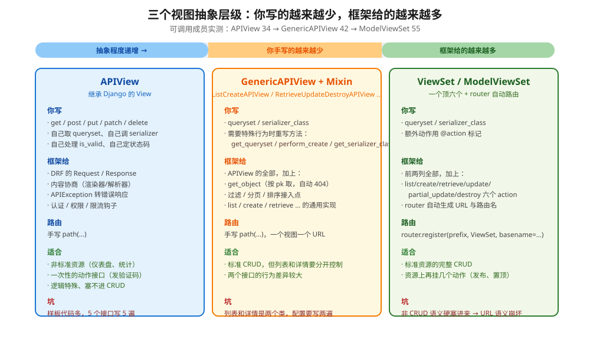
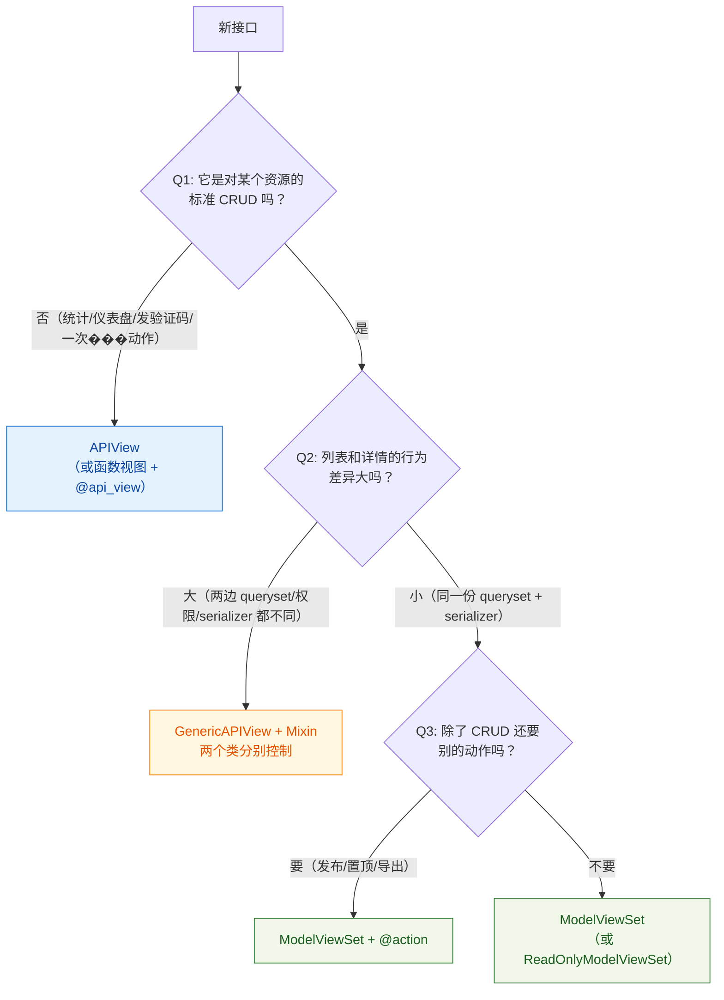
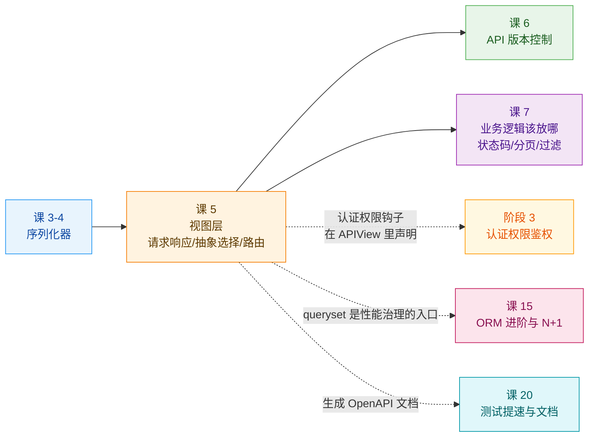
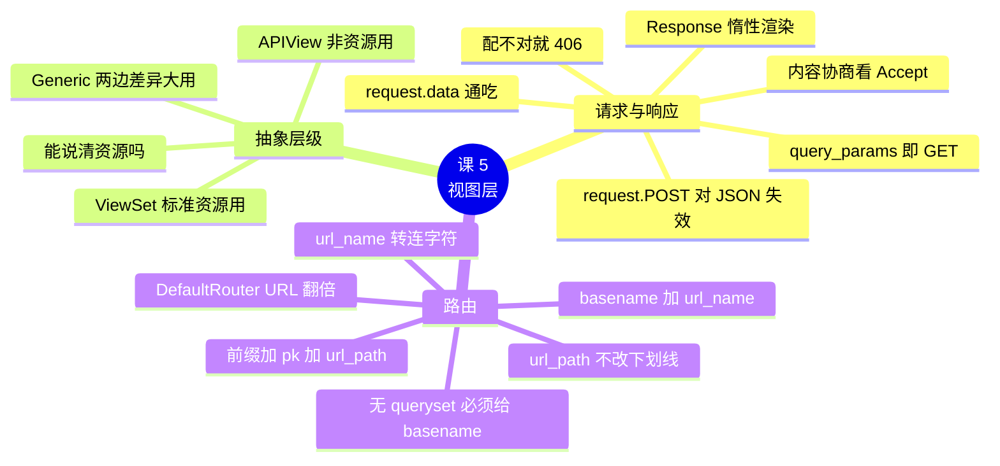

# 课 5　视图层：从 APIView 到 ViewSet

> 📖 情节定位：**立规矩（三）** —— 处理请求这件事，选对抽象层级
> 🎯 本课目标：理解 DRF 的请求响应对象，并为接口选出合适的视图抽象

---

## 第一幕 · 起源与场景引入

### 2011 年，Django 把视图从函数变成了类

2011 年 3 月 23 日，Django 1.3 发布。这份版本说明开篇列的第一个新特性是：

> "Django 1.3 adds a framework that allows you to use a class as a view. This means you can compose a view out of a collection of methods that can be subclassed and overridden..."
> —— [Django 1.3 release notes](https://docs.djangoproject.com/en/6.1/releases/1.3/)

（核查于 2026-09，来源：[Django 1.3 release notes](https://docs.djangoproject.com/en/6.1/releases/1.3/) 与 [Django 20 周年时间线](https://birthday20.djangoproject.com/timeline)，两处均记为 2011-03-23 发布）

同一份说明里还有 `staticfiles` 和 `logging`——**都是今天你还在用的东西**。把视图变成类，动机很朴素：函数视图没法被继承和局部重写，每个列表页都要把"取数据 → 序列化 → 返回"抄一遍。

十年后，DRF 在 Django 的 `View` 之上长出了自己的一套。DRF 文档开篇引了 Reinout van Rees 的一句话：

> "Django's class-based views are a welcome departure from the old-style views."
> —— [DRF - Views](https://www.django-rest-framework.org/api-guide/views/)

**本课要讲的就是这套"长出来的东西"**：DRF 的 `APIView` 到底比 Django 的 `View` 多了什么，以及它上面还有两层更高的抽象该怎么选。

### 你的场景

课 3、课 4 把序列化器收拾干净了。现在要把它接到 URL 上，写文章的增删改查。

你写了第一版：

```python
def article_list(request):
    if request.method == "GET":
        articles = Article.objects.all()
        return JsonResponse({"results": ArticleSerializer(articles, many=True).data})
    if request.method == "POST":
        data = json.loads(request.body)          # ← 为什么要我自己 loads？
        serializer = ArticleSerializer(data=data)
        if not serializer.is_valid():
            return JsonResponse(serializer.errors, status=400)
        serializer.save()
        return JsonResponse(serializer.data, status=201)
```

**能跑，但每一处都在提醒你"这里本该有人替我做"**：`json.loads`、手动判 400、手动构造 `JsonResponse`、每个接口重复一遍。

换成 DRF 的 `APIView` 之后：

```python
class ArticleList(APIView):
    def get(self, request):
        return Response(ArticleSerializer(Article.objects.all(), many=True).data)

    def post(self, request):
        serializer = ArticleSerializer(data=request.data)
        serializer.is_valid(raise_exception=True)
        serializer.save()
        return Response(serializer.data, status=status.HTTP_201_CREATED)
```

**但 `APIView` 只是第一层。** DRF 上面还有 `GenericAPIView` 和 `ViewSet`，越往上你写得越少——**代价是"能自由发挥的地方"也越少**。本课要给你的，就是一把选层级的尺子。

---

## 第二幕 · 认知冲突

### 困惑一：`request.POST` 怎么是空的？

你在 `APIView` 里写了：

```python
def post(self, request):
    title = request.POST.get("title")     # ← 拿到的是 None
```

前端明明 POST 了一个 JSON body，Django 后端却什么都读不到。

你去查文档，发现大家都在用 `request.data`。试了一下——**好了**。

但你心里有个结：**`request.data` 和 `request.POST` 到底什么关系？为什么后者对 JSON 无效？**

这个困惑的答案，藏着 DRF 与 Django 原生视图的第一道分水岭。第四幕实验 1 会用真实的请求把它测出来。

### 困惑二：我什么都没改，接口怎么突然返回 406？

同事说他调你的接口拿到了：

```json
{"detail": "无法满足Accept HTTP头的请求。"}
```

状态码 **406 Not Acceptable**。

你一脸茫然：我代码里从没写过 406，也从没判断过 `Accept` 头。

**是框架替你判断的。** DRF 有一个叫"内容协商"的机制：客户端用 `Accept` 头声明"我要什么格式"，服务端在自己配的渲染器里找，找不到就直接 406。

**这个机制的麻烦之处在于它是隐式的**——你不知道它的存在时，它报的错看起来像天书。第四幕实验 2 会把五种 `Accept` 头挨个试一遍。

### 困惑三：ViewSet 最先进，是不是都该用 ViewSet？

这是本课最贵的一个困惑。

你看了几个教程，全在用 `ModelViewSet` + `router`，五行代码搞定一整套 CRUD。你很兴奋，于是把所有接口都塞进 ViewSet——包括一个"仪表盘"接口，它返回的是：

```json
{"total": 1204, "published": 830, "draft": 374}
```

**这不是任何一种资源。** 没有主键、不能增删改、router 给它生成的 URL 也毫无意义。

阶段概览里那句话值得再念一遍：

> **"ViewSet 最先进，全都用 ViewSet" 是错的** —— 非标准资源、多动作聚合的接口，用 ViewSet 反而绕。

那到底该怎么选？知识点 2 会给决策树和一个"一条判据"的版本。

---

## 第三幕 · 层层揭示

### 知识点 1：请求响应对象与内容协商

#### 一句话定义

DRF 的 **`Request`** 是对 Django `HttpRequest` 的增强包装（多了 `request.data`、内容协商、认证），**`Response`** 是一个"还没渲染"的响应对象——**它持有 Python 数据，由框架根据客户端的 `Accept` 头决定渲染成什么格式**。

#### 直觉建立：万能转接头

出国旅行，你会带一个**万能插座转接头**：

- 墙上的插座（客户端）可能是任何形状：`application/json`、`application/x-www-form-urlencoded`、`multipart/form-data`……
- 你的电器（视图代码）只认一种输入：一个 Python `dict`。

`Request` 就是那个转接头——**它把各种形状的输入统一成 `request.data`，让你的视图代码只写一种形态。**

输出方向同理：`Response` 让你只管交出一个 Python 对象，**渲染成 JSON 还是 HTML，由客户端的 `Accept` 头说了算**。

> ⚠️ **类比失效的边界**：真实的万能转接头插上就能用，插错了顶多不通电。而 DRF 的"转接头"在遇到**自己没配的解析器**时会直接报错（415 Unsupported Media Type）；输出方向遇到没配的渲染器则报 **406**。也就是说：**形状是你能决定的（通过配置 parser/renderer），不在支持列表里就直接拒绝。**

#### 核心原理一：`APIView` 比 Django 的 `View` 多了什么

DRF 官方文档给出**四点区别**（原文引用）：

> `APIView` classes are different from regular `View` classes in the following ways:
> - Requests passed to the handler methods will be REST framework's `Request` instances, not Django's `HttpRequest` instances.
> - Handler methods may return REST framework's `Response`, instead of Django's `HttpResponse`. The view will manage **content negotiation** and setting the correct renderer on the response.
> - Any `APIException` exceptions will be caught and mediated into appropriate responses.
> - Incoming requests will be **authenticated** and appropriate permission and/or throttle checks will be run before dispatching the request to the handler method.
> —— [DRF - Views](https://www.django-rest-framework.org/api-guide/views/)

**这四点翻译成人话：**

| # | 多了什么 | 给你的好处 |
|---|---------|-----------|
| ① | `Request` 对象 | `request.data` 通吃所有 Content-Type |
| ② | `Response` + 内容协商 | 你只交出 Python 对象，格式由客户端挑 |
| ③ | `APIException` 自动转响应 | `is_valid(raise_exception=True)` 直接变 400，**不用自己判** |
| ④ | 认证 / 权限 / 限流钩子 | 声明式配置，不用在视图里写 if（课 8–9） |

#### 核心原理二：`Request` 对象

```python
def post(self, request):
    request.data            # 已解析的请求体（dict / QueryDict 兼容）
    request.query_params    # 等价于 request.GET，但名字更准确
    request.user            # 认证后的用户（课 8）
    request.auth            # 认证附加信息（如 token 对象）
    request.method          # 仍然可用（DRF Request 代理了 HttpRequest 的属性）
```

**`request.data` vs `request.POST` 的关键区别**（第四幕实验 1 实测）：

```text
【A】提交 JSON（Content-Type: application/json）：
    request.data = {'title': '来自 JSON'}
    request.POST（只有表单才有内容） = {}          ← 空！
    request.body（原始字节） = {"title": "来自 JSON"}

【B】提交表单（Content-Type: application/x-www-form-urlencoded）：
    request.data = {'title': '来自表单'}
    request.POST（只有表单才有内容） = {'title': ['来自表单']}
    request.body（原始字节） = title=%E6%9D%A5...
```

| | `request.data`（DRF） | `request.POST`（Django） |
|---|---|---|
| `application/json` | ✅ `{'title': '...'}` | ❌ `{}` **永远空** |
| `application/x-www-form-urlencoded` | ✅ `{'title': '...'}` | ✅ 有值 |
| `multipart/form-data` | ✅ 有值（文件在 `request.FILES`） | ✅ 有值 |

**原因**：Django 的 `request.POST` 只解析**表单编码**的请求体。JSON body 对 Django 来说只是一段无结构的字节——它不会去猜。DRF 则根据 `Content-Type` 头选择**解析器**，把结果放进 `request.data`。

> 🚨 **一个实测发现的坑**：`request.body` 不是总能读的，而且**规则有点绕**（实验 11）：
> ```text
>   JSON       data→body: data={'a': 1}  →   body=b'{"a": 1}'              ✅
>   JSON       body→data: body=b'{"a": 1}'  →   data={'a': 1}              ✅
>   urlencoded data→body: data=<QueryDict: {'a': ['1']}>  →  body=b'a=1'   ✅
>   multipart  data→body: data=<QueryDict: {'title': ['hi']}>  →  body=❌ RawPostDataException
>   multipart  body→data: body=b'--B\r\nContent-Dis'  →  data=<QueryDict: {'title': ['hi']}>   ✅
> ```
> | Content-Type | 顺序有关吗 | 说明 |
> |---|---|---|
> | `application/json` | ❌ 无关 | Django 把整个 body 缓存在内存里 |
> | `application/x-www-form-urlencoded` | ❌ 无关 | 同上 |
> | **`multipart/form-data`** | ✅ **有关** | **先访问 `request.data` 会把数据流读掉，之后再访问 `request.body` 就抛异常** |
>
> 异常原文：`django.http.request.RawPostDataException: You cannot access body after reading from request's data stream`
>
> 💡 结论不变但理由更精确了：**别在业务代码里依赖 `request.body`，一律用 `request.data`。** 顺便一提，这条坑是我写讲义时想当然、被实验 11 纠正的——我原以为"multipart 时一律读不到"，实际是**顺序依赖**。

#### 核心原理三：解析器与渲染器

**解析器（Parser）** 决定"怎么把请求体变成 `request.data`"：

| 解析器 | Content-Type | 说明 |
|--------|-------------|------|
| `JSONParser` | `application/json` | **JSON API 的主力** |
| `FormParser` | `application/x-www-form-urlencoded` | 传统表单 |
| `MultiPartParser` | `multipart/form-data` | **文件上传必须有它** |
| `FileUploadParser` | `*/*` | 原始文件流上传 |

**渲染器（Renderer）** 决定"怎么把 `Response` 变成字节"：

| 渲染器 | 输出 | 用途 |
|--------|------|------|
| `JSONRenderer` | `application/json` | **前后端分离项目的默认** |
| `BrowsableAPIRenderer` | `text/html` | DRF 自带的接口调试页面，**开发期极好用** |
| `AdminRenderer` | `text/html` | 后台风格的可浏览 API |
| 第三方（如 `XMLRenderer`、`CSV`） | — | 需要额外装包 |

配置：

```python
REST_FRAMEWORK = {
    "DEFAULT_RENDERER_CLASSES": [
        "rest_framework.renderers.JSONRenderer",
        "rest_framework.renderers.BrowsableAPIRenderer",   # 开发期很有用
    ],
    "DEFAULT_PARSER_CLASSES": [
        "rest_framework.parsers.JSONParser",
        "rest_framework.parsers.FormParser",
        "rest_framework.parsers.MultiPartParser",
    ],
}
```

> 💡 **生产建议**：`BrowsableAPIRenderer` 在开发期是神器（浏览器直接打开就能调接口），但**生产环境建议移除**——它会暴露接口的完整结构。用 settings 按环境区分即可（课 2 的分层骨架正好派上用场）。

#### 核心原理四：内容协商

**流程**：客户端发 `Accept` 头 → DRF 在 `DEFAULT_RENDERER_CLASSES` 里找匹配的 → 找不到就 406。

实测五种情况（实验 2）：

```text
  Accept: 'application/json'     → 200  Content-Type: application/json
  Accept: 'text/html'            → 200  Content-Type: text/html; charset=utf-8
  Accept: 'application/xml'      → 406  Content-Type: application/json
                                   响应体: {"detail":"无法满足Accept HTTP头的请求。"}
  Accept: '*/*'                  → 200  Content-Type: application/json
  Accept: None（完全不带）        → 200  Content-Type: application/json
```

**三条要记住的规则：**

1. **没有显式偏好时用第一个渲染器**。所以 `DEFAULT_RENDERER_CLASSES` 里**第一个必须是 `JSONRenderer`**——否则你的 API 默认给浏览器朋友返回 HTML。
2. **406 是框架抛的，不是你的代码**。看到 `{"detail": "无法满足Accept HTTP头的请求。"}` 就去看渲染器配置。
3. **前后端分离项目里，前端发的 `Accept` 通常是 `application/json` 或 `*/*`**，两者都会命中 `JSONRenderer`。那什么时候会要 HTML？——**你自己在浏览器地址栏打开接口时**（这就是 BrowsableAPIRenderer 存在的意义）。

> ⚠️ 注意一个细节：406 那个响应本身的 `Content-Type` 仍是 `application/json`——**DRF 用第一个渲染器来渲染错误信息**，因为它实在找不到别的可用。

#### 核心原理五：`Response` 对象

```python
return Response({"id": 1}, status=status.HTTP_201_CREATED)
```

**`Response` 在构造时并不渲染**，它只持有 Python 数据。渲染发生在 `finalize_response()` 阶段（视图返回之后）。

实测（实验 3）：

```text
  刚构造出来时：
    resp.data              = {'id': 1, 'title': '渲染前'}  (dict)
    resp.rendered_content  → AssertionError: .accepted_renderer not set on Response

  经过完整流程后（客户端看到的是字节）：
    Content-Type: application/json
    r.content    = b'{"message":"...","format":"application/json"}'
```

| 属性 | 是什么 | 什么时候能用 |
|------|--------|-------------|
| `.data` | 未渲染的 Python 数据 | **任何时刻**（这就是它设计的意义） |
| `.rendered_content` | 渲染后的字节 | 必须等 `.accepted_renderer` 被设置后 |
| `.accepted_renderer` | 协商选中的渲染器 | 由内容协商阶段写入 |
| `.status_code` | 状态码 | 任何时刻 |

> 💡 **`.data` 这个设计有个很实用的好处**：单元测试里你可以直接断言 `response.data`，拿到的是 Python 对象，**不用 `json.loads(response.content)`**。这是 DRF 的 `APIClient` 比 Django 原生测试客户端好用的地方之一（课 20）。

#### 常见误区

- ❌ **用 `request.POST` 读 JSON** —— 永远是空的。用 `request.data`。
- ❌ **在业务代码里读 `request.body`** —— multipart 时抛 `RawPostDataException`。
- ❌ **以为 406 是自己的 bug** —— 是渲染器没配，看 `DEFAULT_RENDERER_CLASSES`。
- ❌ **把 `BrowsableAPIRenderer` 放在列表第一位** —— 没有 `Accept` 头时全返回 HTML，前端直接崩。
- ❌ **以为 `Response` 返回时已经序列化好了** —— 它是"惰性"的，渲染发生在 `finalize_response()`。

#### 一句话记住

> **`request.data` 通吃所有 Content-Type，`Response` 只管交出 Python 对象；格式由 `Accept` 头和渲染器配置决定，配不对就 406。**

---

### 知识点 2：APIView / GenericAPIView / ViewSet 的取舍

#### 一句话定义

**三个层级**都在做同一件事（处理请求），区别在于：**框架替你实现了多少，以及你还剩多少自由**。

#### 直觉建立：三种出行方式

| 层级 | 类比 | 你做多少 |
|------|------|---------|
| `APIView` | **自己开车**：路线、换挡、停车全自己来 | 全做，但想去哪去哪 |
| `GenericAPIView` + Mixin | **开自动挡**：车替你换挡，你控方向 | 声明 queryset/serializer，其余可调 |
| `ViewSet` | **包车 + 固定行程**：说个目的地，司机按标准路线走 | 几乎不写，但路线是固定的 |

**关键洞察**：包车最省事，但**它只去行程单上的地方**。你要去一个行程单外的小巷子，包车司机去不了——这时候得自己开。

> ⚠️ **类比失效的边界**：真包车你可以跟司机商量改路线，ViewSet 的"行程单"（六个标准 action）是**代码写死的**。虽然能加 `@action`，但那些额外动作仍然挂在资源的 URL 下（`/articles/{pk}/publish/`）——**如果你的接口根本不是资源，连这个前缀都不该有。**

#### 核心原理一：三个层级的实测对比



**用 introspection 数出来的成员数（实验 4 实测）**：

| 类 | 可调用成员 | MRO 深度 | 关键方法举例 |
|---|-----------|---------|-------------|
| `APIView` | 34 | 3 层 | `as_view` / `initialize_request` / `finalize_response` / `handle_exception` |
| `GenericAPIView` | 42 | 4 层 | 上者 + `get_queryset` / `get_serializer_class` / `get_object` / `filter_queryset` |
| `ListCreateAPIView` | 48 | 7 层 | 上者 + `get` / `post` / `list` / `create` / `perform_create` |
| `ViewSetMixin` | 5 | 2 层 | `as_view` / `initialize_request`（核心是改写 `as_view` 接受 action 映射） |
| `ModelViewSet` | **55** | 12 层 | 上者 + `retrieve` / `update` / `destroy` / `perform_update` / `perform_destroy` |

**从 34 到 55，多出来的 21 个就是框架替你写好的代码。**

#### 核心原理二：决策树



**三个问题的具体含义：**

- **Q1（是不是资源）**：这条最关键。**能说出"这是一个什么资源、它有哪些字段"→ 是资源；只能说出"这是一个动作/一组统计"→ 不是。** 不是资源就别用 ViewSet。
- **Q2（两边差异）**：如果列表要过滤+分页、详情要嵌套+不同权限，拆成 `ListAPIView` 和 `RetrieveAPIView` 两个类反而更清楚。
- **Q3（额外动作）**：资源上的状态变更天然适合 `@action`（`POST /articles/{pk}/publish/`）。

**一条判据的极简版**：

> **能说出"这是一个什么资源" → ViewSet；只能说出"这是一个动作" → APIView。**

#### 核心原理三：什么时候**不该**用 ViewSet

这是阶段概览点名的重点。展开成表：

| 特征 | 该用 ViewSet | 不该用 ViewSet（用 APIView） |
|------|-------------|---------------------------|
| 语义 | 是资源的 CRUD | 是动作或聚合（发短信、导出、仪表盘） |
| 有主键吗 | ✅ 有 | ❌ 没有 |
| 需要增删改查全套 | ✅ | ❌ 只做一件事 |
| URL 形态 | `/articles/{pk}/` | `/dashboard/`、`/sms/send-code/` |
| 将来会扩展 | 会加资源上的动作 | 会加更多独立的聚合接口 |

**典型例子：**

```python
# ✅ ViewSet：标准资源 + 资源上的动作
class ArticleViewSet(ModelViewSet):
    queryset = Article.objects.all()
    serializer_class = ArticleSerializer

    @action(detail=True, methods=["post"])
    def publish(self, request, pk=None): ...     # POST /articles/{pk}/publish/


# ❌ 不该塞进 ViewSet：没有资源语义
class DashboardView(APIView):
    def get(self, request):
        return Response({
            "total": Article.objects.count(),
            "published": Article.objects.filter(status="published").count(),
        })                                       # GET /dashboard/
```

硬把 `DashboardView` 塞进 ViewSet 的三个后果（实验 9）：

1. router 会生成 `/api/dashboard/` 这种 URL，**但它根本不是一个资源**
2. 它没有主键，`detail=True` / `detail=False` 都别扭
3. 将来再加统计接口，ViewSet 里会堆满无 CRUD 语义的 `@action`，**变成一个什么都装的抽屉**

#### 核心原理四：`@action` 之外的自由度

用了 ViewSet 不等于失去自由——框架在每个步骤都留了钩子：

```python
class ArticleViewSet(ModelViewSet):
    queryset = Article.objects.all()
    serializer_class = ArticleSerializer

    def get_queryset(self):
        """按场景定制数据集（如"只能看自己的"）"""
        if self.action == "list":
            return Article.objects.filter(status="published")
        return Article.objects.all()

    def get_serializer_class(self):
        """按 action 分派 serializer（课 4 讲过）"""
        if self.action == "list":
            return ArticleListSerializer
        return ArticleDetailSerializer

    def perform_create(self, serializer):
        """保存前塞入当前用户"""
        serializer.save(author=self.request.user)
```

> 💡 **`self.action` 是 ViewSet 独有的一件利器**——它让你在一个类里知道"这次是哪个动作"，从而实现按场景分派。课 4 的"动态裁剪字段"到这里才算真正落地。

#### 常见误区

- ❌ **"ViewSet 最先进，全都用它"** —— 非资源接口用它，URL 语义会崩。
- ❌ **"用 ViewSet 就不能定制了"** —— `get_queryset` / `get_serializer_class` / `perform_*` 都是给你重写的。
- ❌ **"APIView 是过时写法"** —— 它是地基，`GenericAPIView` 和 `ViewSet` 都继承自它。非标准接口它就是正解。
- ❌ **"列表和详情必须放一个 ViewSet"** —— 差异大时拆成两个 `GenericAPIView` 更清楚。

#### 一句话记住

> **能说出"这是什么资源"用 ViewSet，只能说出"这是个动作"用 APIView；选错了改起来很贵。**

---

### 知识点 3：路由与 router 的 URL 生成

#### 一句话定义

**Router** 是 DRF 提供的 URL 自动生成工具：你只声明 `router.register(prefix, ViewSet, basename=...)`，它按固定规则生成一整套 URL 和路由名。

#### 直觉建立：旅行社的行程单

手写路由 = 你自己排行程：每天早上查地图、订酒店、买票。

Router = 买一张**跟团行程单**：告诉旅行社"我要去巴黎，五日"，行程单自动给出"第 1 天埃菲尔铁塔、第 2 天卢浮宫……"，连每个景点叫什么名字都帮你起好了（路由名）。

**代价是：行程单只覆盖标准景点。** 你要去一个冷门小店，就得自己安排（手写 `path`）。

> ⚠️ **类比失效的边界**：旅行社的行程单你还能砍掉不喜欢的景点；Router 生成的六个 action 是**整套给**的（除非你用 `ReadOnlyModelViewSet` 或自己写 Router）。想要"只保留 list 和 retrieve"，得换 `ReadOnlyModelViewSet` 或自定义 Router。

#### 核心原理一：`SimpleRouter` 的生成规则

官方文档给的表格（实测印证）：

| URL 样式 | HTTP 方法 | Action | 路由名 |
|---------|----------|--------|--------|
| `{prefix}/` | GET | `list` | `{basename}-list` |
| | POST | `create` | |
| `{prefix}/{lookup}/` | GET | `retrieve` | `{basename}-detail` |
| | PUT | `update` | |
| | PATCH | `partial_update` | |
| | DELETE | `destroy` | |
| `{prefix}/{url_path}/` | 由 `methods` 指定 | `@action(detail=False)` | `{basename}-{url_name}` |
| `{prefix}/{lookup}/{url_path}/` | 由 `methods` 指定 | `@action(detail=True)` | `{basename}-{url_name}` |

**实测输出（实验 5，`basename="vs-article"`）：**

```text
  【SimpleRouter】
    ^articles/$                                 name = vs-article-list
    ^articles/published/$                       name = vs-article-published
    ^articles/(?P<pk>[^/.]+)/$                  name = vs-article-detail
    ^articles/(?P<pk>[^/.]+)/publish/$          name = vs-article-publish
    ^articles/(?P<pk>[^/.]+)/stats/$            name = vs-article-article-stats
```

#### 核心原理二：`DefaultRouter` vs `SimpleRouter`

官方文档原文：

> "This router is similar to `SimpleRouter` as above, but **additionally includes a default API root view**, that returns a response containing hyperlinks to all the list views. It also generates routes for **optional `.json` style format suffixes**."
> —— [DRF - Routers](https://www.django-rest-framework.org/api-guide/routers/)

**实测差异（实验 5）：**

```text
  【DefaultRouter】
    ^articles/$                                  name = vs-article-list
    ^articles\.(?P<format>[a-z0-9]+)/?$          name = vs-article-list
    ^articles/published/$                        name = vs-article-published
    ^articles/published\.(?P<format>[a-z0-9]+)/?$  name = vs-article-published
    ...
                                                 name = api-root
    <drf_format_suffix:format>                   name = api-root
```

| | `SimpleRouter` | `DefaultRouter` |
|---|---|---|
| 六个标准 action | ✅ | ✅ |
| 格式后缀（`.json`） | ❌ | ✅ |
| 根视图（`api-root`） | ❌ | ✅ |
| 生成 URL 数量（本例） | 5 | **11**（几乎翻倍） |

> ⚠️ **注意 URL 数量翻倍**：每个路由都多出一条带格式后缀的版本。如果你的路由很多，`DefaultRouter` 会让 URL 表变得很长。
>
> **选择建议**：开发期用 `DefaultRouter`（根视图方便自己看接口），**生产改用 `SimpleRouter`**——前后端分离项目里前端只认 JSON，格式后缀和根视图都没有消费者。

#### 核心原理三：`@action` 的两个易混参数

**这是本课最容易记错的一条，我一开始就记错了，被实测纠正。**

官方文档原文：

> "By default, the URL pattern is based on the method name, and the URL name is the combination of the `ViewSet.basename` and the **hyphenated** method name."
> —— [DRF - Routers](https://www.django-rest-framework.org/api-guide/routers/)

**翻译成人话：`url_path` 保留下划线，`url_name` 把下划线换成连字符。** 实测（实验 6）：

```text
    方法名     : top_articles
    url_path   : top_articles（默认 = 方法名原样，下划线不转连字符）
    url_name   : top-articles（默认 = 方法名的下划线转成连字符）

  实际生成的 URL：
    ^articles/top_articles/$        name = vs-article-top-articles
```

🚨 **所以 URL 里是下划线，路由名里是连字符**——两者不一致。想让 URL 也用连字符，必须显式写：

```python
@action(detail=False, methods=["get"], url_path="top-articles")
def top_articles(self, request): ...
```

**`@action` 的四个常用参数：**

| 参数 | 作用 | 默认 |
|------|------|------|
| `detail` | `True` = 对象级（带 `{pk}`），`False` = 集合级 | **必填** |
| `methods` | 允许的 HTTP 方法 | `["get"]` |
| `url_path` | URL 片段 | 方法名原样 |
| `url_name` | 路由名后缀 | 方法名下划线转连字符 |

> 💡 **API 设计建议**：REST 风格里 URL 通常用连字符（`/change-password/`）而不是下划线。所以**凡是方法名带下划线的 `@action`，都建议显式写 `url_path`**。

#### 核心原理四：`basename` 与路由反查

**`basename` 是路由名的前缀。** 官方文档原文：

> "`basename` - The base to use for the URL names that are created. If unset the basename will be automatically generated based on the `queryset` attribute of the viewset, if it has one. **Note that if the viewset does not include a `queryset` attribute then you must set `basename`** when registering the viewset."

**实测（补充实验）：**

```text
=== 注册一个没有 queryset 属性的 ViewSet ===
  AssertionError: `basename` argument not specified, and could not
                  automatically determine the name from the viewset,
                  as it does not have a `.queryset` attribute.

=== 补上 basename 再注册 ===
  -> [('^noqs/$', 'noqs-list'), ('^noqs/(?P<pk>[^/.]+)/$', 'noqs-detail')]

=== 对照：有 queryset 属性时不传 basename ===
  -> [('^wq/$', 'article-list'), ('^wq/(?P<pk>[^/.]+)/$', 'article-detail')]
     自动推出的 basename = 'article'（来自 queryset 的 model 名，小写）
```

🚨 **这条实测对应一个真实的高频坑**：一旦你为了"按用户隔离数据"而写了 `get_queryset()` 并删掉 `queryset` 属性，注册时就会抛上面那个 `AssertionError`。**解决办法就是补 `basename`。**

**路由反查**（实验 7 实测）：

```text
    reverse('vs-article-list'      ) -> /api/vs/articles/
    reverse('vs-article-detail'    ) -> /api/vs/articles/1/
    reverse('vs-article-published' ) -> /api/vs/articles/published/
    reverse('vs-article-publish'   ) -> /api/vs/articles/1/publish/
    reverse('vs-article-article-stats', kwargs={'pk': 1}) -> /api/vs/articles/1/stats/
```

命名规则就是 `{basename}-{url_name}`。⚠️ 看最后一条——我给 `stats` 设了 `url_name="article-stats"`，配上 `basename="vs-article"`，拼出来是 `vs-article-article-stats`，**"article" 重复了两遍**。

> 💡 **命名建议**：`basename` 和 `url_name` 起名字时要一起想。`basename` 已经含了资源名，`url_name` 就别再带资源名了（写 `url_name="stats"` 就够）。

#### 核心原理五：手写路由 vs Router

**两者可以混用**，而且实际项目里几乎都会混用：

```python
router = DefaultRouter()
router.register("articles", ArticleViewSet, basename="article")

urlpatterns = [
    # 非标准资源：手写
    path("dashboard/", DashboardView.as_view(), name="dashboard"),
    path("sms/send-code/", SendCodeView.as_view(), name="send-code"),

    # 标准资源：router 自动生成
    path("", include(router.urls)),
]
```

> 🚨 **顺序不是风格问题，是会不会 404 的问题**（实验 13 实测）：
> ```text
>   router 在前 / 手工在后  -> 404  {"detail":"未找到。"}
>   手工在前 / router 在后  -> 200  {"from":"手工路由"}
> ```
> **原因**：router 会生成 `^articles/(?P<pk>[^/.]+)/$`，而 `pk` 的正则 `[^/.]+` **能匹配任何不含斜杠和点的字符串**——包括 `stats`、`export`。所以 `/articles/stats/` 会被 router 当成"主键为 stats 的文章详情"截胡，然后 `get_object()` 找不到 → 404。
>
> **规则**：**手写的具体路径一律排到 `include(router.urls)` 之前。**

#### 常见误区

- ❌ **"`@action` 的 URL 会自动把下划线转成连字符"** —— **不会。** 只有 `url_name` 会转，`url_path` 保留原样（实测）。想要连字符必须显式写 `url_path`。
- ❌ **"删掉 `queryset` 改用 `get_queryset()` 不影响注册"** —— 会抛 `AssertionError`，必须补 `basename`（实测）。
- ❌ **"`DefaultRouter` 和 `SimpleRouter` 差不多"** —— 前者多出根视图和格式后缀，URL 数量几乎翻倍。
- ❌ **"用了 router 就不能手写路由了"** —— 可以混用，实际项目里几乎都混用。
- ❌ **"给 `url_name` 起个带资源名的名字更清晰"** —— 会和 `basename` 拼出重复（`vs-article-article-stats`）。

#### 一句话记住

> **Router 按 `{prefix}/{pk}/{url_path}/` 生成 URL、按 `{basename}-{url_name}` 生成路由名；`url_path` 不转连字符、`url_name` 转；没有 `queryset` 属性就必须给 `basename`。**

---

## 第四幕 · 实操验证

### 验证环境

| 项 | 值 |
|---|---|
| 环境 | **Windows 11 + WorkBuddy 托管 Python 3.13.14** |
| 依赖 | Django **6.1**、djangorestframework **3.18.0** |
| 数据库 | SQLite 内存库 |
| 复用环境 | `C:\Users\v_wypgwu\.workbuddy\binaries\python\envs\dj-course` |
| 渲染器配置 | `JSONRenderer` + `BrowsableAPIRenderer`（**为了演示内容协商，生产建议只留 JSON**） |
| 实测日期 | 2026-09-02 |

> ⚠️ 与前三课相同：`wsl.exe` 被本机安全策略拦截，继续使用托管 Python 环境。**所有输出均为真实执行结果。**

**一键复现：**

```bash
python run_lab.py
```

---

### 实验 1：`request.data` 通吃两种 Content-Type

```text
【A】提交 JSON（Content-Type: application/json）：
  状态 200
    request.data = {'title': '来自 JSON'}
    request.query_params = {'page': ['2'], 'size': ['10']}
    content_type = application/json
    request.method = POST
    request.POST（只有表单才有内容） = {}
    request.body（原始字节，可能读不到） = {"title": "来自 JSON"}

【B】提交表单（Content-Type: application/x-www-form-urlencoded）：
  状态 200
    request.data = {'title': '来自表单'}
    request.query_params = {'page': ['2'], 'size': ['10']}
    content_type = application/x-www-form-urlencoded
    request.method = POST
    request.POST（只有表单才有内容） = {'title': ['来自表单']}
    request.body（原始字节，可能读不到） = title=%E6%9D%A5%E8%87%AA%E8%A1%A8%E5%8D%95

【C】对照组：纯 Django 视图（不用 DRF）提交 JSON：
  状态 200
    解析结果 = {'title': '来自 JSON'}
    request.POST（JSON body 时是空的） = {}
    原始 body = {"title": "来自 JSON"}

【D】对照组：纯 Django 视图提交表单：
    解析结果 = {'title': ['来自表单']}
    request.POST（JSON body 时是空的） = {'title': ['来自表单']}
    原始 body = title=%E6%9D%A5%E8%87%AA%E8%A1%A8%E5%8D%95

-> 关键对比：DRF 的 request.data 两种情况都拿到了 dict；
   Django 原生视图里，提交 JSON 时 request.POST 是空的，只能自己 json.loads(request.body)
```

**逐条回扣：**

| 观察 | 印证了什么 |
|------|-----------|
| A 里 `request.data` 拿到了 dict，而 `request.POST` 是 `{}` | 第二幕困惑一的答案：**`request.POST` 只认表单编码** |
| B 里两者都有值 | 表单编码时两者等价——**所以很多老教程教你用 `request.POST`，在 JSON API 里会静默失效** |
| C 对照组要自己 `json.loads` + 自己判 content type | DRF 的 `Request` 帮你做的就是这件事 |
| `request.query_params` 拿到了 URL 参数 | 它就是 `request.GET` 的马甲，名字更准确（因为 GET 参数也能出现在 POST 请求里） |

> 🔍 **顺带实测到的坑**（详见实验 11）：`request.body` 的可读性**取决于 Content-Type 和访问顺序**——只有 multipart 存在"先 `data` 后 `body` 就炸"的顺序依赖。
> **结论：业务代码一律用 `request.data`。**

---

### 实验 2：内容协商 —— 五种 `Accept` 头

```text
  Accept: 'application/json'     (要 JSON)
    状态 200   Content-Type: application/json
    响应前 60 字节: {"message":"你好，内容协商","format":"application/jso

  Accept: 'text/html'            (要 HTML（可浏览 API）)
    状态 200   Content-Type: text/html; charset=utf-8
    响应前 60 字节:     <!DOCTYPE html> <html>   <head>                      <me

  Accept: 'application/xml'      (要 XML（没配这个渲染器）)
    状态 406   Content-Type: application/json
    响应前 60 字节: {"detail":"无法满足Accept HTTP头的请求。"}

  Accept: '*/*'                  (随便（*/*）)
    状态 200   Content-Type: application/json

  Accept: None                   (完全不带 Accept 头)
    状态 200   Content-Type: application/json

  ⚠️ 顺序很重要：settings 里 DEFAULT_RENDERER_CLASSES 的第一个是默认渲染器，
     客户端没有明确偏好（*/* 或不带 Accept）时会用它。
```

**回扣第二幕困惑二**：那个"从天而降的 406"就是这里——`application/xml` 没配渲染器，DRF 直接拒绝。

> 💡 **顺带一个观察**：406 那个响应的 `Content-Type` 仍是 `application/json`。DRF 找不到任何可用渲染器来渲染错误，只好**回头用列表里的第一个**（JSONRenderer）。

---

### 实验 3：`Response` 渲染前 vs 渲染后

```text
  刚构造出来时：
    resp.data              = {'id': 1, 'title': '渲染前'}  (dict)
    resp.rendered_content  → AssertionError: .accepted_renderer not set on Response
    resp.accepted_renderer → 尚未协商（需要 .render() 或经过 DRF 的分发流程）

  经过完整流程后（客户端看到的是字节）：
    Content-Type: application/json
    r.content    = b'{"message":"\xe4\xbd\xa0\xe5\xa5\xbd...","format":"application/json"}'
```

**回扣知识点 1 核心原理五**：`Response` 是惰性的。`.data` 随时可读（测试时很好用），`.rendered_content` 要等内容协商完成。

---

### 实验 4：三个抽象层级的可调用成员

```text
  【APIView】共 34 个可调用成员
    关键方法: ['as_view', 'finalize_response', 'get_parsers', 'get_permissions',
              'get_renderers', 'handle_exception', 'initialize_request']
    MRO 深度: 3 层

  【GenericAPIView】共 42 个可调用成员
    关键方法: ['as_view', 'filter_queryset', 'finalize_response', 'get_object',
              'get_paginated_response', 'get_parsers', 'get_permissions', 'get_queryset',
              'get_renderers', 'get_serializer', 'get_serializer_class', 'handle_exception',
              'initialize_request', 'paginate_queryset']
    MRO 深度: 4 层

  【ListCreateAPIView】共 48 个可调用成员
    关键方法: [... 上者 ..., 'create', 'get', 'list', 'perform_create', 'post']
    MRO 深度: 7 层

  【ViewSetMixin】共 5 个可调用成员
    关键方法: ['as_view', 'initialize_request']
    MRO 深度: 2 层

  【ModelViewSet】共 55 个可调用成员
    关键方法: [... 上者 ..., 'destroy', 'perform_destroy', 'perform_update',
              'retrieve', 'update']
    MRO 深度: 12 层
```

**回扣知识点 2 核心原理一**：34 → 42 → 48 → 55，多出来的就是框架替你写的代码。

> 💡 **`ViewSetMixin` 只有 5 个成员，但它是关键**：它改写了 `as_view`，让它接受 `{"get": "list", "post": "create"}` 这样的参数。这是 ViewSet 能被 router 驱动的根源。实验 8 会验证。

---

### 实验 5：SimpleRouter vs DefaultRouter

```text
  【SimpleRouter】
    ^articles/$                                 name = vs-article-list
    ^articles/published/$                       name = vs-article-published
    ^articles/(?P<pk>[^/.]+)/$                  name = vs-article-detail
    ^articles/(?P<pk>[^/.]+)/publish/$          name = vs-article-publish
    ^articles/(?P<pk>[^/.]+)/stats/$            name = vs-article-article-stats

  【DefaultRouter】
    ^articles/$                                 name = vs-article-list
    ^articles\.(?P<format>[a-z0-9]+)/?$         name = vs-article-list
    ^articles/published/$                       name = vs-article-published
    ^articles/published\.(?P<format>[a-z0-9]+)/?$  name = vs-article-published
    ^articles/(?P<pk>[^/.]+)/$                  name = vs-article-detail
    ^articles/(?P<pk>[^/.]+)\.(?P<format>[a-z0-9]+)/?$  name = vs-article-detail
    ^articles/(?P<pk>[^/.]+)/publish/$          name = vs-article-publish
    ^articles/(?P<pk>[^/.]+)/publish\.(?P<format>[a-z0-9]+)/?$  name = vs-article-publish
    ^articles/(?P<pk>[^/.]+)/stats/$            name = vs-article-article-stats
    ^articles/(?P<pk>[^/.]+)/stats\.(?P<format>[a-z0-9]+)/?$  name = vs-article-article-stats
                                                name = api-root
    <drf_format_suffix:format>                  name = api-root

  两处差异：
    ① DefaultRouter 多出格式后缀支持（\.(?P<format>[a-z0-9]+)/?$）
    ② DefaultRouter 多一个根视图（api-root）
```

**回扣知识点 3 核心原理二**：**5 条 → 11 条，URL 数量翻倍**。这就是"生产用 SimpleRouter"的量化依据。

---

### 实验 6：`@action` 的命名规则（含我记错的那条）

```text
  ArticleViewSet 上所有被 @action 标记的方法：

    方法名     : publish
    detail     : True（对象级 /api/.../{pk}/）
    url_path   : publish（默认 = 方法名原样，下划线不转连字符）
    url_name   : publish（默认 = 方法名的下划线转成连字符）
    HTTP 映射  : {'post': 'publish'}

    方法名     : published
    detail     : False（集合级 /api/.../）
    url_path   : published
    url_name   : published
    HTTP 映射  : {'get': 'published'}

    方法名     : stats
    detail     : True（对象级 /api/.../{pk}/）
    url_path   : stats
    url_name   : article-stats        ← 显式指定过
    HTTP 映射  : {'get': 'stats'}

    方法名     : top_articles
    detail     : False（集合级 /api/.../）
    url_path   : top_articles         ← 下划线保留！
    url_name   : top-articles         ← 下划线转连字符
    HTTP 映射  : {'get': 'top_articles'}

  实际生成的 URL：
    ^articles/published/$                 name = vs-article-published
    ^articles/(?P<pk>[^/.]+)/publish/$    name = vs-article-publish
    ^articles/(?P<pk>[^/.]+)/stats/$      name = vs-article-article-stats
    ^articles/top_articles/$              name = vs-article-top-articles

  ⚠️ 注意 top_articles 那条：
     URL 里是下划线（top_articles/），路由名里是连字符（top-articles）。
     想让 URL 也用连字符，要显式写 url_path='top-articles'。
```

> 🚨 **这条是我写讲义时记错、被实测纠正的**：我原以为"下划线会转成连字符"对 URL 也生效。**实际只有 `url_name` 转，`url_path` 保留原样。** 官方文档的措辞是 "the URL name is the combination of the ... **hyphenated** method name"——说的是 URL **name**，不是 URL **path**。

---

### 实验 7：路由反查 `reverse()`

```text
  用 basename + action 拼出路由名，反查 URL：
    reverse('vs-article-list'         ) -> /api/vs/articles/
    reverse('vs-article-detail'       ) -> /api/vs/articles/1/
    reverse('vs-article-published'    ) -> /api/vs/articles/published/
    reverse('vs-article-publish'      ) -> /api/vs/articles/1/publish/

  自定义 url_name 的那个（stats）：
    reverse('vs-article-article-stats', kwargs={'pk': 1}) -> /api/vs/articles/1/stats/
    -> 注意名字：basename + '-' + url_name = 'vs-article-article-stats'，容易重复啰嗦
```

**回扣知识点 3 核心原理四**：命名规则是 `{basename}-{url_name}`。最后那条演示了"两个名字里都带资源名"的尴尬。

---

### 实验 8：ViewSet 的 `as_view` 手动映射

```text
  ViewSet 不配 router 也能用——手动指定 action 映射：
    ArticleViewSet.as_view({'get': 'list', 'post': 'create'}) -> <function ArticleViewSet at 0x...>
    该 ViewSet 的可用 action: ['publish', 'published', 'stats', 'top_articles']

  对比：APIView 的 as_view 不接受这类参数
    APIView.as_view({'get': 'list'}) -> TypeError: APIView.as_view() takes 1 positional
                                                   argument but 2 were given
```

**回扣知识点 2**：`ViewSetMixin` 改写了 `as_view` 让它接受 action 映射——这就是 router 能驱动 ViewSet 的根源。**不配 router 也能用 ViewSet**，只是要自己写映射。

---

### 实验 9：非标准资源塞进 ViewSet 会怎样

```text
  GET /api/dashboard/  -> 200  {'total': 2, 'published': 1, 'draft': 1}

  这个接口返回「总数/已发布/草稿」三个计数，不是任何一种资源。
  硬塞进 ModelViewSet 的话：
    · router 会给它生成 /api/dashboard/ 这样的 URL，语义对不上
    · 它没有 pk，detail=True/False 都很别扭
    · 将来再加一个 /api/summary/，你会发现 ViewSet 里堆了一堆无 CRUD 语义的 action
  -> 这类接口就该用 APIView + 手写路由
```

---

### 实验 10：三个层级实际跑一遍

```text
  【层级 1】APIView      GET  /api/apiview/articles/
    -> 200, 返回 2 条
  【层级 2】GenericAPIView GET /api/generic/articles/
    -> 200, 返回 2 条
  【层级 3】ViewSet       GET /api/vs/articles/
    -> 200, 返回 2 条（未配分页，直接是列表）

  【对象级 action】POST /api/vs/articles/1/publish/  status=published
    -> 200, published

  【对象级 action】POST 传非法值（触发自定义校验）
    -> 400, {'status': ['不能把已发布的文章改回草稿（示例规则）']}
```

**回扣知识点 2**：三个层级**行为一致**（都返回 2 条），差别只在"你写了多少代码"和"还剩多少自由度"。最后一条还顺带印证了课 3 的知识——**serializer 里抛的 `ValidationError` 被 DRF 自动转成了 400**（知识点 1 核心原理一的第 ③ 点）。

---

### 实验 11：`request.body` 到底什么时候读不到？

```text
  JSON       data→body: data={'a': 1}   →   body=b'{"a": 1}'
  JSON       body→data: body=b'{"a": 1}'   →   data={'a': 1}
  urlencoded data→body: data=<QueryDict: {'a': ['1']}>   →   body=b'a=1'
  multipart  data→body: data=<QueryDict: {'title': ['hi']}>   →   body=❌ RawPostDataException
  multipart  body→data: body=b'--B\r\nContent-Dis'   →   data=<QueryDict: {'title': ['hi']}>

  -> 结论：JSON 与 urlencoded 两种情况顺序无关（Django 缓存了 body）；
     只有 multipart 存在顺序依赖：先访问 request.data 会读掉数据流，
     之后再访问 request.body 就抛 RawPostDataException。
```

> 🚨 **这条纠正了我自己的想当然**：我原以为"multipart 时 `request.body` 一律读不到"。实测发现是**顺序依赖**——`body→data` 的顺序完全正常。写讲义时的一句"会报错"，跑一遍才发现说窄了。

---

### 实验 12：`basename` 什么时候必须给

```text
  注册一个没有 queryset 属性的 ViewSet（不传 basename）：
    AssertionError: `basename` argument not specified, and could not automatically
                    determine the name from the viewset, as it does not have a
                    `.queryset` attribute.
    补上 basename   -> [('^noqs/$', 'noqs-list'), ('^noqs/(?P<pk>[^/.]+)/$', 'noqs-detail')]
    有 queryset 时自动推出 -> [('^wq/$', 'article-list'), ('^wq/(?P<pk>[^/.]+)/$', 'article-detail')]
```

**回扣知识点 3 核心原理四**：这就是"为了按用户隔离数据而删掉 `queryset`"的真实代价——**注册时炸给你看**。报错信息与 DRF 文档逐字一致。

---

### 实验 13：手写路由被 router 的 `{pk}` 吃掉

```text
  router 在前 / 手工在后         -> 状态 404  响应: {"detail":"未找到。"}
  手工在前 / router 在后         -> 状态 200  响应: {"from":"手工路由"}

  原因：router 生成的 ^articles/(?P<pk>[^/.]+)/$ 里的 pk 是 [^/.]+，
        会把 'stats' 当成主键匹配掉，然后 get_object() 找不到这篇文章 → 404。
  -> 手写的具体路径一定要排在 include(router.urls) 之前。
```

**回扣知识点 3 核心原理五**：这条是"混用手写路由与 router"时最阴的坑——**它不报错，只是 404**。你盯着自己的 `path()` 看了半天，觉得写得没错，实际请求早被 router 的那个 `{pk}` 截胡了。

> 🔍 **自检手段**：`path()` 里但凡出现与 router 前缀重合的**静态路径**（如 `articles/stats/`、`articles/export/`），一律放到 `include(router.urls)` **之前**。

---

### 附：实验工程结构

```text
view_lab/
├── manage.py
├── config/
│   ├── settings.py     # 两个渲染器（演示内容协商）+ 三个解析器
│   └── urls.py         # path("api/", include("apps.articles.urls"))
├── apps/
│   ├── users/models.py
│   └── articles/
│       ├── models.py
│       ├── serializers.py
│       ├── views.py    # 三个层级各一份 + EchoView/对照组/仪表盘
│       ├── urls.py     # router + 手写路由混用
│       ├── urls_shadow_bad.py   # 【反例】router 在前，手写在后（实验 13）
│       ├── urls_shadow_good.py  # 【正例】手写在前，router 在后
│       └── apps.py
└── run_lab.py          # 13 个实验的执行脚本（一键复现）
```

`views.py` 里的视图清单：

| 视图 | 层级 / 用途 |
|------|-----------|
| `EchoView` | `APIView`，回显 `request.data` 等，观察 Request 对象 |
| `EchoDjangoView` | **对照组**：纯 Django `View`，展示 `request.POST` 对 JSON 失效 |
| `NegotiationView` | `APIView`，演示内容协商 |
| `ArticleAPIView` | 层级 1：`APIView` |
| `ArticleListCreateView` / `ArticleRetrieveUpdateDestroyView` | 层级 2：`GenericAPIView` + Mixin |
| `ArticleViewSet` | 层级 3：`ModelViewSet` + 4 个 `@action` |
| `ArticleDashboardView` | 反例：非标准资源用 `APIView` |

---

## 第五幕 · 体系收束

### 本课在全局中的位置



**课 5 是序列化器与 URL 之间的那一层。课 3–4 解决"数据怎么校验和呈现"，课 5 解决"请求怎么进来、交给谁处理"。**

**三个知识点的 interdependence：**

| 知识点 | 为后面铺的路 |
|--------|-------------|
| `Request` / `Response` / 内容协商 | 课 7 的统一响应封装、课 9 的权限（都在 `APIView` 的钩子里） |
| 抽象层级选择 | 课 7 讨论"业务逻辑该放哪"时，视图是四个候选位置之一 |
| `get_queryset()` | **课 15 的性能治理全部发生在 `get_queryset()` 里**（N+1 的根治点） |

### 你现在会了什么

| 收获 | 可验证的能力 |
|------|-------------|
| 说清 DRF 视图比 Django 多了什么 | 能列出四点区别（Request / Response+协商 / APIException / 认证权限钩子） |
| 正确读取请求数据 | 知道 `request.data` 通吃所有 Content-Type，`request.POST` 对 JSON 失效 |
| 排查 406 | 看到 `无法满足Accept HTTP头的请求` 知道去查渲染器配置 |
| 理解 `Response` 的惰性 | 知道 `.data` 随时可读、渲染发生在 `finalize_response()` |
| 选对视图抽象 | 能用"这是资源还是动作"一条判据给出结论 |
| 会用并会排查 router | 知道 URL 与路由名的生成规则，知道 `basename` 什么时候必须给 |
| 写对 `@action` | 知道 `url_path` 不转连字符、`url_name` 转，需要时显式指定 |

### 一图总结



### 埋下的伏笔

1. **`request.user` 和认证钩子** → 知识点 1 提到 `APIView` 会做认证检查，但没讲怎么配。**课 8《认证：你是谁》**讲 JWT，`request.user` 就是那时的主角。
2. **权限与限流钩子** → 课 9《权限：你能干什么》，包括本课没展开的 `get_permissions()`。
3. **`get_queryset()` 是性能治理的入口** → 课 4 讲过 N+1，但**根治方案（`select_related` / `prefetch_related`）要写在 `get_queryset()` 里**——这是课 15 的核心。
4. **视图是"业务逻辑放哪"的候选之一** → 课 7 会给出四种方案的对比，本课的决策树是它的前置。

> ⚠️ **下一阶段的关键提醒**：课 6《API 版本控制》要解决的问题是"接口改版了，老版本的前端还在用怎么办"。**它会大量使用本课的 `get_serializer_class()` 按版本分派**——如果你还没吃透 `self.action` 的用法，到那里会有点吃力。

---

## 🐞 本课误区速查

| 误区 | 真相 |
|------|------|
| "用 `request.POST` 读 JSON body" | **永远是空的**。Django 只解析表单编码。用 `request.data` |
| "业务代码里读 `request.body` 没问题" | **multipart 且先访问过 `request.data`** 时抛 `RawPostDataException`。JSON / urlencoded 则顺序无关（实验 11）。总之用 `request.data` |
| "406 是我的代码报的" | DRF 内容协商抛的——`Accept` 头没有匹配的渲染器。查 `DEFAULT_RENDERER_CLASSES` |
| "渲染器列表顺序无所谓" | **第一个是默认渲染器**。把 `BrowsableAPIRenderer` 放第一，不带 Accept 头的请求会收到 HTML |
| "`Response` 返回时已经序列化好了" | 惰性渲染。构造时只有 `.data`，渲染发生在 `finalize_response()` |
| "ViewSet 最先进，全都用 ViewSet" | 非资源接口（统计、发验证码）用它，URL 语义会崩 |
| "用了 ViewSet 就不能定制了" | `get_queryset` / `get_serializer_class` / `perform_*` 都是给你重写的 |
| "APIView 是过时写法" | 它是地基，另两层都继承自它；非标准接口它就是正解 |
| "`@action` 的 URL 会把下划线转成连字符" | **不会。** 只有 `url_name` 转，`url_path` 保留原样。想要连字符得显式写 `url_path` |
| "删掉 `queryset` 改用 `get_queryset()` 不影响注册" | 会抛 `AssertionError: basename argument not specified...`，必须补 `basename` |
| "`DefaultRouter` 和 `SimpleRouter` 差不多" | 前者多根视图 + 格式后缀，本例 URL 从 5 条变 11 条 |
| "用了 router 就不能手写路由" | 可以混用，实际项目里几乎都混用 |
| "router 和手写路由的顺序无所谓" | **有所谓。** router 的 `{pk}` 是 `[^/.]+`，会吃掉 `articles/stats/` 这类手写路径 → 静默 404。**手写的具体路径必须排在 `include(router.urls)` 之前**（实验 13） |

---

## 📚 官方文档

| 主题 | 链接 |
|------|------|
| **DRF** | |
| Requests（Request 对象与解析器） | https://www.django-rest-framework.org/api-guide/requests/ |
| Responses（Response 对象） | https://www.django-rest-framework.org/api-guide/responses/ |
| Views（APIView 与 Django View 的四点区别） | https://www.django-rest-framework.org/api-guide/views/ |
| Generic views（GenericAPIView 与各 Mixin） | https://www.django-rest-framework.org/api-guide/generic-views/ |
| Viewsets（ViewSet / ModelViewSet / @action） | https://www.django-rest-framework.org/api-guide/viewsets/ |
| Routers（SimpleRouter / DefaultRouter / basename） | https://www.django-rest-framework.org/api-guide/routers/ |
| Renderers | https://www.django-rest-framework.org/api-guide/renderers/ |
| Parsers | https://www.django-rest-framework.org/api-guide/parsers/ |
| Content negotiation | https://www.django-rest-framework.org/api-guide/content-negotiation/ |
| Status codes（`status.HTTP_201_CREATED` 等） | https://www.django-rest-framework.org/api-guide/status-codes/ |
| **附带推荐**：可浏览的类视图速查 | http://www.cdrf.co/（DRF 官方文档推荐的 Classy DRF） |
| **Django** | |
| Django 1.3 发布说明（CBV 的引入） | https://docs.djangoproject.com/en/6.1/releases/1.3/ |
| 基于类的视图 | https://docs.djangoproject.com/en/6.1/topics/class-based-views/ |

---

## 🚀 下一批接力提示词

> 学完本课后，**复制下面这段文字发给 AI**，即可无缝进入下一课（无需重新描述上下文）：

```text
继续学 Django 进阶（前后端分离）。我的学习档案在 django/00-学习档案.md，
刚学完阶段 2《DRF 核心三件套》的课 5《视图层：从 APIView 到 ViewSet》
（知识点：请求响应对象与内容协商、APIView/GenericAPIView/ViewSet 的取舍、路由与 router），
请按大纲继续讲解课 6《API 版本控制》。
```

---

## 🧭 课程导航

**上一课**：[课 4《序列化器进阶：可写嵌套与动态字段》](./lesson-04-序列化器进阶可写嵌套与动态字段.md)

**下一课**：[课 6《API 版本控制》](./lesson-06-API版本控制.md)

**返回**：[阶段 2 概览](../overview.md) ｜ [课程目录](../../../02-课程目录.md)
