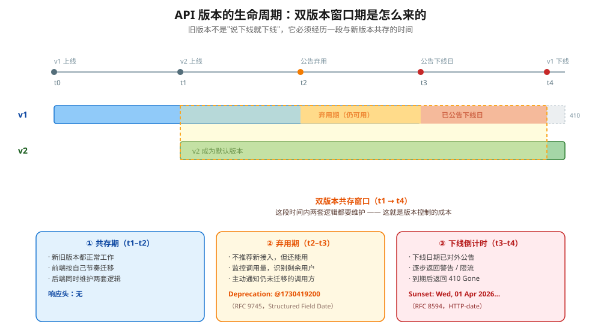
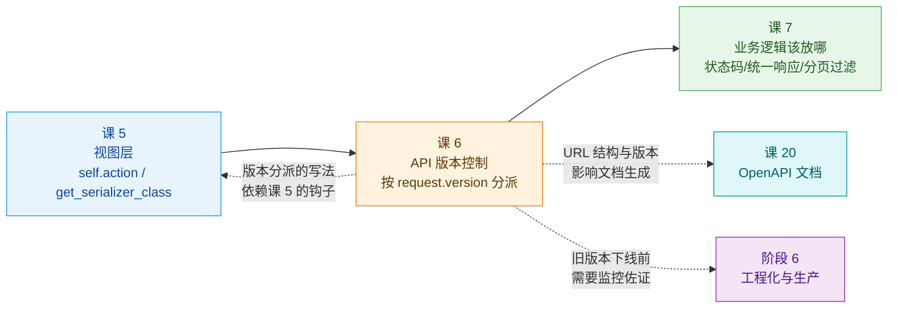
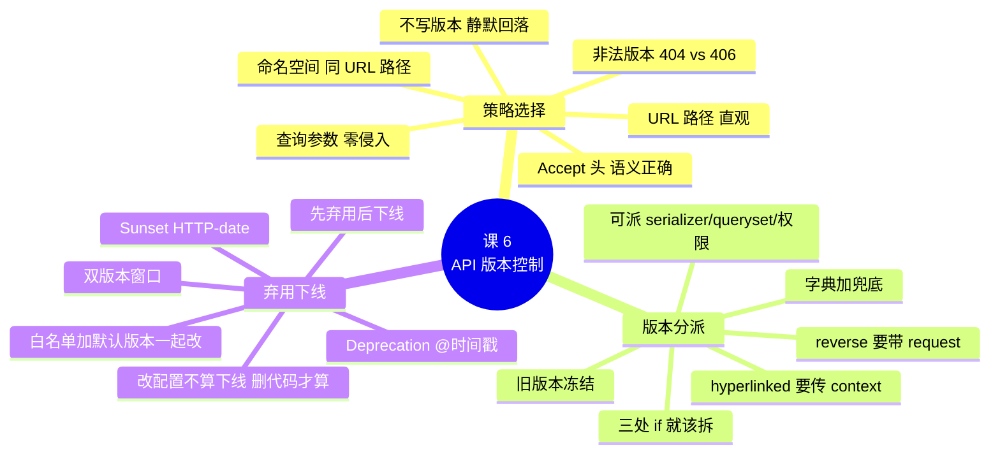

# 课 6　API 版本控制

> 📖 情节定位：**立规矩（四）** —— API 一旦发布就不能随便改，前后端还要各自发版
> 🎯 本课目标：选对版本策略，让新旧版本共存，并能有序下线旧版本

---

## 第一幕 · 起源与场景引入

### Roy Fielding 的那句狠话

DRF 文档《Versioning》这一章的开篇，引的不是代码示例，而是一句狠话：

> **"Versioning an interface is just a 'polite' way to kill deployed clients."**
> （给接口做版本控制，只是一种"礼貌地杀死已部署客户端"的方式。）
> —— [Roy Fielding](https://www.slideshare.net/evolve_conference/201308-fielding-evolve/31)，引自 [DRF - Versioning](https://www.django-rest-framework.org/api-guide/versioning/)

Roy Fielding 是 REST 这个词的提出者、HTTP 规范的主要作者之一。他这句话的意思很直白：**你每发布一个新版本，本质上是宣布"某一批已经跑在用户手上的客户端该死了"。** 版本控制让你杀得体面一点，但杀戮本身没有变。

同一页文档里还有一句容易被人忽略的话：

> "There are a number of valid approaches to approaching versioning. **Non-versioned systems can also be appropriate**, particularly if you're engineering for very long-term systems with multiple clients outside of your control."

**"不做版本控制，也可能是合适的选择。"** 这句话本课后面会再回来讲——它和阶段 1 那句"不该分离就不分离"是同一种克制的工程观。

### 你的场景

项目上线三个月，前端跑得好好的。现在产品要改一个东西：

> "文章状态除了「草稿 / 已发布」，再加一个「审核中」。"

你改了模型、改了 serializer，本地一测，`status` 从字符串变成了对象（想顺便把展示文案也带出去）：

```json
// 改之前（v1）
{"status": "published"}

// 改之后（v2）
{"status": {"value": "published", "label": "已发布"}}
```

**后端改完就发版了。** 第二天早上，App 端全线白屏——因为三个月前发布的 iOS 版本还在读 `status` 当字符串用。

> 🚨 **这就是前后端分离最根本的代价**：课 1 说分离是为了"两边独立发版"，但独立发版意味着**你不知道对方什么时候会升级**。已装在你用户手机上的旧 App，可能永远不会升级。

所以问题变成：**怎么让新旧版本同时活着，直到旧版本可以安全地死掉？**

---

## 第二幕 · 认知困惑

### 困惑一：我加了 `/api/v1/` 前缀，是不是就有版本控制了？

很多项目确实是这么做的：URL 里加个 `v1`，就叫"做了版本控制"。

**但版本控制不是加前缀。** 加了前缀之后，你还得回答：

- 谁来决定用 v1 还是 v2？（URL？参数？请求头？）
- v1 和 v2 的代码放哪？（两个 ViewSet？一个 ViewSet 里 if-else？）
- 来了个 `v9` 怎么办？
- **最关键：v1 什么时候下线？**

阶段概览里那句话值得念一遍：

> **"API 上加个 v1 前缀就是版本控制" 是错的** —— 版本控制还包括 serializer 分派、弃用公告、下线流程。

**加前缀只是选了"版本从哪来"，后面三件事才是版本控制的主体。**

### 困惑二：两种版本策略，选哪个有区别吗？

URL 路径（`/api/v1/articles/`）和 Accept 头（`Accept: application/json; version=v1`），看起来只是写法不同。

**区别比看起来大**：

- URL 路径会把版本**暴露在 URL 里**——它会被复制粘贴、被写进文档、被缓存、被写死在客户端
- Accept 头把版本**藏在请求头里**——URL 保持干净，但调试时你看不见它

DRF 文档的说法是：Accept 头方式 **"generally considered as best practice"**（被普遍认为最佳实践），但紧跟一句 **"although other styles may be suitable depending on your client requirements"**。

**翻译：没有标准答案，看你的客户端是谁。** 知识点 1 会给一张选择表。

### 困惑三：v1 什么��候能删？

这是本课最现实的问题，也是最容易被无限期推迟的。

真实情况通常是：

1. v1 上线，v2 上线，两版共存
2. 一年后你想下线 v1，但**不知道还有谁在用它**
3. 于是决定"再等等"
4. 两年后 v1 还在，带着一堆没人敢动的兼容代码

> 💡 阶段概览把它点得很准：**"旧版本没人敢下线，会变成永久包袱。"**
>
> 要打破这个循环，靠的不是勇气，是**机制**：公告 + 监控 + 明确的窗口期。知识点 3 会给一套可执行的做法。

---

## 第三幕 · 层层揭示

### 知识点 1：三种版本策略的取舍

#### 一句话定义

**版本策略** = 客户端用哪种方式告诉服务端"我要哪个版本的 API"。

#### 直觉建立：餐厅的三种点单方式

| 策略 | 类比 | 特点 |
|------|------|------|
| **URL 路径** | 走进"一楼中餐厅"还是"二楼西餐厅" | 楼层写在大门上，谁都看得见 |
| **查询参数** | 进门后跟服务员说"我要中餐" | 地址不变，但每次都要多说一句 |
| **Accept 头** | 坐下后，只在菜单上勾选菜系 | 最不显眼，但服务员每次都要先看你的单子 |

**URL 路径**最直白——版本号就写在地址栏里，测试和文档都方便，代价是**URL 变了**（在 REST 语境里，同一资源的不同版本算不算同一 URI，是有争议的）。

**Accept 头**最"符合 HTTP 语义"——内容协商本来就该用 `Accept` 头做（課 5 讲过）。代价是**不方便调试**：你在浏览器地址栏敲 URL，根本没法带自定义 Accept。

> ⚠️ **类比失效的边界**：餐厅里你换个说法，服务员都能听懂。但 API 里**客户端必须严格按你选的策略发请求**——用 URL 策略的接口，你在 Accept 头里写 `version=v2` 是**完全无效**的，DRF 根本不看它。

#### 核心原理一：DRF 提供的五种策略

DRF 文档列了五种（实测覆盖了其中四种）：

| 策略 | 请求形态 | `request.version` 来源 |
|------|---------|----------------------|
| `URLPathVersioning` | `GET /api/v1/articles/` | URL 关键字参数 `version` |
| `QueryParameterVersioning` | `GET /api/articles/?version=v1` | 查询参数 `version` |
| `AcceptHeaderVersioning` | `Accept: application/json; version=v1` | Accept 头的媒体类型参数 |
| `NamespaceVersioning` | `GET /api/v1/articles/` | URL 命名空间（如 `v1`） |
| `HostNameVersioning` | `GET https://v1.example.com/articles/` | 主机名的第一段 |

配置：

```python
REST_FRAMEWORK = {
    "DEFAULT_VERSIONING_CLASS": "rest_framework.versioning.URLPathVersioning",
    "DEFAULT_VERSION": "v1",            # 客户端没声明时的兜底
    "ALLOWED_VERSIONS": ["v1", "v2"],   # 白名单
    "VERSION_PARAM": "version",         # 参数名（query / header / URL kwarg）
}
```

**三个关键设置**（DRF 文档原文）：

- **`DEFAULT_VERSION`** —— "The value that should be used for `request.version` when no versioning information is present."
- **`ALLOWED_VERSIONS`** —— "If set, this value will restrict the set of versions that may be returned... **Note that the value used for the `DEFAULT_VERSION` setting is always considered to be part of the `ALLOWED_VERSIONS` set** (unless it is `None`)."
- **`VERSION_PARAM`** —— "The string that should be used for any versioning parameters."

🚨 加粗那句是本课**最实用的一条**，它背后藏着一个真实的坑——实验 9 会把它演示出来。

#### 核心原理二：实测对比（四种策略）

```text
  策略                请求形态                                 request.version
  ------------------------------------------------------------------------
  URL 路径版本         /api/url/v2/articles/                  v2
  查询参数版本         /api/qp/articles/?version=v2            v2
  Accept 头版本        Accept: application/json; version=v2   v2
  命名空间版本         /api/ns/v2/articles/                   v2

  默认行为（未声明版本时）：
    URL 路径      -> 路由不匹配，404
    查询参数      -> v1（回落到 DEFAULT_VERSION）
    Accept 头     -> v1（回落到 DEFAULT_VERSION）

  非法版本（不在 ALLOWED_VERSIONS 里）：
    URL 路径      -> 404 {'detail': 'URL路径包含无效版本。'}
    查询参数      -> 404 {'detail': '请求参数里包含无效版本。'}
    Accept 头     -> 406 {'detail': '“Accept” HTTP头包含无效版本。'}
```

**三个要记住的点：**

1. **URL 路径策略下，不写版本就是 404**——因为它靠 URL 模式匹配，少了那一段路由根本不存在。
2. **查询参数与 Accept 头策略下，不写版本会回落到 `DEFAULT_VERSION`**——这是个双刃剑：老客户端不会挂，但**你以为他们在用 v2，其实他们一直在 v1**。
3. 🚨 **非法版本的响应码不一样**：URL 与查询参数是 **404**，Accept 头是 **406**。原因很自然——Accept 头版本属于内容协商，协商失败就是 406（课 5 讲过）。**写前端错误处理时别只判断 404。**

#### 核心原理三：怎么选

| 考量 | URL 路径 | 查询参数 | Accept 头 |
|------|---------|---------|----------|
| **直观性 / 可调试** | ✅ 最好，地址栏就能看 | ✅ 好 | ❌ 差，要改请求头 |
| **URL 纯净度** | ❌ 版本混进资源路径 | ⚠️ 一般 | ✅ 最干净 |
| **HTTP 语义** | ⚠️ 有争议 | ⚠️ 有争议 | ✅ 符合内容协商 |
| **缓存友好** | ✅ URL 不同自然分开 | ⚠️ 需配置 Vary | ❌ 必须配 `Vary: Accept` |
| **老客户端不升级时的行为** | ❌ 直接 404 | ✅ 回落默认版本 | ✅ 回落默认版本 |
| **文档生成（OpenAPI）** | ✅ 好 | ⚠️ 一般 | ⚠️ 需额外配置 |

**决策建议：**

| 你的情况 | 建议 |
|---------|------|
| **内部系统 / 前后端同团队 / 移动端为主** | **URL 路径**（`/api/v1/`）——最省事，所有人都能看懂 |
| **对外开放、长期演进的公共 API** | **Accept 头**（配 vendor media type，见下） |
| **已经上线且 URL 没法改** | **查询参数**——对现有 URL 零侵入 |
| **客户端数量少且你能控制升级节奏** | 考虑**不做版本控制**（见知识点 1 末尾） |

> ⚠️ **DRF 文档给 Accept 头方式的一条重要提醒**：
> "Strictly speaking the `json` media type is not specified as including additional parameters. If you are building a well-specified public API you might consider using a **vendor media type**."
>
> 也就是：严格来说 `application/json; version=v1` 里的 `version` 参数**并不在 `application/json` 的规范里**。做规范的公共 API 时，应该用厂商媒体类型：
> ```python
> class BookingsAPIRenderer(JSONRenderer):
>     media_type = 'application/vnd.megacorp.bookings+json'
> ```
> 客户端请求就变成：`Accept: application/vnd.megacorp.bookings+json; version=v1`

**URL 路径 vs 命名空间**（DRF 文档原文）：

> "The `URLPathVersioning` approach might be better suitable for **small ad-hoc projects**, and the `NamespaceVersioning` is probably easier to manage for **larger projects**."

两者对客户端完全一样（URL 都是 `/v1/xxx/`），差别只在后端怎么组织。

#### 什么时候不该做版本控制

回到第一幕那句话。以下情况**可以不做**：

| 情况 | 为什么 |
|------|--------|
| 只有自己团队的一个前端，且能同步发版 | 改了就改了，一起上 |
| 只做**向后兼容**的变更（只加字段、不改语义） | 老客户端读新字段只是不认识，不会崩 |
| 内部系统，用户量小、升级成本低 | 版本机制的成本大于收益 |

**判断标准**：

> **你能控制所有客户端的升级节奏吗？能 → 可以不做版本控制。不能 → 必须做。**

#### 常见误区

- ❌ **"加了 `/v1/` 前缀就是版本控制"** —— 那只是选了版本来源。分派、公告、下线才是主体。
- ❌ **"非法版本一律 404"** —— Accept 头方式是 **406**。
- ❌ **"不写版本会报错"** —— 查询参数与 Accept 头方式会**静默回落到默认版本**。
- ❌ **"Accept 头方式最规范，无脑选它"** —— 调试困难 + 缓存要配 `Vary`，内部系统用它弊大于利。
- ❌ **"所有 API 都需要版本控制"** —— 见上文，能控制客户端升级时可以不��。

#### 一句话记住

> **内部系统用 URL 路径（直观），公共 API 用 Accept 头（语义正确）；非法版本的响应码两种策略不一样（404 vs 406）。**

---

### 知识点 2：版本分派 —— serializer 与视图的切换

#### 一句话定义

**版本分派** = 拿到 `request.version` 之后，按它选择不同的 serializer / 视图逻辑 / queryset。

#### 直觉建立：多语言菜单

一家餐厅有一份**母版菜单**（你的数据模型），但要出**中文、英文、日文**三个版本（v1 / v2 / v3）。

- 菜是同一批（同一个 model）
- 但**呈现给客人的形态不同**（不同的 serializer）
- 有些菜只在日文版上有（v2 新增的字段）

**分派就是"根据客人手上的菜单版本，递上对应语言的那份"。**

> ⚠️ **类比失效的边界**：餐厅的多语言菜单内容绝大部分相同，只有语言不同。而 API 版本之间可能**差异极大**——v2 可以彻底重排字段、改数据类型、换分页方式。这时候"一份母版 + 分派"就不够了，得考虑拆成两个 ViewSet（见"复用与隔离"）。

#### 核心原理一：最小分派 —— `get_serializer_class()`

DRF 文档给的示例就是这个：

```python
def get_serializer_class(self):
    if self.request.version == 'v1':
        return AccountSerializerVersion1
    return AccountSerializer
```

**推荐写法**（用字典 + 兜底，比 if-else 链好扩展）：

```python
SERIALIZER_BY_VERSION = {
    "v1": ArticleV1Serializer,
    "v2": ArticleV2Serializer,
}


class ArticleViewSet(viewsets.ReadOnlyModelViewSet):
    queryset = Article.objects.all()

    def get_serializer_class(self):
        # ⚠️ 用 .get() 兜底：万一来了个没预料到的版本，回落到 v1
        return SERIALIZER_BY_VERSION.get(self.request.version, ArticleV1Serializer)
```

**实测（实验 6）：**

```text
  v1 字段: ['id', 'title', 'body', 'status', 'created_at']
  v2 字段: ['id', 'title', 'slug', 'body', 'status', 'author_name', 'created_at']

  v1 的 status: "published"
  v2 的 status: {"value": "published", "label": "已发布"}

  -> 字段差异: 仅 v2 有 ['author_name', 'slug']
  -> 这就是破坏性变更：老前端读 v2 的 status 会拿到对象而不是字符串
```

**同一个 ViewSet、同一份 queryset，两个版本吐出完全不同的结构。**

#### 核心原理二：还能分派什么

`request.version` 在视图里到处可用，所以能分派的不止 serializer：

| 分派对象 | 做法 | 适用 |
|---------|------|------|
| **serializer** | `get_serializer_class()` | ✅ 最常见，字段结构变化 |
| **queryset** | `get_queryset()` | 新版本用不同的过滤/排序 |
| **权限** | `get_permissions()` | 新版本收紧权限 |
| **分页器** | `pagination_class` 或 `get_paginator()` | 新版本换分页方式 |
| **整个视图** | 两个 ViewSet + URL 分派 | 差异太大，塞不进一个类 |

```python
class ArticleViewSet(viewsets.ReadOnlyModelViewSet):
    def get_queryset(self):
        if self.request.version == "v1":
            return Article.objects.filter(status="published")   # v1 只给已发布
        return Article.objects.all()                            # v2 给全部

    def get_permissions(self):
        if self.request.version == "v2":
            return [IsAuthenticated()]                          # v2 要求登录
        return [AllowAny()]
```

#### 核心原理三：反向 URL 时版本会保留吗（高频坑）

**如果你在序列化器或视图里生成 URL（比如 `HyperlinkedIdentityField`），版本会不会带上？**

DRF 文档原文：

> "The `reverse` function included by REST framework ties in with the versioning scheme. You need to make sure to **include the current `request` as a keyword argument**..."
> ```python
> from rest_framework.reverse import reverse
> reverse('bookings-list', request=request)
> ```

**实测（实验 7）：**

```text
  【反例】不带 request 的普通 django.urls.reverse：
    reverse('url-article-list') -> NoReverseMatch（缺 version 参数）

  【正例】走真实请求，在视图里调用 DRF 的 reverse(request=...)：
    GET /api/probe-rev/v1/ -> {
      "request.version": "v1",
      "reverse(request=request)": "http://testserver/api/url/v1/articles/",
      "reverse(不带 request)": "<NoReverseMatch>"
    }
    GET /api/probe-rev/v2/ -> {
      "request.version": "v2",
      "reverse(request=request)": "http://testserver/api/url/v2/articles/",
      "reverse(不带 request)": "<NoReverseMatch>"
    }
```

**机制**（DRF 源码 `rest_framework/reverse.py`）：

```python
def reverse(viewname, args=None, kwargs=None, request=None, format=None, **extra):
    scheme = getattr(request, 'versioning_scheme', None)
    if scheme is not None:
        try:
            url = scheme.reverse(viewname, args, kwargs, request, format, **extra)
        except NoReverseMatch:
            url = _reverse(viewname, args, kwargs, request, format, **extra)
    ...
```

`URLPathVersioning.reverse()` 会把 `request.version` 塞进 `kwargs[version_param]`。

| 调用方式 | 结果 |
|---------|------|
| `reverse(name, request=request)` | ✅ 自动带上版本，得到 `/api/url/v2/articles/` |
| `reverse(name)`（不带 request） | ❌ `NoReverseMatch`——不知道版本 |

> 🚨 **两个连带后果**：
> 1. **用 `HyperlinkedIdentityField` / `HyperlinkedModelSerializer` 时，必须把 request 放进 serializer 的 context**：
>    ```python
>    serializer = ArticleSerializer(queryset, many=True, context={'request': request})
>    ```
>    （DRF 文档原文：*"When using hyperlinked serialization styles together with a URL based versioning scheme make sure to include the request as context to the serializer."*）
> 2. **用裸 `HttpRequest` 做单元测试时会翻车**——它连 `versioning_scheme` 都没有。

#### 核心原理四：复用与隔离 —— 什么时候该拆成两个 ViewSet

**一个 ViewSet 塞两个版本，还是拆成两个 ViewSet？**

| | 一个 ViewSet + 分派 | 两个 ViewSet |
|---|---|---|
| **代码量** | ✅ 少，共享 queryset 与辅助方法 | ❌ 多 |
| **可读性** | ⚠️ 版本逻辑散落在多个 `if self.request.version` 里 | ✅ 每个版本独立，一眼看明白 |
| **隔离性** | ❌ 改 v2 时可能误伤 v1 | ✅ 完全隔离 |
| **下线难度** | ❌ 要在一堆 if 里摘掉 v1 的分支 | ✅ 直接删文件 |
| **适用** | 版本差异小（字段增删） | **版本差异大（逻辑重构）** |

**判断标准**：

> **如果你写了第三处 `if self.request.version`，就该考虑拆了。**

**推荐的组织方式**：

```python
# apps/articles/versions/v1/serializers.py
# apps/articles/versions/v1/views.py
# apps/articles/versions/v2/serializers.py
# apps/articles/versions/v2/views.py
```

或者更简单——`serializers_v1.py` / `serializers_v2.py` 并列。

> 💡 **一个关键原则：旧版本要"冻结"。**
> 一旦 v2 上线，**v1 的代码就不该再改了**。它的作用是"给还没升级的客户端一个稳定的过去"，不是"继续演进"。
> 实测（实验 8）：`V1SunsetViewSet` 的 `get_serializer_class()` 直接锁死返回 `ArticleV1Serializer`，**不随 `request.version` 变化**——这就是冻结。

#### 常见误区

- ❌ **用 if-else 链做分派** —— 加到第三个版本就成了灾难。用字典。
- ❌ **忘了兜底** —— `request.version` 可能是 `None`（没启用版本控制时），`SERIALIZER_BY_VERSION[None]` 会 `KeyError`。
- ❌ **在带 URL 版本的项目里用 `django.urls.reverse`** —— 会 `NoReverseMatch`。用 `rest_framework.reverse` 并传 `request`。
- ❌ **用 `HyperlinkedIdentityField` 却没传 `context={'request': request}`** —— 生成的 URL 会缺版本，或者干脆报错。
- ❌ **v2 上线后还继续改 v1** —— v1 应该冻结，否则你永远不知道旧客户端看到的是什么。

#### 一句话记住

> **用字典做 `get_serializer_class()` 分派并记得兜底；生成 URL 必须用 DRF 的 `reverse(..., request=request)`；旧版本要冻结。**

---

### 知识点 3：弃用策略与前端协作

#### 一句话定义

**弃用策略** = 从"宣布 v1 不再推荐"到"v1 真正下线"之间的一套可执行的机制，包含**公告、监控、窗口期、下线检查**四件事。

#### 直觉建立：旧桥的封闭施工

一座桥要拆，你不能今晚贴张纸、明早就炸。标准流程是：

1. **提前公告**：在桥头立牌子"本桥将于 X 年 X 月封闭"
2. **引导绕行**：给出新桥的位置和路线图
3. **观察车流**：统计还有多少车走旧桥，主动通知常客
4. **封闭**：到期后封路，立"此路不通"的标志

**API 下线是同一件事。** 只不过"车流"变成了"调用量"，"绕行路线"变成了"迁移文档"。

> ⚠️ **类比失效的边界**：桥封了，车一定过不去，物理上强制。而 API 下线后，**如果没人真的执行下线动作，旧版本会一直"活着"**——这也是为什么"再等等"会无限循环。机制的意义在于**给下线一个不可回避的日期**。

#### 核心原理一：生命周期与双版本窗口



**三个阶段：**

| 阶段 | 状态 | 该做什么 | 响应头 |
|------|------|---------|--------|
| ① **共存期** | v1、v2 都正常 | 前端按节奏迁移 | 无 |
| ② **弃用期** | v1 不推荐但仍可用 | 公告 + 监控调用量 + 通知剩余用户 | `Deprecation` |
| ③ **下线倒计时** | 下线日期已公告 | 逐步警告/限流，到期返回 410 | `Deprecation` + `Sunset` |

**双版本窗口（t1 → t4）就是版本控制的真实成本**——这段时间内两套逻辑都要维护。窗口越长成本越高，越短则客户端迁移压力越大。

#### 核心原理二：两个响应头（格式不一样！）

这是本知识点最技术、也最容易写错的部分。

| 头 | 规范 | 状态 | 值格式 | 示例 |
|---|------|------|--------|------|
| **`Deprecation`** | **RFC 9745**（2025-03，Proposed Standard，作者 Sanjay Dalal & Erik Wilde） | "该资源**已经或即将**被弃用" | **Structured Field Date**（RFC 9651 §3.3.7） | `Deprecation: @1688169599` |
| **`Sunset`** | **RFC 8594**（2019-05，Informational，作者 Erik Wilde） | "该资源**预计何时**不可用" | **HTTP-date** | `Sunset: Sat, 31 Dec 2018 23:59:59 GMT` |

🚨 **两个头的日期格式不一样**——这是我写演示代码时踩到的坑，也是实际项目里常见错误：

```python
# ❌ 错误：给 Deprecation 塞了 HTTP-date
response["Deprecation"] = "Sat, 01 Nov 2025 00:00:00 GMT"

# ✅ 正确：Deprecation 用 Structured Field Date（@ + Unix 时间戳）
response["Deprecation"] = "@1730419200"          # 2024-11-01
# ✅ Sunset 用 HTTP-date
response["Sunset"] = "Wed, 01 Apr 2026 00:00:00 GMT"
```

⚠️ **这两条都写错了不会报错**——客户端拿到一个解析不了的值，可能直接忽略，你的公告就白发了。

**RFC 9745 的另一条约束**：

> "The timestamp given in the `Sunset` header field **MUST NOT** be earlier than the one given in the `Deprecation` header field."

**下线日期不能早于弃用日期**——顺序必须是"先宣布弃用，再宣布下线时间"。

**RFC 8594 对 Sunset 适用范围的界定**（很重要，读起来有点反直觉）：

> "For the first stage (the API is not the preferred or recommended version anymore), the Sunset header field is **not appropriate**: at this stage, the API remains operational and can still be used. ... For the second stage (the API or a specific version of the API gets decommissioned), the Sunset header field is appropriate."

**翻译**：
- 阶段②（弃用但还能用，**还没定下线日期**）→ **只发 `Deprecation`，不发 `Sunset`**
- 阶段③（下线日期已公告）→ **`Deprecation` + `Sunset` 都发**

> 💡 **这两个 RFC 都是"提示性"的机制**（RFC 8594 明确说 "Clients SHOULD treat Sunset timestamps as hints"）。**它们不替代邮件、群通知、文档更新**——但好处是**机器可读**，可以被监控系统自动抓取。

#### 核心原理三：怎么落地（Django 侧）

```python
class DeprecationMixin:
    """给旧版本接口挂上弃用响应头。"""
    deprecation_ts = None        # Unix 时间戳
    sunset_http_date = None      # HTTP-date 字符串

    def finalize_response(self, request, response, *args, **kwargs):
        response = super().finalize_response(request, response, *args, **kwargs)
        if self.deprecation_ts is not None:
            response["Deprecation"] = f"@{self.deprecation_ts}"
            response["Link"] = (
                '<https://api.example.com/docs/deprecation>; rel="deprecation"'
            )
        if self.sunset_http_date:
            response["Sunset"] = self.sunset_http_date
        return response


class V1SunsetViewSet(DeprecationMixin, BaseVersionedViewSet):
    versioning_class = URLPathVersioning
    deprecation_ts = 1730419200                             # 2024-11-01
    sunset_http_date = "Wed, 01 Apr 2026 00:00:00 GMT"

    def get_serializer_class(self):
        return ArticleV1Serializer    # 锁死 v1 —— 旧版本冻结
```

**实测（实验 8）：**

```text
  GET /api/sunset/v1/articles/  -> 200
  响应头：
    Deprecation : @1730419200
    Sunset      : Wed, 01 Apr 2026 00:00:00 GMT
    Link        : <https://api.example.com/docs/deprecation>; rel="deprecation"
```

⚠️ **为什么用 `finalize_response()` 而不是 `dispatch()` 包一层？**
因为它**只处理 DRF 的响应流程**，不会干扰 Django 的中间件，而且能拿到已经被 DRF 处理过的 `Response`。

#### 核心原理四：下线前的检查清单

**这是本知识点最"能直接用"的部分。** 下线 v1 之前，逐项确认：

| # | 检查项 | 怎么验证 |
|---|--------|---------|
| 1 | **调用量归零（或降到阈值以下）** | 按版本打点的监控，看 v1 的 QPS 曲线 |
| 2 | **剩余调用方都已通知** | 用 `Deprecation` 头 + 主动联系（邮件/工单）双管齐下 |
| 3 | **迁移文档已发布** | `Link` 头指向的文档可访问且内容完整 |
| 4 | **窗口期已满** | 从公告弃用到下线，通常不少于 **3–6 个月**（移动端要更久，因为 App 审核 + 用户不升级） |
| 5 | **回滚预案就绪** | 下线后发现漏网之鱼，能否快速恢复 |
| 6 | **`ALLOWED_VERSIONS` 与 `DEFAULT_VERSION` 都已改** | ⚠️ 见下方"最隐蔽的坑" |
| 7 | **监控告警已配好** | 下线后若还有 v1 流量，要能立刻知道 |
| 8 | **代码删除计划已定** | 只改配置不算下线，**代码还在就得继续维护** |

> 🚨 **最隐蔽的坑（实验 9 实测）**：只把 `ALLOWED_VERSIONS` 改成 `["v2"]`，**v1 依然可用**。
>
> 因为 DRF 的判定逻辑是：
> ```python
> def is_allowed_version(self, version):
>     if not self.allowed_versions:
>         return True
>     return ((version is not None and version == self.default_version) or
>             (version in self.allowed_versions))
> ```
> **`version == self.default_version` 也算通过！** 只要 `DEFAULT_VERSION` 还是 `"v1"`，v1 就永远被放行——**即使它不在白名单里**。
>
> DRF 文档也明确写了："the value used for the `DEFAULT_VERSION` setting is always considered to be part of the `ALLOWED_VERSIONS` set"。

**实测对照：**

```text
  【验证 ②】白名单=['v2'] 但默认版本仍是 'v1'：
    v1     -> 200     ← 🚨 依然可用！
    v2     -> 200
    v9     -> 404

  【验证 ③】白名单=['v2'] 且默认版本也改成 'v2'：
    v1     -> 404 {'detail': 'URL路径包含无效版本。'}
    v2     -> 200
```

**结论：下线 v1 必须同时改两个值。**

#### 核心原理五：三个类属性是"导入时快照"

这是实验 9 的另一个发现，关乎你怎么定制：

```python
# rest_framework/versioning.py 源码
class BaseVersioning:
    default_version = api_settings.DEFAULT_VERSION      # ← 类属性，导入时求值
    allowed_versions = api_settings.ALLOWED_VERSIONS
    version_param = api_settings.VERSION_PARAM
```

**这三个值在模块导入时就从 settings 快照了**，所以：

- ✅ 在 `settings.py` 里配 → 有效（因为 Django 先加载 settings 再导入 DRF）
- ❌ 运行时改 settings（如 `override_settings`）→ **无效**（实测验证过）
- ✅ **子类化定制** → 有效，且是 DRF 文档推荐的做法：

```python
class V2OnlyVersioning(URLPathVersioning):
    allowed_versions = ["v2"]
    default_version = "v2"      # ← 别忘了这个
```

#### 常见误区

- ❌ **"改了 `ALLOWED_VERSIONS` 就算下线了"** —— 忘了改 `DEFAULT_VERSION`，旧版本照样通��。
- ❌ **给 `Deprecation` 塞 HTTP-date** —— 它要的是 Structured Field Date（`@` + 时间戳）。
- ❌ **弃用第一天就发 `Sunset`** —— RFC 8594 说得很清楚，还没定下线日期时发 `Sunset` 不合适。
- ❌ **只发响应头就算公告了** —— 响应头是机器可读的补充，**不替代人工通知**。
- ❌ **改了配置就算下线** —— 代码还在，维护成本就在。**真正的下线是删代码**。
- ❌ **窗口期一刀切** —— 移动端（App 审核 + 用户不升级）通常需要比 Web 长得多。

#### 一句话记住

> **弃用发 `Deprecation`（@时间戳），定了下线日期再加 `Sunset`（HTTP-date）；下线 v1 必须同时改 `ALLOWED_VERSIONS` 和 `DEFAULT_VERSION`。**

---

## 第四幕 · 实操验证

### 验证环境

| 项 | 值 |
|---|---|
| 环境 | **Windows 11 + WorkBuddy 托管 Python 3.13.14** |
| 依赖 | Django **6.1**、djangorestframework **3.18.0** |
| 数据库 | SQLite 内存库 |
| 复用环境 | `C:\Users\v_wypgwu\.workbuddy\binaries\python\envs\dj-course` |
| 实测日期 | 2026-09-02 |

> ⚠️ 与前面几课相同：`wsl.exe` 被本机安全策略拦截，继续使用托管 Python 环境。**所有输出均为真实执行结果。**

**一键复现：**

```bash
python run_lab.py
```

---

### 实验 1：URL 路径版本

```text
  GET /api/url/v1/articles/  -> 200
    第一条: {"id": 1, "title": "第一篇文章", "body": "正文一", "status": "published", "created_at": "..."}

  GET /api/url/v2/articles/  -> 200
    第一条: {"id": 1, "title": "第一篇文章", "slug": "a1", "body": "正文一",
             "status": {"value": "published", "label": "已发布"}, "author_name": "alice", "created_at": "..."}

  探针 /api/probe/v2/ -> {'request.version': 'v2', 'versioning_scheme': 'URLPathVersioning'}

  ⚠️ 请求一个不在白名单里的版本（v3）：
    -> 404  {'detail': 'URL路径包含无效版本。'}
```

**回扣知识点 1**：两个版本从同一个 ViewSet 吐出，结构完全不同（`status` 一个是字符串一个是对象）。

---

### 实验 2：查询参数版本

```text
  GET /api/qp/articles/?version=v1   -> 200（v1 结构）
  GET /api/qp/articles/?version=v2   -> 200（v2 结构）
  GET /api/qp/articles/(不带参数)     -> 200（v1 结构 —— 回落到 DEFAULT_VERSION）
  GET /api/qp/articles/?version=v3   -> 404
    {'detail': '请求参数里包含无效版本。'}

  探针 /api/probe-qp/?version=v2 -> {'request.version': 'v2', 'versioning_scheme': 'QueryParameterVersioning'}
  探针 /api/probe-qp/（不带参数）-> {'request.version': 'v1', 'versioning_scheme': 'QueryParameterVersioning'}
```

**回扣知识点 1**：**不带参数不报错，静默回落 v1**——这是它与 URL 路径策略最大的行为差异。

---

### 实验 3：Accept 头版本

```text
  Accept: application/json; version=v1   -> 200（v1 结构）
  Accept: application/json; version=v2   -> 200（v2 结构）
  Accept: application/json               -> 200（v1 结构，回落）
  Accept: application/json; version=v3   -> 406
    {'detail': '“Accept” HTTP头包含无效版本。'}

  探针 -> {'request.version': 'v2', 'versioning_scheme': 'AcceptHeaderVersioning'}
  探针（不带 version 参数）-> {'request.version': 'v1', 'versioning_scheme': 'AcceptHeaderVersioning'}
```

🚨 **回扣知识点 1 核心原理二**：非法版本时它是 **406 而不是 404**——因为版本信息在 `Accept` 头里，属于内容协商失败。

---

### 实验 4：命名空间版本（对照）

```text
  GET /api/ns/v1/articles/  -> 200（v1 结构）
  GET /api/ns/v2/articles/  -> 200（v2 结构）
```

**回扣知识点 1**：对客户端而言和 URL 路径策略完全一致，差别只在后端用 URL 命名空间还是关键字参数。

---

### 实验 5：四种策略横向对比

```text
  策略                           请求形态                                       request.version
  ----------------------------------------------------------------------------------------
  URL 路径版本                     /api/url/v2/articles/                      v2
  查询参数版本                      /api/qp/articles/?version=v2               v2
  Accept 头版本                   Accept: application/json; version=v2       v2
  命名空间版本                      /api/ns/v2/articles/                       v2

  默认行为（未声明版本时）：
    URL 路径      -> 路由不匹配，404
    查询参数      -> v1（回落到 DEFAULT_VERSION）
    Accept 头     -> v1（回落到 DEFAULT_VERSION）

  非法版本（不在 ALLOWED_VERSIONS 里）：
    URL 路径      -> 404 {'detail': 'URL路径包含无效版本。'}
    查询参数      -> 404 {'detail': '请求参数里包含无效版本。'}
```

**回扣知识点 1**：一张表看清四种策略的"版本从哪来"和"缺版本/错版本时怎么办"。

---

### 实验 6：版本分派 —— 同一个 ViewSet 吐出不同结构

```text
  v1 字段: ['id', 'title', 'body', 'status', 'created_at']
  v2 字段: ['id', 'title', 'slug', 'body', 'status', 'author_name', 'created_at']

  v1 的 status: "published"
  v2 的 status: {"value": "published", "label": "已发布"}

  -> 字段差异: 仅 v2 有 ['author_name', 'slug']
  -> 这就是破坏性变更：老前端读 v2 的 status 会拿到对象而不是字符串

  反向验证：v1 的输出里有没有 v2 的新字段？
    v1 含 slug? 否
    v1 含 author_name? 否
```

**回扣知识点 2 核心原理一**：`get_serializer_class()` 分派生效，且两个版本**完全隔离**（v1 里看不到 v2 的新字段）。

---

### 实验 7：反向 URL 时版本会保留吗？

```text
  【反例】不带 request 的普通 django.urls.reverse：
    reverse('url-article-list') -> NoReverseMatch（缺 version 参数）

  【正例】走真实请求，在视图里调用 DRF 的 reverse(request=...)：
    GET /api/probe-rev/v1/ -> {
      "request.version": "v1",
      "reverse(request=request)": "http://testserver/api/url/v1/articles/",
      "reverse(不带 request)": "<NoReverseMatch>"
    }
    GET /api/probe-rev/v2/ -> {
      "request.version": "v2",
      "reverse(request=request)": "http://testserver/api/url/v2/articles/",
      "reverse(不带 request)": "<NoReverseMatch>"
    }
```

**回扣知识点 2 核心原理三**：`request=request` 是必需的，否则 `NoReverseMatch`。

> 🔍 **调试记录**：我第一版测试用 `APIRequestFactory` 手工造 request，结果失败了——因为裸 `HttpRequest` 没有 `versioning_scheme` 属性，而版本是在 DRF 的 `determine_version` 阶段才写进去的。**改成走真实请求后才测出正确行为。** 这也印证了那句提醒：**用裸 HttpRequest 测版本相关逻辑会翻车。**

---

### 实验 8：弃用公告响应头

```text
  GET /api/sunset/v1/articles/  -> 200
  响应头：
    Deprecation : @1730419200
    Sunset      : Wed, 01 Apr 2026 00:00:00 GMT
    Link        : <https://api.example.com/docs/deprecation>; rel="deprecation"

  同一个 ViewSet 用 v2 请求 -> 200
  （V1SunsetViewSet 的 get_serializer_class 锁死 v1，验证「旧版本冻结」）
    字段: ['id', 'title', 'body', 'status', 'created_at']
```

**回扣知识点 3**：

| 观察 | 结论 |
|------|------|
| `Deprecation: @1730419200` | Structured Field Date 格式（`@` + Unix 时间戳），对应 2024-11-01 |
| `Sunset: Wed, 01 Apr 2026...` | HTTP-date 格式。**两个头格式不同** |
| `Link: ... rel="deprecation"` | 指向迁移文档，机器可读 |
| 用 v2 请求仍返回 v1 结构 | **旧版本冻结**——`get_serializer_class()` 锁死了 |

> 🚨 **这条实测纠正了我自己写的代码**：我最初给 `Deprecation` 塞的是 HTTP-date（`Sat, 01 Nov 2025...`）。查 RFC 9745 才发现它要的是 Structured Field Date。**写错了不报错，只是客户端解析不了——公告白发。**

---

### 实验 9：白名单与默认版本的真实判定规则

```text
  当前全局设置：
    DEFAULT_VERSION          = 'v1'
    ALLOWED_VERSIONS         = ['v1', 'v2']
    VERSION_PARAM            = 'version'
    DEFAULT_VERSIONING_CLASS = None

  ⚠️ 但真正的判定发生在版本类的**类属性**上（导入时快照）：
    BaseVersioning.default_version  = 'v1'
    BaseVersioning.allowed_versions = ['v1', 'v2']
    BaseVersioning.version_param    = 'version'

  DRF 源码里的判定逻辑（rest_framework/versioning.py）：
    def is_allowed_version(self, version):
        if not self.allowed_versions:
            return True
        return ((version is not None and version == self.default_version) or
                (version in self.allowed_versions))

  -> 三条规则：
     ① allowed_versions 为空 → 全部放行
     ② version == default_version → 放行（★ 默认版本永远被允许）
     ③ version in allowed_versions → 放行

  【验证 ①】allowed_versions 为空（NoAllowedListVersioning）：
    v1     -> 200
    v2     -> 200
    v9     -> 200
    随便什么   -> 200

  【验证 ②】白名单=['v2'] 但默认版本仍是 'v1'（v2allow-v1default）：
    v1     -> 200     ← 🚨 依然可用！
    v2     -> 200
    v9     -> 404

  【验证 ③】白名单=['v2'] 且默认版本也改成 'v2'（v2only）：
    v1     -> 404 {'detail': 'URL路径包含无效版本。'}
    v2     -> 200

  🚨 结论：只改 ALLOWED_VERSIONS 而忘了改 DEFAULT_VERSION，
     旧版本**依然可用**——因为默认版本永远被放行。
     这是「想下线 v1 却没下成」的一个典型原因。

  ⚠️ 另一个坑：这些是类属性，在模块导入时就从 settings 快照了。
     所以运行时改 settings（如 override_settings）不会影响它们——
     本项目用子类化来定制，才是可靠做法。
```

**这是本课最实用的一组实测。** 两条结论：

1. **`DEFAULT_VERSION` 永远被放行**——即使它不在 `ALLOWED_VERSIONS` 里。下线旧版本**必须同时改两个值**。
2. **三个配置是类属性、导入时快照**——运行时改 settings 无效，要定制得子类化（DRF 文档也是这么推荐的）。

> 🔍 **调试记录**：我最初用 `override_settings` 来改 `ALLOWED_VERSIONS`，发现**请求行为完全没变**。查源码才明白是类属性快照的问题——于是改用子类化，才测出真实规则。**如果当时没追这一步，讲义里就会写一条错误结论。**

---

### 附：实验工程结构

```text
ver_lab/
├── manage.py
├── config/
│   ├── settings.py     # 版本控制的四个全局设置
│   └── urls.py         # path("api/", include("apps.articles.urls"))
├── apps/
│   ├── users/models.py
│   └── articles/
│       ├── models.py
│       ├── serializers.py   # ArticleV1Serializer / ArticleV2Serializer
│       ├── views.py         # 四种策略的 ViewSet + 探针 + 弃用示例 + 白名单验证
│       └── urls.py          # 每种策略一套 URL
└── run_lab.py          # 9 个实验的执行脚本（一键复现）
```

`views.py` 里的视图清单：

| 视图 | 用途 |
|------|------|
| `UrlVersionedViewSet` / `QueryVersionedViewSet` / `AcceptVersionedViewSet` / `NamespaceVersionedViewSet` | 四种版本策略 |
| `BaseVersionedViewSet` | 共用基类，内含 `get_serializer_class()` 按版本分派 |
| `VersionProbeView` / `QueryProbeView` / `AcceptProbeView` | 回显 `request.version` 与策略类名 |
| `ReverseProbeView` | 在真实请求里验证 `reverse(request=...)` |
| `DeprecationMixin` + `V1SunsetViewSet` | 弃用响应头 + 旧版本冻结 |
| `V2OnlyViewSet` / `V2AllowedV1DefaultViewSet` / `NoAllowedListViewSet` | 白名单判定规则验证 |

---

## 第五幕 · 体系收束

### 本课在全局中的位置



**课 6 是阶段 2 的收尾**，也是课 5 知识的直接延伸——`get_serializer_class()` 在课 5 是按 `self.action` 分派，到本课变成按 `self.request.version` 分派。**同一个钩子，两个维度。**

**三个知识点的 interdependence：**

| 知识点 | 铺的路 |
|--------|--------|
| 策略选择 | 决定 URL 形态，进而影响课 20 的文档生成与缓存配置 |
| 版本分派 | 课 7 讨论"业务逻辑放哪"时，多版本会让这个问题复杂一倍 |
| 弃用下线 | 需要阶段 6 的监控与日志来提供"还有谁在调用"的证据 |

### 你现在会了什么

| 收获 | 可验证的能力 |
|------|-------------|
| 说出四种策略的差异 | 知道各自的请求形态、缺版本时的行为、非法版本的响应码（404 vs 406） |
| 判断该不该做版本控制 | 能用"能否控制客户端升级节奏"给出结论 |
| 实现版本分派 | 会用字典 + 兜底写 `get_serializer_class()`，并知道该拆分还是共用 |
| 处理带版本的 URL 反查 | 知道必须用 `reverse(..., request=request)`，以及 hyperlinked 字段要传 context |
| 发规范的弃用公告 | 知道 `Deprecation`（@时间戳）与 `Sunset`（HTTP-date）的格式差异与适用阶段 |
| 真正下线一个版本 | 知道必须**同时**改 `ALLOWED_VERSIONS` 和 `DEFAULT_VERSION`，并有一份检查清单 |

### 一图总结



### 埋下的伏笔

1. **多版本下的业务逻辑归属** → 课 7 讨论"业务逻辑该放哪"时，多版本会让"共享 vs 隔离"这个问题变得更难，本课的判断标准（"第三处 if 就该拆"）会再次派上用场。
2. **带版本的 OpenAPI 文档** → 课 20 讲接口文档自动生成时，URL 路径版本最容易生成多份文档，Accept 头版本则需要额外配置。
3. **下线前的调用量监控** → 阶段 6 的中间件与日志（课 18）会告诉你怎么按版本打点，本课的下线清单依赖它。

---

## 📌 阶段 2 进度小结（课 3–6）

> ⚠️ **本阶段尚未结束**：课 7《业务逻辑该放哪》（业务逻辑四方案、状态码与统一响应、分页过滤排序）**仍属于阶段 2**。
> 阶段 3《认证、权限与鉴权》从课 8 开始。

| 课 | 核心交付 |
|----|---------|
| 课 3 | 序列化器基础：Serializer / ModelSerializer 分工、校验三层、读写控制 |
| 课 4 | 序列化器进阶：可写嵌套与原子性、N+1 陷阱、动态裁剪字段 |
| 课 5 | 视图层：Request/Response 与内容协商、三层抽象取舍、router 路由 |
| 课 6 | API 版本控制：策略取舍、版本分派、弃用与下线 |
| 课 7 | **待学**：业务逻辑放置、状态码与统一响应、分页过滤排序 |

**课 3–6 的一条主线**：

> **请求进来 → 视图选对抽象 → 序列化器校验与转换 → 按版本分派 → 有序演进与下线。**

进入课 7 之前，建议自查三件事（课 7 会建立在它们之上）：

- [ ] 你的 serializer 没有用 `fields = "__all__"`（课 3）
- [ ] 列表接口数过查询次数，确认没有 N+1（课 4）
- [ ] 项目里每个接口都能说清"这是什么资源"还是一个"动作"（课 5）

---

## 🐞 本课误区速查

| 误区 | 真相 |
|------|------|
| "加了 `/v1/` 前缀就是版本控制" | 那只是选了版本来源。分派、公告、下线才是主体 |
| "非法版本一律 404" | URL 路径 / 查询参数是 **404**，Accept 头是 **406**（内容协商失败） |
| "不写版本会报错" | 查询参数与 Accept 头方式会**静默回落到 `DEFAULT_VERSION`**；URL 路径方式才是 404 |
| "Accept 头最规范，无脑选" | 调试困难 + 缓存要配 `Vary`。内部系统用 URL 路径更划算 |
| "所有 API 都要版本控制" | 能控制所有客户端升级节奏时，可以不做（Fielding 也这么说） |
| "改了 `ALLOWED_VERSIONS` 就下线了" | 🚨 **`DEFAULT_VERSION` 永远被放行**——两个值必须一起改（实验 9） |
| "运行时改 settings 能调整版本规则" | 三个配置是**类属性、导入时快照**。要定制得子类化（实验 9） |
| "`reverse()` 会自动带版本" | 只有传了 `request=` 才会。DRF 靠 `request.versioning_scheme` 判断（实验 7） |
| "给 `Deprecation` 塞 HTTP-date 就行" | 它要 **Structured Field Date**（`@` + Unix 时间戳）；`Sunset` 才是 HTTP-date。**写错不报错** |
| "弃用第一天就该发 `Sunset`" | RFC 8594 说：还没定下线日期时发 `Sunset` 不合适，此时只发 `Deprecation` |
| "改了配置就算下线" | 代码还在就得继续维护。**真正的下线是删代码** |
| "v2 上线后还能继续优化 v1" | 旧版本应该**冻结**，否则你永远不知道旧客户端看到的是什么 |

---

## 📚 官方文档

| 主题 | 链接 |
|------|------|
| **DRF** | |
| Versioning（五种策略、三个设置、reverse 与 hyperlinked 的注意事项） | https://www.django-rest-framework.org/api-guide/versioning/ |
| reverse 函数 | https://www.django-rest-framework.org/api-guide/reverse/ |
| Settings（DEFAULT_VERSION / ALLOWED_VERSIONS / VERSION_PARAM） | https://www.django-rest-framework.org/api-guide/settings/ |
| **RFC** | |
| RFC 9745 — The Deprecation HTTP Response Header Field（2025-03，Proposed Standard） | https://www.rfc-editor.org/info/rfc9745 |
| RFC 8594 — The Sunset HTTP Header Field（2019-05，Informational） | https://www.rfc-editor.org/info/rfc8594 |
| RFC 9651 — Structured Field Values for HTTP（Date 类型定义） | https://www.rfc-editor.org/info/rfc9651 |
| **延伸阅读（DRF 文档中引用的观点）** | |
| Roy Fielding 谈版本控制（InfoQ 访谈） | https://www.infoq.com/articles/roy-fielding-on-versioning |
| Heroku HTTP API Design — 在 Accept 头中要求版本 | https://github.com/interagent/http-api-design/blob/master/en/foundations/require-versioning-in-the-accepts-header.md |

---

## 🚀 下一批接力提示词

> 学完本课后，**复制下面这段文字发给 AI**，即可无缝进入下一课（无需重新描述上下文）：

```text
继续学 Django 进阶（前后端分离）。我的学习档案在 django/00-学习档案.md，
刚学完阶段 2《DRF 核心三件套》的课 6《API 版本控制》
（知识点：三种版本策略的取舍、版本分派、弃用策略与前端协作），
请按大纲继续讲解课 7《业务逻辑该放哪》（仍在本阶段）。
```

---

## 🧭 课程导航

**上一课**：[课 5《视图层：从 APIView 到 ViewSet》](./lesson-05-视图层从APIView到ViewSet.md)

**下一课**：[课 7《业务逻辑该放哪》](./lesson-07-业务逻辑该放哪.md)　（同属阶段 2）

**返回**：[阶段 2 概览](../overview.md) ｜ [课程目录](../../../02-课程目录.md)
