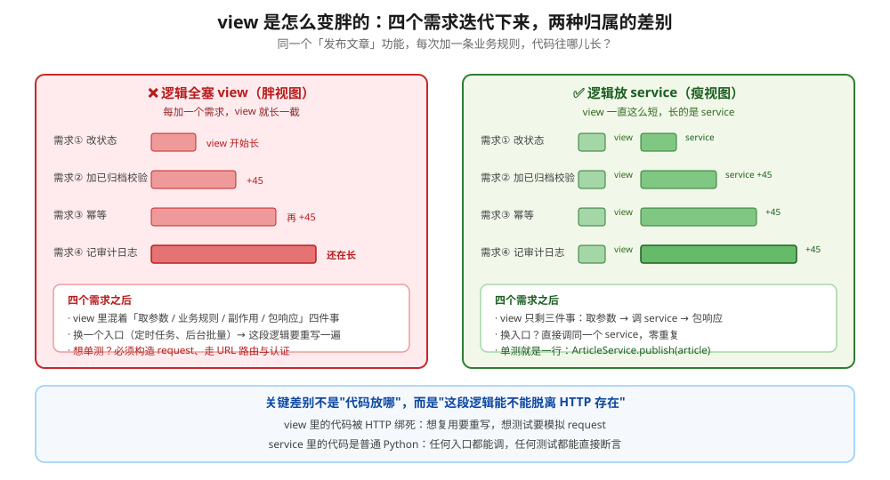
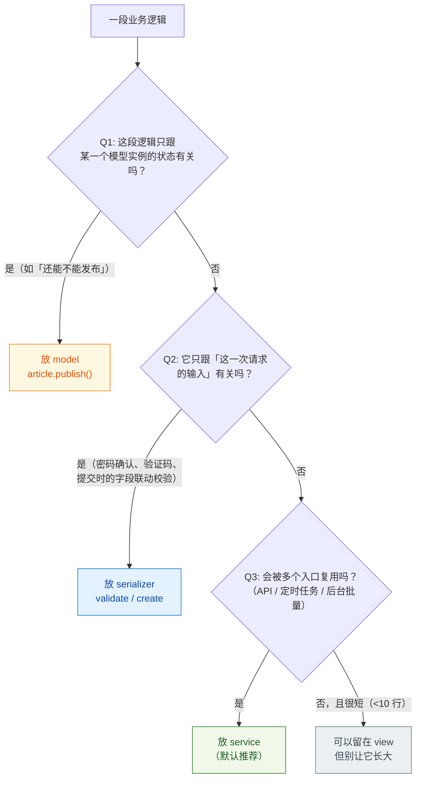
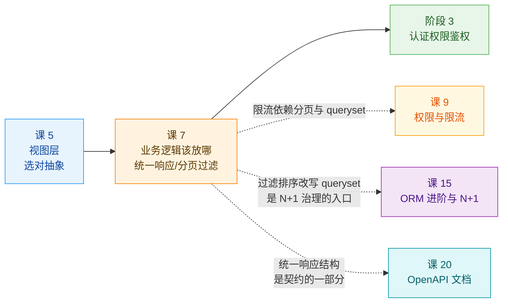
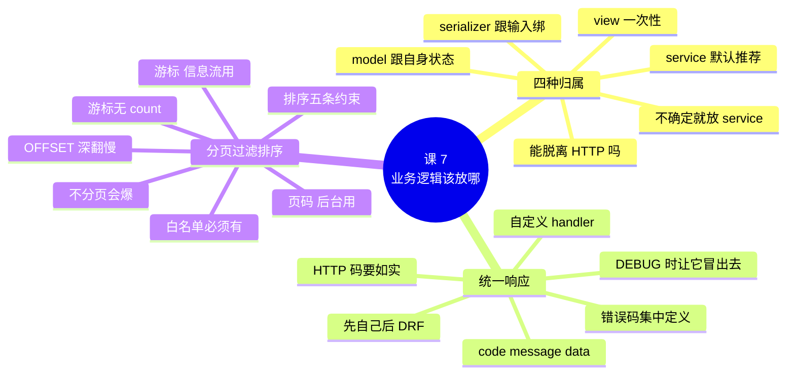

# 课 7　业务逻辑该放哪

> 📖 情节定位：**立规矩（五）** —— 视图瘦身的关键一战
> 🎯 本课目标：为业务逻辑选对归属，输出前端友好的统一响应，列表接口可安全上线

---

## 第一幕 · 场景引入

项目跑了半年，"发布文章"这个接口的 view 长成了这样：

```python
def publish_article(request, pk):
    # ① 取对象
    try:
        article = Article.objects.get(pk=pk)
    except Article.DoesNotExist:
        return JsonResponse({"detail": "未找到"}, status=404)

    # ② 权限：只能作者本人发布
    if article.author != request.user and not request.user.is_staff:
        return JsonResponse({"detail": "没有权限"}, status=403)

    # ③ 业务规则：已归档的不能发布
    if article.status == "archived":
        return JsonResponse({"detail": "已归档的文章不能发布"}, status=409)

    # ④ 业务规则：重复发布要幂等
    if article.status != "published":
        article.status = "published"
        article.save(update_fields=["status"])

        # ⑤ 副作用：记审计日志
        AuditLog.objects.create(action="publish", target=f"Article#{pk}",
                                operator=str(request.user))
        # ⑥ 副作用：通知订阅者
        notify_subscribers.delay(article.id)

    return JsonResponse(ArticleSerializer(article).data)
```

**每一条都是产品提的需求，每一条都加在这里。** 六个职责挤在一个函数里，它已经不知道自己是谁了。

阶段概览里那句话是这么说的：

> **分离项目最常见的腐化点是 view 变胖。**

但"变胖"不是原罪——**真正的问题是它被 HTTP 绑死了**：

- 想从定时任务里发布文章？这段逻辑没法复用，得抄一遍
- 想给它写单元测试？必须构造 request、走 URL 路由、处理认证
- 想加一条规则？在这个已经 60 行的函数里找个地方塞进去

本课要做的，就是把这块肉从 view 上剔下来，放到它该在的地方。

---

## 第二幕 · 认知困惑

### 困惑一：逻辑放 serializer 不行吗？我看大家都写在 `create()` 里

能跑。但你会遇到这个场景：

> 运营同事说："后台能不能加个批量发布？勾一批文章，一次全发。"

如果你把发布逻辑写在 `PublishSerializer.create()` 里，批量发布要怎么做？——**要么给每一篇都构造一个 serializer 实例，要么把那段逻辑抄一遍。**

这就是实验 1 里暴露的那个隐性代价：

```text
     注：方案 B 要把整篇文章回传才能改一个状态 —— 这是它的隐性代价。
```

**serializer 的输入是"这一次请求的数据"，它的职责是校验与转换。** 一旦逻辑需要被别的入口复用，它就装不下了。

### 困惑二：错误结构要不要统一？DRF 默认的不是挺好的吗

看两组真实返回：

```text
  【默认 handler】404 -> {"detail": "文章不存在"}
  【我们的 handler】404 -> {"code": 40400, "message": "文章不存在", "data": null}
```

以及字段校验错误：

```text
  【默认 handler】400 -> {"title": ["请确保这个字段不能超过 5 个字符。"]}
  【我们的 handler】400 -> {"code": 40000, "message": "参数校验失败",
                          "data": {"title": ["请确保这个字段不能超过 5 个字符。"]}}
```

**DRF 默认结构的问题不是"不好"，而是"不只一种"**：

| 情况 | 默认返回 | 前端要怎么写 |
|------|---------|------------|
| `ValidationError` | `{"title": [...]}` | 遍历所有键当字段名 |
| `NotFound` | `{"detail": "..."}` | 取 `detail` |
| `PermissionDenied` | `{"detail": "..."}` | 取 `detail` |
| 业务规则失败（自己 return） | **你自己定** | ? |

前端得写：`if (resp.detail) ... else if (resp.title) ... else if (resp.msg) ...`——**每加一种错误，前端就要改一次判断。**

更糟的是本课实验 1 里顺带发现的这件事：

```text
  【场景 2】发布一篇「已归档」文章
    A 全塞 view     -> 409  {"detail": "已归档的文章不能发布"}
    D 放 service    -> 400  {"code": 40002, "message": "已归档的文章不能发布", "data": null}
```

**同一个业务规则，因为归属不同，返回的结构和状态码都不一样。** view 变胖不只是变胖，它还会**顺带泄漏不一致的错误形状**。

### 困惑三：分页不就是加个 `PAGE_SIZE` 吗，有什么好讲的？

分页真正的坑有两个，都在"翻页"上：

```text
    page=5   -> …LIMIT 5 OFFSET 20
    page=10  -> …LIMIT 5 OFFSET 45
```

**OFFSET 越大，数据库越要先扫过并丢弃前面的行。** 10 万条数据翻到第 5000 页，数据库要扔掉 25000 行才能给你 5 条。

DRF 文档的原文：

> "With extremely large datasets pagination using **offset-based pagination styles may become inefficient or unusable**. Cursor based pagination schemes instead have **fixed-time properties**, and do not slow down as the dataset size increases."
> —— [DRF - Pagination](https://www.django-rest-framework.org/api-guide/pagination/)

第二个坑更隐蔽——**排序字段必须满足五条约束**，否则会**丢记录或重复记录**（实验 6、7 会实测）。

---

## 第三幕 · 层层揭示

### 知识点 1：业务逻辑放置的四种方案

#### 一句话定义

**业务逻辑的归属** = 那段"判断能不能做、做完要连带什么"的代码，写在哪一层。候选有四个：**view / serializer / model / service**。

#### 直觉建立：餐厅里谁来拍板

客人点了一份"七分熟牛排，不要香菜"。这句话要经过四个人：

| 角色 | 类比层 | 它管什么 |
|------|--------|---------|
| **服务员** | **view** | 接单、上菜、传话。**不负责判断能不能做** |
| **点菜单** | **serializer** | 确认订单格式对不对（牛排要写几成熟、忌口要写清楚） |
| **食材本身** | **model** | 牛排自己知道"我还能不能做成七分熟"（库存、状态） |
| **后厨** | **service** | 真正协调：检查库存 → 安排灶台 → 通知传菜 → 记一笔账 |

**现实里变胖的服务员长这样**：他一边接单，一边跑去冰箱看有没有牛肉、一边自己开火烧、一边记账。**短期看效率还挺高（就一个人嘛），等餐厅做大就彻底乱套。**

> ⚠️ **类比失效的边界**：餐厅里服务员和厨师是不同的人，天然分工。代码里你**可以**把后厨的活写进 view——而且在小项目里这样写确实更快。**这个方案不是"错"，是"有代价"。** 本知识点要给你的，是判断"什么时候开始付不起这个代价"的尺子。

#### 核心原理一：四种方案对比

| | **A 塞 view** | **B 放 serializer** | **C 放 model** | **D 放 service** |
|---|---|---|---|---|
| **写法** | 直接写在 `post()` 里 | 写在 `create()` / `update()` | 写成模型方法 `article.publish()` | 独立的 `services.py` |
| **能复用吗** | ❌ 换入口要重写 | ❌ 要构造 serializer | ✅ 任何拿到实例的地方 | ✅ 任何地方直接调 |
| **能脱离 HTTP 吗** | ❌ | ❌（要 context） | ✅ | ✅ |
| **好单测吗** | ❌ 要造 request | ⚠️ 要造数据 + context | ✅ 一行 | ✅ 一行 |
| **跨模型流程** | ✅ 能写但会乱 | ⚠️ 勉强 | ❌ 不适合 | ✅ 最适合 |
| **DRF 的钩子** | 无 | ✅ `perform_create` 等 | 无 | 无（纯 Python） |
| **适用** | 一次性、无复用的逻辑 | 与本次请求输入强绑定 | 只跟自身状态有关 | **默认推荐** |

#### 核心原理二：view 是怎么变胖的



**关键洞察**（图底部那句）：

> **差别不是"代码放哪"，而是"这段逻辑能不能脱离 HTTP 存在"。**

- view 里的代码**被 HTTP 绑死**：想复用要重写，想测试要模拟 request
- service 里的代码是**普通 Python**：任何入口都能调，任何测试都能直接断言

#### 核心原理三：怎么选（决策顺序）

按这个顺序问，**命中即停**：



**一句话版本**：

> **不确定就放 service。** 它有最高的复用性和可测试性，代价只是多一个文件。

#### 核心原理四：service 层长什么样

```python
# apps/articles/services.py
class ArticleService:
    """特征：不依赖 HTTP、无状态、抛业务异常。"""

    @staticmethod
    @transaction.atomic
    def publish(article: Article, operator: str = "") -> Article:
        if article.status == Article.Status.ARCHIVED:
            raise BizError(ErrorCode.BIZ_STATUS_CONFLICT, "已归档的文章不能发布")

        if article.status == Article.Status.PUBLISHED:
            return article                      # 幂等

        article.status = Article.Status.PUBLISHED
        article.save(update_fields=["status", "updated_at"])

        AuditLog.objects.create(action="publish", target=f"Article#{article.pk}",
                                operator=operator)
        return article
```

配套的 view 只剩三件事：

```python
class ServiceDrivenView(APIView):
    def post(self, request, pk):
        article = get_object_or_404(Article, pk=pk)          # ① 取参数
        try:
            article = ArticleService.publish(article, operator=str(request.user))   # ② 调 service
        except BizError as e:
            return fail(e.code, e.message, e.http_status)
        return success(ArticleSerializer(article).data)       # ③ 包响应
```

**四条纪律：**

| 纪律 | 为什么 |
|------|--------|
| **不 import `request` / `Response`** | 一旦引入，它就又被 HTTP 绑死了 |
| **抛业务异常，不返回响应** | 返回什么格式是 view 的事（知识点 2） |
| **方法尽量 `staticmethod`** | 无状态才好测、好复用 |
| **事务写在 service 层** | 一个业务操作 = 一个事务边界（课 4 讲过原子性） |

#### 常见误区

- ❌ **"service 层是过度设计"** —— 10 行以内的逻辑确实可以留在 view。**但一旦它需要被第二个入口调用，或者需要单测，就该搬走。**
- ❌ **"放 model 就是充血模型，最先进"** —— 跨模型流程（改 A 表 + 改 B 表 + 发消息）放 model 里会让模型变得臃肿且难以理解。
- ❌ **"放 serializer 因为有 `perform_create` 钩子"** —— 那个钩子适合"保存时塞个当前用户"，不适合承载完整业务流程。
- ❌ **service 层里返回 `Response`** —— 那就等于把 view 的逻辑搬了个地方，没有解耦。

#### 一句话记住

> **不确定就放 service：不碰 HTTP、抛业务异常、能被任何入口复用、能一行单测。**

---

### 知识点 2：状态码、统一响应与错误码

#### 一句话定义

**统一响应** = 所有接口（成功与失败）返回同一个信封 `{code, message, data}`；**错误码** = 在 HTTP 状态码之外，给每一类错误一个业务编号。

#### 直觉建立：快递单 vs 口头传话

- **不统一的响应** = 每个快递员用自己习惯的方式通知你：有的打电话、有的发短信、有的直接敲门喊一声。你得应付所有形式。
- **统一响应** = 所有快递都走同一个 App 推送，界面长一样：**状态（已签收/拒收）+ 说明 + 详情**。你只需要学会看这一个界面。

**HTTP 状态码是给机器和基础设施看的**（网关、缓存、浏览器），**业务错误码是给前端和用户看的**。两者都要有，且职责不同：

| | 谁消费 | 粒度 | 例子 |
|---|--------|------|------|
| **HTTP 状态码** | 浏览器、网关、CDN、监控 | 粗（约 10 个常用） | 200 / 400 / 404 / 500 |
| **业务错误码** | 前端、调用方、客服 | 细（成百上千） | `40002` = 已归档不能发布 |

> ⚠️ **类比失效的边界**：快递 App 推送你不想看可以关掉；HTTP 状态码**关不掉**——它会被中间层消费。所以**永远不要用 200 包装业务失败**（`HTTP 200 + {"code": 40002}` 会让网关、监控、缓存全部误判）。状态码必须如实反映结果。

#### 核心原理一：常用状态码语义

| 状态码 | 语义 | 本课/本课程的典型场景 |
|--------|------|---------------------|
| **200** OK | 请求成功 | 查询、更新成功 |
| **201** Created | 资源已创建 | `POST` 成功（课 1 讲过） |
| **202** Accepted | 已接收，异步处理 | 提交任务给 Celery |
| **204** No Content | 成功但无响应体 | `DELETE` 成功（课 1 讲过） |
| **400** Bad Request | 请求本身有问题 | 参数校验失败、业务规则拒绝 |
| **401** Unauthorized | 未认证（不知道你是谁） | 没带 token（课 8） |
| **403** Forbidden | 已认证但没权限 | 不是你的文章（课 9） |
| **404** Not Found | 资源不存在 | pk 不存在 |
| **405** Method Not Allowed | 方法不被允许 | 课 5 提过 |
| **406** Not Acceptable | 无法满足 Accept 头 | 课 5 / 课 6 提过 |
| **409** Conflict | 与资源当前状态冲突 | 已归档不能发布 |
| **429** Too Many Requests | 限流 | 课 9 限流 |

> ⚠️ **401 与 403 的区别是本项目最容易混的一对**：401 = "我不知道你是谁"（没登录），403 = "我知道你是谁，但你不能干这个"。**课 8 / 课 9 会正式区分。**

#### 核心原理二：统一响应信封

```python
# 成功
{"code": 0, "message": "ok", "data": {...}}

# 失败
{"code": 40002, "message": "已归档的文章不能发布", "data": null}

# 字段校验失败：data 里保留字段明细，方便前端高亮表单项
{"code": 40000, "message": "参数校验失败",
 "data": {"title": ["请确保这个字段不能超过 5 个字符。"]}}
```

**设计要点：**

| 决定 | 理由 |
|------|------|
| `code = 0` 表示成功 | 前端只需 `if (resp.code === 0)`，不用记一堆成功码 |
| `message` 始终存在 | 失败时直接可以 toast 给用户看 |
| `data` 成功时至少是 `{}` | 前端不必判空（实测：成功响应统一给 `{}`） |
| 校验细节放 `data` | `message` 给概括，`data` 给字段级明细，前端各取所需 |
| **HTTP 状态码仍如实设置** | ❌ 绝不 `HTTP 200 + code != 0`，那会让监控和缓存全部失效 |

#### 核心原理三：统一异常处理器

配置：

```python
REST_FRAMEWORK = {
    "EXCEPTION_HANDLER": "apps.articles.exceptions.custom_exception_handler",
}
```

实现的核心思路（四步，顺序不能乱）：

```python
def custom_exception_handler(exc, context):
    # ① 自己的业务异常 → 直接转
    if isinstance(exc, BizError):
        return fail(exc.code, exc.message, exc.http_status)

    # ② 先让 DRF 处理它认识的那部分（APIException / Http404 / PermissionDenied）
    response = drf_exception_handler(exc, context)

    if response is None:
        # ④ 兜底
        if settings.DEBUG:
            return None                      # DEBUG 时让它冒出去，方便调试
        return fail(ErrorCode.INTERNAL_ERROR, "服务器内部错误", status.HTTP_500_INTERNAL_SERVER_ERROR)

    # ③ 把 DRF 的结构换成我们的信封
    code, message, data = _translate(response.data, exc)
    return fail(code, message, response.status_code, data)
```

**三个要点：**

1. **先自己处理，再交给 DRF**。顺序反了，`BizError` 会被 DRF 当成普通异常返回 500。
2. **DEBUG 时返回 `None`** 让异常冒出去——否则开发时看不到 traceback，排查极其痛苦。
3. **生产环境必须记日志**。兜底分支是唯一能抓住"未预期异常"的地方，不记日志等于瞎。

#### 核心原理四：错误码怎么编排

```
0        —— 成功
4xxxx    —— 客户端错误（前两位跟 HTTP 状态码，后三位是业务细分）
5xxxx    —— 服务端错误
```

```python
class ErrorCode:
    SUCCESS = 0
    PARAM_ERROR = 40000            # 参数校验失败
    BIZ_TITLE_INVALID = 40001
    BIZ_STATUS_CONFLICT = 40002
    NOT_AUTHENTICATED = 40100
    PERMISSION_DENIED = 40300
    NOT_FOUND = 40400
    INTERNAL_ERROR = 50000
```

**这么编排的好处**：看到 `40300` 就知道是权限问题，看到 `40002` 就知道是客户端参数或规则问题。**位数对齐了才好扩展**（`40xxx` 段有 1000 个位置）。

> 💡 **团队约定比设计本身更重要**：错误码具体怎么编都行，但**必须有一处集中定义**（一个 `ErrorCode` 类），禁止在各处硬编码数字。否则半年后没人知道 `40017` 是什么。

#### 常见误区

- ❌ **用 `HTTP 200` 包装所有失败** —— 网关、CDN、监控、APM 会全部误判为成功。
- ❌ **`code` 成功时也给非零值** —— 前端要判断的东西变多了。
- ❌ **自定义 handler 里忘了处理 `BizError`** —— 它会被当成 500。
- ❌ **DEBUG 时也返回统一响应** —— 看不到 traceback，调试变地狱。
- ❌ **生产环境兜底分支不记日志** —— 唯一能抓未预期异常的地方被浪费了。
- ❌ **错误码散落在各文件** —— 必须集中定义。

#### 一句话记住

> **信封统一为 `{code, message, data}`；HTTP 状态码如实反映结果；错误码集中定义、按 HTTP 语义分段编排。**

---

### 知识点 3：分页、过滤与排序

#### 一句话定义

**分页** = 把"一次返回全部"改成"一次返回一页"；**过滤** = 让客户端缩小结果集；**排序** = 让客户端决定顺序。三者共同解决"列表接口不能裸奔上线"的问题。

#### 直觉建立：图书馆借书

- **不分页** = 管理员把整个图书馆的书一次性搬到你面前。你只要 5 本，但搬运成本是他付的。
- **页码分页** = "我要第 3 层第 2 排的书"。管理员从门口走过去，**路过的前两排都白走**（这就是 OFFSET）。
- **游标分页** = "我要'《三体》之后'的 5 本"。管理员直接走到《三体》的位置往后拿，**走的距离恒定**。

> ⚠️ **类比失效的边界**：图书馆里书架位置固定，第 3 排永远是第 3 排。但数据库里**数据会变**——你翻到第二页时，如果有人在第一页位置插入了一条新书，页码分页会让你**看到重复**（漂移），而游标分页不会。这是 DRF 文档列的游标分页第一个好处。

#### 核心原理一：不分页会发生什么（实测）

```text
  数据集：50 篇文章

  【不分页】  -> 200  返回 50 条  SQL 1 次  响应 5608 字节
  【页码分页】-> 200  本页 5 条  总数 50  SQL 2 次  响应 648 字节
     响应体键: ['count', 'next', 'previous', 'results']

  方案              返回条数   响应字节   SQL 次数   有总数吗
  --------------------------------------------------------
  不分页                50     5608       1         —
  页码分页               5      648       2     有 count
  游标分页               5      695       2     无 count
```

**三个观察：**

1. **响应体从 5608 字节降到 648 字节**（50 篇时是 8.6 倍）。数据量越大差距越夸张——5000 篇时不分页会返回几十万字节。
2. **分页多了一次 SQL**（`COUNT(*)` 算总数）。这是页码/LimitOffset 分页的固定成本。
3. 🚨 **游标分页的响应体里没有 `count`**（实测）。文档没有明说这点——**这是实测发现**。想要"共 N 条"的话，游标分页给不了，得另外查。

#### 核心原理二：三种分页器怎么选

| | **PageNumberPagination** | **LimitOffsetPagination** | **CursorPagination** |
|---|---|---|---|
| 请求 | `?page=3&page_size=20` | `?limit=20&offset=40` | `?cursor=xxx` |
| 能跳到任意页 | ✅ | ✅ | ❌ 只能上一页/下一页 |
| 有总数 `count` | ✅ | ✅ | ❌ **实测：无** |
| 深翻页性能 | ❌ OFFSET 变慢 | ❌ OFFSET 变慢 | ✅ **恒定时间** |
| 数据插入时会漂移 | ❌ 会重复/漏 | ❌ 会重复/漏 | ✅ 不会 |
| 适用 | **后台管理、需要跳页和总数** | 需要任意窗口取数据 | **信息流、时间线、大数据量** |

**DRF 文档给游标分页列的两条好处**（原文）：

> - "Provides a consistent pagination view. When used properly `CursorPagination` ensures that the client will never see the same item twice when paging through records, **even when new items are being inserted by other clients** during the pagination process."
> - "Supports usage with very large datasets... Cursor based pagination schemes instead have **fixed-time properties**, and do not slow down as the dataset size increases."

**选择建议：**

| 场景 | 选 |
|------|-----|
| 后台管理系统（要跳页、要知道总数） | **PageNumberPagination** |
| 前端信息流 / 时间线（无限滚动） | **CursorPagination** |
| 需要任意窗口取数据（如导出第 1000–1100 条） | **LimitOffsetPagination** |

#### 核心原理三：深翻页的 OFFSET 问题（实测）

```text
    page=5   -> 返回 5 条，SQL 2 次
      …LIMIT 5 OFFSET 20

    page=10  -> 返回 5 条，SQL 2 次
      …LIMIT 5 OFFSET 45

  验证一下游标分页的 SQL（没有 OFFSET）：
    第一页 next = http://testserver/api/cursor/?cursor=cD0yMDI2LTA5LTA…
    翻到第二页时，SQL 里还有 OFFSET 吗？没有 ✅
```

**OFFSET 的代价**：数据库必须先扫过并丢弃前面 N 行。10 万行翻到第 5000 页，要扔掉 25 万行。

**游标分页用 WHERE 条件代替 OFFSET**，所以性能恒定——代价是不能跳页、没有总数。

#### 核心原理四：排序字段的五条硬约束

**这是分页里最容易被忽略、后果最严重的部分。** DRF 文档原文：

> "Proper usage of pagination should have an ordering field that satisfies the following:
> - Should be an **unchanging value**, such as a timestamp, slug, or other field that is only set once, on creation.
> - Should be **unique, or nearly unique** if using `CursorPagination`...
> - Should be a **non-nullable value** that can be coerced to a string.
> - Should **not be a float**. Precision errors easily lead to incorrect results.
> - The field should have a **database index**."

⚠️ 违反的后果（原文）：

> "Using an ordering field that does not satisfy these constraints will generally still work, but the results might be suboptimal or **outright inconsistent**... These inconsistencies might manifest as either **missing records or duplicate records**."

🚨 **还有一个默认值陷阱**：`CursorPagination` 的默认排序是 **`-created`**（不是 `-created_at`）。文档原文：

> "For `CursorPagination`, the default is to order by `"-created"`. This assumes that there must be a 'created' timestamp field on the model instances..."

**如果你的字段叫 `created_at`（绝大多数 Django 项目的习惯），必须显式写 `ordering = '-created_at'`**——否则会用不存在的 `created` 字段，直接报错。

#### 核心原理五：过滤与排序后端

```python
class PaginatedArticleViewSet(viewsets.ReadOnlyModelViewSet):
    queryset = Article.objects.all()
    serializer_class = ArticleListSerializer

    # 三个后端：过滤 / 搜索 / 排序，各自响应不同的查询参数
    filter_backends = [
        DjangoFilterBackend,      # 精确过滤（?status=published）
        filters.SearchFilter,     # 全文搜索（?search=关键词）
        filters.OrderingFilter,   # 排序（?ordering=-view_count）
    ]
    filterset_class = ArticleFilterSet      # 声明可过滤的字段（白名单）
    search_fields = ["title", "body"]       # 搜索哪些字段
    ordering_fields = ["created_at", "view_count", "title"]   # 排序白名单
    ordering = ["-created_at"]              # 默认排序
    pagination_class = SmallPageNumberPagination
```

```python
class ArticleFilterSet(FilterSet):
    min_views = NumberFilter(field_name="view_count", lookup_expr="gte")   # 自定义：浏览量 ≥ N

    class Meta:
        model = Article
        fields = ["status", "author", "min_views"]
```

**实测（实验 7）：**

```text
  【过滤】DjangoFilterBackend
    ?status=published                -> 命中 17 条
    ?min_views=300                   -> 命中 20 条
    ?status=draft&min_views=100      -> 命中 27 条

  【搜索】SearchFilter
    ?search=文章0                      -> 命中 10 条
    ?search=正文                       -> 命中 50 条

  【排序】OrderingFilter
    ?ordering=view_count             -> 前三条 ['文章00', '文章01', '文章02']
    ?ordering=-view_count            -> 前三条 ['文章49', '文章48', '文章47']
    ?ordering=title                  -> 前三条 ['文章00', '文章01', '文章02']

  ⚠️ 【越权排序尝试】用白名单外的字段：
    ?ordering=slug -> 200，前三条 ['文章49', '文章48', '文章47']
    -> DRF 会静默忽略白名单外的排序字段，回落到默认排序。
```

**三个要点：**

1. 🚨 **`filterset_class` / `ordering_fields` 是白名单，必须有。** 没有 `ordering_fields` 就等于允许按任何字段排序——包括没建索引的大字段，这是**慢查询和 DoS 的入口**。DRF 文档原文："When using `OrderingFilter`, you should strongly consider restricting the fields that the user may order by."
2. **越权排序会被静默忽略**（实测），不报错。所以别指望报错来提醒你白名单漏配了。
3. **排序字段必须有索引**。文档把"should have a database index"列为硬约束之一。

#### 常见误区

- ❌ **"分页就是加个 `PAGE_SIZE`"** —— 还得选分页器、处理深翻页、确保排序字段满足五条约束。
- ❌ **只配 `DEFAULT_PAGINATION_CLASS` 不配 `PAGE_SIZE`** —— 文档明确说两个都要设，且**默认都是 `None`**（即默认不分页！）。
- ❌ **用游标分页还想要 `count`** —— 实测：响应体里没有。
- ❌ **游标分页不设 `ordering`** —— 默认是 `-created`，字段名叫 `created_at` 的项目会直接炸。
- ❌ **`ordering_fields` 留空或不设** —— 等于允许按任意字段排序，慢查询风险。
- ❌ **用可变字段（如 `name`、`updated_at`）做游标排序** —— 会丢记录或重复记录。

#### 一句话记住

> **列表接口必配分页；后台用页码分页，信息流用游标分页；排序字段要「不变、唯一、可转字符串、非浮点、有索引」，且必须配白名单。**

---

## 第四幕 · 实操验证

### 验证环境

| 项 | 值 |
|---|---|
| 环境 | **Windows 11 + WorkBuddy 托管 Python 3.13.14** |
| 依赖 | Django **6.1**、djangorestframework **3.18.0**、**django-filter 26.1** |
| 数据库 | SQLite 内存库 |
| 复用环境 | `C:\Users\v_wypgwu\.workbuddy\binaries\python\envs\dj-course` |
| 实测日期 | 2026-09-02 |

> ⚠️ 与前面几课相同：`wsl.exe` 被本机安全策略拦截，继续使用托管 Python 环境。**所有输出均为真实执行结果。**
> 📦 本课新增依赖 `django-filter`（过滤后端必需），已装入 `dj-course` 虚拟环境，实测与 Django 6.1 + DRF 3.18 兼容。

**一键复现：**

```bash
python run_lab.py
```

---

### 实验 1：同一个需求，四种归属 —— 行为一致吗？

```text
  【场景 1】发布一篇「草稿」文章 —— 四种都应成功
    A 全塞 view     -> 200  status='published'  审计日志=1 条
    B 放 serializer -> 200  status='published'  审计日志=1 条
    C 放 model      -> 200  status='published'  审计日志=1 条
    D 放 service    -> 200  status='published'  审计日志=1 条

  【场景 2】发布一篇「已归档」文章 —— 四种都应拒绝
    A 全塞 view     -> 409  {"detail": "已归档的文章不能发布"}
    B 放 serializer -> 400  {"code": 40002, "message": "已归档的文章不能发布", "data": null}
    C 放 model      -> 400  {"code": 40002, "message": "已归档的文章不能发布", "data": null}
    D 放 service    -> 400  {"code": 40002, "message": "已归档的文章不能发布", "data": null}

  【场景 3】重复发布（幂等性）—— 都应成功且不重复记日志
    A 全塞 view     -> 第二次 200  审计日志=1 条（应为 1）
    B 放 serializer -> 第二次 200  审计日志=1 条（应为 1）
    C 放 model      -> 第二次 200  审计日志=1 条（应为 1）
    D 放 service    -> 第二次 200  审计日志=1 条（应为 1）

  -> 四种归属的行为一致，差别在：可复用性、可测试性、以及 view 有多胖。
     注：方案 B 要把整篇文章回传才能改一个状态 —— 这是它的隐性代价。
```

**逐条回扣知识点 1：**

| 观察 | 结论 |
|------|------|
| 四个场景行为一致 | 说明**归属的选择不改变业务结果**——它改变的是工程属性（复用、可测、可维护） |
| 🚨 **场景 2 里 A 返回 409 + 裸 `{"detail":...}`** | view 变胖会**顺带泄漏不一致的错误形状**。B/C/D 都走统一 handler，A 是手写的 |
| 方案 B 要回传整篇文章 | serializer 的输入是"整个资源的当前值"，改一个状态也要全量回传 |

---

### 实验 2：可测试性对比 —— 谁需要构造 request？

```text
  【service 层】直接调用，不需要任何 HTTP 对象：
    ArticleService.publish(article, operator='unit-test')
    -> status = Article.Status.PUBLISHED（无需 request、无需 client）

    业务异常也是普通 Python 异常，可以直接断言：
    -> 捕获 BizError(code=40002, message='已归档的文章不能发布')

  【model 层】同样可以直接调用：
    article.publish(operator='unit-test') -> status = Article.Status.PUBLISHED

  【view 层】必须经过 HTTP：
    client.post(...) -> 200，还要走 URL 路由 / 中间件 / 认证，共 5 次查询
    -> view 里的逻辑想单测，就必须模拟这些；service 层的不用。
```

**回扣知识点 1 核心原理二**：这就是"能不能脱离 HTTP 存在"的具体代价——**5 次 SQL + 完整的请求栈 vs 一行函数调用**。

---

### 实验 3：统一响应 —— DRF 默认结构 vs 我们的信封

```text
  当前 EXCEPTION_HANDLER = <function custom_exception_handler ...>

  【默认 handler 会给什么】临时切回 DRF 默认，看同样的错误：
    404 -> 404  {"detail": "文章不存在"}

  【我们的 handler】同一个错误：
    404 -> 404  {"code": 40400, "message": "文章不存在", "data": null}

  —— 再看其他几种 ——

    成功             -> 200
      {"code": 0, "message": "ok", "data": {"id": 1, "title": "演示文章"}}

    创建成功（201）      -> 201
      {"code": 0, "message": "创建成功", "data": {"id": 99}}

    业务规则拒绝         -> 400
      {"code": 40002, "message": "已归档的文章不能发布", "data": null}

    字段校验失败         -> 400
      {"code": 40000, "message": "参数校验失败",
       "data": {"title": ["请确保这个字段不能超过 5 个字符。"]}}

  -> 无论成功失败，前端都能用同一套逻辑处理：
       if (resp.code === 0) { 用 resp.data } else { 提示 resp.message }
```

**回扣知识点 2**：注意两点——① **HTTP 状态码保持真实**（创建是 201，不是 200）；② **字段校验的细节保留在 `data` 里**，前端既能统一提示也能逐字段高亮。

---

### 实验 4：状态码语义

```text
  操作                     状态码      响应体信封
  --------------------------------------------------------------------
  查询成功                 200        {"code": 0, ...}
  创建成功                 201        {"code": 0, "message": "创建成功", ...}
  参数不合法               400        {"code": 40000, ...}
  资源不存在               404        {"code": 40400, ...}
  业务规则冲突             400        {"code": 40002, ...}

  ⚠️ 注意「业务规则冲突」用的是 400。什么时候该用 409 Conflict？
     409 的语义是「请求与资源当前状态冲突」——已归档不能发布，其实就是 409。
     但很多团队把所有 4xx 都归到 400，靠 code 区分 —— 这也是合理的，
     关键是团队内统一，别一半用 400 一半用 409。
```

> 💡 这段实测想说明的：**状态码的选择有灰度空间，但"统一"比"正确"更重要。** 本课实验里选了 400，实验 1 的方案 A 手写了 409——**两者不一致本身就是问题**。

---

### 实验 5：分页 —— 不分页会发生什么

```text
  数据集：50 篇文章

  【不分页】  -> 200  返回 50 条  SQL 1 次  响应 5608 字节
  【页码分页】-> 200  本页 5 条  总数 50  SQL 2 次  响应 648 字节
     响应体键: ['count', 'next', 'previous', 'results']

  【LimitOffset】-> 200  本页 5 条  响应体键: ['count', 'next', 'previous', 'results']
  【游标分页】  -> 200  本页 5 条  响应体键: ['next', 'previous', 'results']

  方案              返回条数   响应字节   SQL 次数   有总数吗
  --------------------------------------------------------
  不分页                50     5608       1         —
  页码分页               5      648       2     有 count
  游标分页               5      695       2     无 count

  ⚠️ 游标分页的响应体里没有 count —— 它不知道总共有多少条。
     想显示「共 N 条」的话，游标分页给不了，得另外查。
```

**回扣知识点 3 核心原理一**：响应体 **8.6 倍**差距（50 条时）。数据量越大越夸张。

---

### 实验 6：深翻页 —— 页码分页为什么会变慢

```text
  页码分页靠 OFFSET，翻得越深，数据库要跳过的行越多。
  直接看它生成的 SQL：

    page=5   -> 返回 5 条，SQL 2 次
      …LIMIT 5 OFFSET 20

    page=10  -> 返回 5 条，SQL 2 次
      …LIMIT 5 OFFSET 45

  验证一下游标分页的 SQL（没有 OFFSET）：
    第一页 next = http://testserver/api/cursor/?cursor=cD0yMDI2LTA5LTA…
    翻到第二页时，SQL 里还有 OFFSET 吗？没有 ✅
```

**回扣知识点 3 核心原理三**：`OFFSET 20` → `OFFSET 45`，而游标分页**完全没有 OFFSET 子句**。这是"固定时间属性"的直接证据。

> 🔍 附带观察：`page=1` 时 SQL 里只有 `LIMIT 5`、没有 OFFSET（offset 为 0 被省略），所以第一页总是最快的。

---

### 实验 7：过滤与排序

```text
  【过滤】DjangoFilterBackend
    ?status=published                -> 命中 17 条  （只要已发布）
    ?min_views=300                   -> 命中 20 条  （浏览量 ≥ 300）
    ?status=draft&min_views=100      -> 命中 27 条  （草稿 且 浏览量 ≥ 100）

  【搜索】SearchFilter（search_fields = ['title', 'body']）
    ?search=文章0                      -> 命中 10 条
    ?search=正文                       -> 命中 50 条

  【排序】OrderingFilter（ordering_fields 白名单）
    ?ordering=view_count             -> 前三条 ['文章00', '文章01', '文章02']
    ?ordering=-view_count            -> 前三条 ['文章49', '文章48', '文章47']
    ?ordering=title                  -> 前三条 ['文章00', '文章01', '文章02']

  ⚠️ 【越权排序尝试】用白名单外的字段：
    ?ordering=slug -> 200，前三条 ['文章49', '文章48', '文章47']
    -> 没报错。DRF 会静默忽略白名单外的排序字段，回落到默认排序。
```

**回扣知识点 3 核心原理五**：最后一条是关键——**越权排序不报错，只是静默回落到默认排序**（返回的顺序与 `-created_at` 一致，证实了这一点）。白名单配对了没？不会有人提醒你。

---

### 附：实验工程结构

```text
arch_lab/
├── manage.py
├── config/
│   ├── settings.py     # EXCEPTION_HANDLER / DEFAULT_PAGINATION_CLASS / PAGE_SIZE
│   └── urls.py
├── apps/
│   ├── users/models.py
│   └── articles/
│       ├── models.py       # Article（含方案 C 的 publish()）+ AuditLog
│       ├── exceptions.py   # ErrorCode / BizError / success() / fail() / custom_exception_handler
│       ├── services.py     # 方案 D：ArticleService
│       ├── serializers.py  # ArticleSerializer / ArticleListSerializer
│       ├── views.py        # 四种归属 + 统一响应演示 + 三种分页 + 过滤排序
│       └── urls.py
└── run_lab.py          # 7 个实验的执行脚本（一键复现）
```

`views.py` 里的视图清单：

| 视图 | 用途 |
|------|------|
| `FatViewPublishView` | 方案 A：逻辑全塞 view（反面教材，且**返回裸 `{"detail":...}`**） |
| `SerializerDrivenView` + `PublishBySerializerSerializer` | 方案 B：逻辑放 serializer |
| `ModelDrivenView`（配合 `Article.publish()`） | 方案 C：逻辑放 model |
| `ServiceDrivenView`（配合 `ArticleService.publish()`） | 方案 D：逻辑放 service ✅ |
| `UnifiedResponseDemoView` | 演示成功 / 201 / 业务错误 / 校验错误 / 404 的响应结构 |
| `PaginatedArticleViewSet` / `LimitOffsetArticleViewSet` / `CursorArticleViewSet` / `NoPaginationArticleViewSet` | 三种分页 + 不分页对照 |

---

## 第五幕 · 体系收束

### 本课在全局中的位置



**课 7 是阶段 2 的收尾，也是"能跑"到"能上线"的最后一块拼图。**

**三个知识点的 interdependence：**

| 知识点 | 铺的路 |
|--------|--------|
| 业务逻辑归属 | 课 9 的对象级权限会依赖 service/queryset；阶段 6 的监控要能定位到业务操作 |
| 统一响应 | 课 20 的 OpenAPI 文档要描述这个信封结构 |
| 分页过滤排序 | **它们都作用在 `queryset` 上**——课 15 的 N+1 治理就是在这一层做的 |

### 你现在会了什么

| 收获 | 可验证的能力 |
|------|-------------|
| 选对业务逻辑归属 | 能用三步决策给出结论，并说出每种方案的代价 |
| 写出可单测的业务代码 | service 层不碰 HTTP，一行就能测（实验 2 实测） |
| 设计统一响应 | 会写 `{code, message, data}` 信封 + 自定义 exception_handler |
| 区分 HTTP 状态码与业务错误码 | 知道两者职责不同，且状态码必须如实 |
| 配置分页 | 知道三种分页器的取舍，会按场景选（后台页码 / 信息流游标） |
| 安全地开放过滤排序 | 知道必须配 `filterset_class` / `ordering_fields` 白名单 |

### 一图总结



### 埋下的伏笔

1. **对象级权限放哪一层** → 课 9《权限：你能干什么》。本课给的"归属判断框架"会直接派上用场——权限检查也是一种业务逻辑。
2. **`queryset` 是性能治理的入口** → 课 15。本课的过滤/排序都在改 `queryset`，而 N+1 的根治方案（`select_related` / `prefetch_related`）也在那里加。**两者加在一起时顺序很重要。**
3. **统一响应进入 OpenAPI 文档** → 课 20。文档工具要能描述 `{code, message, data}` 这个信封，否则生成出来的文档和真实响应对不上。
4. **限流与分页的关系** → 课 9 的限流没有分页保护就是"批量下载接口"；分页是限流之外的第二道防线。

---

## 🎉 阶段 2 结课

**《DRF 核心三件套》五课全部完成（课 3–7）。**

| 课 | 核心交付 |
|----|---------|
| 课 3 | 序列化器基础：Serializer / ModelSerializer 分工、校验三层、读写控制 |
| 课 4 | 序列化器进阶：可写嵌套与原子性、N+1 陷阱、动态裁剪字段 |
| 课 5 | 视图层：Request/Response 与内容协商、三层抽象取舍、router 路由 |
| 课 6 | API 版本控制：策略取舍、版本分派、弃用与下线 |
| 课 7 | 业务逻辑归属、统一响应与错误码、分页过滤排序 |

**阶段 2 给你留下的一条完整主线**：

> **请求进来 → 视图选对抽象 → 序列化器校验与转换 → 业务���辑放对层 → 按版本分派 → 统一响应输出 → 列表接口带分页过滤排序 → 有序演进与下线。**

**下一阶段是《认证、权限与鉴权》（课 8–10）**，它会回答三个问题：你是谁（JWT）、你能干什么（权限与限流）、以及分离架构下 CSRF 与 Cookie 的边界。

进入阶段 3 之前，建议自查三件事（它们都是阶段 3 的运行前提）：

- [ ] 自定义用户模型已就位（`auth_user` 表不存在）——课 2，**课 8 的 JWT 直接依赖它**
- [ ] 每个接口能说清"这是什么资源"还是一个"动作"——课 5
- [ ] 业务���辑没有大面积停留在 view 里——本课。因为课 9 的权限检查也要选归属

---

## 🐞 本课误区速查

| 误区 | 真相 |
|------|------|
| "service 层是过度设计" | 一旦需要被第二个入口调用或需要单测，就该搬走（实验 2：view 要 5 次 SQL + 完整请求栈，service 一行） |
| "放 model 最先进" | 跨模型流程放 model 会让模型臃肿。它只适合"只跟自身状态有关"的规则 |
| "有 `perform_create` 钩子就该放 serializer" | 那个钩子适合"塞个当前用户"，不适合承载完整业务流程 |
| "用 HTTP 200 包装所有失败最方便" | 网关、CDN、监控会全部误判为成功。**状态码必须如实反映结果** |
| "错误码随便编" | 必须集中定义（一个 `ErrorCode` 类）、按 HTTP 语义分段，禁止各处硬编码 |
| "自定义 handler 直接替换 DRF 的" | 顺序是：先处理自己的 `BizError`，再交给 DRF，最后兜底。反了会把 `BizError` 当 500 |
| "生产也该返回统一响应" | 指错误响应——DEBUG 时应该 `return None` 让异常冒出去，否则看不到 traceback |
| "分页就是加个 PAGE_SIZE" | 还要选分页器、处理深翻页、确保排序字段满足五条约束 |
| "只配 DEFAULT_PAGINATION_CLASS 就行" | **它和 `PAGE_SIZE` 默认都是 `None`**——两个都要设，否则等于没分页 |
| "游标分页也能给 count" | 🚨 实测：**响应体里没有 `count`**，它不知道总数 |
| "游标分页不用设 ordering" | 默认是 `-created`。字段叫 `created_at` 的项目不显式设会直接炸 |
| "`ordering_fields` 可以不配" | 等于允许按任意字段排序，慢查询与 DoS 入口。且**越权排序会被静默忽略**，不会报错提醒你 |

---

## 📚 官方文档

| 主题 | 链接 |
|------|------|
| **DRF** | |
| Pagination（三种分页器、游标分页的性能说明、排序字段五条约束） | https://www.django-rest-framework.org/api-guide/pagination/ |
| Filtering（过滤后端、SearchFilter、OrderingFilter） | https://www.django-rest-framework.org/api-guide/filtering/ |
| Exceptions（异常与自定义 handler） | https://www.django-rest-framework.org/api-guide/exceptions/ |
| Status Codes | https://www.django-rest-framework.org/api-guide/status-codes/ |
| Settings（EXCEPTION_HANDLER、DEFAULT_PAGINATION_CLASS、PAGE_SIZE） | https://www.django-rest-framework.org/api-guide/settings/ |
| **django-filter** | |
| django-filter 官方文档 | https://django-filter.readthedocs.io/ |
| 与 DRF 集成（DjangoFilterBackend、FilterSet） | https://django-filter.readthedocs.io/en/stable/guide/rest_framework.html |
| **HTTP 状态码** | |
| MDN - HTTP 响应状态码 | https://developer.mozilla.org/zh-CN/docs/Web/HTTP/Status |

---

## 🚀 下一批接力提示词

> 学完本课后，**复制下面这段文字发给 AI**，即可无缝进入下一阶段（无需重新描述上下文）：

```text
继续学 Django 进阶（前后端分离）。我的学习档案在 django/00-学习档案.md，
刚学完阶段 2《DRF 核心三件套》全部五课（课 3-7），阶段 2 已全部完成，
请按大纲继续讲解阶段 3 的课 8《认证：你是谁》。
```

---

## 🧭 课程导航

**上一课**：[课 6《API 版本控制》](./lesson-06-API版本控制.md)

**下一课**：[阶段 3 · 课 8《认证：你是谁》](../../3-认证权限与鉴权/lessons/lesson-08-认证你是谁.md)

**返回**：[阶段 2 概览](../overview.md) ｜ [课程目录](../../../02-课程目录.md)
