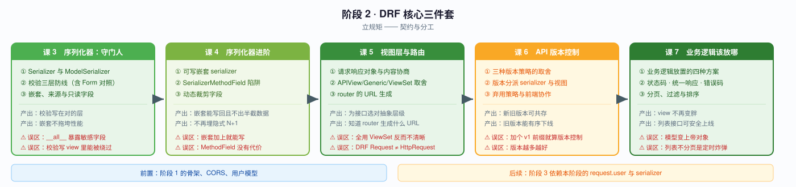
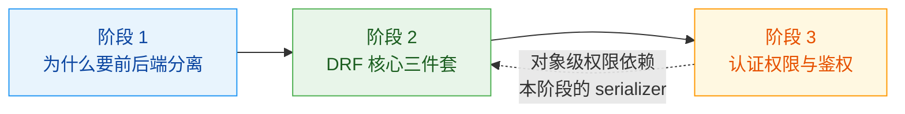

# 阶段 2：DRF 核心三件套

> 📖 故事章节：**立规矩** —— 契约与分工
> 🎯 本阶段回答：请求进来后，谁校验、谁处理、谁路由？API 改版了怎么办？

---

## 阶段目标

| 目标 | 达成标志 |
|------|----------|
| 把校验写在对的层 | 字段级/对象级/跨字段校验都在 Serializer，且能看懂老项目的 Form 写法 |
| 看懂并写对序列化器 | 会用 ModelSerializer，也知道自动生成规则的边界在哪 |
| 实现可写嵌套 | 真实项目的嵌套不是只读的，能正确处理 create/update 与原子性 |
| 选对视图抽象 | 不盲目用 ViewSet，知道何时该用 APIView |
| 让 API 可演进 | 前后端独立发版，新旧版本能共存并有序下线 |
| 视图不再变胖 | 业务逻辑有明确归属，接口响应结构统一 |

---

## 学习重点

### 🔑 必须掌握的知识点

| 课 | 知识点 | 为什么必须掌握 | 关键点 |
|----|--------|---------------|--------|
| 课 3 | Serializer 与 ModelSerializer 的分工 | 用错会导致要么啰嗦要么失控 | 本质区别 / 何时用哪个 / 自动生成边界 |
| 课 3 | 校验的三层防线 | 校验放错层，接口必然出漏洞 | 字段级 / 对象级 / 跨字段 / **与 Form 对照** |
| 课 3 | 嵌套、来源与只读字段 | 最基础的读写控制手段 | 嵌套 / source / read_only 与 write_only |
| 课 4 | 可写嵌套 serializer | **教材只讲只读嵌套，真实项目卡在这里** | create/update 手写 / 原子性 / 何时该拆接口 |
| 课 4 | SerializerMethodField 的性能陷阱 | 它是**隐式 N+1 的常见来源** | 成因 / 与 annotate 对比 / 替代方案 |
| 课 4 | 动态裁剪字段 | 一个 serializer 服务多个场景的常用手法 | `__init__` 改 fields / 按 action 分派 |
| 课 5 | 请求响应对象与内容协商 | DRF 与 Django 原生视图的分水岭 | Request/Response 差异 / 渲染器解析器 |
| 课 5 | APIView/GenericAPIView/ViewSet 取舍 | 抽象选错，后期改不动 | 抽象层级 / 决策树 / 何时不用 ViewSet |
| 课 5 | 路由与 router | 手写路由 vs 自动生成的选择 | 生成规则 / 额外 action / 自定义路由 |
| 课 6 | 三种版本策略的取舍 | **前后端独立发版，没有版本控制必然互相拖累** | URL / Query / Accept 头 / 各自代价 |
| 课 6 | 版本分派 | 版本不是换 URL 就完事 | 分派 serializer / 复用与隔离 / 命名空间 |
| 课 6 | 弃用策略与前端协作 | 旧版本没人敢下线，会变成永久包袱 | 公告机制 / 双版本窗口 / 下线清单 |
| 课 7 | 业务逻辑放置的四种方案 | **分离项目最常见的腐化点是 view 变胖** | view/serializer/model/service 对比 |
| 课 7 | 状态码、统一响应与错误码 | 前端最怕千奇百怪的错误结构 | 状态码语义 / 统一封装 / 错误码与 handler |
| 课 7 | 分页、过滤与排序 | 列表接口不加这些等于给数据库找麻烦 | 分页器选型 / 过滤后端 / 排序配置 |

### 🐞 本阶段高频误区（先打个预防针）

| 误区 | 真相 |
|------|------|
| "ModelSerializer 能自动生成，那就都用它" | 自动生成规则有明确边界，跨模型校验和权限相关字段必须手写 |
| "嵌套 serializer 加上就能写" | 可写嵌套必须手写 `create`/`update`，否则静默失败 |
| "SerializerMethodField 很方便" | 每个实例触发一次查询，是**隐式 N+1**；能用 `annotate` 预计算就别用它 |
| "ViewSet 最先进，全都用 ViewSet" | 非标准资源、多动作聚合的接口，用 ViewSet 反而绕 |
| "API 上加个 v1 前缀就是版本控制" | 版本控制还包括 serializer 分派、弃用公告、下线流程 |

---

## 本阶段路径图

---

## 阶段前置与后续

**前置依赖**：阶段 1 的分层骨架、用户模型、CORS 配置。
**后续**：阶段 3 的对象级权限依赖本阶段的 serializer 与 queryset；阶段 4–6 的性能优化要改的 queryset 也在本阶段的 ViewSet 里。

---

🚀 进入 [课 3《序列化器：API 的边界守门人》](./lessons/lesson-03-序列化器API的边界守门人.md)
