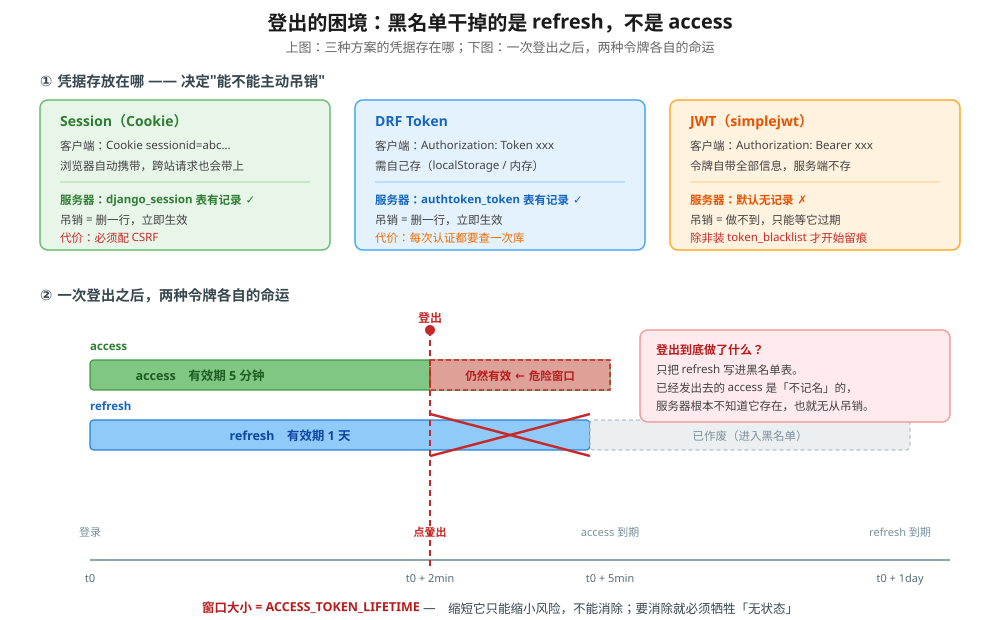

# 课 8　认证：你是谁

> 📖 情节定位：**守门（一）** —— 第一个守门人上岗
> 🎯 本课目标：选对认证方式，落地 JWT 并清楚它的边界
> 🔗 承接：课 7 的 API 已经跑通，但它现在**完全裸奔**——谁都能调，谁都能改
> 🔗 后续：课 9 回答"你能干什么"（权限），课 10 回答分离架构下的攻击面

---

## 第一幕 · 场景引入

课 7 结束时，你的文章接口长这样：

```python
class ArticleListCreateView(generics.ListCreateAPIView):
    serializer_class = ArticleSerializer
    permission_classes = [IsAuthenticated]     # ← 写了
    ...
```

你写了 `IsAuthenticated`，但**没配认证方式**。DRF 的默认认证类是 `SessionAuthentication` + `BasicAuthentication`（`rest_framework/settings.py:40`，已核实）——而你的前端是个独立的 Vue 应用，跑在 `localhost:5173`，它既没有 session cookie，也不会弹 Basic 认证框。

结果是：所有请求一律被拒。接口很安全，因为**谁都用不了**。

> 🔍 **顺带一个容易被忽略的细节**：这时候返回的其实是 **403**，不是 401。
>
> ```text
> DRF 默认（Session + Basic）  GET /api/articles/ -> 403   WWW-Authenticate = None
> 配好 JWT 之后                GET /api/articles/ -> 401   WWW-Authenticate = 'Bearer realm="api"'
> ```
>
> 同一个权限失败，响应码却不同。原因是 DRF 用「有没有 `WWW-Authenticate` 挑战头」来决定返回哪个：认证类提供了挑战头就 `401`（告诉客户端"你得证明身份"），提供不了就 `403`（只是拒绝）。`SessionAuthentication` 靠 cookie，没什么可"挑战"的，所以是 `403`。
>
> 这条在调前端时很实用：**看到 403 别急着查权限，先确认认证类配没配。**

于是你去查资料。前十篇文章口径高度一致：

> "前后端分离就用 JWT。"
> "Session 依赖 cookie，跨域不方便。"
> "JWT 无状态，服务端不用存，天然适合分布式。"

你装上 `djangorestframework-simplejwt`，照着 README 配好，登录接口跑通了：

```json
{ "access": "eyJhbGciOiJIUzI1NiIsInR5cCI6IkpXVCJ9...",
  "refresh": "eyJhbGciOiJIUzI1NiIsInR5cCI6IkpXVCJ9..." }
```

前端把 `access` 塞进 `Authorization: Bearer <token>`，请求通了，`200`。你松了口气。

**一周后，产品提了个需求**："用户点了退出登录，他换台设备就不能再进了——现在能立刻生效吗？"

你打开代码，发现 `logout` 接口是这样的：

```python
class JwtLogoutView(TokenBlacklistView):
    ...
```

你调了它，返回 `200`。你以为搞定了。然后你顺手用**登出前拿到的那个 access** 又打了一次接口——

```
GET /api/jwt-only/ -> 200
{'认证方式': 'JWTAuthentication', '用户': 'alice'}
```

**还是通的。** 用户"已经登出"，但他的令牌照样能访问你的 API。

这不是 bug，这是 JWT 的设计。而你要是不知道，就会带着一个自以为安全的登出功能上线。

---

## 第二幕 · 认知困惑

### 困惑一：JWT"无状态"明明是优点，怎么成了麻烦？

所有教程都把"无状态"写在优点那一栏：服务端不存 session，扩容时不用做 session 同步，天然适合微服务。

但没人告诉你下半句：

> **服务端不存，就意味着服务端管不着。**

一个 session，你删掉数据库里那一行，它立刻失效。一个 JWT，它是一张**不记名的纸条**，谁拿着谁就能用，服务端连它存不存在都不知道。

"无状态"和"无法主动吊销"是同一件事的两种说法。你选了前者，就必然得到后者。

### 困惑二：前后端分离了，Session 是不是就该淘汰？

不一定。

如果你的前端和 API **部署在同一个域名下**（`example.com` 和 `example.com/api/`），cookie 照发、session 照用，CSRF 配一下就行——这是 Django 最成熟、坑最少的一条路。

真正让 Session 变麻烦的是**跨域**：`localhost:5173` 的前端要给 `api.example.com` 发请求，cookie 的 `SameSite`、`Domain`、以及第三方 cookie 政策会让你掉进一连串坑里。

**是跨域让 Session 变麻烦的，不是"前后端分离"这件事本身。** 这两者经常被混为一谈。

### 困惑三：登出不就是把 token 删掉吗，有什么难的？

删客户端的 token，只是让用户浏览器忘了它——**服务端不知道，那个字符串本身依然有效**。谁要是复制过一份，照样能用。

要真正"登出"，必须让服务端有办法说"这个令牌我不再认了"。而这就需要一个服务端记录——**绕了一圈，你又回到"有状态"了**。

---

## 第三幕 · 层层揭示

### 知识点 1：Session 与 Token 的适用边界

#### 是什么

三种方案的本质区别只有一个：**服务端有没有留下可查、可删的记录。**

| 方案 | 客户端怎么带 | 服务端存了什么 | 吊销方式 |
|------|-------------|---------------|---------|
| **Session** | Cookie `sessionid`（浏览器自动带） | `django_session` 表一行 | 删一行，立即生效 |
| **DRF Token** | `Authorization: Token xxx` | `authtoken_token` 表一行 | 删一行，立即生效 |
| **JWT** | `Authorization: Bearer xxx` | **默认什么都不存** | 做不到，只能等过期 |

这张表的第一列已经在课 8 实验 1 里逐项验证过了——**服务端记录的行数是数出来的，不是推断的**。

#### 为什么

服务端有没有记录，直接决定了四件事能不能做到：

| 能力 | Session / DRF Token | JWT（默认） |
|------|---------------------|------------|
| 主动吊销单个令牌 | ✅ 删一行 | ❌ |
| 强制下线某用户的所有设备 | ✅ 按 user 删 | ❌ |
| 查"用户当前有几台设备在线" | ✅ 数一下 | ❌ |
| 扩容时免同步状态 | ❌ 需要共享存储 | ✅ |

前三项是安全运营的刚需，最后一项是架构上的便利。**这是一笔交易，不是免费午餐。**

#### 怎么用

**同域部署（前端 `example.com`、API `example.com/api/`）—— 用 Session 完全没问题：**

```python
# settings.py
REST_FRAMEWORK = {
    "DEFAULT_AUTHENTICATION_CLASSES": [
        "rest_framework.authentication.SessionAuthentication",
    ],
}
```

代价只有一条：**必须配 CSRF**（下面会看到不配的真实报错）。

**真正的跨域 / 多端（Web + App + 小程序）—— 用 JWT：**

```python
# settings.py
REST_FRAMEWORK = {
    "DEFAULT_AUTHENTICATION_CLASSES": [
        "rest_framework_simplejwt.authentication.JWTAuthentication",
    ],
}

SIMPLE_JWT = {
    "ACCESS_TOKEN_LIFETIME": timedelta(minutes=5),
    "REFRESH_TOKEN_LIFETIME": timedelta(days=1),
    "ROTATE_REFRESH_TOKENS": True,
    "BLACKLIST_AFTER_ROTATION": True,
    "AUTH_HEADER_TYPES": ("Bearer",),
}
```

#### 边界 —— 用 Session 就必须配 CSRF

这是本课**第二个实测重点**。DRF 的 `SessionAuthentication` 对写操作**强制 CSRF 校验**，躲不掉：

```text
【已登录】POST（不带 CSRF token） -> 403
  detail = CSRF Failed: CSRF token missing.
```

补上 `X-CSRFToken` 之后：

```text
【已登录】POST（带 X-CSRFToken） -> 200 通过
```

而换成 JWT，同样的 POST、`enforce_csrf_checks=True` 的测试客户端：

```text
【对照】JWT + enforce_csrf_checks 的 POST -> 201（不需要 CSRF）
```

原因很直白：**CSRF 之所以成立，是因为浏览器会自动带上 cookie**。JWT 的凭据在 `Authorization` 头里，浏览器不会自动加，攻击者构造的跨站请求里没有这个头，攻击自然无从发起。

> ⚠️ **这条有个前提**：JWT 必须放在 `Authorization` 头里。**如果你把 JWT 存进 cookie 并让服务端从 cookie 读，那它就退化成了 cookie 方案，CSRF 防护照样要配。** 这是课 10 的主题。

#### 误区

- ❌ **"前后端分离就该用 JWT"** —— 分离的是**渲染权**（课 1），不是认证方式。同域部署下 cookie + session 依然是坑最少的路。
- ❌ **"DRF 默认就安全"** —— 默认的是 `SessionAuthentication` + `BasicAuthentication`，纯 API 项目下它只会让你全部 `401`。

#### 怎么验证

```python
# 想确认"这次请求到底靠什么认证通过的"，看这个：
request.successful_authenticator      # 胜出的认证类实例
request.auth                          # 认证凭据对象
```

课 8 实验 12 用它验证了多认证类并存时的优先级：三个认证类按 `DEFAULT_AUTHENTICATION_CLASSES` 顺序依次尝试，**第一个成功的胜出**。JWT 排在 Session 前面时，同时带两种凭据，胜出的是 `JWTAuthentication`。

---

### 知识点 2：JWT 原理与 simplejwt 落地

#### 是什么

一个 JWT 就是三段用点号连起来的字符串：

```text
eyJhbGciOiJIUzI1NiIsInR5cCI6IkpXVCJ9 . eyJ0b2tlbl90eXBlIjoiYWNjZXNzIiwiZXhwIjox... . TqxW30EF8gAi95147xMfmJEX...
└────────── header ────────────────┘   └────────────── payload ──────────────────┘   └────── signature ──────┘
```

实测解出来的内容：

```text
header  = {'alg': 'HS256', 'typ': 'JWT'}
payload = {'token_type': 'access', 'exp': 1788337254, 'iat': 1788336954,
           'jti': 'fab8b607caf545138ee98c55e608c175', 'user_id': '15'}
signature = xpWKOnADUcJfnvIK7I3eU_Gp… （43 字符）
```

标准依据是 **RFC 7519**（*JSON Web Token*，M. Jones / J. Bradley / N. Sakimura，2015 年 5 月，Standards Track），配套的最佳实践是 **RFC 8725**。

#### 为什么 —— payload 是编码，不是加密

这是最容易被误解的一点。实测：

```text
任何人拿到 token 都能解出：user_id=15 exp=1788337254 jti=fab8b607...
-> 只是 base64url 编码，不是加密。
```

第二段是 **base64url**（URL 安全变体，无 `=` 填充），任何人补上填充字符就能 `base64.b64decode` 出来。JWT 保证的是**完整性**（改了会被发现），不是**机密性**（内容谁都能看）。

> 🚨 **所以 payload 里不能放敏感信息**——手机号、身份证、角色权限清单，全都能被客户端读到。要放机密内容得用 JWE（加密型 JWT），那是另一个标准（RFC 7516），simplejwt 默认不走这条路。

#### 怎么用 —— 安装与配置

```bash
pip install djangorestframework-simplejwt
```

```python
# settings.py
INSTALLED_APPS = [
    ...
    "rest_framework_simplejwt",
    "rest_framework_simplejwt.token_blacklist",   # 想要登出功能就必装，知识点 3 讲
]

REST_FRAMEWORK = {
    "DEFAULT_AUTHENTICATION_CLASSES": [
        "rest_framework_simplejwt.authentication.JWTAuthentication",
    ],
}
```

```python
# urls.py
from rest_framework_simplejwt.views import (
    TokenObtainPairView, TokenRefreshView, TokenBlacklistView,
)

urlpatterns = [
    path("api/token/", TokenObtainPairView.as_view(), name="token_obtain_pair"),
    path("api/token/refresh/", TokenRefreshView.as_view(), name="token_refresh"),
    path("api/token/logout/", TokenBlacklistView.as_view(), name="token_blacklist"),
]
```

#### 边界 —— 签名的能力与不能

签名能挡住什么？实验 4 测了四种情况：

| 攻击 | 结果 |
|------|------|
| ① 篡改 payload（把 `user_id` 换成别人的） | `401` `code=token_not_valid` |
| ② 篡改 signature（改掉最后一个字符） | `401` `code=token_not_valid` |
| ③ 用另一把密钥签一个格式完全合法的 token | `401` —— 结构一个 claim 都不缺，签名对不上 |
| ④ 拿 refresh 当 access 用 | `401` `code=token_not_valid` |

③ 值得单独说：我在独立进程里用另一把 `SIGNING_KEY` 签了一个 token，解出来的 payload 是：

```text
{'token_type': 'access', 'exp': 1788336848, 'iat': 1788336548,
 'jti': '536c8140743d45ef967dc21e8910aacd', 'user_id': '7'}
```

**完全合法，一个 claim 都不缺。** 但拿它访问原服务照样被拒——因为签名是用 payload + 密钥算出来的，密钥不对，签名就对不上。

**签名挡不住的**：令牌一旦泄露，在它过期之前，服务端没有任何办法区分"本人"和"捡到的人"。

#### 无状态的真实代价（本课实测的核心）

实验 6 跑了一遍"用户出事了，已签发的令牌还有效吗"：

```text
carol 登录，拿到 access / refresh（默认 CHECK_REVOKE_TOKEN=False）
  改密码前 用 access -> 200
改密码为 BrandNewPassw0rd!2026
  改密码后 用 access -> 200 仍然有效！
  改密码后 用 refresh 换新的 -> 200 仍然有效！
  禁用账号后 用 access -> 401 已失效 ✓
```

三条结论：

1. **改密码不影响已签发的令牌**——用户发现被盗后改密码，小偷手里的 access 照样能用。
2. **refresh 也不受影响**——还能继续换新 access，等于无限续期。
3. **禁用账号能挡住** —— 但这不是"无状态"的功劳。它靠的是 `CHECK_USER_IS_ACTIVE`（默认 `True`），而它能判断的前提是**用户对象已经从库里读出来了**。这本身就是对"无状态"的一处让步。

第 3 条容易被忽略：**JWT 并不是真的完全不查库**。

实测每次已认证请求的 SQL 次数：

| 方案 | SQL 次数 | 那一次在干什么 |
|------|---------|--------------|
| Session | **2** | 读 `django_session` + 读用户表 |
| DRF Token | **1** | 读 `authtoken_token`（join 用户） |
| JWT | **1** | `SELECT ... FROM users_user WHERE id = ?` |

第三行值得停下来看。我一开始以为是 `CHECK_USER_IS_ACTIVE` 造成的，于是把它关掉重测——**还是 1 次**。抓出 SQL 才看清真正的原因：

```python
# simplejwt authentication.py:132
user = self.user_model.objects.get(**{api_settings.USER_ID_FIELD: user_id})
```

**这是因为 DRF 需要把 token 里的 `user_id` 解析成一个真正的 `User` 对象挂到 `request.user` 上**，跟"状态检查"没关系。`CHECK_USER_IS_ACTIVE` 只是顺手用这个已加载的对象判断一下 `is_active`，不额外产生查询。

> 💡 想要真正的零查询，simplejwt 提供了 `JWTStatelessUserAuthentication`——它返回一个由 token 支撑的 `TokenUser` 对象而不查库。代价是 `request.user` 不再是真正的 `User` 实例，业务代码里凡是要 `user.xxx` 访问数据库字段的地方都会失效。**除非接口压到极致，一般不建议。**

**所以"JWT 无状态所以更快"这个说法需要打折**：在查询次数上，JWT 和 DRF Token 打平，只比 Session 少一次。JWT 真正的优势是**扩容时不需要共享存储**，不是"少查库"。

如果你的业务需要"改密码即下线所有设备"，simplejwt 5.5 提供了一个开关（**实测确认，5.5.1 的 `settings.py` 里确有此项**）：

```python
SIMPLE_JWT = {
    "CHECK_REVOKE_TOKEN": True,        # 默认 False
    "REVOKE_TOKEN_CLAIM": "hash_password",
}
```

开启后实测：

```text
CHECK_REVOKE_TOKEN=True 时的 payload =
  {'token_type': 'access', 'exp': ..., 'iat': ..., 'jti': '...', 'user_id': '8',
   'hash_password': 'B2DD1A30F808AB7DB85AA74EC616E5B9'}
  改密码前 -> 200
  改密码后 -> 401 已失效 ✓
    detail=The user's password has been changed.
```

原理（官方文档措辞）：把用户当前密码的 md5 存进 payload，认证时与库中密码比对，不一致即视为已撤销。

> ⚖️ **代价**：又多一次查库 + 令牌里多一个 claim。**"无状态"这个优点，每加一道安全就要打一折。** 这不是缺陷，是取舍——关键是你要知道自己折了什么。

#### 误区

- ❌ **"JWT payload 是加密的"** —— 是 base64url 编码，谁都能解。
- ❌ **"改了密码令牌就失效了"** —— 默认完全不影响，需要显式开 `CHECK_REVOKE_TOKEN`。
- ❌ **"用 JWT 就完全不用查库"** —— 每次认证必查一次用户表（把 `user_id` 解成 User 对象），与 `CHECK_USER_IS_ACTIVE` 无关。

---

### 知识点 3：刷新、轮换与黑名单

#### 是什么 —— 两个令牌的分工

simplejwt 登录返回两个令牌，寿命差了 288 倍：

```text
ACCESS_TOKEN_LIFETIME  = 0:05:00
REFRESH_TOKEN_LIFETIME = 1 day, 0:00:00
```

| | 用途 | 寿命 | 谁来验 |
|---|---|---|---|
| **access** | 访问业务接口 | 5 分钟 | 每个受保护接口的认证类 |
| **refresh** | **只用来换新的 access** | 1 天 | 只有 `/token/refresh/` 端点 |

实测的边界：

```text
用 refresh 换 access -> 200，返回字段 = ['access']
用 access 去换 -> 401 detail=令牌类型错误
把 refresh 当 access 用 -> 401
```

分工的意义：**把长命凭据的暴露面压到最小**。refresh 只在换发那一刻出现一次，其余时间 access 打头阵，泄露了也就 5 分钟。

#### 为什么 —— 轮换是为了检测盗用

`ROTATE_REFRESH_TOKENS` 控制"换发时给不给新的 refresh"。三档实测：

| 配置 | 换发返回 | 旧 refresh 还能用吗 |
|------|---------|-------------------|
| `ROTATE=False`（默认） | 只有 `access` | **能，永远能** —— 泄露即永久有效 |
| `ROTATE=True` + `BLACKLIST_AFTER_ROTATION=False` | `access` + 新 `refresh` | **能** ← 换了个寂寞 |
| `ROTATE=True` + `BLACKLIST_AFTER_ROTATION=True` | `access` + 新 `refresh` | `401 令牌已被加入黑名单` |

中间那档是本课最想让你记住的反例：

```text
【只轮换，不拉黑】
  换发返回字段 = ['access', 'refresh']
  新 refresh 与旧的相同？False
  旧的 refresh 再用 -> 200 仍可用 ← 轮换但不拉黑，等于没防住
```

**发了新令牌，旧的也没作废。** 你以为做了轮换，实际上攻击面一点没缩小。

轮换 + 拉黑真正的作用不只是"换新的"，而是**盗用检测**：

- 正常用户：每次换发，旧 refresh 作废，手上永远只有一条有效链。
- 攻击者偷到 refresh 并用了一次：下一次合法用户换发时，这条 refresh 已在黑名单里 → **服务端立刻知道出问题了**。

官方文档对 `BLACKLIST_AFTER_ROTATION` 的要求写得很明确：*You need to add `'rest_framework_simplejwt.token_blacklist'` to your `INSTALLED_APPS` ... to use this setting.*（**文档明示**）

#### 怎么用 —— 登出，以及它的困境

```python
# urls.py
path("api/token/logout/", TokenBlacklistView.as_view(), name="token_blacklist"),
```

前端调它时把 refresh 传过去。**然后看实验 9 的结果**：

```text
POST /api/jwt/logout/ （把 refresh 拉黑） -> 200
用已登出的 refresh 换新 access -> 401 detail=令牌已被加入黑名单

【关键】用登出前签发的 access 访问 -> 200 仍然通过！
  这个 access 距过期还有 300 秒
  -> 登出只干掉了 refresh。access 在自己的生命周期内**依然畅通**。
```



**这就是登出的困境**：黑名单里存的是 refresh 的 `jti`，access 从来没被记录过，服务端无从吊销它。

#### 边界 —— 三种应对，都不是免费的

| 方案 | 怎么做 | 代价 |
|------|-------|------|
| **缩短 access 寿命** | `ACCESS_TOKEN_LIFETIME` 调到 1~2 分钟 | 只缩小窗口，不消除；refresh 请求变频繁 |
| **关键操作前查库** | 改密码 / 支付 / 改绑手机前重新验一次用户状态 | 牺牲无状态，换确定性 |
| **连 access 一起进黑名单** | 自定义认证类，验 access 时也查黑名单表 | 每次认证多一次查询，等于放弃无状态 |

第二种最实用——**不是所有接口都需要"立刻下线"，只有敏感操作需要**。把有限的状态查询用在刀刃上，比全局加黑名单划算。

示意代码（第三种，需要时再上）：

```python
from rest_framework_simplejwt.authentication import JWTAuthentication
from rest_framework_simplejwt.token_blacklist.models import BlacklistedToken


class StrictJWTAuthentication(JWTAuthentication):
    """连 access 一起验黑名单。

    代价：每次认证多一次数据库查询，等于放弃 access 的「无状态」。
    只在确实需要「登出立即生效」的接口上用。
    """

    def get_validated_token(self, raw_token):
        token = super().get_validated_token(raw_token)
        jti = token[api_settings.JTI_CLAIM]
        if BlacklistedToken.objects.filter(token__jti=jti).exists():
            raise InvalidToken({"detail": "令牌已被加入黑名单",
                                "code": "token_not_valid"})
        return token
```

#### 🚨 一个必须单独讲的坑：不装黑名单 app，登出是**假成功**

这是本课最阴的一个发现。把 `rest_framework_simplejwt.token_blacklist` 从 `INSTALLED_APPS` 里去掉，然后调登出接口：

```text
不装黑名单 app 时调 /api/jwt/logout/ -> 200 响应体=b'{}'
登出后再用同一个 refresh 换 access -> 200 ← refresh 仍然可用：登出是假成功
```

**返回 200，响应体是空的 `{}`，什么都不说。** 而那个 refresh 根本没失效。

同时，黑名单模型也整个不可用：

```text
访问 OutstandingToken 失败：AttributeError: type object 'OutstandingToken' has no attribute 'objects'
```

为什么这么安静？看 `TokenBlacklistSerializer` 的源码（simplejwt 5.5.1，`serializers.py:183`）：

```python
class TokenBlacklistSerializer(serializers.Serializer):
    refresh = serializers.CharField(write_only=True)
    token_class = RefreshToken

    def validate(self, attrs):
        refresh = self.token_class(attrs["refresh"])
        try:
            refresh.blacklist()
        except AttributeError:      # ← 就是这一行
            pass
        return {}
```

`blacklist()` 方法不是 `RefreshToken` 自带的，而是 `token_blacklist` app 装上之后挂上去的。实测：

```text
不装 app 时 RefreshToken.blacklist 存在? False
装了 app 时 RefreshToken.blacklist 存在? True
```

app 没装 → `refresh.blacklist()` 抛 `AttributeError` → 被 `except AttributeError: pass` **吞掉** → `return {}` → 视图拿到"校验通过"，返回 `200`，响应体是空字典。

**整个过程没有一个 warning、没有一行日志。**

> 🔍 **怎么自查**：登出之后，**拿那个 refresh 再去调一次 `/token/refresh/`**。返回 `401` 才是真的登出了；返回 `200` 说明你的登出是摆设。
> 这条值得写进你的集成测试——它属于"不报错、不警告、只有真去验才知道"的那一类。

#### 误区

- ❌ **"登出后用户就安全了"** —— access 在它自己的生命周期内依然畅通。
- ❌ **"开了 ROTATE 就够了"** —— 必须同时开 `BLACKLIST_AFTER_ROTATION`，否则旧的照样能用。
- ❌ **"登出接口返回 200 就是登出成功了"** —— 不装 `token_blacklist` app 时，它永远返回 200，但什么都不做。

---

## 第四幕 · 实操验证

### 验证环境

| 项 | 值 |
|---|---|
| Python | 3.13（托管 venv `dj-course`） |
| Django | **6.1** |
| DRF | **3.18.0** |
| djangorestframework-simplejwt | **5.5.1** |
| PyJWT | 2.13.0 |
| 数据库 | SQLite（每次运行重建） |

> ⚠️ **版本兼容性说明（实测，非推断）**：simplejwt 5.5.1 的 PyPI classifiers 只声明到 **Django 5.2**，与课 2 的 `django-cors-headers` 是同一类情况——**官方未明示支持 6.1**。本课在 Django 6.1 上完整跑通了全部 15 个实验（签发、验签、过期、轮换、黑名单），结论是**实测可用**。但这是实现行为不是契约保证，升级大版本时值得重验。

> ⚠️ **另一个版本差异**：simplejwt 官方文档站（`readthedocs` latest）的 settings 默认值里含 `ON_LOGIN_SUCCESS` / `ON_LOGIN_FAILED` 两项，**它们不在已发布的 5.5.1 里**。文档比发布版新，照抄文档配置前先确认你装的版本有没有这一项。

> ⚠️ **实验方法警示（本课踩到的坑）**：**`override_settings(SIMPLE_JWT=...)` 对 simplejwt 是无效的。**
>
> `rest_framework_simplejwt.authentication` 和 `.tokens` 在 import 时执行了 `from .settings import api_settings`，把对象**引用**绑进了自己的命名空间。`override_settings` 触发 `reload_api_settings` 后，`settings` 模块会把全局 `api_settings` 重新指向一个**新对象**，但那两个模块仍指向**旧对象**。
>
> 实测证据：
> ```text
> settings.api_settings.ACCESS_TOKEN_LIFETIME = 0:00:01   ← 新的，生效了
> auth.api_settings.ACCESS_TOKEN_LIFETIME     = 0:05:00   ← 旧的，没生效
> 实际签出的 token：exp - iat = 300 秒                     ← 用的是旧值
> ```
>
> 我最初按"改了就生效"写了三个实验，跑出来的结论全是错的（1 秒过期的 token 睡了 1.5 秒还能用）。
> **凡是要改 `SIMPLE_JWT` 配置做对照实验，一律用独立 settings 模块 + 独立进程**（课 2 验证中间件顺序时是同款手法）。

### 实验 1：三种方案的凭据存放在哪

```text
【Session】POST /api/session/login/ -> 200
  django_session 表行数 = 1  <- 服务器端有记录
【DRF Token】POST /api/drf-token/login/ -> 200
  authtoken_token 表行数 = 1  <- 服务器端有记录
【JWT】POST /api/jwt/login/ -> 200
  OutstandingToken 表：0 -> 1 行   ⚠️ 有记录！因为本项目装了 token_blacklist app

----- 对照组：不装 token_blacklist app -----
  token_blacklist app 已安装？False
  访问 OutstandingToken 失败：AttributeError: type object 'OutstandingToken' has no attribute 'objects'
  不装黑名单 app 时调 /api/jwt/logout/ -> 200 响应体=b'{}'
  登出后再用同一个 refresh 换 access -> 200 ← refresh 仍然可用：登出是假成功
```

**结论**：Session / DRF Token 天生有状态；JWT 默认无状态，**只有装了 `token_blacklist` 才开始留痕**，而登出功能依赖这份留痕。

### 实验 2：SessionAuthentication 强制 CSRF

```text
【未登录】GET  -> 403 身份认证信息未提供。
登录 -> 200
【已登录】GET  -> 200 通过
【已登录】POST（不带 CSRF token） -> 403
  detail = CSRF Failed: CSRF token missing.
取到 csrftoken cookie = 12yxWP259rbm5No9…
【已登录】POST（带 X-CSRFToken） -> 200 通过

【对照】JWT + enforce_csrf_checks 的 POST -> 201（不需要 CSRF）
```

### 实验 3：JWT 结构解剖

```text
access  共 3 段，总长 232 字符
  header    = {'alg': 'HS256', 'typ': 'JWT'}
  payload   = {'token_type': 'access', 'exp': 1788337254, 'iat': 1788336954,
               'jti': 'fab8b607...', 'user_id': '15'}
  signature = xpWKOnADUcJfnvIK7I3eU_Gp… （43 字符）

refresh 共 3 段，总长 233 字符
  payload   = {'token_type': 'refresh', 'exp': 1788423354, ...}
```

### 实验 4：签名验真（四种篡改）

```text
【基线】正确 token -> 200 {'认证方式': 'JWTAuthentication', '用户': 'alice'}
① 篡改 payload  -> 401  code=token_not_valid
② 篡改签名      -> 401  code=token_not_valid
③ 用另一把密钥签的合法格式 token -> 401
④ 把 refresh 当 access 用        -> 401  code=token_not_valid
```

### 实验 5：过期

```text
签发的 access：exp - iat = 1 秒
  立刻用       -> 200 通过
  1.5 秒后用   -> 401  detail=此令牌对任何类型的令牌无效
     code=token_not_valid
     messages=[{'token_class': 'AccessToken', 'token_type': 'access',
                'message': 'Token is expired'}]
```

### 实验 6：无状态的代价

```text
carol 登录（默认 CHECK_REVOKE_TOKEN=False）
  改密码前 用 access -> 200
  改密码后 用 access -> 200 仍然有效！
  改密码后 用 refresh 换新的 -> 200 仍然有效！
  禁用账号后 用 access -> 401 已失效 ✓   （靠 CHECK_USER_IS_ACTIVE）

----- CHECK_REVOKE_TOKEN=True -----
  payload 多出 'hash_password': 'B2DD1A30F808AB7DB85AA74EC616E5B9'
  改密码前 -> 200
  改密码后 -> 401 已失效 ✓  detail=The user's password has been changed.
```

### 实验 7：access / refresh 分工

```text
ACCESS_TOKEN_LIFETIME  = 0:05:00
REFRESH_TOKEN_LIFETIME = 1 day, 0:00:00

用 refresh 换 access -> 200，返回字段 = ['access']
用 access 去换       -> 401 detail=令牌类型错误
```

### 实验 8：轮换三档对照

```text
【关闭轮换】
  第 1/2/3 次用同一个 refresh -> 200 返回字段=['access']
  -> refresh 永不变，一旦泄露就永久有效

【只轮换，不拉黑】
  换发返回字段 = ['access', 'refresh']
  新 refresh 与旧的相同？False
  旧的 refresh 再用 -> 200 仍可用 ← 轮换但不拉黑，等于没防住

【轮换 + 拉黑】
  换发 -> 200，返回字段 = ['access', 'refresh']
  旧 refresh 再用 -> 401 detail=令牌已被加入黑名单
  新的 refresh 继续用 -> 200（应正常）
```

### 实验 9：登出的困境

```text
POST /api/jwt/logout/ （把 refresh 拉黑） -> 200
用已登出的 refresh 换新 access -> 401 detail=令牌已被加入黑名单

【关键】用登出前签发的 access 访问 -> 200 仍然通过！
  这个 access 距过期还有 300 秒
```

### 实验 10：不装黑名单 app 时的假登出

```text
不装黑名单 app 时调 /api/jwt/logout/ -> 200 响应体=b'{}'
登出后再用同一个 refresh 换 access -> 200 ← refresh 仍然可用：登出是假成功
```

### 实验 11：有状态方案的吊销有多简单

```text
用 DRF Token 访问 -> 200 {'认证方式': 'TokenAuthentication', '用户': 'alice'}
删掉数据库里那一行之后 -> 401 detail=认证令牌无效。
```

### 实验 12：多个认证类并存时谁说了算

```text
DEFAULT_AUTHENTICATION_CLASSES 顺序：
  1. JWTAuthentication    2. SessionAuthentication    3. TokenAuthentication

只带 JWT：            -> 认证方式 = JWTAuthentication
只带 DRF Token：      -> 认证方式 = TokenAuthentication
同时带 JWT + session： -> 认证方式 = JWTAuthentication（列表里 JWT 排前面）
```

### 实验 13：没配认证类时，拒绝的是 401 还是 403

```text
【不配 DEFAULT_AUTHENTICATION_CLASSES，用 DRF 默认值】
  生效的 DEFAULT_AUTHENTICATION_CLASSES：
     - SessionAuthentication
     - BasicAuthentication
  纯 API 客户端 GET /api/articles/ -> 403
    WWW-Authenticate = None

【配好 JWT 之后（本工程基线配置）】
  纯 API 客户端 GET /api/articles/ -> 401
    WWW-Authenticate = 'Bearer realm="api"'
```

**结论**：认证类能提供 `WWW-Authenticate` 挑战头 → `401`；提供不了 → `403`。

### 实验 14：为什么 app 没装时登出还能返回 200

```text
blacklist() 方法是否随 app 安装而出现：
【装了 token_blacklist】    RefreshToken.blacklist 存在? True
【不装 token_blacklist】    RefreshToken.blacklist 存在? False
```

配合 `serializers.py:183` 的 `except AttributeError: pass`，整条因果链闭合。

### 实验 15：「无状态」真的更省查询吗

```text
Session   : 2 次   （读 django_session + 读用户表）
DRF Token : 1 次   （读 authtoken_token，join 用户）
JWT       : 1 次   （读用户表）

把 CHECK_USER_IS_ACTIVE 关掉，JWT 会不会变成 0 次？
  CHECK_USER_IS_ACTIVE=False
  -> 已认证请求的 SQL 次数 = 1
     SQL: SELECT "users_user"."id", "users_user"."password", ...
  -> 还是 1 次。那次查询来自 get_user() 解析 User 对象，与状态检查无关。
```

### 附：实验工程结构

```text
auth_lab/
├── config/
│   ├── settings.py               # 基线配置
│   ├── settings_shortlived.py    # access 只有 1 秒（实验 5）
│   ├── settings_attacker.py      # 另一把 SIGNING_KEY（实验 4③）
│   ├── settings_revoke.py        # CHECK_REVOKE_TOKEN=True（实验 6）
│   ├── settings_rotate.py        # 轮换不拉黑（实验 8）
│   ├── settings_rotate_bl.py     # 轮换 + 拉黑（实验 8）
│   ├── settings_noblacklist.py   # 不装黑名单 app（实验 1/10/14）
│   ├── settings_default.py       # 不配认证类，用 DRF 默认（实验 13）
│   ├── settings_noactive.py      # CHECK_USER_IS_ACTIVE=False（实验 15）
│   └── urls.py
├── apps/
│   ├── users/                    # 自定义用户模型（延续课 2）
│   └── articles/
│       ├── views.py              # 三种认证各一份 + 探针视图
│       ├── serializers.py
│       └── urls.py
├── run_lab.py                    # 15 个实验一键复现
└── probe.py                      # 独立进程探针（配合各 settings 变体）
```

---

## 第五幕 · 体系收束

### 本课在全局中的位置

```text
阶段 1  渲染权移交 ──► 阶段 2  请求 → 视图 → 序列化器 → 业务 → 版本 → 响应
                                                                    │
                                                                    ▼
                                        阶段 3  守门：你是谁 / 你能干什么 / 攻击面
                                                └─ 课 8（本课）谁都能进 → 只有认证用户能进
                                                └─ 课 9  认证过了 ≠ 什么都能干（权限 / 限流）
                                                └─ 课 10 分离架构改变了哪些攻击面
```

课 2 你配过 `CORS_ALLOWED_ORIGINS`——那是**管住谁能从哪个页面发起请求**。课 8 管的是另一件事：**请求进来了，你是谁**。两者是两道门，都要配。

### 你现在会了什么

| 能力 | 判据 |
|------|------|
| 选对认证方案 | 能说清同域 / 跨域分别该选什么，而不是"一律 JWT" |
| 落地 JWT | 配好 simplejwt，知道 payload 不加密，知道签名挡什么、挡不住什么 |
| 说清无状态的代价 | 知道改密码不影响已签发令牌，知道 `CHECK_REVOKE_TOKEN` 这个开关及其代价 |
| 做对登出 | 知道黑名单只管 refresh，知道不装 `token_blacklist` 时登出是假成功 |
| 排查认证问题 | 会用 `request.successful_authenticator` 判断"到底哪个认证类放行了这次请求" |

### 一图总结

> 请求进来 → **`authenticators` 列表按序尝试，第一个成功的胜出** → 用户信息挂到 `request.user`
> → 凭据对象挂到 `request.auth` → 胜出者记在 `request.successful_authenticator`

而"能不能主动吊销"这件事，从你选方案那一刻就定了：

| | 有状态（Session / DRF Token） | 无状态（JWT 默认） |
|---|---|---|
| 吊销 | 删一行，立即生效 | 做不到，只能等过期 |
| 扩容 | 需要共享存储 | 无需同步 |
| 每次认证 | Session 2 次 / DRF Token 1 次 | JWT **1 次**（`get_user()` 解析用户对象，与状态检查无关） |

### 埋下的伏笔

1. **认证过了不等于什么都能干。** 本课所有受保护接口都只写了 `IsAuthenticated`——登录用户可以读**所有人**的数据。这就是课 9 的对象级权限要解决的越权问题。
2. **把 JWT 存进 cookie 会怎样？** 本课一直强调"凭据在 `Authorization` 头里，所以 CSRF 无从发起"。如果前端为了防 XSS 把 token 存进 `HttpOnly` cookie，这个前提就没了——课 10 会正面处理这个权衡。
3. **限流还没做。** 登录接口现在可以被无限次调用。课 9 的 `Throttling` 会补上。

### 阶段 3 进度

- [x] 课 8　认证：你是谁
- [ ] 课 9　权限：你能干什么
- [ ] 课 10　分离架构下的安全实践

---

## 🐞 本课误区速查

| 误区 | 真相 |
|------|------|
| "前后端分离就该用 JWT" | 分离的是渲染权，不是认证方式。**同域部署下 cookie + session 依然成立**，坑更少 |
| "用 Session 就不用管安全了" | `SessionAuthentication` 对写操作**强制 CSRF**，不配就 `403 CSRF Failed: CSRF token missing.` |
| "JWT 无状态，所以更好" | 无状态的代价是**无法主动吊销**。登出、封号、改密码下线都要额外做 |
| "JWT payload 是加密的" | 是 **base64url 编码**，谁都能解。别放敏感信息 |
| "改了密码令牌就失效了" | 默认完全不影响，需要显式开 `CHECK_REVOKE_TOKEN=True` |
| "用 JWT 就完全不查库" | 每次认证**必查一次用户表**——`get_user()` 要把 `user_id` 解成 User 对象。关掉 `CHECK_USER_IS_ACTIVE` 也还是 1 次 |
| "JWT 无状态，所以查询更少更快" | 实测 SQL 次数：Session 2 / DRF Token 1 / **JWT 1**。JWT 和 DRF Token 打平，真正的优势是**扩容免共享存储**，不是省查询 |
| "登出后用户就安全了" | 黑名单只干掉 refresh，**access 在自己生命周期内依然畅通** |
| "开了 `ROTATE_REFRESH_TOKENS` 就够了" | 必须同时开 `BLACKLIST_AFTER_ROTATION`，否则旧的照样能用（**实测**） |
| "登出接口返回 200 就是成功了" | 不装 `token_blacklist` app 时它永远返回 `200`，但什么都不做 |
| "`override_settings(SIMPLE_JWT=...)` 能改配置" | 对 `authentication` / `tokens` 模块**无效**（对象重绑定），要改就用独立进程 |

---

## 📚 官方文档

| 主题 | 链接 | 说明 |
|------|------|------|
| RFC 7519 | https://datatracker.ietf.org/doc/html/rfc7519 | JWT 标准本体（2015-05，Standards Track） |
| RFC 8725 | https://datatracker.ietf.org/doc/html/rfc8725 | JWT 安全最佳实践 |
| simplejwt · Settings | https://django-rest-framework-simplejwt.readthedocs.io/en/latest/settings.html | 全部配置项及默认值 |
| simplejwt · Blacklist app | https://django-rest-framework-simplejwt.readthedocs.io/en/latest/blacklist_app.html | 黑名单模型与 `flushexpiredtokens` |
| DRF · Authentication | https://www.django-rest-framework.org/api-guide/authentication/ | 认证类、`SessionAuthentication` 的 CSRF 说明 |
| Django · CSRF | https://docs.djangoproject.com/en/6.1/ref/csrf/ | CSRF 机制与 `CSRF_TRUSTED_ORIGINS` |

> 📌 **文档版本提醒**：simplejwt 的 `readthedocs` latest 构建比已发布的 5.5.1 新，默认值里含 `ON_LOGIN_SUCCESS` / `ON_LOGIN_FAILED` 两项，**5.5.1 没有**。照抄前先核对你装的版本。

### 「文档明示」与「实测确认」的区分

| 结论 | 来源 |
|------|------|
| `ROTATE_REFRESH_TOKENS` 会返回新 refresh | ✅ 文档明示 |
| `BLACKLIST_AFTER_ROTATION` 需要装 `token_blacklist` app | ✅ 文档明示 |
| `CHECK_REVOKE_TOKEN` 比对密码 md5 | ✅ 文档明示 |
| `CHECK_USER_IS_ACTIVE` 默认 `True` | ✅ 文档明示（settings 默认值表） |
| DRF 默认认证类 = Session + Basic | ✅ 源码核实（`rest_framework/settings.py:40`） |
| simplejwt 5.5.1 支持 Django 6.1 | 🔬 **实测确认**（classifiers 只到 5.2，官方未明示） |
| 改密码后 access **仍然有效** | 🔬 实测确认 |
| 登出后 access **仍然有效** | 🔬 实测确认 |
| 不装黑名单 app 时登出是假成功 | 🔬 **实测确认**（文档未警告） |
| `ROTATE=True` 但不拉黑时旧 refresh 仍可用 | 🔬 实测确认（推论，但值得实测） |
| `override_settings(SIMPLE_JWT=...)` 无效 | 🔬 实测确认（源码 + 行为双重验证） |
| 多认证类按列表顺序、第一个成功的胜出 | 🔬 实测确认 |
| 无凭据时返回 403 而非 401（`SessionAuthentication` 无挑战头） | 🔬 实测确认（文档未明说） |
| `blacklist()` 方法由 `token_blacklist` app 挂载，缺失时被 `except AttributeError: pass` 吞掉 | 🔬 源码 + 实测确认 |
| 每次认证 SQL 次数 Session 2 / DRF Token 1 / JWT 1 | 🔬 实测确认 |
| JWT 的那次查询来自 `get_user()` 而非 `CHECK_USER_IS_ACTIVE` | 🔬 实测确认（关掉该开关仍是 1 次 + 抓出 SQL） |

---

## 🚀 下一批接力提示词

**继续下一课**：

```text
继续学 Django 进阶（前后端分离）。我的学习档案在 django/00-学习档案.md，
刚学完阶段 3《认证权限与鉴权》的课 8《认证：你是谁》
（知识点：Session 与 Token 的适用边界、JWT 原理与 simplejwt 落地、刷新轮换与黑名单），
请按大纲继续讲解课 9《权限：你能干什么》。
```

**如果想先巩固本课**：

```text
我在做一个 Django + DRF 的前后端分离项目，刚配好 simplejwt。
请帮我审查下面这份配置，重点看三个问题：
1. 我的登出是否真的生效（怎么验证？）
2. access token 有效期定多久合适
3. 改密码后是否需要让已有令牌失效
（贴出你的 SIMPLE_JWT 配置）
```

---

## 🧭 课程导航

**上一课**：[阶段 2 · 课 7《业务逻辑该放哪》](../../2-DRF核心三件套/lessons/lesson-07-业务逻辑该放哪.md)
**下一课**：[阶段 3 · 课 9《权限：你能干什么》](./lesson-09-权限你能干什么.md)
**阶段概览**：[阶段 3：认证、权限与鉴权](../overview.md)
**返回**：[阶段 3 概览](../overview.md) ｜ [课程目录](../../../02-课程目录.md)

---

> **本课一句话**：认证方案的选择，本质上是在"**能不能主动吊销**"和"**要不要服务端存状态**"之间做交易。JWT 选了后者，所以登出做不到立即生效——**这不是 bug，是你付的价钱**。知道价钱是多少，才算会用它。
