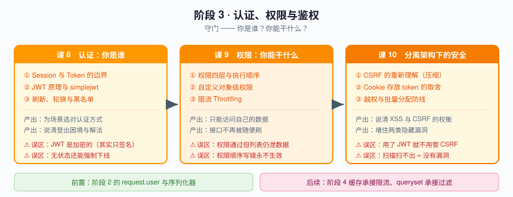
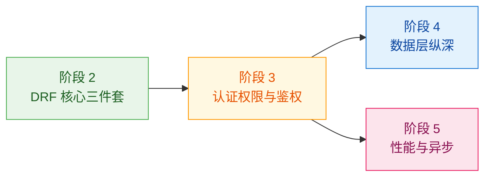

# 阶段 3：认证、权限与鉴权

> 📖 故事章节：**守门** —— 你是谁、能干什么
> 🎯 本阶段回答：谁来认证？谁能访问？分离架构下哪些攻击面变了？

---

## 阶段目标

| 目标 | 达成标志 |
|------|----------|
| 选对认证方式 | 能说清 Session 与 Token 各自的适用场景，不盲从"都用 JWT" |
| 落地 JWT 并知道边界 | 配好 simplejwt，知道"无状态"的真实代价与登出的困境 |
| 实现对象级权限 | 不只是"登录了吗"，而是"这条记录是你的吗" |
| 配好限流 | 知道限流维度与缓存后端的关系 |
| 说清 CSRF 的真实边界 | 知道什么时候该管、什么时候根本不用管 |
| 堵住越权与批量分配 | 这两个是分离架构下最高频的漏洞 |

---

## 学习重点

### 🔑 必须掌握的知识点

| 课 | 知识点 | 为什么必须掌握 | 关键点 | 状态 |
|----|--------|---------------|--------|------|
| 课 8 | Session 与 Token 的适用边界 | 盲选 JWT 是常见过度设计 | 机制差异 / 取舍 / 混用的坑 / **同域 cookie+session 仍成立的场景** | ✅ |
| 课 8 | JWT 原理与 simplejwt 落地 | 分离架构最主流的认证方案 | JWT 结构 / 无状态的含义 / 登录接口 | ✅ |
| 课 8 | 刷新、轮换与黑名单 | **登出做不对，等于留了个永久后门** | access/refresh 分工 / 轮换 / 登出困境 | ✅ |
| 课 9 | 权限四层与执行顺序 | 不知道顺序，配置就会互相打架 | 认证→权限→限流→校验 / 职责边界 / **权限拒绝时限流不执行** | ✅ |
| 课 9 | 自定义对象级权限 | 越权漏洞的头号来源 | 行级实现 / has_object_permission / **列表路由根本不调它，须靠 queryset 过滤** | ✅ |
| 课 9 | 限流 Throttling | 没有限流的公开接口会被打爆 | 限流维度 / 配置 / 与缓存后端的关系 / **scope 写错会静默失效** | ✅ |
| 课 10 | CSRF 的重新理解（压缩为一节） | **用 JWT 就不用管，用 cookie+session 就必须配** | CSRF 本质 / Token 为何免疫 / **DRF 把校验挪进了 `SessionAuthentication`** / 何时仍需防护 | ✅ |
| 课 10 | Cookie 存放 token 的取舍 | 这是 XSS 与 CSRF 的正面权衡 | localStorage vs Cookie / **HttpOnly 与 SameSite 是正交的两个开关** / 折中方案 | ✅ |
| 课 10 | 越权与批量分配的防线 | **分离架构下最高频的两类漏洞** | 越权类型 / 批量分配 / **白名单优于黑名单** / `perform_create` 注入归属 | ✅ |

> **🎉 阶段 3「认证、权限与鉴权」已全部完成**（课 8 / 9 / 10，2026-09-02）。
>
> **课 9 核心结论**：认证只回答"你是谁"，权限才回答"你能碰什么"——而"能碰什么"有**两个方向**：单行改动靠 `has_object_permission`，批量可见靠 queryset 过滤，**只守一个方向，另一个方向就是敞开的**。限流同理：配的数字从来不是真实配额，它还要乘以进程数，并且在 scope 写错时静默归零。
>
> **课 10 核心结论**：CSRF 的真正分界线不是"用不用 JWT"，而是"**凭据在不在 Cookie 里**"——DRF 把所有视图都 `csrf_exempt` 了，校验被挪进 `SessionAuthentication`，所以只有 Cookie 凭据才会被查。而比越权更隐蔽的是批量分配：**用户身份完全合法、接口权限完全正确，他只是往请求体里多加了一个字段名**，就把自己变成了 superuser。堵它的办法不是黑名单，而是白名单——因为黑名单会在模型新增字段的那天，静默失效。

### 🐞 本阶段高频误区（先打个预防针）

| 误区 | 真相 |
|------|------|
| "JWT 无状态，所以更好" | 无状态的代价是**无法主动失效**，登出和封号都要额外做黑名单 |
| "前后端分离就不用管 CSRF 了" | 用 `SessionAuthentication`（同域 cookie 方案）时 CSRF 防护**仍然强制** |
| "token 放 localStorage 最方便" | 一旦有 XSS，token 直接被拿走；Cookie+HttpOnly 更安全但需配 CSRF |
| "权限判断写在 view 里就行" | 散落在各 view 的权限判断必然漏，应收敛到 permission 类 |
| "登录了就能操作自己的数据" | 没做对象级权限，改个 ID 就能看别人的数据——这是越权 |

---

## 本阶段路径图

---

## 阶段前置与后续

**前置依赖**：阶段 2 的 serializer 与 ViewSet（限流配置在视图上，权限过滤影响 queryset）。
**后续**：阶段 5 的权限过滤会进入 queryset 优化；阶段 6 上生产前必须完成本阶段的安全配置。

---

🚀 进入 [课 8《认证：你是谁》](./lessons/lesson-08-认证你是谁.md)
