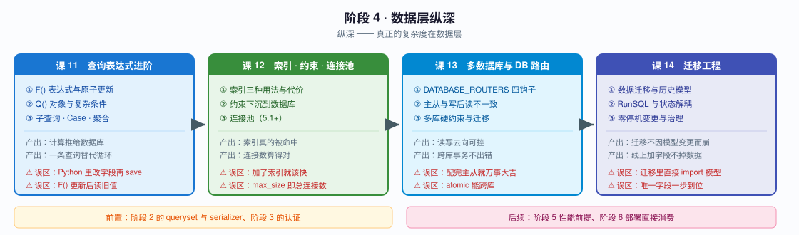
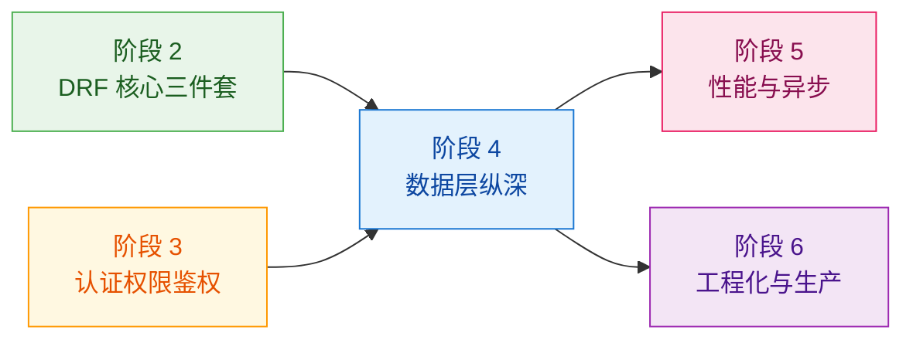

# 阶段 4：数据层纵深

> 📖 故事章节：**纵深** —— 真正的复杂度在数据层
> 🎯 本阶段回答：怎么让数据库多干活？多库怎么办？线上变更不掉数据怎么保证？

---

## 阶段目标

| 目标 | 达成标志 |
|------|----------|
| 把计算推给数据库 | 能用 F()/Q()/Subquery/Case 替代循环与加锁，减少往返与竞态 |
| 让索引真正生效 | 会设计部分索引与函数索引，会用 `explain()` 验证，而不是"加了索引就该快" |
| 把校验下沉到数据库 | 知道哪些约束必须在 DB 层，以及违反时怎么翻译成 API 错误 |
| 正确估算连接数 | 理解连接池按进程计算，不再算错生产容量 |
| 配置多库路由 | 能配主从，并说清写后读不一致与跨库外键被禁的连锁后果 |
| 安全变更线上库 | 能手写数据迁移与 SQL 迁移，零停机加字段，治理迁移历史 |

---

## 学习重点

### 🔑 必须掌握的知识点

| 课 | 知识点 | 为什么必须掌握 | 关键点 |
|----|--------|---------------|--------|
| 课 11 | F() 表达式与原子更新 | `obj.count += 1` 有竞态，这是**最常见的并发 bug** | 竞态成因 / 数据库侧自增 / 与 `select_for_update` 取舍 / 取回新值 | ✅ |
| 课 11 | Q() 对象与复杂条件组合 | 动态筛选是列表接口刚需 | AND/OR/NOT / 动态构建 / 与过滤后端配合 | ✅ |
| 课 11 | 子查询、条件表达式与聚合 | 一条查询替代 N 条，**是 N+1 的治本手段** | Subquery/OuterRef / Case-When / 6.1 新增函数 | ✅ |

> **阶段 4 进度**：课 11、课 12、课 13 已完成（2026-09-02），课 14 未开始。
>
> **课 11 核心结论**：`obj.count += 1` 看着是一条语句，实际是 SELECT → Python 加一 → UPDATE 三步，并发时后写的直接覆盖先写的。把自增写成 `F("view_count") + 1`，SQL 就变成 `SET view_count = view_count + 1`，**数据库内部完成，窗口消失**。
>
> **课 12 核心结论**：索引的价值不在"建了"，而在"被优化器选中且选择性够好"——部分索引实测只有全表索引的 **37%** 体积并能消除排序，但 SQLite 优化器未必选它，必须 `explain()` 验证。约束下沉到 DB 是唯一**任何写入路径都绕不过**的校验层（裸 SQL 也拦得住）。连接池最容易算错的是**按进程**：4 worker × `max_size=10` = 40 条；此外 `"pool": {}` 会**静默失效**（空字典是 falsy），写了等于没写。
>
> **课 13 核心结论**：**路由决定去向，复制决定新鲜度，事务只管一个库。** 四个钩子里最易记混的是——`allow_relation` 返回 `None` 兜底「**只允同库**」，而 `allow_migrate` 返回 `None` 兜底「**一律放行**」，二者完全相反。只写 `db_for_read` 不写 `db_for_write`，写操作会被粘性规则（`instance._state.db`）静默送进只读库。跨库外键要么在赋值时报错，要么**在错误的库上校验约束后静默指向另一份数据** —— 后者业务全错而数据库不报错，是本阶段最危险的一条。`transaction.atomic(using=...)` 的 `using` 是**单数**，异常被 `except` 吞掉时跨库不一致。多库还要记住：连接池**每库各一份**，总连接数 = Σ(max_size) × 进程数。
>
> **贯穿三课的同一类陷阱**：SQLite 与 PostgreSQL 行为不一致，而且是**静默的** —— `select_for_update()` 在 SQLite 上不报错但 SQL 里没有 `FOR UPDATE`；部分索引在 SQLite 上优化器可能不选；`condition` 在 MySQL 上被静默忽略。**凡是锁、性能、并发的结论，都必须在与生产同类型的库上验证。**
>
> 而更难查的是那些**不报错的错误**，本阶段已累计抓到**六处**：`Subquery` 漏了 `.values()` 分组会给你一组**错值**、`select_for_update()` 在 SQLite 上**静默失效**、`Q(a) & Q(b)` 在多值关系上**永远返回 0 条**、`Count` 少加 `distinct=True` 会**静默变成笛卡尔积**、连接池 `"pool": {}` **静默失效**（空字典是 falsy）、**跨库外键静默指向另一份数据**。它们都不会抛异常，只会在上线后才发现。
| 课 12 | 索引的三种用法与代价 | 乱加索引会让写入变慢 | Meta.indexes / 部分索引 / 函数索引 / explain 验证 | ✅ |
| 课 12 | 约束下沉到数据库 | Serializer 校验可被绕过，DB 约束不会 | CheckConstraint / UniqueConstraint(condition=) / 异常翻译 | ✅ |
| 课 12 | 连接池（5.1+） | **算错连接数是生产事故的经典原因** | OPTIONS.pool / 需 psycopg3 / CONN_MAX_AGE 必须为 0 / 按进程计算 | ✅ |
| 课 13 | DATABASE_ROUTERS 四个钩子 | 多库的入口，不理解它就无法控制读写去向 | db_for_read/write / allow_relation / allow_migrate / using() | ✅ |
| 课 13 | 主从与写后读不一致 | "刚写完读不到"是主从架构的**必修课** | 复制延迟 / 手动路由 / 延迟感知方案 | ✅ |
| 课 13 | 多库的硬约束与迁移 | 多库会禁掉很多单库下的默认行为 | 跨库外键被禁 / migrate --database / atomic 不跨库 | ✅ |
| 课 14 | 数据迁移与历史模型 | **直接 import model 写迁移，未来必然崩** | RunPython / apps.get_model / 多库指定 alias |
| 课 14 | SQL 迁移与状态解耦 | 视图、触发器、扩展都得靠手写迁移 | RunSQL / SeparateDatabaseAndState / 自定义 Operation / elidable |
| 课 14 | 零停机变更与迁移治理 | 线上加字段加错了就是事故 | 加唯一字段三步走 / atomic=False / squashmigrations / 冲突处理 |

### 🐞 本阶段高频误区（先打个预防针）

| 误区 | 真相 |
|------|------|
| "在 Python 里取出对象改字段再 save 就行" | 这是竞态，`F()` 在数据库侧自增才是原子操作 |
| "加了索引查询就一定快" | 低选择性索引不会被命中，且每个索引都在拖慢写入 |
| "校验写在 Serializer 里就够了" | Serializer 可被绕过，唯一性与取值约束必须下沉到 DB |
| "开了连接池，max_size=10 就是 10 条连接" | 池是**按进程**的，4 个 worker 就是 40 条，极易超出数据库上限 |
| "配了主从，写 default 读 replica 就完事" | 复制延迟会导致刚写完读不到，需要按场景手动路由回主库；**只写 `db_for_read` 还会把写操作静默送进只读库** |
| "跨库 FK 会报错所以是安全的" | 也可能**在错误的库上校验约束后静默指向另一份数据**，业务全错而数据库不报错 |
| "迁移里直接 `from myapp.models import X` 最方便" | 模型变更后历史迁移会崩，必须用 `apps.get_model` 拿历史模型 |
| "给表加个唯一字段，makemigrations 直接上" | 已有数据会因默认值重复而违反唯一约束，必须三步走 |

---

## 本阶段路径图

---

## 阶段前置与后续

**前置依赖**：阶段 2 的 queryset 与 serializer（表达式与约束都要落到它们身上）、阶段 3 的认证（迁移中的权限相关变更会涉及用户模型）。
**后续**：阶段 5 的 N+1 治理直接依赖本阶段的表达式与索引；阶段 6 的部署要用到连接池与迁移治理。

---

🚀 进入 [课 11《查询表达式进阶》](./lessons/lesson-11-查询表达式进阶.md) ｜ [课 12《索引、约束与连接池》](./lessons/lesson-12-索引约束与连接池.md) ｜ [课 13《多数据库与 DB 路由》](./lessons/lesson-13-多数据库与DB路由.md) ｜ [课 14《迁移工程》](./lessons/lesson-14-迁移工程.md)

> 📌 **课 13 已交付**（2026-09-02）。三个知识点：DATABASE_ROUTERS 四个钩子与调用时机（TraceRouter 实测抓取）、主从写后读不一致（三方案 + 失效边界）、多库硬约束与迁移（跨库外键 / 事务 / `migrate --database` / 连接数）。
> 进入课 14 前建议自查四项：`db_for_read` 与 `db_for_write` 是否**成对实现**（缺后者会把写操作送进只读库）、`allow_migrate` 管完目标 app 后是否**显式返回**（`None` 等于一律放行）、按 app 分库的 `allow_relation` 是否**放行了 `auth`/`contenttypes`**（否则业务表外键指向 User 会在运行时抛 `ValueError`）、总连接数是否按 **Σ(max_size) × 进程数** 重算过。

> 📌 **课 14 已交付**（2026-09-02）。三个知识点：**数据迁移与历史模型**（`from myapp.models import X` 只在"碰到后来被改掉的字段/方法"时才炸，所以能通过 review；`apps.get_model` 拿到的是**那一刻**的快照，且是裸模型 —— 没有自定义 manager/方法，重写 `save()` 会静默跳过）、**SQL 迁移与状态解耦**（`RunSQL` 只改库不改状态，Django 对它建的东西完全看不见；`SeparateDatabaseAndState` 把两者拆开声明；`hints` 只是透传给路由器的参数，路由器不读就等于没写）、**零停机变更与迁移治理**（加唯一字段必须三步走；`atomic=False` 失败后留下半成品，既不能重跑也不能回滚；**squash 生成的文件是 `SyntaxError`**，必须手工搬运函数）。
>
> 🎉 **阶段 4 已完成**（课 11–14，2026-09-02）。四条主线：把计算推给数据库（`F()` 消除竞态）、让索引真正生效（必须 `explain()` 验证）、把校验下沉到数据库（唯一绕不过的层）、安全变更线上库（路由/复制/事务 + 迁移是快照）。
>
> ⚠️ **贯穿四课的同一陷阱**：**不报错的错误**，累计 7 处 —— `Subquery` 漏 `.values()` 给错值、`select_for_update()` 在 SQLite 静默失效、`Q(a) & Q(b)` 多值关系恒 0 条、`Count` 少 `distinct=True` 变笛卡尔积、`"pool": {}` 静默失效、跨库外键静默指向另一份数据、历史模型 `save()` 静默跳过重写逻辑。

**阶段 4 已完成**：课 11《查询表达式进阶》、课 12《索引、约束与连接池》、课 13《多数据库与 DB 路由》、课 14《迁移工程》
**下一阶段**：[阶段 5 性能与异步](../5-性能与异步/overview.md) —— 课 15《ORM 进阶与 N+1 治理》
