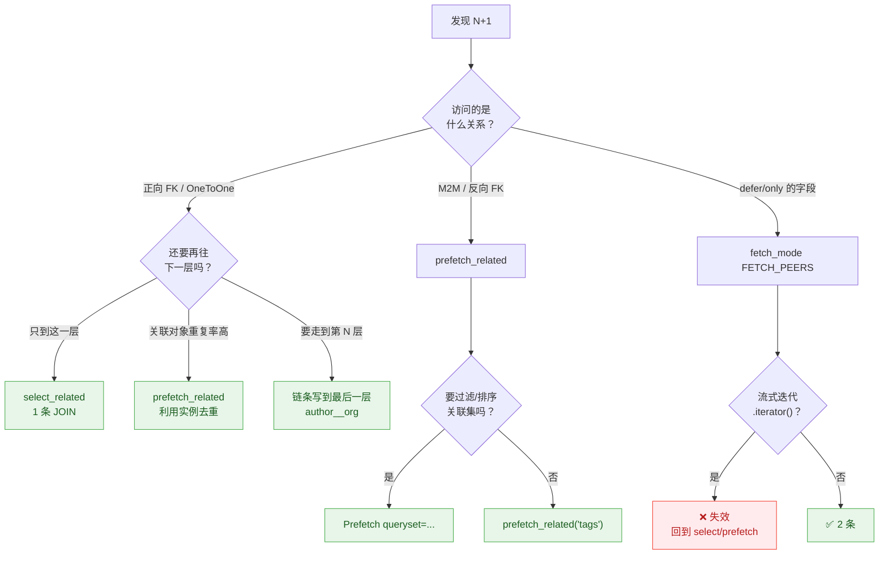
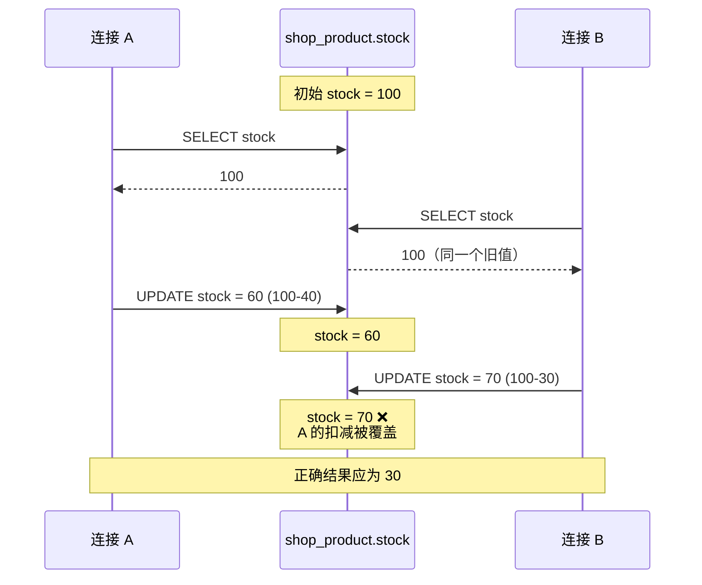
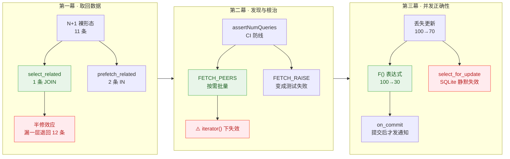

# 课 15《ORM 进阶与 N+1 治理》

> 🧭 所属阶段：[阶段 5 性能与异步](../overview.md) ｜ 上一课：[课 14 迁移工程：不依赖 model 的迁移](../../4-数据层纵深/lessons/lesson-14-迁移工程.md) ｜ 下一课：[课 16 性能：缓存与异步](./lesson-16-性能缓存与异步.md)
>
> 🎯 **本课回答三个问题**：`select_related` 和 `prefetch_related` 到底该用哪个？怎么在它变成生产事故前发现 N+1？并发扣库存为什么"加了事务"还是错？
>
> ⚙️ **实跑环境**：Django **6.1** / Python **3.13.14**（Windows 托管 venv `dj-course`）。SQLite 单文件，两个数据库 alias 指向同一文件以确定性复现并发。
>
> 📦 实验工程：`%TEMP%/dj-lesson15-demo/perflab`，**35 个实验全部实测通过**（断言 92 项，零失败）。

#### 怎么跑起来

```powershell
# 复用课 2 建的虚拟环境
$env:PYTHONPATH = "%TEMP%\dj-lesson15-demo\perflab\apps"
$env:PYTHONIOENCODING = "utf-8"          # 否则中文输出乱码
cd %TEMP%\dj-lesson15-demo\perflab

python run_lab1.py     # 实验 1-10 ：select_related 与 prefetch_related
python run_lab2.py     # 实验 11-22：N+1 的发现与 fetch modes
python run_lab3.py     # 实验 23-32：事务、并发与行锁
python run_lab4.py     # 实验 33-35：批量导入的两类陷阱（评审 P0 验证）

python run_lab1.py 3   # 只跑第 3 个实验
```

> 💡 **不需要 PostgreSQL**。N+1、fetch modes、事务边界、丢失更新**都是 Django Python 侧或 SQL 标准行为**，SQLite 上完整可复现。唯一真正依赖 PostgreSQL 的是 `select_for_update()` 的实际加锁效果——课 11 已实测它在 SQLite 上**静默失效**，本课复用该结论并讲透它对"扣库存"的影响，不重复推导。

#### 实验用的模型

本课的 32 个实验都基于下面这套模型。如果你丢掉了实验工程，用它可以完整重建：

```python
from django.contrib.contenttypes.fields import GenericForeignKey
from django.db import models


class Org(models.Model):
    name = models.CharField(max_length=50)


class Author(models.Model):
    name = models.CharField(max_length=50)
    org = models.ForeignKey(Org, on_delete=models.CASCADE, null=True)   # 可空 → LEFT OUTER JOIN


class Book(models.Model):
    title = models.CharField(max_length=100)
    author = models.ForeignKey(Author, on_delete=models.CASCADE, related_name="books")
    body = models.TextField(blank=True)          # 大字段，用于 defer() / only() 实验
    tags = models.ManyToManyField("Tag", related_name="books", blank=True)


class Tag(models.Model):
    name = models.CharField(max_length=30)


class Review(models.Model):
    """反向外键 —— 演示 prefetch_related 处理反向关系与 Prefetch 过滤。"""
    book = models.ForeignKey(Book, on_delete=models.CASCADE, related_name="reviews")
    rating = models.IntegerField(default=0)


class Product(models.Model):
    """库存 —— 并发扣减实验。"""
    name = models.CharField(max_length=50)
    stock = models.IntegerField(default=0)


class Note(models.Model):
    """泛型外键 —— 仅服务于实验 21（验证 fetch modes 对泛型关系生效）。"""
    content_type = models.ForeignKey("contenttypes.ContentType", on_delete=models.CASCADE)
    object_id = models.PositiveIntegerField()
    subject = GenericForeignKey("content_type", "object_id")
    text = models.CharField(max_length=100)
```

种子数据规模：**10 本书 / 4 个作者 / 3 个机构 / 4 个标签 / 每本 3 条评论 / 库存 100**。每个实验前会重建数据库，互不干扰。

> ⚠️ 实验工程在 `%TEMP%` 下，**可能被系统清理**。如果跑不起来，用上面的模型 + `config/settings.py`（两个 alias 指向同一 SQLite 文件）即可重建。

---

## 开场：三个都"加了优化"的接口，还是慢

**接口 A**（书籍列表）：已经在 queryset 上加了 `select_related("author")`，但前端还要显示作者所属机构。上线后 2000 本书的列表页要 **2001 次查询**，首屏 4.2 秒。

**接口 B**（订单导出）：用了 Django 6.1 最新的 `.fetch_mode(models.FETCH_PEERS)`，本地测 2 条查询喜出望外。上线跑批量导出时为了省内存**改了迭代方式**，查询数一夜回到 11 条——而且没人知道为什么。

**接口 C**（秒杀扣库存）：代码规规矩矩套了 `transaction.atomic`，也读了库存做了判断。压测时 100 次扣减只生效了 60 次，库存永远扣不完。

三个接口的共同点：**都做了"看起来正确"的优化，但优化的行为和真正的瓶颈对不上**。

| 你以为 | 实际 |
|--------|------|
| 加了 `select_related` 就不会 N+1 | 只管住**你写进去的那一层**，少写一层照样 N+1 |
| `FETCH_PEERS` 是 N+1 的终结者 | 它在**某些写法下完全失效**（第二幕揭晓） |
| 套了 `atomic` 就不会丢数据 | `atomic` 管的是原子性，**管不了"你读到的值已经过期"** |

这一课就是把这三组错配拆开。

---

## 第一幕：select_related 与 prefetch_related

### 1.1 N+1 长什么样

先看清敌人。10 本书，每本访问一次作者：

```python
books = Book.objects.all()          # 1 条
for b in books:
    print(b.author.name)            # + 10 条，每本一次
```

实测（实验 1）：**10 条** author 查询，加上取书那 1 条，共 11 条。SQL 长这样，反复出现同一张表的单条主键查询：

```sql
SELECT "shop_author"."id", "shop_author"."name", "shop_author"."org_id"
  FROM "shop_author" WHERE "shop_author"."id" = 1
SELECT "shop_author"."id", "shop_author"."name", "shop_author"."org_id"
  FROM "shop_author" WHERE "shop_author"."id" = 2
-- ... 共 10 条
```

> 🔍 **识别判据**：日志里反复出现**同一张表**的 `WHERE id = ?` 单条查询，且参数递增。这是 N+1 的指纹。

### 1.2 select_related：用 JOIN 一次取回

`select_related` 的原理是 **SQL JOIN**，把关联表的数据在同一条查询里取回来：

```python
Book.objects.select_related("author")     # 实验 2：1 条
```

```sql
SELECT "shop_book"."id", ..., "shop_author"."id", "shop_author"."name", ...
  FROM "shop_book" INNER JOIN "shop_author" ON ("shop_book"."author_id" = "shop_author"."id")
```

**11 条 → 1 条。** 它适用于**正向**的 `ForeignKey` 和 `OneToOneField`（也就是"多对一"里"多"的那一侧，以及一对一）。

#### 穿透多层

关系链可以一路往下写：

```python
Book.objects.select_related("author__org")   # 实验 3：仍是 1 条
```

生成的 SQL 有两次 JOIN，但这里藏着第一个实测细节——**两层的 JOIN 类型不一样**：

```sql
FROM "shop_book"
INNER JOIN "shop_author" ON ("shop_book"."author_id" = "shop_author"."id")
LEFT OUTER JOIN "shop_org" ON ("shop_author"."org_id" = "shop_org"."id")
```

第一层是 `INNER JOIN`，第二层是 `LEFT OUTER JOIN`。原因在模型定义：`Author.org` 是 `null=True`，可空的关联只能用 `LEFT OUTER`，否则会漏掉 `org` 为空的作者。

> 💡 这个细节的意义在于：**`select_related` 不会让行数变多或变少**（不会因为某个作者没机构就丢掉那本书）。如果你在别处看到"多层 select_related 会丢数据"的说法，那是把 `INNER JOIN` 的语义套到了所有层上。

### 1.3 🔴 实测发现：select_related 不去重实例

这是本课第一个预想之外的发现。假设 10 本书只属于 4 个作者，那么"再往下访问一层"会触发几次查询？

```python
# 对照 A：只 select_related('author')，再访问 org
[b.author.org.name for b in Book.objects.select_related("author")]
# 实测 → 11 条

# 对照 B：改用 prefetch_related('author')，再访问 org
[b.author.org.name for b in Book.objects.prefetch_related("author")]
# 实测 → 6 条
```

我最初预期 A 是 **4 条**——理由很自然：10 本书只涉及 4 个作者，同一个作者被问第二次应该命中缓存，补 4 次就够了。实测是 **11 条**，每本书各补一次。

原因（实验 3 直接验证）：

```python
sel_rows  = list(Book.objects.select_related("author"))
len({id(b.author) for b in sel_rows})     # → 10 个不同实例

pref_rows = list(Book.objects.prefetch_related("author"))
len({id(b.author) for b in pref_rows})    # → 4 个不同实例
```

**`select_related` 每行都创建一个全新的关联对象实例，不做去重**；`prefetch_related` 会把同一个作者复用成同一个实例。

于是"10 本书访问 `author.org`"就变成 10 次独立查询——因为 Django 眼里那不是"4 个作者被问了 10 次"，而是**10 个互不相识的实例各自被问了一次**。

> 💡 **"重复率高"怎么判断**：算 `len(set(外键 id 列表)) / len(结果集)`。本例是 `4/10 = 0.4`——越接近 0（大量行指向少数关联对象），`prefetch_related` 的优势越大。
>
> 但**只在"还要再往下访问一层"时才需要算这个**。只访问到外键那一层，`select_related` 的 1 条 JOIN 永远是最优解。

### 1.4 prefetch_related：分两次查，在 Python 里拼

`prefetch_related` 不用 JOIN，而是**再发一条查询**把所有关联对象一次性取回来，然后在 Python 侧拼装：

```python
Book.objects.prefetch_related("author")    # 实验 4：2 条
```

```sql
-- 第 1 条
SELECT "shop_book"."id", ... FROM "shop_book"
-- 第 2 条
SELECT "shop_author"."id", ... FROM "shop_author" WHERE ("shop_author"."id") IN ((1), (2), (3), (4))
```

注意第 2 条用的是 `IN`——**它只查实际出现的 4 个作者**，不是 10 次。

**它是 M2M 和反向 FK 的唯一选择**（实验 5、6 实测都是 11 条 → 2 条）：

```python
Book.objects.prefetch_related("tags")      # M2M      → 2 条
Book.objects.prefetch_related("reviews")   # 反向 FK  → 2 条
```

而 `select_related` 用在 M2M 上会直接报错——但报错的内容和很多人想的不一样（见 1.6）。

### 1.5 用 Prefetch 对象做过滤

普通 `prefetch_related("reviews")` 会取回全部评论。只要高分的？用 `Prefetch` 对象：

```python
from django.db.models import Prefetch

Book.objects.prefetch_related(
    Prefetch("reviews", queryset=Review.objects.filter(rating__gte=3))
)
```

实测（实验 7）：仍是 **2 条**查询，过滤条件被合并进第 2 条 SQL：

```sql
SELECT "shop_review"."id", "shop_review"."book_id", "shop_review"."rating"
  FROM "shop_review"
 WHERE ("shop_review"."rating" >= 3 AND "shop_review"."book_id" IN (1, 2, ...))
```

10 本书各 3 条评论，过滤后保留数量 `[1, 2, 2, 1, 0]`——**过滤真的生效了**，不是取回来再筛。

> ⚠️ **这是 `Prefetch` 与"事后 Python 过滤"的本质区别**。如果你写成 `[r for r in b.reviews.all() if r.rating >= 3]`，所有评论都会先进内存。数据量大的时候这个差别是 OOM 和正常运行的差别。

### 1.6 ⚠️ 必查项 #21 现场：select_related 用在 M2M 上到底报什么错

我原本准备写"会抛 `ValueError`，并提示你改用 `prefetch_related`"。**跑了之后发现全错**（实验 8）：

```
FieldError: Invalid field name(s) given in select_related: 'tags'. Choices are: author
```

三个纠正：

1. 异常类型是 **`FieldError`**，不是 `ValueError`
2. 错误信息**完全没有提到** `prefetch_related`，只是列出可选字段名
3. 报错发生在 **queryset 求值时**，不是调用 `select_related()` 那一刻——它是惰性的

```python
qs = Book.objects.select_related("tags")   # ← 这里不报错
list(qs)                                    # ← 这里才报错
```

> 📌 **这就是为什么它值得单独讲**：如果你以为写错字段名会立刻报错，就会把 `select_related` 的拼写错误当成"运行时才会暴露的问题"而放松警惕。实测确认它是求值时才炸——意味着**可能要等那个接口被真正调用一次**。

### 1.7 半修效应：链上少写一层，等于没修

这个坑最阴险，因为它**看起来已经优化过了**。

```python
# ❌ 以为优化过了，其实第 3 层漏了
[b2.author.name for b in [r.book for r in b.reviews.all()]
 ...]
```

更清楚地写成（实验 9B）：

```python
# prefetch 了 reviews，但访问 review.book.author —— author 不在链上
[[r.book.author.name for r in b.reviews.all()]
 for b in Book.objects.prefetch_related("reviews")]
# 实测 → 12 条（1 取书 + 1 取评论 + 10 次 author 补刀）
```

补上链条（实验 9C）：

```python
Book.objects.prefetch_related("reviews__book__author")   # → 3 条
```

**12 条 → 3 条。**

顺便记一个**好消息**（实验 9A）：`prefetch_related` 会回填反向缓存，所以从 `Review` 回指 `Book` 是**免费**的：

```python
[[r.book.title for r in b.reviews.all()]
 for b in Book.objects.prefetch_related("reviews")]
# → 2 条，不是 12 条
```

> 💡 **判据**：`prefetch_related` 的链条要写到"你最后访问的那一个字段"为止。回指上一层免费，向下走一层必须显式声明。

### 1.8 values() 会让 select_related 静默失效

最后一个边界（实验 10）：

```python
# JOIN 保留 —— 因为 author__name 被取用了
Book.objects.select_related("author").values("title", "author__name")  # 1 条，有 JOIN

# JOIN 被丢弃 —— 因为没取任何 author 字段
Book.objects.select_related("author").values("title")                  # 1 条，无 JOIN
```

第二种情况下 Django 会把没用到的 `select_related` **整个丢掉**，不报错、不警告。这本身是合理的优化，但如果你靠"SQL 里有 JOIN"来判断优化生效，就会误判。

### 1.9 第一幕速查表

| 场景 | 正确做法 | 查询数 | 实验 |
|------|----------|--------|------|
| 正向 FK / OneToOne | `select_related("author")` | **1** | 2 |
| 多层正向 FK | `select_related("author__org")` | **1** | 3 |
| 正向 FK 且要再往下走 | `prefetch_related("author")` 可能更省 | 视重复率 | 3 |
| M2M | `prefetch_related("tags")` | **2** | 5 |
| 反向 FK | `prefetch_related("reviews")` | **2** | 6 |
| 需要过滤关联集 | `Prefetch("reviews", queryset=...)` | **2** | 7 |
| 深链访问 | 链条写到最后一层 `reviews__book__author` | **3** | 9 |
| `values()` 里 | 只写会用到的字段，否则 JOIN 被丢弃 | 1 | 10 |

> ⚠️ **第一幕最容易记错的一条**：`select_related` 用于 M2M 报 `FieldError`（不是 `ValueError`），且**求值时**才报，信息里也不会提示 `prefetch_related`。

---

## 第二幕：N+1 的发现与根治

### 2.1 先解决"怎么发现"

不知道怎么发现，等于等用户投诉。两种手段：

#### 手段一：CaptureQueriesContext 计数（开发期）

```python
from django.test.utils import CaptureQueriesContext
from django.db import connections

with CaptureQueriesContext(connections["default"]) as ctx:
    books = list(Book.objects.all())
    for b in books:
        _ = b.author.name

print(len(ctx.captured_queries))    # 实验 11 → 11 条
```

#### 手段二：assertNumQueries 做 CI 防线（推荐）

把查询数变成**会失败的测试**，N+1 就再也回不来了：

```python
class BookAPITest(TestCase):
    def test_list_no_n_plus_1(self):
        with self.assertNumQueries(2):
            self.client.get("/api/books/")
```

实测（实验 12）：未优化版本 11 条 → 断言失败；优化版本 1 条 → 通过。

> ⚠️ **阈值要留出事务开销**。`assertNumQueries` 会把 `BEGIN` / `COMMIT` 也计入（实验 31 实测：事务内 1 次查询实际计到 **3 条**）。所以阈值常写 `2` 而不是 `1`。

### 2.2 Django 6.1 的 fetch modes

这是 6.1 最重要的新特性，也是 N+1 的**框架级解法**。

三个模式，作用在"访问一个**没有被初始查询加载**的字段"时：

```python
from django.db import models

Book.objects.fetch_mode(models.FETCH_ONE)      # 默认：只补当前这一个对象
Book.objects.fetch_mode(models.FETCH_PEERS)    # 批量补同一批的所有对象
Book.objects.fetch_mode(models.FETCH_RAISE)    # 直接抛异常，不查
```

它作用于（官方文档明示）：`ForeignKey`、`OneToOneField` 及其反向访问器、`defer()` / `only()` 延迟的字段、泛型关系。

#### FETCH_ONE（默认）

实验 13：10 本书 → **11 条**。就是 N+1 本身，无变化。

#### FETCH_PEERS：按需的 prefetch_related

```python
books = list(Book.objects.fetch_mode(models.FETCH_PEERS))
for b in books:
    print(b.author.name)
```

实验 14：→ **2 条**。

```sql
-- 第 1 条
SELECT ... FROM "shop_book"
-- 第 2 条（第一次访问 author 时触发）
SELECT ... FROM "shop_author" WHERE ("shop_author"."id") IN ((1), (2), (3), (4))
```

它和 `prefetch_related` 的区别在**决策时机**：`prefetch_related` 要求你在查询前声明访问模式，`FETCH_PEERS` 是在你**真的访问时**才反应。所以它能治那些"你没预料到的 N+1"——而没预料到的那部分，恰恰是唯一会漏到生产的。

延迟字段同样有效（实验 16）：

```python
books = list(Book.objects.only("title").fetch_mode(models.FETCH_PEERS))
[b.body for b in books]     # → 2 条（默认是 11 条）
```

泛型外键也有效（实验 21）：`Note.subject` 从 4 条降到 **2 条**。

#### FETCH_RAISE：把 N+1 变成测试失败

```python
from django.core.exceptions import FieldFetchBlocked

for b in Book.objects.fetch_mode(models.FETCH_RAISE):
    print(b.author.name)
# FieldFetchBlocked: Fetching of Book.author blocked.
```

实测（实验 17）异常信息格式是固定的：`Fetching of {类名}.{字段名} blocked.`

怎么用它做防线（实验 18）：

```python
# 已 select_related 的字段 → 不拦，1 条查询正常返回
[b.author.name for b in
 Book.objects.select_related("author").fetch_mode(models.FETCH_RAISE)]      # → 1 条

# 访问没加载的 author.org → 立刻炸
[b.author.org.name for b in
 Book.objects.select_related("author").fetch_mode(models.FETCH_RAISE)]
# FieldFetchBlocked: Fetching of Author.org blocked.
```

注意第二条：`FETCH_RAISE` 会**传播到关联对象**（实验 19 验证）。你给 `Book` 设了 RAISE，取出来的 `Author` 也继承了这个模式，所以 `Author.org` 也被拦住了。

> 💡 **推荐的团队用法**：在测试里给所有热点 queryset 套上 `FETCH_RAISE`。以后谁在序列化器里加了个字段却没同步 `select_related`，**CI 直接红**，而不是等生产慢查询告警。

#### 用 manager 设为全局默认

不想每处都写一遍（实验 22 验证可用）：

```python
class PeerBookManager(models.Manager):
    def get_queryset(self):
        return super().get_queryset().fetch_mode(models.FETCH_PEERS)

class Book(models.Model):
    ...
    objects = PeerBookManager()
```

### 2.3 🔴 关键发现：FETCH_PEERS 在 .iterator() 下完全失效

这是本课最重要、也是**官方文档和 release notes 都没提**的发现。

官方 release notes 的示例是这样的：

```python
books = Book.objects.fetch_mode(models.FETCH_PEERS)
for book in books:
    print(book.author.name)      # 官方说：2 条查询
```

实测（实验 15A）：**确实是 2 条**。✅

但如果为了省内存改成流式迭代——这在大表导出、批量回填里是标准做法：

```python
for book in Book.objects.fetch_mode(models.FETCH_PEERS).iterator():
    print(book.author.name)
```

实测（实验 15B）：**11 条。** ❌

而且调 `chunk_size` 救不回来（实验 15C）：

| 写法 | 查询数 |
|------|--------|
| `for b in qs` | **2** |
| `.iterator()` | **11** |
| `.iterator(chunk_size=2)` | **11** |
| `.iterator(chunk_size=5)` | **11** |
| `.iterator(chunk_size=20)` | **11** |

#### 为什么会这样

根因在源码 `django/db/models/query.py` 的 `ModelIterable.__iter__`：

```python
peers = []
for row in compiler.results_iter(results):
    obj = model_cls.from_db(db, init_list, row[...], fetch_mode=fetch_mode)
    if fetch_mode.track_peers:
        peers.append(weak_ref(obj))        # ← 边迭代边追加
        obj._state.peers = peers
    ...
    yield obj                               # ← 控制权交回调用方
```

`peers` 是**边迭代边增长**的。而 `FetchPeers.fetch()` 的判定是：

```python
def fetch(self, fetcher, instance):
    instances = [peer for peer_weakref in instance._state.peers
                 if (peer := peer_weakref()) is not None]
    if len(instances) > 1:
        fetcher.fetch_many(instances)      # 批量
    else:
        fetcher.fetch_one(instance)        # 退化成单条
```

**在第 1 个实例被 `yield` 出来、循环体立刻访问它的那一刻，`peers` 里只有它自己**，于是走 `else` 分支，退化成逐条查询。

那为什么标准 `for` 循环是 2 条？因为 `QuerySet.__iter__` 会先调 `_fetch_all()` 把整批结果**物化**进 `_result_cache`，然后才返回迭代器。实测：

```
迭代前 _result_cache 是否为空: True
调用 iter(qs) 之后 _result_cache 长度: 10     ← 整批已就绪
```

而 `.iterator()` 绕过 `_result_cache` 直接走 `ModelIterable`，实测每次 yield 时 peers 长度是：

```
[1, 2, 3, 4, 5, 6, 7, 8, 9, 10]
```

#### 自己怎么验

别只信我的数字，这两段代码可以在你自己的项目里直接跑（实验 15 就是这么测的）：

```python
# 1) 确认标准 for 循环会先整批物化
qs = Book.objects.fetch_mode(models.FETCH_PEERS)
it = iter(qs)
print(len(qs._result_cache))
# → 10（整批已就绪，所以第一次访问时 peers 已满）

# 2) 确认 iterator() 下 peers 是边走边增的
for b in Book.objects.fetch_mode(models.FETCH_PEERS).iterator():
    print(len(b._state.peers))
# → 1, 2, 3, 4, ...（每次都比上一次多一个）
```

#### 工程含义

> ⚠️ **FETCH_PEERS 与 .iterator() 是互斥的。**
>
> 批量导出、大表回填这类**必须用 `.iterator()` 省内存**的场景，`FETCH_PEERS` 帮不上忙，得回到 `select_related` / `prefetch_related`。
>
> 这不是文档推断，是实验 15 的实测结论（**文档未明示，属实现行为，升级大版本需重新验证**）。

### 2.4 fetch modes 不管什么

实验 20 实测：**M2M 和反向 manager 完全不受影响**。

```python
books = list(Book.objects.fetch_mode(models.FETCH_PEERS))
[[t.name for t in b.tags.all()] for b in books]        # → 11 条，没变
[[r.rating for r in b.reviews.all()] for b in books]   # → 11 条，没变
```

`FETCH_PEERS` 处理的是"**单个对象上没有加载的字段**"，而 `tags` / `reviews` 走的是 related manager 的**全新查询**，不是字段补取。这两者机制不同，前者管不到后者。

需要过滤/排序的 prefetch 也一样，`FETCH_PEERS` 给不了 `Prefetch(queryset=...)` 那种精确控制。

> 📌 **分工**：`FETCH_PEERS` 是自动安全网，`prefetch_related` 是精确工具。两者共存，解决的问题不同。

### 2.5 根治策略：怎么选



**三道防线**：

| 防线 | 手段 | 时机 |
|------|------|------|
| 开发期 | `FETCH_RAISE` 挂在热点 queryset 上 | 写的时候就知道 |
| CI | `assertNumQueries(N)` | 提交时拦住 |
| 兜底 | `FETCH_PEERS` 作安全网 | 治那些没预料到的 |

---

## 第三幕：事务、并发与行锁

### 3.0 前两幕讲的是"慢"，这一幕讲的是"错"

第一幕和第二幕都在解决同一个问题：**查询太多，接口太慢**。它们的共同点是——即便你不优化，接口返回的数据也是**对的**。

第三幕不一样。这一幕的问题是：**接口返回的数据是错的**。

```python
with transaction.atomic():
    p = Product.objects.get(id=1)
    if p.stock >= 40:
        p.stock -= 40
        p.save()
```

这段代码单用户跑一百万次都不会出错。但两个人同时跑，**库存就对不上了**。

两类问题的共同点：**都只在真实负载下暴露**，本地单用户测试一片绿色。阶段 5 的主题是"扛住真实世界"，而真实世界的第一个特征就是——**不止你一个人在用**。

> ⚠️ **本节的两个数据库 alias 不是课 13 的多数据库。** `default` 和 `second` 指向**同一个 SQLite 文件**，只是为了让两个"连接"各自持有独立的事务，从而手工交错它们的读写顺序。
>
> 这么做是为了**确定性**：多线程跑 SQLite 会混入 `database is locked` 等无关失败，掩盖真正的逻辑问题（课 11 的教训）。生产环境请按课 13 的方式配置多库。

### 3.1 先看清"加了事务还是错"

秒杀扣库存，教科书式的写法：

```python
with transaction.atomic():
    p = Product.objects.get(id=1)
    if p.stock >= 40:
        p.stock -= 40
        p.save()
```

看起来无懈可击：有事务、有判断、有保存。实测（实验 24）两个并发请求各扣 40 和 30，库存从 100 出发：

```
事务 A 读到 100，事务 B 读到 100
最终 stock = 70（正确应为 30）
```

**丢了 30 那次扣减。**

```
时间线   连接A                连接B
  t1    读 stock=100
  t2                          读 stock=100
  t3    写 stock=60 (100-40)
  t4                          写 stock=70 (100-30)   ← 覆盖了 A 的写入
```

用时序图看得更清楚：



这就是**丢失更新（lost update）**：两次扣减，后写的那次基于一个已经过期的读数，把先写的结果整个盖掉了。

### 3.2 atomic 管不了这件事

这是本课要纠正的核心误解。实验 23 和 24 对比显示：

| 写法 | 结果 |
|------|------|
| 无事务，Python 读-改-写 | **70**（错） |
| 套了 `atomic`，Python 读-改-写 | **70**（还是错） |

`transaction.atomic` 保证的是**原子性**——一个事务里的多个操作要么全成、要么全不做。它**不保证你读到的值在你写回时还没被别人改过**。后者是**隔离级别**和**锁**的职责。

> 💡 一句话区分：`atomic` 管"我的改动会不会只做一半"；锁管"我读到的还是不是最新的"。

### 3.3 方案一：F() 表达式（首选）

把计算推到数据库侧，让"读-改-写"合并成一条 UPDATE：

```python
Product.objects.filter(id=1).update(stock=models.F("stock") - 40)
```

实测（实验 26）：

```
A 用 F() 扣 40 → stock = 60
B 用 F() 扣 30 → stock = 30     ← 正确
```

生成的 SQL 是 `UPDATE ... SET stock = stock - 40`，数据库保证这条语句的原子性——**不需要锁，不需要事务包两层，SQLite 上也完全有效**。

### 3.4 方案二：select_for_update（⚠️ SQLite 上静默失效）

需要"读到的值要做复杂判断"时（比如判断逻辑没法写成一条 UPDATE），得上行锁：

```python
with transaction.atomic():
    p = Product.objects.select_for_update().get(id=1)
    if p.stock >= 40:
        p.stock -= 40
        p.save()
```

**但是**——课 11 已经实测，本课实验 25 复核：

```
生成的 SQL: SELECT "shop_product"."id", ... FROM "shop_product"
                                          ↑ 没有 FOR UPDATE
当前后端: sqlite
features.has_select_for_update = False
```

**不报错，SQL 里也没有 `FOR UPDATE` 子句。** 本地开发一切正常、测试全绿，上线换成 PostgreSQL 后行为才生效。

更隐蔽的是（实验 30）：在支持行锁的后端上，事务外调用 `select_for_update()` 会抛：

```
TransactionManagementError: select_for_update cannot be used outside of a transaction
```

但 SQLite 上因为整个特性被跳过，**连这个保护都不会触发**。你连"用错了"都发现不了。

### 3.5 三方案对照

| 方案 | 丢失更新 | SQLite 可用 | 需要事务 | 适用 |
|------|----------|-------------|----------|------|
| Python 读-改-写 | ❌ 会 | 是 | 否 | 无并发场景 |
| `F()` 表达式 | ✅ 不会 | ✅ 是 | 否 | **纯算术，首选** |
| `select_for_update()` | ✅ 不会 | ❌ 静默失效 | 是 | 读到的值要做复杂判断（**须在 PG 上验证**） |

**默认用 `F()`**。它是三个方案里唯一"SQLite 上也真的有效"的，且不需要事务。只有当你拿读到的值做**无法写成 SQL 表达式**的判断时，才考虑行锁——并且必须在**与生产同类型的数据库**上验证过。

> 💡 **既然 `F()` 这么好，为什么还要行锁？** 反过来问：行锁的代价是什么。
> 持有行锁期间，**其他事务要等待**（用 `select_for_update(nowait=True)` 则会立即失败）。高并发下会形成锁等待队列，吞吐下降。
> 所以即便能力上能用，也只在**必须用**时才用——这和"能用全局锁就别用"是同一个道理。

### 3.6 事务边界：嵌套与 savepoint

`atomic` 可以嵌套，内层是 **savepoint**：

```python
with transaction.atomic():                 # 外层
    Product.objects.filter(id=1).update(stock=50)
    try:
        with transaction.atomic():         # 内层 = savepoint
            Product.objects.filter(id=1).update(stock=10)
            raise ValueError("内层炸了")
    except ValueError:
        pass                               # 捕获 → 只回滚内层
    # 此时 stock = 50（内层回滚了，外层的改动还在）
# 提交后 stock = 50
```

实测（实验 27）：内层异常被捕获后 stock = **50**，外层正常提交后仍是 **50**。

> ⚠️ 如果异常**传播出最外层** `atomic`，整个事务全回滚（实验 29 验证：stock 回到 100，事务内新建的记录也没留下）。

#### 批量导入：怎么捕获才不埋雷

这就是"部分失败仍要提交"的典型场景。但**捕获什么**比"要不要捕获"更重要。

先看反模式（实验 33B 实测）：

```python
# ❌ 裸 except Exception
with transaction.atomic():
    for i, row in enumerate(rows):
        try:
            with transaction.atomic():
                import_row(row)          # 里面 filter(stok=...) 字段名拼错了
        except Exception:                # ← 把编程错误也吞了
            logger.warning("跳过 %s", row)
```

实测结果：**200 行全部被静默跳过，程序正常退出，没有任何报错。** 一个 `stok` 拼写错误被吞了 200 次，日志里只有一片"跳过"。

> 🔴 这正是收束节批判的「不报错的错误」的同一个模式。裸 `except Exception` 把**业务异常**和**编程错误**混为一谈。

正确写法：

```python
from django.db import IntegrityError, transaction

BATCH = 500

def import_rows(rows):
    batch, done = [], 0
    for i, row in enumerate(rows, 1):
        try:
            with transaction.atomic():
                import_row(row)                     # 可能抛业务异常
        except (ValueError, IntegrityError) as e:
            # ✅ 只捕获「这行数据本身有问题」：脏数据、重复、超长
            logger.warning("第 %s 行跳过：%s", i, e)
            continue
        # 其余异常（字段名拼错、方法不存在、类型错误）继续向外抛 —— 必须崩
        batch.append(row)
        if len(batch) >= BATCH:                     # 分批提交
            flush(batch)
            batch = []
            logger.info("已导入 %s 行", i)
    if batch:
        flush(batch)
```

区分标准：

| 类型 | 例子 | 处理 |
|------|------|------|
| **业务异常**（这行数据有问题） | 脏数据、唯一键冲突、字段超长 | 捕获 → 记录 → 跳过 |
| **编程错误**（代码写错了） | 字段名拼错、方法不存在、类型用错 | **必须立刻崩** |

实测（实验 34）：只捕获 `(ValueError, IntegrityError)` 时，同样的 `stok` 拼写错误在**第 1 次循环就抛出**：

```
FieldError: Cannot resolve keyword 'stok' into field. Choices are: id, name, stock
```

#### ⚠️ savepoint 不是免费的

每开一个内层 `atomic`，数据库就要记录一个回滚点。实测（实验 35）：

| 行数 | 逐行 savepoint | 分批提交 + `bulk_create` | 倍数 |
|------|----------------|--------------------------|------|
| 100 | 0.0113s | 0.0038s | **2.97x** |
| 500 | 0.0427s | 0.0138s | **3.11x** |
| 1000 | 0.0953s | 0.0312s | **3.05x** |

**逐行 savepoint 稳定慢 3 倍左右。**

> 📌 导入 10 万行时，正确做法是**分批提交**（每 500 行一个外层事务），而不是在单个大事务里开 10 万个 savepoint。
> 数据源也要用 `.iterator()` 流式读取，别把 100 万行读进内存——课 14 的大表回填已经讲过这条。

### 3.7 on_commit：提交后才做的事

发通知、清缓存、投递任务，必须等事务真的提交了：

```python
with transaction.atomic():
    order.save()
    transaction.on_commit(lambda: send_email(order))
```

实测（实验 28）：

| 时刻 | 回调是否执行 |
|------|--------------|
| 事务内、`on_commit` 注册后 | ❌ 未执行 |
| 事务**提交**后 | ✅ 执行 |
| 事务**回滚**后 | ❌ 不执行 |

> 💡 这不是可选项。如果直接写 `order.save(); send_email(order)`，事务一旦回滚，**邮件已经发出去了**，而订单根本不存在。课 17 讲信号时会看到，这是信号最容易踩的坑——`post_save` 默认就在事务内执行。

### 3.8 第三幕速查

| 症状 | 根因 | 解法 |
|------|------|------|
| 并发扣减数字对不上 | 丢失更新 | `F()` 表达式 |
| 加了 `atomic` 还是丢 | `atomic` 不管隔离性 | 同上 |
| `select_for_update` 没效果 | SQLite 静默失效 | 换 `F()`，或在 PG 上验证 |
| 事务回滚了通知却发了 | 没走 `on_commit` | `transaction.on_commit` |
| 批量导入一条失败全中断 | 没有内层 savepoint | 内层套 `atomic` + `try` |

---

## 收束：三幕串起来



### 阶段 5 的"不报错的错误"（第 8–11 处）

延续阶段 4 的计数，本课新增四处——**都不抛异常，都不会让测试变红**：

| # | 现象 | 出处 |
|---|------|------|
| 8 | **`select_related` 不去重实例** —— 深层访问按行数补刀，不是按关联对象数 | 实验 3 |
| 9 | **`.iterator()` 下 `FETCH_PEERS` 静默失效** —— 结果与预想一致，SQL 数差 5 倍 | 实验 15 |
| 10 | **`select_for_update` 在 SQLite 静默失效** —— SQL 里连子句都没有（课 11 首次发现，本课复核） | 实验 25 |
| 11 | **模型字段赋值拼错静默无效** —— 值进了 `__dict__` 却没进库，`save()` 照常成功 | 实验 33A |

> 📌 它们的共同点：**返回值都是对的，或者至少程序不崩**。第 8 条只是慢，第 9 条只是慢，第 10 条在无并发时完全正确，第 11 条要等到"读回来"那一刻才发现。等到出事，已经是生产环境了。

### 几个术语的直白解释

本课出现了几个没有展开的术语，这里补齐：

| 术语 | 直白解释 |
|------|----------|
| **实例去重** | 同一个作者对象在多行里是不是**同一个 Python 对象**。`select_related` 不复用（10 行 = 10 个对象），`prefetch_related` 复用（4 个作者 = 4 个对象） |
| **savepoint** | 事务内部的"存档点"。内层 `atomic` 就是一个存档点，出错可以退回存档点而不用放弃整个事务 |
| **隔离级别** | 数据库对"同时进行的多个事务互相可见到什么程度"的规定。`atomic` 不管这个，锁才管 |
| **fetch mode 传播** | 你给 `Book` 设了某个 fetch mode，从它取出来的 `Author` 也会继承同一模式，整棵关系树都生效 |

### 与前面几课的串联

| 本课结论 | 依赖 | 被谁依赖 |
|----------|------|----------|
| `assertNumQueries` 防线 | 课 20 测试提速 | — |
| `on_commit` 提交后才执行 | — | **课 17 信号**（`post_save` 默认在事务内） |
| `select_for_update` SQLite 失效 | **课 11** 首次实测 | 课 22 上线清单 |
| `F()` 优于行锁 | **课 11** F() vs 行锁 | — |
| 大表回填用 `iterator()` | **课 14** 数据迁移 | — |
| `Prefetch` 过滤优于 Python 过滤 | 课 4 `SerializerMethodField` 陷阱 | — |

---

## 自检

<details>
<summary><b>【1】</b>有 10 本书，4 个作者，每本书要显示作者名和作者所属机构名。怎么写最优？</summary>

```python
Book.objects.select_related("author__org")
```

**1 条查询。** 两层 JOIN（第一层 INNER，第二层 LEFT OUTER，因为 `org` 可空）。

⚠️ 只写 `select_related("author")` 会变成 **11 条**——因为 `select_related` 不去重实例，10 行是 10 个不同的 `Author` 实例，各自补一次 `org`（实验 3）。
</details>

<details>
<summary><b>【2】</b>`prefetch_related` 用在 `ForeignKey` 上会怎样？</summary>

能工作，但**查询数是 2 而不是 1**（实验 4）。

```python
Book.objects.prefetch_related("author")   # 2 条：1 取书 + 1 次 IN 批量
Book.objects.select_related("author")     # 1 条：JOIN
```

FK 该用 `select_related`。但注意这个"反模式"的代价只是多一次往返，远好于 N+1 的 11 条。

例外：如果你还要沿 `author` 往下访问，且作者重复率高，`prefetch_related` 可能因实例去重反而更省（实验 3 对照 B：6 条 vs 11 条）。
</details>

<details>
<summary><b>【3】</b>怎么让 N+1 在 CI 里就失败，而不是等生产告警？</summary>

两层：

```python
# 1) 查询数断言
with self.assertNumQueries(2):
    self.client.get("/api/books/")

# 2) 开发期用 FETCH_RAISE 让"意外补取"直接抛异常
Book.objects.select_related("author").fetch_mode(models.FETCH_RAISE)
# 访问没加载的字段 → FieldFetchBlocked: Fetching of Author.org blocked.
```

⚠️ `assertNumQueries` 会把 `BEGIN`/`COMMIT` 计入（实验 31：1 次查询计到 3 条），阈值要留出事务开销。

**阈值定多少**：先把断言写成一个很大的数（如 999），跑一次看实际是多少，再把它改成实际值。以后多出来一条就会失败。
</details>

<details>
<summary><b>【4】</b>`.fetch_mode(models.FETCH_PEERS)` 能让所有 N+1 都变成 2 条查询吗？</summary>

**不能，有两个明确边界。**

1. **M2M 和反向 manager 不受影响**（实验 20）：`tags` / `reviews` 仍是 11 条，因为那走的是 related manager 的全新查询，不是字段补取。
2. **`.iterator()` 下完全失效**（实验 15）：流式迭代时 peers 列表边走边增（实测 `[1,2,...,10]`），第一个实例被访问时 peers 里只有它自己，退化成逐条。`chunk_size` 调多大都救不回来。

文档明示第 1 点；第 2 点是本课实测发现，官方文档与 release notes 均未提及。
</details>

<details>
<summary><b>【5】</b>为什么套了 `transaction.atomic()` 还是丢数据？</summary>

因为 `atomic` 管的是**原子性**（一个事务里的操作要么全成要么全不做），**不管隔离性**（你读到的值在你写回时是否已被别人改过）。

实测（实验 24）：两个事务都读到 100，各扣 40 和 30，最终 70——后写的覆盖先写的。

**解法是 `F()` 表达式**，把读-改-写合并成一条数据库侧 UPDATE：

```python
Product.objects.filter(id=1).update(stock=models.F("stock") - 40)
```
</details>

<details>
<summary><b>【6】</b>扣库存该用 `F()` 还是 `select_for_update()`？</summary>

| | `F()` | `select_for_update()` |
|---|---|---|
| 纯算术（扣减、计数） | ✅ **首选** | 过重 |
| 读到的值要做复杂判断 | ❌ 表达不了 | ✅ 用它 |
| SQLite 上有效 | ✅ | ❌ **静默失效** |
| 需要事务 | 否 | 是 |

**默认用 `F()`**。只有判断逻辑没法写成 SQL 表达式时才用行锁，且**必须在与生产同类型的数据库上验证过**——SQLite 上它连 `FOR UPDATE` 子句都不会生成，也不报错（课 11 实测，本课实验 25 复核）。
</details>

<details>
<summary><b>【7】</b>`transaction.on_commit` 解决什么问题？</summary>

"事务还没提交，副作用已经发生"。

实测（实验 28）：事务内注册的回调**在事务内不会执行**；提交后执行；**回滚后不执行**。

典型场景：

```python
with transaction.atomic():
    order.save()
    transaction.on_commit(lambda: send_email(order))   # ✅
    # send_email(order)                                 # ❌ 回滚了邮件也发出去了
```

课 17 会看到，`post_save` 信号默认就在事务内执行，这是同一个坑。
</details>

<details>
<summary><b>【8】</b>批量导入 1000 行，第 500 行报错，希望前 499 行仍然入库，怎么写？</summary>

用内层 `atomic` 做 savepoint：

```python
with transaction.atomic():                    # 外层
    for row in rows:
        try:
            with transaction.atomic():        # 内层 = savepoint
                import_row(row)
        except Exception:
            logger.warning("跳过 %s", row)    # 只回滚这一行
    # 外层正常提交
```

实测（实验 27）：内层异常被外层捕获 → 内层回滚、外层继续、最终仍提交。

⚠️ 如果异常传播出**最外层** `atomic`，整批全回滚（实验 29）。
</details>

<details>
<summary><b>【9】</b>`select_related("tags")`（tags 是 M2M）会怎样？</summary>

抛 **`FieldError`**（不是 `ValueError`），且**求值时**才抛：

```
FieldError: Invalid field name(s) given in select_related: 'tags'. Choices are: author
```

三个细节（实验 8 实测）：
1. 类型是 `FieldError`
2. 错误信息**不会**提示你改用 `prefetch_related`，只列出可选字段
3. 构造 queryset 时不报错，`list(qs)` 求值时才报——**惰性**
</details>

<details>
<summary><b>【10】</b>`prefetch_related("reviews")` 之后再访问 `review.book` 会 N+1 吗？</summary>

**不会**（实验 9A），实测仍是 2 条。

`prefetch_related` 会**回填反向缓存**：从 `Review` 回指它的 `Book` 是免费的。

但再往下走一层就不行了：

```python
# review.book.author —— author 不在链上
[[r.book.author.name for r in b.reviews.all()]
 for b in Book.objects.prefetch_related("reviews")]              # 12 条

# 补齐链条
Book.objects.prefetch_related("reviews__book__author")           # 3 条
```

**规则**：回指上一层免费，向下走一层必须显式声明。
</details>

<details>
<summary><b>【11】</b>只想取回高分评论（rating>=3），哪种写法对？</summary>

```python
# ❌ 全部评论先进内存，再在 Python 里筛
[[r for r in b.reviews.all() if r.rating >= 3]
 for b in Book.objects.prefetch_related("reviews")]

# ✅ 过滤条件下推到 SQL
from django.db.models import Prefetch
Book.objects.prefetch_related(
    Prefetch("reviews", queryset=Review.objects.filter(rating__gte=3))
)
```

实测（实验 7）：两者都是 2 条查询，但后者第 2 条 SQL 带了过滤条件：

```sql
WHERE ("shop_review"."rating" >= 3 AND "shop_review"."book_id" IN (...))
```

数据量大的时候，前者是 OOM 和正常运行的差别。
</details>

<details>
<summary><b>【12】</b>怎么确认 `select_related` 真的生效了？</summary>

别靠"SQL 里有 JOIN"判断，两个反例：

1. **`values()` 里没取关联字段时，JOIN 会被整个丢弃**（实验 10）：
   ```python
   Book.objects.select_related("author").values("title")   # 无 JOIN，但不报错
   ```
2. **`select_related` 报错是惰性的**（实验 8）：字段名写错要等求值才炸。

**可靠判据是查询数**，两种场合都能用：

```python
# 测试里
with self.assertNumQueries(1):
    list(Book.objects.select_related("author"))

# shell 里
from django.test.utils import CaptureQueriesContext
from django.db import connections

with CaptureQueriesContext(connections["default"]) as ctx:
    list(Book.objects.select_related("author"))
print(len(ctx.captured_queries))        # → 1
```

想快速看有没有 JOIN，也可以直接打印 SQL：

```python
print(Book.objects.select_related("author").query)
# SELECT ... FROM "shop_book" INNER JOIN "shop_author" ON (...)
```
</details>

<details>
<summary><b>【13】</b>`FETCH_RAISE` 和 `FETCH_PEERS` 该在什么时候用？</summary>

| 模式 | 用在哪 | 作用 |
|------|--------|------|
| `FETCH_PEERS` | 生产代码的热点 queryset | 自动兜底那些"没预料到的" N+1 |
| `FETCH_RAISE` | **测试**里的热点 queryset | 把意外补取变成 CI 失败 |

实测（实验 17–19）：
- `FETCH_RAISE` 抛 `FieldFetchBlocked: Fetching of Book.author blocked.`
- 已 `select_related` 的字段**不拦**（1 条查询正常返回）
- 会**传播到关联对象**：`Book` 设了 RAISE，取出的 `Author` 也继承，访问 `Author.org` 会被拦

> 🔴 **`FETCH_RAISE` 只应在测试里用。**
>
> 它会传播到关联对象（实验 19），生产环境一个意外访问就是 **500**，而不是"慢一点"。
> 生产要的是**兜底**（`FETCH_PEERS`），不是**拦截**（`FETCH_RAISE`）。

推荐组合：生产用 `FETCH_PEERS` 兜底，测试用 `FETCH_RAISE` 防回归。
</details>

<details>
<summary><b>【14】</b>模型字段拼错了会报错吗？</summary>

**分两种，行为完全不同**（实验 33A / 34 实测）：

```python
# ① 赋值拼错：不报错，静默无效
p = Product(name="x", stock=1)
p.stok = 999          # stock → stok
p.save()               # 正常执行，没有异常
Product.objects.get(name="x").stock   # → 1（999 根本没进库）
```

Django 把它当成一个**普通 Python 属性**存进了 `p.__dict__`，`save()` 时不认识、直接忽略。**这是本课第 11 处"不报错的错误"。**

```python
# ② 查询时拼错：立刻报错
Product.objects.filter(stok=1)
# FieldError: Cannot resolve keyword 'stok' into field. Choices are: id, name, stock
```

> ⚠️ 组合起来最危险：赋值时静默无效（数据没写进去），查询时才崩——**而这两处可能相隔几百行代码**。
> 防范手段是测试里断言"写进去的值能读回来"，而不是只断言"save() 没抛异常"。
</details>

---

## 事实核查说明

本课结论分四类标注，**未经实测的一律标明**：

| 结论 | 来源 |
|------|------|
| fetch modes 三个模式的语义与适用范围 | ✅ [官方文档 Fetch modes](https://docs.djangoproject.com/en/6.1/topics/db/fetch-modes/) 明示 |
| `FETCH_PEERS` 可把多数 N+1 降到 2 条查询 | ✅ [Django 6.1 release notes](https://docs.djangoproject.com/en/6.1/releases/6.1/) 明示 |
| fetch modes 适用于 FK / OneToOne / defer-only / 泛型关系 | ✅ 官方文档明示 |
| `FETCH_PEERS` 用弱引用追踪 peers、避免内存泄漏 | ✅ 官方文档明示（源码 `fetch_modes.py` 复核） |
| **`select_related` 不去重实例（10 行 = 10 个实例）** | 🔬 **实测确认**（实验 3）——文档未写，属实现行为 |
| **`.iterator()` 下 `FETCH_PEERS` 退化为 1+N，`chunk_size` 无法缓解** | 🔬 **实测确认**（实验 15）——**文档与 release notes 均未提及**，升级大版本需重新验证 |
| **`select_related` 用于 M2M 抛 `FieldError`（非 `ValueError`）、惰性、不提示 prefetch** | 🔬 **实测确认**（实验 8）· **本课首次** |
| **模型字段赋值拼错静默无效（值进 `__dict__` 不进库）** | 🔬 **实测确认**（实验 33A）· **本课首次** |
| **逐行 savepoint 比分批提交慢约 3 倍** | 🔬 **实测确认**（实验 35）· **本课首次** |
| **裸 `except Exception` 把 200 行编程错误变成静默跳过** | 🔬 **实测确认**（实验 33B）· **本课首次** |
| **双层 `select_related` 第二层是 `LEFT OUTER JOIN`** | 🔬 **实测确认**（实验 3） |
| **`prefetch_related` 回填反向缓存，回指父对象免费** | 🔬 **实测确认**（实验 9A） |
| **`select_for_update` 在 SQLite 上静默失效** | 🔬 **课 11 首次实测**，本课实验 25 复核 |
| `M2M` / 反向 manager 不受 fetch modes 影响 | 🔬 实测确认（实验 20），与文档"适用范围"一致 |
| `on_commit` 提交后执行、回滚后不执行 | ✅ 官方文档明示 + 实测确认（实验 28） |
| 嵌套 `atomic` = savepoint | ✅ 官方文档明示 + 实测确认（实验 27） |
| `select_for_update` 事务外调用抛 `TransactionManagementError` | ✅ 官方文档明示；⚠️ **SQLite 上不会触发**（实验 30 实测） |
| PostgreSQL 上 `select_for_update` 的真实加锁行为 | ⏳ **未经实测**（本机无 PG），标注为"须在同类型数据库验证" |

> ⚠️ **本课五条"实测确认但文档未写"的结论**（实例不去重、iterator 下失效、FieldError 细节、字段赋值静默无效、savepoint 成本）都属于**实现行为**而非契约保证。Django 7.0 升级时需重新跑 `run_lab1.py` / `run_lab2.py` / `run_lab4.py` 验证。

---

## 验证环境

| 项 | 值 |
|----|-----|
| Django | **6.1** |
| Python | **3.13.14**（Windows 托管 venv `dj-course`） |
| 数据库 | SQLite（单文件；`default` 与 `second` 两个 alias 指向同一文件） |
| 实验工程 | `%TEMP%/dj-lesson15-demo/perflab` |
| 实验数 / 断言数 | **35 个实验 / 92 项断言**，零失败 |

> ⚠️ **环境受限说明**：本课用两个 alias 指向同一 SQLite 文件来**确定性复现**并发交错，而不是起多线程。原因（课 11 的教训）：多线程跑 SQLite 会混入 `database is locked` 等无关失败，掩盖真正的逻辑问题。双 alias 手工交错，每一步的顺序完全可控、结果 100% 可复现。
>
> 代价是：**PostgreSQL 上的真实加锁行为本课没有实测**。`select_for_update` 在 PG 上的效果、以及 `F()` 在 PG 隔离级别下的表现，属于"须在与生产同类型数据库上验证"的项，已在正文和自检题中标明。

---

🚀 **下一批接力提示词**

> 课 16《性能：缓存与异步》。带上这三个问题：
> 1. **缓存放哪一层** —— per-view / 低层 API / 模板片段（本课不涉及模板）各解决什么，失效策略怎么设计（本课讲到 `on_commit` 清缓存，课 16 要展开"什么时候清"）
> 2. **异步视图的边界** —— `async def` 视图里 ORM 仍是同步的，什么场景下 async 才真的有用
> 3. **慢活交给谁** —— Django 6.0+ 内置 `django.tasks` 契约层 vs Celery，内置框架缺什么（无 Beat、无重试退避、无 chain/chord）
>
> 提示：本课实验工程在 `%TEMP%/dj-lesson15-demo/perflab`，课 16 讲缓存时可复用 `labkit.py` 的 `QueryCounter` 做"加了缓存到底少了几次查询"的量化对照。

---

🧭 **课程导航**

- ⬅️ 上一课：[课 14 迁移工程：不依赖 model 的迁移](../../4-数据层纵深/lessons/lesson-14-迁移工程.md)
- ➡️ 下一课：[课 16《性能：缓存与异步》](./lesson-16-性能缓存与异步.md)
- 📖 所属阶段：[阶段 5 性能与异步](../overview.md)
- 🏠 课程目录：[02-课程目录.md](../../../02-课程目录.md)
- 🗺️ 学习路径：[01-学习路径总览.md](../../../01-学习路径总览.md)

---

> 📊 本课数据：35 个实验 · 92 项断言 · 3 幕 · 14 道自检题 · 4 处"不报错的错误"（阶段 5 累计 4 处，阶段 4 累计 7 处）
