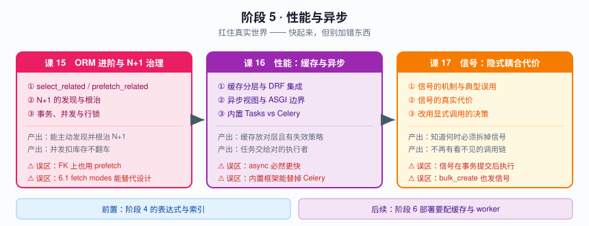
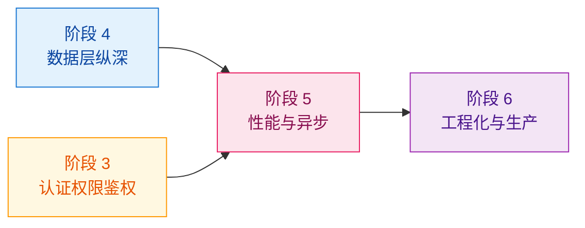

# 阶段 5：性能与异步

> 📖 故事章节：**扛住真实世界** —— 快起来，但别加错东西
> 🎯 本阶段回答：慢在哪？缓存放哪层？异步有用吗？慢活交给谁？信号该不该用？

---

## 阶段目标

| 目标 | 达成标志 |
|------|----------|
| 根治 N+1 | 能主动发现 N+1，并用正确手段根治，而不是靠加机器掩盖 |
| 用对缓存与异步 | 知道缓存放哪一层、异步视图什么时候真的有用 |
| 慢活交给对的执行者 | 能判断该用内置 Tasks 框架还是 Celery |
| 慎用信号 | 知道信号的隐式代价，能判断何时必须改成显式调用 |
| 正确处理并发 | 并发扣库存不再翻车 |

---

## 学习重点

### 🔑 必须掌握的知识点

| 课 | 知识点 | 为什么必须掌握 | 关键点 |
|----|--------|---------------|--------|
| 课 15 | select_related 与 prefetch_related | **性能优化最基础也最常被误用**的一对 | 两者区别 / 适用场景 / 误用反模式 |
| 课 15 | N+1 的发现与根治 | 不知道怎么发现，等于等用户投诉 | 发现手段 / 根治策略 / 6.1 fetch modes |
| 课 15 | 事务、并发与行锁 | 并发扣库存是经典翻车题 | 事务边界 / select_for_update / 与 F() 方案对比 |
| 课 16 | 缓存分层与 DRF 集成 | 缓存放错层等于没加 | 缓存层级 / 粒度 / 失效策略 |
| 课 16 | 异步视图与 ASGI 边界 | "上了 async 就快"是**常见误解** | 能力边界 / 何时有用 / ORM 仍同步 |
| 课 16 | 任务该交给谁（内置 Tasks vs Celery） | **内置框架是 6.0 新事物，不知道会做出过度设计** | django.tasks 契约层 / 内置框架能力缺口 / 选择边界 |
| 课 17 | 信号的机制与典型误用 | 最方便的解耦机制，也最容易变成看不见的调用链 | 信号类型 / receiver 注册 / 隐式调用链 |
| 课 17 | 信号的真实代价 | **默认不跨事务**，这是数据不一致的隐藏来源 | on_commit 配合 / 循环触发 / 与 bulk_create 不兼容 / 测试静默跳过 |
| 课 17 | 改用显式调用的决策 | 知道何时该拆掉信号 | 适用场景 / 必须改造的场景 / 迁移路径 |

### 🐞 本阶段高频误区（先打个预防针）

| 误区 | 真相 |
|------|------|
| "N+1 加个 prefetch 就好了" | 用在 `ForeignKey` 上 prefetch 反而多一次查询，该用 `select_related` |
| "异步视图能让接口变快" | 若视图里全是同步 ORM 查询，async 只是**换个方式排队**，不会更快 |
| "Django 6 有内置任务框架，Celery 可以扔了" | 内置 `django.tasks` **没有定时器、没有自动重试退避、没有 chain/chord 工作流** |
| "缓存加上去就完事" | 失效策略没设计好，缓存是"读到旧数据"的代名词 |
| "用 post_save 信号发通知最解耦" | 信号**默认不在事务提交后执行**，事务回滚了通知却发出去了 |
| "信号里改了字段，save 一下就行" | 容易触发循环调用；且 `bulk_create` 根本不发信号 |

---

## 本阶段路径图

---

## 阶段前置与后续

**前置依赖**：阶段 4 的查询表达式与索引（N+1 根治依赖它们）、阶段 3 的限流（依赖缓存后端）。
**后续**：阶段 6 的测试要覆盖异步任务与信号，部署要配置缓存与 worker。

---

## 课次进度

| 课 | 状态 | 交付日期 | 核心结论 |
|----|------|----------|----------|
| 课 15 ORM 进阶与 N+1 治理 | ✅ 已完成 | 2026-09-03 | ①**`select_related` 不去重实例**（10 行 = 10 个对象），深层嵌套时 `prefetch_related` 可能更省；②**`FETCH_PEERS` 在 `.iterator()` 下完全失效**（11 条，`chunk_size` 无效）——官方文档未提及；③**`atomic` 管不了"你读到的值已过期"**，并发扣库存必须用 `F()` |
| 课 16 性能：缓存与异步 | ✅ 已完成 | 2026-09-03 | ①**缓存键 = URL + Vary，且 Django 只对 `Authorization` 自动兜底**（自定义身份头不进键 → 多租户串号，不报错）；②**存 None 挡不住穿透**（`cache.get` 分不清"无键"与"值为 None"，要用 `has_key`）；③**事务回滚后缓存留新值**（不一致持续到 TTL）；④**`enqueue()` 默认同步执行 + 异常进 `result.errors` 不抛**；⑤**一处同步阻塞就卡死整个事件循环** |
| 课 17 信号：隐式耦合的代价 | ✅ 已完成 | 2026-09-03 | ①**数据库副作用随事务回滚、外部副作用退不回来**（`post_save` 发短信的真实危险不在数据库层）；②**`queryset.delete()` 会逐对象发信号**，不发的是 `update` 家族；③**子模型有无 receiver 会改变级联删除路径**（`can_fast_delete` 检查信号监听器）；④**receiver 的存在与否不影响删除结果，只影响信号次数**；⑤**shim 期双触发**（service 显式一次 + shim 一次） |

> 📌 **课 17 已交付**（2026-09-03）。**48 个实验 / 115 项断言 / 零失败**，实验工程 `%TEMP%/dj-lesson17-demo/signallab`。
> **阶段状态：✅ 已完成（3/3 课）**。
>
> 进入阶段 6 前建议自查四项：receiver 是否都用 `transaction.on_commit` 包住外部副作用（邮件/短信/HTTP 调用）、批量路径（`bulk_create` / `bulk_update` / `update()`）是否自己补了信号该做的事、测试里断开信号是否用 `try/finally` 保证恢复、项目里能不能一键枚举出所有已注册的 receiver（`sig.receivers`）。
>
> **阶段 5 收束**：三课回答的是同一个问题——「让它快」和「让它对」之间，哪些捷径不能走。
> - 课 15：N+1 与并发（`select_related` 不去重实例、`atomic` 管不了"读到的值已过期"、并发扣库存要用 `F()`）
> - 课 16：缓存与异步（缓存键 = URL + Vary、`enqueue()` 默认同步执行、一处同步阻塞卡死事件循环）
> - 课 17：信号治理（外部副作用退不回来、批量操作不发信号、只保留审计与第三方扩展两类信号）

---

## 高频误区（课 15 实测更新）

| 误区 | 真相 | 出处 |
|------|------|------|
| "N+1 加个 prefetch 就好了" | 用在 `ForeignKey` 上 prefetch 反而多一次查询，该用 `select_related` | 实验 4 |
| "加了 `select_related` 就不会 N+1" | 只管住你写进去的那一层，**少写一层照样 N+1**（12 条 vs 3 条） | 实验 9 |
| "`FETCH_PEERS` 是 N+1 的终结者" | **在 `.iterator()` 下完全失效**（11 条）；对 M2M / 反向 manager 也无效 | 实验 15、20 |
| "套了 `atomic` 就不会丢数据" | `atomic` 管原子性，**管不了"你读到的值已过期"** —— 并发扣库存照样丢 | 实验 24 |
| "并发扣库存用 `select_for_update`" | **SQLite 上静默失效**（SQL 里连子句都没有）；纯算术该用 `F()` | 实验 25、26 |

> 📌 课 16 实测更新（详见[课 16 讲义](./lessons/lesson-16-性能缓存与异步.md)）：

| 误区 | 真相 | 出处 |
|------|------|------|
| "缓存键就是 URL" | 是 **URL + Vary 里的请求头**；且只有 `Authorization` 有自动兜底，自定义身份头不进键 | 实验 34 |
| "把空值缓存起来就能防穿透" | `cache.get` 对"无键"和"值为 None"都返回 None，**要用 `has_key`**；且只挡重复 id，不挡随机 id | 实验 6、9 |
| "事务里改完顺手更新缓存" | 回滚后**缓存留着新值**，不一致持续到 TTL | 实验 7 |
| "`enqueue()` 是异步的" | 默认后端 `ImmediateBackend` **当场同步执行** | 实验 20 |
| "任务炸了会报错" | 异常进 `result.errors`，`enqueue` 不抛；`try/except` 包 `enqueue` 拦不住 | 实验 23 |

> 📌 课 17 实测更新（详见[课 17 讲义](./lessons/lesson-17-信号隐式耦合的代价.md)）：

| 误区 | 真相 | 出处 |
|------|------|------|
| "用 `post_save` 发通知最解耦" | 数据库副作用能回滚，**外部副作用（短信/邮件）退不回来**——这才是真危险 | 实验 11 |
| "信号能覆盖所有写入" | `update` / `bulk_create` / `bulk_update` **一个都不发** | 实验 16、17 |
| "`queryset.delete()` 不发信号" | **反了**——它逐对象发；不发的是 `update` 家族 | 实验 17 |
| "级联删除子对象收不到信号" | 取决于子模型**有没有挂 receiver**（有→慢路径发信号；无→fast_delete） | 实验 18 |
| "加 `dispatch_uid` 就能防重复注册" | 去重键是 **uid 本身**，不同函数共用 uid 会被**静默丢弃** | 实验 5 |
| "receiver 抛异常，数据会回滚" | autocommit 下**已落库**；只有套了 `atomic` 才回滚 | 实验 7 |
| "`on_commit` 是延后执行" | 无事务时**当场同步执行**，甚至早于 post_save 后续代码 | 实验 13 |
| "信号慢" | 调度开销测不出来；慢的是 receiver **内部**做的事，且调用点看不见 | 实验 35 |

---

🚀 继续 [阶段 6：工程化与生产](../6-工程化与生产/overview.md)（课 18《中间件与请求链路》）／ 或从 [课 15《ORM 进阶与 N+1 治理》](./lessons/lesson-15-ORM进阶与N+1治理.md) 开始
