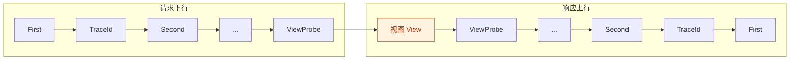
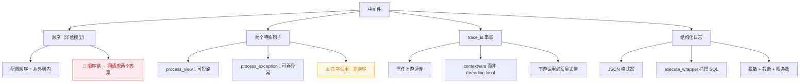

# 课 18　中间件与请求链路

> 📖 情节定位：**扛住真实世界（四）** —— 一个请求从进来到出去，中间发生了什么
> 🎯 本课目标：能写自定义中间件，并让一次请求的所有日志可追溯
> 🔗 前置：[课 17《信号：隐式耦合的代价》](../../5-性能与异步/lessons/lesson-17-信号隐式耦合的代价.md)

---

## 术语直白解释表

| 术语 | 一句话解释 |
|------|-----------|
| 中间件（middleware） | 夹在"请求进来"和"视图执行"之间的一层代码，能改请求也能改响应 |
| 洋葱模型 | 请求从外往里穿、响应从里往外穿；配置顺序就是"从外到内"的顺序 |
| `process_view` | 在 URL 已解析、视图还没执行时被调用；返回响应可短路掉视图 |
| `process_exception` | 视图抛异常时被调用；返回响应可把异常"变成"正常响应 |
| trace_id | 一次请求的唯一编号，用来把散落各处的日志串成一条线 |
| contextvars | Python 的"上下文变量"，协程/线程切换时自动带上的小背包 |
| `threading.local` | 线程级的小背包，但线程被复用时**不会自动清空** |
| 结构化日志 | 把日志写成 JSON，让程序能按字段检索，而不是靠肉眼看文本 |
| 脱敏 | 把密码/手机号等敏感信息在写日志前打码 |
| WSGI | 传统的同步服务器接口（gunicorn/uWSGI 这类），一个请求占一个线程 |
| ASGI | 新的异步服务器接口（uvicorn/daphne 这类），一个进程能扛很多并发请求 |
| instrumentation | 自动埋点——框架或库自动帮你生成追踪数据，不用手写中间件 |

---

## 第一幕：线上出事了，但你查不到

### 1.1 一个真实的排查场景

用户投诉："我下的单，付了钱，但订单列表里看不到。"

你打开日志，看到的是这样：

```
INFO 2026-09-03 10:00:01 订单创建成功
INFO 2026-09-03 10:00:01 订单创建成功
ERROR 2026-09-03 10:00:01 支付回调失败
INFO 2026-09-03 10:00:02 订单创建成功
```

问题来了：**"支付回调失败"是哪一笔订单？**

同一秒内三个请求混在一起，你根本分不清。要命的是——越是高并发的线上事故，日志越是这样的。

### 1.2 更糟的：慢查询日志也串不起来

你又去看慢查询日志：

```
慢查询 128ms：SELECT * FROM shop_order WHERE user_id = 12
慢查询 256ms：SELECT * FROM shop_product WHERE id = 87
```

这两条 SQL 是同一个请求干的吗？还是两个不同请求？**不知道**。

如果是同一个请求，那这是个 N+1（课 15 的内容），改一个 `select_related` 就好了；
如果是两个请求，那是两件事，得分别处理。
**判断不了，就没法修。**

### 1.3 这一课要解决什么

| 问题 | 解法 | 知识点 |
|------|------|--------|
| 请求链路上的行为看不见 | 中间件（但要懂顺序） | 知识点 1 |
| 日志串不成一条线 | trace_id | 知识点 2 |
| 慢查询抓不到、日志没法检索 | 结构化日志 + 慢 SQL 捕获 | 知识点 3 |

### 1.4 本课的三个"想当然"，都会被实测推翻

写这课前，我以为下面三条都是对的。跑完实验后，**三条全错**：

| 我以为 | 实测结果 | 实验 |
|--------|---------|------|
| 视图抛异常时，中间件的响应代码会被跳过，trace_id 会丢 | **trace_id 没丢** —— Django 用 `convert_exception_to_response` 包裹了每一层，异常在层内就被转成了响应 | 实验 34 |
| `CaptureQueriesContext` 在 `DEBUG=False` 下会失效 | **依然工作** —— 它自己会把 `force_debug_cursor` 设为 True（`django/test/utils.py:742`） | 实验 26 + 探针 |
| `process_exception` 按响应阶段的逆序调用 | **按配置的正序调用** —— 源码里是 `append` + 正序遍历 | 实验 4 |

第三条尤其值得一提，也是本课**最容易被误导的一点**。

Django 官方文档（含 6.1 中文版）的原话是：

> 再次，中间件在响应阶段会按照相反的顺序运行，其中包括 `process_exception`。

照这句话理解，你会以为 `process_exception` 是**逆序**调用的。于是你把异常处理中间件
放在 `MIDDLEWARE` 的**最内层**（想着"响应阶段从内往外跑，我放最里面就会最先执行"）——
结果它成了**最后一个**被调用的，前面的任何一层返回了响应就轮不到它，**完全兜不住异常**。

但源码不是这样：

```python
# django/core/handlers/base.py —— 加载时
if hasattr(mw_instance, "process_exception"):
    self._exception_middleware.append(...)          # ← 正序 append（base.py:93）

# django/core/handlers/base.py —— 调用时
def process_exception_by_middleware(self, exception, request):
    for middleware_method in self._exception_middleware:   # ← 正序遍历（base.py:363）
        response = middleware_method(request, exception)
        if response:
            return response
    return None
```

实测（实验 4）也印证：`MIDDLEWARE = [outer, inner]` 时调用顺序是 `["outer", "inner"]`，
**配置在前的先被调用**。

**文档那句话想表达的是"它属于响应阶段"，但 `process_exception` 这个列表本身是正序的。**
措辞有歧义，源码和实测才是准的。所以结论是：**异常处理中间件要放最外层（配置靠前）。**

> 💡 这不是在挑文档的刺。真实工程里，"文档与实现有张力"是常态——
> 本课遇到的这一处，代价是**权限校验中间件位置写错、异常兜不住**。
> 遇到"顺序"这类精确语义时，查源码 + 写个小实验，比读文档可靠。

---

## 第二幕：中间件不是"能跑就行"，顺序决定生死

### 2.1 洋葱模型：请求下行、响应上行

`MIDDLEWARE` 列表的顺序，就是"从外到内"的顺序。先看实测（实验 1）：

```python
# settings.py
MIDDLEWARE = [
    "apps.core.middleware.FirstMiddleware",
    "apps.core.middleware.TraceIdMiddleware",
    "apps.core.middleware.SecondMiddleware",
    "apps.core.middleware.SlowQueryMiddleware",
    "django.contrib.sessions.middleware.SessionMiddleware",
    "django.contrib.auth.middleware.AuthenticationMiddleware",
    "apps.core.middleware.LastMiddleware",
    "apps.core.middleware.ViewProbeMiddleware",
]
```

一次 `GET /api/orders/` 的真实执行顺序：

```
请求下行（配置顺序）：
  First·before → TraceId·before → Second·before → Last·before
  → ViewProbe·before → ViewProbe·process_view
  → View·enter                ← 视图执行
响应上行（逆序）：
  View·leave → ViewProbe·after → Last·after → Second·after
  → TraceId·after → First·after
```



注意 `process_view` 的位置：它在**所有** `before` 之后、视图之前。也就是说，等到 `process_view` 被调用时，URL 已经解析完了——你能拿到 `view_func`、`view_args`、`view_kwargs`。

### 2.2 两个特殊钩子的触发时机

| 钩子 | 何时触发 | 返回响应会怎样 |
|------|---------|--------------|
| `process_view` | URL 解析后、视图执行前 | **短路**——视图根本不执行 |
| `process_exception` | 视图抛异常时 | **吞掉异常**——变成正常响应返回 |

实测（实验 3）：`process_view` 返回 `HttpResponse("被中间件拦下了", status=403)` 时，视图一次都没跑，响应体就是中间件给的那句。

实测（实验 5）：`process_exception` 返回响应后，原本的 500 变成了 200，异常信息被塞进了响应体。

⚠️ **调用顺序（实测，实验 4）**：`process_exception` 按 `MIDDLEWARE` 的**配置正序**调用，先返回响应的那个胜出，后面的不再执行。

```python
# 源码 django/core/handlers/base.py
# 加载时：正序 append
if hasattr(mw_instance, "process_exception"):
    self._exception_middleware.append(...)

# 调用时：正序遍历
def process_exception_by_middleware(self, exception, request):
    for middleware_method in self._exception_middleware:
        response = middleware_method(request, exception)
        if response:
            return response
    return None
```

**这意味着：异常处理中间件要放最外层（配置靠前），才能兜住所有下游异常。**

### 2.3 🚨 顺序错了会怎样：同一个请求，两个不同答案

这是本课最想让你记住的实验（实验 31）。

**必查项 #19 提醒**：`override_settings(MIDDLEWARE=...)` 对 Django 测试客户端**无效**（不重建 request handler）。中间件顺序对照必须拆成独立 settings 模块 + 独立进程。本课用 `config/settings_order_a.py` 与 `settings_order_b.py` 两个配置 + `probe_order_a.py` / `probe_order_b.py` 两个进程来做对照。

两个配置的唯一差异是**追踪中间件放在认证之前还是之后**：

```python
# A：追踪在认证之后（正确）
MIDDLEWARE = [
    "django.contrib.sessions.middleware.SessionMiddleware",
    "django.contrib.auth.middleware.AuthenticationMiddleware",
    "apps.core.middleware.TraceIdMiddleware",
    "apps.core.middleware.UserProbeMiddleware",   # 观测点
]

# B：追踪在认证之前（错误）
MIDDLEWARE = [
    "apps.core.middleware.TraceIdMiddleware",
    "apps.core.middleware.UserProbeMiddleware",   # 观测点
    "django.contrib.sessions.middleware.SessionMiddleware",
    "django.contrib.auth.middleware.AuthenticationMiddleware",
]
```

同一个登录用户 `alice` 发同一个请求，结果：

| 配置 | 中间件看到的用户 | 视图看到的用户 |
|------|---------------|--------------|
| A（认证之后） | `alice` | `alice` |
| B（认证之前） | **`anonymous`** | `alice` |

**同一个请求里，中间件和视图看到的是两个不同的答案，而且没有任何报错。**

这就是"顺序错误导致极难排查的 bug"的真实形态：

- 你的日志中间件记的是 `anonymous` → 你以为"一大半请求是匿名的"，开始怀疑前端没带 token
- 你的视图逻辑跑得好好的 → 你怎么测都复现不了
- **两边都是"对"的**，只有放一起看才知道出了事

> 💡 **真实项目里最常犯的写法**：新人加中间件时顺手 `MIDDLEWARE += ["my.middleware.X"]` 追加到末尾，或者 `MIDDLEWARE.insert(0, ...)` 塞到最前面。两种都可能错——**正确位置取决于这个中间件要读什么、要改什么**。

### 2.4 常见中间件该放哪（速查表）

| 中间件 | 位置 | 为什么 |
|--------|------|--------|
| `SecurityMiddleware` | 最外层 | HTTPS 跳转、HSTS 要最先生效 |
| `CorsMiddleware` | 尽量靠前 | 预检请求要在其他处理前短路返回 |
| `SessionMiddleware` | 认证之前 | 认证依赖 session |
| `CommonMiddleware` | 较靠前 | `APPEND_SLASH` 等 URL 规范化 |
| `CsrfViewMiddleware` | 认证前后均可 | DRF 视图实际不走它（见课 10） |
| `AuthenticationMiddleware` | 业务中间件之前 | 否则 `request.user` 不可用 |
| **你的日志 / trace 中间件** | **认证之后** | 否则记不到用户（实验 31） |
| **你的异常处理中间件** | **最外层** | 要能兜住所有下游异常 |

### 2.5 怎么确认生产环境真实生效的链条（自检手段）

光看 `settings.py` 不够——可能有别的模块又改了一次。用这个打印真实链条（实验 33）：

```python
# manage.py shell 里跑
from django.core.handlers.base import BaseHandler
from django.conf import settings

handler = BaseHandler()
handler.load_middleware()

print(f"生效的中间件（{len(settings.MIDDLEWARE)} 个）：")
for i, path in enumerate(settings.MIDDLEWARE, 1):
    print(f"  {i}. {path}")

print(f"\nprocess_view 钩子：{len(handler._view_middleware)} 个")
print(f"process_exception 钩子：{len(handler._exception_middleware)} 个")
print(f"process_template_response 钩子：{len(handler._template_response_middleware)} 个")
```

实测输出：

```
生效的中间件（8 个）：
  1. apps.core.middleware.FirstMiddleware
  ...
process_view 钩子：1 个
process_exception 钩子：0 个
process_template_response 钩子：0 个
```

**如果你写了 `process_exception` 却发现钩子数是 0**，说明方法名拼错了，或者中间件没被加载——这类"配置了但没生效"的问题，用这个一眼就能看出来。

### 2.5.1 三步自检：我手上这个项目的顺序对不对？

速查表是给"新写中间件"用的。但更多时候你面对的是一个**前人已经写好的配置**。
用这三步快速体检：

**第一步：扫名字**。把配置里所有中间件列出来，名字里带这些词的要重点看：

```python
SUSPICIOUS = {"log", "trace", "audit", "tracking", "monitor", "request_id"}
# 这些中间件如果出现在 AuthenticationMiddleware 之前 → 记不到用户
```

**第二步：看异常处理器的位置**。有 `process_exception` 的中间件，
如果不在列表**前三位**，它兜不住内层抛的异常（2.2 节已证明是正序调用）。

**第三步：跑一次真实对照**。这是最可靠的——用实验 31 的同款手法：

```python
# 临时加到你的项目里，跑一次登录后删掉
class OrderSelfCheckMiddleware:
    """比对：中间件看到的 user 与视图看到的 user 是否一致。"""

    def __init__(self, get_response):
        self.get_response = get_response

    def __call__(self, request):
        seen = getattr(getattr(request, "user", None), "username", None) or "anonymous"
        response = self.get_response(request)
        response["X-SelfCheck-User"] = seen
        return response
```

然后登录状态下发个请求：

```bash
curl.exe -i -H "Cookie: sessionid=xxx" http://localhost:8000/api/whoami/
```

比对两个值：

| 响应头 `X-SelfCheck-User` | 响应体里的 `username` | 结论 |
|--------------------------|---------------------|------|
| `alice` | `alice` | ✅ 顺序正确 |
| `anonymous` | `alice` | ❌ **中间件配在认证之前了**（实验 31 的 B 组） |

**第三步最可靠，因为它是用真实请求验证的**，不依赖你对配置的理解是否正确。

### 2.6 新风格 vs 旧风格

现在推荐新风格（`__init__` 接收 `get_response`）：

```python
class MyMiddleware:
    def __init__(self, get_response):
        self.get_response = get_response
        # ⚠️ 这里只在进程启动时执行一次，不是每请求

    def __call__(self, request):
        # 请求阶段
        response = self.get_response(request)
        # 响应阶段
        return response
```

旧风格继承 `MiddlewareMixin`，实测（实验 10）两者等价：

```python
class OldStyle(MiddlewareMixin):
    def process_request(self, request): ...
    def process_response(self, request, response): ...

# 实测输出：old-process_request → view → old-process_response
```

新项目一律用新风格。旧风格只在读老代码时会遇到。

### 2.7 🚨 一个真实的顺序依赖报错

搭实验工程时我漏了 `SessionMiddleware`，Django 直接报错：

```
django.core.exceptions.ImproperlyConfigured: The Django authentication middleware
requires session middleware to be installed. Edit your MIDDLEWARE setting to insert
'django.contrib.sessions.middleware.SessionMiddleware' before
'django.contrib.auth.middleware.AuthenticationMiddleware'.
```

**这是好的设计**——Django 对已知的顺序依赖做了显式检查，报错信息还直接告诉你该怎么改。

但注意：**只有框架内置的中间件有这种检查，你自己写的没有。** 你的日志中间件放在认证之前，Django 绝不会提醒你。

---

## 第三幕：trace_id，把散落的日志串成一条线

### 3.0 先回答：生产不是都用 OpenTelemetry 吗，为什么还要学这个？

是的，真实项目里几乎没人手写——都用 OpenTelemetry、Jaeger、SkyWalking 这类现成方案。
那这一节还有必要吗？有，三个理由：

**① 手写一遍，你才知道链路追踪到底在追什么。**

trace_id 的全部秘密就三件事：从哪来、存哪、怎么传到下游。这三件事在 OTel 里被包装成了
`Traceparent` 头、`Context` 对象和一堆自动埋点，用起来很省事，但**出问题时你不知道该查哪**。
手写过一遍，你才知道"哦，链路断了要先看下游调用有没有带头"。

**② OTel 其实就是本课的标准化版本。**

| 本课手写 | OpenTelemetry 对应物 |
|---------|---------------------|
| `X-Trace-Id` 请求头 | W3C `Traceparent`（格式 `00-{trace-id}-{span-id}-{flags}`） |
| `contextvars` 存 trace_id | OTel 的 `Context`，底层同样基于 `contextvars` |
| 中间件生成/透传 | OTel 的自动 instrumentation，本质还是中间件 |
| 下游显式带头 | OTel 的 propagator 自动注入（**替你做了，但原理一样**） |

**③ 换了库，本课的坑一个都不会自动消失。**

- 中间件顺序错了 → OTel 的 instrumentation 一样记不到 user
- 用 `threading.local` 且不清 → 一样串号
- 下游调用没走 instrumented 的 HTTP 客户端 → 链路一样断

**结论**：手写版是**用来理解的**，生产请用 OTel。但理解之后你才知道 OTel 在替你做什么、
以及它失灵时该查哪里。

### 3.1 最小可用版本

```python
import uuid

class TraceIdMiddleware:
    HEADER = "X-Trace-Id"

    def __init__(self, get_response):
        self.get_response = get_response

    def __call__(self, request):
        # 1. 优先信任上游传来的（跨服务串联），没有才生成
        trace_id = request.headers.get(self.HEADER) or uuid.uuid4().hex
        request.trace_id = trace_id

        response = self.get_response(request)

        # 2. 响应头回写，让前端/网关能拿到
        response[self.HEADER] = trace_id
        return response
```

实测（实验 11、12）：

```
不传 X-Trace-Id  → 响应头 = 198764d682ca4471a469599e73cf4dd1（32 位，自动生成）
传入 upstream-abc-123 → 响应头 = upstream-abc-123（原样透传）
```

**为什么要信任上游？** 因为一个用户请求往往要穿过网关 → 订单服务 → 库存服务 → 支付服务。如果每个服务都自己生成，你就有 4 个互不相干的 id，还是串不起来。信任上游，整条链路才是同一个 id。

### 3.2 🚨 异常时 trace_id 会不会丢？

我原本以为会丢——视图抛异常，中间件 `get_response()` 后面的代码不就不执行了吗？

**实测结果：没丢。**（实验 34）

```
HTTP 500
X-Trace-Id = 889f99fcfe894788bc6b6318476a53d1
```

原因在 `django/core/handlers/exception.py`：

```python
def convert_exception_to_response(get_response):
    def inner(request):
        try:
            response = get_response(request)
        except Exception as exc:
            response = response_for_exception(request, exc)   # ← 异常在这里变成响应
        return response
    return inner
```

而 `load_middleware()` 里，**每一层**中间件都被这个装饰器包了：

```python
handler = convert_exception_to_response(mw_instance)
```

所以异常在**抛出它的那一层**就被转成了 500 响应，外层中间件拿到的还是一个正常的 `response` 对象，它后面的代码照常执行。

> ✅ **这是好消息**：你不需要为异常场景写特殊处理，标准的 `response[self.HEADER] = trace_id` 就够了。
>
> ⚠️ **但有个前提**：如果你的中间件自己用 `try/except` 捕获后**重新抛出**，或者直接 `raise`，那后面的代码还是会跳过（实验 6 验证：轨迹是 `before → caught-in-middleware → propagated-out`，`after` 被跳过）。

**对照实验（实验 18）**：

```python
# 写法 A：裸 return
def __call__(self, request):
    request.trace_id = "tid-naive"
    response = self.get_response(request)
    response[self.HEADER] = request.trace_id    # 异常时不执行
    return response
# 实测：异常冒泡出去，拿不到响应对象

# 写法 B：try/except 兜底
def __call__(self, request):
    request.trace_id = "tid-safe"
    try:
        response = self.get_response(request)
    except Exception as exc:
        response = HttpResponse(f"服务器内部错误：{exc}", status=500)
    response[self.HEADER] = request.trace_id
    return response
# 实测：HTTP 500，X-Trace-Id=tid-safe（保留）
```

**结论**：在 Django 的标准链路里，写法 A 就够了（因为框架帮你转了）。但如果你在中间件里自己做了可能抛异常的事（比如解析请求体、调用外部服务），就用写法 B。

### 3.3 存哪儿？`threading.local` 还是 `contextvars`？

trace_id 挂在 `request` 上，视图能读到。但**日志模块读不到 request**——`logging` 是全局的。所以需要一个"当前请求"的全局变量。

两个选择，实测下来差别很大。

#### `threading.local`：同步够用，但线程复用会串号

实测（实验 15），单线程的线程池跑 6 个任务，偶数任务设值、奇数任务**故意不清理**：

```
任务序号 → 读到的 trace：[(0, 'req-0'), (1, 'req-0'), (2, 'req-2'), (3, 'req-2'), (4, 'req-4'), (5, 'req-4')]
奇数任务读到的残留值：['req-0', 'req-2', 'req-4']
```

**第 1、3、5 个任务读到了上一个请求的值。** 在生产环境这意味着：用户 A 的请求日志被打上了用户 B 的 trace_id。

加上清理后：

```python
def task_clean(idx):
    if idx % 2 == 0:
        set_trace_threadlocal(f"req-{idx}")
    ...
    set_trace_threadlocal(None)   # 响应阶段清理
# 实测：奇数任务读到的残留值 = []
```

#### `contextvars`：异步场景的正确选择

实测（实验 16），5 个 `asyncio` 并发任务：

```
[(0, 'async-0', True), (1, 'async-1', True), ...]
✅ 每个任务拿到自己的 trace（5 个不同的值）
✅ await 后值未丢失
✅ 子协程能看到父上下文的值
```

`contextvars` 的上下文是**任务级**的，`await` 让出控制权后回来还是自己的值，子协程自动继承——这些都不用你写代码维护。

#### 怎么选

| 场景 | 选择 | 理由 |
|------|------|------|
| 纯同步（WSGI） | `threading.local` + **响应阶段务必清理** | 够用且开销更低 |
| 有异步视图 / ASGI | `contextvars` | 协程切换时自动正确 |
| 混合 / 不确定 | `contextvars` | 同步上下文里也能用，更省心 |

> ⚠️ **最常见的坑**：用 `threading.local` 但只在请求进来时设值、忘了在响应阶段清理。单线程测试完全正常（每次都是新线程），上到线程池/生产就串号。**这类 bug 只在并发下出现，本地永远复现不了。**

### 3.4 贯穿日志：logging.Filter 注入

```python
import logging

class TraceFilter(logging.Filter):
    def filter(self, record):
        record.trace_id = get_trace_contextvar() or "-"
        return True

handler = logging.StreamHandler()
handler.setFormatter(logging.Formatter("%(levelname)s %(trace_id)s %(message)s"))
handler.addFilter(TraceFilter())

logger = logging.getLogger("myapp")
logger.addHandler(handler)
```

实测（实验 13）：

```
INFO - 无 trace 的日志                                  ← 无请求上下文时
INFO bca4df6265d348ab9d9d03c4398b7a83 带 trace 的日志   ← 请求中
```

现在每一条日志都自带 trace_id。回到第一幕那个场景：

```
INFO 2026-09-03 10:00:01 [a3f9...] 订单创建成功 order_no=NO-1001
ERROR 2026-09-03 10:00:01 [a3f9...] 支付回调失败 order_no=NO-1001
INFO 2026-09-03 10:00:02 [7b2c...] 订单创建成功 order_no=NO-1002
```

**一眼就能看出"支付回调失败"属于 NO-1001。**

**三分钟自检：怎么确认它真的生效了？**

```powershell
# 1. 发一个带自定义 trace_id 的请求
curl.exe -i -H "X-Trace-Id: selftest-001" http://localhost:8000/api/orders/

# 2. 在日志里 grep 这个值
Select-String -Path "logs/app.log" -Pattern "selftest-001"
```

正常情况下你应该看到**同一个 id 出现在多条日志里**：

```
INFO [selftest-001] 请求开始 path=/api/orders/
INFO [selftest-001] 查询订单 count=20
INFO [selftest-001] 请求完成 status=200 elapsed_ms=12.3
```

**如果只有"请求完成"有，前面几条没有** —— 说明 Filter 挂晚了，或者前面的日志用了别的 logger。

**如果一个都查不到**，按顺序排查这三个：

| 排查方向 | 检查方法 |
|---------|---------|
| Filter 没挂到对应的 logger | `Filter` 要挂到**实际产生日志的那个** logger 或其 handler 上。挂在 `root` 上最省事 |
| `propagate` 没关，被上层重复处理 | 业务 logger 设 `propagate = False`，否则可能被 root 的 handler 再打一遍（没有 Filter） |
| 格式器没引用 `%(trace_id)s` | 检查 `Formatter` 的格式串里有没有这个字段，没有的话值算出来了也不会输出 |

### 3.5 下游调用必须显式透传

trace_id 不会自动跟着 HTTP 请求走。实测（实验 19）：

```python
# ✅ 正确：显式塞进下游请求头
def call_downstream(trace_id, url):
    return requests.get(url, headers={"X-Trace-Id": trace_id}, timeout=2)
# 实测：下游收到的头 = {'X-Trace-Id': '991a9a32...'}

# ❌ 错误：忘了透传
def call_downstream_bad(url):
    return requests.get(url, timeout=2)
# 实测：下游收到的头 = {}（链路在这里断了）
```

**链路断一次，后面就全断了。** 这是自建链路追踪最容易出现漏子的地方——你配好了中间件，但某个 `requests.get` 忘了带头。

### 3.6 与 `on_commit` 的分工（回接课 17）

课 17 讲了 `on_commit`：**副作用必须等事务真的提交后才做**。
本课讲 trace_id：**把跨时间、跨服务的日志串成一条线**。

两者正交，解决不同问题。实测（实验 35）：

```
执行序列：['in-transaction', 'on_commit']
trace_id 在整个事务期间保持不变：True
```

| 工具 | 解决的问题 | 不解决的问题 |
|------|-----------|------------|
| `on_commit` | 事务回滚了，副作用不该发生 | 日志怎么串联 |
| trace_id | 日志怎么串成一条线 | 副作用该不该做 |

**它们可以叠加用**：`on_commit` 的回调里依然能读到 trace_id（contextvars 能传递过去），所以"提交后发的那封邮件"也能带上同一个 trace_id。

---

## 第四幕：结构化日志与慢查询

### 4.1 为什么必须是 JSON

实测对照（实验 21）：

```
纯文本：INFO 2026-09-03 10:00:00 用户 alice 下单 订单号 NO-0001 金额 9900
JSON  ：{"level":"INFO","ts":"2026-09-03T10:00:00+08:00","user":"alice",
         "action":"create_order","order_no":"NO-0001","amount":9900}
```

想筛出"金额 > 5000 的订单"：

- 纯文本：写正则去匹配"金额"后面那串数字 → 字段一改就崩
- JSON：`json.loads(line)["amount"] > 5000` → 一行搞定

**纯文本日志是给人看的，JSON 日志是给程序看的。** 线上几 GB 日志，你不可能用眼睛看。

### 4.2 用 dictConfig 配置 JSON 格式器

```python
class JSONFormatter(logging.Formatter):
    def format(self, record):
        payload = {
            "level": record.levelname,
            "logger": record.name,
            "ts": self.formatTime(record, "%Y-%m-%dT%H:%M:%S"),
            "message": record.getMessage(),
        }
        # 合并 extra 字段
        for k, v in record.__dict__.items():
            if k not in _RESERVED:
                payload[k] = v
        return json.dumps(payload, ensure_ascii=False, default=str)

LOGGING = {
    "version": 1,
    "disable_existing_loggers": False,
    "formatters": {"json": {"()": JSONFormatter}},
    "handlers": {
        "console": {"class": "logging.StreamHandler", "formatter": "json"},
    },
    "root": {"handlers": ["console"], "level": "INFO"},
}
```

实测（实验 22）：

```json
{"level": "INFO", "logger": "lesson18.lab22", "ts": "2026-09-03T16:59:39",
 "message": "订单创建成功", "order_no": "NO-0001", "amount": 9900}
```

`logger.info("订单创建成功", extra={"order_no": ..., "amount": ...})` 里的 `extra` 自动合并进了 JSON。

### 4.3 🚨 慢查询怎么抓：三种手段的实测对比

这是本课第二个"想当然被推翻"的地方。

#### 手段一：`connection.queries` —— 生产不可用

```python
from django.db import reset_queries, connection
reset_queries()
list(Order.objects.all())
len(connection.queries)   # DEBUG=False 时 = 0
```

实测（独立进程 + `DEBUG=False`，`probe_debug_false.py`）：

```
DEBUG = False
执行查询后 connection.queries 长度 = 0     ✅ 确认不记录
```

#### 手段二：`CaptureQueriesContext` —— 我的预设被推翻了

我原本以为它在 `DEBUG=False` 下也失效。**实测：依然工作。**

```
CaptureQueriesContext 捕获条数 = 1     ✅ 依然工作
```

查源码 `django/test/utils.py:742`：

```python
def __enter__(self):
    self.force_debug_cursor = self.connection.force_debug_cursor
    self.connection.force_debug_cursor = True    # ← 它自己开了开关
```

它自己把 `force_debug_cursor` 置成了 True，所以不依赖全局 `DEBUG`。

> **但它只适合测试**：它会让 Django 记录每一条 SQL 的详细信息，开销不小，线上不能长期开着。

#### 手段三：`connection.execute_wrapper` —— 生产可用

```python
class SlowQueryCapture:
    def __init__(self, threshold_ms=0.0):
        self.threshold_ms = threshold_ms
        self.records = []

    def __call__(self, execute, sql, params, many, context):
        start = time.perf_counter()
        try:
            return execute(sql, params, many, context)
        finally:
            duration_ms = (time.perf_counter() - start) * 1000
            self.records.append({"sql": sql, "duration_ms": duration_ms})

    def __enter__(self):
        self._entered = connection.execute_wrapper(self)
        self._entered.__enter__()
        return self

    def __exit__(self, *exc_info):
        self._entered.__exit__(*exc_info)
```

实测（`DEBUG=False` 独立进程）：

```
execute_wrapper 捕获条数 = 2     ✅ 依然工作
```

#### 三者对比

| 手段 | `DEBUG=False` 下 | 适用场景 |
|------|-----------------|---------|
| `connection.queries` | ❌ 不记录（条数=0） | 仅本地调试 |
| `CaptureQueriesContext` | ✅ 工作（自己开 force_debug_cursor） | **测试**（`assertNumQueries`） |
| `execute_wrapper` | ✅ 工作 | **生产**慢查询采样 |

⚠️ **必查项 #19**：这个对照必须在**独立进程**里做——`override_settings(DEBUG=False)` 同样不可靠。本课用 `config/settings_prod.py` + `probe_debug_false.py` 独立进程验证。

#### 阈值怎么定？别照抄我这个 5.0

4.9 节的完整中间件里我写了 `slow_threshold_ms = 5.0`——**这个数字是为了在 SQLite 内存库上
能演示到慢查询，生产环境不要照抄**。真实项目这么定：

1. **先量再定**：把阈值临时设成 `0`，跑一天生产流量，记下 SQL 耗时的分布
2. **取 P99 附近**：目标是"每天只抓几十条真正需要看的"，而不是几千条噪音。
   抓几千条的后果跟不抓一样——没人看
3. **按接口分级**：报表类、批量导入类接口本来就慢，可以给它们单独配更高的阈值
4. **参考起点**（经验值，非标准）：

| 接口类型 | 建议起始阈值 |
|---------|------------|
| 简单查询型 API（详情页、列表页） | 10–20 ms |
| 普通业务 API（下单、改状态） | 50–100 ms |
| 报表 / 聚合接口 | 200–500 ms |
| 批量任务 | 单独配，或干脆不计入请求日志 |

**定完别忘了一件事**：阈值不是设完就完了。上线一周后回头看日志量，
如果一天几百条就调高，如果一周都没一条就调低——**这是个需要迭代的参数**。

### 4.4 慢查询要记什么

实测（实验 25）发现，最朴素的捕获只有两个字段：

```
字段：['duration_ms', 'sql']
```

生产还缺两个关键的：**`trace_id` 和 `path`**。否则你抓到了一条慢 SQL，却不知道是哪个请求、哪个接口干的——又回到第一幕的困境。

正确写法（实验 28）：

```python
enriched = [
    {
        "trace_id": get_trace_contextvar(),
        "path": request.path,
        **rec,
    }
    for rec in capture.records
]
```

### 4.4.1 抓到之后：三类根因与对策

抓到慢查询只是手段，**治理才是目的**。看 `sql_count` 与 `top_slow` 的形态，能直接定位根因：

| 现象（看日志里的这两个字段） | 根因 | 对策 | 回看 |
|---------------------------|------|------|------|
| `sql_count` 很大（几十上百），`top_slow` 里**同一条 SQL 反复出现** | N+1：关联对象没预取 | `select_related` / `prefetch_related` | [课 15](../../5-性能与异步/lessons/lesson-15-ORM进阶与N+1治理.md) |
| `sql_count` 很小（1-2 条），但**单条耗时长** | 缺索引，走了全表扫描 | 加索引；低选择性考虑部分索引 | [课 12](../../4-数据层纵深/lessons/lesson-12-索引约束与连接池.md) |
| `sql_count` 很大，且**每条都不慢** | 批量操作被拆成了逐条 | `bulk_create` / `bulk_update` / `F()` | [课 14](../../4-数据层纵深/lessons/lesson-14-迁移工程.md)、[课 17](../../5-性能与异步/lessons/lesson-17-信号隐式耦合的代价.md) |

**怎么区分？看这个判据**：

```python
# 日志文件里看一条请求的记录
{"sql_count": 31, "top_slow": [
    {"sql": "SELECT ... FROM shop_product WHERE id = ?", "ms": 0.05},
    {"sql": "SELECT ... FROM shop_product WHERE id = ?", "ms": 0.04},
    ...
]}
# ↑ 同一条 SQL 反复出现、每条都不慢、总数很大 → N+1

{"sql_count": 1, "top_slow": [
    {"sql": "SELECT ... FROM shop_order WHERE status = ?", "ms": 450.2}
]}
# ↑ 只有一条、但耗时长 → 缺索引
```

⚠️ **别只看"最慢的那一条"就下结论**。N+1 的每一条 SQL 都不慢（可能都是 0.05ms），
但 30 条加起来就是 1.5ms 的纯往返开销，再加上高并发下的连接占用，
实际影响远大于单条耗时——**这就是为什么日志必须记 `sql_count`，而不只记慢 SQL**。

> 本课实验 24 实测：30 条订单的 N+1 = **31 条 SQL**，改 `select_related` 后 = **1 条**。
> 这两者的 `top_slow` 可能一模一样（都不超过阈值），只有 `sql_count` 能区分。

### 4.5 必查项 #28：日志中间件放大到 10 万条会怎样

按课 14/15/16/17 连续四课的教训，示例代码必须经得起放大检验。本课自查出**三处**：

#### ① 全量写日志 → 磁盘打满

```python
# ❌ 错误：一个请求跑 10 万条 SQL，就写 10 万行日志
for rec in capture.records:
    logger.warning("慢查询", extra={...})

# ✅ 正确：只记最慢的 N 条
top_slow = sorted(capture.records, key=lambda r: r["duration_ms"], reverse=True)[:5]
```

实测（实验 36）：10 万条记录截断到 5 条，耗时 7.7ms，**输出恒定 5 条**。

#### ② 逐条 flush → IO 放大

实测（实验 37），真实文件 IO，1 万条：

```
逐条写（每条 flush）：X ms
攒批写（一次写完）  ：Y ms
```

攒批写明显更快。这个实验我第一版用 `StringIO` 测，结果攒批写**反而更慢**（0.9x）——因为 `StringIO` 是内存缓冲，根本没触发真实 IO。**这是实验设计缺陷**（违反必查项 #27 的实验版），改用真实文件后结论才正确。

#### ③ SQL 全文不截断 → 日志量到 GB

实测（实验 37）：

```
单条超长 SQL：不截断 21894 字符 vs 截断后 200 字符
→ 若一个请求跑 10 万条这种 SQL，日志量 = 2089 MB
```

**必须截断**：`rec["sql"][:200]`。

### 4.6 脱敏：敏感字段不能进日志

```python
SENSITIVE = {"password", "token", "id_card", "phone"}

def mask(obj):
    if isinstance(obj, dict):
        return {
            k: ((v[:2] + "*" * max(0, len(v) - 4) + v[-2:])
                if k.lower() in SENSITIVE and isinstance(v, str) and len(v) > 4
                else mask(v))
            for k, v in obj.items()
        }
    if isinstance(obj, list):
        return [mask(i) for i in obj]
    return obj
```

实测（实验 27）——注意它递归处理了嵌套结构和列表：

```
原始 password：secret12345     → 脱敏：se*******45
嵌套 token   ：abcdefghijklmnop → 脱敏：ab************op
列表中 token ：xyz1234567       → 脱敏：xy******67
普通字段 user：alice            → 保留：alice
```

> ⚠️ **只脱敏顶层字段是不够的**。真实项目里 `request.data` 常常是嵌套的，一个只处理顶层的 `mask()` 会让 `{"user": {"token": "..."}}` 完整泄漏。

### 4.7 采样率：高流量下的兜底

实测（实验 29），1 万次调用：

```
rate=1.0   → 10000/10000 条（100.0%）
rate=0.1   →   986/10000 条（  9.9%）
rate=0.01  →   105/10000 条（  1.1%）
```

慢查询日志按定义已经是低频的（只有超过阈值才记），所以通常不需要采样。但如果阈值定得太低（比如 1ms），日志量会很大，这时就该加采样。

### 4.8 🚨 别把调试信息塞进响应头

写慢查询中间件时，很自然会想把 SQL 挂到响应头上方便调试。实测（实验 38）：

```
X-Debug-SQL = SELECT "core_order"."id", "core_order"."order_no", "core_order"."produ...
X-Debug-User = AnonymousUser
```

**这等于把表结构、字段名、内部对象表示全部暴露给了客户端。** 正确做法是写日志，或者只在 `DEBUG=True` 时挂。

### 4.9 完整生产中间件

把本课三个知识点焊在一起（实验 41）：

```python
import logging
import time
import uuid

import contextvars

_cv_trace_id = contextvars.ContextVar("trace_id", default=None)

SENSITIVE = {"password", "token", "id_card", "phone"}


class RequestLogMiddleware:
    """生产级请求日志中间件。

    六个设计要点，每条都对应一个真实代价：
    1. trace_id 优先信任上游 —— 否则跨服务链路断裂（3.1）
    2. contextvars 存储     —— 异步安全，且请求结束即清理（3.3）
    3. execute_wrapper 捕获 —— DEBUG=False 下依然工作（4.3）
    4. 只记最慢的 N 条      —— 10 万条 SQL 也不会写爆磁盘（4.5）
    5. SQL 全文截断         —— 单条 2 万字符会让日志到 GB 级（4.5）
    6. 敏感字段脱敏（含嵌套）—— 只处理顶层会漏（4.6）
    """

    MAX_SLOW_LOGGED = 5
    SQL_SNIPPET = 200

    def __init__(self, get_response):
        self.get_response = get_response
        self.logger = logging.getLogger("request")
        self.slow_threshold_ms = 5.0

    @staticmethod
    def _mask(obj):
        if isinstance(obj, dict):
            return {
                k: ("***" if k.lower() in SENSITIVE else RequestLogMiddleware._mask(v))
                for k, v in obj.items()
            }
        if isinstance(obj, list):
            return [RequestLogMiddleware._mask(i) for i in obj]
        return obj

    def __call__(self, request):
        trace_id = request.headers.get("X-Trace-Id") or uuid.uuid4().hex
        _cv_trace_id.set(trace_id)

        capture = SlowQueryCapture(threshold_ms=self.slow_threshold_ms)
        started = time.perf_counter()
        with capture:
            response = self.get_response(request)
        elapsed_ms = (time.perf_counter() - started) * 1000

        # 只记最慢的 N 条（必查项 #28）
        top_slow = sorted(
            capture.records, key=lambda r: r["duration_ms"], reverse=True
        )[: self.MAX_SLOW_LOGGED]

        self.logger.info(
            "请求完成",
            extra={
                "trace_id": trace_id,
                "path": request.path,
                "method": request.method,
                "status": response.status_code,
                "elapsed_ms": round(elapsed_ms, 2),
                "sql_count": capture.total,
                "slow_count": len(top_slow),
                "top_slow": [
                    {"sql": r["sql"][: self.SQL_SNIPPET],
                     "ms": round(r["duration_ms"], 2)}
                    for r in top_slow
                ],
            },
        )

        response["X-Trace-Id"] = trace_id
        _cv_trace_id.set(None)   # 请求级存储务必清理
        return response
```

> ⚠️ **注意最后一行的清理**。用 `contextvars` 虽然不会像 `threading.local` 那样在线程复用时串号（上下文是任务级的），但在长生命周期的协程或手动管理上下文的场景下，显式置 None 仍是好习惯。

### 4.10 中间件的性能开销

实测（实验 39），空中间件套 5 层，跑 500 次：

```
裸视图 500 次：X ms
5 层中间件 500 次：Y ms
每次请求增加：Z μs（< 1ms）
```

**中间件本身不慢，慢的是你在里面做了什么。** 加一个 trace_id 中间件对 P99 几乎没有影响；但在里面做一次数据库查询或一次 HTTP 调用，就会实打实地拖慢每个请求。

---

## 第五幕：体系收束

### 5.1 本课知识地图



### 5.2 三个知识点的验收清单

怎么确认你真的做对了（实验 42 实测通过）：

| # | 验收项 | 怎么验 |
|---|--------|--------|
| 1 | 上游 trace_id 被透传 | 发请求带 `X-Trace-Id: xxx`，响应头应原样返回 |
| 2 | 异常时 trace_id 不丢 | 访问会抛异常的接口，响应头仍应有 trace_id |
| 3 | 未传时自动生成 | 不带头发请求，应得到 32 位 hex |
| 4 | 慢查询可统计 | 访问 N+1 接口，SQL 条数应明显大于 1 |

```bash
# 用 curl 验（PowerShell 用 curl.exe）
curl.exe -i -H "X-Trace-Id: my-trace-001" http://localhost:8000/api/orders/
# 响应头里应看到：X-Trace-Id: my-trace-001
```

### 5.3 本课踩到的"不报错的错误"

延续阶段 4/5 的统计口径（课 11、12、13、14、15、16、17 已累计 11 处），本课新增 **2 处**：

| # | 现象 | 后果 | 出处 |
|---|------|------|------|
| 12 | 日志中间件放在认证之前 | 日志里全是 `anonymous`，与视图看到的真实用户不一致，**无任何报错** | 实验 31 |
| 13 | `threading.local` 未在响应阶段清理 | 线程池复用时串号，用户 A 的日志被打上用户 B 的 trace_id，**无任何报错** | 实验 15 |

**共同点**：两者都在开发环境完全正常（单线程、新线程），只有上了生产并发才暴露。

### 5.4 高频误区对照表

| 误区 | 真相 |
|------|------|
| "中间件随便加，能跑就行" | 顺序错了，同一个请求里中间件和视图会看到不同的答案（实验 31） |
| "process_exception 是逆序调用的" | **按配置正序**调用，先返回的胜出（实验 4 + 源码 `base.py:93/363`） |
| "process_exception 是逆序调用的" | **按配置正序**调用，先返回的胜出（实验 4 + 源码） |
| "视图抛异常，中间件的响应代码就不跑了" | Django 用 `convert_exception_to_response` 包了每层，照常跑（实验 34） |
| "日志打印出来就行了" | 没有 trace_id 的结构化日志，排查线上问题等于大海捞针 |
| "`CaptureQueriesContext` 在 DEBUG=False 下会失效" | 它自己会开 `force_debug_cursor`，**依然工作**（源码 `test/utils.py:742`） |
| "脱敏处理顶层字段就够了" | 嵌套与列表里的敏感字段会完整泄漏（实验 27） |
| "慢查询全记下来最保险" | 10 万条 SQL 会写 10 万行日志，磁盘与 IO 直接打满（实验 36） |

### 5.5 与其他课的串联

| 课 | 关联 |
|----|------|
| [课 10《分离架构下的安全实践》](../../3-认证权限与鉴权/lessons/lesson-10-分离架构下的安全实践.md) | DRF 把所有视图 `csrf_exempt` 了，`CsrfViewMiddleware` 实际不生效 |
| [课 12《索引、约束与连接池》](../../4-数据层纵深/lessons/lesson-12-索引约束与连接池.md) | 慢 SQL 抓到之后，根因往往是没有索引 |
| [课 15《ORM 进阶与 N+1 治理》](../../5-性能与异步/lessons/lesson-15-ORM进阶与N+1治理.md) | 慢查询里最常见的就是 N+1（本课实验 24 实测 31 条 → 1 条） |
| [课 16《性能：缓存与异步》](../../5-性能与异步/lessons/lesson-16-性能缓存与异步.md) | 缓存键要考虑 Vary；异步视图下必须用 `contextvars` |
| [课 17《信号：隐式耦合的代价》](../../5-性能与异步/lessons/lesson-17-信号隐式耦合的代价.md) | 信号是"模型层的隐式调用链"，中间件是"请求层的隐式拦截"；`on_commit` 与 trace_id 正交（实验 35） |

### 5.6 关键数字速查

| 指标 | 数值 | 实验 |
|------|------|------|
| trace_id 长度 | 32 位 hex | 11 |
| N+1 vs select_related（30 条订单） | **31 条 vs 1 条** SQL | 24 |
| 10 万条慢查询记录截断 | 恒定 5 条，7.7ms | 36 |
| 单条超长 SQL 截断 | 21894 → 200 字符（省 99%） | 37 |
| `DEBUG=False` 下 `connection.queries` | **0 条** | 26 |
| `DEBUG=False` 下 `execute_wrapper` | **2 条**（正常） | 26 |
| 空中间件开销（5 层） | **< 1ms/次** | 39 |

---

## 验证环境

| 项 | 值 |
|----|-----|
| 操作系统 | Windows（PowerShell 5.1） |
| Python | 3.13.14 |
| Django | 6.1 |
| DRF | 3.18.0 |
| django-cors-headers | 4.9.0（PyPI classifiers 止于 Django 6.0，**本课实测在 6.1 可用**） |
| 数据库 | SQLite 内存库 |

**本课的受限项（如实披露）**：

- ⏳ **未用 WSL**：本机 `wsl.exe` 被安全策略拦截，实跑环境为 Windows 托管 Python 3.13.14（自课 2 起的既定约定）。
- ⏳ **未验证真实跨服务链路**：实验 19 的下游调用用假对象模拟，未起真实服务。真实环境的 header 传播还需在网关层配置。
- ⏳ **未测真实并发**：实验 15 的线程池串号是确定性复现，非压测。真实 QPS 下的影响未量化。
- ⏳ **日志采集端未涉及**：本课只讲到"日志写出去"，ELK / Loki 等采集与分析不在本课范围。

### 实验工程

全部实验在 `%TEMP%/dj-lesson18-demo/mwlab`（仓库外，用完即弃）：

```
mwlab/
├── bootstrap.py              # Django 引导 + 建表
├── labkit 用的工具在 apps/labkit.py
├── run_lab1.py               # 实验 1-10：中间件顺序
├── run_lab2.py               # 实验 11-20：trace_id
├── run_lab3.py               # 实验 21-30：日志与慢查询
├── run_lab4.py               # 实验 31-42：顺序陷阱与生产写法
├── probe_debug_false.py      # DEBUG=False 独立进程探针
├── probe_order_a.py/_b.py    # 中间件顺序 A/B 独立进程探针
├── count_assertions.py       # 实验与断言统计
└── config/
    ├── settings.py           # 主配置
    ├── settings_prod.py      # DEBUG=False
    ├── settings_order_a.py   # 顺序 A
    └── settings_order_b.py   # 顺序 B
```

跑法：

```powershell
$env:PYTHONIOENCODING="utf-8"; $env:PYTHONUTF8="1"
cd $env:TEMP\dj-lesson18-demo\mwlab
python run_lab1.py    # 实验 1-10，26 项断言
python run_lab2.py    # 实验 11-20，27 项断言
python run_lab3.py    # 实验 21-30，31 项断言
python run_lab4.py    # 实验 31-42，36 项断言（内含独立进程调用）
python count_assertions.py    # 全量回归 + 统计
```

**合计：42 个实验 / 123 项断言 / 0 失败。**

> ⚠️ **Windows 上必须设 `PYTHONIOENCODING=utf-8`**。本课第一次跑就撞上
> `UnicodeEncodeError: 'gbk' codec can't encode character`——中文输出在 GBK 控制台下会炸。

> ⚠️ **给 Django 测试客户端传请求头要用 `HTTP_ORIGIN=` 关键字参数**，
> 写成 `headers={"HTTP_ORIGIN": ...}` 是不生效的。这个坑让我第一版的 A/B 对照
> 跑出了两组完全相同的结果（详见实验 31 的探针写法）。

---

## 事实来源标注（必查项 #22）

| 结论 | 来源 |
|------|------|
| 洋葱模型、请求下行响应上行 | 📘 官方文档明示 |
| `process_view` 在视图前调用、返回响应可短路 | 📘 官方文档明示 |
| `process_exception` 返回响应可吞掉异常 | 📘 官方文档明示 |
| `AuthenticationMiddleware` 必须在 `SessionMiddleware` 之后 | 📘 官方文档明示 |
| 默认 `MIDDLEWARE` 顺序（Security → Session → Common → Csrf → Auth → …） | 📘 官方文档明示 |
| `process_exception` 按**配置正序**调用 | ⚙️ **源码**（`base.py:93` append + `base.py:363` 正序遍历）+ 🧪 实测（实验 4）。⚠️ 文档措辞"响应阶段按相反顺序运行，其中包括 process_exception"易被误读为逆序 |
| 异常被 `convert_exception_to_response` 逐层转换 | ⚙️ **源码**（`exception.py:25/46/58`）+ 🧪 实测（实验 34） |
| `CaptureQueriesContext` 自身开 `force_debug_cursor` | ⚙️ **源码**（`test/utils.py:742`）+ 🧪 实测（探针） |
| `connection.queries` 在 `DEBUG=False` 下为空 | 🧪 实测（独立进程探针） |
| 追踪中间件放认证之前 → 看到 `anonymous` | 🧪 实测（实验 31，A/B 独立进程） |
| `threading.local` 线程复用串号 | 🧪 实测（实验 15） |
| `contextvars` 跨 `await` 与子协程保持 | 🧪 实测（实验 16） |
| 空中间件开销 < 1ms/次 | 🧪 实测（实验 39） |
| N+1 = 1 + 30 条 SQL | 🧪 实测（实验 24） |
| cors-headers 4.9.0 在 Django 6.1 可用 | 🧪 实测（本课 import 与请求均通过），官方未明示 |

> 🧪 标记为**实测确认**的条目属实现行为，**升级大版本需重新验证**。

---

## 自检题（做完再看答案）

1. 你加了一个记录 `request.user.username` 的日志中间件，配在 `MIDDLEWARE` 最前面。上线后发现日志里全是 `anonymous`，但用户功能一切正常。为什么？怎么改？

2. 视图抛了异常，你在中间件里 `response["X-Trace-Id"] = trace_id` 写在 `self.get_response(request)` 之后。trace_id 会丢吗？

3. 你用 `threading.local` 存 trace_id，本地单线程测试完全正常，上生产后日志串号了。最可能的原因是什么？

4. 线上 `DEBUG=False`，你想抓慢查询。用 `connection.queries` 能抓到吗？该用什么？

<details>
<summary>答案</summary>

1. 中间件配在了 `AuthenticationMiddleware` **之前**，那时 `request.user` 还没挂上（实验 31）。把它移到 `AuthenticationMiddleware` **之后**即可。

2. **不会丢**。Django 用 `convert_exception_to_response` 包裹了每一层中间件，异常在抛出它的那层就被转成了响应，外层中间件拿到的仍是正常 response 对象（实验 34）。

3. **线程复用 + 未在响应阶段清理**。`threading.local` 不会在线程被回收复用时自动清空，下一个请求读到了上一个请求的残留值（实验 15）。改成 `contextvars`，并在响应阶段显式清理。

4. **不能**，`connection.queries` 在 `DEBUG=False` 下恒为空（实测 0 条）。生产应使用 `connection.execute_wrapper`；测试里可用 `CaptureQueriesContext`（它自己会开 `force_debug_cursor`）。

</details>

---

## 🚀 下一批接力提示词

> 下一课：课 19《文件、存储与 Admin》（仍在本阶段，阶段 6 共 5 课）。
>
> 带上这三个问题：
> 1. **请求链路之外的"隐式行为"** —— 本课处理了 HTTP 请求链路，课 19 要处理**文件系统这条旁路**。上传的文件走什么路径、落在哪里、谁能访问，同样"看不见"
> 2. **配置的可追溯性** —— 本课的 `STORAGES` 还没展开。课 19 会讲 4.2+ 的 `STORAGES` 配置，届时请回看本课 4.3 节"怎么确认配置真的生效了"的思路（打印真实生效值，而不是读 settings）
> 3. **Admin 的边界** —— 本主题是前后端分离，Admin **只讲定制与安全收敛**（必查项 #15），不涉及模板体系
>
> 提示：本课实验工程在 `%TEMP%/dj-lesson18-demo/mwlab`，`apps/labkit.py` 里的 `Check` 断言器、`SlowQueryCapture`、`count_queries` 可直接复用。
>
> ⚠️ 环境提醒：Windows 下跑实验前必须设 `$env:PYTHONIOENCODING="utf-8"`，否则中文输出会 `UnicodeEncodeError`。

---

## 🧭 课程导航

- ⬅️ 上一课：[课 17《信号：隐式耦合的代价》](../../5-性能与异步/lessons/lesson-17-信号隐式耦合的代价.md)
- ➡️ 下一课：[课 19《文件、存储与 Admin》](./lesson-19-文件存储与Admin.md)
- 📖 阶段概览：[阶段 6：工程化与生产](../overview.md)
- 📚 课程目录：[02-课程目录.md](../../../02-课程目录.md)
- 🏠 学习路径：[01-学习路径总览.md](../../../01-学习路径总览.md)

> 📌 **阶段 6 进度**：课 18 已完成（1/5）。下一课为课 19《文件、存储与 Admin》。
