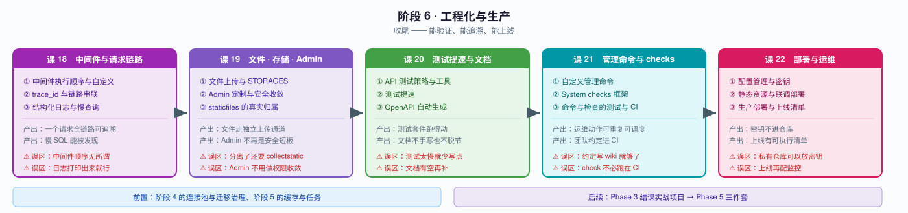
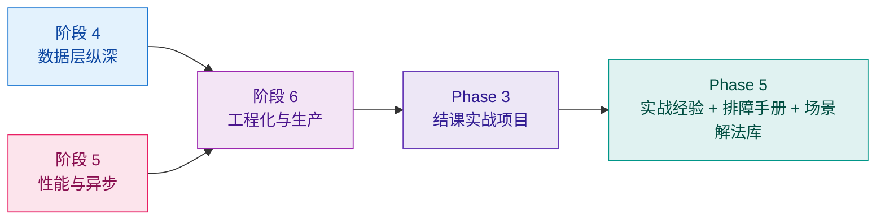

# 阶段 6：工程化与生产

> 📖 故事章节：**收尾** —— 能验证、能追溯、能上线
> 🎯 本阶段回答：请求链路怎么追溯？文件与 Admin 怎么处理？怎么测得快、上线稳？

---

## 阶段目标

| 目标 | 达成标志 |
|------|----------|
| 请求链路可追溯 | 一个请求的所有日志能通过 trace_id 串起来 |
| 文件走独立通道 | 上传接口与对象存储配置正确，不再混在业务接口里 |
| Admin 安全可用 | 定制成可用的运营后台，且做好安全收敛 |
| 知道 staticfiles 归谁 | 不再为"分离后还要不要 collectstatic"纠结 |
| 测得快也测得动 | 测试套件有提速手段，不是跑一次半小时 |
| 文档自动生成 | OpenAPI 自动产出，不手写 |
| 运维动作可固化 | 管理命令与 System checks 把约定变成自动检查 |
| 能上线 | 配置与密钥不进仓库，有可执行的检查清单 |

---

## 学习重点

### 🔑 必须掌握的知识点

| 课 | 知识点 | 为什么必须掌握 | 关键点 |
|----|--------|---------------|--------|
| 课 18 | 中间件执行顺序与自定义 | 顺序错了会产生极难排查的 bug | 双向链条 / process_view / 顺序陷阱 |
| 课 18 | trace_id 与链路串联 | 没有 trace_id，线上问题只能猜 | 入口生成 / 贯穿日志与响应 / 与 DRF 结合 |
| 课 18 | 结构化日志与慢查询记录 | 纯文本日志无法检索 | JSON 日志 / 慢 SQL 捕获 / 脱敏 |
| 课 19 | 文件上传与 STORAGES | 分离后文件要走独立上传接口 | FileField/ImageField / 4.2+ STORAGES / 对象存储 / 上传校验 |
| 课 19 | Admin 定制与安全收敛 | 很多分离项目仍保留 Admin 当运营后台 | 定位 / list_display / 自定义 action / 权限与登录限流 |
| 课 19 | staticfiles 的真实归属 | 分离后这块最容易含糊 | 业务资源归前端 / collectstatic 只服务 Admin / 中间件取舍 |
| 课 20 | API 测试策略与工具 | 没有测试的 API 不敢重构 | 测试金字塔 / APIClient / 认证绕过 / factory_boy |
| 课 20 | 测试提速 | **跑不动的测试等于没测试** | --keepdb / MIGRATION_MODULES / --parallel / 各自代价 |
| 课 20 | OpenAPI 自动生成 | 手写文档必然与代码脱节 | drf-spectacular / 注解 / 与版本控制配合 |
| 课 21 | 自定义管理命令 | 运维动作要可重复、可调度 | BaseCommand / 参数 / 进度输出 / 事务与批处理 |
| 课 21 | System checks 框架 | **把团队约定变成 CI 能拦住的检查** | 内置 check / 自定义注册 / 级别选择 |
| 课 21 | 命令与检查的测试与 CI | 不被 CI 执行的检查形同虚设 | call_command / check 单测 / --deploy |
| 课 22 | 配置管理与密钥 | **密钥进仓库是最常见的安全事故** | 环境变量 / 密钥管理 / settings 安全 |
| 课 22 | 静态资源与联调部署 | 回指课 19，落地到部署拓扑 | 归属划分 / 联调方案 / 部署拓扑 |
| 课 22 | 生产部署与上线清单 | 上线才有价值 | 部署形态 / 检查清单 / 监控要点 |

### 🐞 本阶段高频误区（先打个预防针）

| 误区 | 真相 |
|------|------|
| "中间件随便加，能跑就行" | 中间件顺序决定了鉴权、CORS、日志的先后，错位会导致权限绕过 |
| "日志打印出来就行了" | 没有 trace_id 的结构化日志，排查线上问题等于大海捞针 |
| "测试太慢，少写点" | 提速手段（keepdb、禁迁移建表）没用上，才会觉得慢 |
| "文档有空再补" | 用 drf-spectacular 自动生成，成本远低于手写维护 |
| "团队约定写在 wiki 里" | 不进 System checks 的约定，新人一定会违反 |
| "密钥先写 settings，反正仓库是私有的" | 私有仓库泄露、员工离职、误转公开，都是真实发生过的事 |
| "上线再配监控" | 没有监控的上线是盲飞，出事只能靠用户告诉你 |

---

## 本阶段路径图

---

## 阶段前置与后续

**前置依赖**：阶段 4 的连接池与迁移治理（部署直接用到）、阶段 5 的缓存与任务（部署要配 worker）。
**后续**：知识点讲完后进入 **Phase 3 结课实战项目**——跨阶段整合，把散装知识点焊成整体能力。

---

## 课次进度

| 课 | 状态 | 交付日期 | 核心结论 |
|----|------|----------|----------|
| 课 18 中间件与请求链路 | ✅ 已完成 | 2026-09-03 | ①**顺序错误的真实形态是「同一个请求两个答案且无报错」**（追踪中间件放在认证前 → 中间件看 `anonymous`、视图看 `alice`）；②**视图抛异常时 trace_id 不会丢**（`convert_exception_to_response` 包裹每一层，异常在抛出它的那层即转响应）；③**`process_exception` 按配置正序调用**（不是逆序）；④**`threading.local` 线程池复用会串号**，生产用 `contextvars`；⑤**`execute_wrapper` 是唯一生产可用的慢 SQL 捕获手段**（`connection.queries` 在 DEBUG=False 下为 0 条） |
| 课 19 文件、存储与 Admin | ✅ 已完成 | 2026-09-03 | ①**「上传成功但下载 404」的根因是 `static()` 只在 `DEBUG=True` 时挂载 `/media/`**（DEBUG 一变，同一 URL 从 200 变 404，而 collectstatic 与数据库记录全都正常）；②**同名文件被静默改名**（201 + 7 位随机后缀，不报错）；③**忘配 `MultiPartParser` 时，不碰 `request.data` 会返回 200**（DRF 解析是懒加载）；④**删数据库记录后磁盘文件 100% 残留**（孤儿文件）；⑤**`collectstatic` 收集的 157 个文件里 130 个是 Admin 的，业务静态资源 0 个**；⑥**Admin 登录连错 12 次全部 200，Django 核心无限流** |
| 课 20 测试提速与文档 | ✅ 已完成 | 2026-09-03 | 🎯 **核心方法论「先量后改」**：体检三段 **建库 78% / 造数 18% / 执行 4%**，执行只占 4%，所以"优化用例怎么写"最多省 4%；组合拳 combo（74.8ms）**比只禁迁移（60.2ms）还慢**——keepdb 在 SQLite 上是负收益。🔴 **五处预设被推翻**：①**keepdb 照样跑 migrate**（决定性实验：APPLIED 20→21 且 ROWS=1，源码 `creation.py:70-99`），SQLite 上 **0.87x 反而略慢**；②**`--parallel=4` 不是快 4 倍**——按 **TestCase 类**切分（全塞一个类则并行度=1）+ **约 850ms 固定开销**，建模「固定开销 + 工作量/并行度」**预测误差 3.4%**，**盈亏平衡点 ≈ 1132ms**（短任务 0.99x / 长任务 3.02x）；③keepdb + 禁迁移**并非危险组合**（加字段删字段都能被 run_syncdb 同步），真危险是**数据迁移被跳过**；④**`setUpTestData` 对象不共享**（TestData 描述符 + deepcopy，连 dict 一起拷贝）；⑤**`fields='__all__'` 的泄漏在新组件 `AllFields`** 而非原组件。🔧 **知识点 1**：两种 Client **都是 DRF Response**（差异只有 `force_authenticate` 是 APIClient 专属）；**`force_authenticate` 整体替换 `authenticators`**（自定义认证类一次都不跑）；**`perms_map['GET'] = []`**（零权限 GET 200 / POST 403）；SubFactory 复用关联对象 **50→10 条 SQL**；**`build_batch+bulk_create` 快 4.30x**；**mock 外部 IO 快 144x**；**三基类 0.4 / 2.7 / 153.7ms（57x）**；**`setUpTestData` 快 10x**。⚡ **知识点 2**：**禁迁移只禁业务 app 无效**（20→18 个），**禁所有 app 才有效 2.77x**（迁移放大到 61 个时 2.93x），**代价是 RunPython 数据迁移完全不执行**（表在但数据为 0，且不报错）。📖 **知识点 3**：**文档字段与真实响应零差异**；**组件名随 serializer 类名变**（对前端是破坏性变更）；**组件缓存掩盖变更**（A/B 必须分进程）；**版本化文档必须换独立 settings 模块**（`DEFAULT_VERSION` 是导入时快照，与课 6 同源）；**导出确定性可 git diff**；**生成是 O(接口数) 非 O(数据量)** |
| 课 21 自定义管理命令与 System checks | ✅ 已完成 | 2026-09-04 | 🎯 **核心概念「扩展点 ≠ 默认行为」**：五处预设全翻车——①**`--verbosity 0` 不自动抑制 `self.stdout.write`**（它只是 options 里的整数，抑制要自己写 if）；②**`--no-input` 不是全局选项**（只有交互命令才有，课 14 EOFError 的根源）；③**`--help` 不显示 default**（Django 定制了 help formatter）；④**`CommandError` 不写 stderr**（测试必须用 `assertRaises`）；⑤**只有 Warning 时退出码 0**（CI 必须显式 `--fail-level WARNING`）。判据：把相关代码全删掉，没报错只是"少了一点效果"的是扩展点。🔴 **知识点 1（BaseCommand）**：**命令名 = 文件名**（类名随意）；同名命令 **`INSTALLED_APPS` 靠前者胜且参数表一起被换掉**；**退出码 0 / 1 / 2 三级**（argparse 错误是 **2**）；**命令启动 632.8ms = Django 启动 402.5ms + checks 272.9ms，`--skip-checks` 后 359.9ms**——这个数字决定它该当 Web 请求跑还是定时任务跑。🔴 **知识点 2（System checks）**：**Error=40 / Warning=30 / Info=20**，级别判据是"**会不会直接导致测试失败**"（路由遮蔽=Error 因为接口直接 405；文档不一致=Warning 因为测试照过）；**判定必须 `resolve()` 问框架**，只比 urlpatterns 下标会在异前缀场景**误报**；**`auth` / `contenttypes` 也含 RunPython**；**schema 同步 check 的基准随 settings 变**；🔴**check 不注册就全程静默**（4 条 vs 0 条，退出码 0、零报错，课 17 信号同款）。课 20 的四条约定全部落地为 `lab_routes.E001` / `lab_migration.E001` / `lab_docs.W001` / `lab_docs.W002`。🔴 **知识点 3（测试与 CI）**：**patch 打错位置测试依然绿，但命令真的去调了外部服务**（四组对照实验，早绑定必须 patch 使用处，课 20 实验 10/11 同款）；**自建库的命令不能放 TestCase 里**（SQLite 建库撞外键约束 `NotSupportedError`，要独立进程）；**`--deploy` 只报 `security.W001/W002/W003/W009/W012/W018` 六条**。⚡ **必查项 #28**：`.iterator()` 峰值内存 **0.31MB vs `list()` 3.55MB（11.6x）**，代价多 9 条 SQL；**批量 update 100 行 = 1 条 UPDATE** vs 逐条 save 20 行 20 条；初版漏捕获 `GatewayError` 导致注入失败率后命令直接崩（与课 15 裸 `except` 是同一问题两面） |
| 课 22 部署与运维 | ✅ 已完成 | 2026-09-04 | 🎯 **核心落点「把静默失败改成显式失败」**：三处「不报错的错误」全部用 settings 里的 `raise` 或 CI 门禁顶掉。🔴 **知识点 1（配置与密钥）**：**`bool(os.getenv("DEBUG"))` 是陷阱**——`"False"`/`"0"` 是非空字符串 → 恒 `True`（四种值 × 两种写法对照），正解是白名单 `env_bool()`；**缺 `SECRET_KEY` 时 `check` 退出码 0**（用到签名才抛 `ImproperlyConfigured`），所以必须在 settings 里 `raise`；**`SECRET_KEY_FALLBACKS` 只解密不加密**（无痛轮换），轮换等待期 = `max(SESSION_COOKIE_AGE 14 天, PASSWORD_RESET_TIMEOUT 72 小时)`；**`PASSWORD_RESET_TIMEOUT_DAYS` 已不存在**（实测 ImportError）；**`ALLOWED_HOSTS` 白名单外返回 400 不是 403**；**`SECURE_SSL_REDIRECT` 缺 `SECURE_PROXY_SSL_HEADER` 会导致无限重定向**。🔴 **知识点 2（静态资源）**：**`DEBUG=True` 下 staticfiles 不是 URLconf 路由**——URLconf 里根本没有 `/static/`，是 `runserver` 的 `StaticFilesHandler` 在 WSGI handler 外包了一层（查 `get_handler` 源码确认，备课预设被推翻）；**`static()` 源码第一行 `if not settings.DEBUG: return []`**（生产静默消失）；`collectstatic` 实测 **157 文件 / 2.9MB / 669ms**；生产配置下 `--deploy` 六条 `security.W*` 全清，且**关掉任一项会换一个新编号出现**（关 SSL 重定向冒出 W008）。🔴 **知识点 3（部署形态与流水线）**：**冷启动 896.1ms（`django.setup()` 476.1ms）vs waitress 常驻中位 22.93ms**，100 请求 **90000ms vs 3230ms = 27.9x**；盈亏平衡看两个维度——启动占比（T=1ms 99.9% / T=5000ms 15.2%）与 CPU 占比（1.50% / 9.83%，**5% 是"要不要单独开常驻进程"的分界线**）；🔴**`--skip-checks` 实测只省 10%**（此前"省 41%"是 rc=2 参数错误的假象），**生产不值得用**；**`--fail-level` 是全局的**，要用 `--tag security` 分开门禁；**JSON 日志 5.31 µs/条**，10 万字符 msg **不截断**；`can_rollback_ddl` SQLite `True`（实测）/ MySQL 8 前 `False`（文档，未实测）。四个命令排进 pre-deploy / deploy / post-deploy，表格含「在哪跑 / 失败后果 / 回滚点」三列 |

> 📌 **课 22 已交付**（2026-09-04）。**48 个实验 / 63 项断言 / 2 个独立进程探针 / 零失败**，全量回归 **56.4 秒**（从零状态可重复），实验工程 `%TEMP%/dj-lesson22-demo/ops`。
> **阶段状态：✅ 已完成（5/5 课）**。**本课是全部 22 课的最后一课**，下一步进入 Phase 3 结课实战项目。
>
> 可复用件（供结课项目直接取用）：`config/settings_prod.py`（生产配置范本：`env_bool` + 密钥校验 `raise` + 安全开关全套）、`config/logfmt.py`（JSON 日志 formatter）、`config/wsgi.py`（WSGI 入口）、`probe_wsgi.py`（常驻 vs 冷启动基准）、`probe_scale.py`（#28 生产规模检验）。课 21 的四个命令（`testhealth` / `exportdocs` / `payorders` / `hello`）与四条 check 同样可直接复用。
>
> **阶段 6 主线**：五课回答的是同一个问题——「**代码写完到能上线之间，还差什么**」。
> - 课 18：请求链路可追溯（中间件顺序 / trace_id / 结构化日志与慢查询）
> - 课 19：文件与后台的归属划清（独立上传接口 / STORAGES / Admin 收敛 / staticfiles 归前端）
> - 课 20：测试跑得动 + 文档说得清（先量后改 / 三个提速手段的真实账本 / OpenAPI 自动生成）
> - 课 21：运维动作可重复 + 团队约定可检查（BaseCommand 契约 / 四条约定的 check 落地 / `call_command` 测试）
> - 课 22：环境要对、形态要对、清单要过（配置与密钥 / static 与联调 / 部署拓扑与上线清单）
>
> **贯穿全课程的一条暗线：不报错的错误。** 从课 1 模板变量静默渲染空字符串，到本课缺 `SECRET_KEY` 时 `check` 退出码 0，共同形状是「**你少了一层保护，但没有任何东西告诉你**」。解药也是同一个：把它设计成上线瞬间就会暴露的形状。

---

## 高频误区（课 18 实测更新）

| 误区 | 真相 | 出处 |
|------|------|------|
| "上传成功，链接就该能下载" | `static()` 只在 `DEBUG=True` 挂载 `/media/`——**DEBUG 一变，同一 URL 从 200 变 404**，而 collectstatic 与 DB 记录全都正常 | 课 19 实验 33/34 |
| "同名文件会冲突报错" | **不报错**，storage 静默加 7 位随机后缀（`same_D1f5NTy.txt`） | 课 19 实验 3、4 |
| "`content_type` 能拦住伪造" | 纯客户端声明，文本改名 `.png` 声明 `image/png` 照样 **201** | 课 19 实验 7 |
| "传 multipart 给 JSON 接口会 415" | **只有访问 `request.data` 时才 415**，不碰就是 200（懒加载） | 课 19 实验 9 |
| "删了数据库记录文件就没了" | **残留 100%**（孤儿文件），生产磁盘缓慢增长的经典原因 | 课 19 实验 17、18 |
| "Admin 登录有防爆破" | **Django 核心不限流**，连错 12 次全部 200 | 课 19 实验 28 |
| "`is_staff` 就是有权限" | `is_staff` 只是"能不能进门"，与具体权限无关；零权限 staff 访问模型列表 403 | 课 19 实验 21、22 |
| "`collectstatic` 收的是业务静态资源" | 实测 157 个文件里 **130 个是 Admin 的**，业务资源 **0 个** | 课 19 实验 32 |
| "中间件顺序只影响性能" | 顺序错了是**「同一个请求两个答案且无报错」**（追踪在认证前 → anonymous vs alice） | 课 18 实验 31 |
| "视图抛异常，响应头里的 trace_id 就没了" | **不会丢**——`convert_exception_to_response` 包裹每一层，异常在抛出它的那层转成响应，外层 after 照常跑 | 实验 4、5 |
| "`process_exception` 按相反顺序调用" | **按配置正序**（`base.py:93` append + `:363` 正序遍历）；官方文档措辞易被误读 | 实验 4 |
| "`connection.queries` 能抓慢 SQL" | **DEBUG=False 下恒为 0 条**；生产必须走 `connection.execute_wrapper` | 实验 21、22 |
| "`CaptureQueriesContext` 在 DEBUG=False 下失效" | **依然工作**（它自己置 `force_debug_cursor=True`）；失效的是裸 `connection.queries` | 实验 22 |
| "用 `threading.local` 存 trace_id 就够了" | 线程池复用会**串号**（6 任务中奇数任务读到前一请求残留）；用 `contextvars` | 实验 15 |
| "慢查询全部记下来便于排查" | 10 万条 SQL 写 10 万行；应**只记最慢 5 条 + SQL 截断到 200 字符**（单条最长实测 21894 字符） | 实验 24、25 |
| "日志脱敏处理顶层字段就行" | 嵌套 dict/list 里的 `password` / `token` 会**原样泄漏**，必须递归 | 实验 28 |
| "`--keepdb` 能省掉建库时间" | **照样跑 migrate**（源码 `creation.py:70-99`），SQLite 上 **0.87x 反而略慢** | 课 20 实验 21 |
| "keepdb + 禁迁移 = 表结构会不同步" | **加字段（varchar(20)）和删字段都能被 run_syncdb 同步**；真危险是数据迁移被跳过 | 课 20 实验 42、19 |
| "禁用迁移设 `{'shop': None}` 就够了" | contrib 那 **18 个照跑**（20→18），必须禁**所有** app 才有效（2.77x） | 课 20 实验 18 |
| "禁用迁移只是不跑迁移而已" | **所有 `RunPython` 数据迁移都不执行**——表在，但初始数据为 0，且不报错 | 课 20 实验 19 |
| "`--parallel=4` 就快 4 倍" | 按 **TestCase 类**切分 + **约 850ms 固定开销**；短任务 **0.99x**（净亏），长任务才 3.02x | 课 20 实验 24 |
| "`setUpTestData` 的对象共享，改了会串味" | Django 6.1 有 **TestData 描述符 + deepcopy**，不共享，连普通 dict 一起拷贝 | 课 20 实验 25 |
| "Django Client 拿 HttpResponse，APIClient 拿 DRF Response" | **两者都是 DRF Response**，都有 `.data`；差异只有 `force_authenticate` 是 APIClient 专属 | 课 20 实验 2 |
| "`force_authenticate` 是把 user 塞进 request" | 是把 `authenticators` **整体替换**成 `(ForcedAuthentication,)`，自定义认证类一次都不跑 | 课 20 实验 4 |
| "`DjangoModelPermissions` 保护读接口" | `perms_map['GET'] = []`，任何已认证用户都能 GET（零权限实测 200） | 课 20 实验 5 |
| "patch 定义在哪个模块就打哪个" | 要 patch **使用处**的名字（晚绑定写法除外） | 课 20 实验 10、11 |
| "`fields='__all__'` 会把内部字段泄漏进原组件" | 泄漏在**新建的 `AllFields` 组件**里——不污染已发布组件，所以回归抓不到，更易漏审 | 课 20 实验 28 |
| "生成文档时传 `request.version` 就能出对应版本" | `DEFAULT_VERSION` 是**导入时快照**，运行时改无效；必须换独立 settings 模块 | 课 20 实验 30 |
| "数据量大了文档生成会变慢" | 生成是 **O(接口数)**，2 万条数据 vs 空库结果完全相同 | 课 20 实验 34 |
| "`--verbosity 0` 命令就安静了" | **不自动抑制** `self.stdout.write`——它只是 options 里的整数，抑制要你自己写 if | 课 21 实验 1 |
| "`--no-input` 是 BaseCommand 自带的" | **不是全局选项**，只有可能交互的命令才有（课 14 EOFError 的根源） | 课 21 实验 50 |
| "`--help` 会显示参数默认值" | **不显示**——Django 定制了 help formatter，默认值要自己写进 `help=` | 课 21 实验 49 |
| "`raise CommandError` 会写 stderr" | **不写**，测试要用 `assertRaises`（并断言 `err.getvalue() == ""`） | 课 21 实验 33 |
| "check 报 Warning，CI 会变红" | **默认不阻断**，退出码 0；必须显式 `--fail-level WARNING` | 课 21 实验 20-22 |
| "命令名可以自己指定，文件名无所谓" | **命令名就是文件名**；类名（`Command`）只是约定 | 课 21 实验 5、6 |
| "check 函数写在文件里就会跑" | **不 import 一次都不跑**，且零报错（4 条 vs 0 条静默对照） | 课 21 实验 30 |
| "路由遮蔽 check 比 urlpatterns 下标就行" | **会误报**（异前缀场景）；必须 `resolve()` 问框架 | 课 21 实验 23、24 |
| "禁用迁移只禁业务 app 就行" | `auth` / `contenttypes` **也含 RunPython**，禁掉会丢数据 | 课 21 实验 25、26 |
| "patch 打在定义处总没错" | 早绑定写法下**无效**——测试依然绿，但命令真的去调了外部服务 | 课 21 实验 35-39 |
| "命令加 `--dry-run` 就是跳过写库" | 应该**真的走一遍再回滚**，否则测不到 SQL 对不对 | 课 21 实验 16、17 |
| "schema 同步 check 和导出用一个基准就行" | 基准**随 settings 变**，v1 导出的文件在默认 settings 下必然报不一致 | 课 21 实验 28 |
| "`bool(os.getenv("DEBUG"))` 能正确解析 `DEBUG=False`" | **不能**——`"False"` / `"0"` 是非空字符串，结果恒为 `True`；必须用白名单 `env_bool()` | 课 22 实验 3-6 |
| "缺 `SECRET_KEY` 时 `check` 会报错" | **退出码 0**，零告警；只有真正用到签名时才抛 `ImproperlyConfigured` | 课 22 实验 8 |
| "`static/` 是 URLconf 里的一条路由" | **不是**——URLconf 里根本没有，是 `runserver` 的 `StaticFilesHandler` 在 WSGI handler 外包了一层 | 课 22 实验 15 |
| "生产环境 `static()` 会正常挂上 `/media/`" | 源码第一行 `if not settings.DEBUG: return []`，**静默返回空列表** | 课 22 实验 16 |
| "`--skip-checks` 能显著加快命令" | **只省 10%**（`--skip-checks` 且 `check` 命令自己根本不接受该参数，rc=2）；生产不值得用 | 课 22 实验 41、42 |
| "`--fail-level WARNING` 只影响安全检查" | **是全局的**，会连你自写的 `lab_docs.W001` 一起拦；要用 `--tag` 分开门禁 | 课 22 实验 43 |
| "配了 `SECURE_SSL_REDIRECT` 就够了" | 在反向代理后**缺 `SECURE_PROXY_SSL_HEADER` 会导致无限重定向** | 课 22 实验 24、25 |
| "`ALLOWED_HOSTS` 白名单外会返回 403" | 返回 **400** | 课 22 实验 22 |
| "轮换 `SECRET_KEY` 换个新的就行" | 要等 `max(SESSION_COOKIE_AGE, PASSWORD_RESET_TIMEOUT)`，否则老 session 与密码重置 token 全失效 | 课 22 3.1.4 |
| "回滚就是把 SQL 反过来跑" | 回滚到**上一个已验证的镜像**；MySQL 8 前 DDL 不可回滚（`can_rollback_ddl=False`） | 课 22 实验 48 |

---

🚀 进入 [课 18《中间件与请求链路》](./lessons/lesson-18-中间件与请求链路.md)
