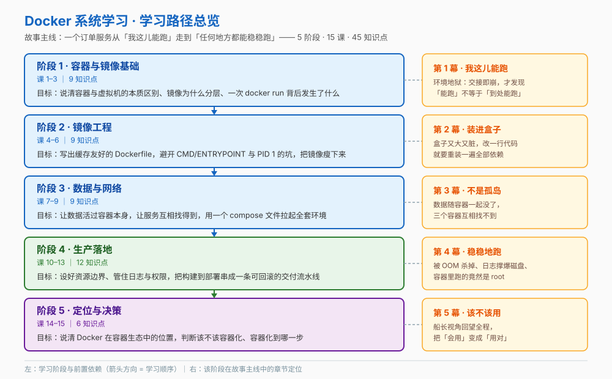

# Docker 系统学习 · 学习路径总览

> 本文件是活文档，随学习进度动态调整。阶段依赖图统一用 SVG。

## 🎯 学习目标

- **目标类型**：动手实操为主，兼顾理解概念与决策参考
- **目标说明**：能独立完成「写一个生产级 Dockerfile → 用 compose 拉起本地全套环境 → 给容器设好资源与权限边界 → 接进 CI/CD 流水线」，并能判断**该不该容器化、容器化到哪一步**

> 四项场景侧重（用户全选）在课程中的落点：
>
> | 场景侧重 | 落点 |
> |----------|------|
> | 本地开发环境 | 阶段 3 课 7–9（数据、网络、compose 一键环境） |
> | 镜像构建与优化 | 阶段 2 课 4–6（Dockerfile、缓存、多阶段构建与瘦身） |
> | 生产部署与运维 | 阶段 4 课 10–12（资源限制、日志观测、安全边界） |
> | CI/CD 集成 | 阶段 4 课 13（仓库与 tag 策略、构建缓存、部署与回滚） |
> | 决策参考 | 阶段 5 课 14–15（生态定位、引入决策树、成本与风险） |

## 故事主线

- **主角**：一个叫 `order-service` 的小 Web 服务（Python + PostgreSQL + Redis）
- **冲突**：我这儿能跑，别人那儿跑不起来 —— 环境地狱
- **收束**：一条从代码提交到生产可回滚的交付流水线 + 一份「该不该容器化、容器化到哪一步」的决策

> 整个课程是这条故事线的展开，每个阶段是故事的一个"章节"，每课是章节中的一个"情节"。

## 学习路径图

> SVG 展示：5 个阶段、各阶段主题与课次范围、阶段间前置依赖箭头，以及每个阶段在故事主线中的章节定位。

## 阶段总览

### 阶段 1：容器与镜像基础（故事章节：我这儿能跑）

- **目标**：说清容器解决的是什么问题、它和虚拟机的本质区别在哪；能独立跑起一个容器并解释 `docker run` 每一步做了什么；能解释镜像分层，用它回答"为什么镜像能一次构建到处运行"
- **学习重点**：环境不一致的真实代价 / 容器 vs 虚拟机的虚拟化层次 / 镜像与容器的关系 / 分层与写时复制 / tag 与 digest
- **必须掌握**：能说清「容器隔离到哪一层」「镜像的一层是什么」「`latest` 到底指向什么」
- **对应课**：[课 1 为什么需要Docker](stages/1-容器与镜像基础/lessons/lesson-01-为什么需要Docker.md)、课 2 跑起来第一个容器、课 3 镜像的里子：分层与仓库

### 阶段 2：镜像工程（故事章节：把服务装进盒子）

- **目标**：写出可复现、缓存友好的 Dockerfile；说清 CMD 与 ENTRYPOINT 的区别并避开 PID 1 信号的坑；能用多阶段构建把镜像瘦下来并选对基础镜像
- **学习重点**：每条指令生成一层 / 构建上下文与 `.dockerignore` / 缓存失效级联 / exec 形式与信号传递 / ENV 与 ARG 的生命周期 / builder 模式与基础镜像选型
- **必须掌握**：能说清「为什么改一行代码会重装全部依赖」「为什么 `docker stop` 要等 10 秒」「为什么删了文件镜像没变小」
- **对应课**：课 4 Dockerfile入门、课 5 启动命令与配置注入、课 6 多阶段构建与镜像瘦身

### 阶段 3：数据与网络（故事章节：容器不是孤岛）

- **目标**：让容器里的数据活过容器本身；说清端口映射与容器间通信；用一个 compose 文件一键拉起完整本地开发环境
- **学习重点**：容器文件系统的临时性 / volume 与 bind mount 的取舍 / bridge 网络与 `-p` / 自定义网络的 DNS 服务发现 / compose 三段结构 / 健康检查与启动顺序
- **必须掌握**：能说清「容器删了数据去哪了」「两个容器怎么互相访问」「`depends_on` 为什么不够」
- **对应课**：课 7 数据持久化、课 8 容器网络、课 9 Compose编排多容器

### 阶段 4：生产落地（故事章节：让它稳稳地跑）

- **目标**：给容器设好资源边界；让日志可查、状态可观测、故障可恢复；收敛容器权限与镜像供应链风险；把构建、测试、推送、部署串成一条流水线
- **学习重点**：`--memory` / `--cpus` 与 OOMKilled / 重启策略与退出码 / SIGTERM 与优雅停止 / json-file 膨胀与健康检查 / USER 与 capabilities / tag 策略与不可变镜像
- **必须掌握**：能说清「容器为什么会被 OOM 杀」「容器内 `free` 看到的是谁的内存」「换 tag 为什么就等于回滚」
- **对应课**：课 10 资源限制与进程管理、课 11 日志与可观测性、课 12 容器安全边界、课 13 CI-CD与交付流水线

### 阶段 5：定位与决策（故事章节：该不该用、用到哪一步）

- **目标**：说清 Docker 在整个容器生态中的位置；能判断该不该容器化、容器化到哪一步；知道下一步往哪学
- **学习重点**：runc / containerd / dockerd 三层与 CRI / Swarm、Kubernetes、Podman 的定位 / 容器 vs 虚拟机选型 / 引入决策树 / 成本与风险清单
- **必须掌握**：能说清「Kubernetes 为什么不再需要 dockerd」「什么情况下根本不该上容器」
- **对应课**：课 14 Docker在容器生态中的位置、课 15 决策清单与学习地图

## 当前进度

- [x] 阶段 1：容器与镜像基础（已完成）
- [x] 阶段 2：镜像工程（已完成）
- [x] 阶段 3：数据与网络（已完成）
- [x] 阶段 4：生产落地（已完成）
- [x] 阶段 5：定位与决策（已完成）
- [x] [结课实战项目 · 订单服务生产化](projects/订单服务生产化/README.md)（Phase 3，已完成）
- [ ] 汇总手册（Phase 4）
- [x] [实战经验](08-实战经验.md) / [排障速查手册](09-排障速查手册.md) / [场景解法库](10-场景解法库.md)（Phase 5，三份一次生成，已完成）
- [x] [官方文档索引](web-index/INDEX.md)（docs.docker.com，309 条 / 9 分区，2026-09-10 建；已据此补齐 6 处遗漏知识点）

## 📚 版本基线

> 时效敏感内容，核查于 2026-09。命令语法以 Docker Engine 29.x 为准。

| 项 | 值 |
|----|-----|
| Docker Engine | **29.8.0**（2026-09-03）
| 打包组件 | BuildKit v0.33.0 / containerd v2.3.4 / runc v1.5.1
| 需注意的 29.0 变更 | containerd image store 为新装默认；cgroup v1 已弃用；Docker Content Trust 从 CLI 移除
| Compose | **V2（`docker compose` 无连字符）**；V1（`docker-compose`）自 2023-07 起停更，不再随 Docker Desktop 提供

> 详细来源与置信度见 [`00-学习档案.md`](00-学习档案.md) 的「事实核查记录」表。

## 🌐 官方文档索引

本教程自建 [docs.docker.com 索引](web-index/INDEX.md)（**309 条 / 9 个分区**，采集于 2026-09-10）：

- 查官方文档时**先查索引定位页面**再取正文，不必现场搜链接
- 索引首页含**课程映射表**（15 课 → 主查分区），可按课号直接跳到对应分区
- 2026-09-10 据此比对后补齐 6 处遗漏（课 3 可信内容辨识 / 课 9 多文件拆分 / 课 10 live restore / 课 12 签名校验 / 课 13 Hub 拉取限额 / 课 15 `docker context` 与废弃写法）

> ⚠️ 索引是**一次性快照**：只解决"去哪一页"，不保证页面内容未变。版本号、默认值、新特性**以官网当页为准**。
