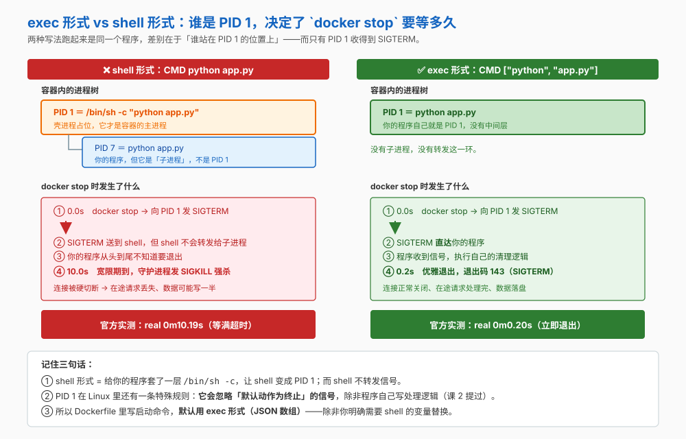
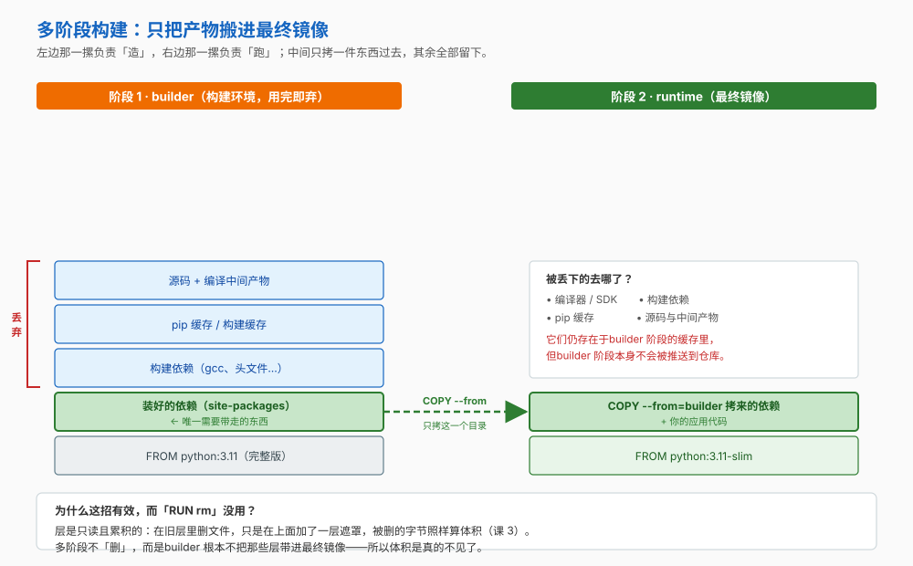

# Docker 课程手册

> **这是索引型手册**——不重复 15 课的正文，而是把它收编成一张可查阅的地图。
> 想看某课的完整讲解 → 点该课的链接。想查某个坑 → 直接看[考点速记](#考点速记)与[决策清单](#决策清单)。

**覆盖范围**：5 阶段 15 课 / 45 知识点 + 结课实战项目 + Phase 5 三件套，全部完成。

---

## 全课程一句话

> **容器解决的是「依赖与环境的传递」问题，不是「隔离的加强」问题。**

它比虚拟机轻，恰恰是因为**共享内核**——同一个原因，也让它比虚拟机更不安全。理解这一点，后面 14 课的所有取舍都能自己推出来。

## 三句话方法论（贯穿 15 课，比任何单个知识点都值钱）

| # | 口诀 | 它串起了哪些课 |
|---|------|--------------|
| **①** | **先问「数据/状态在哪」**——可写层不持久，所有需要留下的东西都必须**显式外置** | 课 3（可写层）→ 课 7（三种挂载）→ 课 9（compose 的 `volumes`） |
| **②** | **先问「边界在哪」**——容器共享内核、隔离弱于虚拟机；`-p` 默认绑 `0.0.0.0`、容器内默认 root、`--privileged` 不是沙箱 | 课 1（vs 虚拟机）→ 课 8（端口与网络）→ 课 12（安全边界） |
| **③** | **先问「观测从哪来」**——容器里的失败常常是**静默的**，能观测的一定在容器**外** | 课 10（OOM 与信号）→ 课 11（日志与健康检查）→ 课 13（流水线闸门） |

遇到任何容器问题，先过一遍这三问，能挡掉大部分"看着像玄学"的故障。

---

## 怎么用这份手册

| 你现在的状态 | 去哪 |
|---|---|
| 刚学完，想快速回顾 | [全课程知识点地图](#全课程知识点地图4545) → 点进具体课 |
| 要设计一个方案（新需求来了） | [决策清单](#决策清单) → [10-场景解法库.md](10-场景解法库.md) |
| 生产上出事了，只要动作 | [09-排障速查手册.md](09-排障速查手册.md)（按症状倒查） |
| 想知道"为什么别人的容器会炸" | [08-实战经验.md](08-实战经验.md)（10 条故障模式） |
| 要复习 / 准备面试 | [考点速记](#考点速记) |
| 想动手做一个完整项目 | [综合实战项目](#综合实战项目) |

---

## 学习路径总览（5 个阶段）

| 阶段 | 主题 | 课 | 回答的问题 | 状态 |
|---|---|---|---|---|
| **1 · 容器与镜像基础** | 它是什么 | 课 1–3 | 为什么需要容器？它到底是个什么东西？ | ✅ |
| **2 · 镜像工程** | 怎么做出好镜像 | 课 4–6 | 怎么把应用变成一个**小、快、安全**的镜像？ | ✅ |
| **3 · 数据与网络** | 容器不是孤岛 | 课 7–9 | 数据存哪？容器之间怎么找得到彼此？ | ✅ |
| **4 · 生产落地** | 让它稳稳地跑 | 课 10–13 | 怎么限资源、怎么观测、怎么加固、怎么交付？ | ✅ |
| **5 · 定位与决策** | 它处在哪、该不该用 | 课 14–15 | Docker 在生态里是什么位置？我们到底该不该容器化？ | ✅ |
| **（收尾）** | 从"会用"到"用对" | 结课项目 + 三件套 | 能不能真的做出来？出事了怎么办？ | ✅ |

> 详细阶段说明见 [01-学习路径总览.md](01-学习路径总览.md)。

## 全课程知识点地图（45/45）

> **45 个知识点全部完成。** 点课名进对应讲义。

| 阶段 | 课 | 知识点 |
|---|---|---|
| **1** | [课 1·为什么需要Docker](stages/1-容器与镜像基础/lessons/lesson-01-为什么需要Docker.md) | 环境不一致的代价 · 容器与虚拟机的区别 · Docker 的起源与生态位 |
|  | [课 2·跑起来第一个容器](stages/1-容器与镜像基础/lessons/lesson-02-跑起来第一个容器.md) | 镜像与容器的关系 · docker run 背后发生了什么 · 容器生命周期命令 |
|  | [课 3·镜像的里子：分层与仓库](stages/1-容器与镜像基础/lessons/lesson-03-镜像的里子：分层与仓库.md) | 联合文件系统与分层 · 仓库、标签与摘要 · 镜像体积从哪来 |
| **2** | [课 4·Dockerfile入门](stages/2-镜像工程/lessons/lesson-04-Dockerfile入门.md) | Dockerfile 语法骨架 · 构建上下文与 .dockerignore · 构建缓存与指令顺序 |
|  | [课 5·启动命令与配置注入](stages/2-镜像工程/lessons/lesson-05-启动命令与配置注入.md) | CMD 与 ENTRYPOINT · ENV 与 ARG · 运行时配置覆盖与密钥 |
|  | [课 6·多阶段构建与镜像瘦身](stages/2-镜像工程/lessons/lesson-06-多阶段构建与镜像瘦身.md) | 多阶段构建 · 基础镜像选型 · 瘦身实操与体积核算 |
| **3** | [课 7·数据持久化](stages/3-数据与网络/lessons/lesson-07-数据持久化.md) | 容器文件系统的临时性 · 三种挂载方式 · 卷的生命周期与清理 |
|  | [课 8·容器网络](stages/3-数据与网络/lessons/lesson-08-容器网络.md) | 网络驱动全景 · bridge 网络与端口映射 · 自定义网络与 DNS 服务发现 |
|  | [课 9·Compose 编排多容器](stages/3-数据与网络/lessons/lesson-09-Compose编排多容器.md) | compose 文件结构 · 一键本地开发环境 · 健康检查与启动顺序 |
| **4** | [课 10·资源限制与进程管理](stages/4-生产落地/lessons/lesson-10-资源限制与进程管理.md) | cgroups 资源限制 · 重启策略与自愈 · 优雅停止与 PID 1 |
|  | [课 11·日志与可观测性](stages/4-生产落地/lessons/lesson-11-日志与可观测性.md) | 日志驱动与日志膨胀 · 健康检查与状态观测 · 容器指标与资源观测 |
|  | [课 12·容器安全边界](stages/4-生产落地/lessons/lesson-12-容器安全边界.md) | 容器里的 root 是谁 · 能力与系统调用收敛 · 镜像供应链与漏洞 |
|  | [课 13·CI/CD与交付流水线](stages/4-生产落地/lessons/lesson-13-CI-CD与交付流水线.md) | 镜像仓库与推送流程 · CI 中的构建与缓存 · 部署与回滚 |
| **5** | [课 14·Docker在容器生态中的位置](stages/5-定位与决策/lessons/lesson-14-Docker在容器生态中的位置.md) | OCI 与运行时栈 · 编排与替代方案 · 容器 vs 虚拟机的选型 |
|  | [课 15·决策清单与学习地图](stages/5-定位与决策/lessons/lesson-15-决策清单与学习地图.md) | 引入决策树 · 成本与风险清单 · 下一步学习地图 |

> 合计 **45** 个知识点，分布在 5 个阶段 15 课。

---

## 阶段速查（各阶段重点一览）

| 阶段 | 核心交付物 | 最该记住的一句话 |
|---|---|---|
| 1 | 能跑起来的容器 | 镜像是模板，容器是实例；**主进程退了容器就退了** |
| 2 | 一个好镜像 | 瘦身靠"**别让它进来**"，不靠"进来再删" |
| 3 | 一套可复现的环境 | 数据在卷里、名字在自定义网络里，就都不怕重建 |
| 4 | 能上生产的容器 | 限制、观测、降权、可回滚——**四件缺一不可** |
| 5 | 一个判断 | 成本是"替换"不是"消除"；不用 Docker 当运行时 ≠ 不能用来构建 |

---

## 阶段 1：容器与镜像基础

> 回答"它到底是个什么东西"。这一阶段打下的三条地基（可写层不持久 / 共享内核 / main 进程即容器），后面 12 课反复回扣。

### 课 1《为什么需要 Docker》

> **一句话**：容器解决的是"环境传递"，不是"隔离加强"——它比虚拟机轻，是因为共享内核，也因此更不安全。

**核心要点**
- 环境不一致的四类代价：语言运行时版本 / **系统级 C 库** / 环境变量 / 端口占用——"把文档写详细点"挡不住它们，因为**状态是隐式的**
- 容器 vs 虚拟机：**虚拟化层次不同**（共享内核 vs 各自内核），带来三方面后果（体积、启动速度、隔离强度）
- "Docker" 和 "容器"不是一回事：Docker 是**工具与生态**，容器是**内核特性**

**关键命令**：`docker version` · `docker run hello-world` · `docker run --rm <镜像> <命令>` · `docker images` · `docker pull <镜像>`

→ [完整讲义](stages/1-容器与镜像基础/lessons/lesson-01-为什么需要Docker.md)

### 课 2《跑起来第一个容器》

> **一句话**：镜像是模板、容器是实例；`docker run` 之后容器退不退出，取决于**主进程是否还活着**。

**核心要点**
- 一个镜像可以起多个容器，彼此隔离（同一路径写文件互不可见——课 7 数据丢失坑的伏笔）
- `docker run` 完整链路：找镜像 → 拉层 → 创建可写层 → 分配网络 → 启动主进程
- 看懂 `docker ps` 的状态列与**退出码**：0 正常、137 = SIGKILL、143 = SIGTERM

**关键命令**：`docker run -d --name` · `docker run --rm` · `docker run -it` · `docker ps` · `docker logs` · `docker exec` · `docker stop/start/rm` · `docker inspect --format`

→ [完整讲义](stages/1-容器与镜像基础/lessons/lesson-02-跑起来第一个容器.md)

### 课 3《镜像的里子：分层与仓库》

> **一句话**：镜像是一摞只读层 + 一层可写层；`rm` 只加 whiteout 不减体积，tag 可变而 digest 不可变。

**核心要点**
- 分层与**写时复制（CoW）**：在容器里 `rm` 掉一个大文件，镜像**不会**变小（只加一层 whiteout 标记）
- 五段命名与 **tag vs digest**：`latest` 会漂，digest 不会——生产应锁 digest
- 体积三大来源与 `system df` 体检；`prune` 的**安全清理边界**

**关键命令**：`docker image history` · `docker ps -s` · `docker pull <镜像>@sha256:<digest>` · `docker tag` · `docker system df` · `docker image prune` · `docker system prune [--volumes]`

→ [完整讲义](stages/1-容器与镜像基础/lessons/lesson-03-镜像的里子：分层与仓库.md)

---

## 阶段 2：镜像工程

> 回答"怎么把应用变成一个小、快、安全的镜像"。三课正好对应三个尺度：**单条指令（课 4）→ 单条命令（课 5）→ 整个构建流程（课 6）**。

### 课 4《Dockerfile 入门》

> **一句话**：每条指令一层；**指令顺序决定缓存命中率**，`.dockerignore` 决定什么不该进上下文。

**核心要点**
- `docker build` 末尾那个 `.` 是**构建上下文**，不是 Dockerfile 的路径
- **缓存失效规则**：一旦某层失效，其后所有层都要重跑 → 依赖清单必须 `COPY` 在代码**之前**
- `.dockerignore` 既防拖慢构建，也防把 `.env` 这类敏感文件烤进镜像（课 12 会再遇到）

**关键命令**：`docker build -t` · `docker build -f` · `docker build --build-arg` · `docker build --target` · `docker build --no-cache` · `docker history` · `docker builder prune`

→ [完整讲义](stages/2-镜像工程/lessons/lesson-04-Dockerfile入门.md)

### 课 5《启动命令与配置注入》

> **一句话**：exec 形式让应用当 PID 1 收得到信号，shell 形式让 `/bin/sh -c` 当 PID 1 **收不到**；`ARG` 进构建、`ENV` 进容器、**密钥两个都不进**。

**核心要点**
- `CMD` / `ENTRYPOINT` 的 **exec 形式 vs shell 形式**：shell 形式下 PID 1 是 `/bin/sh -c`，它**不转发信号** → `docker stop` 每次等满 10 秒（课 10 会兑现这条）
- `ENV`（进容器，运行时可覆盖）vs `ARG`（仅构建期，留在 history 里）
- 运行时配置的覆盖优先级；**`--mount=type=secret`** 是唯一正确的构建期密钥方案

**关键命令**：`docker stop [-t]` · `docker run -e K=V` · `docker run --env-file` · `docker run --entrypoint` · `docker build --secret` · `docker history`

→ [完整讲义](stages/2-镜像工程/lessons/lesson-05-启动命令与配置注入.md)

### 课 6《多阶段构建与镜像瘦身》

> **一句话**：瘦身靠"**别让它进来**"（多阶段），不靠"进来再删"（whiteout）；基础镜像越小，代价越隐蔽。

**核心要点**
- 多阶段构建：编译工具链 / SDK / 包管理器缓存只留在 builder 阶段，最终镜像只拷构建产物
- 基础镜像四选一：**full / slim / alpine / distroless**
  - 🔵 官方明确警示 **musl**（alpine）的兼容性风险；⏳ 领域认知：部分 wheel 需现场编译
  - distroless 攻击面最小，但**没有 shell**，排障极其难受
- 核算体积：`docker history` 找大头；哪些"清理"真的有效、哪些只是自我安慰

**关键命令**：`docker build --target` · `COPY --from=<阶段>` · `docker history --format` · `apt-get install --no-install-recommends` · `apk add --no-cache` · `pip install --no-cache-dir`

→ [完整讲义](stages/2-镜像工程/lessons/lesson-06-多阶段构建与镜像瘦身.md)

---

## 阶段 3：数据与网络

> 回答"容器不是孤岛"。课 7 兑现课 3 埋的"可写层不持久"，课 8 兑现课 2、课 4 埋的两处伏笔，课 9 把前两课收编进一个文件。

### 课 7《数据持久化》

> **一句话**：容器可写层不持久；三种挂载的差别就在"**数据存在哪**"和"**容器删了还在吗**"。

**核心要点**
- 可写层与容器同生命周期 → **容器删除即丢**；且 CoW 有写放大与联合文件系统开销（官方建议**写密集应用用卷**）
- 三种挂载：**volume**（Docker 管理，推荐）/ **bind mount**（挂宿主路径）/ **tmpfs**（内存，容器停即消失）
- ⚠️ 两条最容易踩的官方差异：
  - 挂到**非空目录**：空卷会**拷贝**原有内容进卷，`bind mount` 则**遮蔽**。官方原话 "this behavior differs from that of volumes"
  - `-v` 源路径不存在会**自动创建**，`--mount` 则**直接报错**（需 `bind-create-src`）
- `volume prune` **连具名卷一起删**；`--rm` 是匿名卷随容器消失的**唯一例外**

**关键命令**：`docker volume create/ls/inspect/rm/prune` · `--mount type=volume|bind|tmpfs` · `-v` · `--volumes-from`

→ [完整讲义](stages/3-数据与网络/lessons/lesson-07-数据持久化.md)

### 课 8《容器网络》

> **一句话**：`EXPOSE` 只是文档；`-p` 默认绑 `0.0.0.0`；**自定义 bridge 才有按容器名的 DNS**。

**核心要点**
- 🔵 官方原话：`EXPOSE` "**doesn't actually publish the port**"，它只是文档——唯一起作用的地方是配合 `-P`
- `-p 8080:80` **不指定宿主地址时默认绑到所有地址（IPv4+IPv6）**；限本机必须写 `127.0.0.1:8080:80`
- 服务名解析的三个前提：①同一**自定义**网络 ②对方有 `--name` ③用内嵌 DNS（地址 **`127.0.0.11`**）
- 🔵 官方定论："**User-defined bridge networks are superior to the default `bridge` network**"，默认 bridge 被定为 legacy

**关键命令**：`docker network ls/create/inspect/connect/disconnect/rm` · `--network` · `-p` · `-P` · `docker port` · `cat /etc/resolv.conf`

→ [完整讲义](stages/3-数据与网络/lessons/lesson-08-容器网络.md)

### 课 9《Compose 编排多容器》

> **一句话**：Compose 是 `docker run` 的**批量声明式包装**；`depends_on` 短语法**只等启动，不等就绪**。

**核心要点**
- **隐式 default 网络**：`networks` 缺失时 Compose 视为连到 `default` 网络 → 服务名即 DNS 名**自动生效**，不用手写 `--network`
- `down` 的默认删除清单比想象中窄：只删容器 + 网络；**external 资源 "never removed"**、匿名卷默认不删
- ⚠️ `down -v` **会删除 compose 声明的具名卷**——数据库数据一起没
- `depends_on`：`service_started` / `service_healthy` / `service_completed_successfully`；用 `service_healthy` 时**被依赖方必须自己声明 `healthcheck`**

**关键命令**：`docker compose up -d` · `ps` · `logs -f` · `exec` · `stop/restart` · `down` · `down -v` · `config` · `-p <项目名>`

→ [完整讲义](stages/3-数据与网络/lessons/lesson-09-Compose编排多容器.md)

---

## 阶段 4：生产落地

> 回答"怎么让它稳稳地跑"。四课对应四个动词：**限（课 10）→ 看（课 11）→ 收（课 12）→ 交（课 13）**。

### 课 10《资源限制与进程管理》

> **一句话**：资源限制防的是"**拖垮邻居**"；PID 1 会**忽略默认动作的信号**，所以优雅停止要两边配合。

**核心要点**
- 🔵 **PID 1 的特殊性**："it **ignores any signal with the default action**"——不注册处理器就收不到 SIGTERM
- Linux 停止宽限期默认 **10 秒**（Windows 30 秒）；到期 SIGKILL → 退出码 **137**
- ⚠️ **137 不等于 OOM**——判定要看 `State.OOMKilled`；停止超时被强杀同样是 137
- ⚠️ `--oom-kill-disable` 在 **cgroup v2 上会被直接丢弃**（官方原话 "is discarded on v2"）
- 重启策略：`no` / `on-failure` / `always` / `unless-stopped`——**不能替代健康检查**

**关键命令**：`docker run -m/--cpus/--cpu-shares` · `docker stats` · `docker inspect -f '{{.State.OOMKilled}}'` · `--restart=` · `docker stop -t` · `--stop-signal` · `--init`

→ [完整讲义](stages/4-生产落地/lessons/lesson-10-资源限制与进程管理.md)

### 课 11《日志与可观测性》

> **一句话**：默认日志驱动**不轮转**；`Up` 不等于健康；容器里 `free`/`top` 的数字**不可信**。

**核心要点**
- 🔵 官方警告：`json-file` "By default, **no log-rotation is performed**"，可撑爆磁盘；推荐 `local`（默认 20m × 5 = 100MB 且默认压缩）
- ⚠️ `max-file` "**Only effective when `max-size` is also set**"——只写一个不生效
- 改 daemon 日志配置**不影响已有容器**，必须重建
- 指标真实来源是 **cgroups**；🔵 官方提醒 `free` 报的 swap 是宿主机的，且**网络指标 cgroup 不记账**

**关键命令**：`docker logs -f/--tail/--since` · `--log-driver local` · `--log-opt max-size/max-file` · `--health-cmd` · `docker inspect -f '{{.State.Health.Status}}'` · `docker events` · `docker stats`

→ [完整讲义](stages/4-生产落地/lessons/lesson-11-日志与可观测性.md)

### 课 12《容器安全边界》

> **一句话**：容器里**默认是 root**；`--privileged` 不是安全沙箱；密钥一旦进层就**删不掉，只能轮换**。

**核心要点**
- 🔵 官方原话：容器内默认用户是 **root (uid=0)**；`USER` 是防提权攻击的 **best way**
- 🔵 `--privileged`："**not a securely sandboxed process**"，容器可 "get a root shell on the host"
- 挂载 `/var/run/docker.sock` = 交出"**full access to create and manipulate the host's Docker daemon**"
- 密钥：`ARG` 与 `COPY` 都会留在层里；被遮蔽的文件"**没有直接办法卸载挂载露出**"——只能轮换
- 三重收敛：`--cap-drop=ALL` + `--read-only` + `no-new-privileges`

**关键命令**：`docker run -u` · `USER` · `--cap-drop/--cap-add` · `--security-opt no-new-privileges:true` · `--read-only` · `docker history --no-trunc | grep -iE 'password|secret|token'` · `--mount=type=secret`

→ [完整讲义](stages/4-生产落地/lessons/lesson-12-容器安全边界.md)

### 课 13《CI/CD 与交付流水线》

> **一句话**：不可变镜像 + **换 tag 即回滚**；外部缓存必须**显式导入导出**；**PR 只构建、不推送**。

**核心要点**
- tag 策略：带 git sha、**永不覆盖**；回滚 = 换 tag 指回上一个版本（比"重新构建"可靠得多）
- 🔵 外部缓存**必须成对使用** `--cache-to` 与 `--cache-from`（缺一不可）；`mode=max` 命中率更高
- ⚠️ 多分支共用同一缓存 ref 会**互相覆盖**；🔵 `cache mounts` 默认不被 gha 缓存保留；GitHub Cache API v1 已于 **2025-04-15** 停用
- 发布三道闸门：查密钥 → 集成测试 → 漏洞扫描

**关键命令**：`docker tag` · `docker push` · `docker login --password-stdin` · `--cache-to/--cache-from` · `docker buildx build --platform` · `docker compose up --abort-on-container-exit --exit-code-from`

→ [完整讲义](stages/4-生产落地/lessons/lesson-13-CI-CD与交付流水线.md)

---

## 阶段 5：定位与决策

> 回答"它处在哪、我们该不该用"。这两课是整门课的**收束**——把前 13 课的技术细节拉远，回答"所以呢"。

### 课 14《Docker 在容器生态中的位置》

> **一句话**：runc / containerd / dockerd 三层分工；"K8s 不用 Docker"抛弃的是**运行时**那一层，**不是构建**那一层。

**核心要点**
- 运行时栈三层：**runc**（真正创建容器）/ **containerd**（管生命周期与镜像）/ **dockerd**（提供 CLI 与 API）
- **CRI** 这层抽象的作用；`dockershim` 之所以存在，是因为 Docker 早于 CRI 规范出现
- ⭐ 破除流传最广的误读——🔵 Kubernetes 官方原话："If you are using Docker for **building** your application containers, **you can still run these containers on any container runtime.** This use of Docker **does not count as a dependency on Docker as a container runtime**."
- 容器 vs 虚拟机：按**隔离强度 / 内核需求 / 性能开销**三维度选型

**关键命令**：`docker version` · `docker info` · `which dockerd containerd runc` · `docker manifest inspect` · `docker swarm init`

→ [完整讲义](stages/5-定位与决策/lessons/lesson-14-Docker在容器生态中的位置.md)

### 课 15《决策清单与学习地图》· 全课程收官

> **一句话**：容器化的成本是"**替换**"不是"消除"；八项成本 + 八条能力前提决定该不该做。

**核心要点**
- 决策树：该不该容器化 → 容器化到哪一步
- **八项引入成本**：镜像维护 / 日志 / 监控 / 存储 / 网络 / 安全 / 交付链路 / 磁盘——只做一半比不做更糟
- **八条能力前提**：会写 Dockerfile、会做卷备份、会配日志与监控……缺一条就别急着上生产
- 🔵 官方对容器适用场景的定位："high density environments" 与 "**small and medium deployments**"

**关键命令**：`docker system df [-v]` · `docker inspect` 的 Privileged / User 字段 · `docker images | grep ':latest'` · `docker compose config`

→ [完整讲义](stages/5-定位与决策/lessons/lesson-15-决策清单与学习地图.md)

---

## 综合实战项目

> **[订单服务生产化](projects/订单服务生产化/README.md)** —— 跨阶段 2/3/4 的 9 文件工程，把整门课串成一套可跑的东西。

**项目目标**：从"我能跑" → "**任何人一键跑起来 + 出问题几秒回滚**"。

**四门槛核查**（全部达标）：

| 门槛 | 要求 | 本项目 |
|---|---|---|
| 跨 ≥3 阶段 | 覆盖多个阶段的知识点 | ✅ 阶段 2（多阶段 / 非 root / exec 形式）＋阶段 3（卷 / 自定义网络 / `service_healthy`）＋阶段 4（资源限制 / 日志 / 加固 / CI 闸门 / 回滚） |
| ≥2 项非功能约束 | 可量化的验收指标 | ✅ 设了 **5 项**（镜像 <150MB / 非 root / 攻击面收敛三件套 / 内存 ≤256MB / 日志 ≤30MB），每项给核对命令 |
| ≥2 个真权衡决策 | 写出候选、代价与改选时机 | ✅ 写了 **4 个**（基础镜像 slim vs alpine vs distroless／日志 local vs json-file vs 远端／数据库容器化 vs 托管／compose vs K8s） |
| 多文件工程 | 不是一个文件糊过去 | ✅ 9 个文件分属 4 类（应用 / 镜像 / 编排 / 交付） |

**两个里程碑**：①镜像做小做安全 → ②环境一键拉起 → ③上线与回滚。含 **13 条验收清单**与 10 行排障指引（每行都回指具体课号）。

→ [进入项目](projects/订单服务生产化/README.md)

---

## 五个"看起来没坏其实很危险"的坑（全课程最贵的收获）

> **这是本手册首次跨课整合的内容**——散落在 5 个不同课里，单独看都是小知识点，放在一起才看得出共同规律。

| # | 表象 | 真相 | 出处 |
|---|---|---|---|
| 1 | 写了 `EXPOSE 80`，以为端口开了 | 🔵 `EXPOSE` "**doesn't actually publish the port**"，它只是文档 | 课 4 → 课 8 |
| 2 | 写了 `depends_on: [db]`，以为 Compose 会等数据库好 | 🔵 短语法 "**does not wait for dependency services to be 'healthy'**" | 课 9 |
| 3 | 日志一直在写，看起来很正常 | 🔵 默认 `json-file` **不轮转**，直到撑爆磁盘 | 课 11 |
| 4 | 退出码 137，认定是 OOM | ⚠️ **停止超时被强杀也是 137**；判定要看 `State.OOMKilled` | 课 10 |
| 5 | 容器里 `rm` 掉大文件，以为镜像会变小 | 只加一层 whiteout，**体积不减反增** | 课 3 → 课 6 |

**共同规律**：**命令全都对了，错的是你对系统的假设**——这类问题只可能被**外部观测**抓到（`docker inspect` 的字段、`docker stats`、`SELECT`-式的实际验证），不可能被返回码抓到。

对应到方法论：**这就是"三句话方法论"第 ③ 条要说的事。**

---

## 决策清单

### 该不该容器化（五个不该用容器的场景）

| # | 反模式 | 该用什么 |
|---|--------|---------|
| 1 | 需要**强隔离**（多租户 / 不可信代码） | 虚拟机 / gVisor / Kata |
| 2 | 需要**不同的内核或操作系统** | 虚拟机 |
| 3 | 一次性脚本、纯本地小工具 | 直接跑 |
| 4 | **把容器当虚拟机用**（一容器多服务、SSH 进去改配置） | 拆分服务；配置走环境变量 / 卷 |
| 5 | **规模没到就上编排** | compose + 重启策略 + 健康检查 |

**正面判断条件**（同时满足才值得容器化）：需要跨机器/跨人复现环境 · 服务依赖能被一份声明描述清楚 · 团队具备课 15 那八条能力前提。

### 挂载选型

| 用这个 | 当…… | 注意 |
|---|---|---|
| **volume** | 数据要持久、且不该暴露在宿主目录树里（**数据库数据目录的默认选择**） | 空卷挂到非空目录会**拷贝**原有内容；`prune` 连具名卷一起删 |
| **bind mount** | 要挂载**宿主上已有的**配置或代码（开发期热重载） | 会**遮蔽**目标目录原有内容；⚠️ 默认对宿主文件**有写权限** |
| **tmpfs** | 数据敏感且不需要持久（会话、临时密钥） | ⚠️ 可能被写进 **swap** 从而落盘；计入容器内存上限；**仅 Linux** |

### 基础镜像选型

| 候选 | 优点 | 代价 |
|---|---|---|
| `full`（如 `python:3.12`） | 什么都有，最省事 | 最大 |
| `slim` | 体积可接受，**glibc 生态无障碍** | 比 alpine 大几十 MB |
| `alpine`（musl） | 最小 | 🔵 官方警示 musl 兼容性风险；⏳ 部分 wheel 需现场编译 |
| `distroless` | 攻击面最小 | **没有 shell**，排障极其难受 |

> 默认推荐 **slim**；有明确的体积压力且验证过兼容性，再考虑 alpine。

### 重启策略选型

| 策略 | 行为 | 适用 |
|---|---|---|
| `no` | 不自动重启（默认） | 一次性任务 |
| `on-failure[:N]` | 非 0 退出才重启 | 批处理 |
| `always` | 总是重启；**Docker 守护进程重启后也会拉起** | 常驻服务 |
| `unless-stopped` | 同 `always`，但**手动 stop 过的不再自动拉起** | **生产常驻服务的首选** |

### 编排选型

| 方案 | 适用 | 触发升级的信号 |
|---|---|---|
| **compose + 重启策略 + 健康检查** | 1–3 台、服务个位数、能接受分钟级停机 | —（起点） |
| **Swarm** | 想要"最省事的多机" | 需要多机且清楚生态取舍 |
| **Kubernetes** | 跨机调度 / 自愈 / 滚动发布 | **真的需要这些能力，且有专职运维投入** |

> ⚠️ 升级的触发条件是"**出现了新需求**"，不是"想升级"。为了不落后而上 K8s，成本陡增、收益为零。

---

## 考点速记

### 高频数字（均为官方确认，易出选择题）

| 数字 | 含义 | 出处 |
|---|---|---|
| **10 秒 / 30 秒** | `docker stop` 默认宽限期（Linux / Windows） | 课 10 |
| **137 / 143** | 退出码：SIGKILL（128+9）/ SIGTERM（128+15） | 课 2、课 10 |
| **127.0.0.11** | 内嵌 DNS 服务器地址（无 IPv6 等价地址，但在纯 IPv6 容器里可用） | 课 8 |
| **20m × 5 = 100MB** | `local` 日志驱动默认保留量与文件数（且默认压缩） | 课 11 |
| **14 条** | 容器默认拥有的 capabilities 数量 | 课 12 |
| **3 条** | `docker network ls` 默认网络数（bridge / host / none，其中 **none 的 DRIVER 显示 `null`**） | 课 8 |
| **1000** | 单个 bridge 网络连接容器超过此数会**变得不稳定** | 课 8 |
| **v1.24** | Kubernetes 移除 `dockershim` 的版本 | 课 14 |
| **2025-04-15** | GitHub Actions Cache API **v1** 停用日期 | 课 13 |

### 易混点对照

| 对比 | 关键差别 |
|---|---|
| **镜像 vs 容器** | 模板 vs 实例；只读层 vs 只读层 + 可写层 |
| **`EXPOSE` vs `-p`** | 只是文档 vs 真的发布端口 |
| **`-p` vs `-P`** | 精确映射 vs 把 `EXPOSE` 过的端口全发到**随机高位端口**（TCP 与 UDP 不共用同一宿主端口） |
| **`-v` vs `--mount`** | 源路径不存在时 `-v` **自动创建**，`--mount` **直接报错** |
| **volume vs bind（挂到非空目录）** | volume **拷贝**原有内容进卷；bind **遮蔽** |
| **`ARG` vs `ENV`** | 仅构建期（留在 history）vs 进容器（运行时可覆盖） |
| **exec vs shell 形式** | 应用当 PID 1 收得到信号 vs `/bin/sh -c` 当 PID 1 **收不到** |
| **`down` vs `down -v`** | 收工（保留具名卷）vs 拆家（**删掉具名卷**） |
| **`--cpus` vs `--cpu-shares`** | 硬上限 vs 相对权重（仅在争用时生效） |
| **匿名卷 vs 具名卷** | 都不会随容器删除而消失（**唯一例外：启动时加了 `--rm`**）；但匿名卷**没有稳定名字，不会被后续 `up` 自动挂回** |

### 常考「唯一 / 第一 / 默认」

- **容器内默认用户是 `root`（uid=0）**；`USER` 是防止提权攻击的 **best way**
- **默认日志驱动是 `json-file`**，且**默认不轮转**；官方推荐改用 `local`
- **`docker build` 末尾的 `.` 是「构建上下文」**，不是 Dockerfile 的路径
- **服务发现只解析自定义容器名**，不解析 Docker 自动生成的名字 → `--name` 是必需品
- **同一自定义 bridge 上的容器彼此等效于开放所有端口**——互访不需要 `EXPOSE`，也不需要 `-p`
- **`--rm` 是匿名卷随容器消失的唯一例外**

### 常考「不能 / 不支持 / 不要」

- ❌ **`EXPOSE` 不发布端口**——它只是文档
- ❌ **在容器里 `rm` 不能让镜像变小**——只加 whiteout
- ❌ **`depends_on` 短语法不等"就绪"**——只等"启动"
- ❌ **`--oom-kill-disable` 在 cgroup v2 上被丢弃**
- ❌ **`max-file` 单独设置不生效**——必须配合 `max-size`
- ❌ **改 daemon 日志配置不影响已有容器**——必须重建
- ❌ **`--privileged` 不是安全沙箱**——容器可拿宿主机 root shell
- ❌ **挂载 `/var/run/docker.sock` = 交出宿主机 Docker 完整控制权**
- ❌ **容器里 `free` / `top` / `nproc` 的数字不可信**——真实来源是 cgroups
- ❌ **`cache mounts` 默认不被 gha 缓存保留**；外部缓存必须 `--cache-to` + `--cache-from` **成对使用**
- ❌ **bind-mount `/home` 或 `/usr` 时加 SELinux 的 `Z` 会让宿主机无法使用**（官方原话 "render your host machine inoperable"）

---

## 交付状态

| 产物 | 状态 |
|---|---|
| 5 阶段 15 课（45 知识点） | ✅ 全部完成 |
| [结课实战项目](projects/订单服务生产化/README.md) | ✅ 9 文件 + 架构图，四门槛全达标 |
| [08-实战经验.md](08-实战经验.md)（Phase 5 学习态） | ✅ 6 反模式 + 10 条故障模式 + Checklist |
| [09-排障速查手册.md](09-排障速查手册.md)（Phase 5 使用态） | ✅ 症状倒查索引 + 10 条 QRH 条目 |
| [10-场景解法库.md](10-场景解法库.md)（Phase 5 设计态） | ✅ 8 个设计场景（先想后看） |
| **本手册**（Phase 4 汇总） | ✅ 索引型，15 课全覆盖 |

> ⚠️ **证据说明**：本课程的 Phase 5 三件套**不具备 🟢 本机实测条件**（写作时本机 Docker 守护进程未运行），已如实声明；依据为 🔵 官方一手文档（核查于 2026-09）与少量 ⚪ 领域公认实践，**未编造任何实测数字**。详见各产物的「证据与置信度」章节。

---

## 🧭 导航

| 去哪 | 链接 |
|---|---|
| 课程目录（含命令速查索引） | [02-课程目录.md](02-课程目录.md) |
| 学习路径总览 | [01-学习路径总览.md](01-学习路径总览.md) |
| 学习档案（断点续传） | [00-学习档案.md](00-学习档案.md) |
| 为什么要学（课 1） | [lesson-01](stages/1-容器与镜像基础/lessons/lesson-01-为什么需要Docker.md) |
| 动手做项目 | [订单服务生产化](projects/订单服务生产化/README.md) |
| 出事了怎么办 | [09-排障速查手册.md](09-排障速查手册.md) |
| 新需求怎么设计 | [10-场景解法库.md](10-场景解法库.md) |
