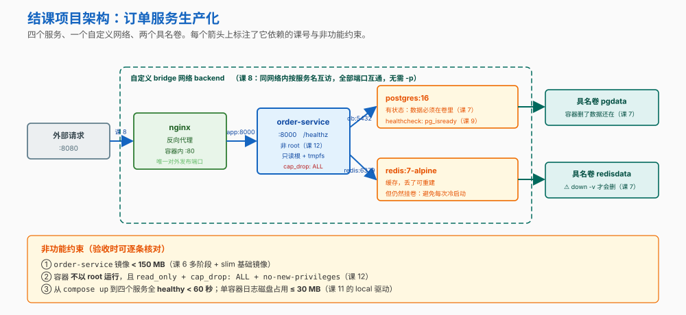

# 结课实战项目：订单服务生产化

> 所属课程：Docker 系统学习 ｜ Phase 3（结课实战）｜ 前提：完成 15 课 / 45 知识点
>
> **目标**：把 `order-service` 从"我这儿能跑"，做到"**任何人 clone 下来一条命令跑起来，出问题几秒回滚**"。
>
> **验收标准**：**复杂度四门槛**全部通过 + [验收清单](#-验收清单)逐条 ✓

---

## 🎯 项目总览



**这条链路把三个阶段串在了一起**：

```
源码
  │
  ├─ 阶段 2 镜像工程 ──── Dockerfile（多阶段 → 瘦身 → 非 root ─ 课 4/6/12）
  │                            ↓
  │                        order-service:<sha>          ← 不可变产物
  │                            ↓
  ├─ 阶段 3 数据与网络 ── compose（app+db+redis+nginx ／ 卷 ／ 自定义网络 ／ 健康检查 ─ 课 7/8/9）
  │                            ↓
  │                        一套可一键复现的环境
  │                            ↓
  └─ 阶段 4 生产落地 ──── 资源限制 + 日志轮转 + 安全收敛 + CI 闸门 + 换 tag 回滚（课 10–13）
                               ↓
                          可交付、可回滚
```

**为什么这个项目能当结课项目**：它不是"再写一遍 Dockerfile"，而是要求你**同时满足一组互相冲突的约束**——想省体积就要换基础镜像，但换了可能踩 musl 兼容性；想要日志可查就得留本地日志，但留了就要管轮转；数据库放容器里环境最一致，但备份恢复的担子就落到你头上。**这些取舍才是真实工作里的 Docker。**

---

## 复杂度四门槛核查

> 课程大纲对结课项目的四条硬性要求。下表给出**判定标准**与**怎么验收**。
>
> ⚠️ **"你的实测"一栏留空是刻意的**：本讲义写作时本机 Docker 守护进程未运行，**不能替你填数字**。请照「验收方式」跑完自己填——这也是本项目的一部分。

| # | 门槛 | 判定标准 | 验收方式 | 你的实测 |
|---|------|---------|---------|---------|
| **①** | **跨 ≥3 阶段** | 同时用到 ≥3 个阶段的知识点 | 见下方《跨阶段映射表》：阶段 2 / 3 / 4 各有多项落地 | ☐ |
| **②** | **≥2 项非功能约束** | 有可量化、可核对的**非功能**指标（不是"能跑"就行） | 见下方《非功能约束表》——共 5 项，逐条核对 | ☐ |
| **③** | **≥2 个真权衡决策** | 每个决策有 ≥2 个候选、各有代价，且**给出选择理由** | 见《四个真权衡决策》——共 4 个，均写明"什么时候该改选" | ☐ |
| **④** | **多文件工程** | 不是单文件脚本，而是有目录结构的多文件工程 | 见《文件清单》——9 个文件，分属 4 类 | ☐ |

### 跨阶段映射表（门槛①）

| 阶段 | 落地在哪 | 对应课 |
|---|---|---|
| **阶段 2 · 镜像工程** | Dockerfile 的多阶段构建、依赖层前置、非 root、`HEALTHCHECK`、exec 形式 `ENTRYPOINT` | 课 4、5、6、12 |
| **阶段 3 · 数据与网络** | 两个具名卷、一个自定义 bridge 网络、`depends_on: service_healthy`、compose 统一描述 | 课 7、8、9 |
| **阶段 4 · 生产落地** | 资源限制、日志驱动与轮转、只读根 + `cap_drop: ALL` + `no-new-privileges`、CI 三道闸门、换 tag 回滚 | 课 10、11、12、13 |

### 非功能约束表（门槛②）

| # | 约束 | 指标 | 核对命令 | 你的实测 |
|---|---|---|---|---|
| N1 | **镜像体积** | `order-service` < **150 MB** | `docker images order-service` | ☐ |
| N2 | **不以 root 运行** | `Config.User` 非空 | `docker inspect <容器> --format '{{.Config.User}}'` | ☐ |
| N3 | **攻击面收敛** | `read_only` + `cap_drop: ALL` + `no-new-privileges` 三者齐备 | 见[验收清单](#-验收清单)第 6–8 条 | ☐ |
| N4 | **内存上界** | app ≤ 256 MB（且实测不 OOM） | `docker stats --no-stream` | ☐ |
| N5 | **日志磁盘上界** | 单容器日志 ≤ 30 MB（3 × 10m，压缩后更小） | 见[验收清单](#-验收清单)第 9 条 | ☐ |

---

## 四个真权衡决策（门槛③）

### 决策 1 · 基础镜像用什么

| 候选 | 优点 | 代价 |
|---|---|---|
| `python:3.12-slim` ✅ **本项目选择** | glibc，wheel 生态无障碍；体积可接受 | 比 alpine 大几十 MB |
| `python:3.12-alpine` | 最小 | **musl** —— 部分 wheel 装不上，需要现场编译（课 6 那条 ⏳ 中置信度的兼容性提醒） |
| `distroless` | 攻击面最小（无 shell） | 无 shell，**排障极其难受** |

**改选时机**：镜像体积成为硬指标（如边缘设备、冷启动敏感）→ 换 alpine 并接受编译成本；有强合规要求且不需要进容器调试 → distroless。

### 决策 2 · 日志方案

| 候选 | 优点 | 代价 |
|---|---|---|
| `local` 驱动 ✅ **本项目选择** | **默认就轮转**（20m × 5 文件 = 100MB）且**默认压缩**；官方明确推荐 | `docker logs` 能用，但文件由 daemon 独占管理，不能拿外部工具去动 |
| `json-file`（默认） | 最普遍 | **默认不轮转**，能撑爆磁盘（课 11 的官方警告） |
| 远端（fluentd / gelf / awslogs…） | 集中化、留存久 | 需要额外基础设施；`docker logs` 只能靠 dual logging 的本地缓存，而缓存**可能丢日志** |

**改选时机**：多机集中日志成为刚需 → 上远端，但要清楚**本地 `docker logs` 从此只是缓存，不是权威来源**。

### 决策 3 · 数据库放不放进容器

| 候选 | 优点 | 代价 |
|---|---|---|
| 容器内 postgres + 具名卷 ✅ **本项目选择** | 本地 / CI / 生产**完全一致**；新人零配置 | 备份、恢复、升级的担子在你身上 |
| 托管数据库 | 省运维，自带备份与高可用 | 本地和 CI 得另有配套（要么跑本地实例，要么接测试专用实例） |

**改选时机**：进入生产且团队没有 DBA 能力 → 改托管；但**开发/CI 仍建议保留容器化实例**以保持环境一致。

### 决策 4 · 要不要上编排

| 候选 | 优点 | 代价 |
|---|---|---|
| compose ✅ **本项目选择** | 简单、够用，一人可维护 | 无跨机调度、无自动自愈 |
| Kubernetes | 自愈、滚动发布、跨机调度 | 学习曲线与运维成本**本身就需要立项** |

**改选时机**（课 15 的升级触发条件）：真的出现**多机调度 / 自愈 / 滚动发布**需求，**且**有专职运维投入。

---

## 分步实施

### 里程碑 1 · 让镜像"小、干净、能自检"（阶段 2）

```bash
cd docker/projects/订单服务生产化
docker build -t order-service:dev .
docker images order-service
```

要点自查：

- [ ] `COPY requirements.txt` 在 `COPY app.py` **之前**（课 4 的缓存策略）
- [ ] 用了**多阶段**，最终镜像里没有 pip 缓存与构建工具（课 6）
- [ ] `ENTRYPOINT` 是 **exec 形式**（课 5 + 课 10：否则收不到 SIGTERM）
- [ ] 有 `USER app` 且放在最后（课 12）
- [ ] 有 `HEALTHCHECK`（课 9/11）

### 里程碑 2 · 让整套环境"一键起来"（阶段 3）

```bash
docker compose up -d
docker compose ps          # 四个服务都应 healthy
```

要点自查：

- [ ] 数据（postgres / redis）挂在**具名卷**上，不在容器层（课 7）
- [ ] 有**自定义 bridge 网络**，服务之间用**服务名**互访（课 8）
- [ ] `depends_on` 用了 `condition: service_healthy`，且**被依赖方确实写了 `healthcheck`**（课 9 那条"必须成对出现"）
- [ ] 只有 nginx **对外发布**端口，且绑到 `127.0.0.1`（课 8 的防火墙提醒）

### 里程碑 3 · 让它"能上线、能回滚"（阶段 4）

```bash
# 资源与安全的自检（见验收清单）
docker stats --no-stream
docker inspect <容器> --format '{{.Config.User}}'

# 回滚演练：只改 tag，不重新构建
sed -n '1,20p' compose.yaml     # 看 image: order-service:${TAG:-dev}
# 把 TAG 换成上一个 sha，再 docker compose up -d
```

要点自查：

- [ ] 每个服务都设了 `mem_limit`（课 10）
- [ ] 日志驱动是 `local` 并设了轮转（课 11）
- [ ] app 有 `read_only` + `cap_drop: ALL` + `no-new-privileges` + 非 root（课 12）
- [ ] CI 里三道闸门都在**推送之前**（课 13）
- [ ] 回滚是**换 tag**，不是重新构建（课 13）

---

## ✅ 验收清单

> 逐条跑，逐条打勾。**建议把这份清单粘进你的 PR 描述里。**

```bash
# 0) 起环境
docker compose up -d

# 1) 四个服务都在跑，且都 healthy
docker compose ps
# 通过判据：app / db / nginx 显示 (healthy)；redis 至少 Up

# 2) 外部能访问（走 nginx）
curl -fsS http://127.0.0.1:8080/healthz     # 通过判据：返回 {"status":"ok",...}
curl -fsS http://127.0.0.1:8080/            # 通过判据：db / redis 字段是 "db" / "redis"

# 3) 服务名解析生效（课 8）
docker compose exec app getent hosts db
# 通过判据：能解析出 IP

# 4) 数据在卷里（课 7）：写一条，删容器，数据还在
docker compose exec db sh -c 'echo "订单数据" > /var/lib/postgresql/data/proof.txt'
docker compose rm -f db && docker compose up -d db
docker compose exec db cat /var/lib/postgresql/data/proof.txt
# 通过判据：还能读到"订单数据"

# 5) 优雅停止（课 10）：不该等满 10 秒
time docker compose stop app
# 通过判据：明显快于 10 秒（应用注册了 SIGTERM 处理器 + exec 形式 ENTRYPOINT）

# 6) 非 root（课 12）
docker compose up -d app
docker compose exec app id
# 通过判据：uid 不是 0

# 7) 只读根 + tmpfs（课 12）：两个方向都要验
docker compose exec app sh -c 'touch /tmp/ok && echo "✅ /tmp 可写（tmpfs 生效）"'
docker compose exec app sh -c 'touch /etc/try' 2>&1 || echo "✅ /etc 拒绝写入（只读根生效）"
# 通过判据：上一行成功、下一行失败 —— 只读根 + tmpfs 两者都到位

# 8) 能力已收敛（课 12）
docker inspect $(docker compose ps -q app) --format 'CapEff={{.HostConfig.CapDrop}} Privileged={{.HostConfig.Privileged}}'
# 通过判据：CapDrop 含 ALL，Privileged=false

# 9) 日志驱动与轮转（课 11）
docker inspect $(docker compose ps -q app) --format '{{.HostConfig.LogConfig.Type}} {{json .HostConfig.LogConfig.Config}}'
# 通过判据：local，且 max-size / max-file 已设

# 10) 资源限制（课 10）
docker stats --no-stream
# 通过判据：LIMIT 列显示 256MiB（app）

# 11) 镜像体积（课 6）
docker images order-service
# 通过判据：< 150 MB

# 12) 集成测试（课 13 的闸门②）
docker compose -f compose.yaml -f compose.test.yaml up \
  --abort-on-container-exit --exit-code-from tests
# 通过判据：输出"全部通过"，退出码 0

# 13) 收尾
docker compose down      # 卷保留
# docker compose down -v # ⚠️ 连卷一起删，会丢数据库数据（课 7）
```

---

## 修改建议（动手试）

> 每一条都是"改一处，看会发生什么"。**建议全试一遍**——这些正是面试与排障时真正考的东西。

| 改什么 | 预期看到 |
|--------|---------|
| Dockerfile 把 `ENTRYPOINT ["python","app.py"]` 改成 `ENTRYPOINT python app.py` | `docker compose stop app` **等满 10 秒**——shell 形式下 sh 是 PID 1 且不转发信号（课 5+10） |
| 删掉 app.py 里的 `signal.signal(signal.SIGTERM, ...)` | 同样等满 10 秒——PID 1 会忽略"默认动作"的信号（课 10 官方原话） |
| 把 `COPY app/requirements.txt .` 挪到 `COPY app/app.py .` 之后 | 改一行代码就会**重装依赖**，构建时间暴涨（课 4） |
| 去掉 `depends_on.db.condition: service_healthy`，只写 `- db` | app 可能在 db 还没能连接时就开始连，报 connection refused（课 9 经典坑） |
| 只写 `depends_on: condition: service_healthy` 但**删掉 db 的 healthcheck** | 条件永远不满足，Compose 一直等（课 9 那条"必须成对出现"） |
| 基础镜像换成 `python:3.12-alpine` | 体积变小，但某些 wheel 可能要从源码编译（课 6） |
| 日志驱动换成 `json-file` 且**不加** max-size | 日志**不再轮转**，长期跑会撑爆磁盘（课 11 官方警告） |
| 把 nginx 的 `ports` 从 `127.0.0.1:8080:80` 改成 `8080:80` | 绑到 `0.0.0.0`，**绕过宿主防火墙**，同网段其他机器也能访问（课 8） |
| 去掉 app 的 `read_only: true` 与 `tmpfs` | 硬化项缺失；容器内可随意写根文件系统（课 12） |
| 把 `cap_drop: [ALL]` 删掉 | 恢复默认 14 条 capability，含 `DAC_OVERRIDE`（可绕过文件权限检查）（课 12） |
| 用 `docker compose down -v` 而不是 `down` | **卷被删除**，数据库数据全没（课 7 最痛的一条） |

---

## 文件清单（门槛④）

| 文件 | 作用 | 主要对应 |
|------|------|---------|
| `README.md` | 本文件：任务书 + 四门槛 + 权衡 + 验收清单 | 课 14、15 |
| `app/app.py` | 最简 Flask 服务，含 `/healthz` 与 SIGTERM 优雅退出 | 课 5、9、10、11 |
| `app/requirements.txt` | 依赖清单（单独一层，便于缓存） | 课 4 |
| `Dockerfile` | 多阶段 + 瘦身 + 非 root + 健康检查 + exec 形式 | 课 4–6、12 |
| `.dockerignore` | 防止 `.env` / `.git` / 私钥进入构建上下文 | 课 4、12 |
| `nginx.conf` | 反向代理，upstream 用服务名；日志打到 stdout | 课 8、11 |
| `compose.yaml` | 整套环境：4 服务 + 2 卷 + 1 网络，含全部硬化项 | 课 7–12 |
| `compose.test.yaml` | 集成测试（复用已构建镜像，不依赖外部测试镜像） | 课 13 |
| `workflow-ci.yml` | CI 流水线：构建 → 三道闸门 → 推送 | 课 13 |

---

## 🆘 常见问题与排障

> 卡住时按这里查。**顺序很重要**——先看"是不是真的起来了"，再看"为什么不能用"。

| 现象 | 先查什么 | 多半的原因 |
|---|---|---|
| `compose up` 后有的服务一直 `starting` | `docker compose ps` 看 STATUS；`docker compose logs <服务>` | 被依赖方**没写 `healthcheck`**，导致 `condition: service_healthy` 永远不满足（课 9 那条"必须成对出现"） |
| app 起不来，日志里 connection refused | `docker compose logs db` | 用了短语法 `depends_on: [db]`——只等"启动"，不等"能连"（课 9 最经典的坑） |
| `docker compose stop app` 每次等满 10 秒 | 检查 Dockerfile 的 `ENTRYPOINT` 形式 | 用了 shell 形式，或应用**没注册 SIGTERM 处理器**（课 5 + 课 10） |
| `curl 127.0.0.1:8080` 连不上 | `docker compose ps` 看 nginx 是否 healthy；`docker compose logs nginx` | nginx 的 `depends_on.app` 要求 app healthy；app 健康检查失败会一路阻塞上去 |
| 磁盘莫名被占满 | `docker system df`（四类分项） | 日志没配轮转（默认 `json-file` **不轮转**），或构建缓存堆积（课 11 / 课 3） |
| 改了 Dockerfile 但行为没变 | `docker compose up -d --build app`（或 `docker build --no-cache`） | 命中了旧缓存——注意 `COPY` 顺序决定哪一层失效（课 4） |
| `docker build` 报找不到某个 wheel | 看是不是刚换成 alpine | **musl** 下部分 wheel 需要源码编译（课 6 那条 ⏳ 中置信度的提醒）→ 换回 slim，或装编译工具 |
| `pip install` 报 `flask==3.0.3` 找不到 | 改成当前可用的版本，或放宽为 `flask~=3.0` | 版本号会随时间下线；**固定版本是好习惯，但要定期检查**（课 12 的镜像维护负担） |
| 换了机器，同一个 tag 拉到不同镜像 | `docker inspect <镜像> --format '{{index .RepoDigests 0}}'` | tag **可变**；要真正锁定就锁 digest（课 12） |
| 回滚后数据不对 | 检查 db 的卷是否被 `down -v` 删过 | 代码能秒回，**数据库 schema 不会跟着回**（课 13） |

---

## 🎓 整门课的回扣

| 课 | 在这个项目里落在哪 |
|---|------------------|
| 课 1–3 | 为什么要容器化；镜像分层、可写层不持久——决定了"数据必须放卷" |
| 课 4 | `COPY requirements.txt` 前置 → 依赖层缓存 |
| 课 5 | exec 形式 `ENTRYPOINT`、配置从环境变量读 |
| 课 6 | 多阶段构建 → 最终镜像不含构建工具 |
| 课 7 | 两个具名卷；`down` 与 `down -v` 的差别 |
| 课 8 | 自定义 bridge 网络、服务名即 DNS、端口绑 `127.0.0.1` |
| 课 9 | compose 统一描述；`depends_on: service_healthy` 必须配 healthcheck |
| 课 10 | `mem_limit` / `cpus`；优雅停止（信号 + PID 1） |
| 课 11 | `local` 日志驱动与轮转；`/healthz` 是可观测性的入口 |
| 课 12 | 非 root、只读根、`cap_drop: ALL`、`no-new-privileges` |
| 课 13 | CI 三道闸门；tag 带 sha；回滚 = 换 tag |
| 课 14 | 镜像是标准 OCI 产物——所以任何运行时都能跑它 |
| 课 15 | 这个规模**不上编排**；决策树与成本清单 |

**整门课的最小闭环**：

```
课 1 的"我这儿能跑"
        ↓
   镜像不可变（课 2–6）
        ↓
   环境可复现（课 7–9）
        ↓
   上线可观测、可加固（课 10–12）
        ↓
   交付可追溯、可回滚（课 13）
        ↓
   知道该不该这么做（课 14–15）
        ↓
本项目：上面每一层都真跑通一次
```
