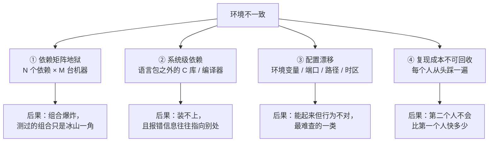
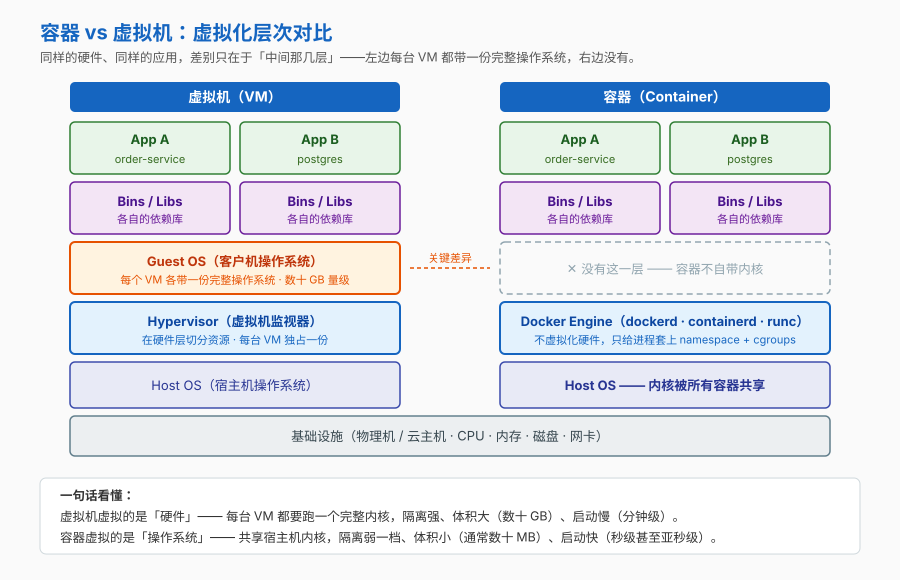
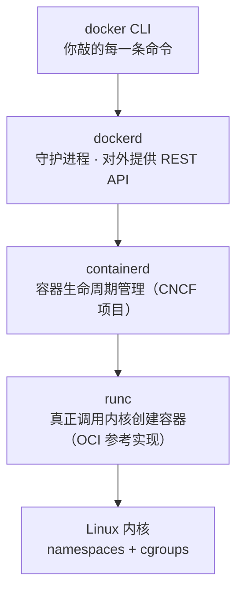
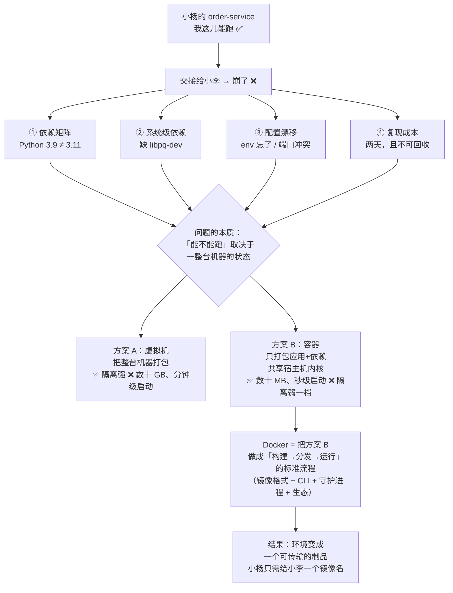

# 第 1 课：为什么需要Docker

> 所属阶段：阶段 1《容器与镜像基础》｜ 水平：入门 ｜ 本课知识点：环境不一致的代价、容器与虚拟机的区别、Docker 的起源与生态位
> 故事情节：order-service 在我这儿跑得好好的，一交接给同事就崩 —— 先看清"能跑"的真实成本，再决定要不要换个办法

## 🎯 本课目标

- 列举环境不一致的四类具体代价，说清为什么"把文档写详细点"挡不住它
- 说清容器与虚拟机在**虚拟化层次**上的本质区别，以及由此带来的三方面后果
- 讲出 Docker 的起源与它在容器生态中的位置，分清"Docker" 和 "容器" 不是一回事

> 🛠 本课第四幕需要一套可用的 Docker 环境。未安装请先回到 [阶段 1 概览的「课前环境准备」](../overview.md)。

## 📌 知识点导航

| 知识点 | 关键点 | 状态 |
|--------|--------|------|
| 环境不一致的代价 | 依赖矩阵地狱 / 配置漂移 / "只在我机器上能跑"的复现成本 | ✅ 已完成 |
| 容器与虚拟机的区别 | 虚拟化层次不同（硬件 vs 操作系统）/ 内核共享与隔离边界 / 体积与启动速度差距的来源 | ✅ 已完成 |
| Docker 的起源与生态位 | dotCloud 孵化、Solomon Hykes 于 PyCon 2013 首次公开 / libcontainer → runc → 2015-06 捐给 OCI / 2017 containerd 捐给 CNCF 并成为 Docker Engine 核心运行时 | ✅ 已完成 |

---

## 第一幕：起源与场景引入

> 🏛️ **起源**：Docker 出自一家名为 dotCloud 的 PaaS 公司内部孵化，由 **Solomon Hykes** 在 **PyCon 2013** 的一场 5 分钟闪电演讲上首次公开（题目 *The future of Linux Containers*）。它用的不是什么黑科技——Linux 内核里的 **cgroups**（资源配额）和 **namespaces**（视图隔离）早就存在——Docker 的贡献是把这些内核原语包装成开发者能用的工具，并定义了"构建—分发—运行"的标准流程。2015 年 6 月，Docker 把镜像规范和运行时代码（即后来的 **runc**）捐给 **OCI** 做行业标准；2017 年又把 **containerd** 捐给 **CNCF**。（核查于 2026-09；其中 Hykes / PyCon 2013 为 Docker 官方博客一手来源，**dotCloud 内部孵化为二手来源、多来源一致**）

**场景**：小杨写完了一个叫 `order-service` 的订单服务——Python 3.11 + PostgreSQL 15 + Redis 7。在他自己的笔记本上，一切正常，测试全绿，接口秒回。

然后他要把它交接给同事小李。

> 🎬 **场景**：小李花了整整两天才把这个服务跑起来。不是代码有问题，是环境有问题。

这两天里，小李依次撞上了这些：

| # | 撞上的事 | 文档里写了没 |
|---|---------|------------|
| 1 | 本机 Python 是 3.9，服务要求 3.11+ | ❌ 没写（小杨默认大家都是 3.11） |
| 2 | `pip install psycopg2` 编译失败，缺 `libpq-dev` | ❌ 没写（小杨的机器上早就装了） |
| 3 | Redis 默认端口 6379 被小李本机的另一个项目占了 | ❌ 没写 |
| 4 | 有个叫 `ORDER_DB_URL` 的环境变量忘了写进文档 | ❌ 没写（小杨的 shell 配置里一直有） |

四件事，没有一件事是代码 bug，但每一件都能让服务起不来。

---

## 第二幕：认知冲突

> ❓ **问题**：文档会写、部署脚本也会写——那为什么还是跑不起来？是不是把文档写详细点就行了？

答案是：**写不全**。

小杨不是不负责任，他是**没意识到自己在依赖什么**。他对 `order-service` 的心智模型是"我的代码"，但真正让这段代码跑起来的，是他的代码 **加上他整台机器的状态**——Python 版本、系统 C 库、环境变量、端口占用、时区、`locale`、内核版本……这个状态有几十个维度，而他只能写下"他记得自己动过"的那几个。

于是问题变成了一个更难的形式：

> 如果"能不能跑"取决于一整台机器的状态，那**这台机器的状态本身**，是不是也应该是一个可以交接、可以传输的东西？

虚拟机早就回答了这个问题——把整台机器打包。但它太重了（下一幕会看到重在哪）。

所以真正的冲突是：

```
虚拟机的思路：把整台机器打包 → 隔离彻底，但重到用不起（每台都要带一个完整操作系统）
   ↓
能不能只打包「应用真正需要的那一层差异」，而把操作系统内核这一层留给大家共用？
```

---

## 第三幕：层层揭示

### 知识点 1：环境不一致的代价

> 本知识点关键点：依赖矩阵地狱 / 配置漂移 / "只在我机器上能跑"的复现成本

#### 一句话定义

**环境不一致**：同一份代码，在不同机器上所依赖的**运行时状态**不同，导致行为不同或根本跑不起来。

注意定义里的"状态"二字——问题不在代码，在代码之外的那一整套状态。

#### 直觉建立（类比）

想象你照着菜谱做菜。菜谱写"加一勺盐，中火煮十分钟"，但它没写：

- 你家的灶是明火还是电磁炉（火力曲线不同）
- 锅是铁锅还是不粘锅（导热不同）
- 你在高原还是海边（水的沸点差好几度）

菜谱没写错。是**你的厨房和作者的厨房不一样**。

> 💡 **类比的边界**：两处不成立。① 菜谱的差异顶多让菜难吃点，软件的"厨房"差异会让它直接崩溃，没有中间地带。② 容器**不是**把菜谱写得更详细，而是**连厨房一起打包带走**——这是思路层面的不同，不是程度上的不同。

#### 核心原理

环境不一致的代价可以拆成四类，每一类都对应第一节那张表里的某个坑：



| 类型 | 小李撞上的 | 为什么难 |
|------|-----------|---------|
| ① 依赖矩阵地狱 | Python 3.9 vs 3.11 | 依赖越多，机器之间的组合呈**乘法**增长，你永远测不完 |
| ② 系统级依赖 | 缺 `libpq-dev` 导致编译失败 | 它不在你的 `requirements.txt` 里，而在操作系统里；报错信息通常指向"编译失败"而不是"你缺这个包" |
| ③ 配置漂移 | `ORDER_DB_URL` 忘了传、端口被占 | **服务能起来但行为不对**，比直接崩溃更难查 |
| ④ 复现成本不可回收 | 两天 | 这不是一次性成本——新人入职、换机器、上生产，每次重来一遍 |

#### 示例演示

现在就在你自己的机器上，看看"状态"有多少个维度是你平时根本没意识到的：

```bash
# 1. 语言运行时版本
python3 --version
# 预期输出：Python 3.x.y —— 换台机器很可能就不是这个数

# 2. 系统级 C 库（第 ② 类代价的主战场）
ldd --version 2>&1 | head -1
# Linux 预期输出：glibc 版本号
# macOS 预期输出：ldd: command not found —— macOS 根本没有 ldd（要看动态库依赖得用 otool -L）
# ↑ 连「查一下 C 库版本」这条命令本身在不同系统上都存在性不同 —— 这恰恰就是「状态不一致」的活教材

# 3. 环境变量（第 ③ 类代价的主战场）
env | wc -l
# 预期输出：一个数字，通常几十到上百 —— 你的应用正在默默依赖其中一部分

# 4. 端口占用（macOS 自带 lsof；Debian/Ubuntu 需先 apt install lsof）
lsof -i :6379 2>/dev/null || echo "6379 空闲（或 lsof 未安装）"
# 预期输出：要么列出占用进程，要么提示空闲
```

> 这四个命令在**你的机器上一定会有输出**，但它们的值在别人的机器上大概率不同。这就是"环境"——一堆你没写下来、却实实在在被依赖着的状态。

#### 常见误区

1. **"把文档写详细点就好了"**：你写不全。你无法写下你**不自觉依赖**的东西——小杨从来没"安装过" `libpq-dev`，它是某次装别的东西时带进来的。正确做法不是写得更细，而是**换一个载体**：把环境本身做成一个可以传输的制品。

#### 一句话记住

> **环境问题不是"文档没写好"，是"环境本身从没被当作一个可交付的制品"。**

---

### 知识点 2：容器与虚拟机的区别

> 本知识点关键点：虚拟化层次不同（硬件 vs 操作系统）/ 内核共享与隔离边界 / 体积与启动速度差距的来源

#### 一句话定义

**虚拟机**在**硬件层**做虚拟化——每台 VM 都跑一个完整的客户操作系统（自带内核）；
**容器**在**操作系统层**做虚拟化——多个容器**共享宿主机内核**，各自拥有独立的进程视图、文件系统和资源配额。

差别只有一个词：**在哪一层切**。但这个"层"决定了后面所有的性质。

#### 直觉建立（类比）

| | 虚拟机 | 容器 |
|---|---|---|
| 类比 | **独栋别墅** | **合租公寓** |
| 每户自带 | 独立的水电、锅炉、管道（= 一整个操作系统） | 只有自己的门锁和隔断 |
| 共用 | 只有市政主干 | 整栋楼的水电主干（= 内核） |
| 代价 | 又贵又占地，但一户着火烧不到隔壁 | 便宜密集，但主干一出事整栋都遭殃 |

> 💡 **类比的边界**：集装箱/公寓这类类比容易让人以为容器是"缩小版的独立房间"。实际上容器里的进程**就是宿主机上的一个普通进程**——你在宿主机上 `ps aux` 能直接看到它。它的"隔断"不是墙，而是内核给这个进程戴上的两副装置：**namespace**（决定它能看见什么）和 **cgroups**（决定它能用多少）。墙是实体的，眼镜不是。

#### 核心原理



这张图里唯一需要记住的，是右边那个**虚线空框**——容器没有 Guest OS 这一层。

这一个"没有"，连带产生三方面后果：

| 维度 | 虚拟机 | 容器 | 差别的根源 |
|------|--------|------|-----------|
| **体积** | 数十 GB 量级 | 通常数十 MB 量级 | VM 要装一份完整操作系统，容器只装应用和它的依赖库 |
| **启动速度** | 分钟级（要引导一个内核） | 秒级甚至亚秒级 | 容器不用引导内核，只是**起一个进程** |
| **隔离强度** | 强（各自独立内核，攻击面是 Hypervisor） | 弱一档（共享内核，内核漏洞影响全部容器） | 共用了内核，就共用了内核的攻击面 |

> 关于体积的官方口径：Docker 官网原文表述为容器镜像 "typically tens of MBs"，而虚拟机 "includes a full copy of an operating system… taking up tens of GBs"。（核查于 2026-09）

#### 示例演示

等第四幕环境跑起来之后，你可以亲手验证"体积小"这一条：

```bash
# 拉一个极简基础镜像（alpine 是常用的极简 Linux 发行版镜像）
docker pull alpine:latest

# 看它的体积
docker images alpine
# 预期输出：REPOSITORY=alpine，SIZE 列是一个「几 MB」量级的数字
# ⚠️ 具体数字随镜像版本与平台变化，不要背数字，要看量级：MB 级，不是 GB 级
```

#### 常见误区

1. **"容器就是轻量虚拟机"**：错在"虚拟机"三个字。容器不是模拟出来的机器，它是**被限制了视野和资源的宿主机进程**。这个区别决定了后面的很多行为——比如为什么容器里改了内核参数会影响宿主机，为什么容器里 `reboot` 会直接把你宿主机重启。
2. **"容器的隔离性和虚拟机一样强"**：弱一档。共享内核意味着内核漏洞、内核资源竞争是**跨容器**的。也正因为如此，才有了 gVisor、Kata Containers 这类"加强隔离的容器运行时"（阶段 5 会提到）。**对不可信负载，别拿容器当安全边界。**
   > 🎯 **这对你意味着什么**：如果你只是把**自己团队写的服务**打成镜像，这条基本不用操心——风险边界就是你的团队。真正要紧张的是**运行不可信代码**：用户上传的代码、来路不明的第三方镜像、多租户平台。那种场景容器不是安全边界，得换更强的隔离（阶段 4 课 12 会回到这个话题）。

#### 一句话记住

> **虚拟机虚拟的是硬件（各带内核），容器虚拟的是操作系统（共用一个内核）。**

#### 官方文档

- [What is a container?（Docker 官方）](https://www.docker.com/resources/what-container/)——容器与虚拟机的官方对比表述来源

---

### 知识点 3：Docker 的起源与生态位

> 本知识点关键点：dotCloud 孵化、Solomon Hykes 于 PyCon 2013 首次公开 / libcontainer → runc → 2015-06 捐给 OCI / 2017 containerd 捐给 CNCF 并成为 Docker Engine 核心运行时

#### 一句话定义

**Docker** 是一整套把 Linux 容器能力包装成"**构建 → 分发 → 运行**"标准流程的工具链：命令行（CLI）+ 守护进程（dockerd）+ 镜像格式 + 周边生态。

注意它和"容器"不是一回事：**容器能力来自 Linux 内核，Docker 是把这套能力变得人人可用的那层包装。**

#### 直觉建立（类比）

集装箱改变了航运业。在集装箱之前，码头工人一件件搬货，每种货都要现场想办法怎么装、怎么固定。集装箱定了一个**标准尺寸**之后，船、火车、卡车、吊车全都按这个尺寸设计——**货物本身再也不用关心自己坐什么车**。

Docker 做的事一样：它定了一个标准的"软件包装格式"（镜像）和一套标准动作（build / push / run），于是"怎么部署"这件事从每个项目各写一套，变成了全行业共用一套。

> 💡 **类比的边界**：集装箱是物理标准，装进去的货物换了船也不会变。但容器镜像里的应用**会依赖 CPU 架构和内核版本**——arm64 上构建的镜像跑在 amd64 上要靠模拟，依赖较新内核特性的镜像跑在老内核上会失败。所以那句口号"Build, Ship and Run Any App, Anywhere"的准确含义是：**同架构、且内核兼容**的前提下，到处能跑。不是真的 anywhere。

#### 核心原理

时间线（核查于 2026-09）：

| 时间 | 事件 | 意义 |
|------|------|------|
| 2013 | 在 dotCloud 内部孵化，**Solomon Hykes 于 PyCon 2013 首次公开** | Docker 进入公众视野 |
| 2015-06 | Docker 把**容器镜像规范**与运行时代码（后来的 **runc**）捐给 **OCI**（Linux 基金会下的开放容器标准） | 容器格式不再由一家公司说了算 |
| 2017 | 把 **containerd** 捐给 **CNCF** | containerd 成为 Docker Engine 的核心容器运行时 |

> ⚠️ 置信度说明：**Hykes / PyCon 2013 首次公开**为 Docker 官方博客一手来源；**dotCloud 内部孵化**为二手来源（多来源一致）；**2015-06 与 2017 两个捐赠节点及 OCI / CNCF 归属**为 Docker 官网一手来源。

今天的 Docker 其实是**三层**叠起来的：



你敲一条 `docker run`，命令从上往下走三层，最后由 runc 去跟内核打交道。平时你不需要知道这三层，但**排障时这个分层很有用**——"镜像拉不下来"和"容器起不来"发生在不同层（阶段 5 的排障手册会用到）。

#### 示例演示

```bash
# 看 Client 与 Server 两段版本
docker version
# 预期输出：
#   Client: Docker Engine - Community + 版本号（这是 CLI）
#   Server: Docker Engine - Community + 版本号（这是 dockerd）
# ⚠️ 只看得到 Client 说明守护进程没起来 —— 这是"装完了却用不了"最常见的原因

# 在 info 输出里找这几行，能看到三层里的下面两层
docker info | grep -iE 'Server Version|Storage Driver|containerd|runc'
# 预期输出：Server Version 与 Storage Driver 两行一定有；
#          containerd / runc 两行随 Engine 版本与存储后端配置不同，可能有也可能没有
# ⏳ 置信度：中 —— docker info 的字段随版本变化；看不到 containerd 行，不代表它不存在
```

> 注：本讲义的命令与预期输出为**纸面预期**（写作时本机 Docker 守护进程未运行，未能取得实测输出）。你跑出来的具体版本号会与本课示例不同，属正常。

#### 常见误区

1. **"Docker 发明了容器"**：没有。cgroups（2007 年进内核）和 namespaces 都比 Docker 早得多，此前还有 LXC、FreeBSD jail、Solaris Zones。Docker 的贡献是**包装与标准化**，不是发明。
2. **"Kubernetes 抛弃了 Docker"**：不准确。准确说法是 Kubernetes 移除了 **dockershim**（用来适配 dockerd 的那层胶水），不再需要 **dockerd** 这一层——**Docker 构建出来的 OCI 标准镜像，在 Kubernetes 上照样能跑**。这两件事经常被混为一谈（阶段 5 课 14 会展开）。
3. **"装了 Docker Desktop 就等于装了 Docker"**：两者不是一回事。**Docker Engine**（dockerd）才是那个引擎，它只能在 Linux 上原生运行；**Docker Desktop** 是一个产品，在 macOS / Windows 上先起一个 Linux 虚拟机，再在虚拟机里跑 dockerd。所以你在 Mac 上跑容器，底下其实垫了一层虚拟机——这也解释了为什么 Mac 上的文件挂载性能和 Linux 不一样（阶段 5 课 14 会回到这个话题）。

#### 一句话记住

> **Docker 的贡献不是发明容器，而是把"构建—分发—运行"标准化，并做成了人人可用的工具。**

#### 官方文档

- [What is a container?（Docker 官方）](https://www.docker.com/resources/what-container/)——OCI / runc / containerd 的官方沿革表述
- [Docker Engine release notes（Docker 官方）](https://docs.docker.com/engine/release-notes/)——版本与破坏性变更的一手来源

---

## 第四幕：实操验证

回到小杨的困境：他要把 `order-service` 交给小李。现在我们用刚学的三件事，看看容器怎么解决它。

### 步骤 1：确认环境可用

```bash
docker version
docker run hello-world
# 预期输出（标准文案，多来源一致）：
#   Hello from Docker!
#   This message shows that your installation appears to be working correctly.
#
#   To generate this message, Docker took the following steps:
#    1. The Docker client contacted the Docker daemon.
#    2. The Docker daemon pulled the "hello-world" image from the Docker Hub.
#    3. The Docker daemon created a new container from that image which runs the
#       executable that produces the output you are currently reading.
#    4. The Docker daemon streamed that output to the Docker client, which sent it
#       to your terminal.
# ⚠️ 若卡在 pulling 或报连接错误，通常是网络 / 镜像加速器问题，不是你的操作错了
```

> 这段输出本身就是知识点 3 那张三层图的实例：client → daemon → 拉镜像 → 建容器 → 跑进程。

### 步骤 2：同一台机器，两套 Python 互不干扰

这是容器解决"依赖矩阵地狱"（第 ① 类代价）的最直观演示：

```bash
# 你本机不需要装 Python 3.11，也不需要装 Python 3.9
docker run --rm python:3.11 python -V
# 预期输出：Python 3.11.x

docker run --rm python:3.9 python -V
# 预期输出：Python 3.9.x
```

- `--rm`：容器跑完就删，不留残骸
- `python:3.11`：镜像名（阶段 1 课 3 会拆开这个名字的三段结构）
- 两个版本**同时存在于你的机器上但不冲突**——因为它们各自活在自己的文件系统里

### 步骤 3：看看"体积小"是不是真的

```bash
docker images
# 预期输出：REPOSITORY / TAG / IMAGE ID / CREATED / SIZE 五列
# 关注 SIZE 列：以 MB 计，而不是 GB
```

> ✅ **回扣场景**：小杨现在不用再写"请先安装 Python 3.11 和 libpq-dev，注意端口别冲突，另外别忘了设 `ORDER_DB_URL`"。他只需要给小李**一个镜像名**。
>
> 环境从"一堆需要人照着做的步骤"，变成了一个**可以传输的文件**。这正是第二幕那个问题的答案——环境的确可以被当作一个可交付的制品，只要你别把整个操作系统内核都打进去。

---

## 第五幕：体系收束

> 📍 **全局定位**：本课回答了课程的**第一个问题**——"为什么需要 Docker"。我们还只站在门口：知道了容器解决什么问题、它和虚拟机的分界在哪、Docker 在生态里站在哪一层。但**容器到底是怎么跑起来的、镜像到底是什么**，还没讲。
>
> 用本课的三层图定位一下自己：现在你在最上面那层（CLI），往下三层（dockerd / containerd / runc）只知道名字，还不知道各干什么。

> 🔗 **下一步**：课 2《跑起来第一个容器》——把 `docker run` 这条命令**拆开**，看它从你敲下回车到进程启动，中间到底走了哪几步；然后搞清楚"镜像"和"容器"这两个词到底指什么（它们是"模板"和"实例"的关系，不是同义词）。

---

## 🐞 常见误区

1. **"容器 = 轻量虚拟机"** → 容器是**被限制了视野和资源的宿主机进程**，不是模拟出来的机器。后果：容器里改内核参数会影响宿主机；容器里 `reboot` 会把宿主机重启。

2. **"只要用上 Docker，环境问题就彻底解决了"** → 容器解决的是**应用依赖**的一致性问题，解决不了这些：CPU 架构差异（arm64 / amd64）、内核版本差异、时区与时钟、外部服务的地址与凭据、以及**你代码里写死的逻辑**。它把问题收敛了，没有消灭。

3. **"'在我机器上能跑'是别人的问题"** → 它其实是**交付物不完整**的问题。判据很简单：**一个新同事拿到你的仓库，能不能在半小时内把服务跑起来？** 不能，就是交付物不完整——不管你用不用 Docker。

---

## 一图总结



---

## 📋 命令速查卡

| 命令 | 作用 | 本课出现在哪 |
|------|------|------------|
| `docker version` | 看 CLI（Client）与守护进程（Server）两段版本 | 知识点 3 · 第四幕步骤 1 |
| `docker run hello-world` | 验证整条链路：CLI → daemon → 拉镜像 → 建容器 → 跑进程 | 第四幕步骤 1 |
| `docker run --rm <镜像> <命令>` | 起一个容器执行命令，**跑完自动删除** | 第四幕步骤 2 |
| `docker images` | 列出本地镜像，看 REPOSITORY / TAG / SIZE | 第四幕步骤 3 |
| `docker pull <镜像>` | 只拉取镜像不运行 | 知识点 2 示例 |

---

## 课后小测

**Q1**：小李花了两天才把 `order-service` 跑起来，四件事里"缺 `libpq-dev` 导致编译失败"属于哪一类代价？它为什么特别难查？

- A. 配置漂移 —— 因为环境变量没传
- B. 依赖矩阵地狱 —— 因为 Python 版本不对
- C. 系统级依赖 —— 因为它不在 `requirements.txt` 里，且报错指向"编译失败"而非"缺这个包"
- D. 复现成本不可回收 —— 因为每个人都要踩一遍

<details><summary>答案与解析</summary>

**答案：C**。系统级依赖的坑在于**它不在语言级的依赖清单里**（`requirements.txt` / `package.json` 都管不到），而且在很多发行版上它表现为"编译失败"，报错信息不会直接告诉你缺哪个包。A 是环境变量类，B 是版本类，D 描述的是代价的后果而不是成因。

</details>

**Q2**：关于容器与虚拟机的区别，下列说法正确的是？

- A. 容器比虚拟机隔离更强，因为它轻量
- B. 虚拟机虚拟的是硬件层，每台 VM 自带内核；容器虚拟的是操作系统层，共享宿主机内核
- C. 容器是一个小型的完整操作系统，只是启动更快
- D. 容器里跑的进程在宿主机上看不到

<details><summary>答案与解析</summary>

**答案：B**。这是本课的核心结论。A 反了——共享内核恰恰意味着容器隔离**弱一档**。C 错在"完整操作系统"，容器不带内核。D 错——容器进程**就是**宿主机上的普通进程，在宿主机 `ps aux` 能直接看到（这正是"容器不是虚拟机"的直接证据）。

</details>

**Q3**：关于 Docker 与容器生态，下列说法正确的是？

- A. Docker 发明了容器技术，cgroups 和 namespaces 是它带来的
- B. Kubernetes 移除 dockershim 之后，Docker 构建的镜像就不能在 Kubernetes 上运行了
- C. Docker 的贡献是把"构建—分发—运行"标准化；镜像规范与 runc 已捐给 OCI，containerd 已捐给 CNCF
- D. 有了容器，任何镜像都可以在任何机器上原样运行，与 CPU 架构无关

<details><summary>答案与解析</summary>

**答案：C**。A 错——cgroups / namespaces 早于 Docker，Docker 是包装与标准化；B 错——移除 dockershim 只是不再需要 dockerd 那一层，Docker 构建的 **OCI 标准镜像**照样能在 K8s 上跑（阶段 5 课 14 展开）；D 错——"到处能跑"的前提是**同架构 + 内核兼容**，arm64 与 amd64 不能原样互跑。

</details>

---

## 🚀 下一批接力提示词

> 学完本课后，**复制下面这段文字发给 AI**，即可无缝进入下一批（无需重新描述上下文）：

```
继续学 Docker。我的学习档案在 docker/00-学习档案.md，
刚学完阶段 1《容器与镜像基础》的课《为什么需要Docker》知识点 环境不一致的代价、容器与虚拟机的区别、Docker 的起源与生态位，
请按大纲继续讲解下一批知识点。
```

## 🧭 课程导航

➡️ **下一课**：[课 2：跑起来第一个容器](lesson-02-跑起来第一个容器.md)

📚 **返回目录**：[课程目录](../../../02-课程目录.md)
