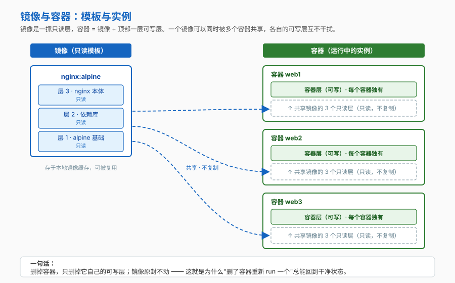
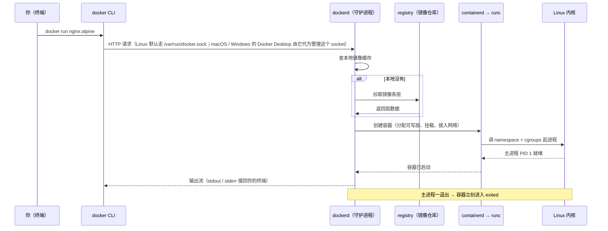
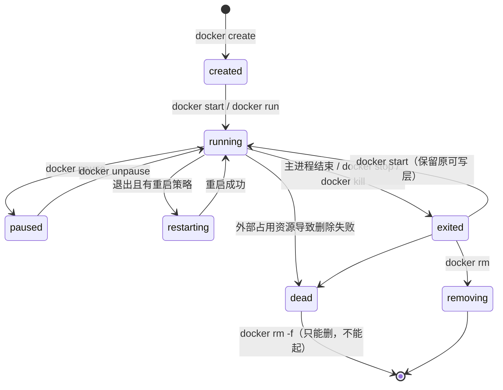
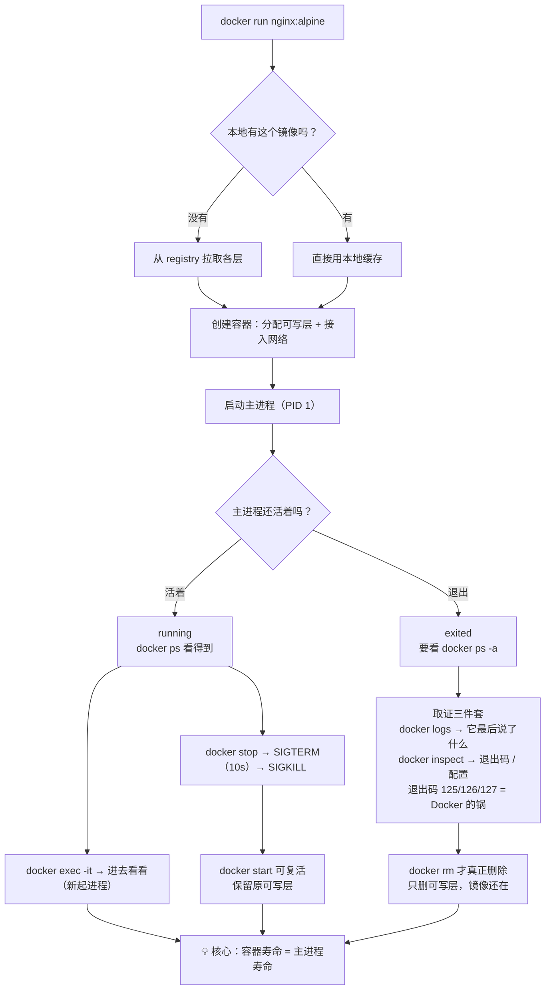

# 第 2 课：跑起来第一个容器

> 所属阶段：阶段 1《容器与镜像基础》｜ 水平：入门 ｜ 本课知识点：镜像与容器的关系、docker run 背后发生了什么、容器生命周期命令
> 故事情节：order-service 第一次被 `docker run` 拉起来，全程发生了什么

## 🎯 本课目标

- 说清镜像与容器的关系，能解释"一个镜像为什么能起多个容器、且彼此隔离"
- 能叙述 `docker run` 从敲下回车到进程启动的完整链路，并说清"容器为什么会自己退出"
- 会用生命周期命令管理容器，看懂 `docker ps` 的状态列与退出码的含义

## 📌 知识点导航

| 知识点 | 关键点 | 状态 |
|--------|--------|------|
| 镜像与容器的关系 | 类与对象 / 只读模板 + 可写层 / 一个镜像可以起多个容器 | ✅ 已完成 |
| docker run 背后发生了什么 | 客户端-守护进程架构 / 本地查找→拉取→创建→挂载文件系统→接入网络→启动进程 / 前台进程退出则容器停止 / **`docker run` 参数地图** | ✅ 已完成 |
| 容器生命周期命令 | ps -a 与 ps 的区别 / logs / exec 与 attach 的区别 / stop 与 rm 的两段式 / 退出码的含义 | ✅ 已完成 |

---

## 第一幕：起源与场景引入

课 1 结尾，小杨想通了一件事：与其写"请先安装 Python 3.11 和 libpq-dev"这种注定写不全的文档，不如**把环境本身做成一个可以传输的制品**。

于是他决定，先搞懂一条命令：

```bash
docker run nginx:alpine
```

命令敲下去，屏幕滚过一堆拉取进度，然后……**光标卡住了**。

他以为是卡死，按了 `Ctrl+C`，命令退出，容器也没了。

再试一次，这次他加了 `-d`：

```bash
docker run -d nginx:alpine
0246aa4d1448a401cabd2ce8f242192b6e7af721527e48a810463366c7ff54f1
docker ps
CONTAINER ID   IMAGE          STATUS         NAMES
0246aa4d1448   nginx:alpine   Up 3 seconds   pedantic_liskov
```

这回对了——服务在后台跑着。但他心里冒出三个问号：

> 🎬 **场景**：① 刚才那次为什么卡住？② 这个 `0246aa4d1448` 是什么？③ `docker run` 到底替我干了些什么？

---

## 第二幕：认知冲突

小杨接着试了一个"正常"的操作——他想在容器里起一个服务：

```bash
docker run -d --name bad nginx:alpine service nginx start
docker ps -a --filter name=bad
CONTAINER ID   IMAGE          STATUS                   NAMES
9f3c1e2a7b41   nginx:alpine   Exited (0) 2 seconds ago bad
```

**服务起来了，容器却退出了。**

> ❓ **问题**：`service nginx start` 明明"成功"了，为什么容器还是 `Exited`？加了 `-d` 不是应该一直在后台跑吗？

这个问题直指容器的命门。在回答它之前，得先搞清楚两个词：**镜像** 和 **容器**。

---

## 第三幕：层层揭示

### 知识点 1：镜像与容器的关系

> 本知识点关键点：类与对象 / 只读模板 + 可写层 / 一个镜像可以起多个容器

#### 一句话定义

**镜像**是一个**只读的分层文件包**，里面装着运行所需的全部文件，外加一份"怎么启动"的配置（默认命令、环境变量、端口声明）；
**容器**是镜像**运行起来的实例**——等于"镜像的只读层"再加上"顶部一层可写层"。

#### 直觉建立（类比）

镜像是**模具**，容器是用模具浇出来的**铸件**。

- 模具只有一个，铸件可以有很多个
- 你在铸件上刻字，不会刻到模具上
- 把铸件扔了，模具还在，随时能再浇一个

> 💡 **类比的边界**：两处不成立。① 铸件一旦浇出来就和模具**物理分离**了，而容器**没有复制**镜像的文件——它只是"透过"自己那层薄薄的可写层去读下面的只读层（这叫写时复制，课 3 会拆开讲机制）。这是容器能做到"又轻又快"的关键。② 模具不会自己动，而镜像里除了文件还有一份**启动配置**，这份配置才让镜像"可执行"——所以严格说镜像是"可运行的模具"。

#### 核心原理



图里要抓住三件事：

1. **镜像的层是只读的**，多个容器共享同一份，不复制——10 个容器用同一个 100MB 镜像，磁盘上不会变成 1000MB。
2. **每个容器顶部有自己专属的一层可写层**。容器里所有写操作（新建文件、改配置、写日志）都落在这一层。
3. **删容器只删它自己的可写层**，镜像原封不动。

这就解释了一个日常现象：**容器搞坏了？删掉重新 `docker run` 一个，立刻回到干净状态。** 因为"干净状态"一直在镜像里躺着，你删掉的只是弄脏的那一层。

顺带把第二幕那个 `9f3c1e2a7b41` 也解释了：那是容器的**短 ID**。容器有三种叫法（官方口径）：

| 标识方式 | 例子 | 什么时候用 |
|---------|------|-----------|
| UUID 长 ID | `f78375b1c487e03c9438c729345e54db9d20cfa2ac1fc3494b6eb60872e74778` | 脚本里最稳妥 |
| UUID 短 ID | `f78375b1c487` | 手敲时最方便 |
| 名字 | `pedantic_liskov`（守护进程随机生成）或 `--name` 自定义 | 日常最推荐，**自定义名字还能在自定义网络里当 DNS 主机名用**（课 8） |

#### 示例演示

亲手验证"一个镜像、多个容器、彼此隔离"：

```bash
# 同一个 alpine 镜像，起两个容器
docker run --name a1 -d alpine sleep 300
docker run --name a2 -d alpine sleep 300

# 在 a1 里写个文件
docker exec a1 sh -c 'echo hello > /tmp/f && cat /tmp/f'
# 预期输出：hello

# 去 a2 里看同一个路径
docker exec a2 cat /tmp/f
# 预期输出：cat: can't open '/tmp/f': No such file or directory
```

> 同一个镜像，`a1` 写得热火朝天，`a2` 浑然不知。因为它们各自的可写层是分开的。

#### 常见误区

1. **"在容器里改了东西，镜像也会跟着变"** → 不会。改动只落在容器的可写层，镜像是只读的。想把改动固化成新镜像，要走 `docker commit`（不推荐，阶段 2 会讲为什么）或写 Dockerfile（推荐）。
2. **"容器删了，我在里面写的数据也没了"** → **是的，而且这是默认行为**。官方原话：容器数据默认存在 "an ephemeral, writable container layer"，删容器即删数据。怎么让数据活下来是课 7 的主题——**这是课上最实用的一课之一**。

#### 一句话记住

> **镜像是只读模板，容器 = 镜像 + 一层可写层；删容器只删那一层，镜像纹丝不动。**

#### 官方文档

- [Running containers（Docker 官方）](https://docs.docker.com/engine/containers/run/)——镜像引用、容器标识、可写层的官方表述

---

### 知识点 2：docker run 背后发生了什么

> 本知识点关键点：客户端-守护进程架构 / 本地查找→拉取→创建→挂载文件系统→接入网络→启动进程 / 前台进程退出则容器停止 / **`docker run` 参数地图**

#### 一句话定义

`docker run` 一条命令做完三件事：**（必要时）拉镜像 → 创建容器 → 启动主进程**。

注意"主进程"三个字——它是整个第二幕谜题的答案。

#### 直觉建立（类比）

去餐厅点一道菜：

| 步骤 | 现实 | `docker run` |
|------|------|-------------|
| 你下单 | 告诉服务员要什么 | CLI 把请求发给守护进程 dockerd |
| 后厨查货 | 这道菜的预制包在不在 | dockerd 查本地镜像缓存 |
| 缺货调货 | 从总仓调 | 本地没有就去 registry 拉 |
| 开一桌 | 摆好餐具 | 创建容器：分配可写层、接入网络 |
| 上菜 | 把菜端到你面前 | 启动主进程，输出流回你的终端 |

> 💡 **类比的边界**：餐厅里"开一桌"是长期资产，你走了桌还在；容器的"开一桌"是**临时的**——主进程一结束，桌立刻就收了。这不是 bug，是设计：**容器不是用来"待着"的，它是用来"跑一个进程"的。**

#### 核心原理



拆成六步记：

1. **CLI → dockerd**：你敲的 `docker` 只是个客户端，真正干活的是后台的守护进程；两者通过 socket 通信。
2. **查本地**：dockerd 先看本地镜像缓存有没有这个镜像。
3. **缺则拉取**：没有才去 registry 拉（默认策略是 `missing`，可用 `--pull=always/never` 改，CI 里很有用）。
4. **创建容器**：分配可写层、挂载卷、接入网络——**此时容器状态是 `created`，还没跑**。
5. **启动主进程**：经 containerd → runc 调用内核的 namespace + cgroups，把进程跑起来（课 1 那张三层图在这里落地）。
6. **接回输出**：默认情况下**前台运行**，stdout/stderr 接回你的终端——这就是第一幕"光标卡住"的真相：**它没卡，是 nginx 的日志在往你的屏幕上打。**

> 🔑 **本课最关键的一条**：容器的寿命 = 主进程的寿命。主进程退出，容器就 `Exited`。
> 这也解释了第二幕那个反例——`service nginx start` 把 nginx 起了，但**它自己立刻返回了**，主进程结束，容器收摊。正确写法是让服务**在前台**跑：
> ```bash
> docker run -d -p 80:80 my_image nginx -g 'daemon off;'
> ```
> （这个反例和正解都出自 Docker 官方文档。）

#### `docker run` 参数地图

`docker run` 的参数多到能单开一页文档。这里先给一张地图，**本课只讲透前四个，其余标出在哪一课深入**——避免你学完本课只会 `docker run hello-world`。

| 参数 | 作用 | 本课 | 深入在哪课 |
|------|------|:----:|-----------|
| `-d` | 后台运行（detached），只打印容器 ID | ✅ 讲透 | — |
| `-it` | 交互式终端（`-i` 保持 stdin、`-t` 分配伪终端） | ✅ 讲透 | — |
| `--name <名字>` | 给容器起个固定的名字 | ✅ 讲透 | — |
| `--rm` | 停止后自动删除（**跑一次性任务务必加**） | ✅ 讲透 | — |
| `-p 宿主:容器` | 端口映射（`-P` 自动映射所有 EXPOSE 端口） | 提到 | 课 8 |
| `-v 卷或路径:容器路径` | 挂载卷或目录（`--mount` 是更严格的写法） | 提到 | 课 7 |
| `-e K=V` | 注入环境变量（覆盖镜像里的 ENV） | 提到 | 课 5 |
| `--network <网络>` | 指定接入哪个网络 | 提到 | 课 8 |
| `--restart <策略>` | 重启策略 | 提到 | 课 10 |
| `--memory` / `--cpus` | 内存与 CPU 上限 | 提到 | 课 10 |
| `--user UID:GID` | 以非 root 运行 | 提到 | 课 12 |
| `--cap-drop=ALL` | 丢弃全部能力，再按需加回 | 提到 | 课 12 |
| `--entrypoint <命令>` | 覆盖镜像的 ENTRYPOINT | 提到 | 课 5 |
| `--init` | 用 tini 当 PID 1，负责转发信号与回收僵尸进程 | 提到 | 课 10 |

> ⚠️ **两个参数冲突的坑（官方明说）**：`--restart` 和 `--rm` 不能一起用，会直接报错。原因也很好想：`--rm` 要求退出后删除，`--restart` 要求退出后重启，两者互斥。
>
> 🙋 **两个高频追问，先给方向**：①「怎么让容器挂了自己重启、开机自启？」→ 用 `--restart` 策略，课 10 展开。②「怎么让容器一直不退出？」→ 答案**不是加某个参数**，而是让主进程前台常驻——就是本课刚讲的那条核心。

#### 示例演示

```bash
# 1) 后台运行 + 固定名字 —— 日常最常用组合
docker run -d --name web nginx:alpine
# 预期输出：一串容器 ID（不加 -d 则会占用你的终端并持续打印日志）

# 2) 一次性任务：--rm 让容器用完即走，不留残骸
docker run --rm alpine echo "跑完就走"
# 预期输出：跑完就走

# 对照组：不加 --rm，跑完就留一具「尸体」在 ps -a 里占磁盘
docker run --name leftover alpine echo "没加 rm"
docker ps -a --filter name=leftover
# 预期：STATUS = Exited (0) —— 容器还在
docker rm leftover
# 预期：打印 leftover，这才是真正删掉

# 3) 交互式进容器看看里面长什么样
docker run --rm -it alpine sh
# 进去后（提示符变成 / #）：
/ # cat /etc/os-release | head -2
/ # ps aux
/ # exit
# 预期：前两条打印 alpine 信息与进程列表；exit 后容器自动删除（--rm 生效）

# 4) 验证「主进程退出 = 容器退出」
docker run --name quitter alpine sh -c 'echo 干完活了; exit 0'
docker inspect quitter --format '{{.State.Status}} {{.State.ExitCode}}'
# 预期输出：exited 0
```

#### 常见误区

1. **"加了 `-d` 容器就会一直跑"** → 不一定。`-d` 只解决"不占终端"，不解决"主进程会退出"。要让容器活着，**主进程必须是一个不会自己结束的前台进程**。
2. **"`docker exec` 能进任何容器"** → 只能进**运行中**的容器；而且它要的是**容器标识（名字或 ID），不是镜像名**。`docker exec nginx:alpine sh` 会失败——这是官方文档专门点名的错误。

#### 一句话记住

> **`docker run` = 拉镜像 → 建容器 → 起主进程；容器的寿命，就是主进程的寿命。**

#### 官方文档

- [docker container run 参考（Docker 官方）](https://docs.docker.com/reference/cli/docker/container/run/)——全部参数与 `--rm` / `--restart` 冲突说明
- [Running containers（Docker 官方）](https://docs.docker.com/engine/containers/run/)——前台/后台、容器标识、退出码

---

### 知识点 3：容器生命周期命令

> 本知识点关键点：ps -a 与 ps 的区别 / logs / exec 与 attach 的区别 / stop 与 rm 的两段式 / 退出码的含义

#### 一句话定义

容器有 **7 种官方状态**，生命周期命令就是在这些状态之间搬运容器；**退出码**则告诉你它"死因"是什么。

#### 直觉建立（类比）

把容器想成一个有"生老病死"的小生命体：出生（`created`）、干活（`running`）、被暂停（`paused`）、自动复活（`restarting`）、死掉（`exited`）、正在被清理（`removing`）、卡在半死不活（`dead`）。

你敲的每条命令，都是在对它施加一次状态转移。

#### 核心原理

**七种状态**（官方 `docker ps --filter status=` 的取值）：

| 状态 | 含义 | 常见触发 |
|------|------|---------|
| `created` | 创建了但**从未启动过** | `docker create` |
| `running` | 正在运行 | `docker run` / `docker start` |
| `paused` | 已暂停（进程被冻结） | `docker pause` |
| `restarting` | 正在按重启策略重启 | 配了 `--restart` 且容器退出 |
| `exited` | 不再运行 | 主进程结束，或 `docker stop` |
| `removing` | 正在被删除 | `docker rm` |
| `dead` | 僵死：资源被外部进程占用导致**只删了一半** | 极罕见；**不能重启，只能删** |



**常命令速览**：

| 命令 | 干什么 | 注意 |
|------|--------|------|
| `docker ps` | 只看**运行中**的 | 新人 90% 的"我的容器呢"都是漏了 `-a` |
| `docker ps -a` | 看**全部**（含已退出） | — |
| `docker logs <容器>` | 看主进程打到 stdout/stderr 的日志 | `-f` 跟随、`--tail N` 只看末尾（课 11 详讲） |
| `docker exec -it <容器> <命令>` | 在运行中的容器里**新起一个进程** | 最常用；退出后容器照常运行 |
| `docker attach <容器>` | 附加到**主进程**的标准输入输出 | ⚠️ `Ctrl+C` 会把主进程一起送走；日常用 `exec` 而非 `attach` |
| `docker stop <容器>` | 发 SIGTERM → 等宽限期 → SIGKILL | 默认宽限期 Linux **10 秒**、Windows 30 秒 |
| `docker start <容器>` | 重新启动已退出的容器 | **保留原来的可写层**，不是全新容器 |
| `docker rm <容器>` | 删除容器 | 与 `stop` 是**两段式**：先停后删 |

**退出码怎么读**（官方口径）：

| 退出码 | 含义 | 典型场景 |
|:------:|------|---------|
| `0` | 正常结束 | 任务跑完 |
| `1`–`124` | **容器主进程自己的退出码** | 应用报错、断言失败，含义由你的程序定 |
| `125` | **Docker 守护进程本身的错误** | 参数写错了：`docker run --foo busybox` |
| `126` | 命令**无法被调用** | 把不可执行的东西当命令：`docker run busybox /etc` |
| `127` | 命令**找不到** | 打错命令名：`docker run busybox foo` |
| `137` | 被 `SIGKILL(9)` 杀死 | 官方点名三种：`docker kill`、手动杀 init 进程、**守护进程重启杀掉所有容器** |
| `143` | 被 `SIGTERM(15)` 终止 | `docker stop` 正常停止 |

> 关于 `137` / `143`：`137` 是官方文档明确列出的；`143` 走的是 POSIX shell 的通用约定 **`128 + 信号编号`**（`128+9=137`、`128+15=143`）。⏳ 置信度：中——约定本身可靠，但 Docker 未在自己的文档里逐条列全。

顺带补一条课 10 会展开的机制：**PID 1 在 Linux 里是特殊的，它会忽略"默认动作"的信号**。所以容器里的主进程不会因为收到 `SIGTERM` 就自动退出——除非它自己写了处理逻辑。这就是为什么有些容器 `docker stop` 总要等到 10 秒超时才被强杀。

#### 示例演示

```bash
# 1) ps 与 ps -a 的区别
docker run --rm -d --name alive alpine sleep 600
docker run --name done alpine echo 完事了
docker ps           # 预期：只看到 alive
docker ps -a        # 预期：alive（Up）+ done（Exited (0)）

# 2) 读退出码：三种典型死因
docker run --rm busybox /bin/sh -c 'exit 3';        echo "退出码=$?"   # 预期：3（应用自己的）
docker run --rm busybox no-such-cmd;                echo "退出码=$?"   # 预期：127（命令找不到）
docker run --rm --bad-flag busybox;                 echo "退出码=$?"   # 预期：125（Docker 自己出错）

# 3) 退出后还能捞回日志——这是 exited 容器最大的价值
docker logs done
# 预期输出：完事了

# 4) stop 与 rm 的两段式
docker stop alive      # 预期：打印容器名
docker ps -a --filter name=alive   # 预期：STATUS = Exited (...)
docker rm alive        # 预期：打印容器名；这一步才真正删除
```

#### 常见误区

1. **"容器退出了就看不了日志了"** → 能看。`docker logs` 读的是**宿主机上的日志文件**，容器删了才看不了。所以排查问题的正确顺序是：**先看日志，再删容器**。
2. **"`docker rm` 就是停止容器"** → 不是。停止是 `stop`（容器还在，可再启动），删除是 `rm`（容器没了）。生产上**别急着 rm**，先 `docker inspect` 看看配置和退出原因。
3. **"用 `attach` 进容器最方便"** → 危险。`attach` 是接进主进程，你按 `Ctrl+C` 等于给主进程发中断，容器跟着退出。日常请用 `docker exec -it`。

#### 一句话记住

> **容器的寿命等于主进程的寿命；`ps -a` 才看得到全貌；退出码 `125/126/127` 是 Docker 在告诉你"不是你的程序的锅"。**

#### 官方文档

- [docker container ls 参考（Docker 官方）](https://docs.docker.com/reference/cli/docker/container/ls/)——七种状态与 `exited=137` 过滤
- [Running containers · Exit status（Docker 官方）](https://docs.docker.com/engine/containers/run/#exit-status)——125 / 126 / 127 的官方定义

---

## 第四幕：实操验证

回到小杨的 `order-service`。他现在要做的，是把这个 Web 服务真的跑起来，并且**让它别再自己退出**。

> ⚠️ 本讲义的命令与预期输出为**纸面预期**（写作时本机 Docker 守护进程未运行）。具体 ID、状态码的时间与你实际运行会不同，属正常。

### 步骤 1：起一个真服务，看它活着

```bash
# 用 nginx 当 order-service 的替身（阶段 3 会用 compose 把真正的
# order-service + postgres + redis 一起拉起来）
docker run -d --name order-web nginx:alpine
# 预期输出：一串容器 ID

docker ps
# 预期：STATUS = Up x seconds，PORTS 显示 80/tcp
# ✅ nginx 的默认命令是前台运行，主进程不退出，所以容器活着
```

> 对比一下第二幕那个失败的 `service nginx start`：**区别不在于"服务有没有起来"，而在于"主进程有没有一直占着前台"。**

### 步骤 2：进容器里看看，确认它真的是隔离的

```bash
docker exec -it order-web sh
# 进去后：
/ # hostname          # 预期：一串容器 ID 风格的主机名（与你的宿主机不同）
/ # cat /etc/os-release | head -2   # 预期：Alpine Linux
/ # exit

# 对比宿主机
hostname
# 预期：你自己的机器名 —— 与容器里完全不同
```

### 步骤 3：看日志、看状态、看退出码

```bash
docker logs order-web
# 预期：nginx 的启动日志（这就是主进程打到 stdout 的东西）

docker inspect order-web --format '状态={{.State.Status}} 退出码={{.State.ExitCode}} PID={{.State.Pid}}'
# 预期：状态=running 退出码=0 PID=某个数字
# ↑ 这个 PID 是**宿主机**进程树里的 PID —— 再次印证「容器就是宿主机上的进程」
```

### 步骤 4：一个镜像起多个实例，模拟"扩容"

```bash
docker run -d --name order-web-2 nginx:alpine
docker run -d --name order-web-3 nginx:alpine
docker ps
# 预期：三个容器，IMAGE 都是 nginx:alpine，NAMES 各不相同

docker exec order-web-2 sh -c 'echo 我是2号 > /tmp/whoami'
docker exec order-web-3 cat /tmp/whoami
# 预期：cat: can't open '/tmp/whoami': No such file or directory
# ✅ 同一个镜像，三个实例，各自的可写层互不干扰
```

### 步骤 5：收尾，并体会"删掉重来"的爽感

```bash
docker stop order-web order-web-2 order-web-3
docker rm   order-web order-web-2 order-web-3
docker ps -a
# 预期：这三个都不见了

docker images nginx:alpine
# 预期：镜像还在 —— 随时能再起一百个
```

> ✅ **回扣场景**：小杨的三个问号都解开了。① 那次不是卡住，是 nginx 在前台打日志；② `0246aa4d1448` 是容器短 ID；③ `docker run` 替他拉镜像、建容器、起主进程。更重要的是，他现在知道了一条铁律——**想让容器活着，就得让主进程活着**。

---

## 第五幕：体系收束

> 📍 **全局定位**：到这儿，阶段 1 的"跑起来"这一半完成了。你现在能：解释镜像与容器的关系、叙述 `docker run` 的链路、用生命周期命令管理容器、看懂退出码。
>
> 但**容器里的数据怎么才能活过容器、服务之间怎么互相访问**，还完全没碰——那是阶段 3 的活儿。另外，你手上的镜像全是别人做好的，怎么自己做镜像是阶段 2。

> 🔗 **下一步**：课 3《镜像的里子：分层与仓库》——把"镜像是一摞只读层"这件事拆开讲透：层是怎么叠的、写时复制到底怎么工作、以及 `latest` 这个标签为什么是个坑。课 3 学完，阶段 1 就闭环了。

---

## 🐞 常见误区

1. **"容器是一个小型虚拟机，进去装东西、一直用着"** → 容器是**一次性的**：镜像定死内容，容器跑完就扔。想改内容应该改 Dockerfile 重新构建镜像，而不是进容器里手动装。手动改过的容器没有可复现性，等于把课 1 那个环境地狱又请回来了。

2. **"加了 `-d` 就万事大吉"** → `-d` 只管"不占终端"。主进程退了照样 `Exited`。判断容器健不健康，看 `docker ps` 的 STATUS 和退出码，不看有没有加 `-d`。

3. **"容器退出就查不出来了"** → 恰恰相反，`exited` 状态的容器是**最好的破案现场**：`docker logs` 看它最后说了什么，`docker inspect` 看退出码和配置。正确顺序永远是**先取证，再 `rm`**。

4. **"`docker exec` 和 `docker attach` 差不多"** → 差很多。`exec` 是**新起一个进程**（安全，退出不影响容器），`attach` 是**接管主进程**（`Ctrl+C` 会把容器一起送走）。日常一律用 `exec`。

---

## 一图总结



---

## 📋 命令速查卡

| 命令 | 作用 | 本课出现在哪 |
|------|------|------------|
| `docker run -d --name <名> <镜像>` | 后台启动一个命名容器 | 知识点 2 / 步骤 1 |
| `docker run --rm <镜像> <命令>` | 跑一次性任务，退出即删 | 知识点 2 示例 |
| `docker run -it <镜像> sh` | 交互式进容器 | 知识点 2 示例 |
| `docker ps` / `docker ps -a` | 只看运行中的 / 看全部 | 知识点 3 / 步骤 1 |
| `docker logs [-f] [--tail N] <容器>` | 看日志（`-f` 跟随、`--tail` 看末尾） | 知识点 3 / 步骤 3 |
| `docker exec -it <容器> <命令>` | 在**运行中**的容器里新起进程 | 步骤 2 |
| `docker attach <容器>` | 接管主进程（⚠️ `Ctrl+C` 会杀容器） | 知识点 3 |
| `docker stop <容器>` | SIGTERM → 等 10 秒 → SIGKILL | 步骤 5 |
| `docker start <容器>` | 复活已退出的容器（保留可写层） | 知识点 3 |
| `docker rm <容器>` | 删除容器（先 stop 再 rm） | 步骤 5 |
| `docker inspect --format '<模板>' <容器>` | 看状态 / 退出码 / PID / 挂载 / 网络 | 步骤 3 |

---

## 课后小测

**Q1**：小杨跑了 `docker run -d --name bad nginx:alpine service nginx start`，发现容器立刻 `Exited (0)`。最可能的原因是？

- A. `-d` 参数写错了位置
- B. 主进程 `service nginx start` 执行完就返回了，容器寿命 = 主进程寿命，所以容器随之退出
- C. nginx 镜像不能这么启动，必须换成 apache
- D. 容器的内存不够，被 OOM 杀掉了

<details><summary>答案与解析</summary>

**答案：B**。这是本课的题眼，也是 Docker 官方文档明确点名的反例。`service nginx start` 把服务拉起来了，但它自己立刻返回，主进程结束 → 容器收摊。正确写法是让服务前台运行：`nginx -g 'daemon off;'`。D 不成立——OOM 被杀的退出码是 `137` 而不是 `0`。

</details>

**Q2**：`docker run --rm busybox no-such-cmd` 的退出码是多少？它意味着什么？

- A. `0` —— 命令执行成功
- B. `126` —— 命令无法被调用
- C. `127` —— 命令找不到
- D. `125` —— Docker 守护进程本身出错

<details><summary>答案与解析</summary>

**答案：C**。官方定义：127 = 容器命令找不到（`Container command 'no-such-cmd' not found or does not exist`）。B 的 126 是"命令存在但无法被调用"（比如把 `/etc` 这种不可执行的东西当命令）；D 的 125 是 Docker 自己的错（比如参数写错）。**这三个码是 Docker 在告诉你"不是你的程序的锅"，排查方向完全不同。**

</details>

**Q3**：关于镜像与容器，下列说法正确的是？

- A. 起 10 个容器，同一个镜像会被复制 10 份
- B. 在容器里改了文件，镜像也会跟着变
- C. `docker rm` 只删掉容器自己的可写层，镜像原封不动
- D. 容器退出后，`docker logs` 就看不了日志了

<details><summary>答案与解析</summary>

**答案：C**。镜像的层是**只读且共享**的，不复制（A 错）；改动只落在容器的可写层，镜像不受影响（B 错）；`exited` 状态的容器照样能 `docker logs`，**删了才看不了**——所以排查顺序是先取证再删（D 错）。

</details>

---

## 🚀 下一批接力提示词

> 学完本课后，**复制下面这段文字发给 AI**，即可无缝进入下一批（无需重新描述上下文）：

```
继续学 Docker。我的学习档案在 docker/00-学习档案.md，
刚学完阶段 1《容器与镜像基础》的课《跑起来第一个容器》知识点 镜像与容器的关系、docker run 背后发生了什么、容器生命周期命令，
请按大纲继续讲解下一批知识点。
```

## 🧭 课程导航

⬅️ **上一课**：[课 1：为什么需要Docker](lesson-01-为什么需要Docker.md)

➡️ **下一课**：[课 3：镜像的里子：分层与仓库](lesson-03-镜像的里子：分层与仓库.md)

📚 **返回目录**：[课程目录](../../../02-课程目录.md)
