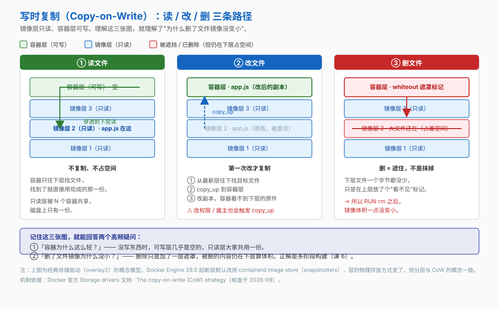
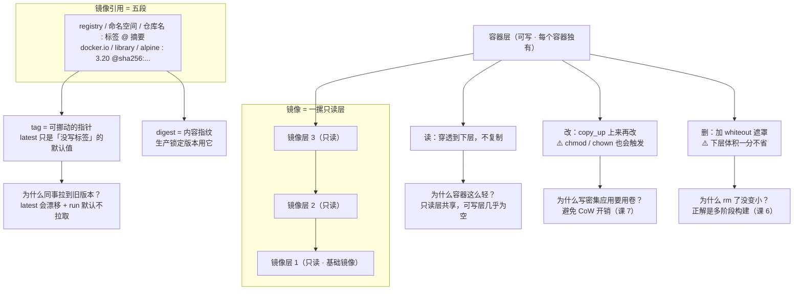

# 第 3 课：镜像的里子：分层与仓库

> 所属阶段：阶段 1《容器与镜像基础》｜ 水平：入门 ｜ 本课知识点：联合文件系统与分层、仓库标签与摘要、镜像体积从哪来
> 故事情节：小杨发现删了文件镜像没变小，小李拉 `latest` 却拿到了旧版本——两个坑都指向镜像的"里子"

## 🎯 本课目标

- 解释镜像的分层结构与写时复制，说清"删了文件镜像为什么没变小"
- 拆开镜像引用的五段命名，说清 tag 与 digest 的区别，不再被 `latest` 坑
- 说出镜像体积的三大来源，掌握 `system df` 体检与 prune 的**安全清理边界**

## 📌 知识点导航

| 知识点 | 关键点 | 状态 |
|--------|--------|------|
| 联合文件系统与分层 | 只读层栈 + 一个容器层 / Copy-on-Write 的读写路径 / 层在镜像之间共享 | ✅ 已完成 |
| 仓库、标签与摘要 | registry / repository / tag 三层命名 / digest 才是内容寻址 / latest 不是"最新"而是"默认" | ✅ 已完成 |
| 镜像体积从哪来 | 基础镜像占大头 / 构建中间产物留在层里删不掉 / 虚悬镜像与 `docker system df` / `image prune` 与 `system prune` 的清理边界 | ✅ 已完成 |

---

## 第一幕：起源与场景引入

课 2 结束时，`order-service` 已经在小杨的机器上跑起来了。他按课 1 的思路，把镜像推到了仓库，让小李直接用。

然后他撞上了两件怪事。

**怪事一：删了文件，镜像一点没小。**

他在 Dockerfile 末尾加了一行，想把构建残留清掉：

```dockerfile
RUN rm -rf /root/.cache
```

重新构建，`docker images` 一看——**体积纹丝不动，甚至还大了一点点**。

**怪事二：小李拉到的还是旧版本。**

小杨推的是 `order-service:latest`，小李也拉的是 `order-service:latest`。但小李跑起来的行为和小杨本地的不一样——他用的是**上周那个版本**。

> 🎬 **场景**：一个"删不掉"，一个"拉不对"。两件事看似无关，其实都指向同一个地方：镜像的内部结构。

---

## 第二幕：认知冲突

> ❓ **问题**：文件都 `rm` 掉了，体积为什么还占着？`latest` 明明是"最新"的意思，为什么拿到的不是最新的？

这两个问题的答案，都藏在"镜像到底是什么做的"里。

课 1 我们说过"镜像是一摞只读层"——但那只是结论。这一课把它拆开：

1. 层是怎么叠起来的？删文件到底发生了什么？（知识点 1）
2. `alpine:3.20` 这 11 个字符，完整的名字到底是什么？（知识点 2）
3. 几十 GB 的磁盘占用，都是谁吃的？（知识点 3）

---

## 第三幕：层层揭示

### 知识点 1：联合文件系统与分层

> 本知识点关键点：只读层栈 + 一个容器层 / Copy-on-Write 的读写路径 / 层在镜像之间共享

#### 一句话定义

Docker 镜像由**一系列只读层**堆叠而成，容器启动时在最上面加**一层薄薄的可写层**；两层之间的交互遵循**写时复制（Copy-on-Write, CoW）**策略——读就直接读下层，要改才复制上来。

#### 直觉建立（类比）

想象一叠**透明描图纸**：每张纸上画一点东西，叠起来从上往下看，就是一幅完整的画。

现在你要改其中的某一笔。你**没法擦**——下面的纸是"只读"的（真擦就影响所有用这叠纸的人了）。你的做法是在最上面**加一张新纸**，把改后的样子画上去。从上往下看，那一笔"变了"；但下面那张纸上的原笔迹还在，一点没动。

> 💡 **类比的边界**：两处不同。① 描图纸是"透明叠加"，下层还能透出来；联合文件系统是**上层优先覆盖**——上层有同名文件，下层的就直接不看了。② "删除"在描图纸上是真的擦掉，在 Docker 里**根本不是删除**，而是在上层放一个"白障（whiteout）"标记把下层文件挡住——**被删的内容一个字节都没少，照样占空间**。这就是怪事一的答案。

#### 核心原理



**哪些指令会产生层**（官方口径）：

| Dockerfile 指令 | 产生新层？ | 原因 |
|---|:---:|---|
| `FROM` | ✅ | 从基础镜像拉出一整摞层 |
| `COPY` / `ADD` | ✅ | 往文件系统里加了文件 |
| `RUN` | ✅ | 改了文件系统 |
| `LABEL` / `ENV` / `CMD` / `ENTRYPOINT` / `EXPOSE` / `WORKDIR` | ❌ | **只改元数据，不动文件系统** |

> ⚠️ 关键一条（官方原话）：**"adding, and removing files will result in a new layer"**——**添加和删除都会产生新层**。所以 `RUN rm -rf /root/.cache` 不是把缓存"抹掉"，而是在上面加了一层说"这些文件看不见了"。缓存的字节仍躺在下面那层里，照样计入镜像总大小。

**三次 CoW 走什么路径**（以 `overlay2` 为例，官方描述）：

| 操作 | 发生什么 | 空间代价 |
|---|---|---|
| **读** | 从最新层往下逐层找，找到就用现成的那份，**不复制** | 0 |
| **改** | ① 自上而下搜索目标文件 → ② `copy_up` 复制到容器层 → ③ 改副本，容器从此看不到下面那一份 | 复制一份文件到可写层 |
| **删** | 在容器层放一个 whiteout 标记挡住下层文件 | 极小，但**下层的空间一分不省** |

三个容易忽略的细节（都是官方点名的）：

- **`copy_up` 只在第一次修改某个文件时发生**，之后就没有这份开销了。
- **改文件权限或属主也会触发 `copy_up`**——也就是说 `chmod` / `chown` 一个大文件，等于把它整份复制到可写层，可能瞬间吃掉几百 MB。
- **写密集型应用别把数据放容器层**。官方明确建议：数据库这类应用要用卷（volume），既避免 CoW 开销，也让数据活过容器——这是课 7 的主题。

**层在镜像之间共享**：`pull` 是**逐层**拉的，本地已有的层不重复下载。两个 Dockerfile 只要基础镜像相同，就共用底下那几层——所以 `docker images` 显示的大小**不能直接相加**。

> ⚠️ **版本陷阱（必须知道）**：Docker Engine **29.0 起，新装默认使用 containerd image store**（用 snapshotter 而非经典存储驱动）。所以网上大量教程让你 `ls /var/lib/docker/overlay2` 看层——**在新安装上这个目录可能根本不存在**。概念（分层 + CoW）依然成立，但物理存放方式变了。

#### 示例演示

```bash
# 1) 看镜像由哪些步骤构成、每步多大
docker image history nginx:alpine
# 预期：逐行 CREATED BY + SIZE；SIZE 为 0B 的行 = 只改元数据，没产生层

# 2) 看每一层的加密 ID（内容寻址，下层在前）
docker image inspect nginx:alpine --format '{{json .RootFS.Layers}}'
# 预期：一个 sha256 数组，如 ["sha256:72e830...", "sha256:07b4a9..."]

# 3) 起个容器，看它的可写层有多薄
docker run -d --name sizetest nginx:alpine
docker ps -s --filter name=sizetest
# 预期：SIZE = 0B (virtual 几十 MB) —— 没写东西时可写层几乎不占空间

# 4) 写 5 个字节进去，再看
docker exec sizetest sh -c 'printf hello > /out.txt'
docker ps -s --filter name=sizetest
# 预期：SIZE = 5B (virtual 几十 MB) —— 只有可写层变大，只读层纹丝不动

docker rm -f sizetest
```

#### 常见误区

1. **"`RUN rm` 能瘦身"** → 不能。删除只是加了一层遮罩，被删内容仍占空间。真正的瘦身手段是**多阶段构建**（课 6）——在构建阶段就把不要的东西排除在最终镜像之外，而不是装进去再删。
2. **"起 10 个容器就是 10 份镜像的体积"** → 不是。只读层共享，每个容器只多一层薄可写层。也正因如此，`docker ps -s` 里的 **virtual size 不能加总**（官方文档明确说了会高估）。

#### 一句话记住

> **镜像是一摞只读层，容器是最上面那层可写层；删文件只是加了一层遮罩，体积一分不省。**

#### 官方文档

- [Storage drivers（Docker 官方）](https://docs.docker.com/engine/storage/drivers/)——分层、CoW 三步、`docker ps -s` 的 size 与 virtual size

---

### 知识点 2：仓库、标签与摘要

> 本知识点关键点：registry / repository / tag 三层命名 / digest 才是内容寻址 / latest 不是"最新"而是"默认"

#### 一句话定义

一个**完整的镜像引用**最多有五段：

```
[registry/][命名空间/]仓库名[:标签][@摘要]
   ↓          ↓          ↓      ↓      ↓
docker.io/  library/  alpine: 3.20  @sha256:xxxx
```

其中只有**仓库名**是必需的，其余都有默认值——而坑，就埋在这些默认值里。

#### 直觉建立（类比）

把镜像想成一本书：

- **tag（标签）** 像贴在书脊上的便签，写着"最新版"。这张便签**可以撕下来贴到任何一本书上**——它指向哪本书，完全由贴的人决定。
- **digest（摘要）** 像这本书的**校验指纹**：内容只要变了一个字节，指纹就完全不同；内容一样，指纹就一样。它和书**绑定**，和人的意愿无关。

> 💡 **类比的边界**：严格说 digest 不是"某本书的哈希"，而是**镜像清单（manifest）的哈希**——它描述的是"这个镜像由哪几层、什么配置构成"。另外，同一个 digest 在不同 registry 上会对应不同的完整引用（因为 registry 那一段不在哈希范围内），所以 `alpine@sha256:xxx` 从 A 仓库推到 B 仓库后，digest 相同但完整名字不同。

#### 核心原理

**三段命名空间**：

```bash
docker pull alpine:3.20
```

你打了 11 个字符，但输出末尾会显示它展开后的完整名字：

```
3.20: Pulling from library/alpine
...
Digest: sha256:...
Status: Downloaded newer image for alpine:3.20
docker.io/library/alpine:3.20        ← 完整限定名
```

| 段 | 你写的 | 展开后 | 说明 |
|---|---|---|---|
| registry | （省略） | `docker.io` | 默认 Docker Hub；私有仓库必须写全，如 `registry.example.com:5000/` |
| 命名空间 | （省略） | `library` | Docker Hub 上**官方镜像**所在的命名空间；第三方镜像是 `docker.io/<用户名>/<仓库名>` |
| 仓库名 | `alpine` | `alpine` | 唯一必需的一段 |
| 标签 | `3.20` | `3.20` | 省略时默认 `latest` |

**tag 是指针，digest 是内容**：

| | tag | digest |
|---|---|---|
| 本质 | 一个**可变的、人可读的指针** | 内容的 **sha256 哈希** |
| 能不能改指向 | 能。`docker tag` 可以把 `latest` 挪到任何镜像上 | 不能。内容一变，digest 必变 |
| 适合干什么 | 给人看、给流水线读 | **给机器校验、给生产锁定版本** |

**`latest` 到底是什么**：它是**"你没写标签时的默认值"**，仅此而已。它不保证是最新构建的，也不保证是最新推送的。

**怪事二的真相**：`docker run` 的拉镜像策略默认是 `--pull=missing`（课 2 的参数地图里出现过）——**本地已有同名 tag 就不去问仓库**。小李本地有上周拉的 `latest`，所以他跑的是上周那个。

| 场景 | 会不会拉新 |
|---|:---:|
| `docker run img:latest`（本地已有该 tag） | ❌ 直接用本地的 |
| `docker pull img:latest`（显式执行） | ✅ 去仓库比对 digest 并更新 |
| `docker run --pull=always img:latest` | ✅ 每次都拉 |

#### 示例演示

```bash
# 1) 看完整限定名是怎么展开的
docker pull alpine:3.20
# 预期输出末尾：docker.io/library/alpine:3.20

# 2) 同时看标签与摘要
docker image inspect alpine:3.20 --format '标签={{.RepoTags}}  摘要={{.RepoDigests}}'
# 预期：标签=[alpine:3.20]  摘要=[alpine@sha256:...]

# 3) 用摘要引用 —— 内容与版本都锁死，谁拉都一样
docker pull alpine@sha256:<上一步看到的 digest>
# 预期：Status: Image is up to date（或 Downloaded）

# 4) 亲手制造一次「latest 漂移」——理解它为什么不可靠
docker tag alpine:3.20 my-alpine:latest      # latest 现在指向 3.20
docker image inspect my-alpine:latest --format '{{.Id}}'
docker tag alpine:3.19 my-alpine:latest      # 同一句命令，latest 挪走了
docker image inspect my-alpine:latest --format '{{.Id}}'
# 预期：两次 ID 不同 —— 同一个 tag，指向了两个不同的镜像
```

#### 常见误区

1. **"`latest` 就是最新版本"** → 它是"省略 tag 时的默认值"。生产上依赖 `latest` 部署，等于把"跑哪个版本"交给运气。
2. **"打了 tag 就锁定了内容"** → 没有。tag 可以被反复挪走（上面的演示 4 就是证据）。要锁定内容，用 **digest**。
3. **"镜像名写成 `alpine` 和 `docker.io/library/alpine` 是两个镜像"** → 是同一个，前者是简写。但**在配置文件里建议写全**，避免不同 registry 之间产生歧义。

#### 一句话记住

> **tag 是可以挪动的指针，digest 是内容的指纹；生产锁定版本用 digest，`latest` 只是"没写标签"的默认值。**

#### 官方文档

- [docker tag（Docker 官方）](https://docs.docker.com/reference/cli/docker/image/tag/)——tag 与完整引用格式
- [docker run --pull（Docker 官方）](https://docs.docker.com/reference/cli/docker/container/run/#pull)——`missing` / `always` / `never` 三种拉镜像策略

---

### 知识点 3：镜像体积从哪来

> 本知识点关键点：基础镜像占大头 / 构建中间产物留在层里删不掉 / 虚悬镜像与 `docker system df` / `image prune` 与 `system prune` 的清理边界

#### 一句话定义

镜像体积主要来自三部分：**基础镜像**、**构建过程中装进去又删不掉的东西**、以及**失去标签的虚悬镜像**；前两者要改 Dockerfile（课 6），第三者可以安全清理。

#### 直觉建立（类比）

搬家时你在纸箱底部塞了一堆旧报纸当缓冲。到新家后你把报纸拿出来扔了——但**在整趟搬运过程中，那些报纸一直占着车的空间**。

镜像里的构建依赖、下载的安装包、编译中间产物，就是那些报纸：**你后来 `rm` 掉了，可它们在"搬运"（构建与分发）的全程都占着体积。**

> 💡 **类比的边界**：报纸扔了就真的不占地方了，而镜像里 `rm` 之后**仍然占**。差别就是知识点 1 讲的——删除只是加了一层遮罩。所以这个类比只在"白占空间"这层意思上成立，机制上容器更糟。

#### 核心原理

**三大来源**：

| 来源 | 典型例子 | 怎么治 |
|---|---|---|
| ① 基础镜像 | `ubuntu:22.04` 约几十 MB 起，`python:3.11` 约几百 MB 起 | 换 slim / alpine / distroless（课 6 权衡） |
| ② 构建中间产物 | 编译器、dev 依赖包、`apt` 缓存、`pip` 缓存 | **多阶段构建**，只把运行时产物拷进最终镜像（课 6） |
| ③ 虚悬镜像 | `<none>:<none>` —— 重新构建或重新打 tag 后，旧镜像失去了标签 | `docker image prune` 安全清理 |

**怎么看体积**（两个命令，用途不同）：

| 命令 | 看的是什么 |
|---|---|
| `docker system df` | **全局体检**：Images / Containers / Local Volumes / Build Cache 各占多少，能回收多少 |
| `docker ps -s` | **单个容器**：`size` = 可写层大小，`virtual size` = 只读镜像数据 + 可写层 |

> `virtual size` **不能加总**：两个容器用同一个镜像时共享 100% 只读数据，加总会严重高估。磁盘上真实占用 ≈ **所有容器 `size` 之和 + 一份镜像大小**。

**清理命令的边界**（⚠️ 这张表比什么都重要，生产上用错会丢数据）：

| 命令 | 删什么 | 安不安全 |
|---|---|---|
| `docker image prune` | **只删虚悬镜像**（`<none>:<none>`） | ✅ 相对安全 |
| `docker image prune -a` | 上面 + **所有没有被任何容器引用的镜像** | ⚠️ 你缓存的常用镜像会被清掉 |
| `docker system prune` | 停止的容器 + 无用的网络 + 虚悬镜像 + 构建缓存 | ✅ **默认不删卷** |
| `docker system prune --volumes` | 上面 + **匿名卷** | 🔴 **会丢数据** |
| `docker builder prune` | 只清 BuildKit 构建缓存 | ✅ 安全 |

官方对"为什么不默认删卷"有明确解释：

> *"By default, volumes aren't removed to prevent important data from being deleted if there is currently no container using the volume."*

也就是说——**卷可能存着数据库数据，即使现在没有容器在用它也不能删**。这正是 `prune` 默认手下留情的原因。

> ⚠️ 补充两点：`--volumes` 删的是**匿名卷**（没起名字的那种），具名卷理论上仍保留，但**不要拿这个当保险**。另外 `prune` 会先弹确认框，**但不会列出将要删除的具体内容**——所以动手前先用 `docker system df` 和 `docker image ls -f dangling=true` 自己看清楚。

#### 示例演示

```bash
# 1) 全局体检
docker system df
# 预期：TYPE / TOTAL / ACTIVE / SIZE / RECLAIMABLE 五列，
#       分 Images、Containers、Local Volumes、Build Cache 四行

# 2) 按层大小排序，找出「谁最占地方」
docker image history nginx:alpine --format 'table {{.Size}}\t{{.CreatedBy}}'
# 预期：逐层列出大小与产生它的指令 —— 一眼看出大头在哪一层

# 3) 看虚悬镜像（就是那些 <none>:<none>）
docker image ls -f dangling=true
# 预期：REPOSITORY 与 TAG 都是 <none> 的行，通常来自重新构建 / 重新打 tag

# 4) 安全清理（先干看，再动手）
docker image prune            # 只清 <none>:<none>，相对安全
docker system prune           # 再加停止的容器、无用网络、构建缓存；⚠️ 默认不删卷
# 预期：输出 Deleted ... 与 Total reclaimed space

# 🔴 下面这条别在生产上随手敲：
# docker system prune --volumes    # 会连匿名卷一起删，数据可能就没了
```

#### 常见误区

1. **"`docker system prune` 能清掉所有垃圾"** → 它**不动**具名卷、不动运行中的容器、不动正在使用的镜像。磁盘还是满的话，八成是日志撑的（课 11）或者镜像本身就大（课 6 解决）。
2. **"`prune` 会告诉我删了什么"** → 它只弹一个"是否继续"的确认，**不列清单**。所以永远是**先看后删**：`docker system df` → `docker image ls -f dangling=true` → 再 prune。
3. **"删了容器就释放了镜像的空间"** → 不一定。镜像还在本地缓存里，要 `docker rmi` 或 `docker image prune` 才释放。

#### 一句话记住

> **体积三来源：基础镜像、删不掉的构建产物、虚悬镜像；清理看边界，`prune` 默认不删卷是为了保住数据。**

#### 官方文档

- [docker image prune（Docker 官方）](https://docs.docker.com/reference/cli/docker/image/prune/)——dangling 与 `-a` 的语义
- [docker system prune（Docker 官方）](https://docs.docker.com/reference/cli/docker/system/prune/)——默认清理范围与 `--volumes` 的官方说明

---

## 第四幕：实操验证

回到小杨的两个怪事，现在一条条破案。

> ⚠️ 本讲义的命令与预期输出为**纸面预期**（写作时本机 Docker 守护进程未运行）。具体数字与你实际运行会不同。

### 破案一：为什么 `RUN rm` 没让镜像变小

```bash
# 找一个本地镜像，看它的层
docker image history nginx:alpine --format 'table {{.Size}}\t{{.CreatedBy}}'
# 预期：逐层列出大小；留意 SIZE 为 0B 的行（纯元数据，不产生层）

# 数一数到底有几层
docker image inspect nginx:alpine --format '{{json .RootFS.Layers}}' | tr ',' '\n' | wc -l
# 预期：一个数字 —— 这就是这个镜像的层数
```

> ✅ **结论**：`RUN rm -rf /root/.cache` 不是"抹掉"，而是加了一层 whiteout。缓存的字节还在下面那层里。**真正有效的解法是多阶段构建——让这些文件根本不进最终镜像**（课 6）。

### 破案二：为什么小李拉到旧版本

```bash
# 复现：本地有 latest 时，docker run 不会去问仓库
docker tag alpine:3.20 mydemo:latest
docker run --rm mydemo:latest cat /etc/os-release | head -2
# 预期：打印 3.20 的信息

# 把 latest 挪到另一个版本上（模拟「仓库里的 latest 已经更新了」）
# （3.19 只是示例；换成任意两个你本地有的不同版本都行，重点是看 ID 变了）
docker tag alpine:3.19 mydemo:latest
docker run --rm mydemo:latest cat /etc/os-release | head -2
# 预期：这次打印的是 3.19 —— 命令一字未改，跑的东西变了
```

> ✅ **结论**：`latest` 是**可以被挪动的指针**，而 `docker run` 默认 `--pull=missing`（本地有就不拉）。两者叠加，就是"他跑的是旧版本"的完整解释。
>
> **三条正解**（按可靠性排序）：
> 1. 生产部署用 **digest** 锁定：`image@sha256:...`
> 2. 用**不可变的语义化版本 tag**：`v1.4.2`，而不是 `latest`
> 3. 需要强制拉最新时显式 `docker pull`，或加 `--pull=always`

### 破案三：磁盘被吃掉了，安全回收

```bash
docker system df                     # 先看全局：谁占了多少
docker image ls -f dangling=true     # 再看虚悬镜像有哪些
docker image prune                   # 只清虚悬镜像（安全）
docker system df                     # 复查：RECLAIMABLE 应该变小了
```

> ✅ **结论**：清理的正确顺序永远是 **体检 → 看清单 → 再删**。而 `docker system prune --volumes` 是唯一会动到卷数据的那一档——**生产上别顺手敲**。

---

## 第五幕：体系收束

> 📍 **全局定位**：**阶段 1 到这里闭环了。** 三课分别回答了三个问题：
>
> | 课 | 回答的问题 | 你现在能 |
> |---|---|---|
> | 课 1 | 为什么需要 Docker | 说清容器与虚拟机的分界、Docker 的生态位置 |
> | 课 2 | 容器怎么跑起来 | 跑容器、管生命周期、读懂退出码 |
> | 课 3 | 镜像的里子是什么 | 解释分层与 CoW、正确使用 tag/digest、安全清理磁盘 |
>
> 你现在手上有一套完整的"用别人做好的镜像"的能力。但**镜像全是别人做的**——怎么自己造一个，是阶段 2 的事。

> 🔗 **下一步**：阶段 2《镜像工程》课 4《Dockerfile入门》——开始自己写 Dockerfile。课 3 埋的两个伏笔会在那里兑现：
> - "删除不减体积" → 课 6 的**多阶段构建**
> - "基础镜像占大头" → 课 6 的**基础镜像选型与瘦身**

---

## 🐞 常见误区

1. **"`RUN rm` 之后镜像就瘦了"** → 不会。删除 = 加一层 whiteout，被删内容仍在下层算体积。正解是多阶段构建（课 6）。

2. **"`latest` 就是最新的那个"** → 它是"省略 tag 时的默认值"，而且是**可以随时被挪动的指针**。加上 `docker run` 默认不拉取，就很容易出现"明明推了新版，别人跑的还是旧的"。生产用 digest 或版本 tag。

3. **"`docker system prune` 清得很干净，随便敲"** → 默认档确实不删卷（官方刻意设计），但 `--volumes` 那档会删匿名卷。而且 prune **从不列出将要删除的清单** —— 先 `system df` 体检再动手。

4. **"容器占空间 = `docker ps -s` 里的数字"** → 那个 `virtual size` 包含了**与其他容器共享的只读层**，加总会严重高估。真实占用 ≈ 各容器 `size` 之和 + 一份镜像大小，且还不含日志（课 11）。

---

## 一图总结



---

## 📋 命令速查卡

| 命令 | 作用 | 本课出现在哪 |
|------|------|------------|
| `docker image history <镜像>` | 逐层看构建历史与各层大小（**`0B` = 纯元数据，不产生层**） | 知识点 1 / 破案一 |
| `docker image inspect --format '{{json .RootFS.Layers}}' <镜像>` | 看每一层的内容寻址 ID | 知识点 1 |
| `docker ps -s` | 看容器可写层大小（`size`）与含镜像的虚体积（`virtual size`，**不可加总**） | 知识点 1 / 知识点 3 |
| `docker image inspect --format '{{.RepoTags}} {{.RepoDigests}}' <镜像>` | 同时看标签与摘要 | 知识点 2 |
| `docker pull <镜像>@sha256:<digest>` | 按摘要拉取，内容与版本锁死 | 知识点 2 |
| `docker tag <源> <目标>` | 给镜像加一个标签（也能把 `latest` 挪走） | 知识点 2 |
| `docker system df` | 磁盘体检：镜像 / 容器 / 卷 / 构建缓存分项 | 知识点 3 / 破案三 |
| `docker image ls -f dangling=true` | 列出虚悬镜像（`<none>:<none>`） | 知识点 3 |
| `docker image prune` | 只清虚悬镜像（相对安全） | 知识点 3 |
| `docker system prune` | + 停止的容器、无用网络、构建缓存（**默认不删卷**） | 知识点 3 |
| `docker system prune --volumes` | 🔴 再 + 匿名卷，**生产上别顺手敲** | 知识点 3 |

---

## 课后小测

**Q1**：小杨在 Dockerfile 里加了 `RUN rm -rf /root/.cache`，重新构建后发现镜像体积没变小。根本原因是？

- A. `rm` 命令写错了，应该用 `rm -rf /*`
- B. 删除操作会在上层生成 whiteout 遮罩，被删内容仍在下层，体积照算
- C. Docker 有 bug，`RUN rm` 不生效
- D. 需要先执行 `docker system prune` 才能释放

<details><summary>答案与解析</summary>

**答案：B**。官方口径是"adding, and removing files will result in a new layer"——删除只是**新增一层**来遮住下层文件，那些字节一个都没少。A 不仅错而且危险；C 不成立；D 无关（prune 清理的是虚悬镜像，镜像内部的层它管不着）。**正解是多阶段构建：让这些文件根本不进最终镜像**（课 6）。

</details>

**Q2**：关于 `latest` 与 digest，下列说法正确的是？

- A. `latest` 一定指向最新推送的那个镜像
- B. digest 是内容寻址的哈希，内容一变它就变，谁拉都一样
- C. 打上 tag 之后，该 tag 指向的内容就固定了
- D. 用 `latest` 部署是生产最佳实践

<details><summary>答案与解析</summary>

**答案：B**。A 错——`latest` 只是"省略标签时的默认值"，可以被 `docker tag` 任意挪动；C 错——tag 是可变指针，同一句 `docker tag` 能把 `latest` 从 3.20 挪到 3.19（本课演示 4 亲手验证过）；D 错——生产应该用 digest 或不可变的版本 tag（如 `v1.4.2`）。

</details>

**Q3**：你想清理磁盘，又绝不能丢数据。下列哪条最安全？

- A. `docker system prune --volumes`
- B. `docker image prune`
- C. `docker image prune -a`
- D. `docker system prune -a --volumes`

<details><summary>答案与解析</summary>

**答案：B**。`docker image prune` **只删虚悬镜像**（`<none>:<none>`），不碰卷、不碰有标签的镜像。A 和 D 都带 `--volumes`，会删匿名卷 —— 官方刻意让 `system prune` 默认不删卷，就是为了防止误删数据。C 的 `-a` 会清掉所有无容器引用的镜像，你本地缓存的常用镜像也会被清掉，下次要重新拉。

</details>

---

## 🎉 阶段 1 完成

阶段 1《容器与镜像基础》的三课到此收官（9 / 45 知识点）。

你已经能：

- 说清容器与虚拟机的分界、Docker 在生态里的位置
- 跑起容器、管理生命周期、读懂退出码
- 解释镜像分层与写时复制，正确使用 tag / digest，安全清理磁盘

**建议先做一件事再往下走**：把手头的镜像和容器按本课第四幕"破案三"的流程过一遍——`docker system df` 看看你的 Docker 到底吃了多少磁盘。

---

## 🚀 下一批接力提示词

> 学完阶段 1 后，**复制下面这段文字发给 AI**，即可进入阶段 2（无需重新描述上下文）：

```
继续学 Docker。我的学习档案在 docker/00-学习档案.md，
刚学完阶段 1《容器与镜像基础》全部三课（课 1 为什么需要Docker / 课 2 跑起来第一个容器 / 课 3 镜像的里子：分层与仓库），共 9 个知识点，
请按大纲进入阶段 2《镜像工程》，从课 4《Dockerfile入门》开始讲解。
```

## 🧭 课程导航

⬅️ **上一课**：[课 2：跑起来第一个容器](lesson-02-跑起来第一个容器.md)

➡️ **下一课**：[课 4：Dockerfile入门](../../2-镜像工程/lessons/lesson-04-Dockerfile入门.md)（阶段 2 第 1 课）

📚 **返回目录**：[课程目录](../../../02-课程目录.md)
