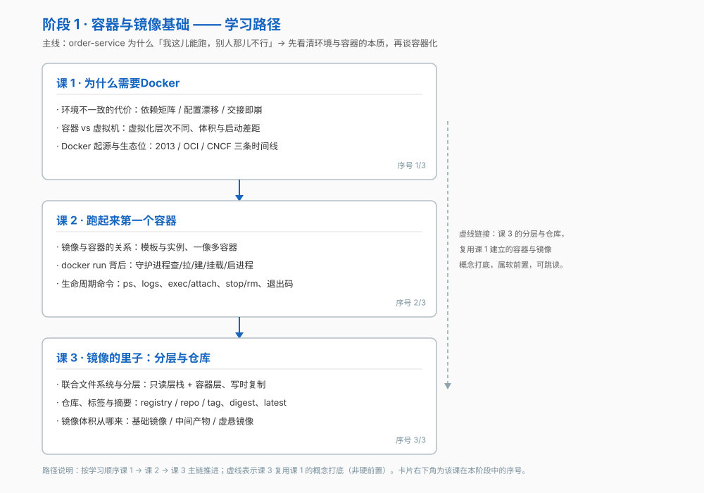

# 阶段 1：容器与镜像基础

> 所属课程：Docker 系统学习 ｜ 故事章节：我这儿能跑 ｜ 课程起点：[学习路径总览](../../01-学习路径总览.md)

## 🎯 本阶段目标

- 说清容器解决的是什么问题、它和虚拟机的本质区别在哪
- 能独立跑起一个容器，并解释 `docker run` 每一步做了什么
- 能解释镜像分层机制，并回答"为什么镜像能一次构建到处运行"

## 📍 学习重点

- 环境不一致的真实代价：依赖矩阵、配置漂移、"只在我机器上能跑"的复现成本
- 容器与虚拟机虚拟化的**层次**不同（硬件层 vs 操作系统层），这决定了体积、启动速度与隔离强度三方面差距
- 镜像与容器的关系是"模板与实例"；分层存储带来共享与复用
- tag 不等于内容，digest 才是内容寻址

## ✅ 必须掌握的知识点

| 知识点 | 所属课 | 学完应能 |
|--------|--------|----------|
| 环境不一致的代价 | 课 1 · 为什么需要Docker | 列举四类具体代价，说清为什么"文档 + 部署脚本"挡不住 |
| 容器与虚拟机的区别 | 课 1 · 为什么需要Docker | 说清虚拟化层次差异，以及由此带来的体积 / 启动 / 隔离三方面后果 |
| Docker 的起源与生态位 | 课 1 · 为什么需要Docker | 讲出 2013 起源、libcontainer→runc→2015-06 捐 OCI、2017 containerd 捐 CNCF 三条时间线 |
| 镜像与容器的关系 | 课 2 · 跑起来第一个容器 | 用"类与对象"解释，并说清一个镜像能起多个容器 |
| docker run 背后发生了什么 | 课 2 · 跑起来第一个容器 | 叙述完整链路：客户端→守护进程→查本地→拉取→创建→挂载文件系统→接入网络→启动进程 |
| 容器生命周期命令 | 课 2 · 跑起来第一个容器 | 区分 ps / ps -a、exec / attach、stop / rm，并看懂退出码 |
| 联合文件系统与分层 | 课 3 · 镜像的里子：分层与仓库 | 解释只读层栈 + 容器层，以及写时复制的读写路径 |
| 仓库、标签与摘要 | 课 3 · 镜像的里子：分层与仓库 | 拆开 registry / repository / tag 三层命名，说清 latest 是"默认"不是"最新" |
| 镜像体积从哪来 | 课 3 · 镜像的里子：分层与仓库 | 指出基础镜像、构建中间产物、虚悬镜像三类来源 |

## 🛠 课前环境准备

> 入门读者的上手前置材料，**不计入知识点，也不单独开一课**。本阶段各课的第四幕都会用到这套环境。

### 三平台安装

| 平台 | 推荐方式 | 说明 |
|------|----------|------|
| macOS | Docker Desktop for Mac | 官方安装包；Apple Silicon 与 Intel 分别下载对应版本 |
| Windows | Docker Desktop for Windows + WSL2 后端 | WSL2 是官方推荐后端，不要用 Hyper-V 后端 |
| Linux | 官方 apt/yum 源安装 Docker Engine（不用发行版自带的 docker.io 包） | 发行版仓库里的包往往版本滞后 |

### 装完先验证

```bash
docker version          # 预期：Client 与 Server 两段都有输出；只看到 Client 说明守护进程没起来
docker run hello-world  # 预期：拉取镜像 → 打印 "Hello from Docker!" → 容器自动退出
```

### 版本基线

- 本课程命令行以 **Docker Engine 29.x** 为准（当前最新 29.8.0，2026-09-03）
- Compose 一律用 **V2** 写法 `docker compose`（无连字符）；V1 的 `docker-compose` 自 2023-07 起停更、不再随 Docker Desktop 提供

## 🗺️ 本阶段路径图



## 本阶段产出

- [x] `lessons/lesson-01-为什么需要Docker.md`
- [x] `lessons/lesson-02-跑起来第一个容器.md`
- [x] `lessons/lesson-03-镜像的里子：分层与仓库.md`
