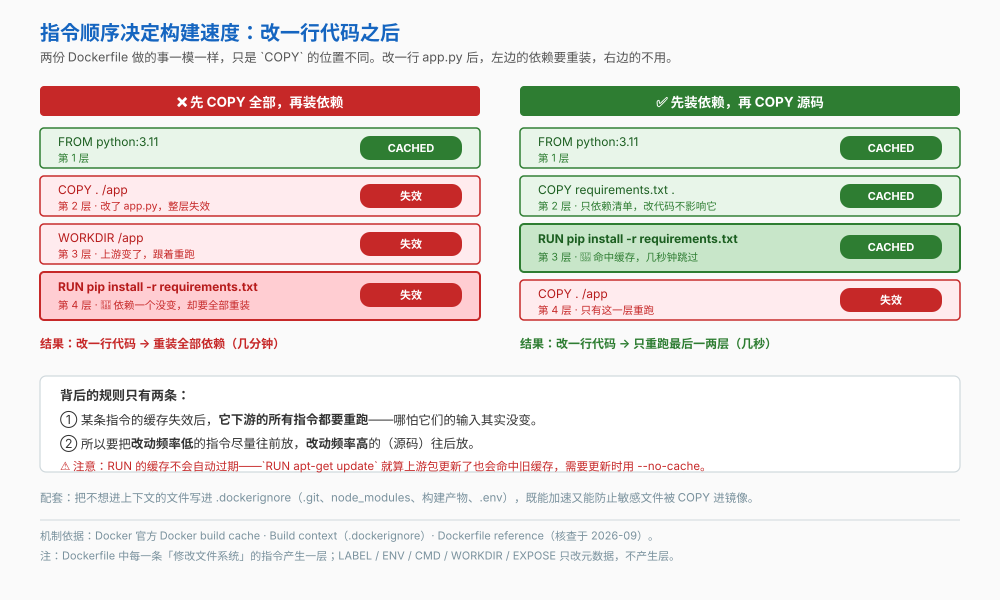
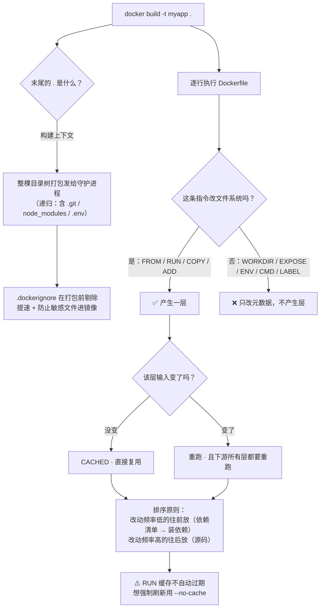

# 第 4 课：Dockerfile入门

> 所属阶段：阶段 2《镜像工程》｜ 水平：入门 ｜ 本课知识点：Dockerfile 语法骨架、构建上下文与 .dockerignore、构建缓存与指令顺序
> 故事情节：order-service 被写进 Dockerfile，但每次改一行代码都要重装一遍全部依赖

## 🎯 本课目标

- 写出一个能跑的最小 Dockerfile，并说清 `docker build` 末尾那个 `.` 到底是什么
- 用 `.dockerignore` 管住构建上下文，既不拖慢构建也不把敏感文件烤进镜像
- 按缓存失效规则排列指令，把"改一行代码重装全部依赖"变成"只重跑最后两层"

## 📌 知识点导航

| 知识点 | 关键点 | 状态 |
|--------|--------|------|
| Dockerfile 语法骨架 | FROM / RUN / COPY / WORKDIR / EXPOSE 各自职责 / 每条指令生成一层 / **`docker build` 与常用参数**：`-t` 打标签、`-f` 指定 Dockerfile 路径、`--build-arg` 传 ARG、`--target` 停在多阶段的某一阶段、末尾那个 `.`（构建上下文）到底指什么 | ✅ 已完成 |
| 构建上下文与 .dockerignore | 上下文整体打包发给守护进程 / 误把整个家目录传进去的后果 / .dockerignore 的匹配规则 | ✅ 已完成 |
| 构建缓存与指令顺序 | 逐层缓存与失效级联 / 先拷依赖清单再拷源码 / --no-cache 与缓存失效排查 | ✅ 已完成 |

---

## 第一幕：起源与场景引入

阶段 1 结束时，小杨已经能把别人做好的镜像跑起来了。但他自己的 `order-service` 还是个"别人跑不起来"的普通项目——**他得自己做一个镜像**。

于是他照着网上的例子，写出了人生第一个 Dockerfile：

```dockerfile
FROM python:3.11
COPY . /app
WORKDIR /app
RUN pip install -r requirements.txt
EXPOSE 8000
CMD ["python", "app.py"]
```

构建成功了，服务也跑起来了。但用了两天，他发现了两件难受的事：

**其一**：改一行 `app.py` 重新构建，`pip install` 又从头跑了一遍——**几分钟**。依赖一个字都没改。

**其二**：构建输出里有一行特别刺眼：

```
=> [internal] load build context
=> => transferring context: 1.2GB 8.4s done
```

**1.2GB**。他这个项目源码加起来不到 2MB。

> 🎬 **场景**：一个"慢"，一个"胖"。两件事都不是代码的问题，而是 Dockerfile 的写法问题。

---

## 第二幕：认知冲突

> ❓ **问题**：依赖清单根本没变，为什么要重装？我这个项目只有 2MB，那 1.2GB 又是从哪来的？

这两个问题，分别指向 Dockerfile 的两个"里子"：

1. **构建上下文**——你以为 `COPY . /app` 只传了源码，其实它把那个目录下的**一切**都交给了守护进程（知识点 2）
2. **构建缓存**——Docker 是逐层缓存的，而**指令顺序**决定了改一行代码会让多少层失效（知识点 3）

但在讲这两个之前，得先把 Dockerfile 本身说清楚。

---

## 第三幕：层层揭示

### 知识点 1：Dockerfile 语法骨架

> 本知识点关键点：FROM / RUN / COPY / WORKDIR / EXPOSE 各自职责 / 每条指令生成一层 / `docker build` 与常用参数

#### 一句话定义

**Dockerfile** 是一个纯文本文件，逐行写下"怎么把这个应用装进镜像"的指令；`docker build` 从上到下依次执行，**每条修改文件系统的指令产生一层**（课 3 的分层概念在这里落地）。

#### 直觉建立（类比）

Dockerfile 是**菜谱**，镜像是**做好的菜**，容器是**正在被吃的那盘**。

菜谱写"先热油、再下料、最后调味"，顺序是有意义的——你不会先调味再热油。Dockerfile 也一样，指令顺序直接影响产物和构建速度。

> 💡 **类比的边界**：两处不同。① 菜谱允许酌情（"盐少许"你可以按口味调），Dockerfile **不允许**——每条指令都必须精确，没有"酌情"空间。② 菜谱没有缓存：第二次做同一道菜，你不会跳过前三步；而 **Docker 会跳过**（这是知识点 3 的核心收益，也是本课最大的坑）。

#### 核心原理

**五条最核心的指令**（其余指令会在课 5、6 陆续登场）：

| 指令 | 干什么 | 产生层？ | 要点 |
|---|---|:---:|---|
| `FROM` | 指定基础镜像 | ✅ | **必须是第一条**（前面只允许注释、解析器指令、全局 `ARG`）；可出现多次（多阶段构建，课 6） |
| `RUN` | 在构建时执行一条命令 | ✅ | `RUN apt-get update && apt-get install -y curl` 这样装东西 |
| `COPY` | 把文件从构建上下文复制进镜像 | ✅ | 只做"复制"这一件事，语义清晰 |
| `WORKDIR` | 设置后续指令的工作目录 | ❌ | **目录不存在就自动创建**（官方原话）；相对路径基于上一个 `WORKDIR` |
| `EXPOSE` | 声明容器监听哪个端口 | ❌ | ⚠️ **它不真正发布端口**，只是写给"用镜像的人"看的文档 |

三条最容易踩的细节：

- **`EXPOSE` 不发布端口**。官方原话：`EXPOSE` "doesn't actually publish the port"，它只是构建者与运行者之间的一种文档约定。真正发布要靠 `docker run -p`（课 8）。
- **`COPY` 的目标路径尾斜杠有意义**：`COPY test.txt /abs` 创建的是**文件** `/abs`；`COPY test.txt /abs/` 创建的是 `/abs/test.txt`。差一个斜杠，结果完全不同。
- **`COPY` 的源是目录时，只复制目录里的内容，不复制目录本身**。

顺带把 `ADD` 也说清（`ADD / COPY` 的取舍是经典问题）：

| | `COPY` | `ADD` |
|---|---|---|
| 复制本地文件 | ✅ | ✅ |
| 自动解压本地 tar | ❌ | ✅ |
| 从 URL 下载 | ❌ | ✅ |
| 克隆 Git 仓库 | ❌ | ✅ |
| 推荐度 | **默认用它** | 只在确需上面三项时才用 |

> 原则是**用最简单的那个能满足需求的指令**。`ADD` 的"自动解压 + 远程下载"很方便，但也让行为变得不可预测（比如你只想复制一个文件，它却因为后缀名识别成 tar 给解压了）。

**`docker build` 与它的常用参数**：

```bash
docker build -t order-service:v1 .
#             │  │                 └─ ① 末尾的 "." 是【构建上下文】，不是 Dockerfile 的路径
#             │  └─────────────────── ② -t：给镜像打标签（不写则变成 <none>:<none> 虚悬镜像）
```

| 参数 | 作用 | 什么时候用 |
|---|---|---|
| `-t <名:标签>` | 给构建出的镜像打标签 | **几乎每次都要写**，否则就是虚悬镜像 |
| `-f <路径>` | Dockerfile 不叫 `Dockerfile` 或不在上下文根目录时指定它 | 一个项目多份 Dockerfile（如 `Dockerfile.dev` / `Dockerfile.prod`） |
| `--build-arg K=V` | 给 Dockerfile 里的 `ARG` 传值 | 构建期变量（课 5 展开） |
| `--target <阶段名>` | 只构建到多阶段中的某一阶段 | 调试构建失败的利器（课 6 展开） |
| `--no-cache` | 忽略全部缓存，从头构建 | 怀疑缓存脏了、或要强制拉最新依赖 |

> 🔑 **本课第一号易错点**：`docker build -t myapp .` 末尾那个 `.` 指的是**构建上下文的路径**，不是 Dockerfile 的位置。Dockerfile 的位置由 `-f` 指定，默认在上下文根目录找名为 `Dockerfile` 的文件。
>
> 🙋 **一个高频追问**：「Dockerfile 和 `docker-compose.yml` 是一回事吗？」——不是。Dockerfile 描述**单个镜像怎么造**，compose 描述**多个容器怎么一起跑**。两者经常一起用，但职责完全不同（课 9 展开）。

#### 示例演示

```bash
# 建一个最小项目
# （alpine:3.20 只是示例；若该 tag 已下线，换成你本地 pull 得到的任意 alpine 版本即可）
mkdir -p hello-docker && cd hello-docker
echo 'print("order-service 启动了")' > app.py

cat > Dockerfile <<'EOF'
FROM alpine:3.20
WORKDIR /app
COPY app.py .
RUN echo "构建时执行" > /build-stamp
CMD ["sh", "-c", "cat /app/app.py"]
EOF

# 构建（注意末尾的 . —— 它表示"用当前目录作为上下文"）
docker build -t hello-docker:v1 .
# 预期：逐行执行指令，最后输出镜像 ID

# 验证 1：直接跑，看 CMD 生效
docker run --rm hello-docker:v1
# 预期输出：print("order-service 启动了")

# 验证 2：工作目录真的被创建了，文件真的复制进去了
docker run --rm hello-docker:v1 sh -c 'pwd && ls -l && cat /build-stamp'
# 预期：/app · app.py · 构建时执行
```

#### 常见误区

1. **"末尾的 `.` 是 Dockerfile 的路径"** → 不是，它是**构建上下文**。所以 `docker build -f docker/Dockerfile .` 是合法的：Dockerfile 在 `docker/` 下，上下文仍是当前目录。
2. **"写了 `EXPOSE 8000` 就能从宿主机访问 8000 端口"** → 不能。`EXPOSE` 只是文档，发布端口要 `docker run -p`（课 8）。

#### 一句话记住

> **Dockerfile 是逐行执行的指令清单，每条改文件系统的指令产生一层；`docker build` 末尾那个 `.` 是构建上下文，不是 Dockerfile 路径。**

#### 官方文档

- [Dockerfile reference（Docker 官方）](https://docs.docker.com/reference/dockerfile/)——全部指令、`WORKDIR` 自动创建、`EXPOSE` 不发布端口、`COPY` 尾斜杠语义
- [docker buildx build / docker build 参考](https://docs.docker.com/reference/cli/docker/buildx/build/)——`-t` / `-f` / `--build-arg` / `--target` / `--no-cache`

---

### 知识点 2：构建上下文与 .dockerignore

> 本知识点关键点：上下文整体打包发给守护进程 / 误把整个家目录传进去的后果 / .dockerignore 的匹配规则

#### 一句话定义

**构建上下文（build context）** 是你在 `docker build` 末尾指定的那个路径——**它整棵目录树会被打包交给守护进程**，Dockerfile 里的 `COPY` / `ADD` 只能引用上下文内的文件。`.dockerignore` 则是在打包前把不需要的文件剔除掉的清单。

#### 直觉建立（类比）

你要参加一场只允许带一本参考书的考试，但你的做法是**把整个书房搬到了考场门口**，然后再从里面挑出那一本。

那 1.2GB 就是你的书房——`node_modules`、`.git` 的全部历史、昨晚下载的电影、`Downloads/`……

> 💡 **类比的边界**：搬书房最多累一趟；而构建上下文是**每次构建都要搬一遍**。更糟的是，你搬过去的东西里如果有 `.env`（数据库密码），而你的 Dockerfile 里有 `COPY . /app`——那它就被**永久烤进镜像层**了，删掉本地文件也没用（课 12 会讲怎么防）。

#### 核心原理

**上下文是递归的**（官方口径）：指定本地目录或 tar 包时，**所有子目录都会被包含**；指定 Git 仓库时，仓库**和它的所有 submodule** 都会被包含。所以那 1.2GB 里，很可能 `.git` 就占了 800MB。

**`.dockerignore` 的规则**：放在**上下文根目录**，构建前按规则剔除文件。

| 规则 | 说明 |
|---|---|
| 一行一个 glob 模式 | 匹配用 Go 的 `filepath.Match` |
| 首尾斜杠被忽略 | `/foo/bar/`、`/foo/bar`、`foo/bar/`、`foo/bar` 四种写法等价 |
| `#` 在第 1 列是注释 | 整行忽略 |
| `**` 匹配任意层数目录 | 这是 Docker 对标准 glob 的扩展，如 `**/*.log` |
| `!` 取反（例外） | ⚠️ **最后一条匹配到的规则说了算**——顺序不同，结果可能完全不同 |

**`!` 的顺序陷阱**（官方给了两个对照例子，值得背下来）：

```dockerignore
# 例 A
*.md
!README*.md
README-secret.md
# 结果：README-secret.md 被排除（它最后匹配到的规则是排除）

# 例 B（只换了后两行的顺序）
*.md
README-secret.md
!README*.md
# 结果：所有 README 文件都被包含（!README*.md 最后匹配，覆盖了中间那行）
```

**一份常用的起步模板**：

```dockerignore
.git                 # Git 全部历史，往往是上下文里最大的一块
.gitignore
node_modules         # 依赖目录，构建时会在容器内重装
__pycache__/
*.py[cod]
.venv/ venv/
dist/ build/         # 构建产物
*.log
.env .env.*         # ⚠️ 敏感信息，绝不能进镜像
.DS_Store
Dockerfile*         # 可选：一般不希望把 Dockerfile 本身也复制进镜像
```

> 多 Dockerfile 的项目可以用**专属 ignore 文件**：命名为 `<Dockerfile名>.dockerignore`（如 `build.Dockerfile.dockerignore`），放在 Dockerfile 同目录。它的优先级**高于**上下文根目录的 `.dockerignore`。

#### 示例演示

```bash
# 1) 看看你的上下文到底多大（构建时留意这一行）
docker build -t hello-docker:v1 .
# 预期输出中会有：
#   => [internal] load build context
#   => => transferring context: XX MB  Y.Ys done

# 2) 加一份 .dockerignore 再构建，对比这个数字
cat > .dockerignore <<'EOF'
.git
node_modules
__pycache__/
*.log
.env
EOF

docker build -t hello-docker:v1 .
# 预期：transferring context 的数字明显变小

# 3) 验证 .dockerignore 真的生效了：试着 COPY 一个被忽略的文件
#    （在 Dockerfile 里临时加一行 COPY .env /app/ 再构建）
# 预期：构建失败，报 "/.env": not found
```

#### 常见误区

1. **"`.dockerignore` 只影响构建速度"** → 它还是一道**安全闸门**。没有它，`COPY . /app` 会把 `.env`、`id_rsa`、CI 令牌一起烤进镜像层，之后无论怎么删都去不掉（层是只读且累积的）。
2. **"`!` 写在前面就能覆盖后面的排除规则"** → 反了。**最后匹配到的那条说了算**。想让某个例外生效，就把 `!` 那行放到最后。
3. **"`.dockerignore` 能忽略 Dockerfile 自己"** → 技术上可以，但 Dockerfile 与 `.dockerignore` 本身仍会被发送给构建器（因为构建需要它们），只是**不能用 `COPY` / `ADD` 把它们复制进镜像**。

#### 一句话记住

> **上下文是整棵目录树；`.dockerignore` 既提速又是安全闸门，`!` 例外的生效取决于它是不是最后匹配到的那条。**

#### 官方文档

- [Build context（Docker 官方）](https://docs.docker.com/build/building/context/)——上下文类型、递归规则、`.dockerignore` 语法与 `!` 顺序示例

---

### 知识点 3：构建缓存与指令顺序

> 本知识点关键点：逐层缓存与失效级联 / 先拷依赖清单再拷源码 / --no-cache 与缓存失效排查

#### 一句话定义

Docker 对**每一层**做缓存：某条指令的输入没变，就直接复用上次的结果；一旦某层失效，**它下游的所有层都要重跑**——哪怕那些层的输入其实没变。所以**指令顺序 = 构建速度**。

#### 直觉建立（类比）

做菜时你会熬一锅高汤存着，之后几天做菜都能直接用——这是缓存。

但如果你第二天换了主料（比如从鸡肉换成牛肉），你会连高汤一起重熬吗？合理的做法当然不会。可 Docker 的规则是：**一旦某一步变了，后面所有步骤都得重做一遍**。

所以诀窍是：**把"不容易变的东西"放在前面，"天天在变的东西"放在最后。**

> 💡 **类比的边界**：人的判断是"语义层面"的（高汤没坏就能用）；Docker 的判断是**机械的**——它只看这一层的输入（指令文本 + 被复制文件的内容校验和）有没有变，**不理解语义**。这就是为什么 `RUN apt-get update` 明明应该拿最新包，却会一直命中旧缓存。

#### 核心原理



**两条规则**（官方口径）：

1. **失效级联**：某层变化后，**它下游的所有层都要重跑**。官方原话："Once a layer changes, then all downstream layers need to be rebuilt as well. Even if they wouldn't build anything differently, they still need to re-run."
2. **排序原则**：改动频率低的往前放，改动频率高的（源码）往后放。

**经典优化：先拷依赖清单，再装依赖，最后拷源码**

```dockerfile
# ❌ 慢：改一行代码 → 整个 "." 变了 → pip install 重跑
COPY . /app
WORKDIR /app
RUN pip install -r requirements.txt

# ✅ 快：依赖清单没变 → pip install 命中缓存，只有最后的 COPY 重跑
COPY requirements.txt .
RUN pip install -r requirements.txt
COPY . /app
```

**两个容易忽略的缓存事实**（都是官方点名的）：

- **`RUN` 的缓存不会自动过期**。官方原话：`RUN apt-get dist-upgrade -y` 这样的指令，下次构建仍会**复用缓存**——它不会因为你希望"拿到最新"就重新执行。要强制刷新，用 `docker build --no-cache`，或者让它依赖一个会变化的输入（比如先用 `COPY` 拷入一个带版本号的文件）。
- **`COPY` / `ADD` 会让下游 `RUN` 的缓存失效**。官方原话："The cache for RUN instructions can be invalidated by ADD and COPY instructions." 这正是上面那个优化能生效的机制。

- **补充：`ARG` 也会影响缓存**。值变化的 `ARG` 会在**它第一次被使用时**造成缓存失效（不是声明处），而它后面的 `RUN` 都会隐式用到这个变量，所以也可能跟着失效。预定义的 `ARG`（如 `HTTP_PROXY`）默认被排除在缓存之外。

**怎么确认缓存命中了**：BuildKit 的输出里，命中的步骤会标 `CACHED`：

```
=> CACHED [2/4] COPY requirements.txt .
=> CACHED [3/4] RUN pip install -r requirements.txt
=> [4/4] COPY . /app          ← 只有这一层没标 CACHED
```

#### 示例演示

用一个几秒钟就能跑完的例子，亲手验证"顺序改变一切"。

```bash
# 准备：一个依赖清单 + 一份源码
mkdir -p cache-demo && cd cache-demo
echo "flask" > requirements.txt
echo 'print("v1")' > app.py

# ---- 版本 A：先 COPY 全部，再装依赖（慢）----
cat > Dockerfile.slow <<'EOF'
FROM alpine:3.20
WORKDIR /app
COPY . .
RUN sleep 3 && echo "装完依赖了" > /stamp
EOF

docker build -f Dockerfile.slow -t demo:slow .
# 预期：sleep 3 真的跑了 3 秒

echo 'print("v2")' > app.py          # 只改源码
docker build -f Dockerfile.slow -t demo:slow .
# 预期：❌ sleep 3 又跑了 3 秒 —— 依赖一个字没变，却重跑了

# ---- 版本 B：先装依赖，再 COPY 源码（快）----
cat > Dockerfile.fast <<'EOF'
FROM alpine:3.20
WORKDIR /app
COPY requirements.txt .
RUN sleep 3 && echo "装完依赖了" > /stamp
COPY . .
EOF

docker build -f Dockerfile.fast -t demo:fast .
# 预期：sleep 3 跑了 3 秒（首次构建，没有缓存）

echo 'print("v3")' > app.py          # 再改源码
docker build -f Dockerfile.fast -t demo:fast .
# 预期：✅ 输出里 sleep 3 那一行标着 CACHED，构建瞬间完成

# ---- 对照：强制忽略缓存 ----
docker build --no-cache -f Dockerfile.fast -t demo:fast .
# 预期：所有步骤都重跑，sleep 3 又等了 3 秒
```

> 把 `sleep 3` 想象成真实项目里的 `pip install` / `npm ci`，差距就是"几分钟"与"几秒"。

#### 常见误区

1. **"Docker 会自己判断该不该重新装依赖"** → 不会。它只看这一层的输入变了没有。`COPY . .` 让整个目录都成为输入，改任何一个文件都会让它失效。
2. **"`RUN apt-get update` 每次都会拿最新包"** → 不一定，它会**命中缓存**。想要定期刷新，就在 CI 里用 `--no-cache`，或者把版本号/时间戳作为输入。
3. **"缓存脏了就 `docker system prune`"** → 那是清理磁盘（课 3），不是清构建缓存。清构建缓存用 `docker builder prune`；单次构建绕过缓存用 `--no-cache`。

#### 一句话记住

> **某层失效，它下游全失效；所以把改动频率低的指令往前放、源码放最后——依赖装完再拷代码。**

#### 官方文档

- [Docker build cache（Docker 官方）](https://docs.docker.com/build/cache/)——失效级联的官方表述与示例
- [Dockerfile reference · RUN 缓存失效（Docker 官方）](https://docs.docker.com/reference/dockerfile/#run)——`RUN` 缓存不自动失效、可被 `ADD`/`COPY` 失效

---

## 第四幕：实操验证

回到小杨的 `order-service`。现在把这一课的三件事全部用上。

> ⚠️ 本讲义的命令与预期输出为**纸面预期**（写作时本机 Docker 守护进程未运行）。具体数字与你实际运行会不同。

### 步骤 1：写一个"能跑"的版本

> ⚠️ 下面的 `python:3.11-slim` 只是示例，换成你项目实际使用的基础镜像即可（基础镜像选型是课 6 的重点）。

```dockerfile
# Dockerfile（第一版：能跑，但慢且胖）
FROM python:3.11-slim
WORKDIR /app
COPY . .
RUN pip install --no-cache-dir -r requirements.txt
EXPOSE 8000
CMD ["python", "app.py"]
```

```bash
docker build -t order-service:v1 .
docker run --rm -p 8000:8000 order-service:v1
# 预期：服务起来，能访问 8000 端口（-p 才是发布端口，EXPOSE 只是声明）
```

### 步骤 2：加 `.dockerignore`，把 1.2GB 降下来

```bash
cat > .dockerignore <<'EOF'
.git
.gitignore
__pycache__/
*.py[cod]
.venv/
venv/
.pytest_cache/
dist/
build/
*.log
.env
.env.*
.DS_Store
EOF

docker build -t order-service:v1 .
# 预期：输出里的 transferring context 从 GB 级降到 KB / MB 级
```

> ✅ **回扣场景**：那 1.2GB 的真相 —— `.git` 的历史 + `node_modules` + 各种缓存目录。加一份 `.dockerignore` 就解决了，顺带还堵住了 `.env` 被烤进镜像的风险。

### 步骤 3：调整指令顺序，把"几分钟"变成"几秒"

```dockerfile
# Dockerfile（第二版：快）
FROM python:3.11-slim
WORKDIR /app

# 先只拷依赖清单 —— 它变动频率最低
COPY requirements.txt .
RUN pip install --no-cache-dir -r requirements.txt

# 最后才拷源码 —— 它变动频率最高
COPY . .
EXPOSE 8000
CMD ["python", "app.py"]
```

```bash
docker build -t order-service:v2 .     # 首次构建
echo "# 改一行注释" >> app.py
docker build -t order-service:v2 .     # 再构建
# 预期：第二次构建输出里，pip install 那一行标着 CACHED
```

> ✅ **回扣场景**：依赖一个字没改，就不再重装。改一行代码从"几分钟"变成"几秒"。

### 步骤 4：确认这个顺序真的生效

```bash
# 看每一层的大小与产生它的指令
docker history order-service:v2 --format 'table {{.Size}}\t{{.CreatedBy}}'
# 预期：0B 的行 = 只改元数据不产生层

# 看构建缓存占了多少
docker system df
# 预期：Build Cache 一行有数字
```

---

## 第五幕：体系收束

> 📍 **全局定位**：阶段 2《镜像工程》的第一课，你完成了从"用别人的镜像"到"自己做镜像"的跨越。现在你手上有一个**能跑、构建快、上下文干净**的 Dockerfile。
>
> 但它还有三个明显的不足，正好对应后两课：
>
> | 现在的不足 | 哪课解决 |
> |---|---|
> | `CMD ["python", "app.py"]` 为什么这么写？`CMD` 和 `ENTRYPOINT` 什么关系？ | **课 5** |
> | 配置（数据库地址、端口）写死在镜像里了 | **课 5** |
> | 镜像里带着编译器、`pip` 缓存，还是很大 | **课 6** |

> 🔗 **下一步**：课 5《启动命令与配置注入》——`CMD` 与 `ENTRYPOINT` 的区别（以及为什么它是课 2 那个"`docker stop` 等 10 秒"问题的答案）、`ENV` 与 `ARG` 的生命周期差异、以及**密钥为什么绝不能放进镜像**。

---

## 🐞 常见误区

1. **"`docker build -t app .` 的 `.` 是 Dockerfile 的路径"** → 它是**构建上下文**。Dockerfile 位置由 `-f` 指定。这个误解会导致你搞不清 `COPY` 的相对路径基准。

2. **"上下文大只影响第一次构建"** → 每次构建都要重新打包传输。而且如果上下文里有 `.env`，`COPY . .` 会把它**永久烤进镜像层**，事后删除本地文件也去不掉。

3. **"指令顺序不影响产物，只影响速度"** → 大部分时候是这样，但它也影响**产物大小**：`RUN` 里装了又删的东西仍占体积（课 3 讲过），而顺序决定了这些层会不会被复用。

4. **"`RUN apt-get update` 会拿到最新包"** → 它可能一直命中旧缓存。这是 Dockerfile 里最经典的"静默过期"问题之一。

---

## 一图总结



---

## 📋 命令速查卡

| 命令 | 作用 | 本课出现在哪 |
|------|------|------------|
| `docker build -t <名:标签> <上下文路径>` | 构建镜像并打标签（**末尾路径是上下文，不是 Dockerfile**） | 知识点 1 / 步骤 1 |
| `docker build -f <Dockerfile路径> <上下文路径>` | Dockerfile 不在默认位置时指定它 | 知识点 1 / 知识点 3 演示 |
| `docker build --build-arg K=V .` | 给 Dockerfile 里的 `ARG` 传值 | 知识点 1（课 5 展开） |
| `docker build --target <阶段名> .` | 只构建到多阶段的某一阶段（调试利器） | 知识点 1（课 6 展开） |
| `docker build --no-cache .` | 忽略全部缓存从头构建 | 知识点 3 / 演示 |
| `docker history <镜像>` | 逐层看大小与产生它的指令（`0B` = 只改元数据） | 步骤 4 |
| `docker builder prune` | 只清 BuildKit 构建缓存（**不是** `system prune`） | 知识点 3 误区 3 |

---

## 课后小测

**Q1**：`docker build -t order-service:v1 .` 中，末尾的 `.` 是什么？

- A. Dockerfile 所在的路径
- B. 构建上下文的路径，整棵目录树会被打包发给守护进程
- C. 镜像要保存到的目录
- D. 上一个构建的缓存目录

<details><summary>答案与解析</summary>

**答案：B**。这是本课第一号易错点。Dockerfile 的位置由 **`-f`** 指定，默认在上下文根目录找名为 `Dockerfile` 的文件。所以 `docker build -f docker/Dockerfile .` 是合法的：Dockerfile 在 `docker/`，上下文是当前目录。

</details>

**Q2**：小改一行 `app.py` 后重新构建，`pip install -r requirements.txt` 又跑了一遍。最可能的原因是？

- A. Dockerfile 里 `COPY . .` 写在了 `RUN pip install` **之前**，导致整个目录都成为该层的输入
- B. pip 本身有 bug
- C. 需要加 `--no-cache` 才能让它变快
- D. `requirements.txt` 被误改了

<details><summary>答案与解析</summary>

**答案：A**。缓存失效是**级联**的：`COPY . .` 这一层失效（因为目录里有任何文件变了），它下游所有层都要重跑。正解是先 `COPY requirements.txt .` → 再 `RUN pip install` → 最后才 `COPY . .`。C 恰好相反——`--no-cache` 会让它**更慢**。

</details>

**Q3**：关于 `.dockerignore`，下列说法正确的是？

- A. 它只是加速构建，与安全无关
- B. `!` 例外规则写在哪一行都一样
- C. 它能在打包前剔除文件，既提速也防止 `.env` 这类敏感文件被 `COPY . .` 烤进镜像
- D. 它必须放在 Dockerfile 所在目录，不能放在上下文根目录

<details><summary>答案与解析</summary>

**答案：C**。A 错——它是安全闸门，`.env` 一旦被 `COPY . .` 复制进镜像层就永久去不掉。B 错——**最后一条匹配到的规则说了算**，`!` 的位置不同结果可能完全相反（官方给了两个对照示例）。D 错——`.dockerignore` 就放在**上下文根目录**；多 Dockerfile 的项目才用 `<Dockerfile名>.dockerignore` 这种专属文件。

</details>

---

## 🚀 下一批接力提示词

> 学完本课后，**复制下面这段文字发给 AI**，即可无缝进入下一批（无需重新描述上下文）：

```
继续学 Docker。我的学习档案在 docker/00-学习档案.md，
刚学完阶段 2《镜像工程》的课《Dockerfile入门》知识点 Dockerfile 语法骨架、构建上下文与 .dockerignore、构建缓存与指令顺序，
请按大纲继续讲解下一批知识点。
```

## 🧭 课程导航

⬅️ **上一课**：[课 3：镜像的里子：分层与仓库](../../1-容器与镜像基础/lessons/lesson-03-镜像的里子：分层与仓库.md)

➡️ **下一课**：[课 5：启动命令与配置注入](lesson-05-启动命令与配置注入.md)

📚 **返回目录**：[课程目录](../../../02-课程目录.md)
