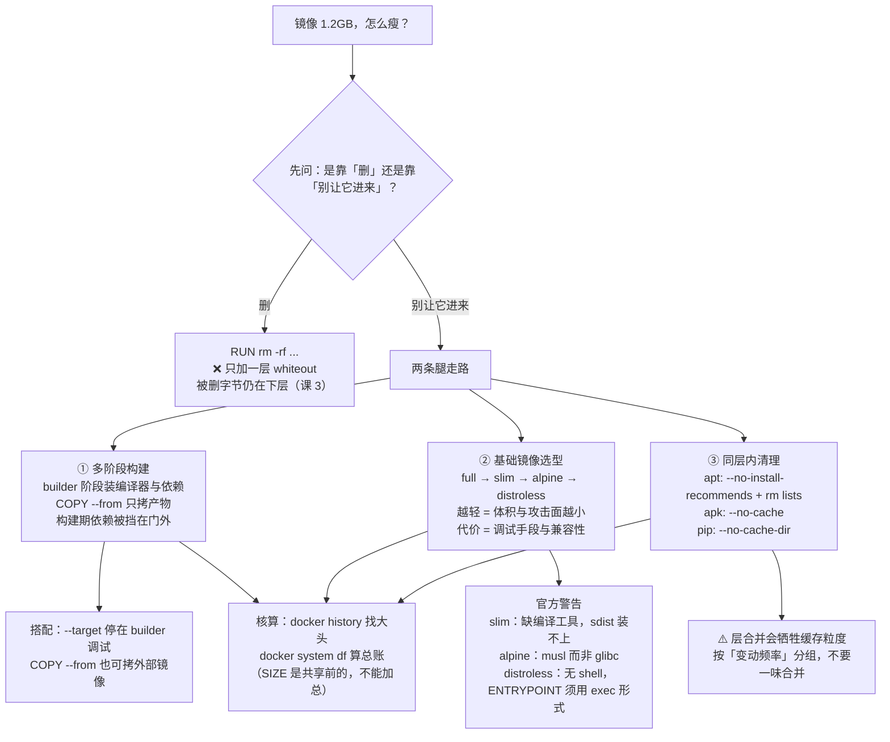

# 第 6 课：多阶段构建与镜像瘦身

> 所属阶段：阶段 2《镜像工程》｜ 水平：入门 ｜ 本课知识点：多阶段构建、基础镜像选型、瘦身实操与体积核算
> 故事情节：`order-service` 的镜像从 1.2GB 瘦到 45MB，且删了文件镜像却没变小

## 🎯 本课目标

- 用多阶段构建只把运行时产物搬进最终镜像
- 按场景在 full / slim / alpine / distroless 之间选对基础镜像，并避开各自的官方警告
- 会核算镜像体积，知道哪些"清理"真的有效、哪些只是自我安慰

## 📌 知识点导航

| 知识点 | 关键点 | 状态 |
|--------|--------|------|
| 多阶段构建 | builder 模式 / `COPY --from` 跨阶段拷贝 / 构建期依赖不进最终镜像 | ✅ 已完成 |
| 基础镜像选型 | full / slim / alpine / distroless 的取舍 / musl 与 glibc 兼容性陷阱 / 调试便利性 vs 体积 | ✅ 已完成 |
| 瘦身实操与体积核算 | 同层内清理才有效 / 层合并的代价 / `docker history` 逐层看体积 | ✅ 已完成 |

---

## 第一幕：起源与场景引入

经过课 4、课 5 的优化，`order-service` 的 Dockerfile 已经相当像样了：构建快、上下文干净、启动命令正确、配置可注入。

小杨满意地敲下 `docker images`：

```
REPOSITORY       TAG       SIZE
order-service    v5        1.2GB
```

**1.2GB。** 一个只有几千行 Python 代码的服务。

这带来的麻烦很具体：CI 推送要 5 分钟，新节点拉镜像要 3 分钟，镜像仓库的存储成本按 GB 计，CVE 扫描每次要扫上万个包。

他想起了网上流传的"瘦身技巧"，于是加了两行：

```dockerfile
RUN pip install -r requirements.txt
RUN rm -rf /root/.cache/pip     # 清理 pip 缓存
RUN apt-get clean                # 清理 apt 缓存
```

再构建，再看——

```
order-service    v6        1.21GB        ← 还大了 0.01GB
```

> 🎬 **场景**：删了个寂寞。这个结果其实课 3 早就预告过：**层是只读且累积的，删除只是在上面加了一层遮罩，被删的字节照样算体积。**

---

## 第二幕：认知冲突

> ❓ **问题**：既然"删"没用，那到底怎么才能真正把镜像瘦下来？

答案藏在一个词的区别里：

- **"删"** = 让它进来，再假装它不在 —— 无效（课 3 的机制）
- **"别让它进来"** = 从一开始就不把它放进最终镜像 —— 有效

第二条路有两条腿：**多阶段构建**（把构建环境和运行环境分开）和**基础镜像选型**（从一开始就挑一个轻的地基）。

---

## 第三幕：层层揭示

### 知识点 1：多阶段构建

> 本知识点关键点：builder 模式 / `COPY --from` 跨阶段拷贝 / 构建期依赖不进最终镜像

#### 一句话定义

**多阶段构建** 在一个 Dockerfile 里使用多个 `FROM`，每个 `FROM` 开启一个新阶段；你可以**选择性地**把前一阶段的产物拷到后一阶段，**把其余的一切都留在身后**。

#### 直觉建立（类比）

装修房子：施工队在**工棚**里干活——切割、刷漆、堆材料，现场一片狼藉。交付时，只把做好的家具搬进屋，**脚手架、水泥桶、边角料全留在工地上**。

> 💡 **类比的边界**：两处不同。① 工棚是物理上另一个地方，而多阶段的两个阶段在同一台构建机、同一个 Dockerfile 里，还共享构建缓存。② 搬家具是工人知道该搬什么；而 `COPY --from` **必须你自己精确指定拷什么**——拷漏一个依赖，镜像照样构建成功，但一运行就崩。这是多阶段构建最常见的失败模式。

#### 核心原理


**语法与命名**：

```dockerfile
FROM python:3.11 AS builder     # 阶段 1：命名后引用更稳
RUN ...                          # 在这里装编译器、拉依赖、编译

FROM python:3.11-slim            # 阶段 2：这里才是最终镜像
COPY --from=builder /xxx /xxx    # 只把需要的那一份拷过来
```

| 写法 | 说明 |
|---|---|
| `FROM ... AS <名字>` | 给阶段命名；**官方推荐**——即使 Dockerfile 里的指令日后被重排，`COPY` 也不会坏 |
| `COPY --from=0` | 不命名时用整数编号，第一个 `FROM` 是 `0` |
| `COPY --from=builder` | 用名字引用（推荐） |
| `COPY --from=nginx:latest /etc/nginx/nginx.conf /nginx.conf` | ⭐ **可以直接从外部镜像拷**，Docker 客户端会在需要时自动拉取它 |
| `FROM builder AS build1` | 把前面的阶段当作新阶段的基座（共享一套构建环境） |
| `docker build --target builder .` | 只构建到某个阶段就停 |

**`--target` 的三种典型用法**（官方列举）：

1. 调试某个特定阶段
2. 一个开了调试符号/工具的 `debug` 阶段 + 一个精简的 `production` 阶段
3. 一个塞了测试数据的 `testing` 阶段，与用真实数据的生产阶段分开

> ⚠️ **一个容易忽略的行为差异**：**BuildKit 只构建目标阶段所依赖的那些阶段**；而旧的 legacy builder 会构建目标阶段**之前的所有阶段**，哪怕目标并不依赖它们。现代 Docker 默认用 BuildKit，所以你享受到的是前者。

**极致形态：`FROM scratch`**。官方文档的 Go 例子就用了它——`scratch` 是一个**完全空的镜像**，连操作系统都没有：

```dockerfile
FROM golang:1.26 AS build
WORKDIR /src
RUN go build -o /bin/hello ./main.go

FROM scratch
COPY --from=build /bin/hello /bin/hello
CMD ["/bin/hello"]
```

最终镜像里**只有那个二进制文件**：Go SDK、编译器、中间产物，一个都没进来。

#### 示例演示

一个真实的 Python 多阶段写法（`pip install --user` 是很经典的套路）：

```dockerfile
# ---------- 阶段 1：builder ----------
FROM python:3.11 AS builder
WORKDIR /app
COPY requirements.txt .
# --user：装到 /root/.local，方便整块拷走
RUN pip install --user --no-cache-dir -r requirements.txt

# ---------- 阶段 2：runtime ----------
FROM python:3.11-slim
WORKDIR /app
# 只把「装好的依赖」这一块搬过来
COPY --from=builder /root/.local /root/.local
COPY . .
# 让 python 与命令行工具能找到它们
ENV PATH=/root/.local/bin:$PATH
CMD ["python", "app.py"]
```

```bash
# 构建并对比
docker build -t order-service:multi .
docker images order-service

# 停在 builder 阶段调试（比如看看依赖到底装到哪了）
docker build --target builder -t order-service:debug .
docker run --rm order-service:debug sh -c 'ls /root/.local/lib/python3.11/site-packages | head'
# 预期：列出装好的依赖包
```

#### 常见误区

1. **"多阶段会自动帮我拷贝需要的东西"** → 不会。`COPY --from` 拷什么完全由你指定，漏了就是运行时缺依赖。拷完务必用 `--target` 停在 builder 阶段确认产物路径。
2. **"阶段越多越慢"** → 不一定。BuildKit 只构建目标阶段依赖的阶段，不相关的阶段会被跳过。
3. **"`COPY --from` 只能拷同一次构建里的阶段"** → 不是，它**可以直接拷外部镜像**（官方语法 `COPY --from=nginx:latest ...`）。

#### 一句话记住

> **多阶段不"删"东西，而是把构建期的一堆层直接留在门外——只有你 `COPY --from` 的东西才进最终镜像。**

#### 官方文档

- [Multi-stage builds（Docker 官方）](https://docs.docker.com/build/building/multi-stage/)——命名阶段、`--target`、从外部镜像 `COPY --from`、BuildKit 与 legacy builder 的差异

---

### 知识点 2：基础镜像选型

> 本知识点关键点：full / slim / alpine / distroless 的取舍 / musl 与 glibc 兼容性陷阱 / 调试便利性 vs 体积

#### 一句话定义

基础镜像是镜像的地基，决定了体积下限、可用工具与兼容性风险；常见的四档是 **full → slim → alpine → distroless**，越往右越轻、也越难调试。

#### 直觉建立（类比）

出远门带行李：

| 档位 | 类比 |
|---|---|
| full | **全套装备的旅行箱**——什么都带了，重，但到了就能用 |
| slim | **精简背包**——够用；真缺什么，现买（现装）有点麻烦 |
| alpine | **极简腰包**——最轻，但有些东西根本装不下 |
| distroless | **只带身份证和钥匙**——最轻，但你连"打开看看"的工具都没有 |

> 💡 **类比的边界**：行李轻了可以到目的地现买；**镜像里缺了东西，运行时补不上**——尤其 distroless 连 shell 都没有，`docker exec -it xxx sh` 直接失败。所以"轻"的代价不是"不方便"，而是"某些情况下无从下手"。

#### 核心原理

**官方体积锚点**（distroless README 给出的对比，核查于 2026-09）：

| 镜像 | 体积 |
|---|---|
| `gcr.io/distroless/static-debian13` | **约 2 MiB** |
| `alpine` | 约 5 MiB |
| `debian` | 约 124 MiB |

> distroless 官方原文：最小的 distroless 镜像约 2 MiB，**约为 alpine 的 50%，不到 debian 的 2%**。

**四档对比**（含各自的官方警告）：

| 档位 | 含什么 | 官方警告 / 坑 | 适合 |
|---|---|---|---|
| **`python:3.11`**（full） | 基于 `buildpack-deps`，带大量常见 Debian 包 | 体积大 | **官方默认推荐**；依赖复杂、需要从源码编译扩展时 |
| **`python:3.11-slim`** | 只含运行 python 所需的最小 Debian 包 | ⚠️ **从源码分发（sdist）装包会失败**——镜像不含编译其他语言扩展模块所需的 Debian 包 | 依赖都有现成 wheel 时 |
| **`python:3.11-alpine`** | Alpine Linux（约 5MB 起） | ⚠️ **用 musl libc 而非 glibc**——官方原话："software will often run into issues depending on the depth of their libc requirements/assumptions"；另外**通常不含 git、bash** | 体积是第一优先级、且依赖对 libc 不敏感时 |
| **distroless** | 只有应用与运行时依赖 | ⚠️ **不含包管理器、不含 shell**；因此 **`ENTRYPOINT` 必须写成 exec 形式**（`ENTRYPOINT ["myapp"]` 可以，`ENTRYPOINT "myapp"` 不行）；调试要用 `:debug` 变体 | 编译型语言、追求最小攻击面 |

**关于 musl vs glibc，具体会踩到什么**（这是选择 alpine 前必须知道的）：

- **Python 的二进制 wheel 生态主要面向 glibc**（manylinux 系列标签）。Alpine 上要么用 musllinux wheel，要么**从源码编译**——构建会明显变慢，有时还会因为缺编译工具而失败。
- 一些**只提供 glibc 二进制的闭源软件**，在 Alpine 上直接跑不起来。
- 官方的措辞是"取决于软件对 libc 依赖/假设的深度"——也就是说，**依赖越底层、越偏 C 扩展，踩坑概率越高**。

> ⏳ 置信度说明：上面三条是领域通行认知（musl/glibc 差异 + wheel 标签机制），官方 Python 镜像文档明确警示了 musl 带来的兼容性风险，但未逐条列举具体故障现象。

**distroless 的调试出口**：官方为每档都提供了 `:debug` 变体，里面带 **busybox shell**：

```bash
docker build -t myapp:debug .     # Dockerfile 最后一行改成 :debug
docker run --entrypoint=sh -ti myapp:debug
```

> 另外 distroless 的 tag 还有 `nonroot` / `debug-nonroot`，并且**基础镜像名带 Debian 版本后缀**（如 `-debian13`）——官方建议**显式写出版本**，避免 Debian 大版本升级时构建意外变化。这与课 3 讲的"用 digest 或明确版本锁定"是同一个道理。

#### 示例演示

别背数字，自己量：

> ⚠️ 下面的具体 tag 只是示例（核查于 2026-09 均存在）。版本会随官方发布变动——**若某个 tag 拉取失败，换成该系列当前的可用版本即可**，重点是看四档之间的**量级差距**。

```bash
# 把候选基础镜像都拉下来，直接比
docker pull python:3.11
docker pull python:3.11-slim
docker pull python:3.11-alpine
docker pull gcr.io/distroless/python3-debian13

docker images --format 'table {{.Repository}}\t{{.Tag}}\t{{.Size}}' | grep -E 'python|distroless'
# 预期：四行体积依次递减（具体数字随版本变化，看量级不看绝对值）
```

```bash
# 验证 distroless 没有 shell —— 这是它的取舍所在
docker run --rm --entrypoint=sh gcr.io/distroless/python3-debian13
# 预期：报错（找不到 sh，或提示 no such file or directory）
# 注：带语言运行时的 distroless 有语言专属默认入口，不带 --entrypoint 时
#     你传的参数会交给该入口，而不是当成 shell 命令执行 —— 总之都拿不到 shell。
# 这也解释了为什么它的 ENTRYPOINT 必须写成 exec 形式。

# 对比：它的 debug 变体就有 shell
docker run --rm --entrypoint=sh -ti gcr.io/distroless/python3-debian13:debug -c 'echo 有 shell 了'
# 预期：有 shell 了
```

#### 常见误区

1. **"alpine 一定最快最小"** → 体积小是真的，但**构建可能更慢**（wheel 要从源码编译），而且有 musl 兼容性风险。它省下的主要是**分发和启动**的时间。
2. **"slim 就是 full 减去一点东西"** → 它减掉的是**编译工具链**，所以 `pip install` 遇到只有源码分发的包会失败。如果你的依赖里有需要编译的（如某些数据库驱动、科学计算库），slim 会给你添麻烦。
3. **"distroless 没有 shell 是缺陷"** → 是**特性**。没有 shell 意味着攻击面更小、CVE 扫描信噪比更高；调试时临时换 `:debug` 变体即可。

#### 一句话记住

> **越轻的基础镜像，省下的是体积与攻击面，付出的是调试手段与兼容性余量——按"我能不能接受没有 shell"来选，而不是按数字大小。**

#### 官方文档

- [Python 官方镜像 · Image Variants](https://github.com/docker-library/docs/tree/master/python)——full / slim / alpine 的官方定位与 slim、alpine 的官方警告原文
- [GoogleContainerTools/distroless README](https://github.com/GoogleContainerTools/distroless)——distroless 的构成、体积对比、`:debug` 变体、`ENTRYPOINT` 必须用 exec 形式

---

### 知识点 3：瘦身实操与体积核算

> 本知识点关键点：同层内清理才有效 / 层合并的代价 / `docker history` 逐层看体积

#### 一句话定义

真正有效的清理必须**与产生垃圾的那条命令在同一层内完成**；而核算体积时要记住——`docker images` 显示的 SIZE 是**未共享前**的大小，不能简单相加。

#### 直觉建立（类比）

寄快递按**打包后总重**收费。你在箱底垫了一堆旧报纸当缓冲，那报纸的重量也算钱。

想减重，不是在封箱之后伸手进去掏（掏不出来，箱子已经封了），而是**在打包之前**就把报纸拿出来。

> 💡 **类比的边界**：封箱后你确实掏不出来——但 Docker 的"掏"其实"掏得动"，只是掏了不减重：它在最上层加一个"报纸看不见了"的标记，报纸还在下面称着重量。**这就是课 3 那个 whiteout 机制。**

#### 核心原理

**规则一：清理必须和产生垃圾的命令写在同一个 `RUN` 里**

```dockerfile
# ❌ 无效：两个 RUN = 两层，删不掉下一层里的东西
RUN apt-get update && apt-get install -y build-essential
RUN rm -rf /var/lib/apt/lists/*

# ✅ 有效：同一层内，装完立刻清
RUN apt-get update && apt-get install -y build-essential \
    && rm -rf /var/lib/apt/lists/*
```

**各类包管理器的"不留缓存"写法**：

| 场景 | 写法 |
|---|---|
| Debian / Ubuntu | `apt-get install -y --no-install-recommends <包> && rm -rf /var/lib/apt/lists/*` |
| Alpine | `apk add --no-cache <包>`（`--no-cache` 一步到位，不用再手动清） |
| Python | `pip install --no-cache-dir -r requirements.txt` |
| Node | `npm ci && npm cache clean --force`（或直接用多阶段，只拷 `node_modules`） |

> `--no-install-recommends` 是 Debian 系常用的另一招：跳过"推荐但非必需"的包，往往能省下可观体积。

**规则二：层合并是有代价的**

把多条 `RUN` 用 `&&` 串成一条，确实能减少层数与体积——但**缓存粒度也变粗了**：串得越长，任何一处改动都会让整条重跑。

所以原则是：**把"会一起变的东西"合并，把"变动频率不同的东西"拆开**（呼应课 4 的排序原则）。

**规则三：体积怎么看**

| 命令 | 看什么 |
|---|---|
| `docker images` | 镜像体积（**未共享前**的独立大小，多个镜像共享层时**不能相加**） |
| `docker history <镜像>` | 逐层大小 + 产生它的指令——**找大头的首选**，注意 `0B` 的行是纯元数据 |
| `docker ps -s` | 容器的 `size`（可写层）与 `virtual size`（含只读镜像数据，**不可加总**） |
| `docker system df` | 全局体检：镜像 / 容器 / 卷 / 构建缓存各占多少 |

> 关于"不能相加"：课 3 讲过，10 个容器共享同一个镜像时，磁盘上只读层只有一份。所以"总占用 ≈ 各容器 `size` 之和 + 一份镜像大小"，直接把 `virtual size` 加起来会**严重高估**。

**一份瘦身检查清单**：

- [ ] 用上 `.dockerignore` 了吗？（课 4）
- [ ] 指令顺序对了吗——依赖清单在前、源码在后？（课 4）
- [ ] 包管理器用了 `--no-cache` / `--no-install-recommends` / `--no-cache-dir` 吗？
- [ ] 清理命令和产生垃圾的命令在**同一个 RUN** 里吗？
- [ ] 构建期依赖有没有被**多阶段**挡在门外？
- [ ] 基础镜像是不是可以在 slim / alpine 之间再降一档？
- [ ] 用 `docker history` 确认过大头在哪一层吗？

#### 示例演示

亲手看清理到底有没有效果：

```bash
# 准备两个 Dockerfile：唯一区别是「清理写在同一层还是下一层」
mkdir -p clean-demo && cd clean-demo
echo "flask" > requirements.txt

# ❌ 清理写在「下一层」—— 无效（两个 RUN = 两层，删不掉下层的东西）
cat > Dockerfile.separate <<'EOF'
FROM python:3.11-slim
COPY requirements.txt .
RUN pip install -r requirements.txt
RUN rm -rf /root/.cache/pip
EOF

# ✅ 同一层内就清干净 —— 有效
cat > Dockerfile.same <<'EOF'
FROM python:3.11-slim
COPY requirements.txt .
RUN pip install --no-cache-dir -r requirements.txt
EOF

docker build -f Dockerfile.separate -t clean:separate .
docker build -f Dockerfile.same     -t clean:same .

docker images --format 'table {{.Repository}}\t{{.Tag}}\t{{.Size}}' | grep clean
# 预期：clean:same 明显小于 clean:separate
# ↑ 这就是「同层内清理才有效」的实证 —— 那句 rm 写在下一层，等于白写

# 逐层看：哪一层最大（找体积大头的标准动作）
docker history clean:same --format 'table {{.Size}}\t{{.CreatedBy}}'
# 预期：pip install 那一层最大 —— 这就是你该下手的地方

# 全局体检
docker system df
# 预期：Images / Build Cache 两行有数字
```

#### 常见误区

1. **"多写几条 `RUN rm` 就能瘦"** → 不能。删除产生新层，被删内容仍在下层算体积。**要么同层内清理，要么用多阶段挡在门外。**
2. **"把所有 `RUN` 都合并成一条最省"** → 体积会小一点，但**缓存粒度变粗**，改一行代码就全量重跑。合并要按"变动频率"来，不是越合并越好。
3. **"把 `docker images` 里所有 SIZE 加起来就是 Docker 占的磁盘"** → 严重高估。层是共享的，用 `docker system df` 才是真实占用。

#### 一句话记住

> **清理要和产生垃圾的命令同层；层合并会牺牲缓存粒度；体积看 `docker history` 找大头，看 `system df` 算总账。**

#### 官方文档

- [Dockerfile reference · RUN / COPY（Docker 官方）](https://docs.docker.com/reference/dockerfile/)——哪些指令产生层
- [Docker build cache（Docker 官方）](https://docs.docker.com/build/cache/)——缓存粒度与排序原则

---

## 第四幕：实操验证

把 `order-service` 从 1.2GB 一路瘦下来。

> ⚠️ 下文的体积数字是**示例量级**（依赖不同，实测结果会有差异）。本讲义命令的预期输出为**纸面预期**（写作时本机 Docker 守护进程未运行）。

### 步骤 1：先找大头，别瞎猜

```bash
docker history order-service:v5 --format 'table {{.Size}}\t{{.CreatedBy}}'
# 预期：某一两层占了绝大部分；0B 的行是纯元数据，忽略
```

### 步骤 2：上多阶段，把构建期依赖挡在门外

```dockerfile
FROM python:3.11 AS builder
WORKDIR /app
COPY requirements.txt .
RUN pip install --user --no-cache-dir -r requirements.txt

FROM python:3.11-slim
WORKDIR /app
COPY --from=builder /root/.local /root/.local
COPY . .
ENV PATH=/root/.local/bin:$PATH
CMD ["python", "app.py"]
```

```bash
docker build -t order-service:v6 .
docker images order-service
# 预期：从 GB 级降到百 MB 级 —— 编译器与构建依赖不再进入最终镜像
```

### 步骤 3：同层清理 + 检查基础镜像还能不能再降一档

```dockerfile
FROM python:3.11-slim
WORKDIR /app
COPY requirements.txt .
# 同一层内：装完就清，且不留缓存
RUN pip install --no-cache-dir -r requirements.txt \
    && rm -rf /tmp/*
COPY . .
CMD ["python", "app.py"]
```

> 想再往下压，就把 `python:3.11-slim` 换成 `python:3.11-alpine`——但**先确认你的依赖在 musl 下装得上**（官方警告过，见知识点 2）。

### 步骤 4：核算，确认不是错觉

```bash
docker history order-service:v6 --format 'table {{.Size}}\t{{.CreatedBy}}'
# 预期：最大的那几层已经消失

docker system df
# 预期：Images 一行下降；若 Build Cache 很大，用 docker builder prune 单独清
```

> ✅ **回扣场景**：1.2GB → 45MB 的差距，不是靠"删"出来的，而是靠两件事：**多阶段把构建期依赖挡在门外** + **地基换成了轻量的基础镜像**。而那两行 `RUN rm`，确实一点用也没有。

---

## 第五幕：体系收束

> 📍 **全局定位**：**阶段 2《镜像工程》到此闭环。** 三课分别解决了三件事：
>
> | 课 | 解决的问题 |
> |---|---|
> | 课 4 | 怎么写 Dockerfile、怎么让构建变快 |
> | 课 5 | 怎么启动、怎么注入配置、怎么不泄露密钥 |
> | **课 6** | **怎么把镜像瘦下来、怎么选地基** |
>
> 现在的你，已经能独立完成一个**生产级**的 Dockerfile：构建快、体积小、启动信号量正确、配置可注入、密钥不外泄。
>
> 但你做出来的是一个**单容器**。而真实服务往往不是一个容器——`order-service` 还需要 PostgreSQL 和 Redis。

> 🔗 **下一步**：阶段 3《数据与网络》课 7《数据持久化》——先解决最要命的那个问题：**容器里的数据库数据，容器一删就没了**。那也是课 3 埋下的伏笔（"容器数据默认存在 ephemeral 可写层"）的兑现之处。

---

## 🐞 常见误区

1. **"`RUN rm -rf` 能瘦镜像"** → 不能。删除只加一层 whiteout，字节还在下层。**同层内清理**或**多阶段**才是正解。

2. **"alpine 就是更快更好"** → 体积小是真的，但 musl libc 有兼容性风险，而且缺 wheel 时要从源码编译，**构建可能更慢**。选它之前先验证依赖装得上。

3. **"distroless 没有 shell，所以用不了"** → 它是刻意设计的最小攻击面；`ENTRYPOINT` 写成 exec 形式即可正常运行，调试时换 `:debug` 变体。

4. **"把所有 RUN 合并成一条最省"** → 体积略降，但**缓存粒度变粗**。合并应按"变动频率"分组，不是一味合并。

---

## 一图总结



---

## 📋 命令速查卡

| 命令 | 作用 | 本课出现在哪 |
|------|------|------------|
| `docker build --target <阶段名> .` | 只构建到某个阶段——**调试多阶段构建的利器** | 知识点 1 / 示例 |
| `COPY --from=<阶段或镜像> <源> <目标>` | 跨阶段（或跨镜像）拷贝产物 | 知识点 1 |
| `docker history <镜像> --format 'table {{.Size}}\t{{.CreatedBy}}'` | 逐层看大小与产生它的指令——**找体积大头首选** | 知识点 3 / 步骤 1 |
| `docker images --format 'table {{.Repository}}\t{{.Tag}}\t{{.Size}}'` | 对比候选基础镜像的体积 | 知识点 2 |
| `docker system df` | 全局体检（镜像 / 容器 / 卷 / 构建缓存） | 知识点 3 / 步骤 4 |
| `docker builder prune` | 只清 BuildKit 构建缓存 | 知识点 3 / 步骤 4 |
| `apt-get install -y --no-install-recommends …` | Debian 系装包不装推荐项 | 知识点 3 |
| `apk add --no-cache …` | Alpine 装包不留缓存 | 知识点 3 |
| `pip install --no-cache-dir …` | Python 装包不留缓存 | 知识点 3 |

---

## 课后小测

**Q1**：小杨加了 `RUN rm -rf /root/.cache/pip`，镜像体积没有变小。根本原因是？

- A. `rm` 命令语法错了
- B. 删除操作会在上层生成 whiteout 遮罩，被删内容仍在下层，体积照算
- C. pip 缓存本来就不占空间
- D. 需要先 `docker system prune` 才能释放

<details><summary>答案与解析</summary>

**答案：B**。这是课 3 的机制在本课的兑现：层只读且累积，删除 = 加一层遮罩。**正解是两条**：① **同层内清理**（`RUN pip install --no-cache-dir ... && rm -rf /tmp/*`）；② **多阶段构建**，让这些文件根本不进最终镜像。D 无关——`prune` 清理的是本地缓存与虚悬镜像，管不到镜像内部的层。

</details>

**Q2**：关于基础镜像选型，下列说法正确的是？

- A. alpine 一定最快，因为体积最小
- B. slim 和 full 的区别只是少了一点文档
- C. slim 缺少编译工具链，从源码分发（sdist）装包可能失败；alpine 用 musl libc，软件可能因 libc 假设而踩坑；distroless 无 shell，`ENTRYPOINT` 必须用 exec 形式
- D. distroless 因为没 shell，所以完全不能调试

<details><summary>答案与解析</summary>

**答案：C**。三条都是官方警告：slim 不含编译扩展模块所需的 Debian 包；alpine 官方原话 "does not use glibc"（软件常因 libc 依赖深度出问题）；distroless 默认无 shell 故 ENTRYPOINT 必须 vector form。A 错——alpine 缺 wheel 时要从源码编译，**构建可能更慢**。D 错——官方提供 `:debug` 变体（带 busybox shell），`docker run --entrypoint=sh -ti <镜像>:debug` 即可进入。

</details>

**Q3**：想把镜像体积压下去，下列做法**真正有效**的是？

- A. 在 Dockerfile 末尾加一条 `RUN apt-get clean`
- B. 把清理命令和产生垃圾的命令写在同一个 `RUN` 里（用 `&&` 连接）
- C. 把所有 `RUN` 无条件合并成一条
- D. 把 `docker images` 里的 SIZE 全部加起来，看总数是多少

<details><summary>答案与解析</summary>

**答案：B**。同层内清理才有效。A 错——单独的 `RUN` 是新的一层，清不掉下层。C 错——合并虽能减一点体积，但**缓存粒度变粗**，改一处就全量重跑；应按"变动频率"分组。D 错——层是共享的，`docker images` 的 SIZE 是共享前的大小，**不能相加**；要算总占用请用 `docker system df`。

</details>

---

## 🎉 阶段 2 完成

阶段 2《镜像工程》三课到此收官（**18 / 45 知识点**）。

你现在能独立完成一份生产级 Dockerfile：

| 能力 | 来自 |
|---|---|
| 写出可复现的 Dockerfile、`docker build` 参数用对 | 课 4 |
| 构建快（上下文干净 + 缓存命中） | 课 4 |
| 启动命令正确（`docker stop` 秒停） | 课 5 |
| 配置可注入（一份镜像通吃多环境） | 课 5 |
| 密钥不外泄 | 课 5 |
| 体积小、地基选得对 | 课 6 |

**建议做一件事再往下走**：挑一个你自己的项目，按课 6 第四幕走一遍——`docker history` 找大头 → 上多阶段 → 换基础镜像 → 核算。亲手看到数字下降，比读十遍都管用。

---

## 🚀 下一批接力提示词

> 学完阶段 2 后，**复制下面这段文字发给 AI**，即可进入阶段 3（无需重新描述上下文）：

```
继续学 Docker。我的学习档案在 docker/00-学习档案.md，
刚学完阶段 2《镜像工程》全部三课（课 4 Dockerfile入门 / 课 5 启动命令与配置注入 / 课 6 多阶段构建与镜像瘦身），共 9 个知识点，
请按大纲进入阶段 3《数据与网络》，从课 7《数据持久化》开始讲解。
```

## 🧭 课程导航

⬅️ **上一课**：[课 5：启动命令与配置注入](lesson-05-启动命令与配置注入.md)

➡️ **下一课**：[课 7：数据持久化](../../3-数据与网络/lessons/lesson-07-数据持久化.md)（阶段 3 第 1 课）

📚 **返回目录**：[课程目录](../../../02-课程目录.md)
