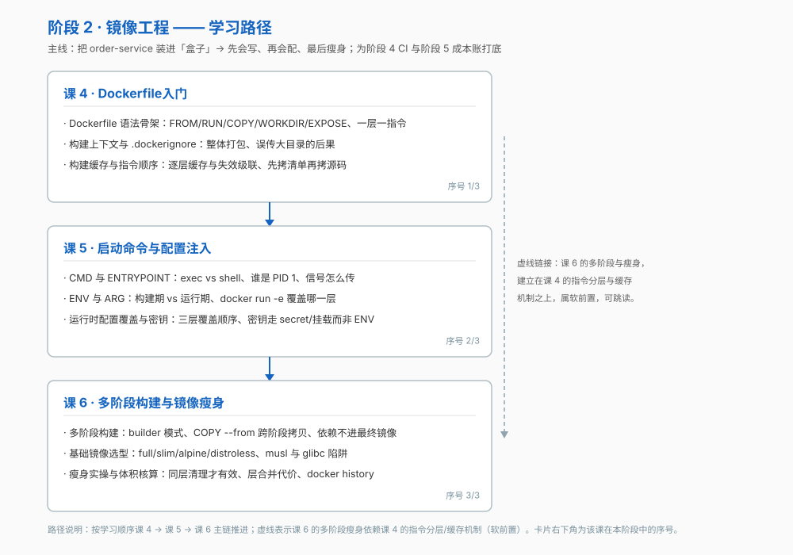

# 阶段 2：镜像工程

> 所属课程：Docker 系统学习 ｜ 故事章节：把服务装进盒子 ｜ 上一阶段：[阶段 1 容器与镜像基础](../1-容器与镜像基础/overview.md)

## 🎯 本阶段目标

- 能写出可复现、缓存友好的 Dockerfile
- 说清 CMD 与 ENTRYPOINT 的区别，避开 PID 1 收不到信号的坑
- 能用多阶段构建把镜像瘦下来，并选对基础镜像

## 📍 学习重点

- 每条 Dockerfile 指令生成一层，指令顺序决定缓存命中率
- 构建上下文整体打包发送给守护进程，`.dockerignore` 是性能与安全的闸门
- exec 形式与 shell 形式决定了谁是 PID 1、信号能不能传进去
- ENV 与 ARG 的生命周期不同；密钥绝不能进镜像层
- 基础镜像选型是体积、兼容性、调试便利性的三方权衡

## ✅ 必须掌握的知识点

| 知识点 | 所属课 | 学完应能 |
|--------|--------|----------|
| Dockerfile 语法骨架 | 课 4 · Dockerfile入门 | 写出一个能跑的最小 Dockerfile，并说清每条指令生成一层 |
| 构建上下文与 .dockerignore | 课 4 · Dockerfile入门 | 解释上下文是什么、误传大目录的后果、写出有效的 .dockerignore |
| 构建缓存与指令顺序 | 课 4 · Dockerfile入门 | 按缓存失效规则排列指令，并解释"改一行代码为什么要重装依赖" |
| CMD 与 ENTRYPOINT | 课 5 · 启动命令与配置注入 | 说清 exec 形式与 shell 形式的差别，以及信号传递与 PID 1 的关系 |
| ENV 与 ARG | 课 5 · 启动命令与配置注入 | 分清构建期与运行期，知道 docker run -e 覆盖哪一层 |
| 运行时配置覆盖与密钥 | 课 5 · 启动命令与配置注入 | 说清三层覆盖顺序，指出密钥不该走 ENV 也不该进镜像层 |
| 多阶段构建 | 课 6 · 多阶段构建与镜像瘦身 | 用 builder 模式只保留运行时产物 |
| 基础镜像选型 | 课 6 · 多阶段构建与镜像瘦身 | 在 full / slim / alpine / distroless 之间按场景取舍 |
| 瘦身实操与体积核算 | 课 6 · 多阶段构建与镜像瘦身 | 用 docker history 逐层看体积，解释"删了文件镜像没变小" |

## 🗺️ 本阶段路径图

## 本阶段产出

- [x] `lessons/lesson-04-Dockerfile入门.md`
- [x] `lessons/lesson-05-启动命令与配置注入.md`
- [x] `lessons/lesson-06-多阶段构建与镜像瘦身.md`
