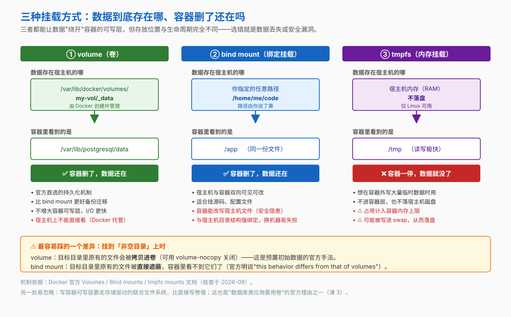
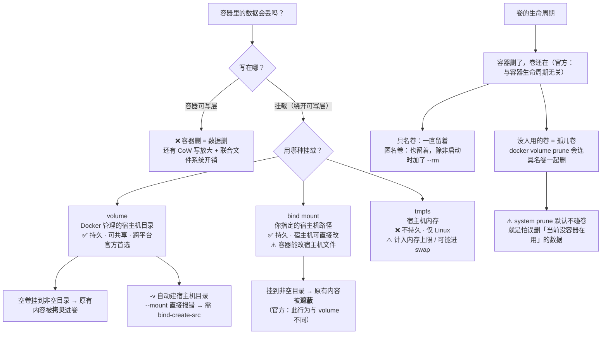

# 第 7 课：数据持久化

> 所属阶段：阶段 3《数据与网络》｜ 水平：入门 ｜ 本课知识点：容器文件系统的临时性、三种挂载方式、卷的生命周期与清理
> 故事情节：`order-service` 写了三天的测试数据，容器一删全没了

## 🎯 本课目标

- 说清容器文件系统为什么是临时的，以及哪些数据必须外置
- 在 volume / bind mount / tmpfs 之间正确选择，并避开挂载行为的两个官方差异
- 会管理卷的生命周期——包括清理、备份与迁移，以及不误删数据

## 📌 知识点导航

| 知识点 | 关键点 | 状态 |
|--------|--------|------|
| 容器文件系统的临时性 | 容器删则可写层删 / 写时复制带来的写放大 / 哪些数据必须外置 | ✅ 已完成 |
| 三种挂载方式 | volume / bind mount / tmpfs 的适用场景 / 权限与 SELinux 标签的坑 / 挂载会遮蔽镜像内原有内容 | ✅ 已完成 |
| 卷的生命周期与清理 | 命名卷 vs 匿名卷 / 孤儿卷与 `docker volume prune` / 备份与迁移的基本套路 | ✅ 已完成 |

---

## 第一幕：起源与场景引入

阶段 2 结束时，`order-service` 已经是一个像样的镜像了：构建快、体积小、启动正确、密钥不外泄。小杨把它连同 PostgreSQL 一起跑了起来，开始灌测试数据。

三天后，他要更新数据库镜像版本。操作很常规：

```bash
docker stop order-db
docker rm order-db
docker run -d --name order-db -e POSTGRES_PASSWORD=devpass postgres
```

然后他打开应用——**三天的测试数据，全没了。**

他愣了几秒，突然想起课 3 里那句当时觉得无关痛痒的话：

> 容器里的数据默认存在 **ephemeral（临时）的可写层**，删掉容器，数据随之消失。

> 🎬 **场景**：那句话当时只是个知识点，现在变成了事故。**容器天生"不留东西"——那数据库到底该怎么跑？**

---

## 第二幕：认知冲突

> ❓ **问题**：容器的文件系统为什么是临时的？既然如此，数据库这类"必须留住数据"的东西，凭什么能跑在容器里？

答案分两层：

1. **为什么会丢** —— 容器可写层的生命周期（知识点 1，课 3 的机制在这里兑现）
2. **怎么让它不丢** —— 把数据放到容器之外，也就是**挂载**（知识点 2、3）

而且"放到容器之外"不止一种放法——三种挂载方式的行为差异，比大多数人以为的要大。

---

## 第三幕：层层揭示

### 知识点 1：容器文件系统的临时性

> 本知识点关键点：容器删则可写层删 / 写时复制带来的写放大 / 哪些数据必须外置

#### 一句话定义

容器的文件系统 = **镜像的只读层 + 一层薄薄的可写层**；**可写层与容器同生共死**，容器删除即可写层消失，写在里面的数据随之消失。

#### 直觉建立（类比）

在**白板**上写字——下课铃一响，值日生过来一擦，什么都不剩。想留住，就得写在**纸**上。

> 💡 **类比的边界**：两处不同。① 白板擦掉是一瞬间，而容器的"擦"其实**擦不干净**——你在容器里 `rm` 文件，只是在最上层加了遮罩，字节还在下层算体积（课 3 的 whiteout 机制）。所以容器层的"临时"是指**随容器销毁**，不是指"删除能回收空间"。② 白板写字没有性能代价，而往容器可写层写东西有**写放大**——下面马上讲。

#### 核心原理

**一、可写层随容器消亡**（这是设计，不是 bug）

官方原话：容器的可写层 "doesn't persist after the container is deleted"，它只适合存放**运行时产生的临时数据**。这个设计换来的是"删掉重跑就回到干净状态"的爽感（课 2 讲过）。

**二、往可写层写，有两个性能代价**（课 3 的 CoW 在这里变成成本）

| 代价 | 机制 |
|---|---|
| **写放大（copy_up）** | 改一个字节，也要把**整个文件**从只读层复制到可写层。改文件权限/属主同样触发（课 3 官方原话） |
| **联合文件系统开销** | 每次读写都要穿过存储驱动的抽象层。官方说法：卷**直接写宿主文件系统**，比这快 |

所以官方对数据库的建议非常直白：**写密集型应用（例如数据库）别把数据放在容器里**，用卷——既避免 CoW 开销，也让数据活过容器，而且**不会撑大容器的可写层**。

**三、哪些数据必须外置**

| 数据类型 | 放哪 | 理由 |
|---|---|---|
| 数据库数据文件 | **卷** | 必须持久 + 写密集 |
| 用户上传的文件 | **卷** | 必须持久 |
| 需要留存的日志 | **卷**或日志驱动 | 容器删了日志也没了（课 11 详讲） |
| 应用代码 | **镜像** | 不该外置——外置就失去了"镜像即完整制品"的意义 |
| 配置 | **镜像内默认值 + 运行时注入** | 课 5 已解决 |
| 编译缓存、临时文件 | **tmpfs** | 不该持久化，用内存挂载最快 |
| 会话/缓存（可丢的） | **tmpfs** 或容器层 | 丢了也不影响业务 |

#### 示例演示

亲手看数据是怎么没的：

```bash
# 1) 起容器，写点东西
docker run --name ephemeral alpine sh -c 'echo "重要的业务数据" > /data.txt && cat /data.txt'
# 预期输出：重要的业务数据

# 2) 容器还在，数据在
docker start ephemeral >/dev/null && docker exec ephemeral cat /data.txt
# 预期输出：重要的业务数据

# 3) 删掉容器，再起一个同名的一模一样的
docker rm -f ephemeral
docker run --name ephemeral alpine cat /data.txt
# 预期：cat: can't open '/data.txt': No such file or directory
# ↑ 数据随可写层一起没了

docker rm -f ephemeral
```

#### 常见误区

1. **"容器里 `rm` 掉就能回收空间"** → 不能（课 3）。这是"临时性"的另一面：删不掉，但会随容器一起消失。
2. **"数据库不该跑在容器里"** → 结论对，理由常被说错。不是容器跑不了数据库，而是**数据不能放在容器层**——用卷挂载之后，数据库在容器里跑是完全正常的做法。

#### 一句话记住

> **容器层是白板，容器一删就擦干净；要留住的数据、写密集的数据，都得放到容器之外。**

#### 官方文档

- [Storage drivers（Docker 官方）](https://docs.docker.com/engine/storage/drivers/)——可写层不持久、写密集应用用卷的官方建议

---

### 知识点 2：三种挂载方式

> 本知识点关键点：volume / bind mount / tmpfs 的适用场景 / 权限与 SELinux 标签的坑 / 挂载会遮蔽镜像内原有内容

#### 一句话定义

**挂载**就是把容器之外的一块存储（Docker 管理的卷、宿主机的目录、或宿主机的内存）接到容器内的某个路径上，让容器读写它——从而**绕开**那个会随容器消亡的可写层。

#### 直觉建立（类比）

存一份重要的笔记，有三种方式：

| 方式 | 类比 |
|---|---|
| **volume** | 交给**档案馆**保管——有编号、好搬运、专人管理；但你自己不能随手去翻 |
| **bind mount** | 放在**你家书架上**——位置你说了算，随手能改；但搬了家（换机器）就得重找 |
| **tmpfs** | 记在**便签**上——写得最快，但撕了就没 |

> 💡 **类比的边界**：档案馆"不能随手翻"是说**不该**直接去动它——其实它在宿主机上也有真实路径（`/var/lib/docker/volumes/<名>/_data`），官方的说法是卷"完全由 Docker 管理"，**不适合**需要直接从宿主机访问文件的场景。

#### 核心原理



**官方对比**：

| | **volume** | **bind mount** | **tmpfs** |
|---|---|---|---|
| 数据在哪 | Docker 管理的宿主机目录 | 你指定的宿主机路径 | **宿主机内存** |
| 容器删了数据还在吗 | ✅ 在 | ✅ 在（本来就在宿主机上） | ❌ 没了 |
| 能在宿主机直接看/改 | 不推荐（Docker 托管） | ✅ 可以 | — |
| 能否在容器间共享 | ✅ 可以 | ✅ 可以 | ❌ **不能** |
| 跨平台 | Linux + Windows | Linux + Windows | **仅 Linux** |
| 官方推荐度 | **持久化的首选** | 需要宿主机访问时 | 临时数据 |
| 典型用途 | 数据库数据、上传文件 | 挂源码、挂配置文件 | 缓存、临时文件、敏感中间数据 |

**体积与性能**（官方理由，选 volume 而不是写容器层的两条硬理由）：

- 用卷**不会增大**容器的可写层
- 写卷**比写容器层快**——写容器层要穿过存储驱动的联合文件系统抽象

**⚠️ 差异一：挂载到"非空目录"时，两者行为相反**

这是本课最容易踩的坑，官方文档专门写了一句 "this behavior differs from that of volumes"：

| 挂载类型 | 挂到已有内容的目录上 | 结果 |
|---|---|---|
| **volume（空卷）** | 目标目录里原有的文件会被**拷贝进卷** | 容器看到的是原有内容的副本 —— 这正是官方"预置初始数据"的手法 |
| **volume（非空卷）** | 原有文件被**遮蔽** | 类似往 `/mnt` 挂 U 盘 |
| **bind mount** | 原有文件被**遮蔽** | 同上，且**与 volume 不同**——不拷贝 |

> 官方给过一个"作死"示例：把宿主机的 `/tmp` bind 到 nginx 容器的 `/usr`，结果容器起不来——`exec: "nginx": executable file not found in $PATH`。因为 `/usr` 里原有的东西被完全遮蔽了。
>
> 而且官方明说：**没有直接的办法"卸载"挂载来重新露出被遮蔽的文件**，最好的办法是**重建一个不带该挂载的容器**。

**⚠️ 差异二：`-v` 与 `--mount` 对待"不存在的宿主机路径"完全不同**

```bash
# -v：源路径不存在 → Docker 自动创建它（总是创建成目录）
docker run -v /does/not/exist:/foo alpine ls /foo
# 预期：正常执行（目录被自动建出来了）

# --mount：源路径不存在 → 直接报错
docker run --mount type=bind,src=/dev/noexist,dst=/mnt/foo alpine
# 预期：docker: Error response from daemon: invalid mount config for type "bind":
#       bind source path does not exist: /dev/noexist.
```

> 想让 `--mount` 也自动建，加 `bind-create-src` 选项。

**写法对照**（官方推荐 `--mount`，理由是更明确且支持全部选项；但 `-v` 更短，日常仍大量使用）：

| 类型 | `--mount`（推荐） | `-v`（简短） |
|---|---|---|
| 具名卷 | `--mount type=volume,src=myvol,dst=/app` | `-v myvol:/app` |
| 匿名卷 | `--mount type=volume,dst=/app`（省略 src） | `-v /app` |
| 只读 | `--mount type=volume,src=myvol,dst=/app,readonly` | `-v myvol:/app:ro` |
| bind | `--mount type=bind,src="$(pwd)"/target,dst=/app` | `-v "$(pwd)"/target:/app` |
| tmpfs | `--mount type=tmpfs,dst=/app` | —（用 `--tmpfs /app`） |

**三个官方注意事项**：

1. **必须用 `--mount` 的三种情况**：指定卷驱动选项、挂载卷的子目录（`volume-subpath`）、挂到 Swarm service。
2. **SELinux 的 `z` / `Z` 要极其小心**（仅 `-v` 支持，`--mount` 不支持）：
   - `z` = 内容在多个容器间共享
   - `Z` = 内容私有、不共享
   - ⚠️ 官方原话："Bind-mounting a system directory such as `/home` or `/usr` with the `Z` option **renders your host machine inoperable**"（会让你的宿主机无法使用）。
3. **bind mount 有安全隐患**：官方明说 bind mount **默认对宿主机文件有写权限**，容器里的进程可以**创建、修改或删除宿主机上的重要系统文件**。需要限制就加 `ro`。
4. **Mac / Windows（Docker Desktop）上 bind mount 的路径怎么写**：官方提醒，bind mount 是相对 **Docker 守护进程所在的主机**创建的，**不是客户端**。Desktop 的守护进程跑在一个 Linux 虚拟机里，但 Desktop 自带内建机制透明处理了这件事，所以你可以直接写本机路径（如 `/Users/me/code`）。⚠️ 但**远程守护进程**不行——它访问不到你客户端机器上的文件。

#### 示例演示

```bash
# 1) 具名卷：容器删了，数据还在
docker volume create mydata
docker run --rm --mount type=volume,src=mydata,dst=/data \
  alpine sh -c 'echo "活下来了" > /data/note.txt'
docker run --rm --mount type=volume,src=mydata,dst=/data alpine cat /data/note.txt
# 预期输出：活下来了   ← 上一个容器早被 --rm 删了，数据还在

# 2) 空卷挂到非空目录 → 原有内容被「拷贝」进卷（官方手法）
#    ⚠️ 必须用 nginx 镜像：要被拷贝的内容得先存在于镜像里（换成 alpine 就什么都没有）
docker run --rm --mount type=volume,src=nginx-html,dst=/usr/share/nginx/html \
  nginx:alpine sh -c 'ls /usr/share/nginx/html'
# 预期：50x.html　index.html —— 镜像里原有的文件被复制进卷了

# 验证：卷里确实留下了这些文件（换个镜像挂同一个卷，依然看得到）
docker run --rm --mount type=volume,src=nginx-html,dst=/html alpine ls /html
# 预期：50x.html　index.html   ← 内容已经在卷里，不再依赖 nginx 镜像

# 3) bind mount 挂到非空目录 → 原有内容被「遮蔽」（与卷不同！）
mkdir -p /tmp/empty
docker run --rm --mount type=bind,src=/tmp/empty,dst=/usr/share/nginx/html \
  nginx:alpine sh -c 'ls -A /usr/share/nginx/html | wc -l'
# 预期：0 —— 镜像里原有的文件被遮蔽了，一个都看不到

docker volume rm nginx-html

# 4) -v 自动建目录 vs --mount 报错
docker run --rm -v /tmp/brand-new-dir:/x alpine ls -d /x        # 预期：/x（目录被自动创建）
docker run --rm --mount type=bind,src=/tmp/no-such-xyz,dst=/x alpine
# 预期：报错 bind source path does not exist

# 5) tmpfs：容器一停就没
docker run --rm --mount type=tmpfs,dst=/tmp alpine sh -c 'echo hi > /tmp/a && cat /tmp/a'
# 预期：hi（同一个容器内看得到）
docker run --rm --mount type=tmpfs,dst=/tmp alpine sh -c 'cat /tmp/a'
# 预期：cat: can't open '/tmp/a'  ← 新容器里空空如也
```

#### 常见误区

1. **"卷和 bind mount 挂到非空目录的行为一样"** → 不一样。**空卷会拷贝**原有内容，**bind mount 直接遮蔽**。官方专门标了这句差异。
2. **"`-v` 和 `--mount` 只是写法不同"** → 对待不存在的源路径时行为相反（`-v` 自动建，`--mount` 报错）。另外卷驱动选项、子目录、Swarm 只能用 `--mount`。
3. **"tmpfs 最安全，数据只在内存里"** → 官方提醒：tmpfs 直接映射到内核的 tmpfs，**数据可能被写进 swap，从而落到磁盘上**。另外它**占用容器的内存上限**（`--memory`），设大 `tmpfs-size` 不会给你额外的 RAM，占满了照样 OOM。

#### 一句话记住

> **持久化首选 volume，需要宿主机直接访问用 bind mount，临时数据用 tmpfs；三者挂在非空目录上的行为各不相同，`-v` 与 `--mount` 也不是简单等价。**

#### 官方文档

- [Volumes（Docker 官方）](https://docs.docker.com/engine/storage/volumes/)——生命周期、具名/匿名、`-v` 与 `--mount` 选项
- [Bind mounts（Docker 官方）](https://docs.docker.com/engine/storage/bind-mounts/)——遮蔽行为差异、`-v` 自动建目录 vs `--mount` 报错、SELinux `z`/`Z` 警告
- [tmpfs mounts（Docker 官方）](https://docs.docker.com/engine/storage/tmpfs/)——仅 Linux、计入内存限制、可能被写入 swap

---

### 知识点 3：卷的生命周期与清理

> 本知识点关键点：命名卷 vs 匿名卷 / 孤儿卷与 `docker volume prune` / 备份与迁移的基本套路

#### 一句话定义

**卷的生命周期独立于容器**：删容器不会删卷（匿名卷配合 `--rm` 除外）；没人引用的卷会变成**孤儿卷**留在磁盘上，需要单独清理——也因此**清理时最容易误删数据**。

#### 直觉建立（类比）

租**储物柜**：退租（删容器）不等于柜子被清空。柜子得**另外去退**（`docker volume rm`）。时间久了，你会攒下一堆忘了退的柜子（孤儿卷），每个都在扣钱（占磁盘）。

> 💡 **类比的边界**：储物柜忘退只是浪费钱；孤儿卷除了占磁盘，还有个更麻烦的问题——**清理命令分不清"孤儿"和"暂时没人用的重要数据"**。所以 `system prune` 默认不碰卷（课 3 讲过），就是怕把"当前没容器在用、但存着数据库数据"的卷删掉。

#### 核心原理

**一、卷独立于容器存在**（官方原话）

> "A volume's contents exist outside the lifecycle of a given container." —— 删容器只删可写层，卷不受影响。
>
> "When no running container is using a volume, the volume is still available to Docker and **isn't removed automatically**."

**二、具名卷 vs 匿名卷**

| | 具名卷 | 匿名卷 |
|---|---|---|
| 写法 | `-v mydata:/data` 或 `--mount type=volume,src=mydata,dst=/data` | `-v /data` 或 `--mount type=volume,dst=/data`（省略 src） |
| 名字 | 你指定的 | Docker 给的随机名（宿主机内唯一） |
| 删容器后 | **保留** | **保留** |
| 加了 `--rm` 启动后 | **保留** | ⚠️ **随容器一起删除** |
| 能否被其他容器复用 | ✅ 用名字即可 | 只能靠随机 ID 引用，**不会自动复用或共享** |

> `--rm` 那条是唯一例外，官方原话：匿名卷"persist even if you remove the container that uses them, **except if you use the `--rm` flag**"。另外官方提醒：**连续创建多个使用匿名卷的容器，每个容器都会各自新建一个卷**，它们之间不会自动共享。

**三、清理命令的安全边界**（课 3 那张表的延续）

| 命令 | 会不会删卷 | 风险 |
|---|:---:|---|
| `docker rm <容器>` | ❌ | 安全，但会留下孤儿卷 |
| `docker rm -v <容器>` | 只删该容器的**匿名卷** | 较低 |
| `docker volume rm <卷名>` | 删指定的一个 | 你明确指定，可控 |
| `docker volume prune` | ⚠️ 删**所有未被使用的卷**（含具名卷） | **中高**——会删掉"暂时没容器在用"的具名卷 |
| `docker system prune` | ❌ **默认不删** | 官方刻意设计 |
| `docker system prune --volumes` | ⚠️ 删**匿名卷** | **高** |

> 官方对"默认不删卷"的解释（课 3 已引）：*"volumes aren't removed to prevent important data from being deleted if there is currently no container using the volume."*

**四、卷的管理命令**

| 命令 | 作用 |
|---|---|
| `docker volume create <名>` | 显式创建卷（也可以让 `docker run` 隐式创建） |
| `docker volume ls` | 列出所有卷 |
| `docker volume inspect <名>` | 看详情——**`Mountpoint` 字段就是它在宿主机上的真实路径** |
| `docker volume rm <名>` | 删除指定的卷 |
| `docker volume prune` | 删除所有未被使用的卷 |

**五、备份与迁移的基本套路**（官方给出的方法）

核心是 `--volumes-from`：起一个临时容器，把目标卷挂进来，同时 bind 挂一个宿主机目录当"输出口"，然后 `tar`：

```bash
# 备份：把 dbdata 卷打成 tar 包放到宿主机当前目录
docker run --rm --volumes-from dbstore -v "$(pwd)":/backup \
  alpine tar cvf /backup/backup.tar /dbdata

# 恢复：把 tar 包解回另一个容器的卷里
docker run --rm --volumes-from dbstore2 -v "$(pwd)":/backup \
  alpine sh -c "cd /dbdata && tar xvf /backup/backup.tar --strip 1"
```

> 如果数据量很大或要求一致性（比如数据库正在写），正经做法是**用数据库自己的备份工具**（`pg_dump` 等），而不是直接 tar 数据目录。这部分会在阶段 4 的运维课上展开。

#### 示例演示

```bash
# 1) 卷独立于容器：删容器，数据还在
docker run -d --name d1 --mount type=volume,src=order-data,dst=/data alpine sleep 600
docker exec d1 sh -c 'echo "订单数据" > /data/orders.txt'
docker rm -f d1
docker run --rm --mount type=volume,src=order-data,dst=/data alpine cat /data/orders.txt
# 预期输出：订单数据   ← 容器早删了，卷还在

# 2) 匿名卷 + --rm：唯一的「随容器一起消失」组合
docker run --rm --mount type=volume,dst=/data alpine sh -c 'echo 临时 > /data/a'
docker volume ls
# 预期：看不到那个匿名卷 —— 它随容器一起被删了

# 3) 看卷在宿主机上的真实位置
docker volume inspect order-data --format '{{.Mountpoint}}'
# 预期：/var/lib/docker/volumes/order-data/_data

# 4) 孤儿卷是怎么攒出来的
docker run -d --name d2 --mount type=volume,src=orphan-demo,dst=/data alpine sleep 600
docker rm -f d2
docker volume ls
# 预期：orphan-demo 还在 —— 这就是孤儿卷，静静占着磁盘

# 5) 清理（先看清楚再动手！）
docker volume ls
docker volume rm orphan-demo order-data
# 预期：打印两个卷名
```

#### 常见误区

1. **"删了容器，卷也会一起删"** → 不会，这正是卷的意义。只有**匿名卷配合 `--rm`** 才会跟着删。
2. **"`docker volume prune` 只清没用的垃圾"** → 它清的是**所有未被使用的卷，包括具名卷**。一个"暂时没容器在用但存着数据库数据"的具名卷，同样会被删掉。动手前一定 `docker volume ls` 看清楚。
3. **"卷在宿主机上也能直接改"** → 技术上能（路径见 `Mountpoint`），但官方不推荐——卷"完全由 Docker 管理"，直接改绕过了 Docker 的管理，容易出一致性问题。需要直接访问就用 bind mount。

#### 一句话记住

> **卷与容器同生不同死；清理时 `volume prune` 连具名卷一起删——先看 `volume ls`，再动手。**

#### 官方文档

- [Volumes · Remove volumes（Docker 官方）](https://docs.docker.com/engine/storage/volumes/)——匿名卷与 `--rm`、备份恢复、`volume prune`

---

## 第四幕：实操验证

回到小杨的"三天数据没了"。现在把这件事做对。

> ⚠️ 本讲义的命令与预期输出为**纸面预期**（写作时本机 Docker 守护进程未运行）。具体路径与 ID 与你实际运行会不同。

### 步骤 1：确认问题——数据确实随容器消失了

```bash
# 复现：不用卷
docker run -d --name order-db-bad -e POSTGRES_PASSWORD=devpass postgres:16
docker exec order-db-bad sh -c 'echo "测试数据" > /tmp/proof.txt'
docker rm -f order-db-bad
docker run -d --name order-db-bad -e POSTGRES_PASSWORD=devpass postgres:16
docker exec order-db-bad cat /tmp/proof.txt
# 预期：cat: /tmp/proof.txt: No such file or directory
# ↑ 数据随容器一起没了

docker rm -f order-db-bad
```

> ⚠️ `postgres:16` 只是示例版本，换成你需要的版本即可。

### 步骤 2：用具名卷跑数据库，删容器数据还在

```bash
docker volume create order-db-data

docker run -d --name order-db \
  --mount type=volume,src=order-db-data,dst=/var/lib/postgresql/data \
  -e POSTGRES_PASSWORD=devpass \
  postgres:16

# 写点"业务数据"当证据
docker exec order-db sh -c 'echo "三天的订单" > /var/lib/postgresql/data/proof.txt'

# 现在按小杨当初的操作来一遍
docker stop order-db
docker rm order-db
docker run -d --name order-db \
  --mount type=volume,src=order-db-data,dst=/var/lib/postgresql/data \
  -e POSTGRES_PASSWORD=devpass \
  postgres:16

docker exec order-db cat /var/lib/postgresql/data/proof.txt
# 预期输出：三天的订单   ← 这次活下来了
```

> ✅ **回扣场景**：同样的"停容器 → 删容器 → 重跑"，这次数据没丢。**差别只有一行 `--mount`。**

### 步骤 3：备份一份，试试恢复

```bash
# 备份到宿主机当前目录
docker run --rm --volumes-from order-db -v "$(pwd)":/backup \
  alpine tar cvf /backup/order-db-backup.tar /var/lib/postgresql/data
# 预期：列出被打包的文件；当前目录出现 order-db-backup.tar

ls -lh order-db-backup.tar
# 预期：一个 tar 包

# 恢复：造一个挂新卷的容器，把 tar 解回去
docker volume create order-db-restore
docker run -d --name order-db-new \
  --mount type=volume,src=order-db-restore,dst=/var/lib/postgresql/data \
  alpine sleep 600

docker run --rm --volumes-from order-db-new -v "$(pwd)":/backup \
  alpine sh -c "cd /var/lib/postgresql/data && tar xvf /backup/order-db-backup.tar --strip 1"
# 预期：逐行输出解包的文件名

docker exec order-db-new cat /var/lib/postgresql/data/proof.txt
# 预期输出：三天的订单   ← 数据被还原到了新卷里
```

> 真实场景请用数据库自带的备份工具（`pg_dump` 等）——直接 tar 正在被写入的数据目录有一致性风险。这里只演示"卷的搬运套路"：
> **备份 = 临时容器 `--volumes-from` 挂源卷 + bind 挂宿主机目录当出口 + `tar` 打包。**
> **恢复 = 临时容器 `--volumes-from` 挂目标卷 + 同一个 bind 目录 + `tar` 解包。**

### 步骤 4：收尾与清理

```bash
docker rm -f order-db
docker volume ls
# 预期：order-db-data 还在（卷与容器同生不同死）

docker volume inspect order-db-data --format '{{.Mountpoint}}'
# 预期：/var/lib/docker/volumes/order-db-data/_data

docker volume rm order-db-data order-db-restore
# 预期：打印两个卷名 —— 这一步才真正释放磁盘
```

---

## 第五幕：体系收束

> 📍 **全局定位**：阶段 3《数据与网络》第一幕，你解决了**"数据活下来"**。
>
> 阶段 3 的三课分工：
>
> | 课 | 解决的问题 |
> |---|---|
> | **课 7** | **数据怎么活过容器** |
> | 课 8 | 服务之间怎么互相找到、外部怎么访问进来 |
> | 课 9 | 多容器一起编排（把前两课组合起来） |
>
> 现在 `order-service` 与数据库都能"留住数据"了。但还有个问题：**`order-service` 怎么知道数据库在哪？** 目前它只能靠 IP 去连，而容器重启 IP 是会变的。

> 🔗 **下一步**：课 8《容器网络》——端口发布（`-p`）到底做了什么、`EXPOSE` 为什么"没用"（课 4 埋的伏笔）、以及**为什么自定义 bridge 网络能用容器名互相访问，而默认网络不行**（课 2 埋的伏笔）。

---

## 🐞 常见误区

1. **"容器删了卷也会删"** → 不会，这正是卷存在的意义。唯一例外是**匿名卷 + `--rm`**。

2. **"bind mount 和 volume 挂到非空目录的行为一样"** → 相反。**空卷会拷贝**目录里原有的内容（官方预置数据的手法），**bind mount 直接遮蔽**（官方明说这个行为与卷不同）。

3. **"tmpfs 的数据只在内存，绝对不会落盘"** → 官方提醒：它直接映射到内核 tmpfs，**数据可能被写进 swap 从而落到磁盘**。另外它**计入容器的内存上限**，不会因为有 tmpfs 就多给你 RAM。

4. **"`docker volume prune` 只是清垃圾"** → 它清的是**所有未被使用的卷，包括具名卷**。一个当前没容器在用、但存着数据库数据的具名卷，一样会被删。

---

## 一图总结



---

## 📋 命令速查卡

| 命令 | 作用 | 本课出现在哪 |
|------|------|------------|
| `docker volume create <名>` | 显式创建一个卷 | 知识点 3 / 步骤 2 |
| `docker volume ls` | 列出所有卷（**清理前必看**） | 知识点 3 / 步骤 4 |
| `docker volume inspect <名>` | 看详情，`{{.Mountpoint}}` 是它在宿主机的真实路径 | 知识点 3 / 步骤 4 |
| `docker volume rm <名>` | 删除指定的卷 | 知识点 3 / 步骤 4 |
| `docker volume prune` | ⚠️ 删除所有未使用的卷（**含具名卷**） | 知识点 3 |
| `--mount type=volume,src=<卷>,dst=<容器路径>` | 挂卷（推荐写法） | 知识点 2 / 全流程 |
| `-v <卷>:<容器路径>` | 挂卷（简短写法） | 知识点 2 |
| `--mount type=bind,src=<宿主路径>,dst=<容器路径>` | bind 挂载（**源路径不存在会报错**） | 知识点 2 |
| `-v <宿主路径>:<容器路径>` | bind 挂载（**源路径不存在会自动建**） | 知识点 2 |
| `--mount type=tmpfs,dst=<路径>` / `--tmpfs <路径>` | tmpfs 内存挂载 | 知识点 2 |
| `--volumes-from <容器>` | 挂载另一个容器的卷——**备份/迁移的套路核心** | 知识点 3 / 步骤 3 |

---

## 课后小测

**Q1**：小杨删掉数据库容器后，三天的测试数据全没了。根本原因是？

- A. 他把数据写进了容器的可写层，而可写层随容器一起被删除
- B. Docker 有 bug，偶尔会丢数据
- C. 他用了 `--rm` 参数
- D. 数据库容器不能持久化的，必须用外部数据库

<details><summary>答案与解析</summary>

**答案：A**。官方原话：容器可写层"doesn't persist after the container is deleted"，只适合存放运行时产生的临时数据。C 不成立——`--rm` 影响的是**匿名卷**，数据写在可写层跟它无关。D 错——数据库完全可以跑在容器里，只要**数据放在卷上**（本课步骤 2 就是这么做的）。

</details>

**Q2**：关于挂载到"非空目录"，下列说法正确的是？

- A. volume 和 bind mount 都会把原有内容拷贝进去
- B. 空卷挂到非空目录时，原有内容会被**拷贝**进卷；bind mount 则会**遮蔽**原有内容
- C. 两者都会遮蔽，行为完全一样
- D. 挂载会报错，不允许挂到非空目录

<details><summary>答案与解析</summary>

**答案：B**。官方文档专门写了 "this behavior differs from that of volumes"。空卷会**拷贝**目标目录的原有内容（这是官方"预置初始数据"的手法，可用 `volume-nocopy` 关闭）；bind mount 则**直接遮蔽**，容器看不到原来那些文件了。官方还给了个作死示例：把宿主机 `/tmp` bind 到 nginx 的 `/usr`，容器直接起不来（`nginx: executable file not found in $PATH`）。

另外要记住：被遮蔽的文件**没有直接办法"卸载挂载"露出来**，最好的办法是重建一个不带该挂载的容器。

</details>

**Q3**：关于卷的清理，下列做法**安全**的是？

- A. 直接敲 `docker volume prune`，反正没用的卷就是垃圾
- B. 先 `docker volume ls` 看清楚有哪些卷，再 `docker volume rm <指定卷名>`
- C. 用 `docker system prune --volumes` 一次清干净
- D. 删容器时容器会自动删掉卷，不用管

<details><summary>答案与解析</summary>

**答案：B**。A 错——`volume prune` 删的是**所有未被使用的卷，包括具名卷**；一个"当前没容器在用、但存着数据库数据"的具名卷同样会被删掉。C 危险——`--volumes` 会删匿名卷，官方特意让 `system prune` 默认不碰卷就是这个原因。D 错——**删容器不会删卷**，这正是卷的意义（唯一例外是匿名卷 + `--rm`）。

</details>

---

## 🚀 下一批接力提示词

> 学完本课后，**复制下面这段文字发给 AI**，即可无缝进入下一批（无需重新描述上下文）：

```
继续学 Docker。我的学习档案在 docker/00-学习档案.md，
刚学完阶段 3《数据与网络》的课《数据持久化》知识点 容器文件系统的临时性、三种挂载方式、卷的生命周期与清理，
请按大纲继续讲解下一批知识点。
```

## 🧭 课程导航

⬅️ **上一课**：[课 6：多阶段构建与镜像瘦身](../../2-镜像工程/lessons/lesson-06-多阶段构建与镜像瘦身.md)

➡️ **下一课**：[课 8：容器网络](lesson-08-容器网络.md)

📚 **返回目录**：[课程目录](../../../02-课程目录.md)
