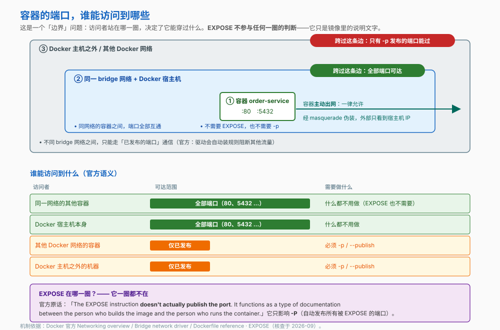
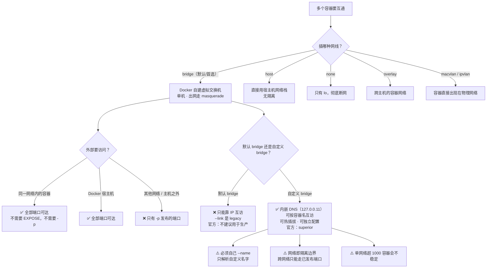

# 第 8 课：容器网络

> 所属阶段：阶段 3《数据与网络》｜ 水平：入门 ｜ 本课知识点：网络驱动全景、bridge 网络与端口映射、自定义网络与 DNS 服务发现
> 故事情节：`order-service`、postgres、redis 三个容器互相 ping 不通，端口还冲突了

## 🎯 本课目标

- 说清各网络驱动的定位，知道单机场景默认该用哪个
- 正确使用端口映射，并理解 `EXPOSE` 到底做了什么
- 用自定义网络实现按容器名的服务发现，并把网络当作隔离边界

## 📌 知识点导航

| 知识点 | 关键点 | 状态 |
|--------|--------|------|
| 网络驱动全景 | bridge / host / none / overlay / macvlan 各自解决什么问题 / 单机默认用 bridge | ✅ 已完成 |
| bridge 网络与端口映射 | 默认 bridge 的行为 / -p 与 -P 的区别 / 容器出网与端口冲突 | ✅ 已完成 |
| 自定义网络与 DNS 服务发现 | 自定义 bridge 内可按容器名解析 / 默认 bridge 不支持 / 网络即隔离边界 | ✅ 已完成 |

---

## 第一幕：起源与场景引入

课 7 结束时，数据能活下来了。小杨现在手上有三个容器：`order-service`、`postgres`、`redis`。接下来要让它们互相说话。

他的做法很朴素——查 IP，写进配置：

```bash
docker inspect postgres --format '{{range .NetworkSettings.Networks}}{{.IPAddress}}{{end}}'
# 172.17.0.3
```

`order-service` 连 `172.17.0.3:5432`，跑通了。

第二天他重启了机器。再跑，连不上了——**postgres 的 IP 变成了 `172.17.0.4`**。

他想着那不如用容器名：

```bash
docker exec order-service ping -c 2 postgres
# ping: bad address 'postgres'
```

容器名**根本解析不了**。

他一咬牙：那我把端口都发布出来，全走宿主机总行了吧？于是起了两个 `order-service` 想做负载：

```bash
docker run -d --name order-1 -p 8080:80 order-service
docker run -d --name order-2 -p 8080:80 order-service
# docker: Error response from daemon: ... port is already allocated.
```

**端口冲突。**

> 🎬 **场景**：三个问题叠在一起：名字解析不了、IP 会变、端口会撞。**容器的网络到底是怎么组织的？**

---

## 第二幕：认知冲突

> ❓ **问题**：容器之间为什么不能用名字互相访问？为什么 IP 会变？为什么端口会冲突？

这三个问题分别对应三层：

1. **端口冲突** → 端口发布的语义（知识点 2）——`-p` 到底在"发布"什么
2. **名字解析不了** → 这跟容器接在**哪个网络**上有关（知识点 3）
3. **IP 会变** → 既然 IP 不可靠，就必须有"按名字找"的机制（知识点 3，答案在 DNS）

而要理解这一切，得先知道容器"插网线"有几种插法（知识点 1）。

---

## 第三幕：层层揭示

### 知识点 1：网络驱动全景

> 本知识点关键点：bridge / host / none / overlay / macvlan 各自解决什么问题 / 单机默认用 bridge

#### 一句话定义

**网络驱动**决定了容器以什么方式"接进网络"——是接一个 Docker 自建的虚拟交换机，还是直接用宿主机的网络栈，还是彻底断网。

#### 直觉建立（类比）

给容器"插网线"，有几种插法：

| 驱动 | 类比 |
|---|---|
| **bridge** | 接到**家里的路由器**——容器有自己的内网 IP，出门统一走 NAT |
| **host** | 直接**用主机的那根网线**——不分家，用主机的 IP 和端口 |
| **none** | **不插网线**——只有回环 lo |
| **overlay** | 跨房子的**专线**——把多台机器上的容器连成一张网 |
| **macvlan / ipvlan** | 给容器分配一个**独立的门牌号**，让它直接出现在物理网络上 |

> 💡 **类比的边界**：bridge 类比里的"路由器"其实是**软件网桥**（Linux bridge），不是物理设备；而且它同时承担了 NAT（官方叫 masquerade）的角色。

#### 核心原理

**官方的驱动清单**（Linux 上内置）：

| 驱动 | 官方描述 | 典型用途 |
|---|---|---|
| **bridge** | 默认网络驱动 | 单机多容器互联——**绝大多数场景用它** |
| **host** | 移除容器与 Docker 主机之间的网络隔离 | 需要极致网络性能、或要用主机端口而不想映射 |
| **none** | 把容器与主机及其他容器完全隔离 | 跑纯计算任务、安全沙箱 |
| **overlay** | 把多个 Docker 守护进程连在一起 | Swarm 集群、跨主机容器通信 |
| **ipvlan** | 把容器接到外部 VLAN | 需要接入现有网络分段 |
| **macvlan** | 容器在主机网络上表现为一个独立设备 | 容器要有自己的 MAC 地址（如某些老式监控/授权） |

**一、装好 Docker 就有三个网络**

```bash
docker network ls
# NETWORK ID     NAME      DRIVER    SCOPE
# 17e324f45964   bridge    bridge    local
# 6ed54d316334   host      host      local
# 7092879f2cc8   none      null      local
```

> 注意 `none` 的 DRIVER 列是 `null`。

**二、容器并不知道自己接的是什么网络**

官方有一段很关键的描述：

> "A container has **no information about what kind of network it's attached to**, or whether its network peers are also Docker containers. A container only sees a network interface with an IP address, a gateway, a routing table, DNS services, and other networking details."

这句话是理解容器的钥匙：**容器里看到的只是一块普通的网卡**。它不知道自己"在 Docker 里"。这也是为什么同一份镜像能在不同网络配置下跑。

**三、br​idge 只管单机，跨主机要靠 overlay**

官方原话：bridge 网络适用于**同一个 Docker 守护进程主机**上的容器。要让跑在不同主机上的容器通信，要么在**操作系统层面自己做路由**，要么用 **overlay 网络**。

**四、一个容器可以同时接多个网络**

官方类比得很形象：

> "Connecting a container to a network can be compared to **connecting an Ethernet cable to a physical host**. Just as a host can be connected to multiple Ethernet networks, a container can be connected to multiple Docker networks."

比如一个前端容器可以同时接"有外网访问的 bridge 网络"和"只连后端服务的 `--internal` 网络"。

#### 示例演示

```bash
# 1) 看默认有哪些网络
docker network ls
# 预期：bridge / host / none 三条

# 2) 容器视角：它只看到一块网卡，不知道自己在 Docker 里
docker run --rm alpine ip addr show eth0
# 预期：inet 172.17.0.2/16 ...（IP 每次可能不同）

# 3) 看默认路由与 DNS
docker run --rm alpine cat /etc/resolv.conf
# 预期：默认 bridge 上拿到的是宿主机 /etc/resolv.conf 的一份副本

# 4) none：彻底断网
docker run --rm --network none alpine ip addr show
# 预期：只有 lo（回环），没有 eth0

# 5) 一个容器同时接两个网络
docker network create net-a
docker network create net-b
docker run -d --name multi --network net-a alpine sleep 600
docker network connect net-b multi
docker inspect multi --format '{{range $k, $v := .NetworkSettings.Networks}}{{$k}} {{end}}'
# 预期：net-a net-b

docker rm -f multi; docker network rm net-a net-b
```

#### 常见误区

1. **"容器知道自己在 Docker 网络里"** → 不知道。官方明说容器对网络类型一无所知，只看得到网卡、网关、路由表和 DNS。
2. **"bridge 能跨主机"** → 不能。bridge 只覆盖**单个 Docker 守护进程所在主机**；跨主机要用 overlay。

#### 一句话记住

> **网络驱动 = 容器插网线的方式；单机默认且首选 bridge，跨主机才需要 overlay。**

#### 官方文档

- [Networking overview（Docker 官方）](https://docs.docker.com/engine/network/)——驱动清单、容器视角、多网络连接

---

### 知识点 2：bridge 网络与端口映射

> 本知识点关键点：默认 bridge 的行为 / -p 与 -P 的区别 / 容器出网与端口冲突

#### 一句话定义

**端口发布（publish）**是把容器端口"映射"到 Docker 主机某个端口上的动作——它是**让容器端口能被主机之外访问到的唯一手段**。

#### 直觉建立（类比）

一栋办公楼**只有一个大门地址**（宿主机 IP），楼里每家公司有**内部分机号**（容器端口）。`-p` 做的就是"把某部分机号，对外公布成大门口的某个窗口号"。

> 💡 **类比的边界**：真实办公楼的窗口号你可能只想开给内部员工；而 Docker 的 `-p 8080:80` 默认是把窗口开在**所有网卡**上（IPv4 + IPv6），外面的人也能敲——这点非常容易疏忽，下面会讲。

#### 核心原理



**一、bridge 网络的四条默认行为**（官方原话归纳）

| 行为 | 官方描述 |
|---|---|
| 放行 | 允许**主机**和**同一 bridge 网络内的其他容器**无限制访问本网络内的容器 |
| 阻断 | 阻断**其他网络的容器**和 **Docker 主机之外**的访问 |
| 出网 | 用 **masquerading**（伪装）让容器访问外网；外部网络设备**只看得到 Docker 主机的 IP** |
| 发布 | 支持**端口发布**，在容器端口与主机 IP 的端口之间转发流量 |

**二、`EXPOSE` 到底做了什么——兑现课 4 的伏笔**

官方原话，字字关键：

> "The `EXPOSE` instruction **doesn't actually publish the port**. It functions as a type of **documentation** between the person who builds the image and the person who runs the container, about which ports are intended to be published."

所以：

- `EXPOSE` **不会**让端口能从外部访问
- 它只是**镜像作者写给运行者的一段说明**
- 它唯一真正起作用的地方是配合 `-P`
- 官方还补了一句：**同一网络内的容器之间可以用任意端口通信，压根不需要 expose 或 publish**

**三、`-p` 与 `-P` 的区别**

| | `-p`（小写） | `-P`（大写） |
|---|---|---|
| 含义 | 精确发布**你指定**的端口 | 自动发布镜像里**所有被 `EXPOSE` 过**的端口 |
| 宿主端口 | 你指定（`8080:80`） | **随机高位端口**（官方：ephemeral high-ordered host port） |
| 例子 | `-p 8080:80` | `-P` 后 `docker port` 看到 `80/tcp -> 0.0.0.0:32768` |

> ⚠️ 官方提醒了一个细节：**`-P` 给 TCP 和 UDP 分配的宿主端口不是同一个**。如果你 `EXPOSE 80/tcp` 和 `EXPOSE 80/udp`，`-P` 之后 TCP 和 UDP 会落在两个不同的高位端口上。

**四、容器出网：一律放行 + 伪装**

官方原话：容器用 masquerading 访问外部网络，**外部网络设备只看得到 Docker 主机的 IP**。这就是为什么容器里 `ping google.com` 开箱即用，不需要任何配置。

**五、端口为什么会冲突**

宿主端口是**独占资源**。两个容器都 `-p 8080:80`，第二个必然失败：

```
docker: Error response from daemon: ... port is already allocated.
```

因为"大门口的 8080 窗口"只能给一家公司。要跑两份，就得换宿主端口：`-p 8081:80`。

#### 示例演示

```bash
# 1) EXPOSE 不会发布端口 —— 不 -p 就访问不到
docker run -d --name web-nopublish nginx:alpine
docker port web-nopublish
# 预期：空 —— 虽然 nginx 镜像里有 EXPOSE 80，但一个端口都没发布
# 此时从宿主机访问 http://localhost 的 80 端口，到不了这个容器

docker rm -f web-nopublish

# 2) -p 精确发布
docker run -d --name web-p -p 8080:80 nginx:alpine
docker port web-p
# 预期：80/tcp -> 0.0.0.0:8080
# 此时从宿主机访问 http://localhost:8080 就能看到 nginx 欢迎页

# 3) -P 自动发布到随机高位端口
docker run -d --name web-P -P nginx:alpine
docker port web-P
# 预期：80/tcp -> 0.0.0.0:32768   ← 这个 32768 每次可能不同

# 4) 端口冲突：同一个宿主端口给两个容器
docker run -d --name web-dup -p 8080:80 nginx:alpine
# 预期：docker: Error response from daemon: ... port is already allocated.

# 5) 容器出网不需要任何配置（前提是宿主机本身能上网）
docker exec web-p ping -c 2 -W 3 docker.com
# 预期：2 packets transmitted, 2 packets received
# 外部网络看到的是「Docker 主机的 IP」而不是容器 IP —— 这就是 masquerade

docker rm -f web-p web-P
```

#### 常见误区

1. **"Dockerfile 里写了 `EXPOSE 8080`，容器运行后 8080 就能访问了"** → 不能。官方原话：`EXPOSE` **doesn't actually publish the port**，它只是文档。
2. **"`-p 8080:80` 只在本机可访问"** → ⚠️ 恰恰相反。官方明说：**不指定宿主地址时，默认是让容器端口在宿主机的所有地址（IPv4 和 IPv6）上可用**。想只让本机访问，必须显式写成 `-p 127.0.0.1:8080:80`；想限定 IPv4，写成 `-p 0.0.0.0:8080:80`。
3. **"同一网络内的容器也要靠 `-p` 才能互访"** → 不需要。官方原话：接在同一个用户自定义 bridge 网络上的容器，**彼此等效于开放了所有端口**，任意端口可直接通信。

#### 一句话记住

> **`EXPOSE` 是写给人的说明，`-p` 才是真正开门的动作；同网络内不用开门，跨网络/对外部必须开门。**

#### 官方文档

- [Dockerfile reference · EXPOSE（Docker 官方）](https://docs.docker.com/reference/dockerfile/)——"doesn't actually publish the port"
- [Bridge network driver（Docker 官方）](https://docs.docker.com/engine/network/drivers/bridge/)——四条默认行为、默认绑定地址
- [Networking overview · Published ports（Docker 官方）](https://docs.docker.com/engine/network/)——端口可访问范围的官方表述

---

### 知识点 3：自定义网络与 DNS 服务发现

> 本知识点关键点：自定义 bridge 内可按容器名解析 / 默认 bridge 不支持 / 网络即隔离边界

#### 一句话定义

**用户自定义 bridge 网络**自带一个内嵌 DNS 服务器，让同一网络内的容器可以**按容器名互相解析**；而**默认 bridge 网络没有这个能力**——这就是"名字 ping 不通"的根因。

#### 直觉建立（类比）

- **默认 bridge** = 一间**没装电话簿的大办公室**：你只知道同事的工位号（IP），不知道名字。而且工位号每天重排。
- **用户自定义 bridge** = 一间**配了内部通讯录的办公室**：报名字就能接通（`ping postgres` 直接通）。

> 💡 **类比的边界**：这本"通讯录"**只在房间内生效**。换到另一间办公室（另一个网络），照样查不到——网络本身就是隔离边界。

#### 核心原理

**一、官方定论**

> "**User-defined bridge networks are superior to the default `bridge` network.**"

而且官方对默认 bridge 的评价更直接：

> "The default `bridge` network is **considered a legacy detail of Docker and is not recommended for production use**."

**二、五大差异**（官方逐条列出）

| # | 差异 | 说明 |
|---|---|---|
| 1 | **自动 DNS 解析** | 默认 bridge 上容器**只能靠 IP 互访**，除非用 **`--link`（已被官方标记为 legacy）**；自定义网络上可以按**名字或别名**互访 |
| 2 | **更好的隔离** | 所有没指定 `--network` 的容器都会挂到默认 bridge 上——官方称这**是个风险**（"unrelated stacks/services/containers are then able to communicate"）；自定义网络是"限定范围"的，只有挂上去的容器才能通信 |
| 3 | **可热插拔** | 自定义网络支持容器**运行中**随时 `connect` / `disconnect`；要从默认 bridge 上摘下来，必须**停掉容器再用不同网络选项重建** |
| 4 | **可独立配置** | 默认 bridge 是全局共享一份设置（MTU、`iptables` 规则），而且**配置它要改 Docker 之外的东西，还需重启 Docker**；每个自定义网络创建时可单独配置 |
| 5 | **环境变量共享（唯一反向差异）** | 默认 bridge 上用 `--link` 能共享环境变量，自定义网络**不能**。官方说没关系，因为有三样更好的替代：**卷**、**compose 文件**、**swarm 的 secrets/configs** |

> 第 1 条还补了一个"复杂度的理由"：默认 bridge 上的 `--link` **必须双向创建**，容器一多就指数级变复杂；改用直接改 `/etc/hosts` 则"会产生难以排查的问题"。

**三、内嵌 DNS 服务器的地址是 `127.0.0.11`**

官方说明：

- 接**默认 bridge** 的容器：拿到的是宿主机 `/etc/resolv.conf` 的**一份副本**
- 接**自定义网络**的容器：使用 Docker 的**内嵌 DNS 服务器**
- 内嵌 DNS 会把外部域名的查询**转发给宿主机配置的 DNS 服务器**
- **内嵌 DNS 服务器地址是 `127.0.0.11`**，没有 IPv6 等价地址，但这个 IPv4 地址**在纯 IPv6 容器里也能用**

> 官方还提到一个排查要点：默认 bridge 上配多个 DNS 服务器时，解析行为取决于容器的 resolver 库——**有的并行查询并采用最先返回的响应，哪怕那是 NXDOMAIN**。而自定义网络上的内嵌 DNS **按序查询上游**，遇到成功响应或 NXDOMAIN 就停。

**四、⚠️ 服务发现只认"你起的名字"**

官方原话：

> "Automatic service discovery only resolves **custom container names**, not default automatically generated names."

也就是说，必须自己用 `--name` 起名字（或用 `--network-alias` 加别名）。不写 `--name`，Docker 自动生成的随机名字是**解析不了**的。

**五、网络即隔离边界**

- 官方：不同 bridge 网络上的容器，**只能经由已发布的端口**互相通信（驱动会自动安装规则阻断其他流量）
- 官方示例里，同一个容器跨网络访问另一个网络的容器时：按名字 → `ping: bad address`；按 IP → **100% packet loss**

**六、网络管理命令**

| 命令 | 作用 |
|---|---|
| `docker network create <名>` | 创建网络（`-d bridge` 可省略，默认就是 bridge） |
| `docker network ls` | 列出网络 |
| `docker network inspect <名>` | 看详情——**哪些容器挂在上面、各自 IP 多少** |
| `docker network connect <网络> <容器>` | 把**运行中的**容器接上网络 |
| `docker network disconnect <网络> <容器>` | 把运行中的容器摘下网络 |
| `docker network rm <名>` | 删除网络（**要先断开上面所有容器**） |

> **网络排障三步**（遇到"连不上"就按这个顺序查）：
>
> | 步骤 | 命令 | 看什么 / 判断依据 |
> |---|---|---|
> | ① 在不在同一个网络 | `docker network inspect <网络> --format '{{range .Containers}}{{.Name}} {{end}}'` | 双方容器名**都在**列表里吗？不在的话名字根本解析不了 |
> | ② 名字解析得了吗 | `docker exec <容器> ping -c 2 <对方容器名>` | 报 `bad address` = DNS 没解析。多半是**不在同一自定义网络**，或对方**没写 `--name`** |
> | ③ 端口通不通 | `docker exec <容器> wget -qO- http://<对方容器名>:<端口>` | 同网络内**不需要 `-p`**；跨网络或对外部**必须有 `-p`** |
>
> 两个辅助命令：`docker port <容器>` 看实际发布了哪些端口；`docker exec <容器> cat /etc/resolv.conf` 看用的是内嵌 DNS（`127.0.0.11`）还是宿主机 resolv.conf 的副本——**看到 `127.0.0.11` 才说明这个容器在自定义网络上**。

#### 示例演示

```bash
# 1) 复现第一幕的失败：默认 bridge 上按名字 ping 不通
docker run -d --name app1 alpine sleep 600
docker run -d --name app2 alpine sleep 600
docker exec app1 ping -c 2 app2
# 预期：ping: bad address 'app2'      ← 名字解析不了

# 按 IP 可以通
docker inspect app2 --format '{{range .NetworkSettings.Networks}}{{.IPAddress}}{{end}}'
# 预期：172.17.0.3（每次可能不同）
docker exec app1 ping -c 2 172.17.0.3
# 预期：2 packets transmitted, 2 packets received

# 2) 建自定义网络，按名字 ping 通
docker network create order-net
docker rm -f app1 app2
docker run -d --name app1 --network order-net alpine sleep 600
docker run -d --name app2 --network order-net alpine sleep 600
docker exec app1 ping -c 2 app2
# 预期：PING app2 (172.18.0.3) —— 通了！

# 3) 看内嵌 DNS
docker exec app1 cat /etc/resolv.conf
# 预期：nameserver 127.0.0.11

# 4) 网络即隔离边界：另一个网络的容器访问不到
docker run -d --name outsider alpine sleep 600      # 默认 bridge
docker exec outsider ping -c 2 app1
# 预期：ping: bad address 'app1'
docker exec outsider ping -c 2 172.18.0.2
# 预期：100% packet loss（IP 也不通，除非走已发布的端口）

# 5) 热插拔：运行中把 outsider 接进 order-net
docker network connect order-net outsider
docker exec outsider ping -c 2 app1
# 预期：通了 —— 不需要停容器、不需要重建

# 6) 看网络上挂了谁
docker network inspect order-net --format '{{range .Containers}}{{.Name}} {{end}}'
# 预期：app1 app2 outsider

docker rm -f app1 app2 outsider
docker network rm order-net
```

#### 常见误区

1. **"不写 `--network` 也能按容器名互访"** → 不能。**默认 bridge 没有自动 DNS 解析**，只能靠 IP 或 legacy `--link`。
2. **"自定义网络和默认网络只是名字不同"** → 差五条，官方明确说自定义网络**优于**默认 bridge，且默认 bridge **不建议用于生产**。
3. **"起了容器就能被按名解析"** → 官方提醒：服务发现**只解析你自定义的容器名**，不解析 Docker 自动生成的随机名。所以 `--name` 不是可选项，是必需品。
4. **"容器一多就能一直往一个网络里塞"** → 官方提醒：受 Linux 内核限制，**单个 bridge 网络连到 1000 个容器以上时会变得不稳定**，容器间通信可能中断。

#### 一句话记住

> **用自定义 bridge 网络，容器之间就能按名字互访；不指定 `--network` 就落到默认 bridge，那里只能靠 IP——而且官方不建议用于生产。**

#### 官方文档

- [Bridge network driver（Docker 官方）](https://docs.docker.com/engine/network/drivers/bridge/)——五大差异、"superior"定论、legacy 评价、1000 容器上限
- [Networking overview · DNS services（Docker 官方）](https://docs.docker.com/engine/network/)——内嵌 DNS `127.0.0.11`、默认 bridge 拿 resolv.conf 副本

---

## 第四幕：实操验证

把第一幕那三个问题逐个解决掉。

> ⚠️ 本讲义的命令与预期输出为**纸面预期**（写作时本机 Docker 守护进程未运行）。IP、随机端口等具体数值与你实际运行会不同。

### 步骤 1：复现"名字解析不了、IP 会变"

```bash
docker run -d --name postgres alpine sleep 600
docker run -d --name order-service alpine sleep 600

# 按名字：失败
docker exec order-service ping -c 2 postgres
# 预期：ping: bad address 'postgres'

# 按 IP：能通，但 IP 不可靠
docker inspect postgres --format '{{range .NetworkSettings.Networks}}{{.IPAddress}}{{end}}'
# 预期：172.17.0.2
docker exec order-service ping -c 2 172.17.0.2
# 预期：通

# 删掉重建，IP 就变了
docker rm -f postgres
docker run -d --name postgres alpine sleep 600
docker inspect postgres --format '{{range .NetworkSettings.Networks}}{{.IPAddress}}{{end}}'
# 预期：172.17.0.3   ← 同一个名字，IP 变了
```

> ✅ **回扣场景**：这就是第一幕"第二天连不上"的根因——**IP 是动态分配的，名字才是稳定标识**。

### 步骤 2：建自定义网络，用名字连通

```bash
docker rm -f postgres order-service

docker network create order-net

docker run -d --name postgres --network order-net \
  --mount type=volume,src=pgdata,dst=/var/lib/postgresql/data \
  -e POSTGRES_PASSWORD=devpass \
  postgres:16

# 用 alpine 充当「应用容器」的替身——真实场景换成你自己的镜像
# （也就是故事里的 order-service，它是虚构镜像，这里不能直接跑）
docker run -d --name order-service --network order-net \
  -e DB_HOST=postgres \
  alpine sleep 600

# 按名字：通了
docker exec order-service ping -c 2 postgres
# 预期：PING postgres (172.18.0.2) ...

# 配置里直接写容器名就行，IP 变了也不怕
docker exec order-service printenv DB_HOST
# 预期：postgres
```

> ✅ **回扣场景**：同样的两个容器，只多了 `--network order-net`，`ping postgres` 就从 `bad address` 变成通。
>
> ⚠️ `postgres:16` 只是示例版本，换成你需要的版本即可。

### 步骤 3：验证 EXPOSE 与端口发布

```bash
# nginx 镜像里有 EXPOSE 80，但不 -p 就一个端口都没发布
docker run -d --name web-nopublish --network order-net nginx:alpine
docker port web-nopublish
# 预期：空

# -p 之后才真正开门
docker rm -f web-nopublish
docker run -d --name web --network order-net -p 8080:80 nginx:alpine
docker port web
# 预期：80/tcp -> 0.0.0.0:8080

# 同一网络内的容器，不需要 -p 也能访问 web 的 80
docker exec order-service wget -qO- http://web | head -3
# 预期：nginx 欢迎页 HTML   ← 没发布端口，同网络照样能访问
```

### 步骤 4：验证网络即隔离边界

```bash
# 起一个在默认 bridge 上的"外人"
docker run -d --name outsider alpine sleep 600

docker exec outsider ping -c 2 postgres
# 预期：ping: bad address 'postgres'      ← 名字查不到

docker inspect postgres --format '{{range .NetworkSettings.Networks}}{{.IPAddress}}{{end}}'
# 预期：172.18.0.2
docker exec outsider ping -c 2 172.18.0.2
# 预期：100% packet loss                  ← IP 也不通（跨网络被阻断）

# 运行中接进来就通了
docker network connect order-net outsider
docker exec outsider ping -c 2 postgres
# 预期：通

docker network disconnect order-net outsider
docker exec outsider ping -c 2 postgres
# 预期：又不通了
```

### 步骤 5：收尾与清理

```bash
docker network inspect order-net --format '{{range .Containers}}{{.Name}} {{end}}'
# 预期：列出挂在网络上的容器

docker rm -f order-service postgres web outsider
docker network rm order-net          # 先断开容器才能删
docker volume rm pgdata
```

---

## 第五幕：体系收束

> 📍 **全局定位**：阶段 3《数据与网络》第二幕，你解决了**"服务互相找得到"**。
>
> 阶段 3 的三课分工：
>
> | 课 | 解决的问题 | 关键手段 |
> |---|---|---|
> | 课 7 | 数据怎么活过容器 | **挂载**（volume / bind mount / tmpfs） |
> | **课 8** | **服务怎么互相找到、外部怎么进来** | **自定义网络 + 端口发布** |
> | 课 9 | 多容器怎么一键编排 | compose 把这两课串起来 |
>
> 现在 `order-service` 能按名字找到 `postgres`，数据能活过容器，外部也能通过 `8080` 访问进来。但整个环境是靠**一串很长的 `docker run` 命令**搭起来的——记不住、易出错、换台机器就得重来。

> 🔗 **下一步**：课 9《Compose 编排多容器》——用一个 `compose.yaml` 文件描述"卷 + 网络 + 多个服务"，一条 `docker compose up` 拉起整套环境。
>
> 这会同时收束课 7 的挂载与课 8 的网络：**compose 会为每个项目自动创建一个自定义网络**，所以服务之间天然就能按服务名互访——本课的知识点 3 会在那里自动生效。

---

## 🐞 常见误区

1. **"`EXPOSE` 能把端口暴露出去"** → 不能。官方原话：`EXPOSE` **doesn't actually publish the port**，它只是镜像作者写给运行者的文档。真正开门的是 `-p` / `-P`。

2. **"`-p 8080:80` 只有本机访问得到"** → ⚠️ 反了。官方明说：**不指定宿主地址时默认是宿主机的所有地址（IPv4 + IPv6）**，等于 `0.0.0.0`。只想本机访问必须写 `-p 127.0.0.1:8080:80`。

3. **"同一网络里的容器也要 `-p` 才能互访"** → 不需要。官方原话：接在同一自定义 bridge 网络上的容器**彼此等效于开放了所有端口**。

4. **"不指定 `--network` 也能按容器名互访"** → 不能。**默认 bridge 没有自动 DNS 解析**，而且官方明确说它 "is not recommended for production use"。

5. **"容器起好了就能按名解析"** → 官方提醒：服务发现**只解析自定义的容器名**，不解析 Docker 自动生成的随机名。所以 `--name` 是必需品。

---

## 一图总结



---

## 📋 命令速查卡

| 命令 | 作用 | 本课出现在哪 |
|------|------|------------|
| `docker network ls` | 列出网络（默认有 bridge / host / none） | 知识点 1 / 演示 |
| `docker network create <名>` | 创建用户自定义网络（默认 bridge 驱动） | 知识点 3 / 步骤 2 |
| `docker network inspect <名>` | 看网络上挂了哪些容器、各自 IP | 知识点 3 / 步骤 5 |
| `docker network connect <网络> <容器>` | 把**运行中**的容器接上网络（热插拔） | 知识点 3 / 步骤 4 |
| `docker network disconnect <网络> <容器>` | 把运行中的容器摘下网络 | 知识点 3 / 步骤 4 |
| `docker network rm <名>` | 删除网络（**需先断开所有容器**） | 知识点 3 / 步骤 5 |
| `--network <网络>` | 启动容器时指定网络 | 知识点 3 / 步骤 2 |
| `-p <宿主端口>:<容器端口>` | 精确发布端口（**默认绑 0.0.0.0，非仅本机**） | 知识点 2 / 步骤 3 |
| `-p 127.0.0.1:<宿主>:<容器>` | 只让本机访问的发布方式 | 知识点 2 |
| `-P` | 自动发布镜像里所有 `EXPOSE` 过的端口到**随机高位端口** | 知识点 2 / 演示 |
| `docker port <容器>` | 查看容器实际发布的端口映射 | 知识点 2 / 步骤 3 |
| `docker exec <容器> cat /etc/resolv.conf` | 看 DNS 配置；自定义网络上应为 `nameserver 127.0.0.11` | 知识点 3 / 演示 |

---

## 课后小测

**Q1**：小杨在 Dockerfile 里写了 `EXPOSE 8080`，容器跑起来后同事从自己电脑上访问宿主机的 8080 端口，连不上。原因是？

- A. `EXPOSE` 写错了，应该写 `EXPOSE 80`
- B. `EXPOSE` 不会真正发布端口，它只是镜像作者写给运行者的文档，需要运行时的 `-p` 才会开门
- C. 需要在 Dockerfile 里再加一行 `PUBLISH 8080`
- D. 宿主机防火墙挡住了，跟 Docker 无关

<details><summary>答案与解析</summary>

**答案：B**。官方原话："The `EXPOSE` instruction **doesn't actually publish the port**. It functions as a type of documentation between the person who builds the image and the person who runs the container."

`EXPOSE` 唯一真正起作用的地方是配合 `-P`（自动发布所有被 `EXPOSE` 过的端口到随机高位端口）。D 也可能是现实中的原因之一，但**这道题问的是 Docker 层面的根因**——即便防火墙全开，没有 `-p` 也访问不到。

</details>

**Q2**：关于默认 bridge 网络与用户自定义 bridge 网络，下列说法正确的是？

- A. 两者只是名字不同，功能完全一样
- B. 默认 bridge 支持按容器名解析，自定义网络只支持按 IP
- C. 自定义网络提供**按容器名的自动 DNS 解析**、更好的隔离、运行中热插拔、且可独立配置；官方明确说自定义网络**优于**默认 bridge，默认 bridge **不建议用于生产**
- D. 自定义网络更慢，所以生产应该用默认 bridge

<details><summary>答案与解析</summary>

**答案：C**。官方原话："**User-defined bridge networks are superior to the default `bridge` network.**" 而对默认 bridge 的评价是："considered a **legacy detail of Docker** and is **not recommended for production use**"。

B 说反了——**默认 bridge 上容器只能靠 IP 互访**（`ping 容器名` 会得到 `ping: bad address`），自定义网络才有内嵌 DNS（地址 `127.0.0.11`）。

另外两个容易漏的点：①服务发现**只解析你自己用 `--name` 起的名字**，Docker 自动生成的随机名解析不了；②受 Linux 内核限制，**单个 bridge 网络连到 1000 个容器以上会变得不稳定**。

</details>

**Q3**：小杨想让刚起的 Web 服务**只能在本机访问**，于是写了 `-p 8080:80`。结果如何？

- A. 正确，只有本机访问得到
- B. 恰恰相反——不指定宿主地址时，默认是绑到宿主机的**所有地址**（IPv4 + IPv6），外部机器也能访问；要实现目的必须写 `-p 127.0.0.1:8080:80`
- C. 会报错，因为必须显式指定地址
- D. 取决于镜像里有没有 `EXPOSE`

<details><summary>答案与解析</summary>

**答案：B**。官方原话：当 `-p 80` 或 `-p 8080:80` 这样的写法**没有给出宿主地址**时，"the default is to make the container's port 80 available on **all host addresses, IPv4 and IPv6**"。

这是一个**非常常见的安全疏忽**——你以为只在本机开了个调试服务，其实它已经暴露在所有网卡上了。想只限本机：`-p 127.0.0.1:8080:80`；想限定 IPv4：`-p 0.0.0.0:8080:80`。

D 不成立——`-p` 完全不依赖 `EXPOSE`，官方说"Regardless of the `EXPOSE` settings, you can override them at runtime by using the `-p` flag"。

</details>

---

## 🚀 下一批接力提示词

> 学完本课后，**复制下面这段文字发给 AI**，即可无缝进入下一批（无需重新描述上下文）：

```
继续学 Docker。我的学习档案在 docker/00-学习档案.md，
刚学完阶段 3《数据与网络》的课《容器网络》知识点 网络驱动全景、bridge 网络与端口映射、自定义网络与 DNS 服务发现，
请按大纲继续讲解下一批知识点。
```

## 🧭 课程导航

⬅️ **上一课**：[课 7：数据持久化](lesson-07-数据持久化.md)

➡️ **下一课**：[课 9：Compose 编排多容器](lesson-09-Compose编排多容器.md)

📚 **返回目录**：[课程目录](../../../02-课程目录.md)
