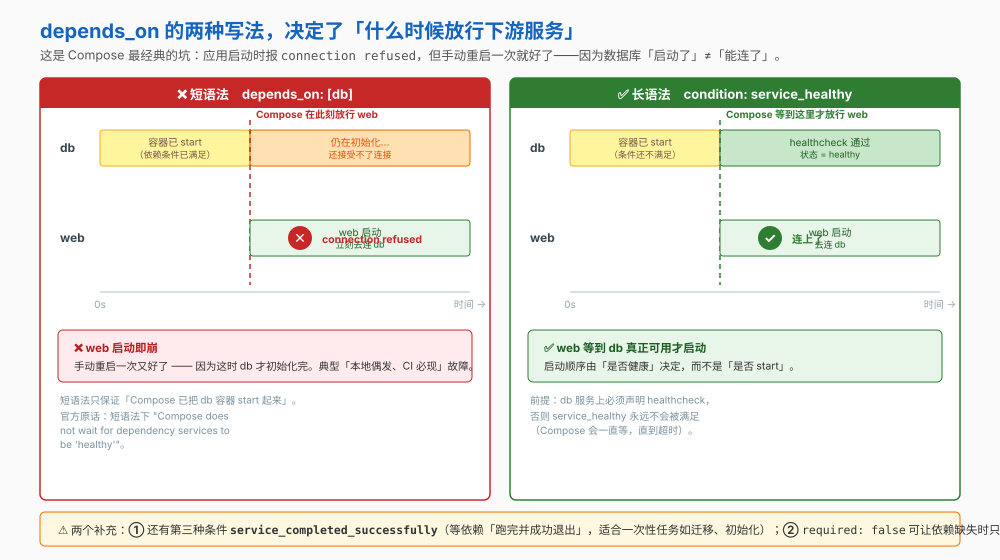
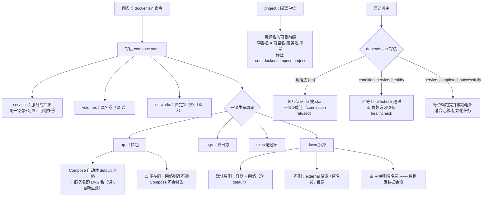

# 第 9 课：Compose 编排多容器

> 所属阶段：阶段 3《数据与网络》｜ 水平：入门 ｜ 本课知识点：compose 文件结构、一键本地开发环境、健康检查与启动顺序
> 故事情节：5 条又长又容易敲错的 `docker run`，变成一个 `docker compose up`

## 🎯 本课目标

- 写得出多服务 compose 文件，并知道几个 YAML 层面的坑
- 一键拉起并管理本地开发环境，清楚 `down` 到底删了什么
- 用健康检查 + `depends_on` 条件解决"数据库还没好，应用先崩了"

## 📌 知识点导航

| 知识点 | 关键点 | 状态 |
|--------|--------|------|
| compose 文件结构 | services / networks / volumes 三段 / 环境变量与 env_file / Compose V1 已停更，用 docker compose | ✅ 已完成 |
| 一键本地开发环境 | up -d / down / logs -f / exec / 挂源码做热重载 | ✅ 已完成 |
| 多文件拆分与复用 | `-f` 多文件按序 merge / `extends` 服务级继承 / `include` 模块化拼装 / `compose config` 看最终生效 | ✅ 已完成 |
| 健康检查与启动顺序 | HEALTHCHECK 指令 / depends_on 只等启动不等就绪 / condition: service_healthy | ✅ 已完成 |

---

## 第一幕：起源与场景引入

课 8 结束时，环境终于跑通了。但它是这样搭起来的：

```bash
docker network create order-net

docker volume create pgdata
docker run -d --name postgres --network order-net \
  --mount type=volume,src=pgdata,dst=/var/lib/postgresql/data \
  -e POSTGRES_PASSWORD=devpass postgres:16

docker run -d --name redis --network order-net redis:7

docker run -d --name order-service --network order-net \
  -e DB_HOST=postgres -e REDIS_HOST=redis \
  -p 8080:80 order-service

docker run -d --name nginx --network order-net -p 80:80 \
  -v "$(pwd)"/nginx.conf:/etc/nginx/nginx.conf:ro nginx:alpine
```

**四条命令，二十多个参数。** 小杨把它们写进了团队的 Wiki。

新同事入职第一天，照着 Wiki 敲——漏了一个 `--network order-net`，服务起来了但互相连不上，排查了一下午。

更麻烦的是：**这四条命令还解决不了一个问题**。第二天小杨发现，有时 `order-service` 会启动失败，报 `connection refused`；手动重启一次就好了。因为**数据库容器"启动了"，不代表它"能连了"**。

> 🎬 **场景**：环境能不能**用一个文件描述清楚**，并且**保证启动顺序**？

---

## 第二幕：认知冲突

> ❓ **问题**：这四条命令为什么不直接写进文件？写进去之后，启动顺序的问题又该怎么解决？

答案分三层：

1. **怎么描述多服务** → compose 文件的结构（知识点 1）
2. **怎么一键拉起** → compose 的生命周期命令（知识点 2）
3. **怎么保证顺序** → `depends_on` + 健康检查（知识点 3）

---

## 第三幕：层层揭示

### 知识点 1：compose 文件结构

> 本知识点关键点：services / networks / volumes 三段 / 环境变量与 env_file / Compose V1 已停更，用 docker compose

#### 一句话定义

**Compose** 用一个 YAML 文件声明式地描述"整个应用由哪些服务组成、它们怎么联网、数据存哪"，然后用一条命令把它整体创建出来。

> **先回答一个常见困惑**：Compose **不是** `docker run` 的替代品，它是 `docker run` 的**批量声明式包装**。你写进 compose 文件的每一条（`image` / `ports` / `volumes` / `networks` / `environment`），Compose 最终都会翻译成等价的 `docker run` 参数去执行。所以前两课学的概念**一个都没作废**——只是不用再手敲了。

#### 直觉建立（类比）

从**「一份操作清单」**变成**「一张配置图纸」**：

| | 命令行方式 | Compose 方式 |
|---|---|---|
| 表达的是 | **怎么做**（一步步敲） | **要什么**（声明最终结果） |
| 出错时 | 环境处于半搭好的状态 | 改文件，重跑 |
| 可分享 | 靠复制粘贴命令 | 传一个文件 |

> 💡 **类比的边界**：Compose 只负责**在一台机器上把这一组容器拉起来**，它不是集群编排调度器——不负责跨机器调度、不负责生产级自愈。那个话题属于阶段 5 的选型讨论。

#### 核心原理

**一、官方的应用模型**

| 概念 | 官方定义 |
|---|---|
| **service（服务）** | "an abstract concept implemented on platforms by running **the same container image, and configuration, one or more times**"——服务 ≠ 容器，一个服务可以跑多个副本 |
| **network（网络）** | 服务之间建立 IP 路由的平台能力抽象 |
| **volume（卷）** | 服务存储与共享持久化数据的高级文件系统挂载 |
| **config / secret** | 运行时/平台相关的配置数据；secret 是**敏感数据**的专用形态，以文件形式挂载进容器 |

**二、project（项目）是隔离单位**

官方原话：

> "A **project** is an individual deployment of an application specification on a platform. A project's name... is used to **group resources together and isolate them from other applications**, or other installation of the same Compose-specified application with distinct parameters."

在平台上创建资源时，Compose 会：
- 给资源名**加上项目名前缀**
- 打上标签 `com.docker.compose.project`

所以容器名的规律是 `项目名-服务名-序号`，官方 `docker compose ps` 示例长这样：

```
NAME                IMAGE              SERVICE       STATUS         PORTS
example-frontend-1  example/webapp     frontend      Up 2 minutes   0.0.0.0:443->8043/tcp
example-backend-1   example/database   backend       Up 2 minutes
```

> 项目名默认取**目录名**，可以用顶层 `name` 属性或 `-p` / `--project-name` 覆盖。官方特意提到：这样**同一份 `compose.yaml` 可以在同一套基础设施上不改一个字部署两份**，只要给不同的项目名。

**三、文件名**

官方规定的默认路径是 **`compose.yaml`**（首选）或 `compose.yml`，放在工作目录。也支持 `docker-compose.yaml` / `docker-compose.yml`（向后兼容）。⚠️ **如果两个文件都存在，Compose 优先用规范的 `compose.yaml`。**

**四、三段结构**

```yaml
services:          # 必需：定义各个服务
  web:
    image: nginx
    ports:
      - "8080:80"
  db:
    image: postgres:16
    volumes:
      - pgdata:/var/lib/postgresql/data

volumes:           # 可选：具名卷，供上面的服务引用
  pgdata:

networks:          # 可选：自定义网络
  backend:
```

> 顶层 `volumes` / `networks` 里**列出空对象就够了**——官方原文："The presence of these objects is sufficient to define them."

**五、⚠️ 用 `docker compose`，不是 `docker-compose`**

- **Compose V1** = `docker-compose`（带横杠，独立 Python 程序）——**已停止更新**
- **Compose V2** = `docker compose`（空格，Docker CLI 插件）——**当前版本**，Docker Desktop 自带

看到教程里写 `docker-compose up` 的，说明是旧文档。

**六、环境变量的两个细节**

| 细节 | 官方说明 |
|---|---|
| 优先级 | **`environment` 覆盖 `env_file`** |
| 覆盖的判定 | ⚠️ "This holds true **even if those values are empty or undefined**"——environment 里写了空值，也算覆盖 |
| YAML 布尔值 | `true` / `false` / `yes` / `no` **必须加引号**，否则被 YAML 解析器转成 True/False |

**七、三个 YAML 层面的坑**

**坑 1：`ports` 一定要加引号**

```yaml
ports:
  - "8080:80"     # ✅ 正确
  - 8080:80       # ❌ 会被 YAML 当成 60 进制浮点数！
```

官方原话：`HOST:CONTAINER` "should always be specified as a **(quoted) string**, to avoid conflicts with **YAML base-60 float**"。

**坑 2：`ports` 不指定宿主 IP 会绕过宿主防火墙**

官方的警告比课 8 讲的更严重：

> "If you do not specify a host IP (such as `127.0.0.1`), Docker binds to all interfaces (`0.0.0.0`), **bypassing host firewall rules**. This can expose the container directly to the internet if the host has a public IP address."

要只限本机：`- "127.0.0.1:8080:80"`。

**坑 3：compose 里的 `$` 要写成 `$$`**

Compose 会先做变量插值。想在容器里拿到 shell 变量，得转义：

```yaml
command: /bin/sh -c 'echo "hello $$HOSTNAME"'    # $$ 才会传给容器内的 shell
```

另外官方提醒：**与 Dockerfile 的 `CMD` 不同，compose 的 `command` 不会自动在镜像的 `SHELL` 上下文里执行**。如果命令用到 shell 特性（如变量展开），必须显式写 `/bin/sh -c`。

#### 示例演示

```yaml
# compose.yaml
services:
  web:
    image: nginx:alpine
    ports:
      - "8080:80"          # 引号不能省
    environment:
      DEBUG: "true"        # 布尔值要加引号
  db:
    image: postgres:16
    environment:
      POSTGRES_PASSWORD: devpass
    env_file:
      - ./db.env
    volumes:
      - pgdata:/var/lib/postgresql/data

volumes:
  pgdata:
```

```bash
# 校验文件（不启动），能查出不合法的字段
docker compose config
# 预期：输出解析并合并后的完整配置

# 看这个项目会创建哪些资源
docker compose ps
# 预期：列出 web / db 两行（还没启动的话状态为空）
```

#### 常见误区

1. **"`service` 就是容器"** → 不是。官方说服务是"用同一份镜像和配置运行**一次或多次**"的抽象——它可以有多个副本。
2. **"compose 文件里写了 `expose` 端口才能被其他服务访问"** → 不需要。官方原话：`expose` 定义的端口"**should not be published to the host machine**"，而且**如果镜像里已经 `EXPOSE` 过，即使 compose 文件不写，同一网络内的其他容器也看得到**（课 8 的知识点 2）。
3. **"`docker-compose` 和 `docker compose` 一样"** → 前者是已停更的 V1，后者是当前的 V2。

#### 一句话记住

> **compose 用 `services` / `networks` / `volumes` 三段声明"要什么"；项目名是隔离单位，容器名是 `项目名-服务名-序号`。**

#### 官方文档

- [How Compose works（Docker 官方）](https://docs.docker.com/compose/intro/compose-application-model/)——应用模型、project 隔离、资源命名与标签
- [Define services in Compose（Docker 官方）](https://docs.docker.com/reference/compose-file/services/)——`ports` 引号与防火墙警告、`environment` 与 `env_file` 优先级、`command` 不走 shell

---

### 知识点 2：一键本地开发环境

> 本知识点关键点：up -d / down / logs -f / exec / 挂源码做热重载

#### 一句话定义

Compose 把"搭环境"变成**四条命令的循环**：`up` 拉起、`logs` 看日志、`exec` 进容器、`down` 拆掉。

#### 直觉建立（类比）

从"每次吃饭前现摆餐具"变成"**照着一张菜谱一次摆好**"。而且收盘子（`down`）也是一条命令的事。

> 💡 **类比的边界**：菜谱摆的是"这顿饭怎么吃"；而 `down` 之后**卷里的数据还在**——这是课 7 的知识点在本地开发环境里的兑现，也是最容易误删数据的地方（见下）。

#### 核心原理

**一、为什么服务之间天然能按名字互访——兑现课 8 的伏笔**

课 8 第五幕预告过这件事。官方在 `links` 一节里说得非常直白：

> "**Links are not required to enable services to communicate.** When no specific network configuration is set, **any service is able to reach any other service at that service's name** on the `default` network."

而"default 网络从哪来"——官方 `networks` 一节：

> "If `networks` is empty or absent from the Compose file, Compose considers an **implicit definition** for the service to be connected to the `default` network."

也就是说：

```yaml
services:
  some-service:
    image: foo
```

等价于：

```yaml
services:
  some-service:
    image: foo
    networks:
      default: {}
```

**Compose 自动为每个项目创建一个自定义网络**，所以课 8 知识点 3（内嵌 DNS、按容器名解析）**在这里自动生效**，`DB_HOST=db` 直接就能用。

> ⚠️ 但有个坑：官方说"**Services that are not connected to a shared network are not able to communicate with each other. Compose doesn't warn you about a configuration mismatch.**"——一旦你手动指定了 `networks` 而两个服务不在同一个上，它们会静默地连不通，**Compose 不会提醒你**。

**二、生命周期命令**

| 命令 | 作用 |
|---|---|
| `docker compose up -d` | 创建并后台启动所有服务（缺镜像会先拉，缺网络/卷会先建） |
| `docker compose ps` | 看各服务状态、端口映射 |
| `docker compose logs -f` | 跟踪全部服务日志（`-f` = follow） |
| `docker compose logs -f <服务名>` | 只看某一个服务 |
| `docker compose exec <服务名> <命令>` | 进到某个服务的容器里执行命令 |
| `docker compose stop` / `start` | 停止 / 启动（**不删除**容器） |
| `docker compose restart <服务名>` | 重启单个服务 |
| `docker compose down` | 停止并移除容器与网络 |
| `docker compose config` | 校验并输出合并后的配置（不启动） |

**三、`down` 到底删了什么——官方清单**

**默认只删这三样**：

1. compose 文件里定义的**服务的容器**
2. `networks` 段里定义的**网络**
3. **default 网络**（如果用到了）

**不删的**：

| 对象 | 官方说明 |
|---|---|
| **external 的网络和卷** | ⚠️ "Networks and volumes defined as **external** are **never removed**" |
| **匿名卷** | ⚠️ **默认不删**。但官方补了一句很关键的：正因为匿名卷**没有稳定的名字，后续的 `up` 不会自动把它挂回来**。"For data that needs to persist between updates, use explicit paths as bind mounts or **named volumes**." |
| **镜像** | 除非加 `--rmi` |

**`down` 的常用选项**：

| 选项 | 作用 |
|---|---|
| **`-v` / `--volumes`** | ⚠️ **删除 compose 文件 `volumes` 段里声明的具名卷 + 挂在容器上的匿名卷** |
| `--rmi local` / `--rmi all` | 删除服务用到的镜像（`local` = 只删没有自定义 tag 的） |
| `--remove-orphans` | 删除**不在**当前 compose 文件里的服务的容器（比如你把某个服务从文件里删掉了） |
| `-t, --timeout` | 指定关闭超时秒数 |

> ⚠️ `-v` 这条和课 7 的 `docker volume prune` 是同一类风险：**它会删掉存着数据库数据的具名卷**。想"重启环境但保留数据"，直接 `down`；想"彻底推倒重来（含清空数据库）"，才用 `down -v`。

**四、挂源码做热重载**

把源码目录 bind mount 进容器，改代码立刻生效，不用重新构建镜像：

```yaml
services:
  app:
    image: node:20
    volumes:
      - ./src:/app/src        # 相对路径，相对 compose 文件所在目录
    working_dir: /app
    command: ["npm", "run", "dev"]
```

> 官方提醒：bind mount 的**短语法在源路径不存在时会自动创建目录**（为了兼容旧的 `docker-compose`）。想禁止这个行为，用长语法设 `create_host_path: false`。
>
> 另外：相对路径**相对 compose 文件所在目录**解析；且建议以 `.` 或 `..` 开头，避免和具名卷混淆。

#### 示例演示

```bash
# 1) 一条命令拉起整套环境
docker compose up -d
# 预期：Creating network "xxx_default" ... Creating volume "xxx_pgdata" ...
#       Container xxx-db-1  Started
#       Container xxx-web-1 Started

# 2) 看状态（注意容器名是 项目名-服务名-序号）
docker compose ps
# 预期：NAME / IMAGE / SERVICE / STATUS / PORTS 几列

# 3) 验证服务名即 DNS 名（课 8 知识点 3 自动生效）
docker compose exec web ping -c 2 db
# 预期：PING db (172.x.x.x) —— 通

# 4) 跟日志
docker compose logs -f db
# 预期：postgres 的启动日志（Ctrl+C 退出）

# 5) 停止但保留（容器还在，数据也还在）
docker compose stop
docker compose ps -a
# 预期：状态为 Exited，容器仍在

docker compose start

# 6) 拆掉环境：默认保留卷
docker compose down
docker volume ls
# 预期：xxx_pgdata 还在 —— 数据保住了

# 7) 彻底推倒重来：连卷一起删
docker compose down -v
docker volume ls
# 预期：xxx_pgdata 没了
```

#### 常见误区

1. **"`down` 会把环境清干净"** → 默认只删容器和网络。**卷还在**（这正是数据不丢的原因）。要连卷一起删得加 `-v`。
2. **"`down` 会删掉 external 的资源"** → 不会。官方明说 external 的网络和卷**永远不会被删除**。
3. **"匿名卷能持久保存数据"** → 不能可靠地持久。官方说得很清楚：匿名卷**没有稳定名字，下次 `up` 不会自动挂回来**。要持久就用**具名卷或 bind mount**。
4. **"服务之间要配 `links` 才能通信"** → 不需要。官方原话："Links are not required to enable services to communicate."

#### 一句话记住

> **Compose 自动建默认网络、服务名即 DNS 名；`down` 默认只删容器与网络，卷要 `-v` 才删。**

#### 官方文档

- [docker compose down（Docker 官方）](https://docs.docker.com/reference/cli/docker/compose/down/)——默认删除清单、external 永不删除、匿名卷行为、`-v` 语义
- [Define services · networks / volumes（Docker 官方）](https://docs.docker.com/reference/compose-file/services/)——隐式 default 网络、links 非必需、bind 短语法自动建目录

---

### 知识点 2.5：多文件拆分与复用（merge / extends / include）

> 本知识点关键点：`-f` 多文件按序合并 / `extends` 复用单个服务 / `include` 按应用模块整合 / 三种机制的分工

#### 一句话定义

一份 `compose.yaml` 只能描述一种部署形态；**当"本地开发""测试""生产"的差异，和"该不该复用别人的服务定义"同时出现时，就要把文件拆开**——Compose 提供三种组合机制：**merge**（多文件叠加覆盖）、**extends**（单个服务继承复用）、**include**（整段子应用拼进来）。

#### 直觉建立（类比）

写文档的三层复用：

- **merge** = 一份模板文档，不同场合**盖不同的章、改几段话**（整体覆盖）
- **extends** = 引用别人写好的**一个章节**，在此基础上改（局部继承）
- **include** = 直接把另一份**完整文档**作为附件并入（模块化拼装）

#### 核心原理

**① merge：多文件按命令行顺序叠加**

```bash
# 后面的文件覆盖前面的：相同字段覆盖，新字段追加
docker compose -f compose.yaml -f compose.prod.yaml up -d
```

默认行为：Compose 会自动读取 `compose.yaml` + `compose.override.yaml` 两个文件（**不需要显式 `-f`**）。约定是 `compose.yaml` 放基础配置，`compose.override.yaml` 放本地覆盖。

典型的三层拆法：

```text
compose.yaml           基础：镜像、网络、卷、健康检查
compose.override.yaml  本地：挂源码、开调试端口、关资源限制（自动生效）
compose.prod.yaml      生产：资源限制、重启策略、日志轮转（-f 显式指定）
```

> ⚠️ **顺序决定一切**：Compose 按 `-f` 的**书写顺序**合并，后面的覆盖前面的。写反了生产配置会被本地配置盖掉。

**② extends：复用单个服务的定义**

```yaml
# compose.yaml
services:
  web:
    extends:
      file: common.yaml
      service: webapp-base
    environment:
      ENV: prod      # 只覆盖差异项，其余继承
```

适合"多个服务共享一份基线"（比如三个服务都要同一套日志配置和健康检查）。

> ⚠️ **extends 的相对路径陷阱**：`extends.file` 里的相对路径是**相对于当前文件**解析的，跨目录复用时最容易踩坑。

**③ include：按应用模块整合（Compose 2.20+）**

```yaml
# compose.yaml
include:
  - observability/compose.yaml   # 整段子应用并进来
services:
  app:
    build: .
    depends_on:
      - prometheus               # 直接用子文件里声明的服务
```

被 include 的每段**作为独立的 Compose 应用模型加载**，有自己的项目目录——**这正是它解决 `extends` / `merge` 相对路径问题的原因**。且 `include` 是**递归**生效的。

#### 三者怎么选

| 场景 | 用哪个 | 理由 |
|------|--------|------|
| 同一套服务，不同环境（dev/test/prod）参数不同 | **merge**（`-f` 多文件） | 整体覆盖，最直观 |
| 多个服务共享一份基线配置 | **extends** | 粒度是单个服务 |
| 按团队 / 模块拆分，各自维护自己的文件 | **include** | 模块自治，相对路径不打架 |
| 只是本地临时改几个参数 | **merge**（`compose.override.yaml`） | 自动生效，不进版本库 |

#### 常见误区

1. **"多文件合并是深合并，数组会追加"** → 分字段：标量（字符串/数字）**覆盖**；数组 `command`、`ports`、`volumes` 在 merge 规则下**按元素处理**，不是简单拼接或简单替换，有疑惑时用 `docker compose config` 看展开结果。
2. **"`extends` 能跨文件带走 `depends_on`"** → `extends` 不会继承 `depends_on`、`volumes_from` 这类"关系型"字段，需要各自声明。
3. **"用 `include` 就是把文本贴进来"** → 不是。被 include 的文件是**独立应用模型**，相对路径基于它自己的目录解析——这既是它的优点，也意味着**它内部的路径不会因为你放的位置而变**。
4. **"拆分文件越多越好"** → 三层（基础 / 环境 / 本地覆盖）通常够用。拆到七八层以后，"最终到底生效了什么"只能靠 `docker compose config` 才能搞清楚，反而增加排障成本。

#### 一句话记住

> **merge 管"同一套服务不同环境"，extends 管"多个服务共享一份基线"，include 管"按模块拼装"；拿不准最终生效了什么，就跑 `docker compose config`。**

#### 官方文档

- [Merge Compose files（Docker 官方）](https://docs.docker.com/compose/how-tos/multiple-compose-files/merge/)——多文件合并规则、override 约定、`-f` 顺序语义
- [extends（Docker 官方）](https://docs.docker.com/compose/how-tos/multiple-compose-files/extends/)——服务级继承与不继承的字段
- [include（Docker 官方）](https://docs.docker.com/compose/how-tos/multiple-compose-files/include/)——模块化拼装、独立应用模型、递归包含
- [docker compose config（Docker 官方）](https://docs.docker.com/reference/cli/docker/compose/config/)——查看合并后的最终配置

---

### 知识点 3：健康检查与启动顺序

> 本知识点关键点：HEALTHCHECK 指令 / depends_on 只等启动不等就绪 / condition: service_healthy

#### 一句话定义

`depends_on` 控制服务的**启动与停止顺序**；但**短语法只保证依赖"被 start 了"，不保证它"能用了"**——要真正等就绪，必须用 `condition: service_healthy` 配合 `healthcheck`。

#### 直觉建立（类比）

等同事来上班：

- **`service_started`** = 等他**走进公司大门**（人在楼里了，但可能还在买咖啡）
- **`service_healthy`** = 等他**坐到工位、开好电脑**（真能干活了）
- **`service_completed_successfully`** = 等他**把手头那件事做完并交差**

> 💡 **类比的边界**：现实里你一眼能看出同事在不在工位；Compose 不行——**它需要一个你写给它的判断标准**，也就是 `healthcheck` 里那条命令。不写，它就永远判断不了"健康"。

#### 核心原理



**一、`depends_on` 的官方语义**

> "With the `depends_on` attribute, you can control the order of service **startup and shutdown**."

它带来三个行为：

1. **按依赖顺序创建**——`db`、`redis` 先于 `web` 被创建
2. **按依赖顺序移除**——`web` 先于 `db`、`redis` 被移除
3. （长语法下）**等待 healthcheck 通过**

**二、⚠️ 短语法的局限（官方原话）**

> "Compose guarantees dependency services have been **started** before starting a dependent service. With short syntax, Compose **does not wait for dependency services to be 'healthy'** before starting a dependent service."

这就是第一幕那个"偶发 `connection refused`"的根因。

**三、长语法与三种条件**

```yaml
services:
  web:
    build: .
    depends_on:
      db:
        condition: service_healthy
        restart: true
      redis:
        condition: service_started
  db:
    image: postgres:16
    healthcheck:
      test: ["CMD-SHELL", "pg_isready -U postgres"]
      interval: 5s
      timeout: 3s
      retries: 5
```

| `condition` | 含义 | 适用场景 |
|---|---|---|
| `service_started` | 依赖**被 start 了**就行（等价短语法） | 依赖不需要初始化，或应用自带重试 |
| **`service_healthy`** | 依赖必须通过 **healthcheck** | **数据库、消息队列这类要初始化的服务** |
| `service_completed_successfully` | 依赖**跑完并成功退出** | 一次性任务：数据库迁移、数据初始化 |

另外两个字段：

- `restart: true`——依赖服务更新后，重启本服务
- `required: false`——依赖没起来时**只警告、不阻塞**（默认 `true` 会阻塞）

**四、`healthcheck` 怎么写**

官方说明：`healthcheck` "works in the same way, and has the same default values, as the **HEALTHCHECK Dockerfile instruction** set by the service's Docker image. **Your Compose file can override the values set in the Dockerfile.**"

| 字段 | 作用 |
|---|---|
| `test` | 检查命令。字符串形式等价于 `CMD-SHELL` + 该串；列表形式**首项必须是 `NONE` / `CMD` / `CMD-SHELL`** |
| `interval` | 检查间隔 |
| `timeout` | 单次检查超时 |
| `retries` | 连续失败几次才判定为 unhealthy |
| `start_period` | 启动初期的宽限期（这段时间的失败不计入重试） |
| `start_interval` | 启动初期更密集的检查间隔 |

禁用健康检查：`healthcheck: {disable: true}`，或 `test: ["NONE"]`（用来覆盖掉镜像里自带的 HEALTHCHECK）。

**五、⚠️ 一个必须记住的因果关系**

用了 `condition: service_healthy`，但**被依赖的服务没有声明 `healthcheck`** → 这个条件**永远不会被满足**，Compose 会一直等下去直到超时。

> 所以：**`service_healthy` 和 `healthcheck` 必须成对出现**。

#### 示例演示

```bash
# 1) 复现问题：只写短语法
cat > compose.yaml <<'EOF'
services:
  db:
    image: postgres:16
    environment:
      POSTGRES_PASSWORD: devpass
  app:
    image: alpine
    command: ["sleep", "3600"]
    depends_on:
      - db
EOF
docker compose up -d
# 预期：db 一 start，app 立刻就起来了（不管 db 能不能连）

docker compose down -v        # 先清干净，再换下一版文件

# 2) 修：加 healthcheck + service_healthy
#    ⚠️ 改完文件后再 up -d，Compose 会自动重建「配置发生变化」的服务
cat > compose.yaml <<'EOF'
services:
  db:
    image: postgres:16
    environment:
      POSTGRES_PASSWORD: devpass
    healthcheck:
      test: ["CMD-SHELL", "pg_isready -U postgres"]
      interval: 5s
      timeout: 3s
      retries: 5
      start_period: 10s
  app:
    image: alpine
    command: ["sleep", "3600"]
    depends_on:
      db:
        condition: service_healthy
EOF
docker compose up -d
# 预期：app 会等到 db 变成 healthy 之后才启动

# 3) 观察健康状态的演变
docker compose ps
# 预期：db 的 STATUS 依次是 (health: starting) → (healthy)

# 4) 一次性任务：等依赖跑完
cat > compose.yaml <<'EOF'
services:
  migrate:
    image: alpine
    command: ["sh", "-c", "echo 迁移完成 && exit 0"]
  app:
    image: alpine
    command: ["sleep", "3600"]
    depends_on:
      migrate:
        condition: service_completed_successfully
EOF
docker compose up -d
docker compose ps -a
# 预期：migrate 状态为 Exited (0)，app 正常运行

docker compose down -v
```

#### 常见误区

1. **"`depends_on` 会等数据库准备好"** → **不会**（短语法下）。官方原话：短语法 "does not wait for dependency services to be 'healthy'"。这是 Compose 最经典的坑。
2. **"写了 `condition: service_healthy` 就够了"** → 不够，**被依赖方必须自己声明 `healthcheck`**，否则条件永远不满足，Compose 会一直等。
3. **"健康检查失败容器会被自动重启"** → **不会**。健康检查只影响**状态显示**和**`depends_on` 的放行判断**，它不会自动重启 unhealthy 的容器。（生产环境的自愈策略属于阶段 4。）

#### 一句话记住

> **短语法只等"启动"，长语法才等"就绪"；`service_healthy` 必须和 `healthcheck` 成对出现。**

#### 官方文档

- [Define services · depends_on（Docker 官方）](https://docs.docker.com/reference/compose-file/services/)——短/长语法、三种 condition、"does not wait for healthy" 原话
- [Define services · healthcheck（Docker 官方）](https://docs.docker.com/reference/compose-file/services/)——与 Dockerfile HEALTHCHECK 同语义、可覆盖、`test` 首项约束

---

## 第四幕：实操验证

把第一幕那四条长命令，变成一个文件。

> ⚠️ 本讲义的命令与预期输出为**纸面预期**（写作时本机 Docker 守护进程未运行）。项目名、容器名、IP 等具体值与你实际运行会不同。

### 步骤 1：把四条命令写成 `compose.yaml`

```bash
mkdir order-env && cd order-env
```

```yaml
# compose.yaml
services:
  db:
    image: postgres:16
    environment:
      POSTGRES_PASSWORD: devpass
    volumes:
      - pgdata:/var/lib/postgresql/data
    healthcheck:
      test: ["CMD-SHELL", "pg_isready -U postgres"]
      interval: 5s
      timeout: 3s
      retries: 5
      start_period: 10s

  redis:
    image: redis:7

  # 用 alpine 充当「应用服务」的替身——真实场景换成你自己的镜像
  # （故事里的 order-service 是虚构镜像，这里不能直接跑）
  app:
    image: alpine
    command: ["sleep", "3600"]
    environment:
      DB_HOST: db
      REDIS_HOST: redis
    depends_on:
      db:
        condition: service_healthy
      redis:
        condition: service_started

volumes:
  pgdata:
```

```bash
docker compose config > /dev/null && echo "配置文件合法"
# 预期：配置文件合法
```

> ✅ **回扣场景**：四条二十多参数的命令，现在是一个能进版本控制的文件。

### 步骤 2：一键拉起，验证服务名互访

```bash
docker compose up -d
# 预期：
#  [+] Running 4/4
#   ✔ Network order-env_default    Created
#   ✔ Volume "order-env_pgdata"    Created
#   ✔ Container order-env-db-1     Started
#   ✔ Container order-env-redis-1  Started
#   ✔ Container order-env-app-1    Started

docker compose ps
# 预期：db 的 STATUS 显示 (healthy)，三个容器都是 Up

# 课 8 知识点 3 自动生效：服务名即 DNS 名
docker compose exec app ping -c 2 db
# 预期：PING db (172.x.x.x)

docker compose exec app printenv DB_HOST
# 预期：db
```

> ✅ **回扣场景**：**Compose 自动创建了 `order-env_default` 网络**——课 8 知识点 3 在这里自动生效，你不用手写 `--network`。

### 步骤 3：验证启动顺序真的被保证了

```bash
# 观察 db 的健康状态演变（health: starting → healthy）
docker compose ps

# 看 app 是不是在 db healthy 之后才起来的
# ⚠️ 容器名里的 order-env 是你的「目录名」（即项目名），按实际情况替换；
#    不确定就用 docker compose ps --format '{{.Name}}' 查真实容器名
docker inspect order-env-app-1 --format '{{.State.StartedAt}}'
docker inspect order-env-db-1  --format '{{.State.StartedAt}}'
# 预期：db 的启动时间早于 app

docker compose logs db | head -20
# 预期：postgres 的初始化日志
```

### 步骤 4：挂源码做热重载

```yaml
# 在 compose.yaml 的 app 服务里加：
    volumes:
      - ./src:/app/src
```

```bash
mkdir -p src && echo "console.log('v1')" > src/index.js
docker compose up -d          # 改动配置后重新应用
docker compose exec app cat /app/src/index.js
# 预期：console.log('v1')

echo "console.log('v2')" > src/index.js      # 在宿主机上改
docker compose exec app cat /app/src/index.js
# 预期：console.log('v2')   ← 改代码立刻生效，不用重建镜像
```

### 步骤 5：清理边界——`down` 与 `down -v`

```bash
# 先写点数据进去（仅用于演示卷的持久性，
# 真实环境不要往数据库的数据目录里塞无关文件）
docker compose exec db sh -c 'echo "订单数据" > /var/lib/postgresql/data/proof.txt'

# 普通 down：容器和网络没了，卷还在
docker compose down
docker volume ls
# 预期：order-env_pgdata 还在

# 重新拉起，数据还在（课 7 的知识点在开发环境里兑现）
docker compose up -d
docker compose exec db cat /var/lib/postgresql/data/proof.txt
# 预期：订单数据

# 彻底推倒重来：连卷一起删
docker compose down -v
docker volume ls
# 预期：order-env_pgdata 没了 —— 数据也没了
```

> ⚠️ 这一步是**刻意演示风险**：`down -v` 会删掉 compose 文件 `volumes` 段里声明的具名卷。日常"重启环境"请用不带 `-v` 的 `down`。

---

## 第五幕：体系收束

> 📍 **全局定位**：阶段 3《数据与网络》收官。你解决了**"多容器怎么一键编排"**。
>
> 阶段 3 三课的成果，现在可以合并成一个文件：
>
> | 课 | 成果 | 在 compose 文件里的位置 |
> |---|---|---|
> | 课 7 | 数据活过容器 | 顶层 `volumes` + 服务的 `volumes` |
> | 课 8 | 服务互相找到 | 顶层 `networks` + 服务的 `networks` / `ports` |
> | **课 9** | **一键拉起并保序** | `services` + `depends_on` + `healthcheck` |
>
> 现在 `order-service` 的完整环境是一份**能进 Git 的 `compose.yaml`**：新人克隆仓库、`docker compose up -d`，环境就起来了——**课 1 那句"我这儿能跑"的承诺，第一次真正兑现**。

> 🔗 **下一步**：进入**阶段 4《生产落地》**（课 10–13）。
>
> 阶段 4 要回答的是本地开发之外的问题：
>
> | 课 | 问题 |
> |---|---|
> | 课 10 | 资源限制与进程管理——别让一个容器吃光整台机器 |
> | 课 11 | 日志与可观测性——出问题了怎么查 |
> | 课 12 | 容器安全边界——容器里的 root 不是真的 root |
> | 课 13 | CI/CD 与交付流水线——从提交到可回滚 |
>
> 其中**课 13 会直接复用本课的 `compose.yaml`**——在流水线里跑集成测试时，用的就是同一份环境定义。这也是为什么把环境写成文件，比写在 Wiki 里值钱得多。

---

## 🐞 常见误区

1. **"`depends_on` 会等数据库准备好"** → **不会**（短语法）。官方原话："does not wait for dependency services to be 'healthy'"。要用 `condition: service_healthy`，且被依赖方必须自己有 `healthcheck`。

2. **"`docker compose down` 把环境清干净了"** → 默认只删**容器 + 网络**。**卷还在**。要连卷一起删得加 `-v`，而那会删掉数据库数据。

3. **"匿名卷能持久保存数据"** → 不能可靠地持久。官方：匿名卷**没有稳定名字，后续 `up` 不会自动挂回来**。要持久用具名卷或 bind mount。

4. **"服务之间要配 `links` 才能通信"** → 不需要。官方原话："Links are not required to enable services to communicate."

5. **`ports: - 8080:80` 不加引号** → 会被 YAML 当成 **60 进制浮点数**。官方要求始终写成字符串 `"8080:80"`。

6. **`ports` 不指定宿主 IP** → 官方警告：会绑到 `0.0.0.0` 并**绕过宿主机防火墙规则**；主机有公网 IP 时等于直接暴露到互联网。想只限本机写 `"127.0.0.1:8080:80"`。

---

## 一图总结



---

## 📋 命令速查卡

| 命令 | 作用 | 本课出现在哪 |
|------|------|------------|
| `docker compose up -d` | 创建并后台启动所有服务（自动建网络/卷、拉镜像） | 知识点 2 / 步骤 2 |
| `docker compose ps` | 看各服务状态、端口、**健康状态** | 知识点 2、3 / 步骤 3 |
| `docker compose logs -f [<服务>]` | 跟踪日志（省略服务名则全部） | 知识点 2 / 步骤 3 |
| `docker compose exec <服务> <命令>` | 在某个服务的容器里执行命令 | 知识点 2 / 步骤 2 |
| `docker compose stop` / `start` | 停止 / 启动（**不删除**容器） | 知识点 2 / 演示 |
| `docker compose restart <服务>` | 重启单个服务 | 知识点 2 |
| `docker compose down` | ⚠️ 只删**容器 + 网络**，卷保留 | 知识点 2 / 步骤 5 |
| `docker compose down -v` | ⚠️ **连具名卷一起删**——数据库数据会没 | 知识点 2 / 步骤 5 |
| `docker compose down --rmi local` | 额外删除服务用到的镜像（无自定义 tag 的） | 知识点 2 |
| `docker compose down --remove-orphans` | 删除已不在 compose 文件里的服务容器 | 知识点 2 |
| `docker compose config` | 校验并输出合并后的配置（**不启动**） | 知识点 1 / 步骤 1 |
| `-p <项目名>` | 覆盖项目名（默认取目录名）——同一份文件可部署多套 | 知识点 1 |
| `docker compose -f compose.yaml -f compose.prod.yaml up -d` | 多文件按序合并，**后者覆盖前者** | 知识点 2.5 |
| `docker compose -f compose.yaml -f compose.prod.yaml config` | 只看合并结果不启动——**排查"到底生效了什么"** | 知识点 2.5 |

---

## 课后小测

**Q1**：compose 文件里写了 `depends_on: [db]`，但应用启动时还是报 `connection refused`，手动重启一次就好了。原因是？

- A. compose 文件写错了，应该用 `links`
- B. 短语法的 `depends_on` 只保证 db 容器**被 start**，不保证它**能接受连接**；要真正等就绪得用 `condition: service_healthy` 且 db 自己要有 `healthcheck`
- C. postgres 镜像有问题
- D. 需要加 `restart: always`

<details><summary>答案与解析</summary>

**答案：B**。官方原话："Compose guarantees dependency services have been **started** before starting a dependent service. With short syntax, Compose **does not wait for dependency services to be 'healthy'** before starting a dependent service."

数据库容器"起来了"和"能连了"之间有一段初始化时间，短语法不会等这段。

还有个配套的坑：就算你写了 `condition: service_healthy`，**被依赖的服务必须自己声明 `healthcheck`**，否则这个条件永远不会被满足，Compose 会一直等到超时。

A 错——官方明说 "Links are not required to enable services to communicate"。D 错——`restart: always` 只是让它崩了自动重启，属于"掩盖问题"而非"解决问题"，而且第一次启动仍会失败。

</details>

**Q2**：关于 `docker compose down`，下列说法正确的是？

- A. 它会删除容器、网络、卷和镜像，环境彻底清空
- B. 默认只删除**容器**和**网络**（含 default 网络）；**卷会保留**，external 资源**永不被删**，镜像需 `--rmi` 才删
- C. 它会保留容器但删除卷
- D. 匿名卷会被自动保留并在下次 `up` 时重新挂上

<details><summary>答案与解析</summary>

**答案：B**。官方对 `down` 的默认行为列出了明确清单，默认只删：①compose 文件里定义的服务的容器；②`networks` 段里定义的网络；③default 网络（如果用到了）。

同时官方明说：**"Networks and volumes defined as external are never removed."**

D 是错的，而且官方特意提醒了一句容易忽略的话：匿名卷**默认不删**，但"as they don't have a stable name, they are **not automatically mounted by a subsequent `up`**"——它没有稳定名字，下次 `up` 挂不回来。所以想要数据在更新之间留存，应该用**具名卷或 bind mount**。

另外要记住：**`down -v` 会删掉 compose 文件 `volumes` 段里声明的具名卷**——数据库数据会一起没。

</details>

**Q3**：compose 文件里写 `ports: - 8080:80`（不加引号）会怎样？

- A. 完全正常，引号可有可无
- B. 会被 YAML 解析成 **60 进制浮点数**，导致端口映射出错；官方要求始终写成字符串 `"8080:80"`
- C. 会报错拒绝启动
- D. 只有在 Windows 上有问题

<details><summary>答案与解析</summary>

**答案：B**。官方原话：`HOST:CONTAINER` "should always be specified as a **(quoted) string**, to avoid conflicts with **YAML base-60 float**"。YAML 1.1 的 60 进制表示法会把 `8080:80` 这类值解析成数字。

顺带记住同一节的另一条**安全警告**（官方原文）：不指定宿主 IP 时 "Docker binds to all interfaces (`0.0.0.0`), **bypassing host firewall rules**. This can expose the container directly to the internet if the host has a public IP address."

想只让本机访问：`- "127.0.0.1:8080:80"`。

</details>

---

## 🚀 下一批接力提示词

> 学完本课后，**复制下面这段文字发给 AI**，即可无缝进入下一批（无需重新描述上下文）：

```
继续学 Docker。我的学习档案在 docker/00-学习档案.md，
刚学完阶段 3《数据与网络》的课《Compose编排多容器》知识点 compose 文件结构、一键本地开发环境、健康检查与启动顺序，
请按大纲继续讲解下一批知识点。
```

## 🧭 课程导航

⬅️ **上一课**：[课 8：容器网络](lesson-08-容器网络.md)

➡️ **下一课**：[课 10：资源限制与进程管理](../../4-生产落地/lessons/lesson-10-资源限制与进程管理.md)

📚 **返回目录**：[课程目录](../../../02-课程目录.md)

🎉 **阶段 3《数据与网络》已完成** —— 进入阶段 4《生产落地》
