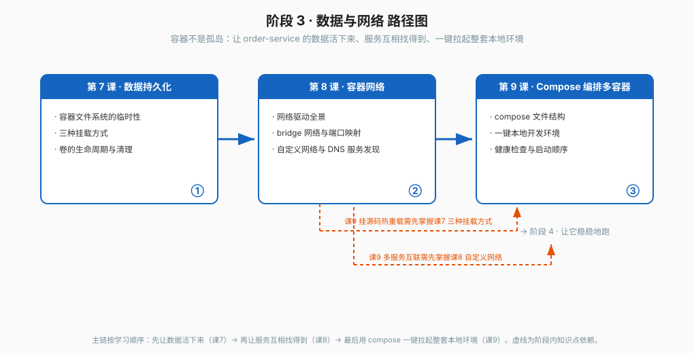

# 阶段 3：数据与网络

> 所属课程：Docker 系统学习 ｜ 故事章节：容器不是孤岛 ｜ 上一阶段：[阶段 2](../2-镜像工程/overview.md)

## 🎯 本阶段目标

- 让容器里的数据活过容器本身
- 说清端口映射与容器间通信，让服务互相找得到
- 用一个 compose 文件一键拉起完整本地开发环境

## 📍 学习重点

- 容器文件系统是临时的：容器删则可写层删；哪些数据必须外置
- volume / bind mount / tmpfs 的取舍，以及挂载会遮蔽镜像内原有内容
- 网络驱动定位（bridge / host / none / overlay / macvlan）
- 自定义 bridge 网络内按容器名做 DNS 解析，网络即隔离边界
- compose 的 services / networks / volumes 三段结构；Compose V1 已停更
- `depends_on` 只等启动不等就绪，健康检查才是就绪信号

## ✅ 必须掌握的知识点

| 知识点 | 所属课 | 学完应能 |
|--------|--------|----------|
| 容器文件系统的临时性 | 课 7 · 数据持久化 | 说清容器删了数据去哪了、写时复制的写放大、哪些数据必须外置 |
| 三种挂载方式 | 课 7 · 数据持久化 | 在 volume / bind mount / tmpfs 之间正确选择，并避开权限与遮蔽的坑 |
| 卷的生命周期与清理 | 课 7 · 数据持久化 | 区分命名卷与匿名卷，会清理孤儿卷并做基本备份迁移 |
| 网络驱动全景 | 课 8 · 容器网络 | 说清 bridge / host / none / overlay / macvlan 各自解决什么问题 |
| bridge 网络与端口映射 | 课 8 · 容器网络 | 正确使用 -p 与 -P，理解容器出网与端口冲突 |
| 自定义网络与 DNS 服务发现 | 课 8 · 容器网络 | 建自定义网络实现按容器名访问，并说清默认 bridge 为何做不到 |
| compose 文件结构 | 课 9 · Compose编排多容器 | 写出 services / networks / volumes 三段齐全的多服务 compose 文件 |
| 一键本地开发环境 | 课 9 · Compose编排多容器 | 用 up -d / down / logs -f / exec 管理全套环境，并挂源码做热重载 |
| 健康检查与启动顺序 | 课 9 · Compose编排多容器 | 用 HEALTHCHECK 与 condition: service_healthy 解决 depends_on 不解决的问题 |

## 🗺️ 本阶段路径图

## 本阶段产出

- [x] `lessons/lesson-07-数据持久化.md`
- [x] `lessons/lesson-08-容器网络.md`
- [x] `lessons/lesson-09-Compose编排多容器.md`
